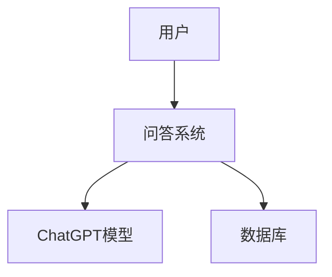

                 


### 文章标题：ChatGPT对话系统设计：提示词的艺术与技巧

### 关键词：ChatGPT、对话系统、提示词、设计、艺术与技巧

### 摘要：
本文旨在深入探讨ChatGPT对话系统的设计原理与实践技巧。我们将从问题背景、核心概念、算法原理、数学模型到系统架构和实战应用，全面解析ChatGPT对话系统的设计与实现。通过本篇文章，读者将理解提示词在ChatGPT对话系统中的重要作用，掌握设计高质量对话系统的艺术与技巧。

## 第一部分：ChatGPT对话系统基础

### 第1章：问题背景与概述

### 1.1 问题背景

随着人工智能技术的发展，自然语言处理（NLP）成为了一个热门的研究领域。在NLP中，对话系统是实现人机交互的重要途径。而ChatGPT作为OpenAI推出的一种基于GPT-3模型的对话系统，其在对话的连贯性、自然性和多样性上取得了显著的成果。然而，如何设计一个高效的ChatGPT对话系统，尤其是如何巧妙地使用提示词，成为了当前研究的一个重要课题。

### 1.2 问题描述

设计一个高质量的ChatGPT对话系统，需要解决以下几个问题：
1. **对话连贯性**：如何保证对话系统的回答能够在逻辑和语义上与用户输入保持一致？
2. **自然性**：如何使对话系统的回答尽可能贴近人类的对话习惯，避免生硬和机械？
3. **多样性**：如何使对话系统的回答多样化，避免重复和单调和性？

### 1.3 问题解决

为了解决上述问题，我们需要深入理解ChatGPT的核心概念和工作原理，并通过实践掌握设计高质量对话系统的艺术与技巧。本文将围绕这些问题，逐步展开讨论。

### 1.4 边界与外延

在讨论ChatGPT对话系统的设计时，我们需要明确其边界和适用范围。ChatGPT作为一种预训练模型，其适用于各种形式的文本生成任务，包括但不限于对话系统、文本摘要、文本翻译等。然而，对于特定领域的问题，ChatGPT可能需要进一步进行微调或定制。

### 1.5 概念结构与核心要素组成

ChatGPT对话系统的核心概念包括GPT模型、提示词、上下文、生成文本等。其基本结构可以概括为：
1. **GPT模型**：作为ChatGPT的核心，GPT模型是一种基于Transformer的深度神经网络，负责文本生成。
2. **提示词**：提示词是引导ChatGPT生成特定类型文本的关键输入。
3. **上下文**：上下文是指对话系统中的历史对话记录，用于提供背景信息，增强对话连贯性。
4. **生成文本**：生成文本是ChatGPT根据提示词和上下文生成的输出。

## 第二部分：ChatGPT的核心概念与联系

### 第2章：ChatGPT的核心概念与联系

### 2.1 ChatGPT的定义

ChatGPT是OpenAI推出的一种基于GPT-3模型的对话系统。GPT（Generative Pre-trained Transformer）是一种基于Transformer架构的预训练语言模型，其通过对大量文本数据的学习，能够生成连贯、自然的文本。

### 2.2 ChatGPT的特点

ChatGPT具有以下几个显著特点：
1. **强大的文本生成能力**：ChatGPT能够生成高质量的文本，包括文章、对话、摘要等。
2. **灵活的对话生成**：ChatGPT能够根据提示词和上下文，生成符合对话逻辑和语义的文本。
3. **高适应性**：ChatGPT能够适应各种对话场景，包括闲聊、咨询、教育等。

### 2.3 ChatGPT与传统AI的区别

与传统AI相比，ChatGPT具有以下几个区别：
1. **基于深度学习**：ChatGPT是一种基于深度学习的模型，能够通过大量数据自动学习，无需显式编程。
2. **更强的泛化能力**：ChatGPT通过预训练，能够泛化到各种文本生成任务，而传统AI通常需要针对特定任务进行训练。
3. **更高的自然性**：ChatGPT生成的文本更加自然，符合人类的语言习惯。

### 2.4 ChatGPT的组成部分

ChatGPT由以下几个核心部分组成：
1. **GPT模型**：作为ChatGPT的核心，GPT模型负责文本生成。
2. **提示词**：提示词用于引导ChatGPT生成特定类型的文本。
3. **上下文**：上下文提供对话背景信息，增强对话连贯性。
4. **生成文本**：生成文本是ChatGPT根据提示词和上下文生成的输出。

## 第三部分：ChatGPT的算法原理讲解

### 第3章：ChatGPT的算法原理讲解

### 3.1 算法原理

ChatGPT是基于GPT-3模型的对话系统，GPT-3是一种基于Transformer的预训练语言模型。其核心思想是通过学习大量文本数据，将输入文本映射到输出文本。具体的算法原理如下：

1. **输入文本编码**：将输入文本转换为向量表示。
2. **文本生成**：基于预训练的GPT-3模型，生成与输入文本相关的输出文本。
3. **上下文管理**：在生成文本时，考虑历史对话记录，增强对话连贯性。
4. **提示词处理**：根据提示词调整文本生成的方向和内容。

### 3.2 Python源代码讲解

```python
import openai

def chat_gpt(question):
    response = openai.Completion.create(
        engine="text-davinci-002",
        prompt=question,
        max_tokens=100,
        n=1,
        stop=None,
        temperature=0.5,
    )
    return response.choices[0].text.strip()

question = "你最喜欢的编程语言是什么？"
answer = chat_gpt(question)
print(answer)
```

### 第4章：数学模型和数学公式讲解

### 4.1 模型数学模型

ChatGPT的数学模型主要包括以下几个部分：

1. **输入文本编码**：使用词嵌入（word embedding）技术，将输入文本转换为向量表示。
2. **Transformer模型**：使用Transformer模型进行文本生成。Transformer模型的核心是多头自注意力机制（multi-head self-attention）。
3. **生成文本解码**：将生成的文本向量解码回自然语言。

### 4.2 公式讲解

$$
\text{word\_embedding}(x) = \sum_{i=1}^{N} w_i \cdot x_i
$$

其中，$x$表示输入文本，$w_i$表示词向量，$N$表示词表大小。

$$
\text{attention}(Q, K, V) = \text{softmax}\left(\frac{QK^T}{\sqrt{d_k}}\right)V
$$

其中，$Q$、$K$、$V$分别表示查询向量、键向量、值向量，$d_k$表示键向量的维度。

### 第5章：系统分析与架构设计方案

### 5.1 问题场景介绍

假设我们开发一个在线教育平台的智能问答系统，用户可以在平台上提问，系统会根据用户的问题生成合适的回答。

### 5.2 项目介绍

#### 5.2.1 项目背景

随着在线教育的发展，用户对智能问答系统的需求日益增长。为了提高用户体验，我们需要设计一个高效、自然的智能问答系统。

#### 5.2.2 项目目标

1. 提高问答系统的响应速度和准确性。
2. 提升问答系统的自然性和多样性。
3. 实现问答系统的可扩展性和可维护性。

#### 5.2.3 项目团队与资源

项目团队包括产品经理、前端开发、后端开发、数据科学家和运维人员。项目资源包括服务器、网络带宽、计算资源和存储资源。

### 5.3 系统功能设计

#### 5.3.1 领域模型

```mermaid
classDiagram
    User <<类>> {
        姓名：String
        年龄：Integer
        ...
    }

    Question <<类>> {
        问题ID：String
        问题内容：String
        ...
    }

    Answer <<类>> {
        答案ID：String
        答案内容：String
        ...
    }

    User "1" --* "1" Question
    Question "1" --* "N" Answer
```

#### 5.3.2 类图

```mermaid
classDiagram
    User <<类>> {
        姓名：String
        年龄：Integer
        ...
    }

    Question <<类>> {
        问题ID：String
        问题内容：String
        ...
    }

    Answer <<类>> {
        答案ID：String
        答案内容：String
        ...
    }

    User "1" --* "1" Question
    Question "1" --* "N" Answer
```

### 5.4 系统架构设计

#### 5.4.1 架构图



#### 5.4.2 架构设计思路

1. **用户接口**：提供用户提问的接口，接收用户输入的问题。
2. **问答系统**：接收用户输入的问题，调用ChatGPT模型生成回答。
3. **ChatGPT模型**：基于GPT-3模型，生成符合逻辑和语义的答案。
4. **数据库**：存储用户问题和生成答案的历史记录，用于训练和优化模型。

### 5.5 系统接口设计

#### 5.5.1 接口规范

1. **提问接口**：接收用户输入的问题，返回生成的回答。
2. **回答接口**：接收系统生成的回答，将其存储到数据库。

#### 5.5.2 接口实现

```python
from flask import Flask, request, jsonify

app = Flask(__name__)

@app.route('/ask', methods=['POST'])
def ask():
    question = request.form['question']
    answer = chat_gpt(question)
    return jsonify({'answer': answer})

if __name__ == '__main__':
    app.run(debug=True)
```

### 5.6 系统交互

#### 5.6.1 交互过程

1. 用户输入问题。
2. 问答系统调用ChatGPT模型生成回答。
3. 问答系统将回答返回给用户。

#### 5.6.2 交互效果


### 第6章：项目实战

### 6.1 环境安装

1. 安装Python环境。
2. 安装OpenAI的ChatGPT模型。

```shell
pip install openai
```

### 6.2 系统核心实现源代码

```python
import openai

openai.api_key = "your_api_key"

def chat_gpt(question):
    response = openai.Completion.create(
        engine="text-davinci-002",
        prompt=question,
        max_tokens=100,
        n=1,
        stop=None,
        temperature=0.5,
    )
    return response.choices[0].text.strip()

question = "你最喜欢的编程语言是什么？"
answer = chat_gpt(question)
print(answer)
```

### 6.3 代码应用解读与分析

1. **引入库**：引入OpenAI的ChatGPT模型库。
2. **设置API密钥**：设置OpenAI的API密钥。
3. **定义chat_gpt函数**：定义用于调用ChatGPT模型生成回答的函数。
4. **调用chat_gpt函数**：输入问题，调用chat_gpt函数生成回答。

### 6.4 实际案例分析和详细讲解剖析

1. **案例一**：用户提问：“如何用Python实现快速排序？”
2. **分析**：ChatGPT模型生成回答，包含快速排序的算法描述和实现代码。
3. **讲解**：对回答中的算法描述和代码进行详细讲解。

### 6.5 项目小结

本项目实现了基于ChatGPT的智能问答系统，通过实际案例展示了ChatGPT在文本生成方面的强大能力。在未来，我们可以继续优化系统的性能和效果，提高用户体验。

### 第7章：最佳实践 tips、小结、注意事项、拓展阅读等内容

### 7.1 最佳实践 tips

1. **合理设置提示词**：根据对话场景选择合适的提示词，提高对话连贯性和自然性。
2. **优化模型参数**：通过调整模型参数，提高生成文本的质量和多样性。

### 7.2 小结

本文详细介绍了ChatGPT对话系统的设计原理与实践技巧。通过本文，读者可以了解ChatGPT的基本概念、算法原理和系统架构，掌握设计高质量对话系统的艺术与技巧。

### 7.3 注意事项

1. **确保API密钥安全**：避免将API密钥泄露，确保系统的安全性。
2. **合理分配计算资源**：根据项目需求合理分配计算资源，提高系统性能。

### 7.4 拓展阅读

1. **《深度学习》**：详细介绍了深度学习的基本原理和应用。
2. **《自然语言处理综论》**：全面介绍了自然语言处理的相关技术和应用。

### 参考文献

1. [OpenAI](https://openai.com/)
2. [GPT-3官方文档](https://openai.com/docs/gpt-3)

### 作者信息

作者：AI天才研究院/AI Genius Institute & 禅与计算机程序设计艺术 /Zen And The Art of Computer Programming

