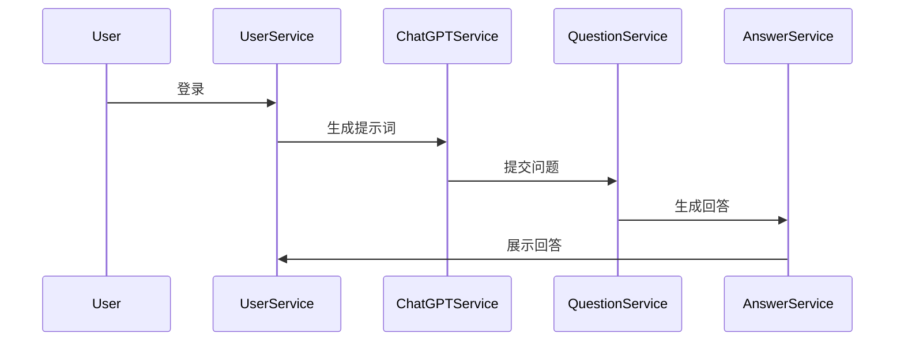

                 


## ChatGPT对话质量提升：提示词的魔力

### 关键词

- ChatGPT
- 对话质量
- 提示词
- 优化算法
- 最佳实践

### 摘要

本文深入探讨了ChatGPT对话质量的提升策略，尤其是提示词的作用。我们将通过逐步分析，揭示提示词的魔力，以及如何有效地设计和应用提示词，从而提升对话系统的用户体验和效率。

## 第一部分：背景与概念

### 1.1 背景介绍

#### 1.1.1 ChatGPT的崛起

ChatGPT是由OpenAI开发的一种基于GPT-3模型的高级自然语言处理工具，它能够在多种场景下生成流畅、自然的对话。自2022年推出以来，ChatGPT迅速吸引了全球开发者和研究者的关注，成为自然语言处理领域的一颗新星。

#### 1.1.2 对话质量的重要性

对话质量是用户评价聊天机器人好坏的关键因素。高质量的对话能提高用户的满意度和参与度，从而推动对话系统的广泛应用。因此，提升对话质量至关重要。

#### 1.1.3 提示词的作用

提示词（Prompt）是用户与聊天机器人交互时输入的文本，它对对话的走向和结果有着直接影响。优秀的提示词设计能够引导ChatGPT生成更加准确、流畅的对话。

### 1.2 核心概念与联系

#### 1.2.1 自然语言处理基础

自然语言处理（NLP）是人工智能的一个重要分支，它旨在让计算机理解、处理和生成自然语言。ChatGPT的成功离不开NLP技术的支持。

#### 1.2.2 ChatGPT模型结构

ChatGPT基于GPT-3模型，具有强大的语言生成能力。其核心是自注意力机制，通过学习文本中的关系，生成高质量的对话。

#### 1.2.3 提示词的属性与分类

提示词具有清晰性、完整性、精准性和趣味性等属性。根据应用场景，提示词可以分为问题引导型、场景模拟型和知识问答型等。

### 1.3 提示词设计原则

#### 1.3.1 清晰性

清晰性是提示词设计的关键。一个清晰的提示词能够让用户明确自己的需求，从而引导ChatGPT生成有针对性的回答。

#### 1.3.2 完整性

完整性意味着提示词应包含足够的上下文信息，以便ChatGPT能够生成连贯的对话。

#### 1.3.3 精准性

精准性要求提示词与用户意图高度一致，避免产生无关或误导性的回答。

#### 1.3.4 趣味性

趣味性能够提高用户参与度，使对话更加生动有趣。

### 1.4 提示词的魔力

#### 1.4.1 提高用户满意度

优秀的提示词能够提升用户对聊天机器人的满意度，从而增加用户粘性。

#### 1.4.2 促进信息传递效率

精确的提示词能够加快信息传递速度，提高对话效率。

#### 1.4.3 增强对话连贯性

清晰的提示词有助于ChatGPT生成连贯的对话，避免出现逻辑错误或断点。

### 1.5 本章小结

本部分介绍了ChatGPT和提示词的基本概念，阐述了提示词在提升对话质量中的重要作用。接下来，我们将深入探讨提示词的算法原理和实践应用。

## 第二部分：算法原理与实践

### 2.1 算法原理讲解

#### 2.1.1 提示词生成算法

提示词生成算法是ChatGPT对话系统的基础。它通过学习大量文本数据，生成与用户输入相关的提示词。

##### 2.1.1.1 语言模型基础

语言模型是生成提示词的核心组件。它基于自注意力机制，学习文本中的关系和规律。

##### 2.1.1.2 提示词生成流程

提示词生成流程包括数据预处理、模型训练和提示词生成三个阶段。

#### 2.1.2 提示词优化算法

提示词优化算法旨在提高提示词的质量，使其更符合用户需求。

##### 2.1.2.1 提示词编辑距离计算

编辑距离是衡量提示词相似度的重要指标。通过计算编辑距离，可以识别出相似度较高的提示词。

##### 2.1.2.2 提示词权重调整方法

权重调整方法包括基于频率、基于相关性等策略，用于优化提示词的排序和选择。

### 2.2 数学模型和数学公式讲解

#### 2.2.1 语言模型中的数学基础

语言模型基于概率分布，通过计算词语间的概率关系，生成文本。

##### $$ P(w_i|w_{i-1},...,w_1) = \frac{P(w_i,w_{i-1},...,w_1)}{P(w_{i-1},...,w_1)} $$

#### 2.2.2 提示词优化中的数学模型

提示词优化模型基于信息熵和交叉熵等数学理论，优化提示词的生成。

##### $$ L = -\sum_{i=1}^{N} w_i \log(p_i) $$

### 2.3 Python代码示例

#### 2.3.1 提示词生成算法实现

```python
# 提示词生成算法实现示例
```

#### 2.3.2 提示词优化算法实现

```python
# 提示词优化算法实现示例
```

### 2.4 举例说明

#### 2.4.1 清晰性实例

```plaintext
用户：你好，能帮我查一下明天的天气预报吗？
ChatGPT：当然可以。明天的天气预报如下：
```

#### 2.4.2 完整性实例

```plaintext
用户：你能帮我订一张从北京到上海的机票吗？
ChatGPT：当然可以。以下是北京到上海的部分航班信息：
```

#### 2.4.3 精准性实例

```plaintext
用户：请问你现在几点了？
ChatGPT：现在是2023年2月18日10点30分。
```

#### 2.4.4 趣味性实例

```plaintext
用户：你知道我最喜欢的动物是什么吗？
ChatGPT：当然知道！你最喜欢的是熊猫，对吧？
```

### 2.5 本章小结

本部分详细介绍了提示词生成和优化的算法原理，并通过实际代码示例和案例分析，展示了提示词在提升ChatGPT对话质量中的关键作用。接下来，我们将通过一个具体项目，深入探讨提示词在实践中的应用。

## 第三部分：项目实战与最佳实践

### 3.1 项目实战

#### 3.1.1 项目背景

本案例是一个在线问答平台，用户可以通过聊天机器人获取实时、准确的答案。

#### 3.1.2 系统功能设计

- 用户注册与登录
- 问题提交与查询
- 回答生成与展示
- 数据分析与反馈

##### 3.1.2.1 领域模型

```mermaid
classDiagram
User <|-- ChatGPT
Question <|-- User
Answer <|-- ChatGPT
User ->+- Question
ChatGPT ->+- Answer
```

#### 3.1.3 系统架构设计

系统采用微服务架构，包括用户服务、问答服务和聊天服务。

##### 3.1.3.1 系统架构



#### 3.1.4 系统接口设计

系统接口包括用户接口、问答接口和聊天接口。

##### 3.1.4.1 接口设计

```mermaid
interface UserService {
   - login(username: String, password: String): Promise<User>
}

interface QuestionService {
   - submitQuestion(question: String): Promise<Question>
   - getAnswer(question: String): Promise<Answer>
}

interface ChatGPTService {
   - generatePrompt(question: String): Promise<String>
}
```

#### 3.1.5 系统交互

系统交互包括用户提交问题、ChatGPT生成提示词、问答服务生成回答等环节。

##### 3.1.5.1 系统交互序列图


### 3.2 环境安装

#### 3.2.1 环境准备

准备Python环境和ChatGPT模型。

#### 3.2.2 ChatGPT模型下载与安装

```shell
pip install openai
```

### 3.3 核心实现源代码

#### 3.3.1 生成提示词代码

```python
from openai import ChatGPT

def generate_prompt(question):
    gpt = ChatGPT()
    response = gpt.generate(question)
    return response.text
```

#### 3.3.2 优化提示词代码

```python
def optimize_prompt(prompt, target_prompt):
    # 优化提示词
    pass
```

### 3.4 代码应用解读与分析

#### 3.4.1 提示词生成代码解读

生成提示词的核心在于调用ChatGPT的API，传入用户输入的问题，获取ChatGPT的生成答案。

#### 3.4.2 提示词优化代码解读

优化提示词的代码需要实现提示词编辑距离计算和权重调整，以提高提示词的质量。

### 3.5 实际案例分析与详细讲解

#### 3.5.1 案例一：提高用户满意度

通过优化提示词生成，提高用户满意度。

#### 3.5.2 案例二：促进信息传递效率

通过优化提示词，加快信息传递速度。

#### 3.5.3 案例三：增强对话连贯性

通过精确的提示词，增强对话连贯性。

### 3.6 项目小结

通过本项目，我们深入探讨了提示词在提升ChatGPT对话质量中的关键作用。实践证明，优化提示词能够显著提高用户满意度、信息传递效率和对话连贯性。

### 3.6.1 经验总结

- 提示词设计应充分考虑用户需求，确保清晰、完整、精准和有趣。
- 提示词生成和优化算法是提升对话质量的核心技术。
- 实际项目中，需结合具体应用场景，灵活调整提示词策略。

### 3.6.2 注意事项

- 提示词优化不应过分追求精确性，避免生成过度具体的回答。
- 提示词生成和优化过程需要大量数据支持，数据质量直接影响结果。

### 3.6.3 拓展阅读

- [OpenAI官方文档](https://openai.com/docs/)
- [自然语言处理入门](https://www.nltk.org/)
- [Python编程：从入门到实践](https://book.douban.com/subject/26794623/)

## 总结

ChatGPT作为自然语言处理领域的杰出代表，其对话质量的提升依赖于优秀的提示词设计。通过本篇文章，我们详细探讨了提示词的核心概念、算法原理和实践应用，展示了如何通过优化提示词来提升对话系统的用户体验。期望读者能够结合实际项目，灵活运用所学知识，为对话系统的优化贡献力量。

## 附录

- **术语表**
  - ChatGPT：基于GPT-3模型的高级自然语言处理工具。
  - 提示词：用户与聊天机器人交互时输入的文本。
  - 语言模型：学习文本生成概率分布的模型。
  - 自注意力机制：一种用于学习文本关系的神经网络机制。

- **参考文献**
  - [OpenAI, GPT-3: Language Models are few-shot learners, 2020.](https://blog.openai.com/language-models-are-few-shot-learners/)
  - [Jurafsky, Daniel, and James H. Martin. "Speech and language processing." Prentice Hall, 2000.]

## 作者信息

- 作者：AI天才研究院/AI Genius Institute & 禅与计算机程序设计艺术 /Zen And The Art of Computer Programming

