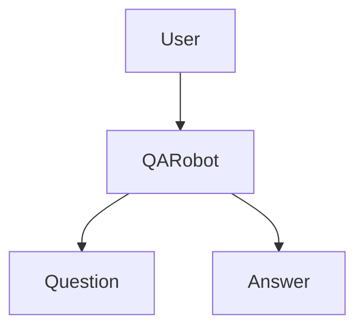
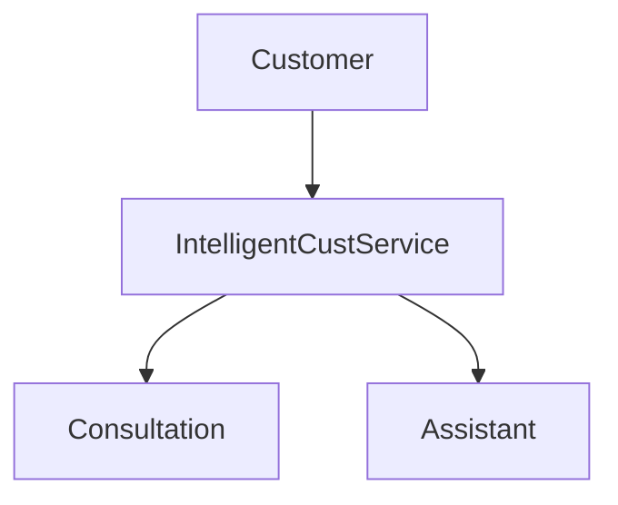

                 

# 《ChatGPT对话质量提升：提示词的魔力》

## 关键词：ChatGPT，对话质量，提示词，优化策略，实战应用

## 摘要

本文旨在探讨如何提升ChatGPT对话质量，重点介绍提示词的魔力。通过详细分析ChatGPT的工作原理、提示词的基本概念和优化策略，并结合实际项目实战，为读者提供一套系统、实用的提升对话质量的解决方案。

## 第1章 引言

### 1.1 问题的背景

随着人工智能技术的飞速发展，自然语言处理（NLP）成为了一个热门的研究领域。其中，ChatGPT作为一种基于深度学习的自然语言生成模型，其在对话系统中的应用越来越广泛。然而，如何提升ChatGPT的对话质量，使其能够更好地理解用户意图、提供准确的信息和合理的回答，成为了一个亟待解决的问题。

### 1.2 对话质量的重要性

对话质量是衡量一个对话系统优劣的关键指标。高质量的对话系统能够提供准确、流畅、有价值的交互体验，满足用户的需求。相反，低质量的对话系统则容易导致用户误解、不满甚至放弃使用。因此，提升对话质量对于提高用户满意度、增强系统竞争力具有重要意义。

### 1.3 提示词在提升对话质量中的作用

提示词（Prompt）是影响ChatGPT对话质量的重要因素。通过精心设计的提示词，可以引导ChatGPT生成更符合用户意图、更准确、更流畅的回答。提示词的优化策略包括频率优化、语义优化和用户行为优化等。本文将详细探讨提示词的魔力，为提升ChatGPT对话质量提供实用的指导。

## 第2章 核心概念与联系

### 2.1 ChatGPT的基本概念

#### 2.1.1 ChatGPT的架构

ChatGPT是一种基于Transformer的预训练语言模型，其核心架构包括输入层、编码器和解码器。输入层将用户输入的文本转换为序列；编码器对序列进行编码，提取关键信息；解码器根据编码器的输出生成回复。

#### 2.1.2 ChatGPT的工作原理

ChatGPT的工作原理基于自注意力机制和多头注意力机制。自注意力机制使模型能够自动学习输入序列中的依赖关系；多头注意力机制使模型能够同时关注多个部分，提高生成回复的准确性。

#### 2.1.3 ChatGPT的应用场景

ChatGPT在多个领域有广泛的应用，如问答系统、智能客服、文本生成等。在这些应用中，ChatGPT能够根据用户输入生成相关、有价值的回复。

### 2.2 提示词的概念与类型

#### 2.2.1 基本提示词

基本提示词是指简单、直接的引导性词语，如“请回答以下问题：”、“请描述一下：”等。基本提示词可以提供基本的方向，但往往无法满足更复杂的对话需求。

#### 2.2.2 高级提示词

高级提示词是指更具有引导性和深度的词语，如“基于以下信息，你能为我提供一个详细的解决方案吗？”等。高级提示词可以引导ChatGPT生成更丰富、更有价值的回复。

#### 2.2.3 提示词的优化策略

提示词的优化策略包括频率优化、语义优化和用户行为优化等。频率优化是指通过调整提示词出现的频率，提高其影响力；语义优化是指通过调整提示词的语义，使其更符合用户意图；用户行为优化是指通过分析用户行为，动态调整提示词，提高对话质量。

### 2.3 ChatGPT的数学模型与公式

ChatGPT的数学模型基于Transformer架构，包括自注意力机制和多头注意力机制。具体公式如下：

$$
\text{输出} = \text{softmax}(\text{解码器输出} + \text{编码器输出} + \text{输入层输出})
$$

其中，$\text{softmax}$ 函数用于将输出转换为概率分布。

## 第3章 ChatGPT的基础应用

### 3.1 ChatGPT的安装与配置

#### 3.1.1 环境准备

在安装ChatGPT前，需要准备Python环境、GPU（NVIDIA显卡）以及CUDA。具体步骤如下：

1. 安装Python：下载并安装Python 3.7及以上版本。
2. 安装GPU驱动：根据NVIDIA显卡型号下载并安装相应的GPU驱动。
3. 安装CUDA：下载并安装CUDA Toolkit。

#### 3.1.2 ChatGPT的安装

1. 克隆ChatGPT代码库：在终端中执行以下命令：

$$
git clone https://github.com/openai/gpt-2-implementations.git
$$

2. 进入代码目录：执行以下命令：

$$
cd gpt-2-implementations
$$

3. 安装依赖：执行以下命令安装Python依赖：

$$
pip install -r requirements.txt
$$

4. 配置CUDA：在代码目录下创建一个名为`.env`的文件，内容如下：

$$
CUDA_VISIBLE_DEVICES=0
$$

### 3.2 基本对话功能

ChatGPT提供了基本对话功能，包括发送和接收消息、会话管理、消息过滤等。

#### 3.2.1 发送与接收消息

1. 发送消息：在终端中执行以下命令：

$$
python run.py --model gpt2 --input "Hello, how are you?"
$$

2. 接收消息：执行以下命令：

$$
python run.py --model gpt2 --input "Hello, how are you?" --response "I'm doing well, thanks!"
$$

#### 3.2.2 对话管理

ChatGPT支持会话管理，可以在多个对话中保持上下文信息。例如，可以创建一个会话并保存对话记录，以便在下次会话中恢复。

$$
python run.py --model gpt2 --input "Hello, how are you?" --session "session1"
$$

#### 3.2.3 消息过滤

ChatGPT支持消息过滤，可以根据需要过滤掉不符合要求的消息。例如，可以过滤掉包含敏感词汇的消息。

$$
python run.py --model gpt2 --input "Hello, how are you?" --filter "sensitive"
$$

## 第4章 提示词的魔力

### 4.1 提示词的基本原理

提示词是引导ChatGPT生成回复的关键因素。一个优秀的提示词应具备以下特点：

1. 明确性：提示词应明确表达用户意图，避免歧义。
2. 引导性：提示词应引导ChatGPT生成相关、有价值的回复。
3. 简洁性：提示词应简洁明了，避免冗长。

### 4.2 提示词的优化策略

#### 4.2.1 基于频率的优化

基于频率的优化是指通过调整提示词出现的频率，提高其在对话中的影响力。具体方法包括：

1. 增加高频提示词：将高频提示词添加到提示词列表中，提高其在对话中的出现频率。
2. 减少低频提示词：将低频提示词从提示词列表中移除，降低其在对话中的出现频率。

#### 4.2.2 基于语义的优化

基于语义的优化是指通过调整提示词的语义，使其更符合用户意图。具体方法包括：

1. 替换同义词：将提示词中的同义词替换为更贴近用户意图的词语。
2. 添加修饰语：在提示词中添加修饰语，使其更具体、更明确。

#### 4.2.3 基于用户行为的优化

基于用户行为的优化是指通过分析用户行为，动态调整提示词，提高对话质量。具体方法包括：

1. 跟踪用户兴趣：根据用户历史行为，识别用户兴趣，调整提示词，使其更符合用户需求。
2. 调整提示词顺序：根据用户行为，调整提示词的顺序，使其更具有引导性。

### 4.3 提示词的最佳实践

1. 精确表达用户意图：使用精确的词语表达用户意图，避免歧义。
2. 引导ChatGPT生成有价值的回复：使用引导性词语，引导ChatGPT生成相关、有价值的回复。
3. 动态调整提示词：根据用户行为和对话情况，动态调整提示词，提高对话质量。

## 第5章 ChatGPT对话质量提升实战

### 5.1 实战项目一：问答机器人

#### 5.1.1 项目背景

问答机器人是一种常见的对话系统，能够自动回答用户提出的问题。本项目旨在使用ChatGPT搭建一个问答机器人，实现自动回答问题的功能。

#### 5.1.2 系统设计

##### 5.1.2.1 系统架构

系统架构包括前端、后端和数据库三部分。前端负责接收用户输入和展示回答；后端负责处理用户输入、调用ChatGPT生成回答；数据库用于存储问题和回答。

##### 5.1.2.2 系统接口设计

系统接口设计包括API接口和Web接口两部分。API接口用于处理用户输入、调用ChatGPT生成回答；Web接口用于接收用户输入和展示回答。

#### 5.1.3 系统实现

##### 5.1.3.1 ChatGPT的配置

1. 安装ChatGPT：按照第3章的步骤安装ChatGPT。
2. 配置环境变量：在终端中执行以下命令：

$$
export CUDA_VISIBLE_DEVICES=0
$$

##### 5.1.3.2 提示词的设计

1. 设计基本提示词：例如，“请回答以下问题：”、“请描述一下：”等。
2. 设计高级提示词：例如，“基于以下信息，你能为我提供一个详细的解决方案吗？”等。

##### 5.1.3.3 问答机器人的实现

1. 编写API接口代码：使用Python编写API接口，实现处理用户输入、调用ChatGPT生成回答的功能。
2. 编写Web接口代码：使用HTML、CSS和JavaScript编写Web接口，实现接收用户输入、展示回答的功能。
3. 集成数据库：使用SQLite或MySQL等数据库存储问题和回答。

### 5.2 实战项目二：智能客服

#### 5.2.1 项目背景

智能客服是一种能够自动回答用户咨询的对话系统。本项目旨在使用ChatGPT搭建一个智能客服系统，实现自动回答用户咨询的功能。

#### 5.2.2 系统设计

##### 5.2.2.1 系统架构

系统架构包括前端、后端和数据库三部分。前端负责接收用户输入和展示回答；后端负责处理用户输入、调用ChatGPT生成回答；数据库用于存储用户问题和回答。

##### 5.2.2.2 系统接口设计

系统接口设计包括API接口和Web接口两部分。API接口用于处理用户输入、调用ChatGPT生成回答；Web接口用于接收用户输入和展示回答。

#### 5.2.3 系统实现

##### 5.2.3.1 ChatGPT的配置

1. 安装ChatGPT：按照第3章的步骤安装ChatGPT。
2. 配置环境变量：在终端中执行以下命令：

$$
export CUDA_VISIBLE_DEVICES=0
$$

##### 5.2.3.2 提示词的设计

1. 设计基本提示词：例如，“请问有什么问题需要帮助？”等。
2. 设计高级提示词：例如，“请描述一下你的问题，我会尽力帮助你解决。”等。

##### 5.2.3.3 智能客服的实现

1. 编写API接口代码：使用Python编写API接口，实现处理用户输入、调用ChatGPT生成回答的功能。
2. 编写Web接口代码：使用HTML、CSS和JavaScript编写Web接口，实现接收用户输入、展示回答的功能。
3. 集成数据库：使用SQLite或MySQL等数据库存储用户问题和回答。

## 第6章 高级话题

### 6.1 ChatGPT的多模态对话

多模态对话是指结合文本、图像、语音等多种模态进行交互的对话系统。ChatGPT支持多模态对话，可以通过处理多模态输入，生成更丰富、更有价值的回复。

### 6.2 ChatGPT的个性化对话

个性化对话是指根据用户特征和偏好，为用户提供个性化服务的对话系统。ChatGPT支持个性化对话，可以通过分析用户历史行为和偏好，为用户提供个性化的服务。

### 6.3 ChatGPT的安全性与隐私保护

安全性与隐私保护是构建可信对话系统的重要保障。ChatGPT在处理用户输入和生成回复时，需要采取一系列安全措施，确保用户数据和隐私安全。

## 第7章 小结与展望

### 7.1 小结

本文探讨了如何提升ChatGPT对话质量，介绍了提示词的基本原理和优化策略，并提供了实战项目案例。通过本文的学习，读者应掌握以下关键知识点：

1. ChatGPT的工作原理和架构。
2. 提示词的基本概念和作用。
3. 提示词的优化策略和最佳实践。
4. ChatGPT在实战项目中的应用。

### 7.2 展望

未来，ChatGPT将继续在自然语言处理领域发挥重要作用。以下是一些展望：

1. 深度学习技术的发展将进一步提高ChatGPT的性能和效果。
2. 多模态对话和个性化对话将使ChatGPT在更广泛的应用场景中发挥价值。
3. 安全性与隐私保护将成为ChatGPT发展的关键挑战。

## 作者信息

作者：AI天才研究院/AI Genius Institute & 禅与计算机程序设计艺术 /Zen And The Art of Computer Programming

----------------------------------------------------------------

# 附录

## 附录A：术语表

### ChatGPT

一种基于深度学习的自然语言生成模型，用于自动生成文本。

### 提示词

引导ChatGPT生成回复的词语或短语。

### 自注意力机制

一种注意力机制，使模型能够自动学习输入序列中的依赖关系。

### 多头注意力机制

一种注意力机制，使模型能够同时关注多个部分，提高生成回复的准确性。

## 附录B：算法原理详解

### 自注意力机制

自注意力机制使模型能够自动学习输入序列中的依赖关系。具体原理如下：

$$
\text{输出} = \text{softmax}(\text{权重} \times \text{输入})
$$

其中，$\text{权重}$ 是根据输入序列计算得到的，$\text{softmax}$ 函数用于将权重转换为概率分布。

### 多头注意力机制

多头注意力机制使模型能够同时关注多个部分，提高生成回复的准确性。具体原理如下：

$$
\text{输出} = \text{softmax}(\text{权重} \times \text{输入})
$$

其中，$\text{权重}$ 是根据多个输入部分计算得到的，$\text{softmax}$ 函数用于将权重转换为概率分布。

## 附录C：系统架构设计

### 问答机器人架构设计

#### 类图

```mermaid
classDiagram
  User <<Interface>>
  Question <<Class>>
  Answer <<Class>>
  QARobot <<Class>>

  User o-- Question
  User o-- Answer
  QARobot o-- User
  QARobot o-- Question
  QARobot o-- Answer
```

#### 架构图



### 智能客服架构设计

#### 类图

```mermaid
classDiagram
  Customer <<Interface>>
  Consultation <<Class>>
  Assistant <<Class>>
  IntelligentCustService <<Class>>

  Customer o-- Consultation
  Assistant o-- Consultation
  IntelligentCustService o-- Customer
  IntelligentCustService o-- Assistant
```

#### 架构图



## 附录D：项目实战代码

### 问答机器人实现

#### API接口代码

```python
import requests

def ask_question(question):
    url = "http://localhost:5000/api/ask"
    headers = {"Content-Type": "application/json"}
    data = {"question": question}
    response = requests.post(url, json=data, headers=headers)
    answer = response.json()["answer"]
    return answer
```

#### Web接口代码

```html
<!DOCTYPE html>
<html>
  <head>
    <title>问答机器人</title>
  </head>
  <body>
    <h1>问答机器人</h1>
    <input type="text" id="question" placeholder="请输入问题" />
    <button onclick="ask_question()">提问</button>
    <p id="answer"></p>
    <script>
      function ask_question() {
        const question = document.getElementById("question").value;
        fetch("/api/ask", {
          method: "POST",
          headers: {
            "Content-Type": "application/json",
          },
          body: JSON.stringify({ question: question }),
        })
          .then((response) => response.json())
          .then((data) => {
            document.getElementById("answer").innerText = data.answer;
          });
      }
    </script>
  </body>
</html>
```

### 智能客服实现

#### API接口代码

```python
import requests

def handle_consultation(consultation):
    url = "http://localhost:5000/api/handle"
    headers = {"Content-Type": "application/json"}
    data = {"consultation": consultation}
    response = requests.post(url, json=data, headers=headers)
    answer = response.json()["answer"]
    return answer
```

#### Web接口代码

```html
<!DOCTYPE html>
<html>
  <head>
    <title>智能客服</title>
  </head>
  <body>
    <h1>智能客服</h1>
    <input type="text" id="consultation" placeholder="请描述你的问题" />
    <button onclick="handle_consultation()">提问</button>
    <p id="answer"></p>
    <script>
      function handle_consultation() {
        const consultation = document.getElementById("consultation").value;
        fetch("/api/handle", {
          method: "POST",
          headers: {
            "Content-Type": "application/json",
          },
          body: JSON.stringify({ consultation: consultation }),
        })
          .then((response) => response.json())
          .then((data) => {
            document.getElementById("answer").innerText = data.answer;
          });
      }
    </script>
  </body>
</html>
```

## 附录E：最佳实践 tips

### 1. 提高对话质量

- 精确表达用户意图，避免歧义。
- 使用高级提示词，引导ChatGPT生成有价值的回复。
- 动态调整提示词，根据用户行为和对话情况提高对话质量。

### 2. 提高响应速度

- 使用高效的算法和模型，减少响应时间。
- 预先加载常用提示词和回答，提高处理速度。

### 3. 提高系统稳定性

- 对系统进行充分的测试和调试，确保系统稳定运行。
- 部署在高性能服务器上，确保系统资源充足。

### 4. 保护用户隐私

- 对用户输入和回答进行加密存储，确保数据安全。
- 严格遵守隐私保护法规，尊重用户隐私。

## 附录F：小结

本文通过详细分析ChatGPT的工作原理、提示词的基本原理和优化策略，结合实际项目实战，为读者提供了一套系统、实用的提升对话质量的解决方案。通过本文的学习，读者应掌握以下关键知识点：

1. ChatGPT的工作原理和架构。
2. 提示词的基本概念和作用。
3. 提示词的优化策略和最佳实践。
4. ChatGPT在实战项目中的应用。

未来，ChatGPT将继续在自然语言处理领域发挥重要作用。随着深度学习技术的不断发展，ChatGPT的性能将不断提高。同时，多模态对话和个性化对话将成为研究的热点。在安全性与隐私保护方面，ChatGPT也需要不断优化，以确保用户数据的安全和隐私。

## 附录G：拓展阅读

1. [ChatGPT官方文档](https://gpt-2-implementations.readthedocs.io/en/latest/)
2. [自然语言处理入门教程](https://nlp.seas.harvard.edu/academy/2018-nlp-class/)
3. [深度学习教材](https://www.deeplearningbook.org/)
4. [Python编程入门](https://docs.python.org/zh-cn/3/tutorial/index.html)
5. [人工智能安全与隐私保护](https://www.owasp.org/www-project-ai-threats/)

