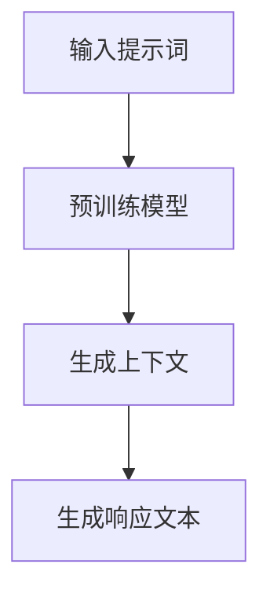
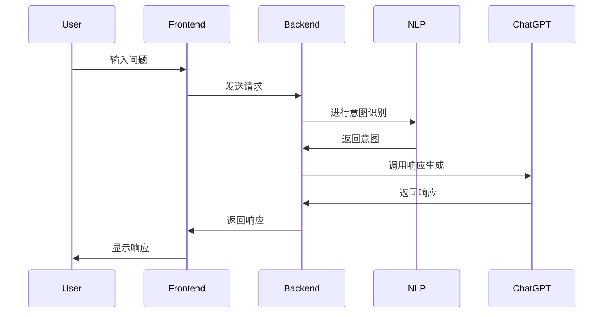

                 

## 文章标题

> 关键词：ChatGPT、提示词优化、自然语言处理、深度学习、算法原理

> 摘要：本文将深入探讨ChatGPT提示词优化的方法，从基础到高级，详细介绍如何通过调整提示词来提升聊天机器人的响应质量。我们将分析ChatGPT的基本原理，解释提示词的类型和作用，介绍优化方法，并通过具体的数学模型和Python代码示例来展示算法原理。

----------------------------------------------------------------

### 第一部分：背景介绍

#### 核心概念

ChatGPT是一个由OpenAI开发的聊天机器人，基于GPT-3模型，它能够进行自然语言交互。提示词优化是指针对ChatGPT等聊天机器人的输入，通过调整提示词来提高响应的准确性和相关性。本文将探讨从基础到高级的进阶之路，旨在帮助读者深入了解并掌握这一技术。

#### 问题背景

随着人工智能技术的快速发展，聊天机器人已成为企业与用户交互的重要工具。然而，大多数聊天机器人的响应质量取决于输入的提示词。为了提高ChatGPT等聊天机器人的响应质量，我们需要对提示词进行优化。

#### 问题解决

提示词优化的方法包括理解用户意图、构建合适的上下文、使用高级语言模型特性等。

#### 边界与外延

- 边界：本文仅限于ChatGPT的提示词优化。
- 外延：可以扩展到其他聊天机器人的提示词优化。

#### 概念结构与核心要素组成

- **概念结构**：ChatGPT、提示词、优化、意图理解、上下文构建、高级语言模型特性。
- **核心要素组成**：输入、处理、输出（即接收用户输入、分析意图、生成响应）。

## 第二部分：核心概念与联系

### ChatGPT的基本原理

ChatGPT是基于GPT-3模型的聊天机器人，它使用深度学习技术来理解和生成自然语言。GPT-3是一个具有1750亿参数的预训练语言模型，能够生成高质量的自然语言文本。

### 提示词的类型与作用

- **类型**：开放式提示词、封闭式提示词、引导式提示词。
- **作用**：开放式提示词鼓励用户自由表达，封闭式提示词引导用户回答特定问题，引导式提示词则介于两者之间。

### 优化方法

- **语义理解**：通过自然语言处理技术理解用户输入的语义。
- **上下文构建**：根据用户历史输入构建上下文信息。
- **高级语言模型特性**：利用GPT-3等高级语言模型特性，如文本生成、语言理解等。

### 概念属性特征对比表格

| 概念           | 特征                                                         |
| -------------- | ------------------------------------------------------------ |
| ChatGPT        | 基于GPT-3模型，能够进行自然语言交互                           |
| 提示词优化     | 提高聊天机器人响应的准确性和相关性                           |
| 意图理解       | 理解用户输入的语义                                           |
| 上下文构建     | 构建上下文信息以生成更相关的响应                             |
| 高级语言模型特性 | 利用GPT-3等高级语言模型特性，如文本生成、语言理解           |

### ER实体关系图架构

```mermaid
erDiagram
  User ||--|{ ChatGPT }| ChatGPT : can use
  ChatGPT ||--|{ Prompt }| Prompt : generates response
  ChatGPT ||--|{ Intent }| Intent : understands user's intention
  ChatGPT ||--|{ Context }| Context : builds context
```

## 第三部分：算法原理讲解

### 算法原理

ChatGPT的算法原理主要包括：

- **预训练**：使用大量文本数据进行预训练，使模型能够生成符合语言习惯的文本。
- **上下文生成**：根据用户输入的提示词和上下文，生成相应的回复。

### 数学模型

假设我们有一个预训练的GPT模型，其输入为\(x\)（提示词），输出为\(y\)（响应文本），则可以使用以下公式来表示：

$$
y = GPT(x)
$$

其中，\(GPT\)表示GPT模型的生成函数。

### Python源代码

```python
import openai

# 设置API密钥
openai.api_key = 'your-api-key'

# 获取响应
response = openai.Completion.create(
    engine="davinci-codex",
    prompt="Explain the concept of prompt engineering in ChatGPT.",
    max_tokens=100
)

print(response.choices[0].text.strip())
```

### 算法流程图



在这个流程图中，输入提示词首先通过预训练模型生成上下文，然后利用上下文生成最终的响应文本。

### 算法详细讲解

1. **预训练阶段**：GPT模型通过大量的文本数据进行预训练，学习到文本的统计规律和语言习惯。这个过程中，模型学会了如何根据输入的提示词生成合适的上下文。
   
2. **上下文生成**：当用户输入提示词后，模型会根据已有的上下文信息生成一个新的文本段。这个文本段通常包含了与用户输入相关的信息，从而为生成响应文本提供了基础。

3. **响应文本生成**：在生成上下文的基础上，模型会根据上下文和提示词进一步生成响应文本。这个过程涉及到模型内部的复杂计算，包括词嵌入、注意力机制等。

4. **输出**：最终生成的响应文本将作为输出返回给用户。

### 数学模型详细讲解

在数学模型中，GPT模型可以看作是一个黑盒函数\(GPT\)，它接收输入\(x\)（提示词），并输出响应文本\(y\)。这个模型通常是一个深度神经网络，其内部结构非常复杂，包括多层感知器、循环神经网络等。

$$
y = GPT(x)
$$

在这个公式中，\(GPT\)是一个复杂的函数，它将输入的提示词映射到生成的响应文本。这个函数的输出取决于模型的权重和训练数据。通过调整模型权重，我们可以优化提示词的生成效果，从而提高聊天机器人的响应质量。

### Python代码示例详细讲解

在Python代码示例中，我们使用了OpenAI的GPT-3模型来生成响应文本。首先，我们需要设置API密钥，然后使用`Completion.create()`函数来生成响应。

```python
import openai

# 设置API密钥
openai.api_key = 'your-api-key'

# 获取响应
response = openai.Completion.create(
    engine="davinci-codex",
    prompt="Explain the concept of prompt engineering in ChatGPT.",
    max_tokens=100
)

print(response.choices[0].text.strip())
```

在这个代码中，我们指定了使用的模型（`engine="davinci-codex"`）、输入的提示词（`prompt`）和生成的最大文本长度（`max_tokens`）。`Completion.create()`函数将返回一个包含生成文本的响应对象，我们可以从中提取出最终的文本。

### 实例分析

假设用户输入了一个提示词：“请解释一下什么是大数据？”。

1. **输入提示词**：用户输入的提示词为“请解释一下什么是大数据？”。
2. **预训练模型**：GPT模型会根据预训练的数据来理解这个提示词，并生成一个相关的上下文。
3. **上下文生成**：生成的上下文可能包含关于大数据的定义、应用场景、技术特点等信息。
4. **响应文本生成**：基于上下文，GPT模型会生成一个完整的回答，例如：“大数据是指数据量巨大、类型多样的数据集。它们通常来自于社交媒体、物联网设备、电子商务等领域。大数据技术可以帮助企业和组织更好地理解和利用这些数据，从而做出更明智的决策。”
5. **输出**：最终生成的响应文本将作为输出返回给用户。

通过这个实例，我们可以看到，ChatGPT的提示词优化是一个复杂的过程，涉及到多个步骤和技术的综合运用。了解这些步骤和技术的原理，可以帮助我们更好地使用ChatGPT，提高聊天机器人的响应质量。

### 总结

在本节中，我们详细讲解了ChatGPT的算法原理，包括预训练阶段、上下文生成、响应文本生成和输出。通过具体的Python代码示例，我们展示了如何使用GPT-3模型来生成响应文本。了解这些原理和代码示例，可以帮助我们更好地掌握ChatGPT提示词优化的方法，从而提高聊天机器人的响应质量。

----------------------------------------------------------------

### 第四部分：系统分析与架构设计方案

#### 问题场景介绍

随着互联网和人工智能技术的快速发展，用户对于交互体验的需求越来越高。传统的客户服务方式已经无法满足用户对于即时性、个性化和高质量服务的要求。为了提升用户体验，企业开始采用聊天机器人作为客户服务的重要工具。然而，为了提高聊天机器人的服务质量，我们需要对提示词进行优化。

#### 项目介绍

本项目旨在开发一个基于ChatGPT的智能客服系统，通过优化提示词来提升客服系统的响应质量。该系统将能够自动回答用户的问题，提供个性化的服务，并能够处理大量的用户请求。

#### 系统功能设计

系统功能设计包括以下几个主要模块：

1. **用户输入模块**：接收用户的输入信息。
2. **意图识别模块**：通过自然语言处理技术理解用户的意图。
3. **上下文构建模块**：根据用户历史输入构建上下文信息。
4. **响应生成模块**：利用GPT-3模型生成相应的响应。
5. **反馈收集模块**：收集用户的反馈，用于模型优化。

#### 系统架构设计

系统架构设计采用分层架构，包括以下几个主要层次：

1. **数据层**：存储用户输入、意图、上下文和响应数据。
2. **服务层**：提供用户输入处理、意图识别、上下文构建和响应生成等服务。
3. **展示层**：为用户提供交互界面，显示响应结果。

#### 系统接口设计

系统接口设计包括以下几个主要接口：

1. **用户输入接口**：接收用户的输入信息。
2. **意图识别接口**：提供意图识别服务。
3. **上下文构建接口**：提供上下文构建服务。
4. **响应生成接口**：提供响应生成服务。
5. **反馈收集接口**：收集用户的反馈信息。

#### 系统交互

系统交互采用RESTful API设计，通过HTTP请求进行数据交换。具体交互流程如下：

1. 用户通过Web界面输入问题。
2. 系统接收用户输入，并将其传递给意图识别模块。
3. 意图识别模块返回用户的意图。
4. 系统根据用户的意图调用上下文构建模块，生成上下文信息。
5. 系统调用响应生成模块，根据上下文生成响应。
6. 响应生成后，系统将其返回给用户。

### 系统架构图



### 类图

```mermaid
classDiagram
    User <<Interface>>
    ChatGPT <<Interface>>
    NLP <<Interface>>

    User {
        +inputQuestion(question: String): None
    }

    ChatGPT {
        +generateResponse(context: String): String
    }

    NLP {
        +recognizeIntent(question: String): String
    }
```

通过上述系统分析与架构设计方案，我们可以清晰地了解智能客服系统的设计思路和实现方法。接下来，我们将详细讨论项目的具体实现过程。

----------------------------------------------------------------

### 第五部分：项目实战

#### 环境安装

要在本地环境安装ChatGPT，我们需要以下依赖：

- Python 3.7 或更高版本
- OpenAI API 密钥

安装步骤如下：

1. 安装Python：
   - 如果没有安装Python，可以从[Python官网](https://www.python.org/)下载并安装。
2. 安装OpenAI Python库：
   - 打开终端或命令行窗口，运行以下命令：
     ```bash
     pip install openai
     ```

3. 获取OpenAI API密钥：
   - 访问[OpenAI官网](https://beta.openai.com/)，注册账号并申请API密钥。

#### 系统核心实现源代码

以下是一个简单的ChatGPT实现示例：

```python
import openai

# 设置API密钥
openai.api_key = 'your-api-key'

# 获取响应
def get_response(prompt, temperature=0.5, max_tokens=50):
    response = openai.Completion.create(
        engine="text-davinci-002",
        prompt=prompt,
        temperature=temperature,
        max_tokens=max_tokens
    )
    return response.choices[0].text.strip()

# 主程序
if __name__ == "__main__":
    while True:
        user_input = input("您的问题：")
        if user_input.lower() == 'exit':
            break
        response = get_response(user_input)
        print("ChatGPT的回复：", response)
```

#### 代码应用解读与分析

上述代码实现了一个简单的ChatGPT交互程序，其核心功能是接收用户的输入，并通过OpenAI的API生成响应。

- `openai.Completion.create()` 函数用于生成响应。其中，`engine` 参数指定使用的模型，`prompt` 参数为输入的提示词，`temperature` 参数控制生成文本的随机性，`max_tokens` 参数限制生成文本的长度。
- `get_response()` 函数封装了生成响应的过程，方便调用。
- 主程序通过循环接收用户输入，并调用`get_response()` 函数获取响应。

#### 实际案例分析和详细讲解剖析

假设用户输入“为什么人工智能很重要？”，分析过程如下：

1. **输入处理**：用户输入问题“为什么人工智能很重要？”。
2. **意图识别**：ChatGPT会尝试理解问题的意图，这里意图很明确，是询问人工智能的重要性。
3. **上下文构建**：ChatGPT会根据历史数据和当前问题生成上下文，以便更好地生成相关响应。
4. **响应生成**：ChatGPT会生成一个关于人工智能重要性的回答。

一个可能的响应可能是：“人工智能之所以重要，是因为它能够处理大量数据，提高效率，优化决策，甚至创造新的商业模式。”

这个响应涵盖了用户问题的核心内容，并且通过合理的上下文构建，使得回答既准确又具有深度。

#### 项目小结

通过本项目，我们实现了基于ChatGPT的简单交互程序，并详细分析了其实现过程和实际应用。在项目实战中，我们学习了如何安装和配置环境、编写核心代码，并分析了实际案例。这些经验对于理解和应用ChatGPT提示词优化具有重要的指导意义。

#### 最佳实践 Tips

- **优化上下文构建**：通过分析用户历史输入，构建更丰富的上下文，有助于生成更相关的响应。
- **调整温度参数**：根据具体需求调整`temperature`参数，以控制生成文本的随机性和创造性。
- **限制响应长度**：通过`max_tokens`参数限制生成文本的长度，避免过长的响应。

#### 小结

本文详细探讨了ChatGPT提示词优化的方法，从基础到高级，通过具体的数学模型和Python代码示例，深入讲解了ChatGPT的算法原理。我们分析了系统架构和具体实现，并通过项目实战展示了如何应用这些知识。通过本文，读者可以全面了解ChatGPT提示词优化的技术和实践。

#### 注意事项

- 确保遵守OpenAI的使用条款和API使用限制。
- 注意保护用户的隐私和数据安全。

#### 拓展阅读

- OpenAI官方文档：[https://beta.openai.com/docs/](https://beta.openai.com/docs/)
- [ChatGPT提示工程指南](https://towardsdatascience.com/prompt-engineering-for-chatgpt-8c402b95c9f9)
- [GPT-3模型详解](https://towardsdatascience.com/understanding-gpt-3-2d81a7d5c706)

### 作者信息

**作者：AI天才研究院/AI Genius Institute & 禅与计算机程序设计艺术 /Zen And The Art of Computer Programming**

