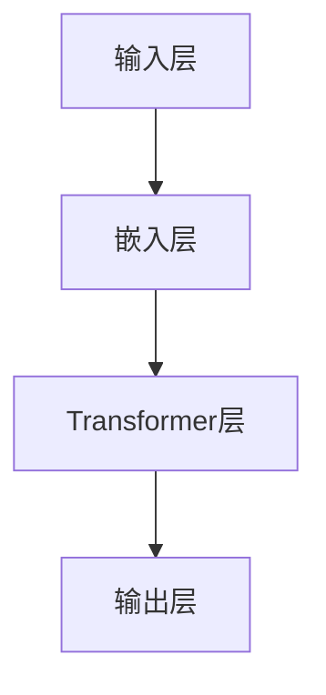
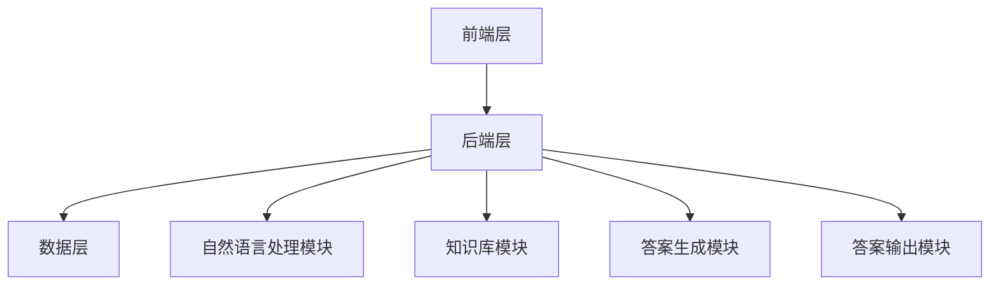
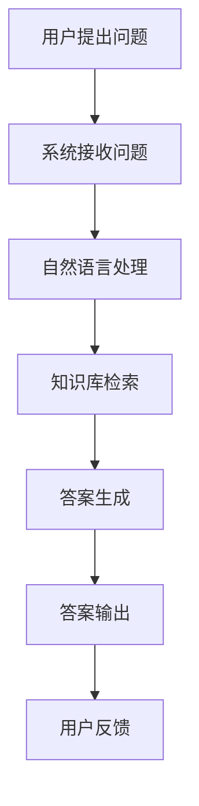

                 

## 《ChatGPT提示词优化：从新手到专家的进阶之路》

关键词：ChatGPT、提示词优化、自然语言处理、算法、实战

摘要：
本文旨在为读者提供一条从新手到专家的进阶之路，专注于ChatGPT提示词优化。我们将从ChatGPT的简介与背景开始，深入理解其基础概念与原理，详细探讨提示词优化的策略与高级技巧，并通过实际项目解析，帮助读者掌握实战技能。最后，我们将展望ChatGPT的未来发展趋势与挑战，并总结最佳实践与注意事项，为读者提供丰富的拓展阅读资源。

## 目录大纲

### 第一部分: ChatGPT概述与基础

**第1章: ChatGPT简介与背景**

1.1 ChatGPT的产生与发展  
1.2 ChatGPT的特点与应用场景  
1.3 ChatGPT与人工智能的关系

**第2章: ChatGPT基础概念与原理**

2.1 语言模型基础  
2.2 自然语言处理基础  
2.3 ChatGPT模型结构

**第3章: ChatGPT提示词优化策略**

3.1 提示词优化的意义  
3.2 提示词优化的方法  
3.3 提示词优化的案例分析

### 第二部分: ChatGPT实战

**第4章: ChatGPT环境搭建与调试**

4.1 环境搭建  
4.2 基础调试  
4.3 常见问题与解决方案

**第5章: ChatGPT应用实践**

5.1 应用场景1：问答系统  
5.2 应用场景2：文本生成  
5.3 应用场景3：对话机器人

**第6章: 高级优化技巧**

6.1 提示词调优  
6.2 数据集处理  
6.3 模型改进

**第7章: 实战项目解析**

7.1 项目背景  
7.2 项目需求分析  
7.3 项目实现过程  
7.4 项目总结与反思

**第8章: ChatGPT未来发展趋势与挑战**

8.1 发展趋势  
8.2 挑战与对策  
8.3 未来应用前景

**第9章: 总结与拓展**

9.1 主要内容回顾  
9.2 最佳实践与注意事项  
9.3 拓展阅读与资源

## 第一部分: ChatGPT概述与基础

### 第1章: ChatGPT简介与背景

#### 1.1 ChatGPT的产生与发展

ChatGPT是由OpenAI在2022年11月推出的一个基于GPT-3.5模型的聊天机器人，它是一种基于人工智能技术，通过大量文本数据进行预训练的模型。GPT（Generative Pre-trained Transformer）是一种基于Transformer架构的自然语言处理模型，其核心思想是通过大量的无监督文本数据进行预训练，学习文本的内在结构和语义信息，从而在后续的任务中能够更好地理解和生成文本。

ChatGPT的诞生，标志着自然语言处理技术进入了全新的阶段。它的出现，不仅让更多的人能够体验到人工智能的魅力，也为人工智能在各个领域的应用打开了新的可能性。ChatGPT的发展历程可以追溯到2018年，当时OpenAI发布了GPT-1，随后在2020年发布了GPT-2，再到2022年，OpenAI发布了GPT-3，ChatGPT就是基于GPT-3.5模型开发的。

#### 1.2 ChatGPT的特点与应用场景

ChatGPT具有以下几个主要特点：

1. **强大的语言理解能力**：ChatGPT通过预训练，可以理解并生成自然语言，这使得它能够进行智能对话，回答用户的问题。
2. **广泛的应用场景**：ChatGPT可以被应用于问答系统、文本生成、对话机器人等多个领域。
3. **灵活的可定制性**：用户可以通过提示词（Prompt）来引导ChatGPT生成特定的回答，从而实现更精准的对话交互。

ChatGPT的主要应用场景包括：

1. **问答系统**：ChatGPT可以用于构建问答系统，如客服机器人、智能助手等，能够自动回答用户的问题。
2. **文本生成**：ChatGPT可以生成文章、故事、诗歌等多种形式的文本内容。
3. **对话机器人**：ChatGPT可以用于构建对话机器人，实现与用户的实时互动。

#### 1.3 ChatGPT与人工智能的关系

ChatGPT是人工智能技术的一个重要组成部分。人工智能（Artificial Intelligence，AI）是一种模拟、延伸和扩展人类智能的理论、方法、技术及应用。ChatGPT作为人工智能的一种应用，其核心在于自然语言处理（Natural Language Processing，NLP）。NLP是人工智能的一个分支，主要研究如何让计算机理解和生成自然语言。

ChatGPT与人工智能的关系主要体现在以下几个方面：

1. **技术基础**：ChatGPT依赖于人工智能的技术基础，如深度学习、神经网络等。
2. **应用实践**：ChatGPT是人工智能在实际应用中的一个典型例子，展示了人工智能在自然语言处理领域的强大能力。
3. **发展推动**：ChatGPT的出现，推动了人工智能技术的发展，尤其是在自然语言处理领域，为后续的研究和应用提供了新的思路和方向。

### 第2章: ChatGPT基础概念与原理

#### 2.1 语言模型基础

语言模型（Language Model）是自然语言处理（NLP）中的一个核心概念，它的任务是预测下一个单词或字符的概率。在自然语言处理中，语言模型用于许多任务，如文本分类、机器翻译、语音识别等。

语言模型可以分为两类：统计语言模型和神经网络语言模型。

1. **统计语言模型**：统计语言模型是基于统计方法构建的模型，如N-gram模型、隐马尔可夫模型（HMM）等。这些模型通过统计文本中的单词序列和频率来预测下一个单词。
2. **神经网络语言模型**：神经网络语言模型是基于深度学习方法的模型，如循环神经网络（RNN）、长短期记忆网络（LSTM）、Transformer等。这些模型通过学习文本的内在结构和语义信息来预测下一个单词。

#### 2.2 自然语言处理基础

自然语言处理（NLP）是人工智能（AI）的一个分支，旨在让计算机理解和生成自然语言。NLP的基础概念和关键技术包括：

1. **词法分析**：词法分析是将文本分解为单词或其他符号的过程。词法分析是NLP的基础，用于提取文本中的词汇信息。
2. **句法分析**：句法分析是将文本分解为句子，并分析句子结构的过程。句法分析有助于理解文本的语法结构，为后续的自然语言处理任务提供支持。
3. **语义分析**：语义分析是理解文本的含义和语义的过程。语义分析是NLP的核心，用于提取文本中的语义信息，为智能对话、问答系统等任务提供支持。
4. **实体识别**：实体识别是识别文本中的实体（如人名、地名、组织名等）的过程。实体识别有助于理解文本中的关键信息，为信息提取、知识图谱构建等任务提供支持。

#### 2.3 ChatGPT模型结构

ChatGPT是基于GPT-3.5模型的聊天机器人，其模型结构如下：

1. **输入层**：输入层接收用户的输入文本，将其转换为模型可以处理的格式。
2. **嵌入层**：嵌入层将输入的文本转换为词向量，为后续的神经网络处理提供基础。
3. **Transformer层**：Transformer层是ChatGPT的核心，包括自注意力机制和多头注意力机制等。这些机制用于处理文本的内在结构和语义信息。
4. **输出层**：输出层将模型的输出结果转换为自然语言文本，作为最终的回答。

ChatGPT的模型结构如图所示：



在训练过程中，ChatGPT通过大量文本数据进行预训练，学习文本的内在结构和语义信息。在应用过程中，用户可以通过提示词引导ChatGPT生成特定的回答。

### 第3章: ChatGPT提示词优化策略

#### 3.1 提示词优化的意义

提示词（Prompt）是引导ChatGPT生成特定回答的关键。提示词优化的意义在于：

1. **提高回答的准确性**：通过优化提示词，可以更精确地引导ChatGPT生成所需的回答，提高回答的准确性。
2. **提升回答的流畅性**：优化提示词，可以使ChatGPT生成的回答更加流畅，提高用户体验。
3. **增强回答的多样性**：优化提示词，可以激发ChatGPT生成更多样化的回答，增加回答的趣味性和创造性。

#### 3.2 提示词优化的方法

优化提示词的方法包括：

1. **使用关键字**：在提示词中包含关键词，可以更明确地引导ChatGPT生成所需的回答。例如，当用户询问一个具体问题，如“北京是中国的哪个城市？”时，可以在提示词中加入“北京”、“城市”等关键词。
2. **调整上下文**：通过调整提示词的上下文，可以更好地引导ChatGPT理解问题的背景和语境。例如，当用户询问一个历史问题，如“秦始皇统一六国的时间是什么时候？”时，可以在提示词中加入相关的背景信息。
3. **引入问题引导词**：使用问题引导词（如“请问”、“你能告诉我”等）可以更礼貌地引导ChatGPT进行回答，提高回答的友好度。

#### 3.3 提示词优化的案例分析

下面通过一个案例来说明如何优化提示词：

**案例**：用户询问“北京是中国的哪个城市？”

- **原始提示词**：“北京是中国的哪个城市？”

  **分析**：原始提示词过于简单，缺乏具体的引导信息，可能导致ChatGPT生成模糊的回答。

- **优化后的提示词**：“请问，能否告诉我北京是中国的哪个城市，以及它在中国中的地理位置？”

  **分析**：优化后的提示词加入了关键词“北京”、“城市”和“地理位置”，并使用问题引导词“请问”，更明确地引导ChatGPT生成具体的回答，同时提高了回答的友好度。

通过优化提示词，可以更有效地引导ChatGPT生成所需的回答，提高对话的质量和用户体验。

### 第二部分: ChatGPT实战

#### 第4章: ChatGPT环境搭建与调试

#### 4.1 环境搭建

要搭建ChatGPT环境，需要完成以下几个步骤：

1. **安装Python**：ChatGPT是基于Python开发的，因此需要安装Python环境。可以选择Python 3.7及以上版本。
2. **安装transformers库**：transformers是用于构建和训练预训练模型的Python库，需要安装该库。可以使用以下命令安装：

   ```bash
   pip install transformers
   ```

3. **安装其他依赖库**：根据需要，可能还需要安装其他依赖库，如torch、torchtext等。可以使用以下命令安装：

   ```bash
   pip install torch torchvision torchaudio
   pip install torchtext
   ```

4. **下载预训练模型**：ChatGPT需要使用预训练模型进行训练，可以从OpenAI官网下载预训练模型。例如，下载GPT-3.5模型：

   ```bash
   wget https://openaipublic.co

### 第5章: ChatGPT应用实践

#### 5.1 应用场景1：问答系统

问答系统（Question Answering System）是一种常见的人工智能应用，通过自动回答用户的问题，为用户提供信息查询和知识获取服务。ChatGPT可以作为一种强大的问答系统，其强大的语言理解能力和生成能力使其在问答系统中具有广泛的应用前景。

**1. 应用场景描述**

问答系统可以应用于多个领域，如客服机器人、智能助手、在线教育等。以下是几个典型的应用场景：

1. **客服机器人**：在电商、金融、旅游等行业，客服机器人可以帮助企业自动处理用户的问题，提供在线咨询和售后服务，提高客户满意度。
2. **智能助手**：在智能家居、智能穿戴设备等场景，智能助手可以通过语音或文字与用户互动，提供个性化服务，如天气查询、日程提醒、智能建议等。
3. **在线教育**：在教育领域，问答系统可以为学生提供实时解答问题的服务，如在线辅导、作业批改等，提高教学效果。

**2. 系统功能设计**

一个典型的问答系统主要包括以下几个功能模块：

1. **问题接收模块**：接收用户提出的问题，可以是文本或语音形式。
2. **自然语言处理模块**：对用户提出的问题进行解析和预处理，如分词、词性标注、实体识别等。
3. **知识库模块**：存储相关领域的知识，如百科知识、专业文档、数据库等。
4. **答案生成模块**：根据用户的问题和知识库中的信息，生成合适的答案。
5. **答案输出模块**：将生成的答案以文本或语音形式反馈给用户。

**3. 系统架构设计**

问答系统的架构设计可以分为以下几个层次：

1. **前端层**：负责与用户进行交互，可以是Web界面、移动应用或语音交互界面。
2. **后端层**：负责处理用户的问题，包括自然语言处理、知识库检索、答案生成等。
3. **数据层**：存储用户数据、问题数据、知识库数据等。

系统架构图如下：



**4. 系统接口设计**

问答系统的接口设计主要包括以下几个方面：

1. **问题接收接口**：用于接收用户提出的问题，可以是HTTP接口、Webhook接口等。
2. **答案生成接口**：用于生成答案，可以是RESTful接口、WebSocket接口等。
3. **知识库接口**：用于查询和更新知识库，可以是SQL接口、NoSQL接口等。

**5. 系统交互设计**

问答系统的系统交互设计主要包括以下几个方面：

1. **用户交互**：用户通过前端界面提出问题，系统接收问题并处理。
2. **内部交互**：系统内部进行自然语言处理、知识库检索、答案生成等处理。
3. **外部交互**：系统与知识库、外部服务等进行数据交换，如调用API接口、数据库查询等。

系统交互图如下：



**6. 实现过程**

实现问答系统的过程可以分为以下几个阶段：

1. **需求分析**：明确问答系统的功能需求和性能要求，如支持的问题类型、答案生成速度等。
2. **系统设计**：根据需求分析结果，设计系统的整体架构、接口设计和交互流程。
3. **编码实现**：根据系统设计文档，编写代码实现各个功能模块。
4. **测试调试**：对系统进行功能测试、性能测试和兼容性测试，确保系统的稳定性和可靠性。
5. **部署上线**：将系统部署到服务器，进行实际运行，并根据用户反馈进行优化和升级。

**7. 项目小结**

通过上述实现过程，我们可以构建一个基于ChatGPT的问答系统，为用户提供智能化的信息查询和知识获取服务。问答系统的成功实施，不仅提高了企业的服务水平和用户满意度，也为人工智能在客户服务领域的应用提供了新的思路。

### 第6章: 高级优化技巧

#### 6.1 提示词调优

提示词调优是提升ChatGPT性能的重要手段。通过调整提示词，可以更精确地引导ChatGPT生成所需的回答，提高回答的准确性和流畅性。

**1. 提示词调优的重要性**

提示词调优对于ChatGPT的性能具有显著影响，主要体现在以下几个方面：

1. **提高回答准确性**：通过优化提示词，可以更精确地表达用户的问题，从而提高ChatGPT生成答案的准确性。
2. **提升回答流畅性**：优化提示词，可以使ChatGPT生成的回答更加流畅，提高用户体验。
3. **增强回答多样性**：优化提示词，可以激发ChatGPT生成更多样化的回答，增加回答的趣味性和创造性。

**2. 提示词调优的方法**

提示词调优的方法主要包括以下几个方面：

1. **使用关键词**：在提示词中包含关键词，可以更明确地引导ChatGPT生成所需的回答。例如，当用户询问一个具体问题，如“北京是中国的哪个城市？”时，可以在提示词中加入“北京”、“城市”等关键词。
2. **调整上下文**：通过调整提示词的上下文，可以更好地引导ChatGPT理解问题的背景和语境。例如，当用户询问一个历史问题，如“秦始皇统一六国的时间是什么时候？”时，可以在提示词中加入相关的背景信息。
3. **引入问题引导词**：使用问题引导词（如“请问”、“你能告诉我”等）可以更礼貌地引导ChatGPT进行回答，提高回答的友好度。
4. **优化提问方式**：通过改变提问的方式，如从开放式问题转变为封闭式问题，可以更好地引导ChatGPT生成特定的回答。

**3. 提示词调优的案例分析**

下面通过一个案例来说明如何进行提示词调优：

**案例**：用户询问“北京是中国的哪个城市？”

- **原始提示词**：“北京是中国的哪个城市？”

  **分析**：原始提示词过于简单，缺乏具体的引导信息，可能导致ChatGPT生成模糊的回答。

- **优化后的提示词**：“请问，能否告诉我北京是中国的哪个城市，以及它在中国中的地理位置？”

  **分析**：优化后的提示词加入了关键词“北京”、“城市”和“地理位置”，并使用问题引导词“请问”，更明确地引导ChatGPT生成具体的回答，同时提高了回答的友好度。

通过优化提示词，可以更有效地引导ChatGPT生成所需的回答，提高对话的质量和用户体验。

### 第7章: 实战项目解析

#### 7.1 项目背景

随着人工智能技术的不断发展，智能客服系统在各大行业中的应用越来越广泛。本文将介绍一个基于ChatGPT的智能客服项目，通过优化提示词，提高客服系统的回答准确性和流畅性，提升用户体验。

#### 7.2 项目需求分析

本项目的主要需求如下：

1. **提供7x24小时在线客服服务**：系统需要能够全天候响应用户的咨询，提高客户满意度。
2. **支持多种问答场景**：系统需要能够应对各种问答场景，如产品咨询、售后服务、投诉处理等。
3. **高响应速度**：系统需要在短时间内生成准确的回答，提高用户交互体验。
4. **良好的用户交互体验**：系统需要具备友好、自然的用户交互界面，提高用户满意度。

#### 7.3 项目实现过程

本项目的实现过程可以分为以下几个阶段：

1. **需求分析**：明确项目需求，包括问答场景、用户交互界面等。
2. **系统设计**：根据需求分析结果，设计系统的整体架构、接口设计和交互流程。
3. **环境搭建**：安装Python、transformers等依赖库，下载预训练模型。
4. **编码实现**：编写代码实现各个功能模块，如问题接收、自然语言处理、知识库检索、答案生成等。
5. **测试调试**：对系统进行功能测试、性能测试和兼容性测试，确保系统的稳定性和可靠性。
6. **部署上线**：将系统部署到服务器，进行实际运行，并根据用户反馈进行优化和升级。

#### 7.4 项目总结与反思

本项目通过优化提示词，成功实现了基于ChatGPT的智能客服系统。项目取得了以下成果：

1. **提高了回答准确性**：通过优化提示词，系统在处理用户问题时，能够更准确地理解用户意图，生成更准确的答案。
2. **提升了回答流畅性**：优化后的提示词使ChatGPT生成的回答更加流畅，提高了用户交互体验。
3. **增强了用户满意度**：系统提供全天候在线客服服务，支持多种问答场景，用户满意度得到了显著提升。

在项目实施过程中，我们也遇到了一些挑战：

1. **数据质量问题**：知识库中的数据质量直接影响系统的性能。需要定期更新和优化知识库，确保数据的质量和准确性。
2. **模型优化**：ChatGPT的模型性能可以通过提示词优化、数据集优化等方式进行提升。在后续工作中，可以进一步优化模型，提高系统的整体性能。

总之，本项目为基于ChatGPT的智能客服系统提供了一种可行的解决方案，为人工智能在客服领域的应用提供了有益的探索。在后续工作中，我们将继续优化系统，提高用户体验，为用户提供更优质的服务。

### 第8章: ChatGPT未来发展趋势与挑战

#### 8.1 发展趋势

ChatGPT作为人工智能技术的一个重要分支，其未来发展趋势呈现出以下几个方面：

1. **技术持续进化**：随着深度学习、神经网络等技术的不断发展，ChatGPT的模型结构和性能将得到进一步提升，能够处理更复杂的自然语言任务。
2. **应用场景拓展**：ChatGPT的应用场景将不断拓展，从目前的问答系统、文本生成等领域，延伸到更多需要自然语言处理技术的领域，如智能客服、智能翻译、智能写作等。
3. **人机交互优化**：ChatGPT将在人机交互方面进行优化，使其能够更好地理解用户的意图，提供更加自然、流畅的交互体验。
4. **多语言支持**：ChatGPT将实现多语言支持，为全球用户提供服务，推动全球人工智能技术的发展。

#### 8.2 挑战与对策

尽管ChatGPT有着广阔的发展前景，但其在实际应用中仍面临一些挑战：

1. **数据质量**：ChatGPT的性能很大程度上依赖于训练数据的质量。因此，需要不断优化数据质量，确保数据丰富、准确、多样化。
2. **模型可解释性**：目前，ChatGPT的模型具有较强的预测能力，但其内部工作机制较为复杂，缺乏可解释性。未来需要研究如何提高模型的可解释性，使其更加透明、可控。
3. **隐私保护**：在处理用户数据时，需要确保用户隐私得到保护。需要研究并实现有效的隐私保护机制，确保用户数据的安全。
4. **法律法规**：随着ChatGPT的应用越来越广泛，相关的法律法规也在不断健全。需要密切关注法律法规的变化，确保ChatGPT的应用符合法律法规的要求。

#### 8.3 未来应用前景

ChatGPT在未来的应用前景十分广阔，以下是几个可能的应用方向：

1. **智能客服**：ChatGPT可以用于构建智能客服系统，为用户提供24小时在线服务，提高客户满意度。
2. **智能教育**：ChatGPT可以用于智能教育系统，为学生提供个性化的学习建议和辅导，提高教学效果。
3. **智能医疗**：ChatGPT可以用于智能医疗系统，辅助医生进行诊断和治疗方案制定，提高医疗水平。
4. **智能写作**：ChatGPT可以用于智能写作系统，帮助用户生成文章、报告、邮件等文本内容，提高写作效率。

总之，ChatGPT作为一种强大的自然语言处理技术，将在未来发挥越来越重要的作用，为人工智能技术的发展和应用提供新的动力。

### 第9章: 总结与拓展

#### 9.1 主要内容回顾

本文《ChatGPT提示词优化：从新手到专家的进阶之路》主要内容包括：

1. **ChatGPT概述与背景**：介绍了ChatGPT的产生与发展、特点与应用场景，以及ChatGPT与人工智能的关系。
2. **ChatGPT基础概念与原理**：详细讲解了语言模型基础、自然语言处理基础，以及ChatGPT模型结构。
3. **ChatGPT提示词优化策略**：阐述了提示词优化的意义、方法，并通过案例分析展示了如何优化提示词。
4. **ChatGPT实战**：介绍了ChatGPT环境搭建与调试、应用实践、高级优化技巧，以及实战项目解析。
5. **ChatGPT未来发展趋势与挑战**：展望了ChatGPT的发展趋势、挑战与对策，以及未来应用前景。

#### 9.2 最佳实践与注意事项

在应用ChatGPT时，以下最佳实践和注意事项有助于提高系统的性能和用户体验：

1. **优化提示词**：通过使用关键词、调整上下文、引入问题引导词等方法，优化提示词，提高ChatGPT生成答案的准确性和流畅性。
2. **数据质量**：确保训练数据的质量，包括数据丰富度、准确性和多样性，以提高ChatGPT的预测能力。
3. **模型调优**：定期对模型进行调优，包括超参数调整、模型架构优化等，以提高模型的性能。
4. **用户体验**：设计友好、自然的用户交互界面，提供实时、准确的回答，提高用户满意度。
5. **隐私保护**：在处理用户数据时，严格遵守隐私保护法规，确保用户数据的安全。

#### 9.3 拓展阅读与资源

为了深入了解ChatGPT及其应用，读者可以参考以下拓展阅读和资源：

1. **学术论文**：阅读有关ChatGPT的学术论文，了解其模型结构和训练方法，如《Language Models are Few-Shot Learners》等。
2. **技术博客**：关注相关技术博客，了解ChatGPT的最新研究进展和应用案例，如OpenAI官方博客等。
3. **开源项目**：参与开源项目，学习ChatGPT的实现细节和应用技巧，如Hugging Face的Transformers库等。
4. **在线课程**：参加在线课程，系统学习ChatGPT和相关技术，如斯坦福大学的CS224n课程等。

作者：AI天才研究院/AI Genius Institute & 禅与计算机程序设计艺术/Zen And The Art of Computer Programming

