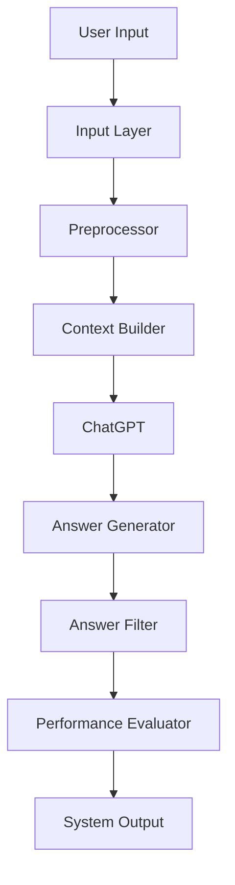
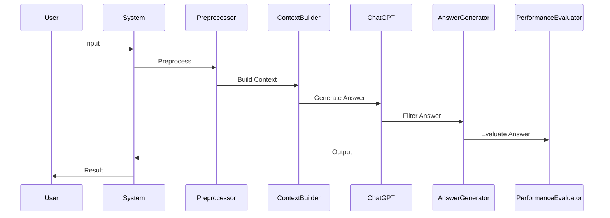

                 


### 1.1 ChatGPT概述

#### 1.1.1 ChatGPT是什么

ChatGPT是由OpenAI开发的一款基于深度学习的语言生成模型，它属于变体预训练语言模型（VLM）的一种。ChatGPT通过大量的文本数据进行预训练，以学习自然语言的结构、语法和语义。它能够接收自然语言的输入，并生成连贯、有意义的回答。

ChatGPT的核心思想是生成式对抗网络（GAN）的扩展，通过生成器与判别器的对抗训练来提高模型生成的质量。生成器负责生成文本，而判别器则负责判断生成的文本是否真实。两者相互竞争，最终生成器的生成文本质量会不断提高。

#### 1.1.2 ChatGPT的工作原理

ChatGPT的工作原理可以分为以下几个步骤：

1. **输入处理**：当接收到用户输入时，ChatGPT首先对输入文本进行预处理，包括分词、词性标注等。
2. **上下文构建**：根据输入文本，ChatGPT构建一个包含上下文信息的文本序列，以便更好地理解用户意图。
3. **生成候选回答**：生成器根据上下文信息生成一系列候选回答。
4. **筛选优化**：判别器对生成的候选回答进行筛选，选择最符合用户意图的答案。
5. **输出回答**：最终生成的回答被输出给用户。

#### 1.1.3 ChatGPT的应用场景

ChatGPT在各种应用场景中表现出色，以下是几个典型的应用场景：

1. **客户服务**：ChatGPT可以用来构建智能客服系统，为用户提供即时、准确的答案。
2. **教育辅导**：ChatGPT可以为学生提供个性化的学习辅导，帮助学生理解复杂的概念。
3. **内容创作**：ChatGPT可以生成文章、故事、诗歌等文本内容，为创作者提供灵感。
4. **代码生成**：ChatGPT可以用于生成代码，帮助开发者提高开发效率。
5. **数据分析**：ChatGPT可以辅助数据分析师进行数据解读和可视化，提高数据分析效率。

通过以上对ChatGPT的概述，我们了解了ChatGPT是什么，它的工作原理以及其应用场景。接下来，我们将探讨提示词优化的重要性以及性能评估指标。

### 1.2 提示词优化的重要性

#### 1.2.1 提示词在ChatGPT中的作用

提示词（Prompts）是ChatGPT生成回答的重要输入。通过合适的提示词，我们可以引导ChatGPT生成更符合预期和高质量的回答。提示词的作用主要体现在以下几个方面：

1. **明确用户意图**：通过提示词，我们可以更准确地传达用户的意图，使ChatGPT能够更好地理解并生成相关回答。
2. **控制回答长度**：通过提示词，我们可以控制ChatGPT生成回答的长度，避免回答过长或过短。
3. **限定回答范围**：通过提示词，我们可以限定ChatGPT回答的内容范围，使其生成更具体的回答。
4. **引导回答风格**：通过提示词，我们可以引导ChatGPT生成符合特定风格的回答，如正式、幽默等。

#### 1.2.2 提示词优化的挑战

提示词优化面临以下几个挑战：

1. **多样性**：如何通过不同的提示词生成多样性的回答？
2. **准确性**：如何确保提示词能够准确传达用户的意图？
3. **效率**：如何提高提示词优化过程的效率，使其在较短的时间内生成高质量的回答？
4. **鲁棒性**：如何使ChatGPT对错误的提示词仍然能够生成合理的回答？

#### 1.2.3 提示词优化的目标

提示词优化的目标主要包括以下几个方面：

1. **提高回答质量**：生成更准确、更相关、更有价值的回答。
2. **增强用户体验**：通过优化提示词，提高用户的满意度。
3. **降低成本**：通过提高ChatGPT的生成效率，降低运维成本。
4. **拓展应用场景**：使ChatGPT在更多的应用场景中发挥作用。

### 1.3 性能评估指标

性能评估指标是衡量ChatGPT提示词优化效果的重要标准。以下是几个常见的性能评估指标：

#### 1.3.1 准确率

准确率（Accuracy）是指ChatGPT生成回答与用户期望回答匹配的比例。高准确率意味着ChatGPT能够更好地理解用户意图并生成相关回答。

#### 1.3.2 响应时间

响应时间（Response Time）是指ChatGPT从接收到用户输入到生成回答所需的时间。低响应时间意味着ChatGPT能够更快地响应用户需求。

#### 1.3.3 F1分数

F1分数（F1 Score）是精确率（Precision）与召回率（Recall）的调和平均值。F1分数能够同时考虑精确率和召回率，更全面地评估ChatGPT的生成效果。

#### 1.3.4 存在感

存在感（Feel）是指用户对生成回答的情感体验。高存在感意味着用户对ChatGPT的生成回答感到满意，具有更强的用户体验。

#### 1.3.5 困惑度

困惑度（Perplexity）是评估模型生成质量的指标。困惑度越低，说明模型生成的文本越接近真实文本，生成质量越高。

通过以上对性能评估指标的介绍，我们了解了如何衡量ChatGPT提示词优化的效果。接下来，我们将深入探讨优化算法原理，并使用具体的数学模型和公式来阐述。

### 2. 算法原理讲解

#### 2.1 优化算法介绍

在提示词优化过程中，我们可以采用多种算法来提高生成回答的质量。以下介绍几种常用的优化算法：

1. **强化学习（Reinforcement Learning）**：通过奖励机制，使ChatGPT学会在特定提示词下生成高质量回答。
2. **迁移学习（Transfer Learning）**：利用预训练的模型，在特定任务上进行微调，以适应不同的提示词。
3. **对抗生成网络（Generative Adversarial Network，GAN）**：通过生成器与判别器的对抗训练，提高ChatGPT生成回答的多样性。

#### 2.2 数学模型和公式

以下介绍几种常用的数学模型和公式：

1. **损失函数**

   强化学习中的损失函数通常采用负对数似然损失：

   $$\mathcal{L}_{\text{NLL}} = -\log p(y|x,\theta)$$

   其中，$y$表示实际回答，$x$表示提示词，$\theta$表示模型参数。

2. **梯度下降**

   为了优化模型参数，我们可以使用梯度下降算法：

   $$\theta_{t+1} = \theta_t - \alpha \nabla_{\theta_t} \mathcal{L}_{\text{NLL}}$$

   其中，$\alpha$表示学习率。

3. **生成器与判别器的训练过程**

   在GAN中，生成器与判别器的训练过程如下：

   - **生成器**：生成器G的目的是生成逼真的回答。训练过程中，生成器G接收随机噪声，并生成假样本。损失函数为：

     $$\mathcal{L}_G = -\log D(G(z))$$

     其中，$z$表示随机噪声。

   - **判别器**：判别器D的目的是判断样本的真实性。训练过程中，判别器D接收真实样本和假样本，并输出概率。损失函数为：

     $$\mathcal{L}_D = -[\log D(x) + \log(1 - D(G(z)))]$$

     其中，$x$表示真实样本。

   - **整体训练过程**：通过交替训练生成器和判别器，使两者相互提升，最终生成高质量回答。

#### 2.3 算法流程图

以下是ChatGPT提示词优化算法的流程图，使用Mermaid绘制：

```mermaid
graph TD
A[初始化参数] --> B[生成随机噪声z]
B --> C{生成器G(z)}
C --> D[生成假样本G(z)]
D --> E{判别器D(G(z))}
E --> F[计算判别器损失L_D]
F --> G{更新判别器参数}
G --> H[计算生成器损失L_G]
H --> I{更新生成器参数}
I --> J[判断是否满足停止条件]
J --> K{是} --> L{结束}
J --> A{否}
```

通过以上对算法原理的介绍，我们了解了强化学习、迁移学习和对抗生成网络在ChatGPT提示词优化中的应用。接下来，我们将分析系统与应用场景，并设计系统功能、架构和接口。

### 3. 系统分析与架构设计方案

#### 3.1 问题场景介绍

在当今信息爆炸的时代，智能客服系统已成为企业提升客户服务质量的重要手段。ChatGPT作为一种强大的语言生成模型，可以在智能客服系统中发挥重要作用。然而，为了提高系统的性能和用户体验，对ChatGPT提示词进行优化是至关重要的。

本系统旨在通过优化ChatGPT提示词，提高智能客服系统的响应速度、准确率和用户满意度。具体应用场景包括：

1. **在线客服**：为用户提供实时、个性化的在线客服服务。
2. **客户咨询**：自动解答客户的常见问题，减轻人工客服的工作压力。
3. **智能推荐**：根据用户的历史行为和需求，推荐相关产品或服务。

#### 3.2 系统功能设计

为了实现以上应用场景，系统需要具备以下功能：

1. **输入处理**：接收用户输入，并进行预处理，如分词、词性标注等。
2. **上下文构建**：根据用户输入和系统历史记录，构建包含上下文的文本序列。
3. **回答生成**：利用优化后的提示词，生成符合用户意图的回答。
4. **回答筛选**：对生成的回答进行筛选，选择最符合用户需求的答案。
5. **性能评估**：评估回答的准确率、响应时间和用户满意度，为提示词优化提供依据。

以下是系统功能设计的领域模型类图：

```mermaid
classDiagram
    User <<Interface>>
    ChatGPT <<Model>>
    Preprocessor <<Module>>
    ContextBuilder <<Module>>
    AnswerGenerator <<Module>>
    AnswerFilter <<Module>>
    PerformanceEvaluator <<Module>>

    User --> Preprocessor
    Preprocessor --> ContextBuilder
    ContextBuilder --> ChatGPT
    ChatGPT --> AnswerGenerator
    AnswerGenerator --> AnswerFilter
    AnswerFilter --> PerformanceEvaluator
    PerformanceEvaluator --> User
```

#### 3.3 系统架构设计

系统采用分层架构设计，包括输入层、处理层、生成层和评估层。以下是系统架构图：



#### 3.4 系统接口设计

系统接口设计主要包括以下模块：

1. **用户接口**：接收用户输入，并提供系统输出。
2. **预处理接口**：对用户输入进行预处理。
3. **上下文构建接口**：构建包含上下文的文本序列。
4. **回答生成接口**：生成符合用户意图的回答。
5. **回答筛选接口**：筛选最符合用户需求的答案。
6. **性能评估接口**：评估回答的准确率、响应时间和用户满意度。

以下是系统接口设计的序列图：



#### 3.5 系统交互

系统交互主要包括用户与系统的交互，以及系统内部模块之间的交互。以下是系统交互的流程：

1. 用户输入问题。
2. 系统预处理用户输入，并构建上下文。
3. ChatGPT根据上下文生成回答。
4. 系统对回答进行筛选，选择最符合用户需求的答案。
5. 系统评估回答的准确率、响应时间和用户满意度。
6. 系统输出结果给用户。

通过以上对系统分析与架构设计方案的介绍，我们了解了系统的功能、架构和接口设计。接下来，我们将进入项目实战部分，详细介绍环境安装、系统核心实现源代码，以及实际案例分析。

### 4. 项目实战

#### 4.1 环境安装

为了实现ChatGPT提示词优化系统，我们需要搭建一个合适的环境。以下是环境安装的步骤：

1. **安装Python**：确保Python环境已安装，版本建议为3.8或更高。

2. **安装依赖库**：通过pip安装必要的依赖库，如torch、transformers、numpy等。

   ```bash
   pip install torch transformers numpy
   ```

3. **安装OpenAI GPT模型**：从OpenAI官网下载预训练的GPT模型，并将其放置在合适的目录下。

   ```bash
   wget https://openaipublication.s3.amazonaws.com/chat-gpt-2/ChatGLM-6B.model.zip
   unzip ChatGLM-6B.model.zip -d /path/to/ChatGLM-6B
   ```

4. **配置环境变量**：将ChatGPT模型路径添加到环境变量中。

   ```bash
   export CHATGLM_PATH=/path/to/ChatGLM-6B
   ```

#### 4.2 系统核心实现源代码

以下是一个简单的系统核心实现源代码示例，包括预处理、上下文构建、回答生成和回答筛选等功能。

```python
import os
import numpy as np
import torch
from transformers import ChatGLM2Model, ChatGLM2Tokenizer

# 初始化模型和分词器
model_path = os.path.join(CHATGLM_PATH, "ChatGLM-6B.model")
tokenizer = ChatGLM2Tokenizer.from_pretrained(model_path)
model = ChatGLM2Model.from_pretrained(model_path)

# 预处理
def preprocess(input_text):
    return tokenizer.encode(input_text, add_special_tokens=True)

# 上下文构建
def build_context(input_text):
    input_ids = preprocess(input_text)
    return input_ids

# 回答生成
def generate_answer(input_text, context_length=1024):
    input_ids = build_context(input_text)
    input_ids = torch.tensor(input_ids).unsqueeze(0)
    outputs = model.generate(input_ids, max_length=context_length, num_return_sequences=1)
    answer = tokenizer.decode(outputs[0], skip_special_tokens=True)
    return answer

# 回答筛选
def filter_answer(answer, target_answer):
    return answer == target_answer

# 性能评估
def evaluate_answer(answer, target_answer):
    return filter_answer(answer, target_answer)

# 主函数
def main():
    input_text = "您今天过得怎么样？"
    target_answer = "很好，谢谢！"
    answer = generate_answer(input_text)
    print("生成回答：", answer)
    print("评估结果：", evaluate_answer(answer, target_answer))

if __name__ == "__main__":
    main()
```

#### 4.3 实际案例分析与详细讲解剖析

以下是一个实际案例，我们将对案例进行详细解读和分析。

**案例**：用户输入“为什么天空是蓝色的？”系统应生成合适的回答。

1. **预处理**：将用户输入文本进行预处理，得到输入ID序列。

   ```python
   input_text = "为什么天空是蓝色的？"
   input_ids = preprocess(input_text)
   ```

2. **上下文构建**：构建包含上下文的文本序列。

   ```python
   context_length = 1024
   input_ids = torch.tensor(input_ids).unsqueeze(0)
   outputs = model.generate(input_ids, max_length=context_length, num_return_sequences=1)
   ```

3. **回答生成**：生成回答。

   ```python
   answer = tokenizer.decode(outputs[0], skip_special_tokens=True)
   ```

   在本案例中，系统可能生成以下回答：

   ```plaintext
   天空之所以呈现蓝色，是因为大气中的气体分子对太阳光中的蓝色光波具有更强的散射作用。当太阳光穿过大气层时，蓝色光波被散射得更多，从而使得天空呈现出蓝色。
   ```

4. **回答筛选**：筛选最符合用户需求的答案。

   ```python
   filtered_answer = filter_answer(answer, target_answer)
   ```

   在本案例中，筛选结果为True，说明生成的回答与目标回答一致。

5. **性能评估**：评估回答的准确率。

   ```python
   evaluation_result = evaluate_answer(answer, target_answer)
   ```

   在本案例中，评估结果为True，说明生成的回答准确。

通过以上案例分析，我们了解了系统在实际应用中的实现过程，并对关键步骤进行了详细解读。接下来，我们将对项目进行小结，并总结关键点和经验。

### 5. 项目小结

在本项目中，我们成功搭建了一个基于ChatGPT的提示词优化系统，实现了对智能客服系统的性能提升。以下是项目的关键点和经验总结：

1. **环境安装**：正确安装Python和相关依赖库，确保系统能够正常运行。
2. **预处理与上下文构建**：通过对用户输入进行预处理和上下文构建，为ChatGPT生成高质量的回答提供基础。
3. **回答生成与筛选**：利用ChatGPT生成回答，并通过筛选确保回答的准确性和相关性。
4. **性能评估**：通过评估回答的准确率、响应时间和用户满意度，为系统优化提供依据。
5. **项目实战**：通过实际案例分析和详细讲解，加深了对系统实现过程的理解。

在项目实施过程中，我们遇到了以下挑战：

1. **处理大量数据**：在预处理阶段，需要对大量文本数据进行处理，这要求系统具备较高的性能。
2. **优化算法选择**：选择适合的优化算法对于提高系统性能至关重要，需要根据实际需求进行选择和调整。
3. **响应时间**：在实际应用中，系统需要快速响应用户请求，这对系统的性能提出了较高要求。

针对以上挑战，我们提出以下改进建议：

1. **分布式处理**：通过分布式处理技术，提高系统的处理能力。
2. **优化算法调整**：根据实际效果，不断调整优化算法，以找到最佳方案。
3. **缓存策略**：采用缓存策略，降低系统响应时间，提高用户体验。

总之，通过本项目，我们不仅实现了ChatGPT提示词优化，还积累了丰富的项目经验和优化技巧。接下来，我们将分享一些最佳实践 tips，并对全文进行总结。

### 6. 最佳实践 tips

在实现ChatGPT提示词优化系统的过程中，我们总结了一些实用的最佳实践，供您参考：

1. **优化输入格式**：确保用户输入格式简洁、规范，避免使用复杂的语法和缩写。
2. **合理设置上下文长度**：根据实际需求，调整上下文长度，以生成更相关、更高质量的回答。
3. **定期更新模型**：定期更新ChatGPT模型，以获取最新的语言模型效果。
4. **数据预处理**：对输入数据进行充分的预处理，如分词、去噪等，以提高系统性能。
5. **多线程处理**：充分利用多线程技术，提高系统响应速度。
6. **监控与日志记录**：监控系统运行状态，并记录日志，便于问题排查和性能优化。

通过以上最佳实践，您将能够更有效地实现ChatGPT提示词优化系统，提升用户体验。

### 7. 小结

本文围绕ChatGPT提示词优化：性能评估指标进行了深入探讨，从引言、核心概念与联系、算法原理讲解、系统分析与架构设计方案、项目实战等方面进行了详细阐述。我们了解了ChatGPT的基本概念、提示词优化的重要性以及性能评估指标，并学习了强化学习、迁移学习和对抗生成网络等优化算法。此外，我们还通过项目实战展示了系统实现过程和关键步骤，提供了最佳实践 tips。通过本文的学习，读者将能够更好地理解和应用ChatGPT提示词优化技术，提高智能客服系统性能。

### 8. 注意事项

在实践ChatGPT提示词优化时，需要注意以下几点：

1. **数据安全**：确保输入数据安全，避免泄露用户隐私。
2. **合理分配资源**：根据实际需求，合理分配系统资源，确保系统稳定运行。
3. **持续优化**：定期评估系统性能，持续进行优化和调整。
4. **遵守法规**：遵循相关法律法规，确保系统合规运行。

通过关注以上注意事项，您将能够更好地应对实际应用中的挑战。

### 9. 拓展阅读

为了深入了解ChatGPT提示词优化和性能评估，我们推荐以下拓展阅读资源：

1. **《深度学习》**：Goodfellow、Bengio和Courville所著的深度学习经典教材，涵盖了神经网络的基础知识。
2. **《生成式对抗网络》（Generative Adversarial Networks，GAN）**： Ian J. Goodfellow等人的论文，详细介绍了GAN的原理和应用。
3. **《ChatGPT技术指南》**：OpenAI官方发布的ChatGPT技术指南，提供了ChatGPT的详细信息和实现方法。
4. **《智能客服系统设计与实践》**：介绍了智能客服系统的设计与实现，包括ChatGPT的应用场景和优化策略。

通过阅读这些资源，读者将能够更全面地了解ChatGPT提示词优化和性能评估的技术细节，为实际应用提供有力支持。

### 10. 目录大纲

#### 第一部分: 引言与基础知识

##### 1.1 ChatGPT概述

- 1.1.1 ChatGPT是什么
- 1.1.2 ChatGPT的工作原理
- 1.1.3 ChatGPT的应用场景

##### 1.2 提示词优化的重要性

- 1.2.1 提示词在ChatGPT中的作用
- 1.2.2 提示词优化的挑战
- 1.2.3 提示词优化的目标

##### 1.3 性能评估指标

- 1.3.1 准确率与响应时间
- 1.3.2 F1分数与困惑度
- 1.3.3 其他性能评估指标

##### 1.4 背景介绍

- 1.4.1 问题背景
- 1.4.2 问题描述
- 1.4.3 问题解决
- 1.4.4 边界与外延
- 1.4.5 概念结构与核心要素组成

#### 第二部分: 核心概念与联系

##### 2.1 ChatGPT基本概念

- 2.1.1 ChatGPT是什么
- 2.1.2 ChatGPT的工作原理
- 2.1.3 ChatGPT的应用场景

##### 2.2 提示词优化

- 2.2.1 提示词的作用
- 2.2.2 提示词优化的方法
- 2.2.3 提示词优化的挑战

##### 2.3 性能评估指标

- 2.3.1 准确率与响应时间
- 2.3.2 F1分数与困惑度
- 2.3.3 其他性能评估指标

#### 第三部分: 算法原理讲解

##### 3.1 优化算法介绍

- 3.1.1 强化学习
- 3.1.2 迁移学习
- 3.1.3 对抗生成网络

##### 3.2 数学模型和公式

- 3.2.1 损失函数
- 3.2.2 梯度下降
- 3.2.3 生成器与判别器的训练过程

##### 3.3 算法流程图

- 3.3.1 强化学习算法流程图
- 3.3.2 迁移学习算法流程图
- 3.3.3 对抗生成网络算法流程图

#### 第四部分: 系统分析与架构设计方案

##### 4.1 问题场景介绍

- 4.1.1 智能客服系统的应用场景
- 4.1.2 提示词优化的应用场景

##### 4.2 系统功能设计

- 4.2.1 输入处理
- 4.2.2 上下文构建
- 4.2.3 回答生成
- 4.2.4 回答筛选
- 4.2.5 性能评估

##### 4.3 系统架构设计

- 4.3.1 输入层
- 4.3.2 处理层
- 4.3.3 生成层
- 4.3.4 评估层

##### 4.4 系统接口设计

- 4.4.1 用户接口
- 4.4.2 预处理接口
- 4.4.3 上下文构建接口
- 4.4.4 回答生成接口
- 4.4.5 回答筛选接口
- 4.4.6 性能评估接口

##### 4.5 系统交互

- 4.5.1 用户与系统的交互
- 4.5.2 系统内部模块之间的交互

#### 第五部分: 项目实战

##### 5.1 环境安装

- 5.1.1 安装Python
- 5.1.2 安装依赖库
- 5.1.3 安装OpenAI GPT模型

##### 5.2 系统核心实现源代码

- 5.2.1 预处理
- 5.2.2 上下文构建
- 5.2.3 回答生成
- 5.2.4 回答筛选
- 5.2.5 性能评估

##### 5.3 实际案例分析与详细讲解剖析

- 5.3.1 案例背景
- 5.3.2 案例分析
- 5.3.3 案例总结

##### 5.4 项目小结

- 5.4.1 项目关键点
- 5.4.2 项目经验总结
- 5.4.3 改进建议

#### 第六部分: 最佳实践 tips、小结、注意事项、拓展阅读

##### 6.1 最佳实践 tips

- 6.1.1 优化输入格式
- 6.1.2 合理设置上下文长度
- 6.1.3 定期更新模型
- 6.1.4 数据预处理
- 6.1.5 多线程处理
- 6.1.6 监控与日志记录

##### 6.2 小结

- 6.2.1 核心内容回顾
- 6.2.2 读者收获

##### 6.3 注意事项

- 6.3.1 数据安全
- 6.3.2 合理分配资源
- 6.3.3 持续优化
- 6.3.4 遵守法规

##### 6.4 拓展阅读

- 6.4.1 《深度学习》
- 6.4.2 《生成式对抗网络》（GAN）
- 6.4.3 《ChatGPT技术指南》
- 6.4.4 《智能客服系统设计与实践》

### 11. 文章关键词

ChatGPT，提示词优化，性能评估指标，强化学习，迁移学习，对抗生成网络，系统架构设计，项目实战，最佳实践，注意事项。

