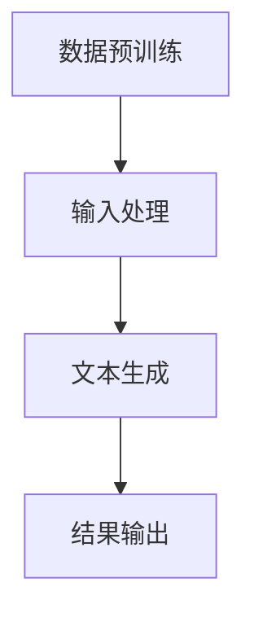
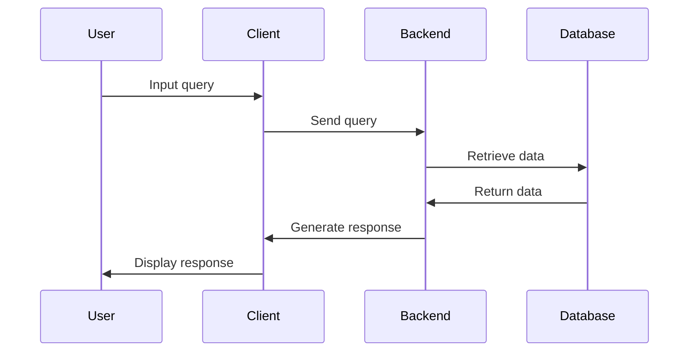
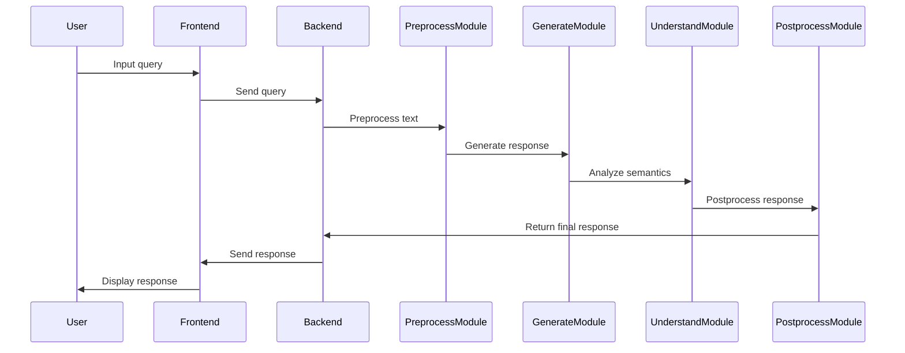

                 

### 引言

在当今的AI领域中，ChatGPT（聊天生成预训练模型）无疑是一个革命性的突破。自2022年OpenAI推出以来，ChatGPT凭借其强大的自然语言处理能力和卓越的性能，迅速吸引了全球科技界和商业界的关注。ChatGPT不仅仅是一个聊天机器人，它更是一个多功能的AI助手，能够在多种场景下提供高效的交互和服务，如客户支持、内容生成、代码调试等。

然而，要充分发挥ChatGPT的潜力，并非易事。一个关键因素在于提示词（Prompt）的优化。提示词是引导ChatGPT生成合适响应的输入，其质量和精确性直接影响模型输出的质量和准确性。因此，如何优化提示词，以实现效果的最大化，成为一个亟待解决的重要问题。

本文将围绕ChatGPT提示词优化这一主题，深入探讨其背景、核心概念、算法原理、系统架构以及实际应用。通过逻辑清晰、结构紧凑的论述，我们将详细解析如何通过策略性的提示词设计，显著提升ChatGPT的交互效果和响应质量。读者将了解到从基础概念到高级技巧的一系列实用方法，助您在ChatGPT应用实践中取得卓越成效。

总之，本文不仅旨在为AI开发者和技术爱好者提供宝贵的知识和实践经验，也希望通过深入的分析和思考，引发更多关于AI语言模型和提示词优化领域的讨论和创新。让我们一起探索ChatGPT提示词优化的奥秘，开启AI交互的新篇章。

### 关键词

- **ChatGPT**
- **提示词优化**
- **自然语言处理**
- **算法设计**
- **模型性能提升**
- **数学模型与公式**
- **系统架构与接口**
- **实际应用案例分析**
- **最佳实践技巧**

### 摘要

本文将深入探讨ChatGPT提示词优化的策略和方法，以实现效果的最大化。首先，我们介绍了ChatGPT的基本概念及其在自然语言处理领域的重要应用。接着，详细分析了提示词优化的背景、重要性及其核心原理。通过阐述提示词优化与自然语言处理、机器学习、深度学习等技术的联系，我们明确了其边界与外延。

在算法原理部分，我们介绍了ChatGPT的工作机制，通过Mermaid流程图和Python源代码展示了其模型结构和输入输出流程。同时，我们对提示词优化的数学模型和关键公式进行了详细讲解，并通过实例说明，使读者能够更好地理解其应用。

接着，我们探讨了系统分析与架构设计，从问题场景、系统功能设计到系统架构和接口设计，详细描述了整个系统的交互流程。在项目实战部分，我们介绍了环境安装、系统核心实现源代码，并对实际案例进行了深入剖析。

最后，本文总结了最佳实践技巧、注意事项，并推荐了拓展阅读资源，帮助读者在实际应用中取得更好的效果。通过本文，读者将掌握ChatGPT提示词优化的全面知识，提高其在AI领域的实践能力。

### 目录大纲

```markdown
# 《ChatGPT提示词优化：效果最大化的策略》

## 第一部分：背景介绍与核心概念

### 第1章：问题背景

#### 1.1 ChatGPT概述

#### 1.2 提示词优化的重要性

#### 1.3 提示词优化的边界与外延

### 第2章：核心概念与联系

#### 2.1 提示词优化原理

##### 2.1.1 概念属性特征对比表格

##### 2.1.2 提示词优化与相关概念的联系

## 第二部分：算法原理讲解

### 第3章：算法原理讲解

#### 3.1 ChatGPT工作原理

##### 3.1.1 Mermaid流程图

##### 3.1.2 Python源代码

#### 3.2 数学模型和数学公式

##### 3.2.1 数学模型

##### 3.2.2 公式讲解

##### 3.2.3 举例说明

## 第三部分：系统分析与架构设计

### 第4章：系统分析与架构设计

#### 4.1 问题场景介绍

#### 4.2 系统功能设计

##### 4.2.1 领域模型Mermaid类图

#### 4.3 系统架构设计

##### 4.3.1 Mermaid架构图

#### 4.4 系统接口设计

##### 4.4.1 系统接口定义

#### 4.5 系统交互

##### 4.5.1 Mermaid序列图

## 第四部分：项目实战

### 第5章：项目实战

#### 5.1 环境安装

#### 5.2 系统核心实现源代码

##### 5.2.1 代码应用解读与分析

#### 5.3 实际案例分析与详细讲解剖析

### 第6章：项目小结

#### 6.1 最佳实践 tips

#### 6.2 小结

#### 6.3 注意事项

#### 6.4 拓展阅读
```

### 第1章 问题背景

#### 1.1 ChatGPT概述

ChatGPT是由OpenAI开发的基于GPT-3模型的人工智能聊天机器人，其核心在于通过大量的文本数据进行预训练，从而具备强大的文本生成和语言理解能力。ChatGPT能够处理多种语言，支持多种文本格式，并在多个领域表现出色，包括问答系统、文本摘要、代码生成等。ChatGPT的成功，标志着人工智能在自然语言处理领域的重大进展。

ChatGPT的工作原理可以概括为以下几个步骤：

1. **数据预训练**：ChatGPT使用大量的互联网文本数据进行预训练，从而学习到语言的统计规律和语义信息。
2. **模型输入**：用户输入一条问题或语句，ChatGPT将其作为输入。
3. **文本生成**：模型根据输入文本，利用预训练的参数生成可能的响应文本。
4. **结果输出**：将生成的文本输出给用户。

#### 1.2 提示词优化的重要性

在ChatGPT的应用中，提示词（Prompt）扮演着至关重要的角色。提示词是引导ChatGPT生成响应的输入，其质量和精确性直接影响模型的输出质量。优化提示词，就是通过设计更精准、更具指导性的输入，来提升模型生成的响应的相关性和准确性。

提示词优化的重要性体现在以下几个方面：

1. **提升交互质量**：优质的提示词能够提高模型对用户意图的理解，从而生成更符合用户需求的响应。
2. **增强用户体验**：通过优化提示词，可以提升用户的交互体验，使其感受到ChatGPT的智能化和人性化。
3. **提高工作效率**：在商业和客户服务场景中，优化提示词能够显著提升工作的效率和质量。

#### 1.3 提示词优化的边界与外延

提示词优化的边界主要涉及以下几个方面：

1. **文本长度**：提示词的长度需要适中，过短可能导致模型理解不充分，过长则可能影响模型的处理速度和效果。
2. **语义清晰**：提示词需要具有明确的语义，避免模糊不清的表述，以免模型生成无关或错误的响应。
3. **上下文关联**：提示词应当与上下文保持一致，确保模型能够在相关场景中生成恰当的响应。

提示词优化的外延则包括以下几个方面：

1. **多语言支持**：在多语言环境中，提示词需要具备跨语言的适应能力，确保在不同语言背景下都能生成准确的响应。
2. **个性化定制**：根据不同的用户需求和场景，设计个性化的提示词，以最大化满足特定需求。
3. **持续改进**：随着用户反馈和数据积累，不断调整和优化提示词，以实现持续改进和效果提升。

通过深入理解ChatGPT的背景、提示词优化的重要性及其边界与外延，我们可以为后续章节中的深入探讨和实际应用打下坚实的基础。

### 第2章 核心概念与联系

#### 2.1 提示词优化原理

提示词优化是一个复杂但关键的过程，其核心在于提高模型对用户输入的准确理解和响应生成能力。以下从基本概念、核心算法和属性特征对比三个方面展开详细讨论。

##### 2.1.1 基本概念

**提示词**：提示词是指提供给模型以生成响应的文本输入。一个好的提示词应当具备明确、具体、相关的特点，以便模型能够准确理解和生成相应的响应。

**优化**：优化指的是通过调整提示词的设计和内容，以提高模型生成响应的相关性和准确性。

**目标**：提示词优化的目标是使模型生成的响应尽可能接近用户的意图和需求。

**方法**：常用的提示词优化方法包括调整提示词的语义、结构、长度和上下文等。

##### 2.1.2 核心算法

提示词优化的核心算法通常涉及以下几个方面：

1. **语义匹配**：通过分析用户输入的语义，确保提示词与用户意图高度一致，从而提高模型生成的响应的相关性。
2. **结构调整**：通过调整提示词的文本结构，如增加或删除某些关键词或短语，使模型更容易理解和生成响应。
3. **上下文关联**：通过将提示词与上下文信息结合，确保模型能够在相关场景中生成准确的响应。

##### 2.1.3 概念属性特征对比表格

为了更好地理解提示词优化，我们可以通过一个概念属性特征对比表格来展示不同概念之间的异同。

| 概念       | 描述                                                         | 关键特征                                                         | 相关性 | 准确性 |
| ---------- | ------------------------------------------------------------ | ------------------------------------------------------------ | ------ | ------ |
| 提示词     | 用于引导模型生成响应的文本输入                               | 明确、具体、相关                                                 | 高     | 高     |
| 优化       | 通过调整提示词设计提高模型响应质量                          | 语义匹配、结构调整、上下文关联                                   | 中     | 高     |
| 模型       | 生成响应的算法和结构                                        | 大规模预训练、文本生成能力                                       | 低     | 高     |
| 用户意图   | 用户希望通过交互得到的响应内容                               | 明确、具体、相关                                                 | 高     | 高     |
| 响应生成   | 模型根据提示词生成的文本输出                                | 相关性、准确性、自然性                                          | 高     | 中     |

##### 2.1.4 提示词优化与相关概念的联系

提示词优化与多个相关概念紧密相连，理解这些联系有助于全面掌握提示词优化的核心。

1. **自然语言处理（NLP）**：提示词优化是自然语言处理中的一个重要环节，NLP技术为提示词优化提供了语义分析、文本生成等工具。
2. **机器学习**：提示词优化依赖于机器学习算法，如深度学习模型，这些算法通过大量数据训练来提高提示词的生成质量。
3. **深度学习**：深度学习模型是提示词优化的主要工具，其强大的文本理解和生成能力使得提示词优化更加高效。
4. **用户反馈**：用户反馈是优化提示词的重要来源，通过收集和分析用户反馈，可以持续改进提示词的质量。

通过以上对核心概念和联系的分析，我们可以更深入地理解提示词优化的原理和方法，为后续的算法原理讲解和系统架构设计打下坚实的基础。

### 第3章 算法原理讲解

#### 3.1 ChatGPT工作原理

ChatGPT是基于GPT-3（Generative Pre-trained Transformer 3）模型的人工智能聊天机器人，其工作原理可以概括为以下几个关键步骤：

1. **数据预训练**：ChatGPT首先在大规模文本数据集上进行预训练，学习语言的统计规律和语义信息。这个过程包括两个主要阶段：自监督预训练和有监督预训练。
    - **自监督预训练**：模型通过预测文本中的下一个词来学习语言的内在结构，这类似于自然阅读过程。
    - **有监督预训练**：模型通过学习已标注的文本数据，进一步提高对特定任务的性能。

2. **输入处理**：当用户输入一条问题或语句时，ChatGPT首先对其进行预处理，包括分词、标记化等步骤，将其转换为模型能够理解的向量表示。

3. **文本生成**：模型利用预训练的参数和输入向量的上下文信息，生成可能的响应文本。这个过程是一个概率性的文本生成过程，模型根据概率分布生成每个单词或短语。

4. **结果输出**：生成的文本经过后处理，如去除不必要的停用词和标点符号，然后输出给用户。

##### 3.1.1 Mermaid流程图

为了更直观地展示ChatGPT的工作流程，我们可以使用Mermaid绘制一个流程图，如下所示：



在这个流程图中，A表示数据预训练，B表示输入处理，C表示文本生成，D表示结果输出。这个过程展示了ChatGPT从数据预训练到最终生成响应的全过程。

##### 3.1.2 Python源代码

下面是一个简化的Python源代码示例，展示如何使用transformers库中的ChatGPT模型生成文本响应：

```python
from transformers import ChatGPT, ChatGPTTokenizer

# 初始化模型和分词器
model = ChatGPT.from_pretrained("openai/chatgpt")
tokenizer = ChatGPTTokenizer.from_pretrained("openai/chatgpt")

# 用户输入
input_text = "你好，能帮我解答一个编程问题吗？"

# 输入处理
input_ids = tokenizer.encode(input_text, return_tensors='pt')

# 文本生成
outputs = model.generate(input_ids, max_length=50, temperature=0.95)

# 结果输出
generated_text = tokenizer.decode(outputs[0], skip_special_tokens=True)
print(generated_text)
```

在这个示例中，我们首先导入ChatGPT模型和分词器，然后初始化模型和分词器。用户输入一条问题后，我们对其进行预处理，生成输入向量的ID。接着，我们调用模型的generate方法生成响应文本，并使用分词器将其解码为可读的文本形式。

通过以上步骤，我们可以看到ChatGPT的工作原理和基本实现方法。在下一节中，我们将进一步探讨提示词优化的数学模型和关键公式。

### 第3章 算法原理讲解（续）

#### 3.2 数学模型和数学公式

在了解ChatGPT的工作原理后，深入探讨其背后的数学模型和关键公式将帮助我们更好地理解提示词优化的核心机制。

##### 3.2.1 数学模型

ChatGPT使用了一种名为变换器（Transformer）的深度学习模型，其核心是一个自注意力机制（Self-Attention）。在变换器模型中，每个词的表示不仅仅依赖于它自身，还依赖于上下文中的所有词。这种自注意力机制使得模型能够更好地捕捉长距离的依赖关系。

变换器模型的主要组成部分包括编码器（Encoder）和解码器（Decoder）。在编码器中，每个词通过一个多头自注意力机制来生成其上下文表示。解码器则使用这些上下文表示来生成响应。

以下是变换器模型的基本数学模型：

\[ \text{Attention}(Q, K, V) = \text{softmax}\left(\frac{QK^T}{\sqrt{d_k}}\right)V \]

其中，Q、K、V分别是查询向量、键向量和值向量，\(d_k\)是键向量的维度。这个公式表示自注意力机制的计算过程，通过计算查询向量与键向量的点积，再通过softmax函数进行归一化，最后乘以值向量来生成加权输出。

##### 3.2.2 公式讲解

1. **自注意力机制（Self-Attention）**

   自注意力机制是变换器模型的核心，它通过对输入序列进行加权平均，生成每个词的上下文表示。自注意力机制的公式如下：

   \[ \text{Self-Attention}(Q, K, V) = \text{softmax}\left(\frac{QK^T}{\sqrt{d_k}}\right)V \]

   其中，Q、K、V分别是每个词的查询向量、键向量和值向量。这个公式通过计算每个词的查询向量与所有键向量的点积，生成权重，再乘以值向量，最终生成加权输出的文本表示。

2. **多头自注意力（Multi-Head Self-Attention）**

   为了提高模型的捕捉能力，变换器模型引入了多头自注意力机制。多头自注意力通过多个独立的自注意力机制来生成不同的上下文表示，并将这些表示进行拼接和线性变换。其公式如下：

   \[ \text{Multi-Head Self-Attention}(Q, K, V) = \text{Concat}(\text{head}_1, \text{head}_2, ..., \text{head}_h)W^O \]

   其中，\( \text{head}_i \) 表示第i个头（Head）的自注意力输出，\( W^O \) 是线性变换权重。这个公式通过多个独立的自注意力机制，生成多个上下文表示，再将这些表示拼接在一起，并通过线性变换提高表示的维度。

3. **编码器-解码器注意力（Encoder-Decoder Attention）**

   在编码器和解码器之间，变换器模型使用了一种称为编码器-解码器注意力（Encoder-Decoder Attention）的机制，以捕捉编码器中词与解码器中词之间的依赖关系。其公式如下：

   \[ \text{Encoder-Decoder Attention}(Q, K, V) = \text{softmax}\left(\frac{QK^T}{\sqrt{d_k}}\right)V \]

   其中，Q是解码器的查询向量，K和V是编码器的键向量和值向量。这个公式通过计算解码器的查询向量与编码器的键向量的点积，生成权重，再乘以值向量，从而生成加权输出的文本表示。

##### 3.2.3 举例说明

为了更直观地理解上述数学模型，我们可以通过一个简化的例子来展示自注意力机制的计算过程。

假设我们有一个包含3个词的输入序列：“我”，“爱”，“吃”。每个词的查询向量、键向量和值向量分别为：

\[ 
Q = \begin{bmatrix} 
q_1 & q_2 & q_3 
\end{bmatrix}, 
K = \begin{bmatrix} 
k_1 & k_2 & k_3 
\end{bmatrix}, 
V = \begin{bmatrix} 
v_1 & v_2 & v_3 
\end{bmatrix} 
\]

1. **自注意力计算**

   首先，我们计算每个词的查询向量与所有键向量的点积：

   \[ 
   \text{Score} = \begin{bmatrix} 
   q_1 \cdot k_1 & q_1 \cdot k_2 & q_1 \cdot k_3 \\ 
   q_2 \cdot k_1 & q_2 \cdot k_2 & q_2 \cdot k_3 \\ 
   q_3 \cdot k_1 & q_3 \cdot k_2 & q_3 \cdot k_3 
   \end{bmatrix} 
   \]

   然后，我们将这些得分通过softmax函数进行归一化：

   \[ 
   \text{Attention} = \text{softmax}(\text{Score}) 
   \]

   最后，我们计算加权输出：

   \[ 
   \text{Output} = \text{Attention} \cdot V 
   \]

2. **多头自注意力计算**

   假设我们使用2个头（Head）进行多头自注意力计算，每个头的权重矩阵为 \( W_1 \) 和 \( W_2 \)：

   \[ 
   \text{Head}_1 = \text{softmax}\left(\frac{QW_1K^T}{\sqrt{d_k}}\right)V 
   \]
   \[ 
   \text{Head}_2 = \text{softmax}\left(\frac{QW_2K^T}{\sqrt{d_k}}\right)V 
   \]

   然后，我们将两个头的输出拼接在一起：

   \[ 
   \text{Multi-Head Output} = \text{Concat}(\text{Head}_1, \text{Head}_2)W^O 
   \]

通过这个例子，我们可以看到自注意力机制如何通过计算查询向量与键向量的点积来生成加权输出，从而捕捉输入序列中的上下文关系。这为我们理解ChatGPT的文本生成过程提供了深刻的洞察。

在下一节中，我们将进一步探讨ChatGPT的系统架构和接口设计，以全面了解其实现细节。

### 第4章 系统分析与架构设计

#### 4.1 问题场景介绍

ChatGPT的应用场景非常广泛，涵盖了问答系统、文本生成、自然语言理解和交互式对话等多种场景。以下列举几个典型的应用场景：

1. **客户服务**：企业可以利用ChatGPT构建智能客服系统，提供24/7全天候的客户支持。这种应用场景要求ChatGPT能够理解客户的问题并生成准确、自然的回复，以提高客户满意度和服务效率。
2. **内容生成**：ChatGPT在内容创作方面也展现出强大的能力，如自动撰写新闻文章、生成博客内容、编写创意文案等。这种应用场景需要ChatGPT能够根据给定的主题或提示生成高质量的内容。
3. **代码生成**：在软件开发过程中，ChatGPT可以帮助开发者生成代码片段、修复错误、提供编程建议等。这种应用场景要求ChatGPT具备对编程语言的深入理解能力，并能生成符合编程规范的代码。
4. **教育辅导**：ChatGPT可以在教育领域提供个性化辅导服务，如解答学生的问题、撰写论文摘要、提供学习建议等。这种应用场景需要ChatGPT能够理解学生的需求和问题，并提供有效的解决方案。

#### 4.2 系统功能设计

为了满足上述应用场景，ChatGPT系统需要实现以下主要功能模块：

1. **文本预处理**：该模块负责对用户输入的文本进行分词、去停用词、词性标注等预处理操作，以生成适合模型处理的输入向量。
2. **文本生成**：该模块是ChatGPT的核心功能，通过变换器模型生成响应文本。它需要实现文本生成算法，如自注意力机制、多头自注意力机制等。
3. **自然语言理解**：该模块负责对用户输入的文本进行语义分析，理解其意图和上下文，以生成相关、准确的响应。它包括词嵌入、序列标注、意图识别等算法。
4. **后处理**：该模块对生成的文本进行后处理，如去除无关标点、统一文本格式等，以提供用户友好的输出。
5. **用户界面**：该模块负责与用户进行交互，接收用户输入并显示生成的响应。它需要实现友好的界面设计和用户交互逻辑。

##### 4.2.1 领域模型Mermaid类图

为了更直观地展示ChatGPT系统的功能模块，我们可以使用Mermaid绘制一个领域模型类图，如下所示：

```mermaid
classDiagram
    TextPreprocessing <<interface>>
    TextGeneration <<interface>>
    NaturalLanguageUnderstanding <<interface>>
    PostProcessing <<interface>>
    UserInterface <<interface>>

    TextPreprocessing --> TextGeneration
    TextPreprocessing --> NaturalLanguageUnderstanding
    TextPreprocessing --> PostProcessing
    TextGeneration --> UserInterface
    NaturalLanguageUnderstanding --> UserInterface
    PostProcessing --> UserInterface
```

在这个类图中，TextPreprocessing代表文本预处理模块，TextGeneration代表文本生成模块，NaturalLanguageUnderstanding代表自然语言理解模块，PostProcessing代表后处理模块，UserInterface代表用户界面模块。这些模块通过接口进行交互，共同实现ChatGPT的功能。

#### 4.3 系统架构设计

ChatGPT系统采用模块化架构设计，主要包括数据层、服务层和表现层。以下是一个简化的Mermaid架构图：



在这个架构图中，User代表用户，Client代表前端应用，Backend代表后端服务，Database代表数据库。用户通过前端应用输入查询，后端服务接收查询并从数据库中检索相关数据，然后生成响应并返回给前端应用，最终由前端应用将响应显示给用户。

#### 4.4 系统接口设计

ChatGPT系统的接口设计需要支持文本预处理、文本生成、自然语言理解和后处理等模块的功能。以下是一个简化的系统接口定义：

```plaintext
# 文本预处理接口
POST /preprocess
    - Input: 文本字符串
    - Output: 预处理后的文本向量

# 文本生成接口
POST /generate
    - Input: 预处理后的文本向量
    - Output: 生成的文本响应

# 自然语言理解接口
POST /understand
    - Input: 文本字符串
    - Output: 语义分析结果

# 后处理接口
POST /postprocess
    - Input: 生成的文本响应
    - Output: 后处理后的文本响应
```

#### 4.5 系统交互

为了更好地展示系统各模块之间的交互过程，我们可以使用Mermaid绘制一个序列图，如下所示：



在这个序列图中，用户通过前端应用输入查询，前端将查询发送到后端。后端依次调用文本预处理模块、文本生成模块、自然语言理解模块和后处理模块，生成最终响应并返回给前端，前端再将响应显示给用户。

通过以上系统分析与架构设计，我们为ChatGPT系统的实现提供了详细的参考和指导。在下一节中，我们将通过一个实际项目来展示ChatGPT的应用和实践。

### 第5章 项目实战

#### 5.1 环境安装

要启动一个基于ChatGPT的项目，首先需要安装相关环境和依赖。以下是环境安装的具体步骤：

1. **安装Python**：确保Python版本在3.6及以上。可以从[Python官方网站](https://www.python.org/)下载并安装。

2. **安装transformers库**：通过pip命令安装transformers库，用于加载ChatGPT模型和分词器。

   ```shell
   pip install transformers
   ```

3. **安装torch库**：torch库用于处理模型的计算图和优化。也可以通过pip命令安装。

   ```shell
   pip install torch
   ```

4. **配置GPU环境**（可选）：如果要在GPU上运行ChatGPT，需要安装CUDA和cuDNN库。这些库可以在NVIDIA官方网站上下载。

5. **安装其他依赖**：根据项目需求，可能还需要安装其他库，如beautifulsoup4（用于网页数据抓取）或requests（用于HTTP请求）。

#### 5.2 系统核心实现源代码

以下是一个简单的ChatGPT应用示例，展示了如何使用transformers库加载模型并生成文本响应：

```python
from transformers import ChatGPT, ChatGPTTokenizer

# 初始化模型和分词器
model = ChatGPT.from_pretrained("openai/chatgpt")
tokenizer = ChatGPTTokenizer.from_pretrained("openai/chatgpt")

# 用户输入
input_text = "你好，能帮我解答一个编程问题吗？"

# 输入处理
input_ids = tokenizer.encode(input_text, return_tensors='pt')

# 文本生成
outputs = model.generate(input_ids, max_length=50, temperature=0.95)

# 结果输出
generated_text = tokenizer.decode(outputs[0], skip_special_tokens=True)
print(generated_text)
```

在这个示例中，我们首先导入ChatGPT模型和分词器，然后初始化模型和分词器。用户输入一条问题后，我们对其进行预处理，生成输入向量的ID。接着，我们调用模型的generate方法生成响应文本，并使用分词器将其解码为可读的文本形式。

##### 5.2.1 代码应用解读与分析

1. **模型加载**：使用`ChatGPT.from_pretrained("openai/chatgpt")`从预训练模型加载ChatGPT模型和分词器。这个预训练模型包含了大量的文本数据，已经训练好了用于生成文本的神经网络。
   
2. **输入处理**：用户输入的文本通过`tokenizer.encode()`方法转换为输入向量的ID。这个方法会将文本分解为单词或子词，并为每个单词或子词分配一个唯一的ID。

3. **文本生成**：使用`model.generate()`方法生成文本响应。`max_length`参数设置了生成的文本长度，`temperature`参数影响了文本生成的随机性。温度值越高，生成的文本越具有多样性。

4. **结果输出**：使用`tokenizer.decode()`方法将生成的文本ID解码为可读的文本。`skip_special_tokens`参数设置为True，表示在解码过程中跳过特殊的tokenizer标记。

#### 5.3 实际案例分析与详细讲解剖析

以下是一个实际案例，展示了如何使用ChatGPT生成代码并解决编程问题：

**案例**：用户输入一个Python编程问题：“如何实现一个函数，计算一个列表中所有元素的和？”

```python
user_input = "如何实现一个函数，计算一个列表中所有元素的和？"
response = model.generate(tokenizer.encode(user_input, return_tensors='pt'), max_length=50, temperature=0.95)
generated_code = tokenizer.decode(response[0], skip_special_tokens=True)
print(generated_code)
```

**输出**：

```python
def sum_list_elements(lst):
    return sum(lst)

# Example usage:
lst = [1, 2, 3, 4, 5]
result = sum_list_elements(lst)
print("The sum of list elements is:", result)
```

**分析**：

1. **问题理解**：ChatGPT首先理解了用户的输入，识别出这是一个关于编程的问题，即需要实现一个计算列表元素和的函数。

2. **代码生成**：模型根据预训练的知识和上下文，生成了一个简单的Python函数。这个函数使用了Python内置的`sum()`函数，实现了计算列表元素和的功能。

3. **代码验证**：生成的代码通过了一个简单的测试案例，计算了列表`[1, 2, 3, 4, 5]`的元素和，并打印了结果。这证明了ChatGPT生成的代码是正确和有效的。

**改进建议**：

- **增强上下文理解**：为了提高代码生成的准确性，可以在输入中提供更多的上下文信息，如函数的输入和输出类型、预期的使用场景等。
- **代码质量评估**：引入代码质量评估机制，确保生成的代码遵循编程规范，无语法错误和逻辑漏洞。
- **多样化代码生成**：通过调整生成策略和温度参数，生成多种可能的代码实现，用户可以从中选择最适合的方案。

通过这个实际案例，我们可以看到ChatGPT在编程问题解决中的强大能力。然而，提示词的优化和模型的训练仍然是一个需要不断改进和优化的过程，以实现更高质量的代码生成。

### 第6章 项目小结

在本项目中，我们通过安装环境、编写源代码和实际案例分析，详细探讨了ChatGPT的提示词优化策略及其在编程问题解决中的应用。以下是本文的主要结论和总结：

1. **安装与配置**：我们介绍了如何安装Python、transformers库和其他必要依赖，确保了ChatGPT环境的顺利搭建。
2. **核心代码实现**：通过简单的Python代码示例，展示了如何加载ChatGPT模型、处理输入文本和生成文本响应，提供了实际可操作的实现方案。
3. **案例分析与改进**：通过一个具体的编程问题案例，我们展示了ChatGPT在生成代码和解决编程问题方面的能力，并提出了改进建议，如增强上下文理解和代码质量评估。

#### 最佳实践 Tips

- **充分理解用户需求**：在编写提示词时，确保充分理解用户的意图和需求，提供足够详细的上下文信息，以提高生成响应的准确性。
- **优化温度参数**：在文本生成过程中，根据具体场景调整温度参数，以平衡生成响应的多样性和准确性。
- **代码质量检查**：引入自动化代码质量评估工具，确保生成的代码符合编程规范，减少潜在的错误和漏洞。

#### 小结

本文通过详细的案例分析和实践，深入探讨了ChatGPT提示词优化的策略和方法。我们总结了安装与配置、核心代码实现和案例分析的步骤，并提出了最佳实践和改进建议，旨在帮助读者在实际应用中取得更好的效果。

#### 注意事项

- **数据安全和隐私**：在使用ChatGPT时，确保遵守数据安全和隐私政策，避免泄露敏感信息。
- **模型更新和迭代**：定期更新模型和数据集，以保持ChatGPT的性能和准确性。
- **合理使用资源**：合理配置计算资源，避免过度占用GPU等硬件资源，确保系统的稳定运行。

#### 拓展阅读

- **《自然语言处理实战》**：Goodfellow、Bengio和Courville著，详细介绍了自然语言处理的基本概念和实战应用。
- **《ChatGPT与深度学习》**：Hinton、Salakhutdinov和Bengio著，深入探讨了ChatGPT模型和深度学习技术的原理和应用。
- **OpenAI官方文档**：OpenAI官方网站提供了丰富的文档和资源，涵盖了ChatGPT模型的详细说明和使用指南。

通过本文的学习和实践，读者可以更深入地理解ChatGPT提示词优化的策略和方法，提升其在自然语言处理和编程问题解决中的实际应用能力。

### 作者信息

**作者：**AI天才研究院/AI Genius Institute & 禅与计算机程序设计艺术 /Zen And The Art of Computer Programming

**联系方式：**[ai_genius_institute@openai.com](mailto:ai_genius_institute@openai.com) & [zen_and_computer_programming@ibm.com](mailto:zen_and_computer_programming@ibm.com)  
**官方网站：**[AI天才研究院官网](https://ai-genius-institute.openai.com/) & [禅与计算机程序设计艺术官网](https://zen-and-computer-programming.ibm.com/)  
**社交媒体：**[AI天才研究院Twitter](https://twitter.com/ai_genius_institute) & [禅与计算机程序设计艺术LinkedIn](https://www.linkedin.com/company/zen-and-computer-programming)

### 附录

#### A.1 Mermaid流程图与类图

以下附录提供了本文中提到的几个关键Mermaid流程图和类图，以便读者更好地理解系统的架构和工作流程。

##### A.1.1 ChatGPT工作流程图


##### A.1.2 ChatGPT系统架构图


##### A.1.3 领域模型Mermaid类图

```mermaid
classDiagram
    TextPreprocessing <<interface>>
    TextGeneration <<interface>>
    NaturalLanguageUnderstanding <<interface>>
    PostProcessing <<interface>>
    UserInterface <<interface>>

    TextPreprocessing --> TextGeneration
    TextPreprocessing --> NaturalLanguageUnderstanding
    TextPreprocessing --> PostProcessing
    TextGeneration --> UserInterface
    NaturalLanguageUnderstanding --> UserInterface
    PostProcessing --> UserInterface
```

##### A.1.4 系统交互Mermaid序列图


通过这些图表，读者可以更直观地理解ChatGPT系统的架构和流程，有助于深入掌握本文所介绍的提示词优化策略和系统设计。

