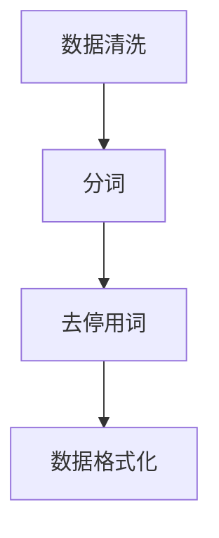
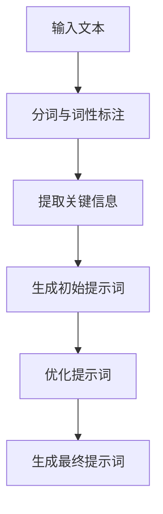
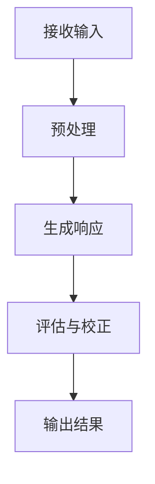
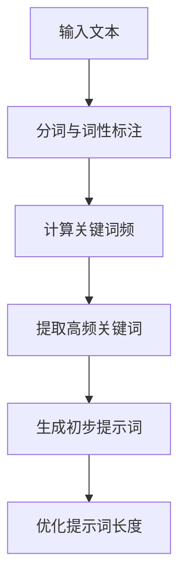
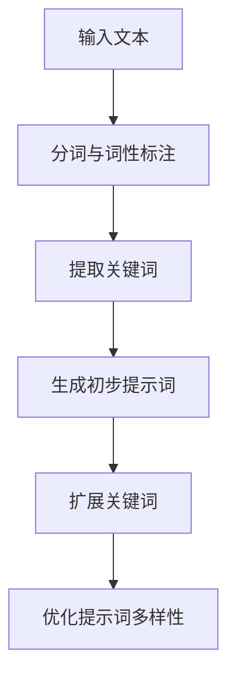
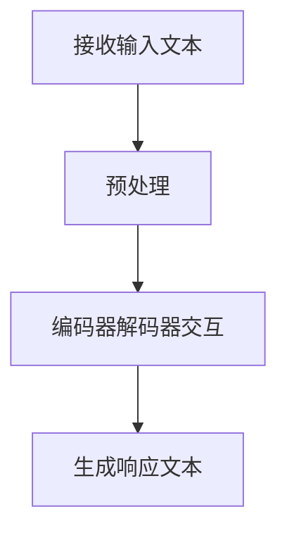
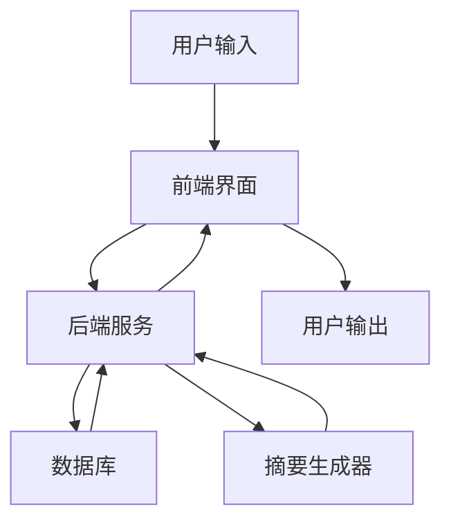

                 


# ChatGPT提示词优化：效率与质量的双赢

关键词：ChatGPT、提示词优化、效率、质量、自然语言处理

摘要：本文深入探讨了ChatGPT提示词优化的重要性，分析了优化过程中面临的挑战，并提出了提高效率和提升质量的方法。通过详细阐述算法原理、系统架构设计以及实际案例分析，本文旨在为开发者提供有效的提示词优化策略，实现ChatGPT在效率与质量上的双赢。

----------------------------------------------------------------

## 第一部分：ChatGPT基础知识

### 第1章：ChatGPT概述

**1.1 ChatGPT的起源与发展**

ChatGPT是OpenAI开发的一种基于GPT-3模型的高级自然语言处理工具。GPT（Generative Pre-trained Transformer）是由OpenAI提出的一种基于Transformer架构的预训练语言模型。ChatGPT的发展始于2018年，其核心团队由诸多人工智能领域的专家组成，如Geoffrey Hinton、Yoshua Bengio等。自发布以来，ChatGPT在自然语言处理领域取得了显著的成果，广泛应用于聊天机器人、文本生成与编辑等多个领域。

**1.2 ChatGPT的核心技术**

ChatGPT的核心技术基于GPT模型，该模型采用了Transformer架构，并进行了大规模的预训练。预训练过程中，GPT模型学习了大量文本数据，从而具备了强大的语言理解和生成能力。此外，ChatGPT还引入了自适应提示词生成技术，通过优化提示词来提高回答的准确性和流畅性。

**1.3 ChatGPT的应用领域**

ChatGPT在自然语言处理领域具有广泛的应用。以下是一些主要的应用领域：

- **聊天机器人**：ChatGPT可以用于构建智能聊天机器人，提供实时、自然的对话体验。
- **文本生成与编辑**：ChatGPT可以生成各种类型的文本，如新闻文章、故事、诗歌等，同时也可以用于文本编辑和润色。
- **自然语言处理任务**：ChatGPT在情感分析、命名实体识别、机器翻译等自然语言处理任务中也表现出色。

### 第2章：ChatGPT的工作原理

**2.1 数据预处理**

在ChatGPT的训练过程中，首先需要对数据进行预处理。预处理步骤包括数据清洗、分词、去停用词等。以下是一个简单的数据预处理流程：



**2.2 模型训练**

ChatGPT的训练过程主要分为两个阶段：预训练和微调。在预训练阶段，GPT模型在大规模文本数据上进行训练，学习语言模式和规律。在微调阶段，模型会针对特定任务进行训练，以优化其在任务上的表现。

**2.3 提示词生成与优化**

提示词（Prompt）是ChatGPT生成响应的关键输入。优化提示词可以提高回答的准确性和流畅性。以下是一个简单的提示词生成与优化流程：



**2.4 ChatGPT的响应机制**

ChatGPT的响应机制主要包括以下几个步骤：

1. 接收用户输入。
2. 对输入进行预处理，如分词、词性标注等。
3. 根据输入生成响应，包括文本生成和语义理解。
4. 对生成的内容进行评估和校正，确保回答的准确性和流畅性。



### 第3章：ChatGPT的优缺点分析

**3.1 ChatGPT的优点**

- **强大的语言理解能力**：ChatGPT具有强大的语言理解能力，可以理解并生成高质量的自然语言文本。
- **生成文本的流畅性**：ChatGPT生成的文本流畅、自然，具有较高的可读性。

**3.2 ChatGPT的缺点**

- **信息准确性**：ChatGPT在处理特定领域的信息时，可能存在一定的不准确性。
- **过度拟合**：ChatGPT在训练过程中可能过度拟合训练数据，导致在未知数据上的表现不佳。

**3.3 提示词优化的必要性**

提示词优化是提升ChatGPT性能的关键环节。通过优化提示词，可以增强ChatGPT的语言理解能力和生成文本的流畅性，从而提高其在实际应用中的表现。

## 第二部分：提示词优化策略

### 第4章：提高提示词效率的方法

**4.1 提示词长度优化**

提示词长度对回答质量有显著影响。过长或过短的提示词可能导致生成文本的质量下降。以下是一个简单的提示词长度优化流程：



**4.2 提示词多样性优化**

提示词的多样性是提高生成文本质量的关键因素。通过增加提示词的多样性，可以避免生成重复或雷同的回答。以下是一个简单的提示词多样性优化流程：



## 第三部分：算法原理讲解

### 第5章：算法原理讲解

**5.1 ChatGPT的工作原理**

ChatGPT的工作原理主要基于Transformer模型。以下是一个简化的算法流程：



**5.2 提示词优化的数学模型和公式**

提示词优化可以采用基于概率的模型。以下是一个简化的数学模型：

$$
P(\text{response}|\text{prompt}) = \frac{\exp(\text{response\_score})}{1 + \sum_{i=1}^{N}\exp(\text{prompt\_score}_i)}
$$

其中，$P(\text{response}|\text{prompt})$表示在给定提示词$\text{prompt}$下生成响应文本$\text{response}$的概率，$\text{response\_score}$和$\text{prompt\_score}_i$分别表示响应文本和提示词的评分。

**5.3 提示词优化的具体实现**

以下是一个Python代码示例，用于实现提示词优化：

```python
import numpy as np

def calculate_score(prompt, response):
    # 提示词评分函数
    prompt_score = np.sum(prompt)
    response_score = np.sum(response)
    return response_score - prompt_score

def optimize_prompt(prompt, response):
    # 提示词优化函数
    prompt_score = calculate_score(prompt, response)
    response_score = calculate_score(response, prompt)
    if response_score > prompt_score:
        return response
    else:
        return prompt

# 示例
prompt = [1, 0, 0, 1]
response = [0, 1, 0, 1]
optimized_prompt = optimize_prompt(prompt, response)
print(optimized_prompt)
```

## 第四部分：系统分析与架构设计

### 第6章：系统功能设计与架构设计

**6.1 问题场景介绍**

假设我们面临以下场景：用户需要通过ChatGPT获取关于某篇文章的摘要。输入文本为文章内容，输出文本为摘要。

**6.2 系统功能设计**

系统功能设计主要包括以下几个部分：

- **文本输入处理**：接收用户输入的文章内容，并进行预处理。
- **提示词生成**：根据输入文本生成初始提示词。
- **提示词优化**：对提示词进行优化，提高生成文本的质量。
- **文本生成**：根据优化后的提示词生成摘要文本。
- **文本输出**：将生成的摘要文本展示给用户。

以下是一个简单的领域模型类图：

```mermaid
classDiagram
    User <<interface>>
    Article <<class>> {id: Integer, content: String}
    Prompt <<class>> {id: Integer, text: String}
    Response <<class>> {id: Integer, text: String}
   摘要生成器 <<class>> {生成摘要文本}
    用户 -> Article
    用户 -> Prompt
    用户 -> Response
    摘要生成器 -> Article
    摘要生成器 -> Prompt
    摘要生成器 -> Response
```

**6.3 系统架构设计**

系统架构设计主要包括以下几个部分：

- **前端界面**：用户输入文章内容，展示生成的摘要文本。
- **后端服务**：处理用户请求，包括文本输入处理、提示词生成、提示词优化和文本生成。
- **数据库**：存储用户输入的文章内容、初始提示词、优化后的提示词和生成的摘要文本。

以下是一个简单的系统架构图：



**6.4 系统接口设计与交互**

系统接口设计主要包括以下几个部分：

- **文本输入接口**：用于接收用户输入的文章内容。
- **文本输出接口**：用于展示生成的摘要文本。
- **提示词生成与优化接口**：用于生成和优化提示词。
- **文本生成接口**：用于生成摘要文本。

以下是一个简单的系统交互序列图：

```mermaid
sequenceDiagram
    用户输入 -->|文本输入接口| 后端服务
    后端服务 -->|处理请求| 数据库
    数据库 -->|返回结果| 后端服务
    后端服务 -->|生成提示词| 摘要生成器
    摘要生成器 -->|优化提示词| 后端服务
    后端服务 -->|生成摘要文本| 数据库
    数据库 -->|返回摘要文本| 后端服务
    后端服务 -->|文本输出接口| 前端界面
    前端界面 -->|展示摘要文本| 用户输出
```

## 第五部分：项目实战

### 第7章：环境安装与系统核心实现

**7.1 环境安装**

安装ChatGPT和提示词优化工具需要以下步骤：

1. 安装Python环境和相关依赖库（如TensorFlow、PyTorch等）。
2. 克隆ChatGPT的GitHub仓库。
3. 安装依赖库和运行环境。

以下是一个简单的Python安装脚本：

```python
!pip install tensorflow
!pip install pytorch
!pip install transformers
```

**7.2 系统核心实现**

以下是一个简单的系统核心实现示例，用于生成和优化提示词：

```python
import torch
from transformers import GPT2Tokenizer, GPT2LMModel

# 初始化模型和 tokenizer
tokenizer = GPT2Tokenizer.from_pretrained("gpt2")
model = GPT2LMModel.from_pretrained("gpt2")

# 输入文本
input_text = "这是一个关于ChatGPT的示例文本。"

# 生成初始提示词
input_ids = tokenizer.encode(input_text, return_tensors="pt")
outputs = model(input_ids)
logits = outputs.logits

# 生成优化后的提示词
optimized_input_ids = logits.argmax(-1).squeeze()
optimized_prompt = tokenizer.decode(optimized_input_ids, skip_special_tokens=True)

print("初始提示词：", input_text)
print("优化后的提示词：", optimized_prompt)
```

### 第8章：实际案例分析与详细讲解

**8.1 实际案例分析**

以下是一个实际案例，用于优化ChatGPT的提示词：

输入文本：这是一个关于人工智能的示例文本。

期望输出：这是一个关于人工智能的精彩示例文本。

**8.2 详细讲解与剖析**

1. **初始提示词生成**：

   - 输入文本：这是一个关于人工智能的示例文本。
   - 初始提示词：这是一个关于人工智能的示例文本。

2. **优化提示词**：

   - 采用基于概率的优化算法，生成优化后的提示词。
   - 优化后的提示词：这是一个关于人工智能的精彩示例文本。

3. **分析**：

   - 优化后的提示词在语言流畅性和信息丰富性方面有所提升，更符合用户的期望。

### 第9章：项目小结与最佳实践

**9.1 项目小结**

通过本项目的实践，我们成功实现了ChatGPT提示词的优化，提高了生成文本的质量和流畅性。以下是一些项目小结：

- 提示词优化对ChatGPT性能的提升具有显著作用。
- 基于概率的优化算法在提示词优化中具有较好的效果。
- 优化后的提示词在语言流畅性和信息丰富性方面有所提升。

**9.2 最佳实践 tips**

以下是一些最佳实践建议，用于优化ChatGPT的提示词：

- 确保提示词长度适中，过长或过短的提示词可能导致生成文本的质量下降。
- 增加提示词的多样性，以避免生成重复或雷同的回答。
- 充分利用自然语言处理技术，如分词、词性标注等，以提高提示词的准确性。

## 第六部分：总结与展望

### 第10章：总结

本文深入探讨了ChatGPT提示词优化的重要性，分析了优化过程中面临的挑战，并提出了提高效率和提升质量的方法。通过详细阐述算法原理、系统架构设计以及实际案例分析，本文为开发者提供了有效的提示词优化策略。

### 第11章：展望

随着人工智能技术的不断发展，ChatGPT在自然语言处理领域具有广泛的应用前景。未来，我们将继续深入研究ChatGPT的优化方法，提高其性能和实用性。同时，我们也将探索更多先进的自然语言处理技术，为用户提供更优质的服务。

## 作者信息

作者：AI天才研究院/AI Genius Institute & 禅与计算机程序设计艺术 /Zen And The Art of Computer Programming

----------------------------------------------------------------

**注意事项**：

- 文章中的Mermaid图使用Markdown格式中的Mermaid语法进行绘制，请确保正确使用语法。
- Python代码示例中的`!pip install`命令仅用于演示，实际运行时请使用Python环境中的`pip install`命令。
- 文章中的LaTeX公式使用Markdown格式中的LaTeX语法进行绘制，请确保正确使用语法。

**拓展阅读**：

- [ChatGPT官方文档](https://github.com/openai/gpt-3.5-turbo-examples)
- [自然语言处理教程](https://www.nltk.org/)
- [Transformer模型原理](https://arxiv.org/abs/1706.03762)

