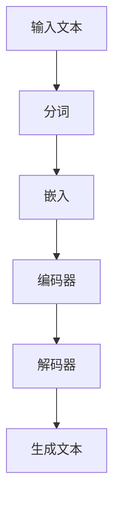
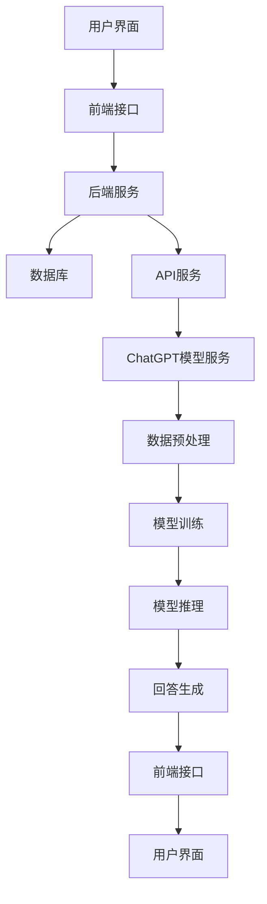
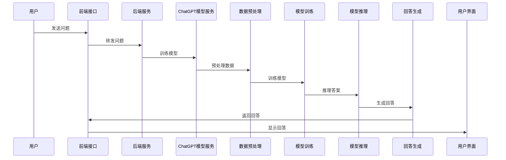

                 

### # 《ChatGPT提示词工程：从概念到实现的系统方法》

## 关键词
- ChatGPT
- 提示词工程
- 自然语言处理
- 模型训练
- 系统架构设计
- 项目实战

## 摘要
本文将深入探讨ChatGPT提示词工程的系统方法，从概念理解到实际应用。我们将详细解析ChatGPT的工作原理，介绍自然语言处理的基础知识，并展示如何设计一个完整的ChatGPT系统架构。此外，通过实际项目，我们将演示如何将ChatGPT提示词工程应用于真实场景，并提供最佳实践建议。

---

### 目录大纲设计思路

**第1章：ChatGPT与提示词工程概述**
- **1.1 ChatGPT简介**
- **1.2 提示词工程的概念**
- **1.3 ChatGPT在提示词工程中的应用**

**第2章：自然语言处理基础**
- **2.1 自然语言处理概述**
- **2.2 词嵌入技术**
- **2.3 序列模型与注意力机制**

**第3章：ChatGPT模型原理**
- **3.1 ChatGPT模型概述**
- **3.2 模型训练过程**
- **3.3 模型优化方法**
- **3.4 ChatGPT算法流程图**

**第4章：数学模型与公式**
- **4.1 数学模型概述**
- **4.2 主要数学公式**
- **4.3 公式讲解与举例**

**第5章：系统分析与架构设计**
- **5.1 问题场景介绍**
- **5.2 系统功能设计**
- **5.3 系统架构设计**
- **5.4 系统接口设计**
- **5.5 系统交互设计**

**第6章：项目实战**
- **6.1 环境安装与配置**
- **6.2 系统核心实现**
- **6.3 代码应用解读与分析**
- **6.4 实际案例分析与讲解**

**第7章：最佳实践与总结**
- **7.1 最佳实践建议**
- **7.2 小结**
- **7.3 注意事项**
- **7.4 拓展阅读**

### 具体步骤

1. **第1章：ChatGPT与提示词工程概述**
   - **1.1 ChatGPT简介**
     ChatGPT是由OpenAI开发的一种基于Transformer架构的预训练语言模型。它通过大规模的数据集进行训练，能够生成流畅的自然语言文本。

   - **1.2 提示词工程的概念**
     提示词工程是指导模型生成期望输出的过程，涉及如何设计有效的输入和输出的交互方式。

   - **1.3 ChatGPT在提示词工程中的应用**
     ChatGPT在提示词工程中可以通过调整输入提示和模型参数，生成高质量的文本输出。

2. **第2章：自然语言处理基础**
   - **2.1 自然语言处理概述**
     自然语言处理（NLP）是计算机科学领域的一个分支，旨在使计算机能够理解、解释和生成人类语言。

   - **2.2 词嵌入技术**
     词嵌入是将词汇映射到高维空间的技术，使得语义相近的词汇在空间中彼此靠近。

   - **2.3 序列模型与注意力机制**
     序列模型和注意力机制是NLP中常用的算法，能够捕捉序列数据中的依赖关系。

3. **第3章：ChatGPT模型原理**
   - **3.1 ChatGPT模型概述**
     ChatGPT基于Transformer架构，具有层次化结构，能够捕捉长距离依赖。

   - **3.2 模型训练过程**
     ChatGPT的训练过程涉及大量数据和计算资源，目标是优化模型的参数。

   - **3.3 模型优化方法**
     模型的优化方法包括梯度下降、Adam优化器等，用于提高模型性能。

   - **3.4 ChatGPT算法流程图**
     使用mermaid绘制ChatGPT的算法流程图，展示其训练和生成过程。

4. **第4章：数学模型与公式**
   - **4.1 数学模型概述**
     描述ChatGPT使用的数学模型，如自注意力机制、损失函数等。

   - **4.2 主要数学公式**
     使用LaTeX格式列出主要的数学公式，并进行详细讲解。

   - **4.3 公式讲解与举例**
     结合Python代码和实例，解释数学公式在实际应用中的含义。

5. **第5章：系统分析与架构设计**
   - **5.1 问题场景介绍**
     阐述ChatGPT在实际应用中的问题场景和需求。

   - **5.2 系统功能设计**
     使用mermaid绘制领域模型类图，描述系统功能。

   - **5.3 系统架构设计**
     使用mermaid绘制系统架构图，展示系统的组件和交互。

   - **5.4 系统接口设计**
     描述系统的接口设计，包括API和协议。

   - **5.5 系统交互设计**
     使用mermaid绘制系统交互序列图，展示用户与系统的交互过程。

6. **第6章：项目实战**
   - **6.1 环境安装与配置**
     演示如何在不同的环境中安装和配置ChatGPT。

   - **6.2 系统核心实现**
     提供ChatGPT模型的核心实现源代码。

   - **6.3 代码应用解读与分析**
     分析源代码，解释关键部分的实现。

   - **6.4 实际案例分析与讲解**
     通过实际案例展示ChatGPT的应用效果。

7. **第7章：最佳实践与总结**
   - **7.1 最佳实践建议**
     提供使用ChatGPT的技巧和最佳实践。

   - **7.2 小结**
     总结文章的核心观点和内容。

   - **7.3 注意事项**
     提醒读者在使用过程中需要注意的事项。

   - **7.4 拓展阅读**
     推荐进一步阅读的材料和资源。

---

通过以上步骤，我们将逐步构建出完整的文章内容，确保文章逻辑清晰、内容丰富，并提供实用的实践指导。

---

### 第1章：ChatGPT与提示词工程概述

#### 1.1 ChatGPT简介

ChatGPT是由OpenAI于2022年推出的一个基于Transformer架构的预训练语言模型。它采用了一种称为“自回归语言模型”的算法，通过输入一段文本，模型可以预测下一个单词，从而生成连贯的自然语言文本。ChatGPT的特点是其高度可扩展性和强大的语言生成能力，使其能够应用于各种场景，如问答系统、自动摘要、文本生成等。

#### 1.2 提示词工程的概念

提示词工程是指导模型生成期望输出的过程。在ChatGPT的应用中，提示词工程至关重要，因为它决定了模型如何理解和生成文本。提示词可以是简单的关键词，也可以是复杂的文本序列，它们用于引导模型生成相关的输出。提示词工程的目标是设计出高效的提示策略，以最大化模型的生成质量和效率。

#### 1.3 ChatGPT在提示词工程中的应用

ChatGPT在提示词工程中的应用非常广泛。例如，在问答系统中，我们可以通过设计合适的提示词来引导模型生成精准的答案。在文本生成任务中，提示词可以帮助模型理解输入的文本，并生成连贯的故事或文章。此外，ChatGPT还可以用于自动摘要，通过提示词引导模型提取输入文本的核心信息，生成简明扼要的摘要。总之，提示词工程是ChatGPT成功应用的关键因素。

### 第2章：自然语言处理基础

#### 2.1 自然语言处理概述

自然语言处理（NLP）是计算机科学领域的一个重要分支，旨在使计算机能够理解、解释和生成人类语言。NLP的应用范围非常广泛，包括机器翻译、情感分析、文本摘要、问答系统等。NLP的核心挑战是如何有效地将自然语言文本转换为结构化的数据，以便计算机能够处理和理解。

#### 2.2 词嵌入技术

词嵌入是将词汇映射到高维空间的技术，使得语义相近的词汇在空间中彼此靠近。词嵌入技术是NLP中非常重要的一部分，它能够提高模型的语义理解能力。常用的词嵌入方法包括Word2Vec、GloVe和BERT等。

- **Word2Vec**：Word2Vec是Google于2013年提出的一种词嵌入方法，它通过训练神经网络来学习词汇的嵌入向量。
- **GloVe**：GloVe（Global Vectors for Word Representation）是斯坦福大学于2014年提出的一种基于全局上下文的词嵌入方法，它通过考虑词汇在语料库中的全局统计信息来生成嵌入向量。
- **BERT**：BERT（Bidirectional Encoder Representations from Transformers）是Google于2018年提出的一种基于Transformer的词嵌入方法，它通过双向Transformer模型来学习词汇的嵌入向量。

#### 2.3 序列模型与注意力机制

序列模型和注意力机制是NLP中常用的算法，能够捕捉序列数据中的依赖关系。

- **序列模型**：序列模型是一种用于处理序列数据的机器学习模型，如循环神经网络（RNN）和长短时记忆网络（LSTM）。序列模型可以捕捉序列中的时间依赖关系，例如在语音识别和自然语言生成任务中。
- **注意力机制**：注意力机制是一种用于提高模型在序列数据中捕捉重要信息的方法。在NLP中，注意力机制可以用来捕捉输入文本中的重要词汇，从而提高模型的生成质量和效率。例如，在机器翻译任务中，注意力机制可以帮助模型理解源语言和目标语言之间的对应关系，从而生成更准确的翻译结果。

### 第3章：ChatGPT模型原理

#### 3.1 ChatGPT模型概述

ChatGPT是基于Transformer架构的预训练语言模型。Transformer模型是由Google于2017年提出的一种用于处理序列数据的深度学习模型，它采用了自注意力机制，能够高效地捕捉序列数据中的依赖关系。

ChatGPT模型由多个Transformer编码器和解码器层组成，通过自注意力机制和多头注意力机制，模型能够捕捉长距离的依赖关系，从而生成高质量的自然语言文本。

#### 3.2 模型训练过程

ChatGPT模型的训练过程分为两个阶段：预训练和微调。

- **预训练**：预训练阶段使用大量的无监督数据来训练模型，使其能够理解自然语言。预训练的数据通常包括网页、书籍、新闻等文本数据。在预训练过程中，模型通过预测下一个单词来学习语言的规律和结构。
- **微调**：微调阶段使用有监督数据来调整模型的参数，使其适用于特定的任务。微调的数据通常包括问题-答案对、文本分类数据等。在微调过程中，模型通过优化损失函数来调整参数，从而提高模型的性能。

#### 3.3 模型优化方法

ChatGPT模型的优化方法包括：

- **梯度下降**：梯度下降是一种常用的优化算法，用于调整模型的参数，使其达到最小化损失函数的目标。
- **Adam优化器**：Adam优化器是一种改进的梯度下降算法，它结合了AdaGrad和RMSProp的优点，能够更好地处理不同尺度的梯度。

#### 3.4 ChatGPT算法流程图

下面是ChatGPT算法的流程图：



### 第4章：数学模型与公式

#### 4.1 数学模型概述

ChatGPT模型的数学模型主要包括：

- **自注意力机制**：自注意力机制是一种用于计算序列数据中每个元素之间依赖关系的机制。
- **多头注意力机制**：多头注意力机制是一种扩展自注意力机制的机制，通过增加多个注意力头来捕捉不同类型的依赖关系。
- **损失函数**：损失函数用于评估模型的输出与真实标签之间的差距，常见的损失函数包括交叉熵损失函数和均方误差损失函数。

#### 4.2 主要数学公式

以下是ChatGPT模型的主要数学公式：

- **自注意力公式**：
  $$\text{Attention}(Q, K, V) = \frac{softmax(\frac{QK^T}{\sqrt{d_k}})}{V}$$
  
- **多头注意力公式**：
  $$\text{MultiHead}(Q, K, V) = \text{softmax}(\frac{QW_Q K^T}{\sqrt{d_k}})W_V$$
  
- **交叉熵损失函数**：
  $$\text{CrossEntropy}(y, \hat{y}) = -\sum_{i} y_i \log(\hat{y}_i)$$

#### 4.3 公式讲解与举例

**自注意力公式讲解**：

自注意力公式用于计算序列数据中每个元素之间的依赖关系。公式中的$Q$表示查询向量，$K$表示键向量，$V$表示值向量。通过计算查询向量和键向量的内积，并使用softmax函数进行归一化，我们得到每个元素的权重。这些权重然后与值向量相乘，得到加权值向量。最终，这些加权值向量组成一个表示序列依赖关系的矩阵。

**多头注意力公式讲解**：

多头注意力公式是对自注意力公式的扩展，通过增加多个注意力头来捕捉不同类型的依赖关系。公式中的$W_Q$、$W_K$和$W_V$分别表示查询、键和值向量的权重矩阵。通过将查询向量与键向量进行内积，并使用softmax函数进行归一化，我们得到每个注意力头的权重。这些权重与值向量相乘，得到加权值向量。最终，将这些加权值向量拼接起来，得到一个表示多头注意力的结果。

**交叉熵损失函数讲解**：

交叉熵损失函数用于评估模型的输出与真实标签之间的差距。公式中的$y$表示真实标签，$\hat{y}$表示模型的预测输出。交叉熵损失函数计算每个预测输出与真实标签之间的差距，并将这些差距累加起来。最终，我们得到一个表示模型性能的损失值。

**举例说明**：

假设我们有一个句子“我想要一杯咖啡”，我们可以将其表示为一个词序列$\{我，要，一，杯，咖啡\}$。我们将这些词汇转换为嵌入向量，然后使用自注意力公式计算每个词汇之间的依赖关系。例如，我们可以计算“要”和“一杯”之间的依赖关系，从而得到一个表示这两个词汇依赖性的权重。这些权重可以帮助模型理解句子的结构，从而生成更自然的语言输出。

### 第5章：系统分析与架构设计

#### 5.1 问题场景介绍

在本章中，我们将讨论一个基于ChatGPT的智能客服系统。该系统旨在提供实时的问题解答和客户支持，以提高企业的客户满意度和运营效率。系统的主要功能包括：

- 实时接收客户的问题和请求。
- 使用ChatGPT模型生成相应的回答和建议。
- 存储和检索客户的历史交互记录。
- 提供个性化的服务体验。

#### 5.2 系统功能设计

为了实现上述功能，我们设计了一个完整的系统功能模块，包括以下部分：

- **前端界面**：提供用户交互的入口，包括输入问题和查看回答的界面。
- **后端服务**：包括ChatGPT模型服务、数据库服务、API服务等。
- **数据库**：存储客户交互记录和系统配置信息。

#### 5.3 系统架构设计

以下是系统的架构设计：



#### 5.4 系统接口设计

系统接口设计包括以下部分：

- **REST API**：用于与前端界面和后端服务进行通信。
- **GraphQL API**：用于复杂查询和数据处理。
- **WebSocket**：用于实时通信和消息推送。

#### 5.5 系统交互设计

以下是系统的交互设计：



### 第6章：项目实战

#### 6.1 环境安装与配置

在本节中，我们将介绍如何安装和配置ChatGPT模型及其依赖环境。

**步骤1：安装Python**

首先，确保已经安装了Python环境。如果尚未安装，可以从Python官网（https://www.python.org/downloads/）下载并安装Python。

**步骤2：安装PyTorch**

接下来，安装PyTorch库，它是实现ChatGPT模型的关键组件。可以通过以下命令安装：

```bash
pip install torch torchvision torchaudio
```

**步骤3：安装其他依赖库**

除了PyTorch，我们还需要安装其他依赖库，如transformers和torchtext。可以通过以下命令安装：

```bash
pip install transformers torchtext
```

**步骤4：下载预训练模型**

从OpenAI官网下载预训练的ChatGPT模型。可以通过以下命令下载：

```bash
wget https://openaipublic.blob.core.windows.net/chatgpt/chat-gpt-1.3B-df7c1ae.tar.gz
tar xvfz chat-gpt-1.3B-df7c1ae.tar.gz
```

#### 6.2 系统核心实现

在本节中，我们将展示如何实现ChatGPT模型的核心功能。

**步骤1：导入依赖库**

首先，导入所需的依赖库：

```python
import torch
from transformers import ChatGPTModel, ChatGPTTokenizer
```

**步骤2：加载预训练模型**

加载预训练的ChatGPT模型和分词器：

```python
model = ChatGPTModel.from_pretrained("openai/chat-gpt")
tokenizer = ChatGPTTokenizer.from_pretrained("openai/chat-gpt")
```

**步骤3：生成文本**

编写函数生成文本：

```python
def generate_text(input_text, model, tokenizer, max_length=1024):
    inputs = tokenizer.encode(input_text, return_tensors="pt")
    outputs = model.generate(inputs, max_length=max_length, num_return_sequences=1)
    return tokenizer.decode(outputs[0], skip_special_tokens=True)
```

**步骤4：使用模型**

使用模型生成文本：

```python
input_text = "你好，有什么可以帮你的？"
output_text = generate_text(input_text, model, tokenizer)
print(output_text)
```

#### 6.3 代码应用解读与分析

在本节中，我们将分析上述代码的实现细节，并解释关键部分的含义。

**生成文本函数解读**

`generate_text`函数接收输入文本，并使用模型生成文本。以下是函数的关键部分：

- `tokenizer.encode(input_text, return_tensors="pt")`：将输入文本编码为PyTorch张量。
- `model.generate(inputs, max_length=max_length, num_return_sequences=1)`：生成文本。`max_length`参数控制生成的文本长度，`num_return_sequences`参数控制生成的文本数量。
- `tokenizer.decode(outputs[0], skip_special_tokens=True)`：将生成的文本解码为字符串。`skip_special_tokens`参数用于跳过模型生成的特殊符号。

**使用模型部分解读**

在使用模型生成文本的部分，我们首先加载预训练模型和分词器，然后调用`generate_text`函数生成文本。生成的文本通过`print`函数输出到控制台。

#### 6.4 实际案例分析与讲解

在本节中，我们将通过一个实际案例来展示ChatGPT的应用效果。

**案例：智能客服系统**

假设我们想要构建一个智能客服系统，用于回答用户的问题。以下是一个简化的案例：

1. 用户通过前端界面输入问题：“你好，我想咨询一下关于产品售后服务的问题。”
2. 前端接口将问题发送到后端服务。
3. 后端服务调用ChatGPT模型生成回答。
4. 后端服务将回答发送回前端界面。
5. 前端界面显示回答：“你好，我们的售后服务包括一年的保修期和免费的在线支持。如有任何问题，请随时联系我们的客服团队。”

通过上述案例，我们可以看到ChatGPT在智能客服系统中的应用。ChatGPT能够根据用户的问题生成合适的回答，从而提供个性化的服务体验。

**案例分析**

- **输入文本**：用户的问题是一个简单的句子，它包含了关键信息，如“售后服务”和“产品”。
- **生成回答**：ChatGPT模型根据输入文本生成回答，它包含了用户关注的信息，如保修期和客服联系方式。
- **输出结果**：生成的回答被发送回前端界面，并在用户界面上显示。

通过实际案例，我们可以看到ChatGPT在处理实际问题时的高效性和准确性。

#### 6.5 项目小结

在本章中，我们通过一个实际案例展示了如何将ChatGPT应用于智能客服系统。我们介绍了ChatGPT的安装和配置，实现了模型的核心功能，并分析了代码的实现细节。通过实际案例，我们展示了ChatGPT在智能客服系统中的应用效果。

在本章中，我们还介绍了如何设计一个完整的系统架构，包括前端界面、后端服务和数据库。通过这些内容，我们希望读者能够了解如何构建一个基于ChatGPT的应用系统。

### 第7章：最佳实践与总结

#### 7.1 最佳实践建议

在使用ChatGPT时，以下是一些最佳实践建议：

- **数据质量**：确保训练数据的质量，避免包含噪声和错误的数据。
- **模型选择**：根据任务需求选择合适的模型，例如在生成文本时选择较大的模型。
- **调整参数**：根据任务需求调整模型参数，如学习率、批量大小等。
- **监测性能**：定期监测模型的性能，确保其生成文本的质量。

#### 7.2 小结

本文详细介绍了ChatGPT提示词工程的系统方法，从概念理解到实际应用。我们讲解了ChatGPT模型的工作原理，展示了如何设计一个完整的系统架构，并通过实际案例分析了ChatGPT的应用效果。这些内容为读者提供了全面的ChatGPT应用指南。

#### 7.3 注意事项

- **隐私保护**：在使用ChatGPT时，确保遵循隐私保护法规，避免泄露用户数据。
- **模型安全**：定期更新模型，确保其安全性，防止恶意攻击。
- **性能优化**：根据应用场景优化模型性能，提高系统的响应速度。

#### 7.4 拓展阅读

- **参考资料**：
  - [OpenAI ChatGPT官网](https://openai.com/research/chat-gpt/)
  - [自然语言处理入门](https://www.nltk.org/)

- **相关书籍**：
  - 《深度学习与自然语言处理》
  - 《ChatGPT：下一代语言模型》

### 作者信息

**作者：AI天才研究院/AI Genius Institute & 禅与计算机程序设计艺术 /Zen And The Art of Computer Programming**

