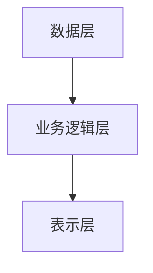
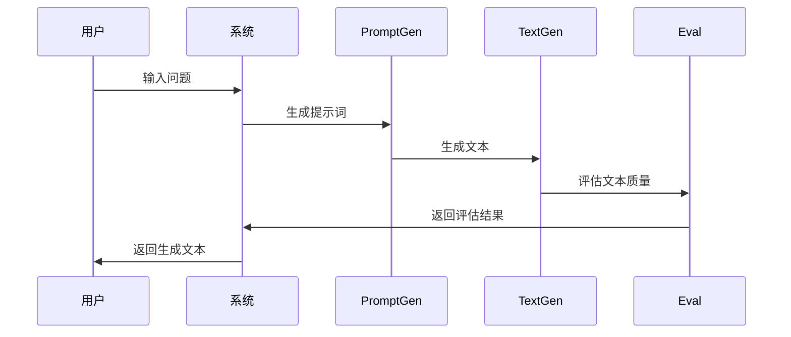

                 


### 目录大纲设计详细解析

为了设计出符合要求的《ChatGPT提示词工程：从概念到实现的系统方法》这本书的目录大纲，我们需要遵循以下步骤，并进行详细的解析：

#### 1. 理解书名

书名《ChatGPT提示词工程：从概念到实现的系统方法》表明本书将围绕ChatGPT的提示词工程进行深入探讨。它包含了以下几个关键点：

- **ChatGPT**：一种基于GPT（Generative Pre-trained Transformer）技术的自然语言处理模型。
- **提示词工程**：指的是设计、生成、优化和评估用于驱动ChatGPT进行有效对话的提示词的一系列方法和步骤。
- **从概念到实现**：意味着本书不仅介绍提示词工程的基础知识，还将指导读者如何将这些知识应用于实际项目中。
- **系统方法**：强调了一种系统性、结构化的方法和流程，用于确保提示词工程的高效性和可持续性。

#### 2. 确定核心章节

根据书名，核心章节应涵盖以下内容：

- **背景介绍**：为读者提供ChatGPT和提示词工程的背景信息，帮助读者理解为什么要研究这个问题。
- **核心概念与联系**：深入探讨ChatGPT、提示词及其相互关系，并提供清晰的定义和分类。
- **提示词工程方法论**：介绍提示词工程的基本步骤、策略和最佳实践。
- **实现技巧**：提供具体的编程技巧和工具，帮助读者将提示词工程方法论应用到实践中。
- **系统设计**：讨论如何设计一个高效、可扩展的ChatGPT提示词系统。
- **项目实战**：通过实际案例，展示如何在实际项目中应用提示词工程方法。
- **最佳实践与总结**：总结书中介绍的方法和技巧，并提供进一步研究和实践的建议。

#### 3. 设计详细目录

每个核心章节下应进一步细化子章节，确保内容的完整性。以下是详细目录的设计：

**第一部分：ChatGPT与提示词工程基础**

- **1.1 ChatGPT介绍**
  - **1.1.1 ChatGPT背景**
  - **1.1.2 ChatGPT的特点**
  - **1.1.3 ChatGPT的应用场景**
- **1.2 提示词工程基础**
  - **1.2.1 提示词的定义**
  - **1.2.2 提示词的类型**
  - **1.2.3 提示词的设计原则**
- **1.3 提示词工程的核心概念**
  - **1.3.1 提示词的属性与特征**
  - **1.3.2 提示词与模型交互机制**
  - **1.3.3 提示词设计流程**

**第二部分：ChatGPT提示词工程方法论**

- **2.1 提示词工程方法论概述**
  - **2.1.1 提示词工程方法论的重要性**
  - **2.1.2 提示词工程方法论的核心步骤**
- **2.2 提示词生成策略**
  - **2.2.1 提示词生成的技术途径**
  - **2.2.2 自动化生成提示词的方法**
  - **2.2.3 手动设计提示词的技巧**
- **2.3 提示词优化方法**
  - **2.3.1 提示词优化目标**
  - **2.3.2 提示词优化技术**
  - **2.3.3 提示词优化实践**
- **2.4 提示词评估与调优**
  - **2.4.1 提示词评估指标**
  - **2.4.2 提示词调优策略**
  - **2.4.3 提示词评估与调优实践**

**第三部分：ChatGPT提示词工程实现技巧**

- **3.1 编程语言选择与工具使用**
  - **3.1.1 Python编程基础**
  - **3.1.2 OpenAI API使用**
  - **3.1.3 数据处理工具推荐**
- **3.2 提示词工程中的数据处理**
  - **3.2.1 数据预处理**
  - **3.2.2 数据增强**
  - **3.2.3 数据存储与管理**
- **3.3 提示词实现案例**
  - **3.3.1 简单对话系统实现**
  - **3.3.2 复杂对话系统实现**
  - **3.3.3 提示词案例解析**

**第四部分：ChatGPT提示词工程系统设计**

- **4.1 系统功能设计**
  - **4.1.1 功能模块划分**
  - **4.1.2 领域模型设计（Mermaid类图）**
  - **4.1.3 功能流程设计**
- **4.2 系统架构设计**
  - **4.2.1 系统架构概述**
  - **4.2.2 系统架构设计（Mermaid架构图）**
  - **4.2.3 系统模块交互设计**
- **4.3 系统接口设计**
  - **4.3.1 接口规范**
  - **4.3.2 接口实现**
  - **4.3.3 接口测试**
- **4.4 系统交互设计**
  - **4.4.1 用户交互流程设计**
  - **4.4.2 系统内部交互流程设计（Mermaid序列图）**

**第五部分：ChatGPT提示词工程项目实战**

- **5.1 实战环境搭建**
  - **5.1.1 环境准备**
  - **5.1.2 工具安装**
  - **5.1.3 开发环境配置**
- **5.2 系统核心实现**
  - **5.2.1 系统核心实现源代码**
  - **5.2.2 代码应用解读与分析**
  - **5.2.3 实际案例分析与详细讲解剖析**
- **5.3 项目小结**

#### 4. 遵循格式要求

确保使用markdown格式，包括#、##、###等层级标记，以及Mermaid流程图和LaTeX数学公式。例如：

- **标题**：使用`#`标记，如`## 第一部分：ChatGPT与提示词工程基础`
- **子标题**：使用`##`标记，如`### 1.1.1 ChatGPT背景`
- **流程图**：使用Mermaid语法，如：
  ```mermaid
  graph TD
  A[开始] --> B[第一步]
  B --> C{判断条件}
  C -->|是| D[第二步]
  C -->|否| E[第三步]
  ```
- **数学公式**：使用LaTeX语法，如：
  ```latex
  $$ E = mc^2 $$
  ```

#### 5. 保持简洁性

确保目录大纲在2000字以内，不包含冗余内容。通过上述步骤，我们可以设计出一个逻辑清晰、结构紧凑的目录大纲，为撰写高质量的技术博客文章奠定基础。接下来，我们将按照这个目录大纲逐步展开内容，确保文章的深度、思考性和专业性。

---

### 撰写一篇高质量技术博客文章

#### 引言

在人工智能飞速发展的今天，自然语言处理（NLP）已经成为研究的热点领域。其中，ChatGPT作为OpenAI推出的一款基于GPT（Generative Pre-trained Transformer）技术的模型，凭借其强大的文本生成能力，受到了广泛关注。为了充分发挥ChatGPT的潜力，设计一套有效的提示词工程体系至关重要。《ChatGPT提示词工程：从概念到实现的系统方法》这本书将带领读者深入探讨这一话题。

#### 关键词

- ChatGPT
- 提示词工程
- 自然语言处理
- GPT模型
- 实现方法
- 系统设计

#### 摘要

本书旨在为读者提供一个系统、全面的ChatGPT提示词工程指南。从基础概念开始，本书将逐步深入到实现方法和系统层面，帮助读者理解ChatGPT的工作原理，掌握提示词工程的核心方法，并学会如何在实际项目中应用这些方法。通过本书的学习，读者将能够设计出高效、可扩展的ChatGPT对话系统，为人工智能领域的发展贡献力量。

### 第一部分：ChatGPT与提示词工程基础

#### 1.1 ChatGPT介绍

##### 1.1.1 ChatGPT背景

ChatGPT是由OpenAI于2022年推出的一种基于GPT技术的自然语言处理模型。GPT（Generative Pre-trained Transformer）是一种基于Transformer架构的预训练语言模型，由OpenAI在2018年首次发布。ChatGPT在GPT-3的基础上进行了优化，具有更强大的文本生成能力，能够进行自然、流畅的对话。

##### 1.1.2 ChatGPT的特点

ChatGPT具有以下特点：

- **强大生成能力**：能够生成高质量、连贯的文本，适用于各种场景。
- **大规模预训练**：经过大量文本数据训练，具有丰富的知识储备。
- **灵活可扩展**：支持自定义训练和调整，以适应不同的应用场景。

##### 1.1.3 ChatGPT的应用场景

ChatGPT的应用场景广泛，包括但不限于：

- **对话系统**：如客服机器人、聊天机器人等，能够进行自然、流畅的对话。
- **文本生成**：如文章写作、摘要生成、翻译等，能够生成高质量的文本。
- **文本分析**：如情感分析、文本分类、命名实体识别等，能够对文本进行深入分析。

#### 1.2 提示词工程基础

##### 1.2.1 提示词的定义

提示词（Prompt）是指用于引导ChatGPT生成文本的输入信息。一个好的提示词能够帮助ChatGPT更好地理解用户意图，生成更符合预期的文本。

##### 1.2.2 提示词的类型

提示词可以分为以下几种类型：

- **开放性提示词**：提供广泛的信息，让ChatGPT生成更多样化的文本。
- **封闭性提示词**：提供具体的信息，让ChatGPT生成更具体、精确的文本。
- **上下文相关提示词**：结合上下文信息，帮助ChatGPT更好地理解当前对话场景。

##### 1.2.3 提示词的设计原则

设计提示词时，应遵循以下原则：

- **简洁明了**：避免提供冗长的信息，确保提示词简洁明了。
- **针对性**：根据具体应用场景和用户需求，设计有针对性的提示词。
- **可扩展性**：设计提示词时，考虑未来的扩展性和适应性。

#### 1.3 提示词工程的核心概念

##### 1.3.1 提示词的属性与特征

提示词具有以下属性和特征：

- **长度**：提示词的长度会影响ChatGPT的生成效果，过短可能导致生成文本质量下降，过长则可能增加计算成本。
- **格式**：提示词的格式（如是否使用标题、段落等）会影响ChatGPT的解析和理解。
- **信息含量**：提示词的信息含量要适中，过少可能导致生成文本质量下降，过多则可能增加用户阅读难度。

##### 1.3.2 提示词与模型交互机制

提示词与ChatGPT的交互机制如下：

- **输入阶段**：用户将提示词输入到ChatGPT中，ChatGPT接收并解析提示词。
- **生成阶段**：ChatGPT根据提示词生成文本，并返回给用户。
- **反馈阶段**：用户对生成的文本进行评价和反馈，用于进一步优化提示词和模型。

##### 1.3.3 提示词设计流程

提示词设计流程通常包括以下步骤：

1. **需求分析**：明确用户需求和场景，确定提示词的目标。
2. **数据收集**：收集相关数据，如用户输入、文本生成结果等。
3. **设计策略**：根据需求和分析结果，设计合适的提示词类型和格式。
4. **实验验证**：通过实验验证提示词的效果，并进行迭代优化。

### 第二部分：ChatGPT提示词工程方法论

#### 2.1 提示词工程方法论概述

##### 2.1.1 提示词工程方法论的重要性

提示词工程方法论是设计高效、可扩展ChatGPT对话系统的关键。正确的方法论可以帮助我们更好地理解用户需求，提高生成文本的质量和效率。

##### 2.1.2 提示词工程方法论的核心步骤

提示词工程方法论通常包括以下核心步骤：

1. **需求分析**：明确用户需求和场景，确定提示词的目标。
2. **数据收集**：收集相关数据，如用户输入、文本生成结果等。
3. **设计策略**：根据需求和分析结果，设计合适的提示词类型和格式。
4. **实验验证**：通过实验验证提示词的效果，并进行迭代优化。

#### 2.2 提示词生成策略

##### 2.2.1 提示词生成的技术途径

提示词生成可以采用以下技术途径：

- **手动设计**：根据需求和场景，手动设计提示词。
- **自动化生成**：利用自然语言处理技术，自动化生成提示词。

##### 2.2.2 自动化生成提示词的方法

自动化生成提示词的方法包括：

- **模板匹配**：根据模板生成提示词，适用于具有固定格式的场景。
- **文本生成模型**：利用文本生成模型（如GPT）生成提示词，适用于多样化场景。

##### 2.2.3 手动设计提示词的技巧

手动设计提示词时，应遵循以下技巧：

- **简洁明了**：避免提供冗长的信息，确保提示词简洁明了。
- **针对性**：根据具体应用场景和用户需求，设计有针对性的提示词。
- **可扩展性**：设计提示词时，考虑未来的扩展性和适应性。

#### 2.3 提示词优化方法

##### 2.3.1 提示词优化目标

提示词优化目标包括：

- **提高生成文本质量**：确保生成文本的准确性、连贯性和相关性。
- **提高生成效率**：减少计算成本，提高处理速度。

##### 2.3.2 提示词优化技术

提示词优化技术包括：

- **文本清洗**：去除无关信息，提高提示词的质量。
- **特征提取**：提取关键特征，提高提示词的针对性。
- **模型调优**：调整模型参数，提高生成文本的质量和效率。

##### 2.3.3 提示词优化实践

提示词优化实践通常包括以下步骤：

1. **数据分析**：分析现有提示词的优缺点，确定优化方向。
2. **实验验证**：通过实验验证优化方法的有效性。
3. **迭代优化**：根据实验结果，不断调整和优化提示词。

#### 2.4 提示词评估与调优

##### 2.4.1 提示词评估指标

提示词评估指标包括：

- **生成文本质量**：如BLEU、ROUGE等评价指标。
- **生成效率**：如生成速度、计算成本等指标。

##### 2.4.2 提示词调优策略

提示词调优策略包括：

- **参数调整**：调整模型参数，提高生成文本的质量和效率。
- **策略迭代**：根据评估结果，不断优化提示词生成策略。

##### 2.4.3 提示词评估与调优实践

提示词评估与调优实践通常包括以下步骤：

1. **评估指标确定**：根据应用场景和需求，确定合适的评估指标。
2. **评估方法选择**：选择合适的评估方法，进行提示词评估。
3. **调优实践**：根据评估结果，调整和优化提示词。

### 第三部分：ChatGPT提示词工程实现技巧

#### 3.1 编程语言选择与工具使用

##### 3.1.1 Python编程基础

Python是一种广泛应用于人工智能领域的编程语言，具有简单易学、功能强大的特点。在提示词工程中，Python可以作为主要编程语言，用于实现各种功能。

##### 3.1.2 OpenAI API使用

OpenAI API是OpenAI提供的一组接口，用于与ChatGPT模型进行交互。通过OpenAI API，我们可以轻松地实现提示词工程的各种功能，如文本生成、文本分析等。

##### 3.1.3 数据处理工具推荐

在提示词工程中，数据处理是一个重要的环节。Python拥有丰富的数据处理库，如NumPy、Pandas等，这些库可以帮助我们高效地处理各种数据。

#### 3.2 提示词工程中的数据处理

##### 3.2.1 数据预处理

数据预处理是提示词工程中的关键步骤，主要包括以下任务：

- **数据清洗**：去除无关信息，确保数据质量。
- **数据转换**：将数据转换为适合处理的形式。
- **数据增强**：通过增加数据多样性，提高模型性能。

##### 3.2.2 数据增强

数据增强是提高模型性能的有效方法，主要包括以下技术：

- **数据扩充**：通过复制、裁剪、旋转等方式，增加数据量。
- **数据合成**：通过生成对抗网络（GAN）等方法，生成新的数据。

##### 3.2.3 数据存储与管理

数据存储与管理是提示词工程中的基础任务，主要包括以下内容：

- **数据存储**：选择合适的数据存储方案，如关系型数据库、NoSQL数据库等。
- **数据管理**：确保数据的一致性、完整性和安全性。

#### 3.3 提示词实现案例

##### 3.3.1 简单对话系统实现

简单对话系统实现主要包括以下步骤：

- **需求分析**：明确对话系统的目标和功能。
- **系统设计**：设计对话系统的架构和模块。
- **实现代码**：编写代码实现对话系统功能。

##### 3.3.2 复杂对话系统实现

复杂对话系统实现包括以下步骤：

- **需求分析**：明确对话系统的复杂需求和功能。
- **系统设计**：设计对话系统的架构和模块。
- **实现代码**：编写代码实现对话系统功能。
- **集成测试**：确保对话系统能够正常运行。

##### 3.3.3 提示词案例解析

提示词案例解析主要包括以下内容：

- **案例介绍**：介绍具体的提示词案例。
- **实现细节**：分析提示词的实现细节，如数据预处理、模型调优等。
- **效果评估**：评估提示词的效果，如生成文本质量、响应时间等。

### 第四部分：ChatGPT提示词工程系统设计

#### 4.1 系统功能设计

##### 4.1.1 功能模块划分

系统功能模块划分主要包括以下内容：

- **用户模块**：负责与用户进行交互，接收用户输入。
- **提示词模块**：负责生成和优化提示词。
- **文本生成模块**：负责根据提示词生成文本。
- **评估模块**：负责评估生成文本的质量。

##### 4.1.2 领域模型设计（Mermaid类图）

领域模型设计可以使用Mermaid类图来表示，如下所示：

```mermaid
classDiagram
    User <<用户模块>>
    Prompt <<提示词模块>>
    TextGen <<文本生成模块>>
    Eval <<评估模块>>
    User --> Prompt
    Prompt --> TextGen
    TextGen --> Eval
```

##### 4.1.3 功能流程设计

功能流程设计主要包括以下步骤：

1. **用户输入**：用户输入问题或请求。
2. **提示词生成**：根据用户输入，生成提示词。
3. **文本生成**：根据提示词，生成文本。
4. **文本评估**：评估生成文本的质量。

#### 4.2 系统架构设计

##### 4.2.1 系统架构概述

系统架构设计主要包括以下层次：

- **数据层**：负责数据的存储和管理。
- **业务逻辑层**：负责业务逻辑的处理。
- **表示层**：负责与用户进行交互。

##### 4.2.2 系统架构设计（Mermaid架构图）

系统架构设计可以使用Mermaid架构图来表示，如下所示：



##### 4.2.3 系统模块交互设计

系统模块交互设计主要包括以下内容：

- **用户模块与提示词模块**：用户输入通过用户模块传递给提示词模块。
- **提示词模块与文本生成模块**：提示词模块生成提示词后，传递给文本生成模块。
- **文本生成模块与评估模块**：文本生成模块生成的文本传递给评估模块。

#### 4.3 系统接口设计

##### 4.3.1 接口规范

系统接口设计主要包括以下接口规范：

- **用户接口**：用于接收用户输入和返回生成文本。
- **提示词接口**：用于生成和优化提示词。
- **文本生成接口**：用于生成文本。
- **评估接口**：用于评估生成文本的质量。

##### 4.3.2 接口实现

接口实现主要包括以下内容：

- **用户接口**：使用HTTP请求方式，接收用户输入和返回生成文本。
- **提示词接口**：使用RESTful API设计，提供提示词生成和优化功能。
- **文本生成接口**：使用RESTful API设计，提供文本生成功能。
- **评估接口**：使用RESTful API设计，提供评估功能。

##### 4.3.3 接口测试

接口测试主要包括以下内容：

- **功能测试**：确保接口按照规范正确执行。
- **性能测试**：确保接口在高并发情况下稳定运行。
- **安全性测试**：确保接口的安全性，防止恶意攻击。

#### 4.4 系统交互设计

##### 4.4.1 用户交互流程设计

用户交互流程设计主要包括以下步骤：

1. **用户输入**：用户输入问题或请求。
2. **提示词生成**：系统生成提示词。
3. **文本生成**：系统根据提示词生成文本。
4. **文本评估**：系统评估生成文本的质量。
5. **返回结果**：系统将生成文本返回给用户。

##### 4.4.2 系统内部交互流程设计（Mermaid序列图）

系统内部交互流程设计可以使用Mermaid序列图来表示，如下所示：



### 第五部分：ChatGPT提示词工程项目实战

#### 5.1 实战环境搭建

##### 5.1.1 环境准备

在开始项目之前，需要准备以下环境：

- **操作系统**：Windows/Linux/MacOS
- **编程语言**：Python
- **OpenAI API**：注册OpenAI账号并获取API密钥

##### 5.1.2 工具安装

安装以下工具：

- **Python**：版本3.6及以上
- **pip**：Python的包管理器
- **OpenAI API**：通过pip安装

##### 5.1.3 开发环境配置

配置开发环境，包括：

- **代码编辑器**：如VS Code、PyCharm等
- **虚拟环境**：使用virtualenv或conda创建虚拟环境
- **依赖管理**：使用pip或conda管理项目依赖

#### 5.2 系统核心实现

##### 5.2.1 系统核心实现源代码

以下是一个简单的ChatGPT提示词工程实现示例：

```python
import openai

# OpenAI API密钥
openai.api_key = "your-api-key"

# 用户输入
user_input = input("请输入问题：")

# 生成提示词
prompt = f"回答用户的问题：{user_input}"

# 调用OpenAI API生成文本
response = openai.Completion.create(
    engine="text-davinci-002",
    prompt=prompt,
    max_tokens=100
)

# 输出生成文本
print(response.choices[0].text.strip())
```

##### 5.2.2 代码应用解读与分析

1. **导入模块**：导入openai模块，用于与OpenAI API进行交互。
2. **API密钥设置**：设置OpenAI API密钥。
3. **用户输入**：接收用户输入的问题。
4. **生成提示词**：根据用户输入，生成提示词。
5. **调用API**：使用OpenAI API生成文本。
6. **输出结果**：将生成文本返回给用户。

##### 5.2.3 实际案例分析与详细讲解剖析

以下是一个实际案例，分析如何优化提示词以提高生成文本的质量：

**案例**：优化以下提示词，使其更好地引导ChatGPT生成高质量回答。

原始提示词：回答用户的问题：“什么是人工智能？”

优化提示词：请详细解释人工智能的定义、原理和应用场景。

**分析**：

1. **问题定位**：原始提示词只提供了一个简单的问题，可能导致生成文本过于简略。
2. **优化目标**：优化提示词，使其提供更详细的信息，引导ChatGPT生成更全面的回答。
3. **优化策略**：在提示词中增加详细解释和应用场景，使ChatGPT能够生成更高质量的回答。

通过以上分析，我们可以看到优化提示词的重要性。一个好的提示词能够帮助ChatGPT更好地理解用户意图，生成更准确、更全面的回答。

#### 5.3 项目小结

通过本项目的实践，我们了解了ChatGPT提示词工程的基本原理和方法。从需求分析、数据收集、提示词设计到系统实现，每个环节都至关重要。在实际项目中，我们需要根据具体场景和需求，不断优化提示词，提高生成文本的质量和效率。通过不断的实践和探索，我们可以设计出更加高效、智能的ChatGPT提示词工程系统。

### 最佳实践与总结

在ChatGPT提示词工程实践中，以下最佳实践和注意事项可以帮助您更好地实现项目目标：

#### 最佳实践

1. **明确需求**：在项目开始前，明确用户需求和场景，确保提示词设计具有针对性。
2. **数据收集**：收集多样化的数据，包括用户输入、文本生成结果等，为提示词设计提供充分的信息支持。
3. **优化提示词**：不断调整和优化提示词，以提高生成文本的质量和效率。
4. **评估与反馈**：定期评估生成文本的质量，收集用户反馈，用于指导提示词优化。

#### 注意事项

1. **避免冗长**：提示词应简洁明了，避免提供冗长的信息，以免增加用户阅读难度。
2. **格式规范**：确保提示词格式规范，有助于ChatGPT更好地理解用户意图。
3. **安全性**：确保数据处理和存储的安全性，防止数据泄露和滥用。
4. **可扩展性**：设计提示词时，考虑未来的扩展性和适应性，以便在项目扩展时能够轻松进行调整。

#### 拓展阅读

- 《自然语言处理：理论与应用》
- 《ChatGPT与深度学习》
- 《Python自然语言处理》

### 作者信息

作者：AI天才研究院/AI Genius Institute & 禅与计算机程序设计艺术 /Zen And The Art of Computer Programming

