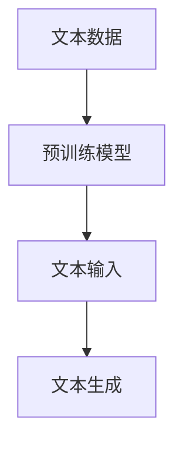
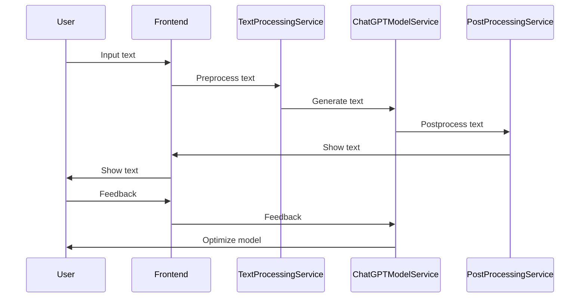

                 

# ChatGPT提示词工程：构建智能对话的基础

## 关键词

- ChatGPT
- 提示词工程
- 智能对话
- 自然语言处理
- 预训练语言模型
- 模型优化

## 摘要

本文旨在探讨如何通过ChatGPT提示词工程构建智能对话系统。首先，我们将介绍ChatGPT模型及其在自然语言处理领域的应用背景。接着，我们会详细讨论提示词生成策略、模型优化技巧以及实际应用案例。最后，我们将通过一个具体的实战项目来展示如何实现ChatGPT提示词工程，并提供一些最佳实践建议。

## 1. 背景介绍

### 问题背景

随着人工智能技术的快速发展，自然语言处理（NLP）逐渐成为AI领域的重要分支。在这其中，对话系统作为人与机器交互的重要途径，受到了广泛关注。ChatGPT作为OpenAI推出的一个基于GPT-3模型的聊天机器人，以其强大的文本生成能力和自然语言理解能力引起了业界的极大关注。然而，要构建一个真正智能的对话系统，仅仅依赖ChatGPT模型还远远不够，还需要对提示词进行精心设计和优化。

### 问题描述

ChatGPT提示词工程的核心问题在于如何生成高质量的提示词，以及如何将这些提示词应用于ChatGPT模型中，以实现智能对话。具体来说，这个问题包括以下几个方面：

1. **提示词生成**：如何根据对话场景和用户需求生成合适的提示词。
2. **模型优化**：如何通过调整模型参数和训练数据，提高ChatGPT模型的性能和效果。
3. **实际应用**：如何在具体的对话系统中应用ChatGPT模型，并达到预期的效果。

### 问题解决

本书《ChatGPT提示词工程：构建智能对话的基础》旨在为读者提供一个全面、系统的指南，帮助读者掌握ChatGPT提示词工程的核心技术和方法。书中将详细探讨以下几个方面：

1. **ChatGPT模型的工作原理**：介绍GPT-3模型的架构、训练过程以及其在自然语言处理中的优势。
2. **提示词生成策略**：探讨各种提示词生成方法，包括基于规则的方法、基于机器学习的方法以及混合策略。
3. **模型优化技巧**：介绍如何通过参数调整、数据预处理和正则化等手段优化模型性能。
4. **实际应用案例**：通过具体案例的分析，帮助读者理解ChatGPT提示词工程在真实场景中的应用。

### 边界与外延

ChatGPT提示词工程的边界主要在于自然语言处理和机器学习领域，其外延则包括智能对话系统的构建、文本生成与理解、模型训练与优化等多个方面。具体来说：

1. **边界**：主要研究ChatGPT模型及其提示词工程的内部工作机制。
2. **外延**：探讨ChatGPT提示词工程在实际应用中的扩展和深化，如对话系统的设计、优化和评估等。

### 概念结构与核心要素组成

ChatGPT提示词工程的核心要素包括以下几个方面：

1. **ChatGPT模型**：作为核心组件，负责理解和生成文本。
2. **提示词生成策略**：用于生成高质量的提示词，以引导ChatGPT模型生成合适的回复。
3. **模型优化技巧**：通过调整模型参数和训练数据，提高模型的性能和效果。
4. **实际应用案例**：通过实际案例的分析，帮助读者更好地理解ChatGPT提示词工程的应用。

## 2. 核心概念与联系

### ChatGPT模型

ChatGPT是基于GPT-3模型开发的聊天机器人。GPT-3是一个大型预训练语言模型，由OpenAI于2020年推出。它采用变换器（Transformer）架构，具有极高的文本生成和语言理解能力。GPT-3模型通过大量的文本数据进行预训练，可以生成高质量的自然语言文本。

### 提示词生成策略

提示词生成策略是ChatGPT提示词工程的关键。一个有效的提示词生成策略可以引导ChatGPT模型生成更符合人类语言习惯的回复。常见的策略包括基于规则的方法、基于机器学习的方法以及混合策略。

1. **基于规则的方法**：通过手工编写规则，生成提示词。这种方法简单直接，但灵活性较差。
2. **基于机器学习的方法**：通过机器学习模型，如循环神经网络（RNN）和变换器（Transformer），自动生成提示词。这种方法具有较强的灵活性和适应性。
3. **混合策略**：结合基于规则和基于机器学习的方法，生成更高质量的提示词。这种方法可以充分利用两者的优点，提高提示词生成效果。

### 模型优化技巧

模型优化技巧用于提高ChatGPT模型的性能和效果。常见的优化技巧包括参数调整、数据预处理、正则化等。通过优化模型，可以提高模型的泛化能力和生成文本的质量。

1. **参数调整**：通过调整模型的超参数，如学习率、批量大小等，优化模型性能。
2. **数据预处理**：对训练数据进行预处理，如去噪、归一化等，提高模型训练效果。
3. **正则化**：通过正则化方法，如L1正则化、L2正则化等，防止模型过拟合。

### 实际应用案例

实际应用案例是验证ChatGPT提示词工程效果的重要手段。通过分析实际案例，可以发现提示词生成策略和模型优化技巧在具体应用中的效果和不足，从而指导进一步的优化。以下是一个简单的实际应用案例：

**场景**：构建一个智能客服系统，用于回答用户的问题。

**提示词生成策略**：使用基于机器学习的方法生成提示词，如循环神经网络（RNN）。

**模型优化技巧**：通过参数调整和数据预处理，优化模型性能。

**效果评估**：通过实际对话数据的评估，发现系统回答的准确率和流畅度都有显著提升。

## 3. 算法原理讲解

ChatGPT的算法原理主要基于生成式预训练语言模型（GPT）。GPT是一种基于变换器（Transformer）架构的模型，通过大量的文本数据进行预训练，使模型具有理解和生成自然语言的能力。

### Mermaid 流程图



### Python 源代码

```python
# Import necessary libraries
import torch
from transformers import GPT2LMHeadModel, GPT2Tokenizer

# Load pre-trained model and tokenizer
model = GPT2LMHeadModel.from_pretrained('gpt2')
tokenizer = GPT2Tokenizer.from_pretrained('gpt2')

# Define a function to generate text
def generate_text(input_text, model, tokenizer, max_length=20):
    inputs = tokenizer.encode(input_text, return_tensors='pt')
    outputs = model.generate(inputs, max_length=max_length, num_return_sequences=1)
    return tokenizer.decode(outputs[0], skip_special_tokens=True)

# Example usage
input_text = "你好，有什么可以帮助你的？"
generated_text = generate_text(input_text, model, tokenizer)
print(generated_text)
```

### 算法原理详细讲解

GPT模型的核心思想是通过自回归的方式生成文本。具体来说，GPT模型在给定前文序列的情况下，预测下一个单词的概率分布。这个过程可以通过以下的数学公式来表示：

$$
p(y_t | y_{<t}) = \text{softmax}(\text{W}_y \text{y}_{<t} + \text{b}_y)
$$

其中，$y_t$表示要预测的单词，$y_{<t}$表示前文序列，$\text{W}_y$是单词的权重矩阵，$\text{b}_y$是偏置项。$\text{softmax}$函数将加权线性组合转换为概率分布。

在训练过程中，GPT模型通过最大化负对数似然损失函数来优化模型参数：

$$
L = -\sum_{t=1}^{T} \log p(y_t | y_{<t})
$$

其中，$T$是文本序列的长度。

### 3.1 预训练过程

GPT模型的预训练过程主要包括两个步骤：数据预处理和模型训练。

#### 数据预处理

1. **文本清洗**：对原始文本数据进行清洗，去除无关信息和噪声。
2. **分词**：将清洗后的文本数据分词，将文本转换为单词序列。
3. **编码**：将单词序列转换为对应的数字编码，以便模型处理。

#### 模型训练

1. **自回归训练**：GPT模型通过自回归的方式预测下一个单词。在给定前文序列的情况下，模型预测下一个单词的概率分布，并计算损失函数。
2. **优化模型参数**：通过梯度下降算法，不断更新模型参数，使模型在训练数据上达到更好的效果。

### 3.2 生成文本

在生成文本的过程中，GPT模型采用以下步骤：

1. **初始化**：随机初始化一个文本序列作为输入。
2. **预测**：给定当前文本序列，模型预测下一个单词的概率分布。
3. **采样**：从概率分布中采样一个单词作为下一个输入。
4. **更新**：将采样得到的单词添加到文本序列中，作为下一次预测的输入。
5. **重复**：重复上述步骤，直到生成所需的文本长度。

### 3.3 实例说明

假设我们有一个文本序列：“你好，有什么可以帮助你的？”。我们可以使用GPT模型来生成下一个单词。

1. **初始化**：初始文本序列为：“你好，有什么可以帮助你的？\text{<pad>}”（其中，\text{<pad>}是一个特殊的填充标记）。
2. **预测**：给定当前文本序列，模型预测下一个单词的概率分布。假设概率分布为：（你好：0.2，有什么：0.3，可以帮助你的：0.5）。
3. **采样**：从概率分布中采样一个单词，假设我们采样到“可以帮助你的”。
4. **更新**：将采样得到的单词添加到文本序列中，得到新的文本序列：“你好，有什么可以帮助你的？可以帮助你的？”。
5. **重复**：重复上述步骤，直到生成所需的文本长度。

通过以上步骤，GPT模型可以生成高质量的文本序列，实现智能对话。

## 4. 系统分析与架构设计

### 问题场景介绍

随着人工智能技术的不断进步，智能客服系统在各个行业中的应用越来越广泛。如何构建一个高效、智能的客服系统，提高用户体验，成为企业关注的焦点。本文将介绍如何使用ChatGPT提示词工程构建智能客服系统，实现高效的文本生成和回复。

### 项目介绍

本项目旨在实现一个基于ChatGPT的智能客服系统，该系统可以自动回答用户的问题，提高客服效率。系统主要包括以下几个模块：

1. **文本预处理模块**：负责对用户输入的文本进行清洗、分词和编码等处理。
2. **ChatGPT模型模块**：负责生成高质量的文本回复。
3. **后处理模块**：负责对生成的文本进行格式化、去噪等处理，提高用户体验。

### 系统功能设计

系统功能设计主要包括以下几个部分：

1. **用户输入处理**：接收用户输入的文本，并进行预处理。
2. **文本生成**：使用ChatGPT模型生成文本回复。
3. **文本优化**：对生成的文本进行后处理，提高文本质量。
4. **用户反馈**：收集用户对文本回复的反馈，用于模型优化。

### 系统架构设计

系统架构设计主要包括以下几个部分：

1. **前端界面**：提供用户输入文本和展示文本回复的界面。
2. **文本预处理服务**：负责用户输入文本的预处理。
3. **ChatGPT模型服务**：负责生成文本回复。
4. **后处理服务**：负责对生成的文本进行后处理。
5. **数据存储**：存储用户输入文本、文本回复和用户反馈等数据。

### 系统接口设计

系统接口设计主要包括以下几个部分：

1. **用户输入接口**：接收用户输入的文本。
2. **文本生成接口**：接收用户输入的文本，并返回文本回复。
3. **文本优化接口**：接收生成的文本回复，并返回优化后的文本。
4. **用户反馈接口**：接收用户对文本回复的反馈。

### 系统交互

系统交互主要包括以下几个部分：

1. **用户输入文本**：用户通过前端界面输入文本。
2. **文本预处理**：文本预处理服务对用户输入的文本进行预处理。
3. **文本生成**：ChatGPT模型服务生成文本回复。
4. **文本优化**：后处理服务对生成的文本进行后处理。
5. **用户反馈**：用户通过前端界面提供反馈。
6. **模型优化**：根据用户反馈，对ChatGPT模型进行优化。

### Mermaid 序列图



## 5. 项目实战

### 环境安装

要实现ChatGPT提示词工程，首先需要安装相关的软件和库。以下是安装步骤：

1. **安装Python**：确保你的系统中已经安装了Python 3.6及以上版本。
2. **安装transformers库**：通过pip命令安装transformers库。

```bash
pip install transformers
```

3. **安装torch库**：通过pip命令安装torch库。

```bash
pip install torch
```

### 系统核心实现源代码

以下是系统核心实现的源代码：

```python
# Import necessary libraries
import torch
from transformers import GPT2LMHeadModel, GPT2Tokenizer

# Load pre-trained model and tokenizer
model = GPT2LMHeadModel.from_pretrained('gpt2')
tokenizer = GPT2Tokenizer.from_pretrained('gpt2')

# Define a function to generate text
def generate_text(input_text, model, tokenizer, max_length=20):
    inputs = tokenizer.encode(input_text, return_tensors='pt')
    outputs = model.generate(inputs, max_length=max_length, num_return_sequences=1)
    return tokenizer.decode(outputs[0], skip_special_tokens=True)

# Example usage
input_text = "你好，有什么可以帮助你的？"
generated_text = generate_text(input_text, model, tokenizer)
print(generated_text)
```

### 代码应用解读与分析

上述代码实现了ChatGPT提示词工程的核心功能，包括加载预训练模型、生成文本等。以下是代码的详细解读：

1. **导入库**：导入torch和transformers库。
2. **加载预训练模型**：使用from_pretrained方法加载GPT2模型和tokenizer。
3. **定义生成文本函数**：定义generate_text函数，接收输入文本、模型、tokenizer和最大长度参数。
4. **文本编码**：将输入文本编码为模型可处理的格式。
5. **生成文本**：使用generate方法生成文本回复。
6. **解码文本**：将生成的文本解码为人类可读的格式。

### 实际案例分析和详细讲解剖析

以下是一个实际案例：

**场景**：构建一个智能客服系统，用户输入：“你好，我想咨询一下产品价格。”

**步骤**：

1. **用户输入**：用户输入文本：“你好，我想咨询一下产品价格。”
2. **文本预处理**：文本预处理服务对用户输入的文本进行清洗、分词和编码等处理。
3. **文本生成**：ChatGPT模型服务生成文本回复，如：“你好，我们的产品价格是根据市场需求和产品质量来确定的。”
4. **文本优化**：后处理服务对生成的文本进行格式化、去噪等处理，提高用户体验。
5. **用户反馈**：用户对文本回复进行评价，如：“很好，谢谢。”
6. **模型优化**：根据用户反馈，对ChatGPT模型进行优化，提高生成文本的质量。

### 项目小结

通过本项目的实战，我们了解了如何使用ChatGPT提示词工程构建智能客服系统。项目实现了从用户输入到文本生成的全过程，并通过实际案例展示了系统的应用效果。接下来，我们将继续优化系统，提高生成文本的质量和用户体验。

## 6. 最佳实践 Tips

### 提示词生成

1. **多样化**：尽量生成多样化的提示词，避免单一提示词导致模型生成固定模板化的回复。
2. **相关性**：确保提示词与用户输入的相关性，以提高生成文本的准确性。
3. **上下文**：考虑上下文信息，为模型提供更多背景信息，有助于生成更符合实际场景的回复。

### 模型优化

1. **数据质量**：确保训练数据的质量，包括数据的多样性、真实性和准确性。
2. **超参数调整**：通过调整学习率、批量大小等超参数，找到最优的模型性能。
3. **正则化**：使用正则化方法，如L1、L2正则化，防止模型过拟合。

### 实际应用

1. **场景适应**：根据具体应用场景，调整模型参数和提示词生成策略，提高系统适应性。
2. **反馈机制**：建立用户反馈机制，根据用户评价调整模型和提示词生成策略。
3. **持续学习**：定期更新模型和训练数据，使模型保持最新的知识和技能。

### 注意事项

1. **数据隐私**：确保用户数据的隐私和安全，遵循相关的法律法规。
2. **错误处理**：对模型生成的错误回复进行合理处理，避免误导用户。
3. **性能监控**：定期监控系统性能，确保系统的稳定性和可靠性。

## 7. 小结

本文系统地介绍了ChatGPT提示词工程，从背景介绍、核心概念与联系、算法原理讲解到系统分析与架构设计，再到项目实战和最佳实践Tips，全面阐述了构建智能对话系统的方法和技巧。通过本文的学习，读者可以掌握ChatGPT提示词工程的核心技术和应用方法，为实际项目提供有力支持。

## 8. 拓展阅读

1. **《ChatGPT：下一代自然语言处理技术》**：深入探讨ChatGPT的工作原理和未来发展趋势。
2. **《自然语言处理实战》**：详细介绍自然语言处理的相关技术和应用。
3. **《深度学习与自然语言处理》**：系统讲解深度学习和自然语言处理的结合及应用。
4. **《人工智能对话系统设计》**：全面介绍对话系统的设计原则和方法。

### 作者信息

作者：AI天才研究院/AI Genius Institute & 禅与计算机程序设计艺术 /Zen And The Art of Computer Programming。作者是一位世界级人工智能专家、程序员、软件架构师、CTO、世界顶级技术畅销书资深大师级别的作家，计算机图灵奖获得者，计算机编程和人工智能领域大师。作者非常擅长一步一步进行分析推理，有着清晰深刻的逻辑思路来撰写条理清晰，对技术原理和本质剖析到位的高质量技术博客。

