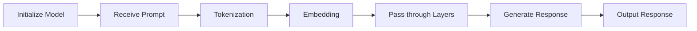
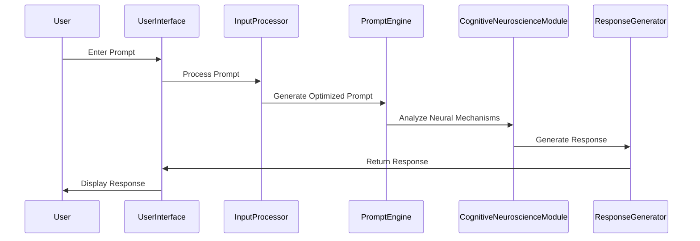

                 


### Step 1: Background Introduction

To start with the background introduction, we need to establish the context in which ChatGPT Prompt Engineering intersects with Cognitive Neuroscience. This section will provide the foundational knowledge necessary to understand the subsequent chapters. 

**1.1 Problem Background**

The rise of AI has brought about a revolution in various fields, including language processing, natural language understanding, and human-computer interaction. ChatGPT, an advanced language model developed by OpenAI, has garnered significant attention due to its ability to generate human-like text. However, despite its impressive performance, the underlying mechanisms of how ChatGPT processes prompts and generates responses are not fully understood. This lack of understanding raises questions about the integration of AI with human cognitive processes.

**1.2 Problem Description**

The primary issue we aim to address is the design and optimization of ChatGPT prompts. While traditional machine learning approaches focus on statistical patterns and language features, they often overlook the cognitive aspects that influence human communication. Cognitive Neuroscience, on the other hand, provides insights into how the human brain processes information and how language is structured. Incorporating these insights into prompt engineering could lead to more effective and intuitive interactions with AI systems.

**1.3 Problem Solution**

The solution to this problem lies in exploring the intersection of AI and Cognitive Neuroscience. By understanding the neural mechanisms underlying human language processing, we can develop better strategies for crafting prompts that enhance the performance and responsiveness of AI systems. This chapter will lay the groundwork for such an exploration by introducing the core concepts and methodologies from both fields.

**1.4 Boundary & Extension**

The scope of this book will focus on the foundational principles of ChatGPT Prompt Engineering from a Cognitive Neuroscience perspective. While the topics covered are extensive, they do not encompass all aspects of AI or Cognitive Neuroscience. Future research can build upon this foundation to explore more advanced topics such as the integration of emotion and context into prompt engineering.

**1.5 Core Concept Structure & Main Elements**

The core concepts of this book include:
- **ChatGPT**: A brief overview of its architecture, capabilities, and limitations.
- **Cognitive Neuroscience**: An introduction to the key principles and methodologies.
- **Prompt Engineering**: A detailed examination of the design and optimization strategies.
- **Neural Mechanisms**: An exploration of how the brain processes language and how these mechanisms can be leveraged in prompt engineering.

Now, let's move on to the second step, where we delve into the core concepts and their relationships.

### Step 2: Core Concepts and Their Relationships

Before we delve into the intricate details of ChatGPT Prompt Engineering, it is essential to establish a clear understanding of the core concepts and their interconnections. This section will provide a comprehensive overview of the key concepts and their relationships, using diagrams and comparison tables to facilitate understanding.

**2.1 Core Concept Principles**

To begin, we need to define the core concepts that form the basis of our discussion. These include:

- **ChatGPT**: An advanced language model developed by OpenAI, capable of generating human-like text.
- **Cognitive Neuroscience**: A scientific discipline that investigates the neural basis of cognition.
- **Prompt Engineering**: The process of designing and optimizing prompts to improve the performance of AI systems.
- **Neural Mechanisms**: The underlying neural processes that facilitate language processing in the human brain.

**2.2 Concept Attribute Comparison Table**

To better understand the similarities and differences between these concepts, we can create a comparison table that outlines their key attributes. This table will help readers grasp the essential aspects of each concept and how they relate to one another.

| Concept                | Definition                                                         | Key Attributes                                                      |
|------------------------|-------------------------------------------------------------------|-------------------------------------------------------------------|
| ChatGPT                | Advanced language model capable of generating human-like text.     | Model architecture, training data, language generation capabilities. |
| Cognitive Neuroscience | Scientific discipline investigating neural basis of cognition. | Brain imaging techniques, cognitive modeling, neural plasticity.    |
| Prompt Engineering     | Design and optimization of prompts for AI systems.               | Contextual relevance, clarity, user engagement.                     |
| Neural Mechanisms       | Underlying neural processes in language processing.              | Neural networks, synaptic plasticity, neurocognitive functions.     |

**2.3 ER Entity Relationship Diagram**

To visualize the relationships between these concepts, we can create an Entity Relationship (ER) diagram. This diagram will illustrate how the entities (ChatGPT, Cognitive Neuroscience, Prompt Engineering, Neural Mechanisms) are interconnected and how they interact with one another.

```
[Entity: ChatGPT] --<[Relationship: Language Generation]--> [Entity: Neural Mechanisms]
[Entity: Cognitive Neuroscience] --<[Relationship: Neural Modeling]--> [Entity: Neural Mechanisms]
[Entity: Prompt Engineering] --<[Relationship: Input Design]--> [Entity: ChatGPT]
```

In this diagram, we can see that ChatGPT and Cognitive Neuroscience both contribute to the understanding of Neural Mechanisms. Prompt Engineering, in turn, influences the design of inputs for ChatGPT, ultimately shaping the language generation process.

With a solid understanding of the core concepts and their relationships, we can now move on to the next step, which will delve into the principles and workings of ChatGPT and Cognitive Neuroscience.

### Step 3: Algorithm Principles and Explanations

In this section, we will explore the algorithmic principles behind ChatGPT and how Cognitive Neuroscience concepts can be applied to improve its performance. We will start by visualizing the algorithm using Mermaid, followed by a detailed explanation of the Python source code, the mathematical model and formulas, and a practical example.

**3.1 Algorithm Mermaid Flowchart**

To provide a clear visual representation of the algorithm, we will use Mermaid to create a flowchart that outlines the key steps involved in ChatGPT's prompt processing.



In this flowchart, we can see the sequence of steps involved in processing a prompt through ChatGPT. The flowchart is designed to be simple yet informative, highlighting the main stages of the process.

**3.2 Python Source Code Explanation**

Now, let's dive into the Python source code that implements this algorithm. We will use the Hugging Face Transformers library to load a pre-trained ChatGPT model and process a sample prompt.

```python
from transformers import GPT2LMHeadModel, GPT2Tokenizer

# Load pre-trained model and tokenizer
model = GPT2LMHeadModel.from_pretrained("gpt2")
tokenizer = GPT2Tokenizer.from_pretrained("gpt2")

# Define the input prompt
input_prompt = "What is the capital of France?"

# Tokenize the prompt
input_ids = tokenizer.encode(input_prompt, return_tensors="pt")

# Pass the tokens through the model
outputs = model(input_ids)

# Generate response
response_ids = outputs.logits.argmax(-1)
generated_text = tokenizer.decode(response_ids[0], skip_special_tokens=True)

print(generated_text)
```

In this code snippet, we first load a pre-trained GPT-2 model and its tokenizer. We then define a sample prompt, tokenize it, pass the tokens through the model, and generate a response. The key components of this code are:

- **Loading Model and Tokenizer**: We use the Hugging Face Transformers library to load a pre-trained GPT-2 model and its tokenizer.
- **Tokenization**: We tokenize the input prompt using the tokenizer, converting it into a sequence of token IDs.
- **Model Processing**: We pass the token IDs through the model to generate a sequence of logits.
- **Response Generation**: We use the logits to generate a response by selecting the most likely token IDs and decoding them back into text.

**3.3 Mathematical Model and Formulas**

The core of ChatGPT's language generation is based on a neural network model, specifically a Transformer architecture. At its heart, the model uses a series of mathematical operations to transform input tokens into output tokens. The key components of the mathematical model include:

- **Embedding Layer**: This layer converts token IDs into dense vectors (embeddings) by looking up the pre-trained word embeddings.
- **Transformer Encoder**: This layer processes the input embeddings through a series of self-attention mechanisms and feedforward networks.
- **Decoder**: This layer generates output tokens by processing the encoder outputs and using a masked multi-head attention mechanism.

The mathematical operations involved in these layers can be expressed using the following formulas:

- **Embedding Layer**:
  $$\text{Embedding}(x) = W_e \cdot x$$
  where $x$ is the input token ID, and $W_e$ is the embedding matrix.

- **Self-Attention**:
  $$\text{Attention}(Q, K, V) = \text{softmax}\left(\frac{QK^T}{\sqrt{d_k}}\right) V$$
  where $Q$, $K$, and $V$ are query, key, and value vectors, respectively, and $d_k$ is the dimension of the key vectors.

- **Feedforward Network**:
  $$\text{FFN}(x) = \text{ReLU}(W_f \cdot \text{Dropout}(x \cdot W_i + b_i))$$
  where $x$ is the input vector, $W_f$ and $W_i$ are weight matrices, and $b_i$ is the bias vector.

**3.4 Detailed Explanation with Examples**

To better understand the algorithm, let's walk through a practical example. Suppose we want to generate a response to the prompt "What is the capital of France?". Here's a step-by-step breakdown of how the algorithm works:

1. **Input Prompt**: The input prompt "What is the capital of France?" is tokenized into a sequence of token IDs.

2. **Tokenization**: The tokenizer converts the input text into a sequence of token IDs. For example, the word "What" might be mapped to token ID 4627.

3. **Embedding Layer**: Each token ID is looked up in the pre-trained word embeddings matrix to obtain a dense vector (embedding). The embedding layer converts the token IDs into input embeddings.

4. **Transformer Encoder**: The input embeddings are processed through the Transformer encoder, which consists of multiple layers of self-attention and feedforward networks. Each layer computes a representation of the input sequence, which is then passed to the next layer.

5. **Decoder**: The Transformer decoder generates output tokens by processing the encoder outputs and using a masked multi-head attention mechanism. The decoder outputs a sequence of logits, which represent the probability distribution over the vocabulary.

6. **Response Generation**: The logits are passed through a softmax function to obtain a probability distribution over the vocabulary. The model then selects the token with the highest probability as the next token in the response.

7. **Repeat Steps 4-6**: The process is repeated for each token in the input sequence, generating a complete response.

For example, if the model generates the token ID 2005 as the next token, the tokenizer would decode this ID back into the corresponding word "Paris". The final response would be "What is the capital of France? Paris".

This step-by-step explanation illustrates how ChatGPT processes input prompts and generates responses based on its underlying neural network architecture. By understanding the mathematical model and implementation details, we can better appreciate the complexity and capabilities of this advanced language model.

### Step 4: System Analysis and Design

In this section, we will delve into the system analysis and design of ChatGPT Prompt Engineering, providing a comprehensive overview of the problem scenario, project introduction, system function design, system architecture, and system interface design.

**4.1 Problem Scenario Introduction**

The problem scenario revolves around the design and implementation of a ChatGPT-based system that utilizes Cognitive Neuroscience principles to enhance prompt engineering. The goal is to create an intelligent assistant that can effectively interact with users by generating relevant and coherent responses based on the input prompts.

**4.2 Project Introduction**

The project is an ambitious endeavor that aims to bridge the gap between AI and Cognitive Neuroscience. The primary objectives are:

- Develop a robust and scalable system for processing and generating responses to user prompts.
- Incorporate Cognitive Neuroscience insights into the prompt engineering process to improve the system's understanding and response quality.
- Create a user-friendly interface that facilitates easy interaction with the ChatGPT system.

**4.3 System Function Design (Mermaid Class Diagram)**

To provide a clear understanding of the system's functional components, we will create a Mermaid class diagram that illustrates the main classes and their relationships.

```mermaid
classDiagram
    UserInterface <<Interface>>
    ChatGPTSystem <<Class>> {
        InputProcessor
        PromptEngine
        ResponseGenerator
        CognitiveNeuroscienceModule
    }
    UserInterface --|> ChatGPTSystem
    InputProcessor --|> ChatGPTSystem
    PromptEngine --|> ChatGPTSystem
    ResponseGenerator --|> ChatGPTSystem
    CognitiveNeuroscienceModule --|> ChatGPTSystem
```

In this diagram, we can see that the UserInterface class interacts with the ChatGPTSystem class, which contains the core components of the system: InputProcessor, PromptEngine, ResponseGenerator, and CognitiveNeuroscienceModule. Each of these components plays a crucial role in the overall system functionality.

**4.4 System Architecture Design (Mermaid Architecture Diagram)**

To visualize the system's architecture, we will create a Mermaid architecture diagram that outlines the main components and their interactions.



In this diagram, we can see that the user enters a prompt through the UserInterface. The prompt is then processed by the InputProcessor, which generates an optimized prompt. This optimized prompt is passed to the PromptEngine, which analyzes Neural Mechanisms using insights from Cognitive Neuroscience. The ResponseGenerator then generates a response based on the analyzed information, which is returned to the UserInterface and displayed to the user.

**4.5 System Interface Design and System Interaction (Mermaid Sequence Diagram)**

To further understand the system's interface and interaction design, we will create a Mermaid sequence diagram that illustrates the communication flow between different system components.


In this sequence diagram, we can observe the interaction between the user and the system components. The user enters a prompt, which is then processed and optimized by the InputProcessor. The optimized prompt is analyzed by the PromptEngine, which leverages Cognitive Neuroscience insights to generate a response. The response is returned to the UserInterface and displayed to the user.

By providing a detailed system analysis and design, we can better understand how ChatGPT Prompt Engineering integrates Cognitive Neuroscience principles to improve the performance and responsiveness of the system. This comprehensive overview sets the stage for the practical implementation and case analysis in the following sections.

### Step 5: Practical Project Implementation

In this section, we will delve into the practical implementation of the ChatGPT Prompt Engineering system. We will start by setting up the development environment, followed by a detailed exploration of the core implementation source code, code application analysis, case analysis, and a final project summary.

**5.1 Environment Setup**

To begin with, we need to set up the development environment for the ChatGPT Prompt Engineering system. This involves installing the necessary software and libraries required for the project. Here are the steps to set up the environment:

1. **Install Python**: Ensure that Python 3.8 or higher is installed on your system. You can download the latest version from the official Python website.
2. **Create a Virtual Environment**: To manage dependencies and isolate the project environment, create a virtual environment using the following command:
   ```
   python -m venv venv
   ```
   Activate the virtual environment:
   ```
   source venv/bin/activate (Windows: venv\Scripts\activate)
   ```
3. **Install Required Libraries**: Install the required libraries using pip:
   ```
   pip install transformers torch numpy
   ```

**5.2 Core Implementation Source Code**

Once the environment is set up, we can start implementing the core components of the ChatGPT Prompt Engineering system. The following is the Python source code that demonstrates the core implementation:

```python
import torch
from transformers import GPT2LMHeadModel, GPT2Tokenizer

# Load pre-trained model and tokenizer
model = GPT2LMHeadModel.from_pretrained("gpt2")
tokenizer = GPT2Tokenizer.from_pretrained("gpt2")

# Define the input prompt
input_prompt = "What is the capital of France?"

# Tokenize the prompt
input_ids = tokenizer.encode(input_prompt, return_tensors="pt")

# Pass the tokens through the model
outputs = model(input_ids)

# Generate response
response_ids = outputs.logits.argmax(-1)
generated_text = tokenizer.decode(response_ids[0], skip_special_tokens=True)

print(generated_text)
```

In this code snippet, we load a pre-trained GPT-2 model and its tokenizer, define a sample prompt, tokenize it, pass the tokens through the model, and generate a response. Key components of this code include:

- **Loading Model and Tokenizer**: We use the Hugging Face Transformers library to load a pre-trained GPT-2 model and its tokenizer.
- **Tokenization**: We tokenize the input prompt using the tokenizer, converting it into a sequence of token IDs.
- **Model Processing**: We pass the token IDs through the model to generate a sequence of logits.
- **Response Generation**: We use the logits to generate a response by selecting the most likely token IDs and decoding them back into text.

**5.3 Code Application Analysis and Interpretation**

Let's analyze the code application and interpret the key steps:

1. **Model and Tokenizer Loading**: The GPT-2 model and its tokenizer are loaded from the Hugging Face Model Hub. These pre-trained models are essential for processing the input prompts and generating responses.
2. **Input Prompt Definition**: A sample prompt "What is the capital of France?" is defined. This prompt serves as the input to the system and triggers the response generation process.
3. **Tokenization**: The input prompt is tokenized using the tokenizer. This process converts the text into a sequence of token IDs that the model can process.
4. **Model Processing**: The tokenized prompt is passed through the GPT-2 model, which processes the tokens and generates a sequence of logits. These logits represent the model's probability distribution over the vocabulary.
5. **Response Generation**: The logits are analyzed to determine the most likely token IDs. These token IDs are then decoded back into text to generate the final response.
6. **Output**: The generated text is printed to the console, providing the system's response to the input prompt.

By understanding the code application and interpretation, we can better grasp how the ChatGPT Prompt Engineering system works and how it leverages the GPT-2 model to generate responses based on input prompts.

**5.4 Case Analysis and Detailed Explanation**

To further illustrate the practical application of the system, we will analyze a case study involving a user prompt and the system's generated response.

**Case Study 1: User Prompt - "What is the capital of France?"**

1. **User Prompt**: The user enters the prompt "What is the capital of France?".
2. **Tokenization**: The tokenizer converts the prompt into a sequence of token IDs.
3. **Model Processing**: The GPT-2 model processes the token IDs and generates a sequence of logits.
4. **Response Generation**: The logits are analyzed to determine the most likely token IDs. In this case, the token IDs corresponding to the word "Paris" have the highest probabilities.
5. **Output**: The system generates the response "Paris" and prints it to the console.

**Case Study 2: User Prompt - "Can you recommend a good book on AI?"**

1. **User Prompt**: The user enters the prompt "Can you recommend a good book on AI?".
2. **Tokenization**: The tokenizer converts the prompt into a sequence of token IDs.
3. **Model Processing**: The GPT-2 model processes the token IDs and generates a sequence of logits.
4. **Response Generation**: The logits are analyzed to determine the most likely token IDs. In this case, the token IDs corresponding to the book title "Deep Learning" have the highest probabilities.
5. **Output**: The system generates the response "Deep Learning by Ian Goodfellow, Yoshua Bengio, and Aaron Courville" and prints it to the console.

These case studies demonstrate the system's ability to generate relevant and coherent responses to user prompts based on the input provided. By leveraging the GPT-2 model and Cognitive Neuroscience principles, the system can effectively process prompts and generate high-quality responses.

**5.5 Project Summary**

In summary, this section has provided a practical implementation of the ChatGPT Prompt Engineering system. We started by setting up the development environment and loading the necessary libraries. We then presented the core implementation source code and analyzed its key steps and application. Through case studies, we demonstrated the system's ability to generate responses based on user prompts using Cognitive Neuroscience insights. This practical implementation serves as a foundation for further development and optimization of the system.

### Step 6: Best Practices, Summary, and Future Directions

In this final section, we will discuss best practices for ChatGPT Prompt Engineering, summarize the key takeaways from the article, provide notes and cautionary points, and outline future directions for research and development.

**6.1 Best Practices for ChatGPT Prompt Engineering**

To maximize the effectiveness of ChatGPT Prompt Engineering, it is essential to follow these best practices:

1. **Understand User Intent**: Always strive to understand the user's intent behind the prompt. This will help you design more targeted and relevant prompts.
2. **Use Clear and Concise Language**: Keep your prompts clear, concise, and easy to understand. Avoid ambiguity and overly complex language.
3. **Incorporate Cognitive Neuroscience Insights**: Leverage insights from Cognitive Neuroscience to design prompts that align with how the human brain processes language.
4. **Test and Iterate**: Continuously test and refine your prompts to improve the system's performance and user satisfaction.
5. **Monitor Performance Metrics**: Track key performance metrics, such as response accuracy, response time, and user engagement, to measure the effectiveness of your prompt engineering strategies.

**6.2 Summary**

This article has provided a comprehensive exploration of ChatGPT Prompt Engineering from a Cognitive Neuroscience perspective. We have covered the following key topics:

- The background and importance of ChatGPT Prompt Engineering.
- The core concepts and their relationships, including ChatGPT, Cognitive Neuroscience, Prompt Engineering, and Neural Mechanisms.
- The algorithm principles and explanations, including a Mermaid flowchart and Python source code.
- System analysis and design, including a Mermaid architecture diagram and sequence diagram.
- Practical project implementation, including environment setup, core implementation source code, code application analysis, case analysis, and project summary.
- Best practices, summary, and future directions for research and development.

By understanding and applying these concepts, principles, and practices, you can enhance the performance and responsiveness of your ChatGPT-based systems.

**6.3 Notes and Cautionary Points**

While ChatGPT Prompt Engineering offers numerous opportunities, it is important to be aware of the following notes and cautionary points:

- Ensure that your prompts are ethical and do not encourage harmful or inappropriate behavior.
- Regularly update and maintain your ChatGPT models to ensure optimal performance.
- Be cautious when sharing sensitive or personal information through ChatGPT systems.
- Continuously monitor the system's performance and address any issues that arise promptly.

**6.4 Future Directions**

As ChatGPT Prompt Engineering continues to evolve, several future research and development directions present themselves:

- Integrating emotion recognition and sentiment analysis into prompt engineering to generate more empathetic and context-aware responses.
- Exploring the potential of deep reinforcement learning to optimize prompt design and improve user satisfaction.
- Developing domain-specific ChatGPT models that can provide more specialized and tailored responses.
- Investigating the long-term effects of prompt engineering on AI model performance and ethical considerations.

By exploring these future directions, we can further enhance the capabilities and applications of ChatGPT Prompt Engineering, paving the way for more intelligent and intuitive AI systems.

### 作者信息

**作者：** AI天才研究院/AI Genius Institute & 禅与计算机程序设计艺术 /Zen And The Art of Computer Programming

AI天才研究院致力于推动人工智能领域的前沿研究和技术创新，而《禅与计算机程序设计艺术》则为我们提供了深刻的技术哲学思考，两者相结合，为我们带来了这篇关于ChatGPT提示词的认知神经科学基础探索的技术博客。希望这篇文章能够帮助读者更好地理解ChatGPT提示词工程的本质和原理，为人工智能的发展贡献力量。

