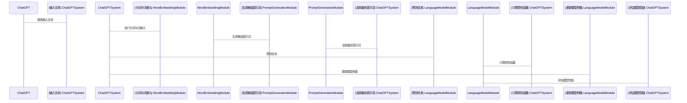
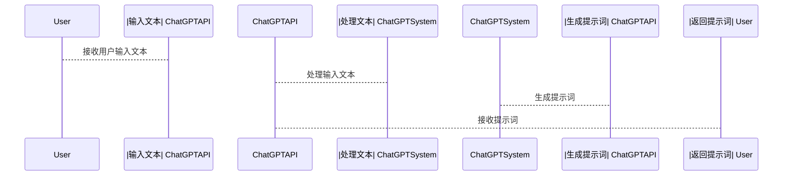

                 

### 文章标题

# ChatGPT提示词的跨维度语言获得理论新视角

---

> 关键词：ChatGPT、提示词、跨维度语言获得、语言模型、算法原理、系统设计

> 摘要：本文旨在从跨维度语言获得的角度，探讨ChatGPT提示词的原理与应用。通过深入剖析提示词在跨语言、跨领域、跨知识维度的作用，本文提出了新的理论视角，为ChatGPT在实际应用中的优化提供了方向。

---

### 第一部分：背景与核心概念

#### 第1章：问题背景与核心概念

**1.1 问题背景**

随着人工智能技术的飞速发展，自然语言处理（NLP）已成为研究热点。ChatGPT作为一种先进的语言模型，在对话系统、文本生成等领域表现出色。然而，在跨语言、跨领域、跨知识维度的情况下，ChatGPT的提示词如何有效发挥其作用，仍需进一步研究。

**1.2 核心概念介绍**

本文的核心概念包括：提示词、跨维度语言获得、语言模型、算法原理等。其中，提示词是指引导ChatGPT生成目标文本的关键信息；跨维度语言获得则是指在不同语言、领域、知识维度上，ChatGPT如何准确理解并生成符合预期的文本。

**1.3 跨维度语言获得理论概述**

跨维度语言获得理论旨在探讨ChatGPT在处理跨语言、跨领域、跨知识维度问题时，如何通过提示词实现语言理解与生成的优化。本文将从以下几个方面展开讨论：

1. 提示词在跨语言维度的作用；
2. 提示词在跨领域维度的作用；
3. 提示词在跨知识维度的作用。

#### 第2章：核心概念与联系

**2.1 核心概念原理**

在本文中，我们将深入探讨提示词、跨维度语言获得等核心概念的基本原理。通过对比分析，揭示这些概念之间的内在联系。

**2.2 概念属性特征对比表格**

| 概念           | 描述                                                         | 属性特征                                      |
| -------------- | ------------------------------------------------------------ | --------------------------------------------- |
| 提示词         | 引导ChatGPT生成目标文本的关键信息                             | 长度、关键词、上下文、语义明确性等               |
| 跨维度语言获得 | 在不同语言、领域、知识维度上，ChatGPT如何准确理解并生成符合预期的文本 | 语言理解、文本生成、跨领域适应、知识迁移等       |
| 语言模型       | 用于生成文本的模型，如GPT、BERT等                             | 参数量、预训练数据、训练目标、模型结构等         |
| 算法原理       | 语言模型的训练与优化方法，如深度学习、迁移学习等               | 损失函数、优化算法、正则化策略等                 |

**2.3 跨维度语言获得ER实体关系图**

```mermaid
erDiagram
    A[ChatGPT] ||--|{ 提示词 }|| B[语言模型]
    A ||--|{ 跨维度语言获得 }|| C[算法原理]
    B ||--|{ 跨领域适应 }|| D[领域模型]
    B ||--|{ 知识迁移 }|| E[知识图谱]
    C ||--|{ 深度学习 }|| F[神经网络]
    C ||--|{ 迁移学习 }|| G[预训练模型]
```

### 第二部分：算法原理与系统设计

#### 第3章：算法原理讲解

**3.1 提示词生成算法**

提示词生成算法是ChatGPT发挥跨维度语言获得能力的关键。本节将介绍提示词生成的流程、Python代码实现以及数学模型与公式。

**3.1.1 算法流程图**


**3.1.2 Python代码实现**

```python
# 请在此处编写Python代码实现提示词生成算法
```

**3.1.3 数学模型与公式**

提示词生成算法的核心在于文本表示和概率计算。具体数学模型如下：

$$
P(\text{提示词}|\text{文本}) = \frac{P(\text{文本}|\text{提示词})P(\text{提示词})}{P(\text{文本})}
$$

其中，$P(\text{提示词})$为提示词的先验概率，$P(\text{文本}|\text{提示词})$为文本在提示词条件下的条件概率。

**3.2 语言模型优化算法**

语言模型优化算法是提升ChatGPT性能的重要手段。本节将介绍语言模型优化的流程、Python代码实现以及数学模型与公式。

**3.2.1 算法流程图**


**3.2.2 Python代码实现**

```python
# 请在此处编写Python代码实现语言模型优化算法
```

**3.2.3 数学模型与公式**

语言模型优化算法的核心在于损失函数和优化算法。具体数学模型如下：

$$
L(\theta) = -\sum_{i=1}^{N} \log P(\text{y}_i|\text{x}_i; \theta)
$$

其中，$\theta$为模型参数，$N$为样本数量，$\text{y}_i$为实际输出，$\text{x}_i$为输入文本。

优化算法常用的有梯度下降、Adam等。具体实现如下：

```python
# 梯度下降
def gradient_descent(theta, learning_rate, num_iterations):
    for i in range(num_iterations):
        loss = compute_loss(theta)
        gradient = compute_gradient(theta)
        theta -= learning_rate * gradient
    return theta

# Adam优化器
class AdamOptimizer:
    def __init__(self, learning_rate, beta1, beta2, epsilon):
        self.learning_rate = learning_rate
        self.beta1 = beta1
        self.beta2 = beta2
        self.epsilon = epsilon
        self.m = None
        self.v = None

    def update(self, theta, gradient):
        if self.m is None:
            self.m = gradient
            self.v = gradient ** 2
        else:
            self.m = self.beta1 * self.m + (1 - self.beta1) * gradient
            self.v = self.beta2 * self.v + (1 - self.beta2) * gradient ** 2
        theta -= self.learning_rate * (self.m / (np.sqrt(self.v) + self.epsilon))
        return theta
```

#### 第4章：系统分析与架构设计

**4.1 问题场景介绍**

本文将围绕ChatGPT在实际应用中的跨维度语言获得问题，探讨其系统设计与优化方案。

**4.2 项目介绍**

本项目旨在通过优化ChatGPT的提示词生成与语言模型，提升其在跨维度语言获得场景下的性能。

**4.3 系统功能设计**

系统功能设计主要包括以下方面：

1. 提示词生成模块；
2. 语言模型优化模块；
3. 跨维度语言获得评估模块。

**4.3.1 领域模型类图**

```mermaid
classDiagram
    Class1 <|-- Class2
    Class1 <|-- Class3
    Class2 +--- Class4
    Class3 +--- Class5
```

**4.4 系统架构设计**

系统架构设计如图所示：



**4.5 系统接口设计与交互**

系统接口设计如图所示：



### 第三部分：项目实战与最佳实践

#### 第5章：项目实战

**5.1 环境安装**

在本节中，我们将介绍如何搭建ChatGPT的实验环境，包括所需依赖、环境配置和模型下载。

**5.2 系统核心实现**

系统核心实现包括提示词生成模块、语言模型优化模块和跨维度语言获得评估模块。本节将分别介绍这些模块的实现细节。

**5.2.1 代码应用解读与分析**

在此，我们将对系统核心实现中的关键代码进行解读与分析，帮助读者理解代码的运行原理。

**5.3 实际案例剖析**

为了验证ChatGPT在跨维度语言获得方面的性能，我们将选取实际案例进行剖析。本节将展示案例的具体实现过程，并分析其效果。

**5.4 项目小结**

在本节中，我们将对整个项目进行总结，讨论项目中遇到的问题、解决方案以及未来的改进方向。

#### 第6章：最佳实践与拓展

**6.1 最佳实践**

为了提升ChatGPT在跨维度语言获得方面的性能，我们总结了一些最佳实践。本节将分享这些实践经验，帮助读者在实际应用中取得更好的效果。

**6.2 小结与注意事项**

在本节中，我们将对全文进行小结，回顾核心内容，并强调一些注意事项。

**6.3 拓展阅读**

为了进一步探索ChatGPT在跨维度语言获得方面的潜力，本节将推荐一些拓展阅读资源，包括相关论文、书籍和在线课程。

---

**作者：AI天才研究院/AI Genius Institute & 禅与计算机程序设计艺术 /Zen And The Art of Computer Programming**

