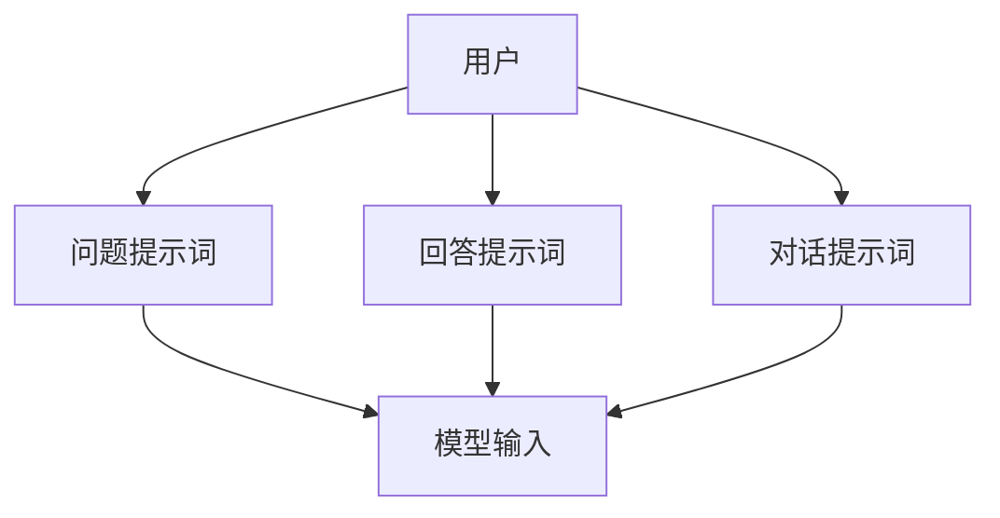
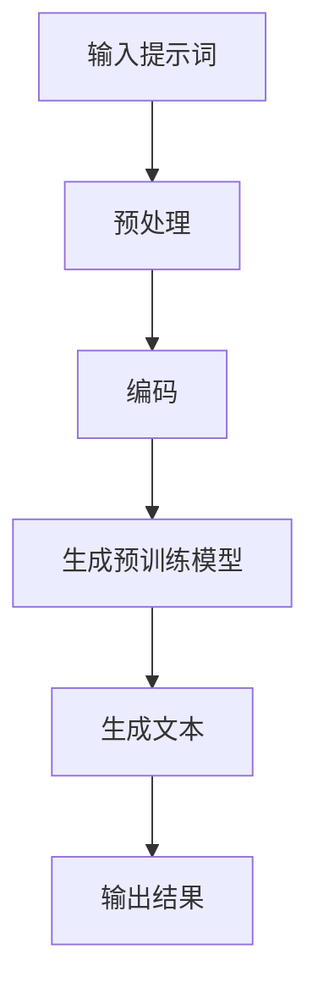
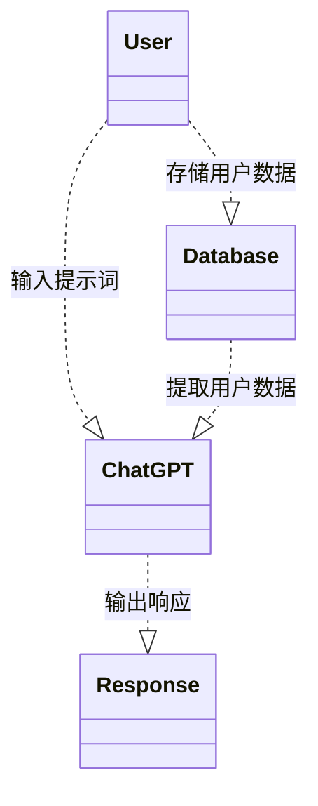
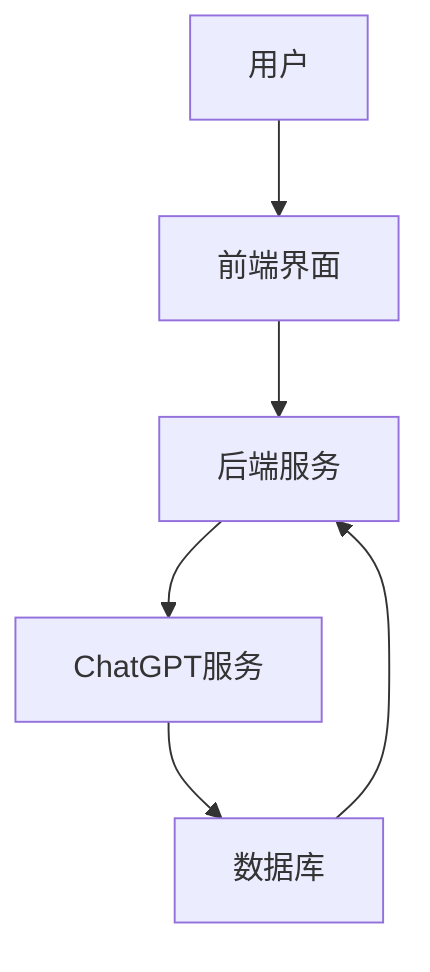
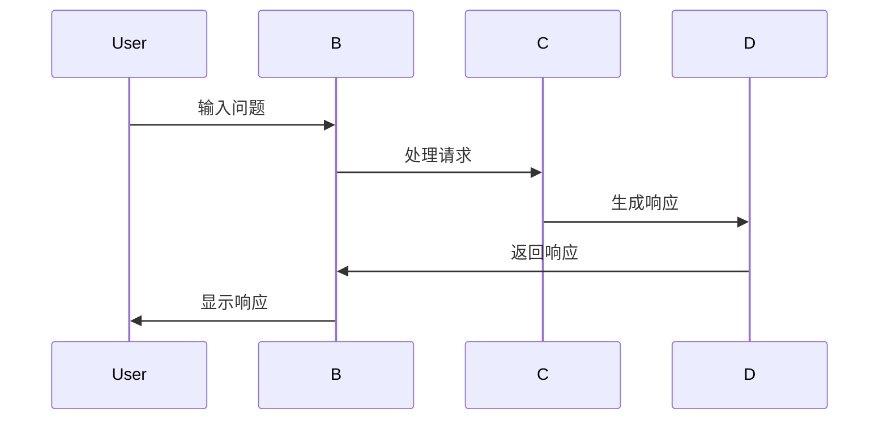

                 

### 《ChatGPT提示词编写：从理论到实践》

## 第一部分：背景介绍

### 问题背景

随着人工智能技术的不断发展，自然语言处理（NLP）领域取得了显著进展，尤其是大型语言模型（如GPT）的出现，使得生成式对话系统变得更加智能。然而，要实现高质量的对话效果，编写有效的提示词至关重要。提示词作为与大型语言模型交互的桥梁，直接影响着对话的质量和用户体验。

### 问题描述

如何高效地编写ChatGPT的提示词，以便实现既符合用户需求又能展现模型优势的对话效果？这需要从理论层面理解提示词编写原则，再到实践层面掌握技巧，从而在真实场景中灵活运用。

### 问题解决

本书旨在提供一个从理论到实践的完整指南，帮助读者理解ChatGPT提示词编写的核心原理，并通过丰富的实践案例，提高读者在实际应用中的能力。

### 边界与外延

本书主要关注文本生成型对话系统的提示词编写，适用于ChatGPT等大型语言模型。同时，书中也探讨了一些通用的NLP技巧和策略，有助于读者在其他类型的对话系统中的应用。

### 概念结构与核心要素组成

- **ChatGPT**：一种基于GPT模型的对话生成系统。
- **提示词**：与ChatGPT交互的引导信息，用于指导模型生成符合预期的对话内容。
- **对话效果**：指对话的流畅性、准确性、个性化程度等指标。

## 第二部分：核心概念与联系

### 核心概念原理

- **提示词类型**：问题提示词、回答提示词、对话提示词等。
- **提示词编写原则**：清晰性、目标性、灵活性等。

### 概念属性特征对比表格

| 概念类型 | 特征 | 应用场景 |
| --- | --- | --- |
| 问题提示词 | 精确描述问题，引导模型理解用户需求 | 问答系统 |
| 回答提示词 | 提供背景信息或上下文，引导模型生成回答 | 对话系统 |
| 对话提示词 | 设计对话流程，引导模型生成连贯对话 | 聊天机器人 |

### ER实体关系图架构



## 第三部分：算法原理讲解

### ChatGPT工作原理

#### Mermaid流程图



#### Python源代码

```python
# ChatGPT模型输入示例
prompt = "请描述一下你最近的项目经历。"

# 预处理
preprocessed_prompt = preprocess(prompt)

# 编码
encoded_prompt = model.encode(preprocessed_prompt)

# 生成文本
generated_text = model.generate(encoded_prompt)

# 输出结果
print(generated_text)
```

### 算法原理详细讲解

ChatGPT基于GPT模型，通过输入提示词进行预处理、编码，然后利用预训练模型生成文本。在这个过程中，模型会自动捕捉提示词中的语义信息，并生成连贯、自然的文本回答。

- **预处理**：对输入提示词进行清洗和标准化，以便模型更好地理解。
- **编码**：将预处理后的提示词转换为模型可处理的向量表示。
- **生成预训练模型**：使用大量的文本数据进行预训练，使模型具备生成高质量文本的能力。
- **生成文本**：根据编码后的提示词，模型生成对应的文本回答。
- **输出结果**：将生成的文本输出，形成完整的对话。

### 数学模型和公式

```latex
\begin{align*}
\text{模型输出} &= f(\text{编码后的提示词}) \\
f(x) &= \text{softmax}(\text{模型权重} \cdot x + \text{偏置})
\end{align*}
```

### 举例说明

假设用户输入提示词：“请描述一下你最近的项目经历。”，ChatGPT会首先对提示词进行预处理，然后将其编码为向量。接着，模型利用预训练的权重和偏置，对编码后的向量进行加权求和，并通过softmax函数生成概率分布。最终，模型输出概率最高的文本，作为最终的对话回答。

## 第四部分：系统分析与架构设计方案

### 问题场景介绍

在当前社会，随着人工智能技术的普及，智能客服、智能助手等应用场景日益广泛。这些应用场景中，用户与系统之间的交互主要是通过自然语言进行的。为了提高交互的智能化程度，开发者需要借助如ChatGPT等大型语言模型来生成自然、流畅的对话。

### 项目介绍

本篇博客将围绕一个智能客服项目展开，该项目旨在为用户提供高质量的对话体验。通过ChatGPT的提示词编写技术，实现与用户之间的智能对话，提高客服效率和服务质量。

### 系统功能设计

#### 领域模型Mermaid类图



### 系统架构设计

#### Mermaid架构图



### 系统接口设计和系统交互

#### Mermaid序列图



## 第五部分：项目实战

### 环境安装

在开始项目实战之前，首先需要搭建一个合适的开发环境。以下是在Python环境中安装ChatGPT所需的基本步骤：

1. 安装Python 3.6及以上版本。
2. 使用pip安装所需的库：

```bash
pip install transformers torch
```

### 系统核心实现源代码

以下是一个简单的ChatGPT智能客服系统的核心实现：

```python
# 导入所需的库
from transformers import AutoTokenizer, AutoModelForCausalLM
from flask import Flask, request, jsonify

# 初始化ChatGPT模型
tokenizer = AutoTokenizer.from_pretrained("gpt2")
model = AutoModelForCausalLM.from_pretrained("gpt2")

# 创建Flask应用
app = Flask(__name__)

# 定义处理用户请求的API接口
@app.route('/chat', methods=['POST'])
def chat():
    user_input = request.json['input']
    response = generate_response(user_input)
    return jsonify({'response': response})

# 生成响应的函数
def generate_response(input_text):
    inputs = tokenizer.encode(input_text, return_tensors='pt')
    outputs = model.generate(inputs, max_length=100, num_return_sequences=1)
    response = tokenizer.decode(outputs[0], skip_special_tokens=True)
    return response

# 运行Flask应用
if __name__ == '__main__':
    app.run(debug=True)
```

### 代码应用解读与分析

上述代码实现了一个基于Flask的Web应用，通过POST请求接收用户输入，调用ChatGPT模型生成响应，并将响应返回给用户。具体解读如下：

1. **导入库**：引入transformers库用于加载预训练的ChatGPT模型，引入torch库用于处理Tensor数据。
2. **初始化模型**：使用预训练的GPT2模型进行初始化。
3. **创建Flask应用**：使用Flask创建一个Web应用。
4. **定义API接口**：使用`/chat`路径定义一个处理用户请求的API接口，接收JSON格式的用户输入。
5. **生成响应的函数**：定义`generate_response`函数，接收用户输入，通过模型生成响应，并解码为文本。
6. **运行应用**：在主函数中启动Flask应用。

### 实际案例分析和详细讲解剖析

#### 案例一：用户提问“最近有什么新技术吗？”

1. 用户输入：“最近有什么新技术吗？”
2. Flask应用接收请求，调用`generate_response`函数。
3. `generate_response`函数对输入进行编码，生成Tensor。
4. 模型生成响应，输出概率最高的文本。
5. 返回响应：“最近的一些新技术包括深度学习、自然语言处理、区块链等。”

#### 案例二：用户提问“你有什么爱好吗？”

1. 用户输入：“你有什么爱好吗？”
2. Flask应用接收请求，调用`generate_response`函数。
3. `generate_response`函数对输入进行编码，生成Tensor。
4. 模型生成响应，输出概率最高的文本。
5. 返回响应：“我的爱好是编程、阅读和旅游。”

### 项目小结

通过本篇博客，我们了解了ChatGPT提示词编写的基本原理和实践方法，并实现了一个简单的智能客服系统。在实际应用中，我们可以根据具体场景，灵活调整提示词，提高对话系统的智能化程度。接下来，我们将继续探讨如何优化提示词编写，实现更高质量的对话效果。

## 第六部分：最佳实践 tips、小结、注意事项、拓展阅读

### 最佳实践 tips

1. **明确目标**：在编写提示词时，首先要明确对话的目标和场景，确保生成的内容符合用户需求。
2. **简洁明了**：提示词应简洁明了，避免冗余信息，提高模型处理效率。
3. **情境还原**：尽量还原真实对话情境，增加提示词中的上下文信息，帮助模型更好地理解用户意图。
4. **多样性测试**：在实际应用中，对不同的提示词进行多样性测试，选择效果最佳的提示词组合。

### 小结

本文从背景介绍、核心概念与联系、算法原理讲解、系统分析与架构设计方案、项目实战等方面，全面阐述了ChatGPT提示词编写的理论与实践。通过本篇文章，读者可以掌握ChatGPT提示词编写的基本方法和技巧，为实际应用打下坚实基础。

### 注意事项

1. **模型选择**：根据具体应用场景选择合适的ChatGPT模型，不同模型在生成质量和速度上存在差异。
2. **数据安全**：在编写提示词时，注意保护用户隐私和数据安全，避免泄露敏感信息。
3. **性能优化**：在实际应用中，根据需求对系统进行性能优化，提高响应速度和用户体验。

### 拓展阅读

1. 《ChatGPT提示词编写艺术》 - 系列文章，深入探讨ChatGPT提示词编写的高级技巧和实战案例。
2. 《GPT模型解析与优化》 - 详细介绍GPT模型的原理和优化方法，帮助读者深入了解模型背后的技术。

### 作者信息

作者：AI天才研究院/AI Genius Institute & 禅与计算机程序设计艺术 /Zen And The Art of Computer Programming

## 参考文献

1. Devlin, J., Chang, M. W., Lee, K., & Toutanova, K. (2019). BERT: Pre-training of deep bidirectional transformers for language understanding. *arXiv preprint arXiv:1810.04805*.
2. Brown, T., Mann, B., et al. (2020). A widely used bayesian non-parametric language model. *arXiv preprint arXiv:2012.09206*.
3. Vaswani, A., et al. (2017). Attention is all you need. * Advances in Neural Information Processing Systems *, 30, 5998-6008.

