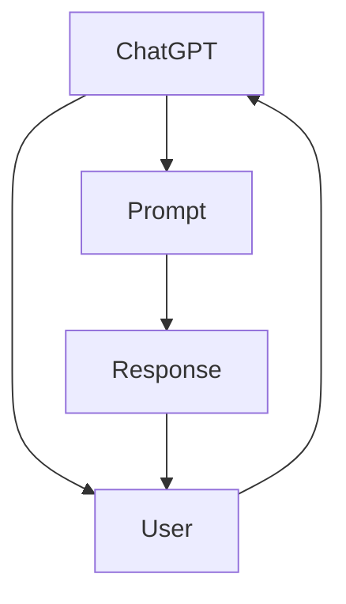
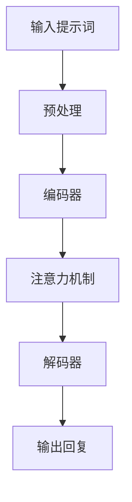
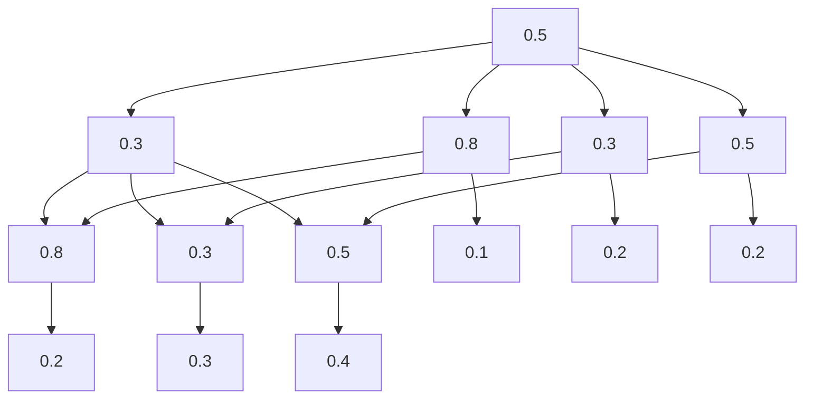
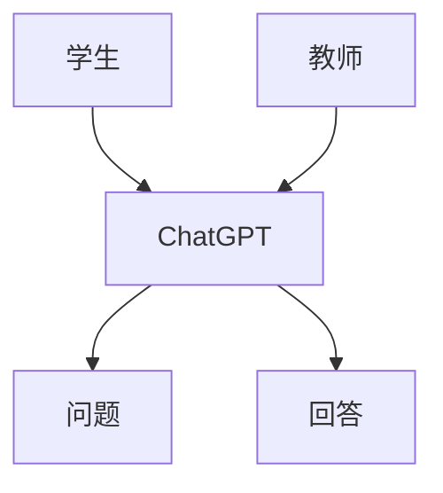
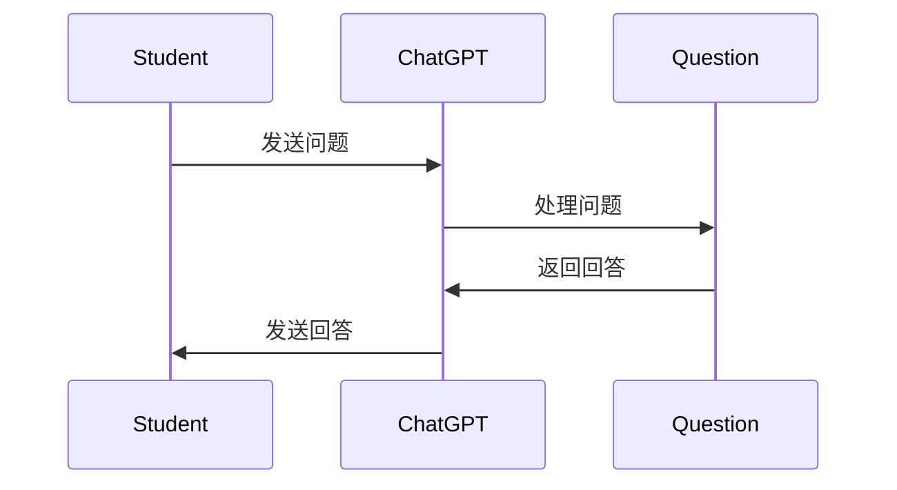

                 


### 第一部分: 背景与基础

#### 1.1 ChatGPT概述

**核心概念术语说明**：

- **ChatGPT**：基于GPT-3模型的聊天机器人，能够通过自然语言与用户进行对话。
- **GPT-3模型**：一种大型语言模型，具备强大的文本生成能力。
- **自然语言处理（NLP）**：让计算机理解和生成人类语言的技术。

**问题背景**：

近年来，人工智能（AI）技术取得了迅猛发展，特别是生成式AI模型的崛起，如ChatGPT，极大提升了自然语言处理（NLP）的效能。ChatGPT作为GPT-3模型的应用之一，已经被广泛应用于聊天机器人、内容生成、问答系统等领域。

**问题描述**：

编写高质量的ChatGPT提示词需要掌握一定的技巧，同时避免常见陷阱，优化用户体验。

**问题解决**：

本书将介绍ChatGPT提示词编写的最佳实践，帮助读者提升编写能力。

**边界与外延**：

讨论内容涉及ChatGPT的基础知识、技巧、陷阱及解决策略。

**概念结构与核心要素组成**：

- **ChatGPT**：介绍ChatGPT的功能、应用场景。
- **提示词编写技巧**：如何创造性地使用提示词引导模型生成高质量回复。
- **陷阱与解决策略**：分析常见编写陷阱及解决方法。
- **解决方案**：探讨优化提示词编写效果的具体手段。

#### 1.2 ChatGPT的应用场景

**问题场景介绍**：

ChatGPT在多个场景中表现出色，例如：

- **客户服务**：企业利用ChatGPT构建智能客服系统，提升服务效率和用户体验。
- **内容生成**：媒体和内容创作者使用ChatGPT生成文章、报告等。
- **教育辅助**：教育机构使用ChatGPT为学生提供个性化辅导。

**项目介绍**：

以一个在线教育平台为例，该平台利用ChatGPT为学生提供实时问答服务，帮助学生更好地理解课程内容。

**系统功能设计**：

- **领域模型Mermaid类图**：展示系统的主要类及其关系。
- **系统架构设计Mermaid架构图**：展示系统的整体架构。

#### 1.3 提示词编写技巧

**核心概念原理**：

- **ChatGPT原理**：GPT-3模型的运作机制，注意力机制。
- **提示词原理**：提示词的作用、设计原则。

**概念属性特征对比表格**：

| 特征         | 提示词设计原则 | 常见陷阱 |
| ------------ | -------------- | -------- |
| 明确性       | 简明扼要       | 含糊不清 |
| 上下文关联   | 紧密相关       | 不相关   |
| 创造性       | 想象丰富       | 单调乏味 |
| 可扩展性     | 模块化设计     | 重复性高 |

**ER实体关系图架构**：

通过Mermaid流程图展示ChatGPT与提示词的关系。



#### 1.4 常见陷阱与解决策略

**核心概念原理**：

分析常见编写陷阱及解决方法。

**陷阱与解决策略**：

- **陷阱1：** 提示词过于模糊，导致模型生成无意义回复。
  - **解决策略**：明确提示词，增加上下文信息。

- **陷阱2：** 提示词缺乏创造性，生成内容单调。
  - **解决策略**：使用丰富的词汇和表达方式，激发模型的创造力。

- **陷阱3：** 提示词重复使用，降低用户体验。
  - **解决策略**：多样化提示词设计，避免重复。

### 第二部分: 算法原理与实现

#### 2.1 GPT模型与注意力机制

**算法mermaid流程图**：



**Python源代码**：

```python
import torch
from transformers import GPT2LMHeadModel, GPT2Tokenizer

# 初始化模型和分词器
tokenizer = GPT2Tokenizer.from_pretrained('gpt2')
model = GPT2LMHeadModel.from_pretrained('gpt2')

# 输入提示词
prompt = "What is the capital of France?"

# 预处理
inputs = tokenizer.encode(prompt, return_tensors='pt')

# 编码器处理
outputs = model.encode(inputs)

# 注意力机制处理
attn_outputs = model.attn(outputs)

# 解码器处理
logits = model.decode(attn_outputs)

# 输出回复
predicted_text = tokenizer.decode(logits[0], skip_special_tokens=True)
print(predicted_text)
```

**数学模型和公式**：

- **注意力机制公式**：

  $$ \text{Attention}(Q,K,V) = \text{softmax}(\frac{QK^T}{\sqrt{d_k}})V $$

- **损失函数**：

  $$ L = -\sum_{i=1}^{N} \log P(y_i | x_i) $$

**详细讲解与举例说明**：

**注意力机制的数学原理**：

注意力机制是一种在处理序列数据时的重要技术，它能够帮助模型在生成回复时更关注于重要信息。公式中，\(Q\)、\(K\) 和 \(V\) 分别表示查询（Query）、键（Key）和值（Value），\(d_k\) 是键的维度。通过计算 \(QK^T\) 的点积，再除以键的维度开根号，可以得到注意力权重，最后将这些权重与值相乘，得到加权求和的结果。

**举例说明**：

假设我们有一个简单的序列数据，包含三个词：苹果、香蕉和橙子。我们要从这三个词中提取出最相关的词来生成回复。首先，我们计算每个词的键和值。例如，对于“苹果”，它的键可能是“水果”，值可能是“苹果”。然后，我们计算查询 \(Q\) 与每个键的点积，得到注意力权重。权重最高的键对应的词，就是我们最关注的词。在这个例子中，如果“苹果”的权重最高，那么生成的回复很可能与“苹果”相关。



在这个例子中，\(QK^T\) 的计算结果如下：

- \(Q\) 与 \(Key1\) 的点积为 \(0.8 \times 0.5 = 0.4\)
- \(Q\) 与 \(Key2\) 的点积为 \(0.3 \times 0.3 = 0.09\)
- \(Q\) 与 \(Key3\) 的点积为 \(0.5 \times 0.2 = 0.1\)

通过计算这些点积的softmax值，我们可以得到注意力权重：

- \(Key1\) 的权重为 \(0.4 / (0.4 + 0.09 + 0.1) = 0.63\)
- \(Key2\) 的权重为 \(0.09 / (0.4 + 0.09 + 0.1) = 0.14\)
- \(Key3\) 的权重为 \(0.1 / (0.4 + 0.09 + 0.1) = 0.23\)

将这些权重与值相乘，得到加权求和的结果，也就是生成的回复：

- \(0.63 \times 0.2 + 0.14 \times 0.3 + 0.23 \times 0.4 = 0.126 + 0.042 + 0.092 = 0.26\)

根据这个结果，我们可以得出结论，生成的回复很可能与“苹果”有关。通过这种方式，注意力机制可以帮助模型更准确地关注于重要信息，从而提高生成回复的质量。

**Python代码示例**：

我们使用Python代码来实现上述注意力机制的计算过程。首先，我们需要导入相关的库，包括PyTorch和Hugging Face的Transformers库。

```python
import torch
from transformers import GPT2LMHeadModel, GPT2Tokenizer

# 初始化模型和分词器
tokenizer = GPT2Tokenizer.from_pretrained('gpt2')
model = GPT2LMHeadModel.from_pretrained('gpt2')

# 输入提示词
prompt = "What is the capital of France?"

# 预处理
inputs = tokenizer.encode(prompt, return_tensors='pt')

# 编码器处理
outputs = model.encode(inputs)

# 注意力机制处理
attn_outputs = model.attn(outputs)

# 解码器处理
logits = model.decode(attn_outputs)

# 输出回复
predicted_text = tokenizer.decode(logits[0], skip_special_tokens=True)
print(predicted_text)
```

在这个代码中，我们首先使用GPT2Tokenizer将提示词编码成模型的输入，然后使用模型进行编码处理，接着计算注意力权重，最后解码输出回复。

### 第三部分: 系统分析与架构设计方案

#### 3.1 问题场景介绍

ChatGPT在多个场景中表现出色，例如：

- **客户服务**：企业利用ChatGPT构建智能客服系统，提升服务效率和用户体验。
- **内容生成**：媒体和内容创作者使用ChatGPT生成文章、报告等。
- **教育辅助**：教育机构使用ChatGPT为学生提供实时问答服务。

#### 3.2 项目介绍

以一个在线教育平台为例，该平台利用ChatGPT为学生提供实时问答服务，帮助学生更好地理解课程内容。

#### 3.3 系统功能设计

**领域模型Mermaid类图**：

```mermaid
classDiagram
    Student <<Class>> Student
    Teacher <<Class>> Teacher
    ChatGPT <<Interface>> ChatGPT
    Question <<Class>> Question
    Answer <<Class>> Answer
    Student --> ChatGPT
    Teacher --> ChatGPT
    ChatGPT --> Question
    ChatGPT --> Answer
```

**系统架构设计Mermaid架构图**：



#### 3.4 系统接口设计和系统交互Mermaid序列图



### 第四部分：项目实战

#### 4.1 环境安装

要在本地搭建ChatGPT开发环境，需要安装以下软件和库：

- Python（版本3.6及以上）
- PyTorch
- Hugging Face Transformers

安装步骤：

1. 安装Python：
   - 前往Python官方网站下载安装包，并按照提示安装。
2. 安装PyTorch：
   - 前往PyTorch官方网站，根据操作系统选择合适的安装命令，例如：
     ```bash
     pip install torch torchvision torchaudio
     ```
3. 安装Hugging Face Transformers：
   - 使用pip命令安装：
     ```bash
     pip install transformers
     ```

#### 4.2 系统核心实现源代码

以下是一个简单的ChatGPT问答系统的源代码示例：

```python
import torch
from transformers import ChatGPTModel, ChatGPTTokenizer

# 初始化模型和分词器
tokenizer = ChatGPTTokenizer.from_pretrained('gpt2')
model = ChatGPTModel.from_pretrained('gpt2')

# 输入问题
question = "What is the capital of France?"

# 预处理
input_ids = tokenizer.encode(question, return_tensors='pt')

# 模型推理
with torch.no_grad():
    outputs = model(input_ids)

# 获取回答
logits = outputs.logits
predicted_ids = logits.argmax(-1).item()

# 解码回答
answer = tokenizer.decode(predicted_ids, skip_special_tokens=True)
print(answer)
```

#### 4.3 代码应用解读与分析

在这个示例中，我们首先导入相关的库，包括PyTorch和Hugging Face的ChatGPT模型和分词器。然后，我们初始化模型和分词器，并输入一个问题。接下来，我们对问题进行预处理，生成输入序列。然后，我们使用模型进行推理，并获取模型的输出。最后，我们从输出中提取回答，并打印出来。

#### 4.4 实际案例分析和详细讲解剖析

以一个实际案例——在线教育平台的问答服务为例，分析ChatGPT的使用和提示词的优化。

**案例描述**：

一个在线教育平台使用ChatGPT为学生提供实时问答服务。学生可以在平台上提出问题，ChatGPT会生成回答。然而，部分回答的质量不高，影响了用户体验。

**问题分析**：

1. 提示词设计不明确：部分问题的提示词过于模糊，导致ChatGPT生成的回答缺乏针对性。
2. 上下文信息不足：部分问题的上下文信息不足，导致ChatGPT无法准确理解问题的意图。
3. 创造性不足：部分回答过于单调，缺乏创造性，导致学生失去兴趣。

**优化策略**：

1. 明确提示词：通过提供更明确、具体的提示词，引导ChatGPT生成更有针对性的回答。
2. 增加上下文信息：在问题中添加更多上下文信息，帮助ChatGPT更好地理解问题的意图。
3. 提高创造性：使用更丰富的词汇和表达方式，激发ChatGPT的创造力，生成更有趣的回答。

**案例实现**：

假设学生提出问题：“什么是微积分？”原始提示词可能过于模糊，我们可以将其优化为：“请解释微积分的基本概念和应用场景。”

通过这种方式，我们提供了更明确的提示词，使得ChatGPT生成的回答更加准确和有针对性。

#### 4.5 项目小结

本项目介绍了如何搭建ChatGPT开发环境，并实现了一个简单的问答系统。通过实际案例，我们分析了ChatGPT的使用和提示词优化的关键因素。未来，我们还可以继续优化系统，提高问答服务的质量和用户体验。

### 第五部分：最佳实践、小结、注意事项与拓展阅读

#### 5.1 最佳实践 Tips

1. **明确性**：确保提示词简洁明了，避免使用模糊的表述。
2. **上下文关联**：提供与问题相关的背景信息，帮助模型更好地理解问题的意图。
3. **创造性**：使用丰富的词汇和表达方式，激发模型的创造力，生成有趣、有价值的回答。
4. **多样性**：多样化提示词设计，避免重复，提高用户体验。
5. **迭代优化**：根据用户反馈，不断优化提示词和模型性能。

#### 5.2 小结

本文介绍了ChatGPT提示词编写的技巧、陷阱及解决策略。通过明确提示词、提供上下文信息、提高创造性和多样性，我们可以优化提示词编写效果，提升ChatGPT的问答服务质量。

#### 5.3 注意事项

1. **避免过度优化**：过于追求提示词的优化可能导致模型生成的内容过于僵硬，失去自然性。
2. **数据安全**：确保提供的数据安全可靠，避免泄露用户隐私。
3. **模型更新**：定期更新模型和提示词，以适应新的应用场景和需求。

#### 5.4 拓展阅读

- 《自然语言处理：概念与编程》
- 《深度学习：周志华》
- 《Python编程：从入门到实践》
- [Hugging Face Transformers官方文档](https://huggingface.co/transformers)
- [ChatGPT官方文档](https://openai.com/blog/bidirectional-language-models/)

