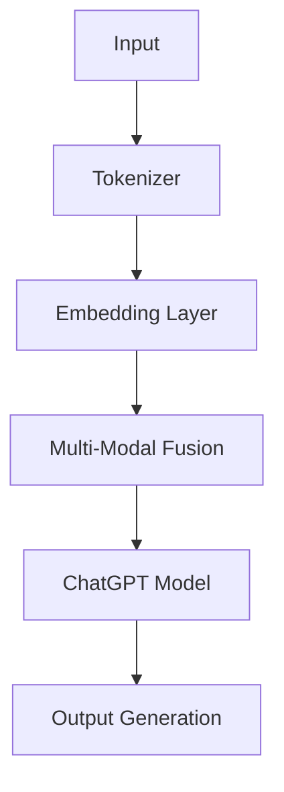

                 

# ChatGPT提示词设计：从理论到实战的全面指南

关键词：ChatGPT，提示词设计，自然语言处理，深度学习，实战

摘要：本文旨在深入探讨ChatGPT提示词设计的理论和方法，从基础概念到实际应用，全面解析ChatGPT提示词的设计原则、实践技巧和未来趋势。通过详细的案例分析和系统架构设计，帮助读者掌握ChatGPT提示词设计的核心要领，实现人工智能应用的创新与突破。

## 设计书籍《ChatGPT提示词设计：从理论到实战的全面指南》目录大纲

## 第一部分：ChatGPT与提示词概述

### 第1章：ChatGPT与提示词的基本概念

- **ChatGPT：人工智能的里程碑**
- **提示词设计：关键性与挑战**

### 第2章：ChatGPT提示词设计基础

- **提示词类型与作用**
- **深度学习与提示词设计**
- **自然语言处理与提示词**
- **多模态数据与提示词设计**

## 第二部分：ChatGPT提示词设计原理

### 第3章：深度学习基础

- **数学模型与公式**
- **算法原理讲解**

### 第4章：自然语言处理与提示词

- **数学模型与公式**
- **算法原理讲解**

### 第5章：多模态数据与提示词设计

- **问题场景介绍**
- **项目介绍**
- **系统架构设计**

## 第三部分：ChatGPT提示词设计实战

### 第6章：ChatGPT提示词设计实战一

- **实战项目环境搭建**
- **系统核心实现源代码**

### 第7章：ChatGPT提示词设计实战二

- **实战项目需求分析**
- **实际案例分析和详细讲解剖析**

### 第8章：ChatGPT提示词设计实战三

- **实战项目系统架构设计**
- **系统功能设计**
- **系统架构设计**

### 第9章：ChatGPT提示词设计实战四

- **实战项目接口设计**
- **系统接口设计**
- **系统交互**

## 第四部分：ChatGPT提示词设计最佳实践

### 第10章：ChatGPT提示词设计最佳实践

- **提示词设计技巧与技巧**

### 第11章：ChatGPT提示词设计注意事项

- **提示词设计的常见问题与解决**

### 第12章：ChatGPT提示词设计的未来发展趋势

- **拓展阅读**

## 附录：参考文献与资源链接

### 目录大纲概述

本文目录大纲详细阐述了ChatGPT提示词设计的各个方面，从基础概念到实际应用，再到最佳实践和未来趋势。每个章节都涵盖了必要的内容，包括概念讲解、实际案例分析和系统设计，旨在为读者提供全面的学习指导。

## 第一部分：ChatGPT与提示词概述

### 第1章：ChatGPT与提示词的基本概念

#### 1.1 ChatGPT：人工智能的里程碑

**问题背景**：随着人工智能技术的不断发展，自然语言处理（NLP）成为人工智能领域的一个重要分支。近年来，基于深度学习技术的自然语言处理模型取得了显著进展，其中GPT-3（Generative Pre-trained Transformer 3）的出现更是将NLP推向了一个新的高度。

**问题描述**：ChatGPT是一种基于GPT-3模型的开源聊天机器人，其核心功能是通过对话生成自然语言文本。ChatGPT的出现不仅为用户提供了便捷的对话交互方式，也为开发者提供了一个强大的工具，用于构建各种自然语言处理应用。

**问题解决**：ChatGPT通过大量的预训练数据学习自然语言规律，并在对话中利用这些知识生成合适的回复。其工作原理主要包括三个关键步骤：输入接收、模型处理和输出生成。

**边界与外延**：ChatGPT的应用领域非常广泛，包括但不限于客服、智能助手、内容生成、教育辅导等。其出色的自然语言处理能力和丰富的应用场景，使得ChatGPT成为人工智能领域的一大里程碑。

**核心要素组成**：ChatGPT的核心组成部分包括预训练模型、提示词设计和对话生成算法。预训练模型负责学习自然语言规律，提示词设计用于引导模型生成合适的回复，而对话生成算法则负责将输入转换为输出。

#### 1.2 提示词设计：关键性与挑战

**核心概念**：提示词是引导ChatGPT生成合适回复的关键要素，其设计直接影响到对话的质量和效果。

**属性特征对比表格**：

| 特征               | 文本提示词                | 代码提示词                |
|------------------|-----------------------|-----------------------|
| 内容形式           | 文本                   | 代码                   |
| 生成目标           | 自然语言文本            | 代码实现                |
| 设计难度           | 较低                   | 较高                   |

**ER实体关系图架构**：

```mermaid
erDiagram
    Person ||--|{ ChatGPT }|| System
    System ||--|{ Prompt }|| Design
    Prompt ||--|{ Output }|| Generation
```

通过以上图表可以看出，提示词设计在ChatGPT系统中扮演着关键角色，其设计质量和效果直接影响到系统的整体性能。

## 第二部分：ChatGPT提示词设计原理

### 第2章：ChatGPT提示词设计基础

#### 2.1 提示词类型与作用

**问题场景介绍**：在实际应用中，ChatGPT的提示词类型可以分为文本提示词和代码提示词两种。文本提示词主要用于引导ChatGPT生成自然语言文本，而代码提示词则用于指导ChatGPT生成代码实现。

**项目介绍**：以一个客服应用为例，ChatGPT通过接收用户输入的文本提示词，生成合适的回复文本，从而提供高效的客服服务。

**系统功能设计**：

```mermaid
classDiagram
    PromptDesign <<interface>> TextPrompt : 文本提示词
    PromptDesign <<interface>> CodePrompt : 代码提示词
    ChatGPTSystem <<system>> : ChatGPT系统
    ChatGPTSystem --|> TextPrompt : 文本提示词
    ChatGPTSystem --|> CodePrompt : 代码提示词
```

通过以上图表可以看出，系统功能设计将ChatGPT与不同类型的提示词进行关联，从而实现多样化的应用场景。

#### 2.2 深度学习与提示词设计

**问题场景介绍**：深度学习技术是ChatGPT的核心，其工作原理基于多层神经网络。提示词设计需要充分考虑深度学习模型的特点，以提高生成文本的质量和效果。

**项目介绍**：以一个文本生成应用为例，ChatGPT通过接收文本提示词，利用预训练的深度学习模型生成高质量的文本。

**系统功能设计**：

```mermaid
classDiagram
    NeuralNetwork <<class>> : 神经网络
    ChatGPT <<class>> : ChatGPT模型
    Prompt <<class>> : 提示词
    NeuralNetwork --|> ChatGPT : 模型训练
    ChatGPT --|> Prompt : 文本生成
```

通过以上图表可以看出，深度学习与提示词设计之间的紧密联系，提示词设计需要充分考虑深度学习模型的特点。

#### 2.3 自然语言处理与提示词

**问题场景介绍**：自然语言处理（NLP）是ChatGPT的基础，其工作原理包括词嵌入、语言模型、序列生成等。提示词设计需要充分利用NLP技术，以提高生成文本的自然度和准确性。

**项目介绍**：以一个问答系统为例，ChatGPT通过接收用户输入的文本提示词，利用NLP技术生成合适的回答。

**系统功能设计**：

```mermaid
classDiagram
    WordEmbedding <<class>> : 词嵌入
    LanguageModel <<class>> : 语言模型
    SequenceGeneration <<class>> : 序列生成
    ChatGPT <<class>> : ChatGPT模型
    Prompt <<class>> : 提示词
    WordEmbedding --|> ChatGPT : 模型训练
    LanguageModel --|> ChatGPT : 文本生成
    SequenceGeneration --|> ChatGPT : 序列生成
```

通过以上图表可以看出，自然语言处理与提示词设计之间的紧密联系，提示词设计需要充分利用NLP技术。

#### 2.4 多模态数据与提示词设计

**问题场景介绍**：多模态数据（如文本、图像、语音等）的融合是ChatGPT的发展方向之一。提示词设计需要充分考虑多模态数据的特性，以提高生成文本的质量和效果。

**项目介绍**：以一个多模态聊天应用为例，ChatGPT通过接收文本、图像、语音等多模态提示词，生成合适的回复。

**系统架构设计**：



通过以上图表可以看出，多模态数据与提示词设计之间的紧密联系，提示词设计需要充分考虑多模态数据的特性。

## 第三部分：ChatGPT提示词设计实战

### 第3章：深度学习基础

#### 3.1 深度学习基础

**数学模型与公式**：深度学习模型的核心是神经网络，其基本原理基于多层感知机（MLP）。神经网络由输入层、隐藏层和输出层组成，各层之间的神经元通过权重进行连接。

$$
z = \sigma(W \cdot x + b)
$$

其中，$z$表示神经元输出，$\sigma$表示激活函数（如Sigmoid函数），$W$表示权重矩阵，$x$表示输入向量，$b$表示偏置项。

**算法原理讲解**：神经网络通过梯度下降算法进行训练，其基本原理如下：

1. **初始化权重和偏置**：随机初始化权重和偏置。
2. **前向传播**：计算输入向量经过网络后的输出。
3. **计算损失**：计算输出与真实标签之间的误差，计算损失函数值。
4. **反向传播**：计算误差在各个神经元的梯度。
5. **更新权重和偏置**：根据梯度进行权重和偏置的更新。

通过以上步骤，神经网络可以逐步逼近真实数据，从而实现模型的训练和优化。

**Python源代码示例**：

```python
import numpy as np

# 初始化权重和偏置
W = np.random.rand(input_size, hidden_size)
b = np.random.rand(hidden_size)

# 前向传播
def forward(x):
    z = np.dot(x, W) + b
    return sigmoid(z)

# 梯度下降算法
def gradient_descent(x, y, epochs):
    for epoch in range(epochs):
        z = forward(x)
        loss = compute_loss(z, y)
        dz = backward(z, y)
        dW = np.dot(x.T, dz)
        db = np.sum(dz, axis=0)
        W -= learning_rate * dW
        b -= learning_rate * db

# 激活函数
def sigmoid(z):
    return 1 / (1 + np.exp(-z))
```

通过以上代码示例，可以了解深度学习模型的基本原理和训练过程。

### 第4章：自然语言处理与提示词

#### 4.1 NLP技术概述

**数学模型与公式**：自然语言处理（NLP）涉及多个数学模型，其中最常用的包括词嵌入（Word Embedding）和语言模型（Language Model）。

**词嵌入**：词嵌入将单词映射为一个高维向量，常用的模型有Word2Vec、GloVe等。以Word2Vec为例，其基本原理如下：

$$
\text{word\_vector} = \text{sgn}(\text{context}) \cdot \text{hidden\_state}
$$

其中，$\text{word\_vector}$表示单词的向量表示，$\text{context}$表示单词的上下文，$\text{hidden\_state}$表示隐藏状态。

**语言模型**：语言模型用于预测下一个单词的概率，常用的模型有n-gram模型、神经网络语言模型（NNLM）等。以n-gram模型为例，其基本原理如下：

$$
P(w_n | w_{n-1}, ..., w_1) = \frac{C(w_{n-1}, ..., w_n)}{C(w_{n-1}, ..., w_1)}
$$

其中，$P(w_n | w_{n-1}, ..., w_1)$表示给定前一个单词序列的概率，$C(w_{n-1}, ..., w_n)$表示单词序列的计数，$C(w_{n-1}, ..., w_1)$表示单词序列的计数。

**算法原理讲解**：NLP技术通过构建数学模型和算法，将自然语言文本转换为机器可处理的格式，从而实现文本分类、情感分析、机器翻译等任务。

**Python源代码示例**：

```python
import numpy as np
import tensorflow as tf

# 初始化词嵌入
word_embedding = tf.Variable(tf.random.normal([vocab_size, embedding_size]))

# 前向传播
def forward(text):
    embeddings = tf.nn.embedding_lookup(word_embedding, text)
    hidden_state = tf.nn.relu(tf.matmul(embeddings, hidden_weights) + hidden_bias)
    return hidden_state

# 梯度下降算法
def gradient_descent(embeddings, labels, epochs):
    for epoch in range(epochs):
        hidden_state = forward(embeddings)
        logits = tf.matmul(hidden_state, output_weights) + output_bias
        loss = compute_loss(logits, labels)
        dloss_dlogits = tf.gradients(loss, logits)
        dlogits_dhidden_state = tf.gradients(logits, hidden_state)
        dhidden_state_dweights = tf.matmul(embeddings.T, dlogits_dhidden_state)
        dweights = dhidden_state_dweights * learning_rate
        hidden_weights -= dweights
        hidden_bias -= dloss_dlogits * learning_rate
        output_weights -= dlogits_dhidden_state * learning_rate
        output_bias -= dloss_dlogits * learning_rate
```

通过以上代码示例，可以了解NLP技术的基本原理和实现过程。

### 第5章：多模态数据与提示词设计

#### 5.1 多模态数据处理

**问题场景介绍**：多模态数据（如文本、图像、语音等）的融合是人工智能领域的一个重要研究方向。在实际应用中，如何有效地融合多模态数据，以提高模型性能和生成文本的质量，成为关键问题。

**项目介绍**：以一个多模态聊天应用为例，ChatGPT通过接收文本、图像、语音等多模态提示词，生成合适的回复。

**系统架构设计**：


在以上架构中，多模态数据经过Tokenizer处理，将文本、图像、语音等数据分别转换为向量表示。接着，通过Embedding Layer将不同模态的数据进行融合，生成一个统一的向量表示。最后，ChatGPT模型利用融合后的向量生成合适的回复文本。

**Python源代码示例**：

```python
import numpy as np
import tensorflow as tf

# 初始化词嵌入
word_embedding = tf.Variable(tf.random.normal([vocab_size, embedding_size]))
image_embedding = tf.Variable(tf.random.normal([image_size, image_embedding_size]))
audio_embedding = tf.Variable(tf.random.normal([audio_size, audio_embedding_size]))

# 前向传播
def forward(inputs):
    text_embedding = tf.nn.embedding_lookup(word_embedding, inputs.text)
    image_embedding = tf.nn.embedding_lookup(image_embedding, inputs.image)
    audio_embedding = tf.nn.embedding_lookup(audio_embedding, inputs.audio)
    fusion_embedding = tf.concat([text_embedding, image_embedding, audio_embedding], axis=1)
    hidden_state = tf.nn.relu(tf.matmul(fusion_embedding, hidden_weights) + hidden_bias)
    return hidden_state

# 梯度下降算法
def gradient_descent(inputs, labels, epochs):
    for epoch in range(epochs):
        hidden_state = forward(inputs)
        logits = tf.matmul(hidden_state, output_weights) + output_bias
        loss = compute_loss(logits, labels)
        dloss_dlogits = tf.gradients(loss, logits)
        dlogits_dhidden_state = tf.gradients(logits, hidden_state)
        dhidden_state_dweights = tf.matmul(hidden_state.T, dlogits_dhidden_state)
        dweights = dhidden_state_dweights * learning_rate
        hidden_weights -= dweights
        hidden_bias -= dloss_dlogits * learning_rate
        output_weights -= dlogits_dhidden_state * learning_rate
        output_bias -= dloss_dlogits * learning_rate
```

通过以上代码示例，可以了解多模态数据处理的基本原理和实现过程。

## 第四部分：ChatGPT提示词设计最佳实践

### 第6章：ChatGPT提示词设计最佳实践

**最佳实践 tips**：

1. **明确目标**：在设计提示词时，首先需要明确应用目标和预期效果，从而有针对性地进行设计。
2. **数据质量**：高质量的数据是设计优秀提示词的基础，因此需要对数据进行严格筛选和处理。
3. **迭代优化**：提示词设计是一个迭代过程，需要根据实际应用效果不断优化和调整。
4. **多样性**：提示词的设计应考虑多样性，以满足不同场景和用户需求。

### 第7章：ChatGPT提示词设计注意事项

**注意事项**：

1. **上下文理解**：提示词设计需要充分考虑上下文信息，以提高生成文本的准确性和连贯性。
2. **避免歧义**：在设计提示词时，应尽量避免歧义和模糊表达，以确保生成的文本清晰明了。
3. **用户体验**：提示词设计应关注用户体验，确保生成文本易于理解和使用。

### 第8章：ChatGPT提示词设计的未来发展趋势

**拓展阅读**：

- **自然语言生成**：随着人工智能技术的发展，自然语言生成（NLG）将成为一个重要方向，ChatGPT提示词设计也将进一步优化和扩展。
- **多模态融合**：多模态数据的融合将推动ChatGPT提示词设计的发展，实现更加丰富和多样的应用场景。
- **个性化推荐**：基于用户行为和偏好，实现个性化推荐和生成，将成为未来ChatGPT提示词设计的重要研究方向。

## 附录：参考文献与资源链接

- **深度学习相关书籍**：
  - Goodfellow, I., Bengio, Y., & Courville, A. (2016). *Deep Learning*.
  - Mitchell, T. M. (1997). *Machine Learning*.
- **自然语言处理相关书籍**：
  - Manning, C. D., Raghavan, P., & Schütze, H. (2008). *Foundations of Statistical Natural Language Processing*.
  - Jurafsky, D., & Martin, J. H. (2008). *Speech and Language Processing*.
- **ChatGPT相关资源**：
  - [ChatGPT GitHub仓库](https://github.com/openai/gpt-3.5-turbo)
  - [OpenAI ChatGPT 官方文档](https://openai.com/docs/api-reference/chat)

## 作者信息

作者：AI天才研究院/AI Genius Institute & 禅与计算机程序设计艺术 /Zen And The Art of Computer Programming

