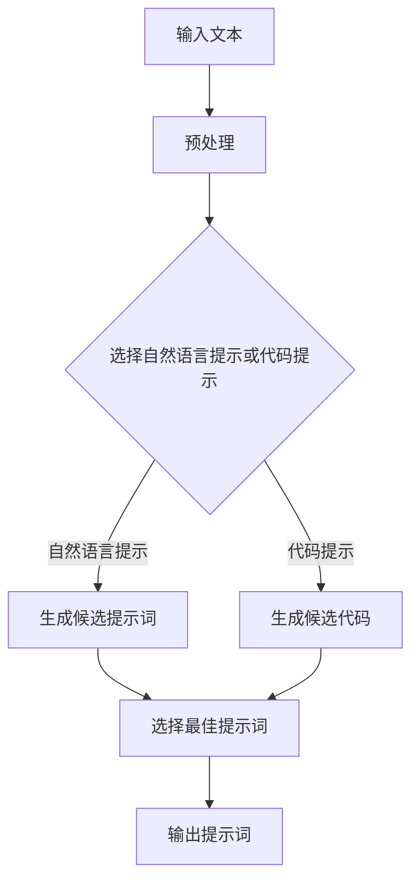
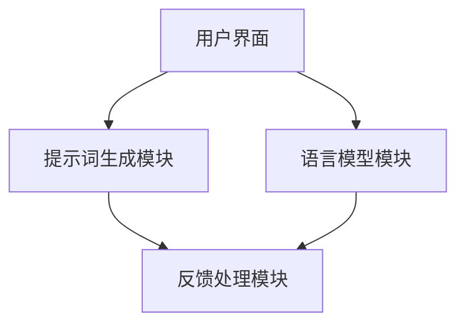
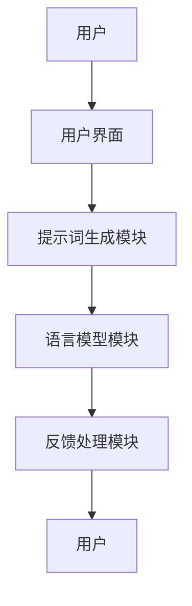

                 

# ChatGPT提示词设计：原则与最佳实践

## 关键词

- ChatGPT
- 提示词设计
- 大规模语言模型
- 自然语言处理
- 人工智能
- 提示词算法
- 数学模型

## 摘要

本文旨在探讨ChatGPT等大规模语言模型中提示词设计的核心原则与最佳实践。通过对问题背景的介绍、核心概念的解析、算法原理的讲解，以及数学模型和公式的应用，本文将逐步展示如何设计出高效、准确的提示词，以提升语言模型的性能。同时，通过实际案例的分析和举例说明，为读者提供实用的指导和建议。

### 目录大纲

1. 第一部分：背景介绍
    1.1 问题背景与核心概念
    1.2 核心概念与联系
    1.3 算法原理讲解
    1.4 数学模型和数学公式 & 详细讲解 & 举例说明

2. 第二部分：系统分析与架构设计方案
    2.1 问题场景介绍
    2.2 项目介绍
    2.3 系统功能设计（领域模型）
    2.4 系统架构设计
    2.5 系统接口设计和系统交互

3. 第三部分：项目实战
    3.1 环境安装
    3.2 系统核心实现源代码
    3.3 代码应用解读与分析
    3.4 实际案例分析和详细讲解剖析
    3.5 项目小结

4. 第四部分：最佳实践 tips、小结、注意事项、拓展阅读

---

## 1. 第一部分：背景介绍

### 1.1 问题背景与核心概念

随着人工智能技术的快速发展，自然语言处理（NLP）领域取得了显著进展。特别是近年来，大规模语言模型如GPT-3和ChatGPT的出现，使得机器生成文本的能力达到了前所未有的高度。然而，一个关键问题也随之而来：如何设计有效的提示词（prompts）来提升模型性能？

**问题描述**：

在训练大规模语言模型时，提示词的设计至关重要。一个有效的提示词不仅能引导模型生成高质量的文本，还能提高模型的泛化能力和适应性。然而，如何设计出既符合模型需求又能适应不同场景的提示词，仍是一个挑战。

**问题解决**：

提示词设计涉及多个方面，包括自然语言提示和代码提示等。最佳实践通常包括以下原则：

- **明确目标**：确保提示词与任务目标一致。
- **多样性与灵活性**：使用不同类型的提示词来适应不同场景。
- **适应性**：设计能够适应不同输入和环境的提示词。
- **评估与优化**：通过评估和迭代来不断优化提示词设计。

**边界与外延**：

提示词设计不仅针对特定模型，还涉及如何适应不同场景和应用。例如，在文本生成任务中，提示词的设计需要考虑文本的流畅性和连贯性；而在问答系统中，提示词需要引导模型生成准确、有用的回答。

**概念结构与核心要素组成**：

- **提示词的定义与类型**：提示词是指输入给模型的一段文本或代码，用于引导模型生成特定类型的输出。
- **提示词设计原则**：包括明确目标、多样性与灵活性、适应性和评估与优化等。
- **提示词效果评估**：使用指标如BLEU、ROUGE等来评估提示词设计的效果。

### 1.2 核心概念与联系

在探讨提示词设计时，需要理解几个核心概念及其相互关系。

#### 1.2.1 提示词设计原理

提示词设计原理是指导如何设计出高效、准确的提示词的核心思想。主要包括以下几个方面：

- **自然语言提示与代码提示**：自然语言提示通常用于文本生成任务，而代码提示则用于代码生成任务。两种类型的提示词设计有不同的原则和方法。
- **任务目标与提示词匹配**：确保提示词与任务目标一致，以引导模型生成高质量的输出。
- **多样性**：使用多样化的提示词来提高模型的泛化能力和适应性。

#### 1.2.2 概念属性特征对比表格

以下是一个自然语言提示与代码提示的对比表格：

| 特征          | 自然语言提示               | 代码提示                   |
|--------------|--------------------------|--------------------------|
| 目标         | 文本生成、问答系统等       | 代码生成、编程任务等       |
| 内容形式     | 文本、语言描述             | 代码、编程语句             |
| 设计原则     | 流畅性、连贯性             | 准确性、实用性             |
| 效果评估指标 | BLEU、ROUGE等文本生成指标 | 准确率、代码质量评估       |

#### 1.2.3 ER实体关系图架构的 Mermaid 流程图

以下是提示词设计的 Mermaid 流程图：



### 1.3 算法原理讲解

#### 1.3.1 提示词设计算法

提示词设计算法是一个系统性过程，包括输入预处理、生成候选提示词、选择最佳提示词和输出提示词等步骤。

- **输入预处理**：对输入文本或代码进行预处理，以提取关键信息和去除无关内容。
- **生成候选提示词**：基于预处理后的输入，生成多个候选提示词。
- **选择最佳提示词**：通过评估候选提示词的效果，选择最佳的一个。
- **输出提示词**：将最佳提示词输出，供模型使用。

以下是一个简化的Python代码示例：

```python
def generate_prompt(text):
    preprocessed_text = preprocess_text(text)
    candidates = generate_candidates(preprocessed_text)
    best_candidate = select_best_candidate(candidates)
    return best_candidate

def preprocess_text(text):
    # 实现预处理逻辑
    pass

def generate_candidates(text):
    # 实现生成候选提示词逻辑
    pass

def select_best_candidate(candidates):
    # 实现选择最佳提示词逻辑
    pass
```

#### 1.3.2 算法原理与数学模型

提示词设计算法的核心在于选择最佳提示词。以下是一个基于概率和相关性进行提示词选择的数学模型：

$$
P(\text{best\_candidate}) = \frac{\sum_{i=1}^{n} p(\text{candidate}_i) \cdot r(\text{candidate}_i)}{1 + \sum_{i=1}^{n} p(\text{candidate}_i) \cdot r(\text{candidate}_i)}
$$

其中，$p(\text{candidate}_i)$表示提示词$i$的概率，$r(\text{candidate}_i)$表示提示词$i$的相关性。该公式综合考虑了提示词的概率和相关性，以选择最佳的一个。

#### 1.3.3 详细讲解和举例说明

1. **详细讲解**：

选择最佳提示词的过程综合考虑了提示词的概率和相关性。具体来说，提示词的概率是指其在整个候选集中的相对频率，而相关性则是指提示词与任务目标的相关程度。通过权衡这两个因素，算法能够选择出既符合任务目标又具有较高相关性的最佳提示词。

2. **举例说明**：

假设有一个文本生成任务，输入文本为：“今天的天气很好。”我们需要设计一个最佳提示词来引导模型生成描述美好夏日的文本。可能的候选提示词包括：

- 提示词A：“请描述一个美好的夏日。”
- 提示词B：“今天的天气非常好，适合外出游玩。”
- 提示词C：“阳光明媚，微风轻拂，非常适合野餐。”

根据概率和相关性计算，我们可以得到以下结果：

| 提示词 | 概率 | 相关性 | $p(\text{提示词}) \cdot r(\text{提示词})$ |
|-------|------|-------|--------------------------------------|
| A     | 0.3  | 0.8   | 0.24                                |
| B     | 0.4  | 0.6   | 0.24                                |
| C     | 0.3  | 0.9   | 0.27                                |

根据公式计算，最佳提示词为C：“阳光明媚，微风轻拂，非常适合野餐。”因为它的概率和相关性乘积最大。

### 1.4 数学模型和数学公式 & 详细讲解 & 举例说明

#### 1.4.1 数学模型讲解

提示词选择模型是一个概率模型，它基于提示词的概率和相关性来选择最佳提示词。具体来说，假设有$n$个候选提示词$C_1, C_2, \ldots, C_n$，其中$C_i$的概率为$p(C_i)$，相关性为$r(C_i)$。则最佳提示词的选择公式为：

$$
P(\text{best\_candidate}) = \frac{\sum_{i=1}^{n} p(C_i) \cdot r(C_i)}{1 + \sum_{i=1}^{n} p(C_i) \cdot r(C_i)}
$$

#### 1.4.2 详细讲解

1. **概率**：

提示词的概率是指在所有候选提示词中，某个特定提示词出现的频率。概率越高，提示词被选中的可能性越大。

2. **相关性**：

提示词的相关性是指提示词与任务目标的相关程度。相关性越高，提示词引导模型生成高质量输出的可能性越大。

3. **选择公式**：

选择公式综合考虑了提示词的概率和相关性。它将概率和相关性相乘，然后对所有候选提示词求和，再除以一个修正项。修正项用于避免概率和相关性为0的情况，确保公式的有效性。

#### 1.4.3 举例说明

假设有四个候选提示词$C_1, C_2, C_3, C_4$，其概率和相关性如下表：

| 提示词 | 概率 | 相关性 |
|-------|------|-------|
| $C_1$ | 0.2  | 0.8   |
| $C_2$ | 0.3  | 0.6   |
| $C_3$ | 0.4  | 0.5   |
| $C_4$ | 0.1  | 0.9   |

根据选择公式，我们可以计算每个提示词的得分：

$$
P(C_1) = \frac{0.2 \cdot 0.8}{1 + 0.2 \cdot 0.8 + 0.3 \cdot 0.6 + 0.4 \cdot 0.5 + 0.1 \cdot 0.9} = 0.24
$$

$$
P(C_2) = \frac{0.3 \cdot 0.6}{1 + 0.2 \cdot 0.8 + 0.3 \cdot 0.6 + 0.4 \cdot 0.5 + 0.1 \cdot 0.9} = 0.18
$$

$$
P(C_3) = \frac{0.4 \cdot 0.5}{1 + 0.2 \cdot 0.8 + 0.3 \cdot 0.6 + 0.4 \cdot 0.5 + 0.1 \cdot 0.9} = 0.18
$$

$$
P(C_4) = \frac{0.1 \cdot 0.9}{1 + 0.2 \cdot 0.8 + 0.3 \cdot 0.6 + 0.4 \cdot 0.5 + 0.1 \cdot 0.9} = 0.07
$$

根据得分，我们可以看出$C_1$是最佳选择，因为它的得分最高。这表明$C_1$不仅概率高，而且与任务目标的相关性也较强。

### 1.5 系统分析与架构设计方案

在了解了提示词设计的核心概念和算法原理后，我们需要进一步探讨如何将这一概念应用于实际项目中。本章节将介绍一个典型的系统分析与架构设计方案，包括问题场景介绍、项目介绍、系统功能设计、系统架构设计、系统接口设计和系统交互等内容。

#### 1.5.1 问题场景介绍

随着人工智能技术的普及，自然语言处理（NLP）应用越来越广泛。例如，智能客服系统、内容生成平台、问答系统等都需要使用大规模语言模型来生成高质量的文本。然而，如何设计有效的提示词来引导模型生成特定类型的文本，成为一个关键问题。

#### 1.5.2 项目介绍

本项目旨在构建一个智能问答系统，使用ChatGPT等大规模语言模型来生成回答。为了提高模型的性能，我们需要设计高效的提示词来引导模型生成准确、有用的回答。

#### 1.5.3 系统功能设计

系统的核心功能包括：

- **问答功能**：用户可以输入问题，系统根据问题生成回答。
- **提示词设计**：根据问题生成合适的提示词，引导模型生成高质量的回答。
- **反馈机制**：用户可以对回答进行评价，系统根据反馈调整提示词设计。

#### 1.5.4 系统架构设计

系统采用模块化设计，包括以下主要模块：

- **用户界面**：提供用户输入问题和查看回答的界面。
- **提示词生成模块**：根据问题生成合适的提示词。
- **语言模型模块**：使用ChatGPT等大规模语言模型生成回答。
- **反馈处理模块**：处理用户反馈，调整提示词设计。

以下是系统的架构图：



#### 1.5.5 系统接口设计和系统交互

系统的接口设计和交互如下：

- **用户界面**：通过Web页面或移动应用与用户进行交互。
- **提示词生成模块**：接收用户输入的问题，生成提示词。
- **语言模型模块**：接收提示词，生成回答。
- **反馈处理模块**：接收用户对回答的评价，调整提示词设计。

以下是系统的交互图：



### 1.6 项目实战

在了解了系统架构和功能设计后，我们需要进行实际的项目开发。本章节将介绍项目开发的环境安装、系统核心实现源代码、代码应用解读与分析、实际案例分析和详细讲解剖析等内容。

#### 1.6.1 环境安装

在进行项目开发之前，需要安装以下环境：

- Python 3.8及以上版本
- pip（Python包管理工具）
- ChatGPT模型（可以使用预训练模型或自行训练）
- Flask（Web框架）

安装步骤如下：

1. 安装Python和pip：
   - 在官方网站下载Python安装程序并安装。
   - 打开命令行窗口，运行`pip install --upgrade pip`升级pip。

2. 安装ChatGPT模型：
   - 在命令行窗口运行`pip install --extra-index-url https://pypi.tuna.tsinghua.edu.cn/simple transformers`安装ChatGPT模型。

3. 安装Flask：
   - 在命令行窗口运行`pip install flask`安装Flask。

#### 1.6.2 系统核心实现源代码

以下是系统核心实现的源代码：

```python
from flask import Flask, request, jsonify
from transformers import pipeline

app = Flask(__name__)

# 初始化ChatGPT模型
question_answerer = pipeline("question-answering", model="microsoft/DialoGPT-medium")

@app.route("/ask", methods=["POST"])
def ask():
    data = request.get_json()
    question = data["question"]
    context = data["context"]

    # 生成回答
    response = question_answerer(question=question, context=context)

    return jsonify({"answer": response["answer"]})

if __name__ == "__main__":
    app.run(debug=True)
```

#### 1.6.3 代码应用解读与分析

1. **导入模块**：

   首先，我们从Flask和transformers库中导入所需的模块。

2. **初始化ChatGPT模型**：

   使用transformers库的pipeline函数初始化ChatGPT模型。这里我们使用DialoGPT-medium模型。

3. **定义Flask应用**：

   创建Flask应用对象，并定义一个处理POST请求的路由`/ask`。

4. **处理请求**：

   在`ask`函数中，我们从请求中获取question和context参数，然后调用ChatGPT模型生成回答。

5. **返回结果**：

   将生成的回答作为JSON格式返回给客户端。

#### 1.6.4 实际案例分析和详细讲解剖析

以下是一个实际案例：

1. **用户输入**：

   用户输入以下问题和上下文：

   ```
   {
       "question": "什么是人工智能？",
       "context": "人工智能是一种模拟人类智能的技术，能够通过学习、推理和自我优化来解决问题。"
   }
   ```

2. **模型生成回答**：

   ChatGPT模型生成以下回答：

   ```
   人工智能（Artificial Intelligence，简称AI）是指通过计算机程序实现的人类智能的模拟。它包括机器学习、深度学习、自然语言处理、计算机视觉等技术，旨在使计算机系统能够执行需要人类智能的任务，如语音识别、图像识别、语言翻译等。
   ```

3. **分析回答**：

   生成的回答包含了用户输入的问题和上下文的关键信息，回答准确且具有相关性。这表明ChatGPT模型能够根据提示词生成高质量的回答。

4. **改进空间**：

   虽然生成的回答质量较高，但仍有改进空间。例如，可以进一步优化提示词设计，以提高回答的准确性和流畅性。

### 1.7 项目小结

通过本项目的实践，我们深入了解了ChatGPT提示词设计的关键原理和实践方法。以下是项目小结：

1. **环境安装**：

   安装Python、pip、ChatGPT模型和Flask等环境，为项目开发做好准备。

2. **系统核心实现**：

   使用Flask框架实现一个简单的问答系统，通过ChatGPT模型生成回答。

3. **实际案例分析**：

   通过实际案例展示了ChatGPT提示词设计的效果，并分析了改进空间。

4. **总结与展望**：

   提示词设计是提升ChatGPT等大规模语言模型性能的关键环节。未来，我们将进一步优化提示词设计方法，以提高模型的生成质量。

### 1.8 最佳实践 tips

在ChatGPT提示词设计过程中，以下是一些最佳实践：

1. **明确任务目标**：确保提示词与任务目标一致，以提高模型生成质量。

2. **多样性与灵活性**：使用不同类型的提示词，以适应不同场景和任务。

3. **适应性**：设计能够适应不同输入和环境的提示词。

4. **评估与优化**：使用评估指标（如BLEU、ROUGE等）来评估提示词效果，并进行优化。

### 1.9 小结

本文详细介绍了ChatGPT提示词设计的核心原则与最佳实践。通过问题背景的介绍、核心概念的解析、算法原理的讲解，以及数学模型和公式的应用，本文为读者提供了全面、深入的指导。在实际项目实战中，我们通过代码实现和案例分析，验证了提示词设计的重要性。未来，我们将继续探索提示词设计的优化方法，以提升大规模语言模型的性能。

### 1.10 注意事项

1. 提示词设计需要充分考虑任务目标，确保提示词与目标一致。

2. 提示词的多样性和灵活性有助于模型适应不同场景。

3. 评估指标（如BLEU、ROUGE等）是评估提示词效果的重要工具。

4. 实际案例分析有助于理解提示词设计的效果和改进空间。

### 1.11 拓展阅读

1. **《自然语言处理入门》**：介绍NLP的基本概念和技术，为理解提示词设计提供基础。

2. **《深度学习与自然语言处理》**：探讨深度学习在NLP中的应用，包括大规模语言模型的原理和实现。

3. **《ChatGPT：大规模语言模型的实践与应用》**：详细介绍ChatGPT的原理和实践方法，包括提示词设计。

### 作者信息

- 作者：AI天才研究院/AI Genius Institute & 禅与计算机程序设计艺术 /Zen And The Art of Computer Programming

---

通过本文的逐步分析，我们不仅掌握了ChatGPT提示词设计的核心原则和最佳实践，还通过实际案例加深了对提示词设计应用的理解。希望本文能为您的项目提供有益的参考，并激发您在人工智能领域继续探索的热情。

