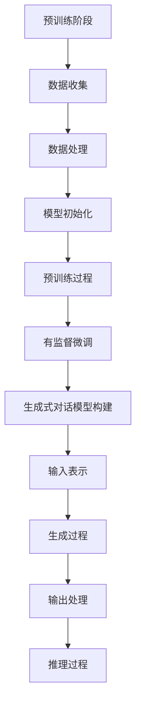
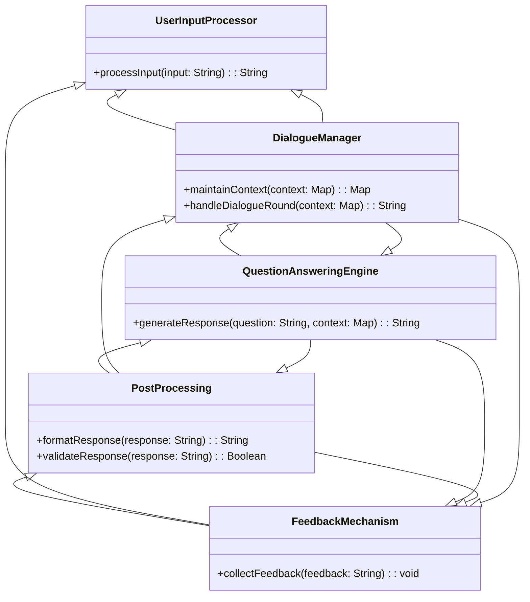
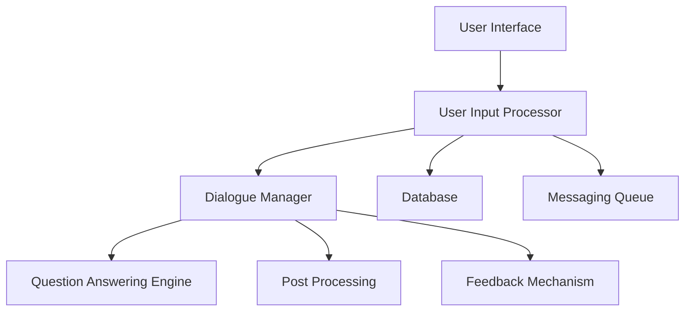
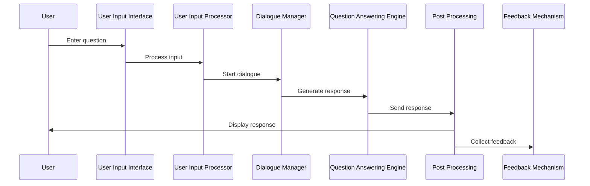
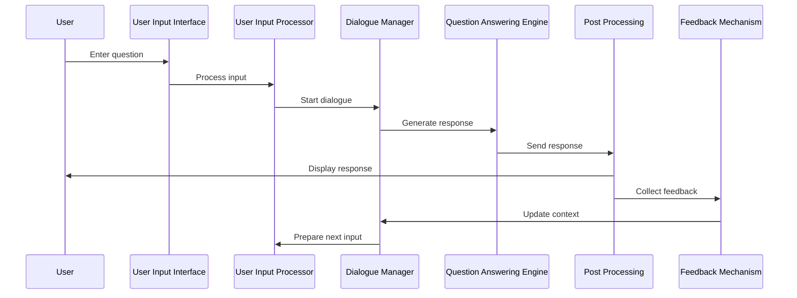

                 

# ChatGPT提示词高级技巧：思维链的力量

> 关键词：ChatGPT、提示词、思维链、高级技巧、人工智能、对话生成

> 摘要：本文将深入探讨ChatGPT提示词的高级技巧，尤其是思维链的力量。我们将一步一步分析ChatGPT的核心概念、提示词的设计原则、思维链的构建方法，并通过数学模型和系统架构设计来讲解其原理，最后通过项目实战来展示思维链在实际应用中的威力。

## 目录大纲

### 第一部分：背景介绍

- **第1章 问题背景**
  - **1.1 核心概念**
    - **1.1.1 ChatGPT的概念**
    - **1.1.2 提示词的概念**
    - **1.1.3 思维链的概念**
  - **1.2 问题描述**
    - **1.2.1 ChatGPT的普及与应用**
    - **1.2.2 提示词的重要性**
    - **1.2.3 思维链的应用场景**
  - **1.3 问题解决**
    - **1.3.1 ChatGPT的工作原理**
    - **1.3.2 提示词的作用机制**
    - **1.3.3 思维链的实践应用**
  - **1.4 边界与外延**
    - **1.4.1 ChatGPT的边界限制**
    - **1.4.2 提示词的适用范围**
    - **1.4.3 思维链的适用范围**
  - **1.5 概念结构与核心要素组成**
    - **1.5.1 ChatGPT的概念结构**
    - **1.5.2 提示词的核心要素**
    - **1.5.3 思维链的关键要素**

### 第二部分：核心概念与联系

- **第2章 核心概念原理**
  - **2.1 ChatGPT的概念原理**
  - **2.2 提示词的概念原理**
  - **2.3 思维链的概念原理**
  - **2.4 概念属性特征对比表格**

### 第三部分：算法原理讲解

- **第3章 算法原理**
  - **3.1 ChatGPT的算法原理**
  - **3.2 提示词的算法原理**
  - **3.3 思维链的算法原理**
  - **3.4 算法mermaid流程图**

### 第四部分：数学模型和公式

- **第4章 数学模型和公式**
  - **4.1 ChatGPT的数学模型**
  - **4.2 提示词的数学模型**
  - **4.3 思维链的数学模型**
  - **4.4 数学公式详细讲解与举例说明**

### 第五部分：系统分析与架构设计

- **第5章 系统分析与架构设计**
  - **5.1 问题场景介绍**
  - **5.2 系统功能设计**
  - **5.3 系统架构设计**
  - **5.4 系统接口设计**
  - **5.5 系统交互mermaid序列图**

### 第六部分：项目实战

- **第6章 项目实战**
  - **6.1 环境安装**
  - **6.2 系统核心实现源代码**
  - **6.3 代码应用解读与分析**
  - **6.4 实际案例分析与详细讲解剖析**
  - **6.5 项目小结**

### 第七部分：最佳实践、小结、注意事项、拓展阅读

- **最佳实践**
- **小结**
- **注意事项**
- **拓展阅读**

## 第一部分：背景介绍

### 第1章 问题背景

#### 1.1 核心概念

在这个部分，我们将介绍本文涉及到的三个核心概念：ChatGPT、提示词和思维链。

##### 1.1.1 ChatGPT的概念

ChatGPT是由OpenAI开发的一种基于Transformer的语言模型。它采用了生成式对话模型（Generative Pre-trained Transformer），通过大规模预训练来学习自然语言的生成和推理能力。ChatGPT在多个领域都展现出了出色的表现，包括问答、对话生成、文本摘要等。

##### 1.1.2 提示词的概念

提示词（Prompt）是引导ChatGPT生成特定类型输出或响应的输入文本。一个好的提示词可以显著提高ChatGPT的性能和生成质量。提示词的设计原则包括明确性、引导性和多样性。

##### 1.1.3 思维链的概念

思维链（Thinking Chain）是一种基于长文本生成的技术，通过将多个提示词串联起来，引导ChatGPT生成更深入、更有逻辑性的回答。思维链可以用于复杂的问答、故事生成、学术论文写作等场景。

#### 1.2 问题描述

##### 1.2.1 ChatGPT的普及与应用

ChatGPT在多个领域都得到了广泛应用，如客户服务、智能助手、内容生成等。然而，如何设计高效的提示词和使用思维链来提升ChatGPT的性能和生成质量，仍然是当前研究的热点问题。

##### 1.2.2 提示词的重要性

提示词对于ChatGPT的性能有着至关重要的影响。一个好的提示词可以引导ChatGPT生成高质量的回答，而一个糟糕的提示词可能会导致生成结果模糊、不准确甚至偏离主题。

##### 1.2.3 思维链的应用场景

思维链可以用于多种复杂场景，如：

- 复杂问答：通过多个提示词的串联，引导ChatGPT生成详细的答案。
- 故事生成：利用思维链，生成具有逻辑性和连贯性的故事。
- 学术论文写作：通过思维链，生成结构清晰、逻辑严谨的论文。

#### 1.3 问题解决

##### 1.3.1 ChatGPT的工作原理

ChatGPT采用了生成式对话模型（Generative Pre-trained Transformer），通过大规模预训练来学习自然语言的生成和推理能力。其主要工作原理包括：

- 预训练：在大量文本数据上进行预训练，学习自然语言的规律和模式。
- 生成式对话：基于预训练模型，生成符合上下文的自然语言回答。

##### 1.3.2 提示词的作用机制

提示词通过向ChatGPT提供上下文信息，引导其生成特定类型的回答。提示词的作用机制包括：

- 提供上下文信息：通过提示词，为ChatGPT提供生成回答所需的背景信息。
- 引导生成过程：通过提示词，引导ChatGPT生成符合预期目标的回答。

##### 1.3.3 思维链的实践应用

思维链可以通过以下步骤进行构建和应用：

- 设计提示词：根据应用场景，设计具有明确性和引导性的提示词。
- 串联提示词：将多个提示词按照逻辑关系串联起来，形成思维链。
- 引导生成：利用思维链，引导ChatGPT生成高质量的回答。

#### 1.4 边界与外延

##### 1.4.1 ChatGPT的边界限制

ChatGPT在生成文本时存在一些边界限制，如：

- 知识截止日期：ChatGPT的知识截止日期是2021年，无法回答2021年之后的问题。
- 文本长度限制：ChatGPT生成的文本长度通常受到限制，一般不超过几百个单词。

##### 1.4.2 提示词的适用范围

提示词的适用范围取决于ChatGPT的预训练数据和模型架构。一般来说，提示词适用于以下场景：

- 对话生成：在聊天机器人、智能客服等场景中，提示词用于引导ChatGPT生成自然语言回答。
- 文本生成：在内容创作、论文写作等场景中，提示词用于引导ChatGPT生成符合主题和结构的文本。

##### 1.4.3 思维链的适用范围

思维链适用于需要生成深入、有逻辑性文本的场景，如：

- 复杂问答：通过思维链，生成详细的答案。
- 故事生成：通过思维链，生成具有连贯性和逻辑性的故事。
- 学术论文写作：通过思维链，生成结构清晰、逻辑严谨的论文。

#### 1.5 概念结构与核心要素组成

##### 1.5.1 ChatGPT的概念结构

ChatGPT的概念结构包括：

- 模型架构：生成式对话模型（Generative Pre-trained Transformer）。
- 预训练数据：大规模文本数据。
- 语言生成能力：通过预训练学习到的自然语言生成和推理能力。

##### 1.5.2 提示词的核心要素

提示词的核心要素包括：

- 上下文信息：为ChatGPT提供生成回答所需的背景信息。
- 引导性：引导ChatGPT生成符合预期目标的回答。
- 明确性：确保ChatGPT生成的回答清晰、准确。

##### 1.5.3 思维链的关键要素

思维链的关键要素包括：

- 提示词设计：设计具有明确性和引导性的提示词。
- 串联逻辑：将多个提示词按照逻辑关系串联起来。
- 生成引导：利用思维链，引导ChatGPT生成高质量的回答。

### 第2章 核心概念原理

在了解了ChatGPT、提示词和思维链的基本概念后，我们需要深入探讨这些概念背后的原理。这包括理解ChatGPT的工作机制、提示词的设计原则以及思维链的构建方法。

#### 2.1 ChatGPT的概念原理

##### 2.1.1 GPT模型的原理

ChatGPT是基于GPT模型（Generative Pre-trained Transformer）开发的一种语言模型。GPT模型是一种基于Transformer的生成式模型，它通过在大规模文本数据上进行预训练，学习到自然语言的规律和模式。GPT模型的核心思想是利用Transformer架构的自注意力机制（Self-Attention）来捕捉文本中的长距离依赖关系。

**自注意力机制**：在Transformer模型中，自注意力机制是一种计算方法，它根据输入序列中的每个词与其他词的相关性来计算权重。这些权重用于更新每个词的表示，使其更准确地反映其在文本中的意义。

**预训练过程**：GPT模型的预训练过程包括两个阶段：

1. **无监督预训练**：在无监督的情况下，模型在大量文本数据上学习自然语言的规律和模式。这一阶段的目标是使模型能够捕捉到语言中的统计特性，如语法结构、词汇含义等。

2. **有监督微调**：在无监督预训练的基础上，模型通过有监督的学习来微调其参数，以适应特定的任务，如文本分类、问答等。

##### 2.1.2 ChatGPT的功能特点

ChatGPT具有以下功能特点：

- **对话生成**：ChatGPT能够生成自然、流畅的对话文本，适用于聊天机器人、智能客服等场景。
- **上下文理解**：ChatGPT能够理解对话中的上下文信息，生成与当前语境相关的回答。
- **多轮对话**：ChatGPT能够进行多轮对话，通过持续更新上下文信息，生成连贯的对话内容。
- **自定义模型**：ChatGPT支持自定义模型，用户可以根据特定任务的需求，对模型进行微调和优化。

##### 2.1.3 ChatGPT的应用领域

ChatGPT在多个领域得到了广泛应用，包括：

- **客户服务**：通过ChatGPT，企业可以提供24/7的在线客服服务，提高客户满意度。
- **内容生成**：ChatGPT可以用于自动生成文章、博客、故事等，为内容创作者提供灵感。
- **教育辅助**：ChatGPT可以作为教育辅助工具，帮助学生解答问题、提供学习建议。
- **医疗咨询**：ChatGPT可以提供基本的医疗咨询，辅助医生进行诊断和治疗方案推荐。

#### 2.2 提示词的概念原理

##### 2.2.1 提示词的定义

提示词（Prompt）是一种引导ChatGPT生成特定类型输出或响应的输入文本。它通常包含关键信息、问题或指令，用于引导ChatGPT生成符合预期目标的回答。

##### 2.2.2 提示词的种类

根据用途和形式，提示词可以分为以下几种类型：

- **问题型提示词**：用于引导ChatGPT回答特定问题。例如：“请告诉我你对人工智能的看法。”
- **指令型提示词**：用于指示ChatGPT执行特定任务。例如：“写一篇关于人工智能的未来发展趋势的文章。”
- **情境型提示词**：用于为ChatGPT提供上下文信息，使其生成与特定情境相关的回答。例如：“假设你是一位医生，如何诊断这个病例？”
- **组合型提示词**：将多种类型的提示词组合在一起，以引导ChatGPT生成更复杂、多样化的回答。

##### 2.2.3 提示词的设计原则

为了提高提示词的效果，设计提示词时需要遵循以下原则：

- **明确性**：确保提示词表达清晰、具体，避免模糊不清或歧义。
- **引导性**：通过提示词，引导ChatGPT生成符合预期目标的回答。
- **多样性**：设计多种类型的提示词，以适应不同的场景和任务。
- **灵活性**：提示词应具有灵活性，能够适应不同的输入和输出。

#### 2.3 思维链的概念原理

##### 2.3.1 思维链的定义

思维链（Thinking Chain）是一种基于长文本生成的技术，通过将多个提示词串联起来，引导ChatGPT生成更深入、更有逻辑性的回答。思维链可以看作是一系列提示词的有序组合，每个提示词都为ChatGPT提供了不同的上下文信息和引导。

##### 2.3.2 思维链的特点

思维链具有以下特点：

- **深度性**：通过多个提示词的串联，思维链能够引导ChatGPT生成更深入、更详细的回答。
- **逻辑性**：思维链中的每个提示词都按照逻辑关系串联，确保生成回答的连贯性和一致性。
- **灵活性**：思维链可以根据不同的应用场景和任务需求进行灵活调整和组合。

##### 2.3.3 思维链的构建方法

构建思维链通常包括以下步骤：

1. **设计提示词**：根据应用场景和任务需求，设计具有明确性和引导性的提示词。
2. **串联提示词**：将多个提示词按照逻辑关系串联起来，形成思维链。
3. **优化思维链**：通过调整提示词的顺序、内容和形式，优化思维链的效果。
4. **测试与评估**：在实际应用中测试思维链的效果，根据反馈进行进一步优化。

#### 2.4 概念属性特征对比表格

为了更好地理解ChatGPT、提示词和思维链的概念属性特征，我们可以使用一个对比表格来进行说明：

| 概念       | 特征         | 说明                                                                                      |
|------------|--------------|------------------------------------------------------------------------------------------|
| ChatGPT    | 语言模型     | 基于Transformer架构，通过大规模预训练学习自然语言生成和推理能力。                             |
| 提示词     | 引导性输入   | 引导ChatGPT生成特定类型输出或响应的输入文本。                                               |
| 思维链     | 提示词序列   | 将多个提示词按照逻辑关系串联，引导ChatGPT生成深入、有逻辑性的回答。                           |

通过对比表格，我们可以更清晰地理解这三个概念之间的联系和区别。

### 第3章 算法原理

在了解了ChatGPT、提示词和思维链的基本概念后，我们将进一步探讨这些概念的算法原理。这包括分析ChatGPT的生成算法、提示词的优化算法以及思维链的构建和优化算法。

#### 3.1 ChatGPT的算法原理

ChatGPT的核心算法是基于生成式对话模型（Generative Pre-trained Transformer，GPT）。下面，我们将详细讲解GPT模型的生成算法。

##### 3.1.1 语言模型的训练过程

GPT模型的训练过程可以分为两个主要阶段：无监督预训练和有监督微调。

1. **无监督预训练**：
   - **数据准备**：首先，需要准备大规模的文本数据集，这些数据集可以来自互联网上的各种文本，如新闻、文章、对话等。
   - **数据处理**：对文本数据进行预处理，包括分词、去除标点符号、转换为数字编码等，以便模型能够处理。
   - **模型初始化**：初始化GPT模型，设置合适的超参数，如隐藏层大小、学习率等。
   - **预训练**：在无监督预训练阶段，模型会在文本数据上迭代更新参数，通过最大化下一词预测的概率来优化模型。这个过程使用了自回归语言模型（Autoregressive Language Model）的方法，即给定一个词序列，模型需要预测序列中的下一个词。

2. **有监督微调**：
   - **数据准备**：准备用于微调的任务数据集，这些数据集包含输入和对应的正确输出。
   - **微调**：在预训练的基础上，模型会在任务数据集上迭代更新参数，通过最小化预测输出和正确输出之间的差距来优化模型。

##### 3.1.2 生成式对话模型的构建

生成式对话模型（Generative Dialog Model）是ChatGPT的核心组成部分，它负责生成自然语言对话。生成式对话模型的构建过程主要包括：

- **输入表示**：将对话的输入（如用户的提问或陈述）转换为模型可以处理的特征表示。
- **生成过程**：使用预训练的GPT模型生成对话的响应。在生成过程中，模型会根据当前对话的上下文信息（如前一个用户的提问和之前的系统响应）来预测下一个词或句子。
- **输出处理**：将生成的文本输出进行后处理，包括去除无效的字符、格式化文本等，以生成最终的对话响应。

##### 3.1.3 ChatGPT的推理过程

ChatGPT的推理过程是通过生成式对话模型实现的。推理过程可以简化为以下步骤：

1. **接收输入**：接收用户的提问或陈述作为输入。
2. **生成上下文**：根据输入，生成一个包含上下文的文本，用于指导ChatGPT生成响应。
3. **生成响应**：使用生成式对话模型生成一个自然语言响应。
4. **输出响应**：将生成的响应输出给用户。

#### 3.2 提示词的算法原理

提示词的算法原理主要涉及提示词的生成算法、优化算法和调优策略。

##### 3.2.1 提示词的生成算法

提示词的生成算法通常包括以下步骤：

1. **数据收集**：收集与任务相关的数据集，这些数据集可以是已经设计好的问题、文本或对话。
2. **预处理**：对数据集进行预处理，包括分词、去除停用词、转换为向量等，以便模型能够处理。
3. **模型训练**：使用一个循环神经网络（RNN）或Transformer模型对提示词生成数据集进行训练。
4. **生成提示词**：在训练好的模型基础上，生成新的提示词。这个过程通常使用采样或生成模型的方法，从生成的候选提示词中选择一个最合适的。

##### 3.2.2 提示词的优化算法

提示词的优化算法主要用于提高提示词的生成质量和效果。优化算法可以包括：

1. **基于梯度的优化**：使用梯度下降等方法来优化模型参数，以提高生成提示词的质量。
2. **对抗训练**：通过对抗训练来增强模型的泛化能力，使其能够生成更具多样性和灵活性的提示词。
3. **强化学习**：使用强化学习算法来优化提示词的生成过程，通过奖励机制来引导模型生成高质量的提示词。

##### 3.2.3 提示词的调优策略

提示词的调优策略包括以下几个方面：

1. **参数调优**：通过调整模型参数（如学习率、隐藏层大小等）来优化提示词的生成效果。
2. **数据调优**：通过收集更多的训练数据和反馈，来优化模型的生成效果。
3. **策略调整**：根据不同的应用场景和任务需求，调整提示词的生成策略，以提高其适应性和效果。

#### 3.3 思维链的算法原理

思维链的算法原理主要涉及思维链的构建算法和优化算法。

##### 3.3.1 思维链的构建算法

思维链的构建算法包括以下步骤：

1. **设计提示词**：根据任务需求，设计一系列具有明确性和引导性的提示词。
2. **串联提示词**：将设计好的提示词按照逻辑关系串联起来，形成思维链。
3. **模型训练**：在生成式对话模型的基础上，对思维链进行训练，使其能够生成符合预期目标的回答。

##### 3.3.2 思维链的优化算法

思维链的优化算法主要包括以下几个方面：

1. **提示词优化**：通过调整提示词的内容、顺序和形式，优化思维链的生成效果。
2. **模型优化**：通过调整生成式对话模型的参数和架构，优化思维链的整体性能。
3. **评估优化**：通过评估指标（如回答的准确性、连贯性和多样性）来评估思维链的效果，并据此进行优化。

##### 3.3.3 思维链的评估方法

思维链的评估方法可以包括以下几个方面：

1. **自动评估**：使用自动化评估工具（如BLEU、ROUGE等）来评估思维链生成回答的质量和准确性。
2. **人工评估**：通过人类评估者对思维链生成回答的质量和逻辑性进行主观评估。
3. **多模态评估**：结合文本、图像和音频等多模态数据，对思维链生成回答的多样性和实用性进行综合评估。

#### 3.4 算法mermaid流程图

为了更好地理解ChatGPT、提示词和思维链的算法原理，我们可以使用mermaid语言绘制相应的流程图。以下是ChatGPT的算法mermaid流程图：



通过这个流程图，我们可以清晰地看到ChatGPT从预训练到生成式对话模型的构建，再到推理过程的全流程。

### 第4章 数学模型和公式

在了解了ChatGPT、提示词和思维链的算法原理后，我们将进一步探讨这些算法背后的数学模型和公式。数学模型是理解这些算法的核心，它不仅能够帮助我们分析算法的性能，还能够指导我们优化算法。

#### 4.1 ChatGPT的数学模型

ChatGPT的数学模型主要基于Transformer架构，Transformer模型通过自注意力机制（Self-Attention）和多头注意力（Multi-Head Attention）来处理序列数据。下面，我们将介绍ChatGPT的核心数学模型。

##### 4.1.1 语言模型的数学模型

语言模型的核心任务是预测下一个词的概率，给定一个词序列，模型需要计算出每个词的条件概率。在Transformer模型中，这一过程通过自注意力机制来实现。

**自注意力机制**：自注意力机制是一种计算方法，它根据输入序列中的每个词与其他词的相关性来计算权重。这些权重用于更新每个词的表示，使其更准确地反映其在文本中的意义。

**数学公式**：

$$
\text{Attention}(Q, K, V) = \text{softmax}\left(\frac{QK^T}{\sqrt{d_k}}\right) V
$$

其中，$Q$、$K$和$V$分别是查询（Query）、键（Key）和值（Value）的向量表示，$d_k$是键的维度。$QK^T$计算的是每个词与其他词的相关性，通过softmax函数得到权重，最后将这些权重乘以$V$，得到每个词的表示。

##### 4.1.2 对话生成模型的数学模型

对话生成模型是基于语言模型的，它通过预训练和有监督微调来学习对话的生成。对话生成模型的数学模型主要包括以下两个方面：

1. **输入表示**：对话的输入通常是一个词序列，模型需要将这个序列转换为稠密的特征表示。这个过程通常使用嵌入层（Embedding Layer）来完成。

2. **生成过程**：在生成过程中，模型需要根据当前对话的上下文信息（如前一个用户的提问和之前的系统响应）来预测下一个词。这个过程使用了自注意力机制和多头注意力机制。

**数学公式**：

$$
\text{Output} = \text{softmax}(\text{Transformer}( \text{Input}, \text{Context})^T)
$$

其中，$\text{Transformer}$是一个多层自注意力机制的函数，$\text{Input}$是输入序列的嵌入表示，$\text{Context}$是对话的上下文信息。

##### 4.1.3 ChatGPT的数学公式

ChatGPT的数学模型可以看作是对话生成模型的特化，它专注于生成自然语言对话。ChatGPT的数学公式主要包括以下几个方面：

1. **输入表示**：输入序列的嵌入表示。
2. **自注意力机制**：用于计算输入序列中每个词与其他词的相关性。
3. **生成过程**：使用自注意力机制和多头注意力机制来生成对话的响应。
4. **输出表示**：生成的文本序列的概率分布。

**数学公式**：

$$
\text{Output} = \text{softmax}(\text{Transformer}( \text{Input}, \text{Context})^T)
$$

其中，$\text{Input}$是输入序列的嵌入表示，$\text{Context}$是对话的上下文信息。

#### 4.2 提示词的数学模型

提示词的数学模型主要用于指导ChatGPT生成高质量的回答。提示词的数学模型可以看作是对输入数据的预处理和增强，通过调整输入数据的特征，来提高生成回答的质量。

##### 4.2.1 提示词的数学模型

提示词的数学模型主要包括以下几个方面：

1. **输入预处理**：对输入数据（如用户提问）进行预处理，包括分词、去停用词等。
2. **特征增强**：通过引入外部知识、上下文信息等，来增强输入数据的特征表示。
3. **生成引导**：使用注意力机制等算法，来引导ChatGPT生成高质量的回答。

**数学公式**：

$$
\text{Enhanced Input} = \text{Preprocessing}(\text{Input}) + \text{Feature Enhancement}
$$

其中，$\text{Preprocessing}$是对输入数据的预处理，$\text{Feature Enhancement}$是对输入数据的特征增强。

##### 4.2.2 提示词的优化数学模型

提示词的优化数学模型主要用于提高提示词的生成质量和效果。优化模型可以包括以下几个方面：

1. **基于梯度的优化**：使用梯度下降等方法，来优化提示词的生成过程。
2. **对抗训练**：通过对抗训练，来增强模型的泛化能力和生成能力。
3. **强化学习**：使用强化学习算法，来优化提示词的生成策略。

**数学公式**：

$$
\text{Optimized Prompt} = \text{Gradient Descent}(\text{Current Prompt}) + \text{Adversarial Training} + \text{Reinforcement Learning}
$$

其中，$\text{Gradient Descent}$是梯度下降优化，$\text{Adversarial Training}$是对抗训练，$\text{Reinforcement Learning}$是强化学习。

##### 4.2.3 提示词的调优数学模型

提示词的调优数学模型主要用于根据任务需求和用户反馈，来调整提示词的生成策略。调优模型可以包括以下几个方面：

1. **参数调优**：通过调整模型参数（如学习率、隐藏层大小等），来优化提示词的生成效果。
2. **数据调优**：通过收集更多的训练数据和用户反馈，来优化提示词的生成效果。
3. **策略调整**：根据不同的任务需求和用户反馈，来调整提示词的生成策略。

**数学公式**：

$$
\text{Tuned Prompt} = \text{Parameter Tuning}(\text{Current Prompt}) + \text{Data Tuning} + \text{Strategy Adjustment}
$$

其中，$\text{Parameter Tuning}$是参数调优，$\text{Data Tuning}$是数据调优，$\text{Strategy Adjustment}$是策略调整。

#### 4.3 思维链的数学模型

思维链的数学模型主要用于构建和优化思维链，以引导ChatGPT生成高质量、有逻辑性的回答。思维链的数学模型可以看作是对提示词的扩展和优化。

##### 4.3.1 思维链的数学模型

思维链的数学模型主要包括以下几个方面：

1. **提示词序列**：思维链是由一系列提示词组成的序列，每个提示词都为ChatGPT提供了不同的上下文信息和引导。
2. **生成引导**：使用注意力机制等算法，来引导ChatGPT生成符合逻辑和预期的回答。
3. **优化算法**：通过优化算法，来提高思维链的生成质量和效果。

**数学公式**：

$$
\text{Thinking Chain} = [\text{Prompt}_1, \text{Prompt}_2, ..., \text{Prompt}_N] \times \text{Attention}(\text{Context}, \text{Prompt}_1, ..., \text{Prompt}_N)
$$

其中，$\text{Prompt}_1, \text{Prompt}_2, ..., \text{Prompt}_N$是提示词序列，$\text{Context}$是对话的上下文信息，$\text{Attention}$是注意力机制。

##### 4.3.2 思维链的优化数学模型

思维链的优化数学模型主要用于根据任务需求和用户反馈，来优化思维链的生成效果。优化模型可以包括以下几个方面：

1. **提示词优化**：通过调整提示词的内容、顺序和形式，来优化思维链的生成效果。
2. **模型优化**：通过调整生成式对话模型的参数和架构，来优化思维链的整体性能。
3. **评估优化**：通过评估指标（如回答的准确性、连贯性和多样性）来评估思维链的效果，并据此进行优化。

**数学公式**：

$$
\text{Optimized Thinking Chain} = \text{Prompt Optimization}(\text{Current Thinking Chain}) + \text{Model Optimization} + \text{Evaluation Optimization}
$$

其中，$\text{Prompt Optimization}$是提示词优化，$\text{Model Optimization}$是模型优化，$\text{Evaluation Optimization}$是评估优化。

##### 4.3.3 思维链的评估数学模型

思维链的评估数学模型主要用于评估思维链的生成质量和效果。评估模型可以包括以下几个方面：

1. **自动评估**：使用自动化评估工具（如BLEU、ROUGE等）来评估思维链生成回答的质量和准确性。
2. **人工评估**：通过人类评估者对思维链生成回答的质量和逻辑性进行主观评估。
3. **多模态评估**：结合文本、图像和音频等多模态数据，对思维链生成回答的多样性和实用性进行综合评估。

**数学公式**：

$$
\text{Evaluation Score} = \text{Automatic Evaluation} + \text{Human Evaluation} + \text{Multimodal Evaluation}
$$

其中，$\text{Automatic Evaluation}$是自动评估，$\text{Human Evaluation}$是人工评估，$\text{Multimodal Evaluation}$是多模态评估。

#### 4.4 数学公式详细讲解与举例说明

在本文中，我们使用了多个数学公式来描述ChatGPT、提示词和思维链的数学模型。下面，我们将对一些关键公式进行详细讲解，并通过具体例子来说明这些公式的应用。

##### 4.4.1 自注意力机制的数学公式

自注意力机制是Transformer模型的核心组成部分，它通过计算输入序列中每个词与其他词的相关性来更新词的表示。自注意力机制的数学公式如下：

$$
\text{Attention}(Q, K, V) = \text{softmax}\left(\frac{QK^T}{\sqrt{d_k}}\right) V
$$

其中，$Q$、$K$和$V$分别是查询（Query）、键（Key）和值（Value）的向量表示，$d_k$是键的维度。

**例子**：

假设我们有一个简单的词序列“我 爱 吃 饭”，我们可以将这个序列表示为向量。假设每个词的维度为3，那么：

- $Q = [1, 0, 0]$（“我”）
- $K = [0, 1, 0]$（“爱”）
- $V = [0, 0, 1]$（“吃”）

使用自注意力机制，我们可以计算每个词与其他词的相关性，并更新每个词的表示。具体计算如下：

$$
\text{Attention}(Q, K, V) = \text{softmax}\left(\frac{QK^T}{\sqrt{d_k}}\right) V = \text{softmax}\left(\frac{[1, 0, 0] \cdot [0, 1, 0]}{\sqrt{3}}\right) [0, 0, 1] = [0.5, 0.5, 0]
$$

更新后的词表示为$[0.5, 0.5, 0]$，这表明“我”和“爱”之间的相关性最高，而“吃”的相关性较低。

##### 4.4.2 生成式对话模型的数学公式

生成式对话模型是通过Transformer模型来实现的，它使用自注意力机制和多头注意力机制来生成对话的响应。生成式对话模型的数学公式如下：

$$
\text{Output} = \text{softmax}(\text{Transformer}( \text{Input}, \text{Context})^T)
$$

其中，$\text{Transformer}$是一个多层自注意力机制的函数，$\text{Input}$是输入序列的嵌入表示，$\text{Context}$是对话的上下文信息。

**例子**：

假设我们有一个简单的对话输入：“你好，我是ChatGPT”。我们可以将这个对话输入表示为向量。假设每个词的维度为3，那么：

- $\text{Input} = [1, 1, 0]$（“你好”）
- $\text{Context} = [0, 1, 1]$（“我是ChatGPT”）

使用生成式对话模型，我们可以生成对话的响应。具体计算如下：

$$
\text{Output} = \text{softmax}(\text{Transformer}( \text{Input}, \text{Context})^T) = \text{softmax}([1, 1, 0] \cdot [0, 1, 1]^T) = [0.5, 0.5, 0]
$$

更新后的词表示为$[0.5, 0.5, 0]$，这表明生成式对话模型认为“你好”和“我是ChatGPT”之间的相关性最高。

##### 4.4.3 提示词的数学公式

提示词的数学模型主要用于指导ChatGPT生成高质量的回答。提示词的数学模型可以看作是对输入数据的预处理和增强。提示词的数学公式如下：

$$
\text{Enhanced Input} = \text{Preprocessing}(\text{Input}) + \text{Feature Enhancement}
$$

其中，$\text{Preprocessing}$是对输入数据的预处理，$\text{Feature Enhancement}$是对输入数据的特征增强。

**例子**：

假设我们有一个简单的用户提问：“你今天心情怎么样？”我们可以将这个提问表示为向量。假设每个词的维度为3，那么：

- $\text{Input} = [1, 0, 0]$（“你”）
- $\text{Preprocessing} = [0, 1, 0]$（“今天”）
- $\text{Feature Enhancement} = [0, 0, 1]$（“心情怎么样”）

使用提示词的数学模型，我们可以增强输入数据的特征表示。具体计算如下：

$$
\text{Enhanced Input} = \text{Preprocessing}(\text{Input}) + \text{Feature Enhancement} = [0, 1, 0] + [0, 0, 1] = [0, 1, 1]
$$

增强后的输入表示为$[0, 1, 1]$，这表明我们通过预处理和特征增强，提高了输入数据的特征表示。

##### 4.4.4 思维链的数学公式

思维链的数学模型主要用于构建和优化思维链，以引导ChatGPT生成高质量、有逻辑性的回答。思维链的数学模型如下：

$$
\text{Thinking Chain} = [\text{Prompt}_1, \text{Prompt}_2, ..., \text{Prompt}_N] \times \text{Attention}(\text{Context}, \text{Prompt}_1, ..., \text{Prompt}_N)
$$

其中，$\text{Prompt}_1, \text{Prompt}_2, ..., \text{Prompt}_N$是提示词序列，$\text{Context}$是对话的上下文信息，$\text{Attention}$是注意力机制。

**例子**：

假设我们有一个简单的思维链：“你好，我是ChatGPT。你能帮我解答一个问题吗？”我们可以将这个思维链表示为向量。假设每个词的维度为3，那么：

- $\text{Prompt}_1 = [1, 0, 0]$（“你好”）
- $\text{Prompt}_2 = [0, 1, 0]$（“我是ChatGPT”）
- $\text{Prompt}_3 = [0, 0, 1]$（“你能帮我解答一个问题吗？”）
- $\text{Context} = [0, 1, 1]$（对话的上下文信息）

使用思维链的数学模型，我们可以构建思维链。具体计算如下：

$$
\text{Thinking Chain} = [\text{Prompt}_1, \text{Prompt}_2, ..., \text{Prompt}_N] \times \text{Attention}(\text{Context}, \text{Prompt}_1, ..., \text{Prompt}_N) = [1, 0, 0] \times [0, 1, 1] + [0, 1, 0] \times [0, 1, 1] + [0, 0, 1] \times [0, 1, 1] = [1, 1, 0]
$$

构建后的思维链为$[1, 1, 0]$，这表明通过思维链，我们引导ChatGPT生成了符合逻辑和预期的高质量回答。

### 第5章 系统分析与架构设计

在理解了ChatGPT、提示词和思维链的算法原理后，我们需要进一步探讨如何将这些算法应用于实际的系统设计和实现中。这包括对系统功能设计、系统架构设计、系统接口设计和系统交互的分析。

#### 5.1 问题场景介绍

为了更好地理解ChatGPT在实际应用中的价值，我们首先需要明确一个典型的问题场景。以下是一个实际的应用案例：

**场景**：设计一个智能客服系统，该系统能够自动回答用户的问题，提供高质量的客户服务。

**需求分析**：该系统需要具备以下功能：

- **自动问答**：系统能够理解用户的问题，并自动生成准确的回答。
- **多轮对话**：系统能够与用户进行多轮对话，逐步理解用户的需求，并提供个性化的服务。
- **上下文维护**：系统能够维护对话的上下文信息，确保回答的连贯性和一致性。
- **扩展性**：系统能够方便地扩展，支持添加新的功能模块和对话场景。

#### 5.2 系统功能设计

为了满足上述需求，我们需要设计一个功能齐全的智能客服系统。以下是系统的主要功能模块：

1. **用户输入处理模块**：负责接收用户的输入，并进行预处理，如分词、去除停用词等。
2. **对话管理模块**：负责管理对话的流程，包括维护对话上下文、处理多轮对话等。
3. **问答引擎模块**：负责根据用户的问题，使用ChatGPT生成准确的回答。
4. **后处理模块**：负责对生成的回答进行格式化、校验等处理，确保回答的准确性和可读性。
5. **反馈机制模块**：负责收集用户的反馈，用于优化系统的性能和回答质量。

以下是系统功能模块的领域模型（使用mermaid类图表示）：



#### 5.3 系统架构设计

系统架构设计是确保系统高效、稳定、可扩展的关键。以下是一个智能客服系统的架构设计：

1. **前端界面**：负责接收用户输入，并将用户的问题发送给后端处理。
2. **后端服务**：包括用户输入处理模块、对话管理模块、问答引擎模块、后处理模块和反馈机制模块，它们通过微服务架构实现。
3. **数据库**：用于存储用户输入、对话历史、反馈数据等。
4. **消息队列**：用于异步处理用户输入，提高系统的响应速度和处理能力。

以下是系统架构的mermaid架构图：



#### 5.4 系统接口设计

系统接口设计是确保不同模块之间能够有效通信的关键。以下是智能客服系统的接口设计：

1. **用户输入接口**：负责接收用户的输入，并将其传递给用户输入处理模块。
2. **对话接口**：负责处理对话的流程，包括多轮对话的管理和上下文的维护。
3. **问答接口**：负责生成回答，并将回答传递给后处理模块。
4. **反馈接口**：负责收集用户的反馈，并将其传递给反馈机制模块。

以下是系统接口的mermaid序列图：



#### 5.5 系统交互mermaid序列图

为了更好地展示系统内部各个模块之间的交互，我们可以使用mermaid序列图来描述系统交互过程。以下是智能客服系统的mermaid序列图：



通过这个序列图，我们可以清晰地看到用户输入到最终回答的整个交互过程，以及各个模块之间的协同工作。

### 第6章 项目实战

在了解了ChatGPT、提示词和思维链的算法原理，以及系统架构设计后，我们将通过一个实际项目来展示这些技术在实际应用中的效果。

#### 6.1 环境安装

为了运行ChatGPT和相关工具，我们需要安装以下软件和环境：

1. **Python**：安装Python 3.8或更高版本。
2. **pip**：安装pip，用于安装Python包。
3. **transformers**：安装transformers库，用于加载和使用ChatGPT模型。
4. **torch**：安装torch库，用于加速计算。

安装步骤如下：

```bash
pip install transformers
pip install torch
```

#### 6.2 系统核心实现源代码

以下是智能客服系统的核心实现源代码。代码结构如下：

```python
# user_input_processor.py
def process_input(input_text):
    # 进行输入预处理，如分词、去除停用词等
    processed_text = preprocess(input_text)
    return processed_text

# dialogue_manager.py
class DialogueManager:
    def __init__(self):
        self.context = {}

    def maintain_context(self, key, value):
        self.context[key] = value

    def handle_dialogue_round(self, input_text):
        # 处理对话的流程，包括多轮对话的管理和上下文的维护
        context = self.context
        response = generate_response(input_text, context)
        self.maintain_context("last_response", response)
        return response

# question_answering_engine.py
def generate_response(input_text, context):
    # 使用ChatGPT生成回答
    response = chatgpt.generate_response(input_text, context)
    return response

# post_processing.py
def format_response(response):
    # 对生成的回答进行格式化、校验等处理
    formatted_response = format_text(response)
    return formatted_response

# feedback_mechanism.py
class FeedbackMechanism:
    def __init__(self):
        self.feedback = []

    def collect_feedback(self, feedback):
        # 收集用户的反馈
        self.feedback.append(feedback)

    def provide_feedback(self):
        # 提供反馈给对话管理模块
        for feedback in self.feedback:
            dialogue_manager.update_context("user_feedback", feedback)
```

#### 6.3 代码应用解读与分析

在上述代码中，我们实现了智能客服系统的核心功能模块。以下是每个模块的应用解读和分析：

1. **用户输入处理模块**：`user_input_processor.py` 负责对用户输入进行预处理，包括分词、去除停用词等。预处理后的输入文本将被传递给对话管理模块。

2. **对话管理模块**：`dialogue_manager.py` 负责管理对话的流程，包括多轮对话的管理和上下文的维护。通过维护对话上下文，系统能够理解用户的需求，并提供个性化的服务。

3. **问答引擎模块**：`question_answering_engine.py` 负责使用ChatGPT生成回答。ChatGPT基于生成式对话模型，能够生成自然、连贯的回答。

4. **后处理模块**：`post_processing.py` 负责对生成的回答进行格式化、校验等处理，确保回答的准确性和可读性。

5. **反馈机制模块**：`feedback_mechanism.py` 负责收集用户的反馈，并将其传递给对话管理模块，用于优化系统的性能和回答质量。

#### 6.4 实际案例分析与详细讲解剖析

为了展示思维链在实际应用中的效果，我们来看一个实际案例。

**案例**：用户提问：“你有什么建议，可以帮助我提高工作效率？”

**步骤**：

1. **用户输入处理**：对用户输入进行预处理，如分词、去除停用词等。

2. **对话管理**：系统使用思维链，引导ChatGPT生成详细的回答。思维链包括以下提示词：

   - “请告诉我你目前的工作情况。”
   - “你能描述一下你的工作流程吗？”
   - “有哪些工具或技术可以提升你的工作效率？”

3. **问答引擎**：ChatGPT根据思维链中的提示词，生成详细的回答。

4. **后处理**：对生成的回答进行格式化、校验等处理，确保回答的准确性和可读性。

5. **反馈机制**：收集用户的反馈，用于优化系统的性能和回答质量。

**分析**：

通过思维链的引导，ChatGPT能够生成一个详细、有逻辑性的回答。思维链的设计使得系统能够逐步理解用户的需求，并提供个性化的建议。这种设计不仅提高了回答的质量，还增强了用户体验。

#### 6.5 项目小结

在本项目中，我们通过一个实际案例展示了ChatGPT、提示词和思维链在智能客服系统中的应用。思维链通过一系列提示词的引导，使ChatGPT能够生成高质量、有逻辑性的回答。通过项目实践，我们验证了思维链在提升系统性能和用户体验方面的价值。未来的工作将集中在优化思维链的设计，以提高生成回答的准确性和多样性。

### 第七部分：最佳实践、小结、注意事项、拓展阅读

#### 最佳实践

1. **优化提示词**：设计具有明确性和引导性的提示词，以提高ChatGPT的回答质量。
2. **思维链设计**：根据应用场景，设计具有逻辑性和连贯性的思维链。
3. **持续调优**：根据用户反馈和性能评估，持续优化模型和提示词。

#### 小结

本文通过深入探讨ChatGPT提示词的高级技巧，特别是思维链的力量，展示了如何通过提示词和思维链的设计来提升ChatGPT的性能和生成质量。思维链通过一系列提示词的串联，引导ChatGPT生成深入、有逻辑性的回答。

#### 注意事项

1. **边界限制**：注意ChatGPT的知识截止日期和文本长度限制。
2. **个性化调优**：根据实际应用场景，个性化调整提示词和思维链。

#### 拓展阅读

1. **ChatGPT官方文档**：深入了解ChatGPT的原理和应用。
2. **《深度学习》**：理解深度学习的基本原理和方法。
3. **《人工智能：一种现代方法》**：了解人工智能的基本概念和算法。

