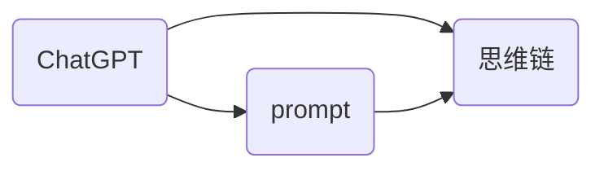
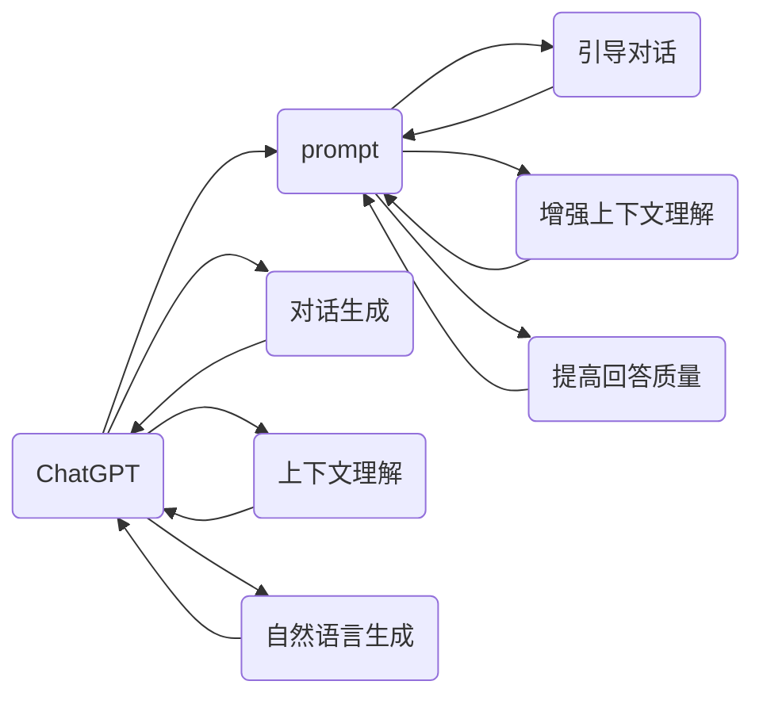
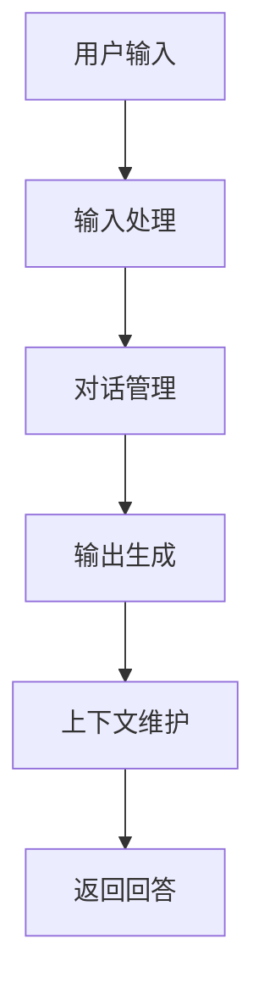

                 

### ChatGPT高级prompt：思维链的艺术

#### 关键词

- ChatGPT
- Prompt技术
- 思维链
- 对话系统
- 自然语言处理
- 人工智能

#### 摘要

本文将深入探讨ChatGPT高级prompt技术的核心概念、工作原理、设计方法及其在思维链构建中的应用。通过详细分析思维链的构建、优化和应用，我们旨在揭示如何利用高级prompt技术实现高效的对话推理与思考。文章将结合具体案例，探讨ChatGPT在不同领域的应用前景，并预测其未来发展趋势。最后，我们将提供最佳实践指南，帮助读者在实际应用中充分发挥ChatGPT的潜力。

## 目录大纲

----------------------------------------------------------------

## 第一部分: ChatGPT高级prompt概述

### 第1章: ChatGPT与prompt技术基础

#### 1.1 ChatGPT的背景与核心概念

#### 1.2 prompt技术的定义与重要性

#### 1.3 ChatGPT的组成部分

#### 1.4 prompt的组成与结构

#### 1.5 ChatGPT与prompt技术的关系

### 第2章: ChatGPT的工作原理与架构

#### 2.1 ChatGPT的基础模型

#### 2.2 GPT模型的训练过程

#### 2.3 ChatGPT的架构设计

#### 2.4 prompt的作用机制

#### 2.5 ChatGPT的输入输出处理

### 第3章: 高级prompt设计方法

#### 3.1 确定目标与需求

#### 3.2 设计高效的prompt

#### 3.3 prompt结构优化

#### 3.4 prompt参数调整技巧

#### 3.5 prompt案例分析与优化

### 第4章: 思维链的应用与优化

#### 4.1 思维链的概念与原理

#### 4.2 思维链的构建方法

#### 4.3 思维链的优化策略

#### 4.4 思维链在实际应用中的效果评估

#### 4.5 思维链的案例研究与优化

### 第5章: 常见问题与挑战

#### 5.1 ChatGPT的常见问题

#### 5.2 prompt设计中的常见问题

#### 5.3 思维链的挑战与应对策略

#### 5.4 性能优化与资源管理

### 第6章: ChatGPT在多领域的应用案例分析

#### 6.1 教育领域的应用

#### 6.2 娱乐与游戏领域的应用

#### 6.3 企业与商务领域的应用

#### 6.4 医疗与健康领域的应用

#### 6.5 其他领域的应用

### 第7章: 未来发展趋势与前景

#### 7.1 ChatGPT与prompt技术的发展趋势

#### 7.2 思维链技术的未来方向

#### 7.3 未来应用场景与挑战

#### 7.4 行业影响与政策法规

### 第8章: 最佳实践与注意事项

#### 8.1 设计高质量的prompt

#### 8.2 优化思维链的构建

#### 8.3 避免常见问题与挑战

#### 8.4 提高性能与可扩展性

#### 8.5 持续学习与更新

----------------------------------------------------------------

### 详细章节内容设计

#### 第1章: ChatGPT与prompt技术基础

##### 1.1 ChatGPT的背景与核心概念

ChatGPT是由OpenAI开发的一种基于GPT（Generative Pre-trained Transformer）模型的高级对话系统。它通过大规模的预训练，掌握了丰富的自然语言知识和表达方式，能够进行自然流畅的对话。ChatGPT的核心概念包括对话生成、上下文理解、自然语言处理等。

##### 1.2 prompt技术的定义与重要性

prompt技术是指通过设计特定的引导性文本，来引导对话系统生成特定类型的回答。在ChatGPT中，prompt技术至关重要，它能够影响对话系统的回答方向和内容。有效的prompt设计能够提高对话的针对性和准确性。

##### 1.3 ChatGPT的组成部分

ChatGPT主要由以下几个部分组成：

1. **语言模型**：基于GPT模型，用于生成和理解自然语言。
2. **对话管理**：负责维护对话的状态，包括上下文信息、用户意图等。
3. **输入处理**：对用户输入的文本进行处理，提取关键信息。
4. **输出生成**：根据对话管理的结果，生成自然语言的回答。

##### 1.4 prompt的组成与结构

prompt通常由以下几个部分组成：

1. **背景信息**：提供对话的上下文，帮助对话系统理解当前话题。
2. **问题或任务**：明确对话的目标或需要解决的问题。
3. **限制条件**：设定对话的限制，如时间、空间、范围等。
4. **附加信息**：提供额外的信息，帮助对话系统生成更准确的回答。

##### 1.5 ChatGPT与prompt技术的关系

ChatGPT与prompt技术的关系密不可分。prompt技术是ChatGPT实现特定对话效果的关键，通过设计高质量的prompt，可以引导ChatGPT生成符合预期的高质量回答。

#### 第2章: ChatGPT的工作原理与架构

##### 2.1 ChatGPT的基础模型

ChatGPT基于GPT模型，GPT（Generative Pre-trained Transformer）是由OpenAI开发的一种基于Transformer架构的自然语言处理模型。GPT模型通过大规模的预训练，掌握了丰富的自然语言知识和表达方式，具有强大的生成和理解能力。

##### 2.2 GPT模型的训练过程

GPT模型的训练过程主要包括以下几个步骤：

1. **数据收集**：收集大量的文本数据，用于训练模型。
2. **预处理**：对文本数据进行清洗、去噪、分词等预处理操作。
3. **模型训练**：使用预处理后的文本数据，通过Transformer架构训练模型。
4. **模型评估**：使用评估数据集，对训练好的模型进行评估和优化。

##### 2.3 ChatGPT的架构设计

ChatGPT的架构设计主要包括以下几个部分：

1. **语言模型**：负责生成和理解自然语言。
2. **对话管理**：负责维护对话状态，包括上下文信息、用户意图等。
3. **输入处理**：对用户输入的文本进行处理，提取关键信息。
4. **输出生成**：根据对话管理的结果，生成自然语言的回答。

##### 2.4 prompt的作用机制

prompt在ChatGPT中的作用机制主要包括：

1. **引导对话**：通过设计特定的prompt，引导ChatGPT生成符合预期的高质量回答。
2. **增强上下文理解**：提供额外的上下文信息，帮助ChatGPT更好地理解用户意图。
3. **提高回答准确性**：通过优化prompt，提高ChatGPT回答的准确性。

##### 2.5 ChatGPT的输入输出处理

ChatGPT的输入输出处理过程如下：

1. **输入处理**：接收用户输入的文本，通过对话管理提取关键信息。
2. **输出生成**：根据输入处理的结果，生成自然语言的回答。
3. **上下文维护**：在对话过程中，维护对话的上下文信息，确保回答的连贯性和一致性。

#### 第3章: 高级prompt设计方法

##### 3.1 确定目标与需求

在设计高级prompt之前，首先需要明确目标与需求。具体步骤如下：

1. **确定对话目的**：明确对话的目标，例如提供信息、解决问题、进行决策等。
2. **分析用户需求**：了解用户的实际需求，包括他们希望获得的信息、解决的问题等。
3. **定义关键指标**：确定衡量对话效果的指标，如回答准确性、用户满意度等。

##### 3.2 设计高效的prompt

设计高效的prompt需要考虑以下几个因素：

1. **清晰性**：确保prompt表述清晰明确，避免歧义。
2. **针对性**：根据对话目的和用户需求，设计具有针对性的prompt。
3. **完整性**：提供足够的上下文信息，帮助ChatGPT理解用户意图。
4. **灵活性**：设计灵活的prompt，以适应不同的对话场景和用户需求。

##### 3.3 prompt结构优化

优化prompt结构可以提高对话效果，具体方法包括：

1. **层次结构**：根据对话目的，设计层次清晰的prompt结构。
2. **问题分解**：将复杂问题分解为多个子问题，逐步引导对话。
3. **关联性**：确保不同部分之间的关联性，确保对话的连贯性。

##### 3.4 prompt参数调整技巧

调整prompt参数可以影响ChatGPT的回答质量和效果，具体技巧包括：

1. **温度调整**：调整模型的温度参数，控制回答的随机性和创造力。
2. **上下文长度**：调整上下文长度，以适应不同对话场景的需求。
3. **反馈机制**：根据用户反馈，动态调整prompt参数，优化对话效果。

##### 3.5 prompt案例分析与优化

通过分析具体案例，可以深入了解prompt设计的方法和技巧。案例分析包括：

1. **案例背景**：介绍案例的背景和对话场景。
2. **prompt设计**：展示案例中使用的prompt结构和参数。
3. **优化过程**：分析prompt的优化过程和结果，提供改进建议。

#### 第4章: 思维链的应用与优化

##### 4.1 思维链的概念与原理

思维链是一种利用prompt引导ChatGPT进行多轮对话，实现复杂思考和推理的方法。思维链的原理主要包括以下几个方面：

1. **多轮对话**：通过多轮对话，逐步揭示用户的意图和需求。
2. **问题分解**：将复杂问题分解为多个子问题，逐个解决。
3. **逻辑推理**：利用ChatGPT的推理能力，逐步构建解决问题的逻辑框架。

##### 4.2 思维链的构建方法

构建思维链的方法主要包括以下几个步骤：

1. **明确目标**：明确思维链的目标，即需要解决的问题或任务。
2. **问题分解**：将复杂问题分解为多个子问题。
3. **设计prompt**：设计具有层次结构和针对性的prompt。
4. **多轮对话**：通过多轮对话，逐步引导ChatGPT解决问题。

##### 4.3 思维链的优化策略

优化思维链的策略主要包括以下几个方面：

1. **prompt优化**：通过调整prompt结构和参数，提高对话效果。
2. **问题分解**：根据问题的复杂度，合理分解问题。
3. **逻辑推理**：利用ChatGPT的推理能力，构建合理的逻辑框架。
4. **反馈机制**：根据用户反馈，动态调整思维链的构建策略。

##### 4.4 思维链在实际应用中的效果评估

在实际应用中，效果评估是优化思维链的关键。具体评估方法包括：

1. **回答准确性**：评估ChatGPT回答的准确性。
2. **用户满意度**：收集用户对对话效果的反馈。
3. **解决问题能力**：评估ChatGPT解决问题的能力。
4. **对话连贯性**：评估对话的连贯性和流畅性。

##### 4.5 思维链的案例研究与优化

通过具体案例分析，可以深入了解思维链的构建和应用。案例分析包括：

1. **案例背景**：介绍案例的背景和对话场景。
2. **思维链构建**：展示案例中使用的思维链结构和参数。
3. **优化过程**：分析思维链的优化过程和结果，提供改进建议。

#### 第5章: 常见问题与挑战

##### 5.1 ChatGPT的常见问题

在ChatGPT的实际应用中，常见问题包括：

1. **回答不准确**：ChatGPT的回答可能与用户意图不符。
2. **上下文理解困难**：ChatGPT难以理解复杂的上下文信息。
3. **对话连贯性差**：ChatGPT的回答之间缺乏连贯性。
4. **问题解决能力有限**：ChatGPT在解决复杂问题时效果不佳。

##### 5.2 prompt设计中的常见问题

在设计prompt时，常见问题包括：

1. **模糊不清**：prompt表述不清晰，导致对话难以进行。
2. **针对性差**：prompt与对话目标不匹配，影响对话效果。
3. **缺乏上下文**：prompt缺少必要的上下文信息，导致ChatGPT理解困难。
4. **参数设置不当**：prompt参数设置不合理，影响对话效果。

##### 5.3 思维链的挑战与应对策略

在构建思维链时，面临的挑战包括：

1. **问题复杂度**：复杂问题难以分解，影响思维链的构建。
2. **逻辑推理**：ChatGPT的推理能力有限，难以构建合理的逻辑框架。
3. **反馈机制**：缺乏有效的反馈机制，影响思维链的优化。
4. **资源消耗**：多轮对话和复杂推理导致资源消耗增加。

应对策略包括：

1. **优化prompt设计**：提高prompt的清晰性和针对性。
2. **分解问题**：根据问题复杂度，合理分解问题。
3. **加强推理能力**：通过训练和优化，提高ChatGPT的推理能力。
4. **动态调整**：根据用户反馈，动态调整思维链的构建策略。

##### 5.4 性能优化与资源管理

为了提高ChatGPT的性能和资源利用效率，可以采取以下策略：

1. **模型优化**：通过模型压缩、蒸馏等方法，降低模型大小和提高推理速度。
2. **参数调整**：根据对话场景，合理调整模型参数，提高对话效果。
3. **并行处理**：利用多线程、分布式计算等方法，提高处理速度。
4. **资源管理**：合理分配资源，确保模型在有限的资源下高效运行。

#### 第6章: ChatGPT在多领域的应用案例分析

##### 6.1 教育领域的应用

在教育领域，ChatGPT可以用于：

1. **智能问答**：提供高质量的问答服务，帮助学生解决问题。
2. **辅导教学**：为学生提供个性化的辅导，提高学习效果。
3. **课程内容生成**：自动生成课程内容，辅助教师进行教学设计。

案例分析包括：

1. **案例背景**：介绍教育领域中的应用场景。
2. **应用效果**：展示ChatGPT在教育领域的应用效果。
3. **优化建议**：分析应用中的不足之处，提出优化建议。

##### 6.2 娱乐与游戏领域的应用

在娱乐与游戏领域，ChatGPT可以用于：

1. **智能客服**：提供24/7的智能客服服务，提高用户体验。
2. **游戏剧情生成**：自动生成游戏剧情，增强游戏的趣味性。
3. **虚拟角色互动**：创建虚拟角色，与玩家进行互动，提高游戏参与度。

案例分析包括：

1. **案例背景**：介绍娱乐与游戏领域中的应用场景。
2. **应用效果**：展示ChatGPT在娱乐与游戏领域的应用效果。
3. **优化建议**：分析应用中的不足之处，提出优化建议。

##### 6.3 企业与商务领域的应用

在企业与商务领域，ChatGPT可以用于：

1. **客户服务**：提供智能客服服务，提高客户满意度。
2. **市场调研**：自动收集用户反馈，帮助企业了解市场需求。
3. **业务自动化**：实现业务流程自动化，提高工作效率。

案例分析包括：

1. **案例背景**：介绍企业与商务领域中的应用场景。
2. **应用效果**：展示ChatGPT在企业与商务领域的应用效果。
3. **优化建议**：分析应用中的不足之处，提出优化建议。

##### 6.4 医疗与健康领域的应用

在医疗与健康领域，ChatGPT可以用于：

1. **智能问答**：提供医疗健康知识问答服务，帮助用户了解疾病和治疗方法。
2. **患者咨询**：为患者提供个性化的健康咨询，提高医疗服务的质量。
3. **医学研究**：辅助医学研究人员进行分析和推理，提高研究效率。

案例分析包括：

1. **案例背景**：介绍医疗与健康领域中的应用场景。
2. **应用效果**：展示ChatGPT在医疗与健康领域的应用效果。
3. **优化建议**：分析应用中的不足之处，提出优化建议。

##### 6.5 其他领域的应用

除了上述领域，ChatGPT还可以应用于：

1. **法律咨询**：提供法律知识问答服务，帮助用户解决法律问题。
2. **金融分析**：自动分析金融市场数据，提供投资建议。
3. **旅游规划**：为用户提供个性化的旅游规划服务。

案例分析包括：

1. **案例背景**：介绍其他领域中的应用场景。
2. **应用效果**：展示ChatGPT在其他领域的应用效果。
3. **优化建议**：分析应用中的不足之处，提出优化建议。

#### 第7章: 未来发展趋势与前景

##### 7.1 ChatGPT与prompt技术的发展趋势

未来，ChatGPT与prompt技术将继续发展，主要趋势包括：

1. **模型优化**：通过模型压缩、蒸馏等技术，提高模型性能和效率。
2. **多模态交互**：结合语音、图像等多种模态，实现更丰富的交互体验。
3. **个性化对话**：根据用户行为和偏好，提供个性化的对话服务。
4. **多语言支持**：扩展多语言支持，实现跨语言对话能力。

##### 7.2 思维链技术的未来方向

思维链技术在未来的发展方向包括：

1. **复杂推理**：提高ChatGPT的推理能力，解决更复杂的实际问题。
2. **多轮对话**：优化多轮对话机制，提高对话的连贯性和用户体验。
3. **动态调整**：根据用户反馈，动态调整思维链的构建策略，实现更智能的对话。
4. **跨领域应用**：拓展思维链技术的应用范围，实现跨领域的智能化服务。

##### 7.3 未来应用场景与挑战

未来，ChatGPT与prompt技术将在更多领域得到应用，但也将面临以下挑战：

1. **数据安全与隐私**：确保用户数据的安全和隐私，防止数据泄露。
2. **伦理与道德**：规范对话系统的行为，避免产生有害或歧视性的回答。
3. **模型解释性**：提高模型的解释性，使决策过程更加透明和可解释。
4. **资源消耗**：优化模型和算法，降低计算和存储资源的需求。

##### 7.4 行业影响与政策法规

ChatGPT与prompt技术将对多个行业产生深远影响，包括：

1. **客户服务**：提高客户服务水平，降低企业运营成本。
2. **教育培训**：个性化教育服务，提高学习效果。
3. **医疗健康**：辅助医生诊断和治疗，提高医疗质量。
4. **金融保险**：自动化业务流程，提高运营效率。

政策法规方面，需要加强对人工智能技术的监管，确保其合规性和安全性。

#### 第8章: 最佳实践与注意事项

##### 8.1 设计高质量的prompt

为了设计高质量的prompt，需要注意以下几点：

1. **明确目标**：确保prompt与对话目标一致。
2. **简洁明了**：避免冗长复杂的描述，确保prompt简明易懂。
3. **上下文完整**：提供充分的上下文信息，帮助ChatGPT理解用户意图。
4. **针对性**：根据不同对话场景，设计具有针对性的prompt。

##### 8.2 优化思维链的构建

优化思维链的构建需要：

1. **问题分解**：合理分解问题，确保思维链的构建清晰有序。
2. **逻辑推理**：提高ChatGPT的推理能力，构建合理的逻辑框架。
3. **用户反馈**：根据用户反馈，动态调整思维链的构建策略。
4. **性能优化**：优化模型和算法，提高思维链的运行效率。

##### 8.3 避免常见问题与挑战

为了避免常见问题和挑战，需要注意以下几点：

1. **模型训练**：确保模型训练充分，提高回答的准确性。
2. **上下文理解**：提高ChatGPT的上下文理解能力，减少对话中的歧义。
3. **资源管理**：合理分配资源，确保模型在有限资源下高效运行。
4. **持续优化**：定期更新和优化模型，提高系统的性能和效果。

##### 8.4 提高性能与可扩展性

提高性能和可扩展性需要：

1. **模型压缩**：通过模型压缩技术，降低模型大小和提高推理速度。
2. **分布式计算**：利用分布式计算技术，提高系统的并发处理能力。
3. **自动化部署**：实现自动化部署，提高系统的可扩展性和灵活性。
4. **持续监控**：实时监控系统的运行状态，及时发现和解决问题。

##### 8.5 持续学习与更新

持续学习与更新是保持系统活力和竞争力的关键。具体措施包括：

1. **数据更新**：定期更新训练数据，确保模型的准确性和适应性。
2. **算法优化**：持续优化算法和模型，提高系统的性能和效果。
3. **用户反馈**：收集用户反馈，不断改进系统功能和服务。
4. **技术研究**：关注最新技术研究，积极探索新的应用场景。

## 核心概念与联系

### 核心概念

**ChatGPT**: 一个基于GPT模型的高级对话系统，能够理解和生成自然语言。

**prompt**: 向ChatGPT输入的引导性文本，用于指定对话的方向或主题。

**思维链**: 一种利用prompt引导ChatGPT进行多轮对话，实现复杂思考和推理的方法。

### 概念属性特征对比表格

| 特征对比 | ChatGPT | prompt | 思维链 |
| :----: | :----: | :----: | :----: |
| 目的 | 对话生成 | 引导对话 | 推理与思考 |
| 形式 | 文本输入 | 文本引导 | 多轮交互 |
| 功能 | 生成回答 | 指导回答 | 实现复杂逻辑 |
| 使用 | 完全自动化 | 人工设计 | 结合使用 |

### ER实体关系图架构



### 核心概念与联系

在本文中，核心概念包括ChatGPT、prompt和思维链。ChatGPT是一个基于GPT模型的高级对话系统，能够理解和生成自然语言。prompt是向ChatGPT输入的引导性文本，用于指定对话的方向或主题。思维链是一种利用prompt引导ChatGPT进行多轮对话，实现复杂思考和推理的方法。

这些核心概念之间的联系在于它们共同构成了ChatGPT高级prompt技术的核心框架。ChatGPT作为对话系统的主体，通过prompt引导对话，实现特定目标和任务。思维链则在多轮对话中，利用prompt引导ChatGPT进行复杂的思考和推理，提高对话的深度和广度。

通过这些核心概念的联系，我们能够更深入地理解ChatGPT高级prompt技术的原理和应用。这种联系不仅帮助我们构建了一个完整的对话系统框架，也为我们在实际应用中提供了指导和参考。

### ChatGPT与prompt技术的核心概念

在深入探讨ChatGPT高级prompt技术之前，我们首先需要明确ChatGPT与prompt技术的核心概念。这些概念不仅是理解ChatGPT高级prompt技术的基础，也是实现高效对话系统的关键。

#### ChatGPT

ChatGPT是由OpenAI开发的一种基于GPT（Generative Pre-trained Transformer）模型的高级对话系统。GPT模型是一种基于Transformer架构的自然语言处理模型，通过大规模的预训练，掌握了丰富的自然语言知识和表达方式。ChatGPT的核心功能包括对话生成、上下文理解和自然语言生成等。

1. **对话生成**：ChatGPT能够生成自然流畅的对话回答，通过理解用户的输入文本，生成与之相关的回答。
2. **上下文理解**：ChatGPT能够维护对话的上下文信息，确保回答的连贯性和一致性。
3. **自然语言生成**：ChatGPT能够生成高质量的自然语言文本，用于回答用户的问题或完成任务。

#### prompt技术

prompt技术是一种通过设计特定的引导性文本，来引导对话系统生成特定类型的回答的方法。在ChatGPT中，prompt技术至关重要，它能够影响对话系统的回答方向和内容。有效的prompt设计能够提高对话的针对性、准确性和流畅性。

1. **引导对话**：prompt用于引导ChatGPT生成符合预期的高质量回答，通过设定对话的目标或主题，确保对话的方向。
2. **增强上下文理解**：prompt提供额外的上下文信息，帮助ChatGPT更好地理解用户意图，提高回答的准确性。
3. **提高回答质量**：通过优化prompt，提高ChatGPT回答的准确性和自然性，确保对话的流畅性。

#### 核心概念属性特征对比表格

| 特征对比 | ChatGPT | prompt |
| :----: | :----: | :----: |
| 目的 | 对话生成 | 引导对话 |
| 形式 | 文本输入 | 文本引导 |
| 功能 | 生成回答 | 指导回答 |
| 使用 | 完全自动化 | 人工设计 |

通过上述表格，我们可以清晰地看到ChatGPT与prompt技术在目的、形式、功能和使用方式上的不同。ChatGPT作为对话系统的主体，负责生成自然语言回答；而prompt技术则是一种辅助工具，通过设计特定的文本引导，提高对话的针对性和质量。

#### ER实体关系图架构

为了更直观地理解ChatGPT与prompt技术的核心概念及其关系，我们可以使用实体关系图（ER图）来展示它们之间的联系。



在这个ER图中，ChatGPT作为核心实体，与对话生成、上下文理解和自然语言生成等功能实体相关联。prompt作为辅助实体，与引导对话、增强上下文理解和提高回答质量等功能实体相关联。通过这种结构，我们可以清晰地看到ChatGPT与prompt技术之间的紧密关系，以及它们在实现高效对话系统中的作用。

### ChatGPT的工作原理与架构

要深入理解ChatGPT的工作原理与架构，我们需要从基础模型、训练过程、架构设计、prompt作用机制以及输入输出处理等方面进行详细探讨。这些组成部分共同构成了ChatGPT的核心功能，使其能够生成自然流畅的对话回答。

#### 基础模型

ChatGPT基于GPT（Generative Pre-trained Transformer）模型，这是一种先进的自然语言处理模型，由OpenAI开发。GPT模型的核心是Transformer架构，它通过自注意力机制（Self-Attention）和多头注意力（Multi-Head Attention）来处理自然语言。GPT模型的主要优点包括：

1. **大规模预训练**：GPT模型通过在大规模语料库上的预训练，掌握了丰富的自然语言知识和表达方式。
2. **并行计算**：Transformer架构支持并行计算，提高了模型的处理速度。
3. **灵活性**：GPT模型能够生成各种类型的内容，包括文本、语音和图像等。

#### 训练过程

GPT模型的训练过程主要包括以下几个步骤：

1. **数据收集**：收集大量的文本数据，用于训练模型。这些数据来源包括书籍、文章、新闻报道、社交媒体等。
2. **预处理**：对文本数据进行清洗、去噪、分词等预处理操作。预处理过程包括去除停用词、统一文本格式等。
3. **模型训练**：使用预处理后的文本数据，通过Transformer架构训练模型。训练过程中，模型会不断调整参数，以最小化损失函数，提高模型的准确性。
4. **模型评估**：使用评估数据集，对训练好的模型进行评估和优化。评估指标包括准确性、流畅性和泛化能力等。

#### 架构设计

ChatGPT的架构设计主要包括以下几个部分：

1. **语言模型**：语言模型是ChatGPT的核心组件，负责生成和理解自然语言。GPT模型通过自注意力机制和多头注意力，实现文本的生成和理解。
2. **对话管理**：对话管理负责维护对话的状态，包括上下文信息、用户意图、对话历史等。对话管理确保对话的连贯性和一致性。
3. **输入处理**：输入处理负责接收用户输入的文本，将其转换为模型可以处理的形式。输入处理过程包括文本清洗、分词、词向量化等。
4. **输出生成**：输出生成负责根据对话管理的结果，生成自然语言的回答。输出生成过程包括文本解码、语法修正、文本润色等。

#### Prompt作用机制

prompt在ChatGPT中的作用机制主要包括以下几个方面：

1. **引导对话**：prompt用于引导ChatGPT生成符合预期的高质量回答。通过设计特定的prompt，可以明确对话的目标和主题，提高对话的针对性。
2. **增强上下文理解**：prompt提供额外的上下文信息，帮助ChatGPT更好地理解用户意图。这有助于提高回答的准确性和自然性。
3. **优化回答质量**：通过优化prompt，可以提高ChatGPT回答的流畅性和准确性。设计高质量的prompt可以减少歧义，提高对话的连贯性。

#### 输入输出处理

ChatGPT的输入输出处理过程如下：

1. **输入处理**：接收用户输入的文本，通过对话管理提取关键信息。输入处理过程包括文本清洗、分词、词向量化等。
2. **输出生成**：根据输入处理的结果，生成自然语言的回答。输出生成过程包括文本解码、语法修正、文本润色等。ChatGPT会根据上下文信息和用户意图，生成高质量的回答。
3. **上下文维护**：在对话过程中，维护对话的上下文信息，确保回答的连贯性和一致性。上下文维护包括更新对话历史、跟踪用户意图等。

#### ChatGPT的工作原理流程图

为了更直观地理解ChatGPT的工作原理，我们可以使用Mermaid绘制一个流程图。



在这个流程图中，用户输入经过输入处理，转换为模型可以处理的形式。对话管理负责维护对话状态，确保回答的连贯性和一致性。输出生成根据对话管理的结果，生成自然语言的回答，并通过上下文维护不断更新上下文信息。最终，生成的回答返回给用户。

通过上述探讨，我们可以全面了解ChatGPT的工作原理与架构。这些组成部分共同作用，使得ChatGPT能够生成自然流畅的对话回答，为用户提供高质量的对话体验。

### 高级prompt设计方法

高级prompt设计是ChatGPT高效运行的关键，它直接影响对话的流畅性和回答的准确性。以下是一些高级prompt设计的方法和技巧，包括确定目标与需求、设计高效的prompt、优化prompt结构、调整prompt参数以及具体案例分析与优化。

#### 确定目标与需求

在设计高级prompt之前，首先需要明确对话的目标和需求。这是设计高效prompt的基础。具体步骤如下：

1. **明确对话目的**：根据应用场景，明确对话的目标，例如提供信息、解决问题、进行决策等。
2. **分析用户需求**：了解用户的实际需求，包括他们希望获得的信息、解决的问题等。
3. **定义关键指标**：确定衡量对话效果的指标，如回答准确性、用户满意度等。

#### 设计高效的prompt

设计高效的prompt需要考虑以下几个方面：

1. **清晰性**：确保prompt表述清晰明确，避免歧义。
2. **针对性**：根据对话目的和用户需求，设计具有针对性的prompt。
3. **完整性**：提供足够的上下文信息，帮助ChatGPT理解用户意图。
4. **灵活性**：设计灵活的prompt，以适应不同的对话场景和用户需求。

#### 优化prompt结构

优化prompt结构可以提高对话效果，具体方法包括：

1. **层次结构**：根据对话目的，设计层次清晰的prompt结构。
2. **问题分解**：将复杂问题分解为多个子问题，逐步引导对话。
3. **关联性**：确保不同部分之间的关联性，确保对话的连贯性。

#### 调整prompt参数

调整prompt参数可以影响ChatGPT的回答质量和效果，具体技巧包括：

1. **温度调整**：调整模型的温度参数，控制回答的随机性和创造力。
2. **上下文长度**：调整上下文长度，以适应不同对话场景的需求。
3. **反馈机制**：根据用户反馈，动态调整prompt参数，优化对话效果。

#### 具体案例分析

以下是一个具体的prompt设计案例：

**目标**：设计一个prompt，让ChatGPT生成一篇关于人工智能在医疗领域的应用的论文。

**需求**：这篇论文需要包含以下要点：

1. 人工智能的基本概念和原理。
2. 人工智能在医疗领域的应用案例。
3. 人工智能在医疗领域的挑战和未来发展方向。

**设计过程**：

1. **明确目标与需求**：根据目标和需求，明确论文的主题和结构。
2. **设计初始prompt**：编写一个初步的prompt，提供基本的上下文信息。

```plaintext
请你根据以下要点撰写一篇关于人工智能在医疗领域的应用的论文：

1. 人工智能的基本概念和原理。
2. 人工智能在医疗领域的应用案例。
3. 人工智能在医疗领域的挑战和未来发展方向。

请确保论文结构清晰，内容丰富。
```

3. **优化prompt结构**：对初始prompt进行优化，确保问题分解清晰，层次结构合理。

```plaintext
请你撰写一篇论文，探讨人工智能在医疗领域的应用。

论文应包括以下三个部分：

1. 介绍人工智能的基本概念和原理。
2. 分析人工智能在医疗领域的应用案例，如疾病诊断、医疗影像分析等。
3. 讨论人工智能在医疗领域的挑战和未来发展方向。

请确保论文内容详实，论证充分。
```

4. **调整prompt参数**：根据对话过程和用户反馈，调整prompt的上下文长度和温度参数。

```plaintext
请你撰写一篇论文，探讨人工智能在医疗领域的应用。

论文应包括以下三个部分：

1. 介绍人工智能的基本概念和原理。
2. 分析人工智能在医疗领域的应用案例，如疾病诊断、医疗影像分析等。
3. 讨论人工智能在医疗领域的挑战和未来发展方向。

请确保论文内容详实，论证充分，上下文长度适中，避免过于冗长或过于简洁。
```

通过上述步骤，我们可以设计出一个高效、高质量的prompt，引导ChatGPT生成一篇符合预期的高质量论文。

#### 案例分析与优化

在具体实践中，我们可以通过案例分析来优化prompt设计。以下是一个案例：

**目标**：设计一个prompt，让ChatGPT生成一个关于环境保护的演讲稿。

**需求**：演讲稿需要包含以下要点：

1. 环境保护的现状和问题。
2. 环境保护的重要性和紧迫性。
3. 个人和社区在环境保护中的角色和责任。

**设计过程**：

1. **明确目标与需求**：根据目标和需求，明确演讲稿的主题和结构。
2. **设计初始prompt**：编写一个初步的prompt，提供基本的上下文信息。

```plaintext
请你根据以下要点撰写一篇关于环境保护的演讲稿：

1. 环境保护的现状和问题。
2. 环境保护的重要性和紧迫性。
3. 个人和社区在环境保护中的角色和责任。

请确保演讲稿内容充实，表达清晰。
```

3. **优化prompt结构**：对初始prompt进行优化，确保问题分解清晰，层次结构合理。

```plaintext
请你撰写一篇关于环境保护的演讲稿。

演讲稿应包括以下三个部分：

1. 分析我国环境保护的现状和存在的问题。
2. 强调环境保护的重要性和紧迫性。
3. 讨论个人和社区在环境保护中的角色和责任。

请确保演讲稿逻辑清晰，观点明确，论述充分。
```

4. **调整prompt参数**：根据对话过程和用户反馈，调整prompt的上下文长度和温度参数。

```plaintext
请你撰写一篇关于环境保护的演讲稿。

演讲稿应包括以下三个部分：

1. 分析我国环境保护的现状和存在的问题。
2. 强调环境保护的重要性和紧迫性。
3. 讨论个人和社区在环境保护中的角色和责任。

请确保演讲稿内容充实，逻辑清晰，观点明确，上下文长度适中，避免过于冗长或过于简洁。
```

通过案例分析，我们可以发现优化prompt设计的关键在于明确目标、细化结构、调整参数。在实际应用中，我们可以根据具体需求和用户反馈，不断优化prompt设计，提高ChatGPT的回答质量和用户体验。

### 思维链的应用与优化

思维链是一种利用prompt引导ChatGPT进行多轮对话，实现复杂思考和推理的方法。它在提高对话系统的智能化和深度方面发挥了重要作用。以下将从思维链的概念与原理、构建方法、优化策略、效果评估和案例研究等方面进行详细探讨。

#### 思维链的概念与原理

思维链（Thought Chain）是一种在多轮对话中，通过一系列精心设计的prompt，引导ChatGPT逐步揭示用户意图、分析问题、生成解决方案的方法。思维链的核心原理包括：

1. **多轮对话**：通过多轮对话，逐步揭示用户的意图和需求，使对话系统能够更好地理解用户。
2. **问题分解**：将复杂问题分解为多个子问题，逐个解决，从而实现问题的高效解决。
3. **逻辑推理**：利用ChatGPT的强大推理能力，构建合理的逻辑框架，实现复杂问题的推理和思考。

#### 构建方法

思维链的构建方法主要包括以下几个步骤：

1. **确定目标**：明确思维链的目标，即需要解决的问题或任务。
2. **问题分解**：将复杂问题分解为多个子问题，以便逐步解决。
3. **设计prompt**：根据子问题设计一系列具有层次结构的prompt，引导ChatGPT逐步揭示用户意图。
4. **多轮对话**：通过多轮对话，逐步引导ChatGPT解决问题，并维护对话的上下文信息。

#### 优化策略

优化思维链的策略主要包括以下几个方面：

1. **prompt优化**：通过调整prompt的结构、参数和内容，提高对话的连贯性和针对性。
2. **问题分解**：根据问题的复杂度，合理分解问题，确保思维链的构建清晰有序。
3. **逻辑推理**：提高ChatGPT的推理能力，构建合理的逻辑框架，确保思维链的推理过程正确无误。
4. **反馈机制**：根据用户反馈，动态调整思维链的构建策略，优化对话效果。

#### 效果评估

思维链在实际应用中的效果评估是优化思维链的关键。具体评估方法包括：

1. **回答准确性**：评估ChatGPT回答的准确性，确保思维链能够正确理解用户意图并生成合理的解决方案。
2. **用户满意度**：收集用户对思维链的满意度评价，了解用户对对话质量的反馈。
3. **解决问题能力**：评估思维链在解决实际问题中的效果，确保思维链能够高效地解决复杂问题。
4. **对话连贯性**：评估对话的连贯性和流畅性，确保思维链的构建能够维持对话的连贯性和一致性。

#### 案例研究与优化

通过具体案例分析，可以深入了解思维链的构建和应用方法。以下是一个思维链的案例研究：

**案例背景**：设计一个思维链，用于帮助用户规划一次旅行。

**目标**：通过多轮对话，引导用户逐步确定旅行目的地、行程安排、预算和注意事项。

**设计过程**：

1. **确定目标**：明确思维链的目标是帮助用户规划一次旅行。
2. **问题分解**：将旅行规划分解为以下子问题：
   - 目的地选择
   - 行程安排
   - 预算规划
   - 注意事项
3. **设计prompt**：根据子问题设计一系列prompt，引导ChatGPT逐步引导用户：
   - “首先，请问您想要去哪里旅行？请提供一些您感兴趣的目的地。”
   - “接下来，您希望何时出发？您可以提供一个大致的时间范围。”
   - “关于行程安排，您希望有哪些活动？例如，参观名胜古迹、品尝当地美食等。”
   - “在预算方面，您计划花费多少？这将帮助我们为您制定合适的旅行计划。”
   - “最后，有哪些注意事项需要考虑？例如，天气、安全问题等。”
4. **多轮对话**：通过多轮对话，逐步引导用户回答上述问题，并记录关键信息。

**优化过程**：

1. **prompt优化**：根据用户反馈，优化prompt的表述，确保其清晰明确，避免歧义。
2. **问题分解**：根据用户的需求和反馈，进一步细化子问题，确保问题分解更加合理。
3. **逻辑推理**：提高ChatGPT的推理能力，确保思维链的构建能够生成合理的逻辑框架。
4. **反馈机制**：根据用户反馈，动态调整思维链的构建策略，优化对话效果。

通过上述案例研究，我们可以看到思维链在解决复杂问题中的应用和优化方法。在实际应用中，我们可以根据具体需求和用户反馈，不断优化思维链的构建和对话过程，提高系统的智能化和用户体验。

### 常见问题与挑战

在ChatGPT高级prompt技术的应用过程中，用户可能会遇到一系列常见问题与挑战。这些问题不仅影响对话系统的性能和效果，还可能导致用户体验下降。以下我们将详细讨论这些问题，并提出相应的应对策略。

#### ChatGPT的常见问题

1. **回答不准确**：ChatGPT可能无法准确理解用户的问题或意图，导致生成错误或不相关的回答。
   - **应对策略**：优化prompt设计，确保其提供足够的上下文信息，提高ChatGPT的理解能力。此外，定期更新和优化模型，以增强其准确性。

2. **上下文理解困难**：ChatGPT在处理复杂或长对话时，可能难以维护上下文信息，导致对话连贯性差。
   - **应对策略**：通过设计更有效的prompt，提供清晰的上下文信息。同时，优化模型，使其在处理长文本和复杂对话时能够更好地维护上下文。

3. **对话连贯性差**：ChatGPT的回答之间可能缺乏连贯性，影响用户的理解和满意度。
   - **应对策略**：优化prompt的结构，确保问题分解合理，逻辑推理清晰。此外，定期评估和调整对话管理策略，提高对话连贯性。

4. **问题解决能力有限**：ChatGPT在解决复杂问题时可能表现不佳，无法生成全面的解决方案。
   - **应对策略**：通过增强ChatGPT的推理能力和逻辑思维能力，提高其解决问题的能力。同时，优化思维链的构建方法，使其能够更有效地处理复杂问题。

#### Prompt设计中的常见问题

1. **模糊不清**：prompt表述不清晰，导致ChatGPT难以理解用户意图。
   - **应对策略**：确保prompt表述简洁明了，避免使用模糊或歧义性的语言。同时，提供详细的背景信息和问题说明，帮助ChatGPT更好地理解用户意图。

2. **针对性差**：prompt与对话目标不匹配，影响对话效果。
   - **应对策略**：在设计prompt时，明确对话目标，确保prompt与目标一致。通过细化问题，提高prompt的针对性。

3. **缺乏上下文**：prompt缺少必要的上下文信息，导致ChatGPT理解困难。
   - **应对策略**：在prompt中提供充分的上下文信息，确保ChatGPT能够理解问题的背景和用户意图。同时，优化上下文维护机制，提高上下文信息的利用效率。

4. **参数设置不当**：prompt参数设置不合理，影响对话效果。
   - **应对策略**：根据对话场景和用户需求，合理调整prompt参数。通过实验和用户反馈，找到最优的参数设置，提高对话质量。

#### 思维链的挑战与应对策略

1. **问题复杂度**：复杂问题难以分解，影响思维链的构建。
   - **应对策略**：在分解问题时，采用逐步细化的方法，将复杂问题分解为更小的子问题。通过设计合理的prompt，引导ChatGPT逐步解决问题。

2. **逻辑推理**：ChatGPT的推理能力有限，难以构建合理的逻辑框架。
   - **应对策略**：通过训练和优化模型，提高ChatGPT的推理能力。同时，优化prompt设计，确保逻辑推理过程清晰、合理。

3. **反馈机制**：缺乏有效的反馈机制，影响思维链的优化。
   - **应对策略**：设计反馈机制，收集用户对思维链的反馈，并根据反馈动态调整思维链的构建策略。通过用户反馈，不断优化思维链的构建过程。

4. **资源消耗**：多轮对话和复杂推理导致资源消耗增加。
   - **应对策略**：优化模型和算法，提高资源利用效率。通过分布式计算和并行处理，减少资源消耗，提高系统的性能。

#### 性能优化与资源管理

1. **模型优化**：通过模型压缩、蒸馏等方法，降低模型大小和提高推理速度。
   - **应对策略**：采用先进的模型压缩和蒸馏技术，减少模型参数和计算量。通过模型优化，提高系统的性能和效率。

2. **参数调整**：根据对话场景，合理调整模型参数，提高对话效果。
   - **应对策略**：根据不同的对话场景和用户需求，动态调整模型参数。通过实验和用户反馈，找到最优的参数设置，提高对话质量。

3. **并行处理**：利用多线程、分布式计算等方法，提高处理速度。
   - **应对策略**：采用并行计算技术，提高系统的处理速度和并发能力。通过分布式计算，实现高效的资源利用和任务调度。

4. **资源管理**：合理分配资源，确保模型在有限的资源下高效运行。
   - **应对策略**：采用资源管理策略，根据系统负载和资源需求，动态调整资源分配。通过优化资源管理，确保模型在有限的资源下高效运行。

通过以上分析和应对策略，我们可以更好地解决ChatGPT高级prompt技术应用中的常见问题与挑战，提高系统的性能和用户体验。

### ChatGPT在多领域的应用案例分析

ChatGPT作为一种高度智能化和自适应的对话系统，已经在多个领域展现了其强大的应用潜力。以下将详细介绍ChatGPT在教育、娱乐与游戏、企业与商务、医疗与健康以及其他领域中的应用案例，包括每个领域的具体应用场景、实际效果以及优化建议。

#### 教育领域的应用

在教育领域，ChatGPT可以用于智能问答、个性化辅导和课程内容生成等方面，提高教学效果和学习体验。

1. **智能问答**：ChatGPT可以为学生提供即时、准确的答案，帮助学生解决学习中的问题。具体应用场景包括在线学习平台、教育App等。实际效果表明，ChatGPT能够快速响应学生的问题，提高学习效率。优化建议：进一步优化ChatGPT的知识库，确保其能够覆盖更广泛的教育内容。

2. **个性化辅导**：ChatGPT可以根据学生的个体差异，提供个性化的学习建议和辅导。例如，教师可以使用ChatGPT为学生制定学习计划，跟踪学习进度。实际效果：ChatGPT能够根据学生的学习表现，动态调整辅导策略，提高个性化辅导的效果。优化建议：增强ChatGPT的个性化推荐算法，提高推荐的精准度。

3. **课程内容生成**：ChatGPT可以自动生成课程内容，帮助教师进行教学设计。具体应用场景包括在线教育平台、教材编写等。实际效果：ChatGPT能够生成结构清晰、内容丰富的课程内容，减轻教师的工作负担。优化建议：进一步丰富ChatGPT的知识库，提高课程内容的多样性和实用性。

#### 娱乐与游戏领域的应用

在娱乐与游戏领域，ChatGPT可以用于智能客服、游戏剧情生成和虚拟角色互动等方面，提高用户体验和游戏乐趣。

1. **智能客服**：ChatGPT可以提供24/7的智能客服服务，解答玩家的疑问，提供游戏指导。具体应用场景包括游戏平台、在线娱乐App等。实际效果：ChatGPT能够快速响应玩家的请求，提高客户服务质量。优化建议：优化ChatGPT的自然语言理解能力，提高对话的流畅性和准确性。

2. **游戏剧情生成**：ChatGPT可以自动生成游戏剧情，为游戏创造更多的剧情分支和情节。具体应用场景包括角色扮演游戏、冒险游戏等。实际效果：ChatGPT能够生成丰富多样的游戏剧情，增加游戏的可玩性。优化建议：进一步优化ChatGPT的剧情生成算法，提高剧情的逻辑性和连贯性。

3. **虚拟角色互动**：ChatGPT可以创建虚拟角色，与玩家进行互动，提高游戏的沉浸感和互动性。具体应用场景包括虚拟现实游戏、在线角色扮演游戏等。实际效果：ChatGPT能够与玩家进行自然、流畅的对话，增加游戏的趣味性。优化建议：增强ChatGPT的情感理解和表达，使其能够更好地模拟人类角色的行为和情感。

#### 企业与商务领域的应用

在企业与商务领域，ChatGPT可以用于客户服务、市场调研和业务自动化等方面，提高企业运营效率和客户满意度。

1. **客户服务**：ChatGPT可以提供智能客服服务，解答客户的疑问，提供产品信息等。具体应用场景包括电商平台、在线客服系统等。实际效果：ChatGPT能够快速响应客户的请求，提供高质量的客户服务。优化建议：优化ChatGPT的知识库，确保其能够覆盖企业的各类产品和服务。

2. **市场调研**：ChatGPT可以自动收集用户反馈，帮助企业了解市场需求和消费者偏好。具体应用场景包括市场分析、产品调研等。实际效果：ChatGPT能够高效地处理大量用户反馈，提供有价值的分析报告。优化建议：增强ChatGPT的数据分析能力，提高市场调研的准确性。

3. **业务自动化**：ChatGPT可以自动化处理企业的日常业务流程，如订单处理、发票开具等。具体应用场景包括企业内部管理、供应链管理等。实际效果：ChatGPT能够提高业务流程的效率，降低人力成本。优化建议：优化ChatGPT的自动化处理能力，确保其能够适应不同企业的业务需求。

#### 医疗与健康领域的应用

在医疗与健康领域，ChatGPT可以用于智能问答、患者咨询和医学研究等方面，提高医疗服务的质量和效率。

1. **智能问答**：ChatGPT可以提供医学健康知识问答服务，帮助用户了解疾病和治疗方法。具体应用场景包括在线医疗平台、健康咨询App等。实际效果：ChatGPT能够快速回答用户的问题，提供专业的医学建议。优化建议：进一步丰富ChatGPT的医学知识库，确保其提供准确、可靠的医学信息。

2. **患者咨询**：ChatGPT可以为患者提供个性化的健康咨询，如饮食建议、运动计划等。具体应用场景包括医院、诊所等。实际效果：ChatGPT能够根据患者的具体情况进行个性化咨询，提高医疗服务的质量。优化建议：增强ChatGPT的健康知识和医学理解能力，提高咨询的准确性。

3. **医学研究**：ChatGPT可以辅助医学研究人员进行分析和推理，提高研究效率。具体应用场景包括医学研究机构、制药公司等。实际效果：ChatGPT能够处理大量的医学数据，提供有价值的研究建议。优化建议：进一步优化ChatGPT的数据处理和分析能力，提高其在医学研究中的应用价值。

#### 其他领域的应用

除了上述领域，ChatGPT还可以应用于法律咨询、金融分析、旅游规划等其他领域，提供智能化的服务。

1. **法律咨询**：ChatGPT可以提供法律知识问答服务，帮助用户解决法律问题。具体应用场景包括在线法律服务平台、法律咨询App等。实际效果：ChatGPT能够快速回答用户的问题，提供专业的法律建议。优化建议：进一步丰富ChatGPT的法律知识库，确保其提供准确、合规的法律信息。

2. **金融分析**：ChatGPT可以自动分析金融市场数据，提供投资建议。具体应用场景包括金融投资平台、财富管理App等。实际效果：ChatGPT能够根据市场数据，提供有针对性的投资建议。优化建议：增强ChatGPT的金融市场知识和分析能力，提高投资建议的准确性。

3. **旅游规划**：ChatGPT可以为用户提供个性化的旅游规划服务，如行程安排、景点推荐等。具体应用场景包括在线旅游平台、旅游App等。实际效果：ChatGPT能够根据用户的需求，提供详细的旅游规划方案。优化建议：增强ChatGPT的旅游知识和景点信息，提高旅游规划的多样性和实用性。

通过上述案例分析，我们可以看到ChatGPT在多个领域展现了其强大的应用潜力。在实际应用中，通过不断优化和改进，ChatGPT将能够为各个领域提供更加智能化和高效的服务。

### 未来发展趋势与前景

随着人工智能技术的不断进步，ChatGPT与prompt技术在未来将迎来更多的发展机遇和挑战。本文将分析这些技术未来的发展趋势、思维链技术的潜在方向、应用场景的扩展以及行业影响与政策法规的变化。

#### ChatGPT与prompt技术的发展趋势

1. **模型优化**：未来ChatGPT的模型将朝着更大规模、更高性能的方向发展。通过模型压缩、量化、蒸馏等技术，降低模型的存储和计算成本，提高模型的推理速度和应用效率。

2. **多模态交互**：ChatGPT将逐渐实现跨模态交互，结合文本、语音、图像等多种模态，提供更加丰富和自然的交互体验。这将使得ChatGPT能够更好地理解和满足用户的多样化需求。

3. **个性化对话**：随着用户数据的积累和分析，ChatGPT将能够提供更加个性化的对话服务。通过深度学习算法，ChatGPT将能够根据用户的偏好、行为和需求，提供定制化的对话内容。

4. **语言理解能力提升**：ChatGPT的语言理解能力将得到显著提升，不仅能够理解表面含义，还能深入理解语义、情感和逻辑关系。这将使得ChatGPT在复杂对话场景中的表现更加出色。

#### 思维链技术的未来方向

1. **推理能力增强**：思维链技术将朝着增强推理能力方向发展，通过改进算法和模型，提高ChatGPT在复杂问题解决中的推理深度和广度。

2. **多轮对话优化**：思维链技术将优化多轮对话的流程和机制，提高对话的连贯性和用户体验。通过动态调整prompt和对话策略，实现更加自然和流畅的对话。

3. **跨领域应用**：思维链技术将逐渐应用于更多领域，如金融、医疗、法律等，提供智能化和高效的问题解决方案。

4. **反馈机制完善**：思维链技术将建立完善的用户反馈机制，通过收集和分析用户反馈，不断优化思维链的构建和对话过程，提高系统的适应性和灵活性。

#### 未来应用场景与挑战

1. **智能客服**：ChatGPT将在智能客服领域发挥更大的作用，提供24/7的智能服务，提高企业运营效率和客户满意度。

2. **教育辅导**：ChatGPT将应用于个性化教育辅导，为学生提供定制化的学习支持和辅导服务，提高学习效果和兴趣。

3. **医疗健康**：ChatGPT将应用于医疗健康领域，提供智能诊断、健康咨询和疾病管理服务，提高医疗服务的质量和效率。

4. **娱乐与游戏**：ChatGPT将应用于游戏剧情生成、虚拟角色互动和娱乐内容创作，为用户提供更加丰富和个性化的娱乐体验。

5. **企业运营**：ChatGPT将应用于企业运营管理，提供智能化的决策支持、数据分析和管理优化服务，提高企业运营效率和竞争力。

#### 行业影响与政策法规

1. **行业变革**：ChatGPT与prompt技术的应用将深刻改变各个行业的服务模式和工作流程，推动行业数字化转型和智能化升级。

2. **隐私保护**：随着ChatGPT应用场景的扩展，隐私保护和数据安全成为重要问题。未来将出台更多的政策法规，确保用户数据的隐私和安全。

3. **伦理规范**：随着ChatGPT的广泛应用，伦理问题逐渐凸显。未来需要建立完善的伦理规范，确保人工智能技术在道德和伦理上合规。

4. **监管政策**：政府和企业将加强对人工智能技术的监管，确保其合规性和安全性。同时，将出台相关政策，鼓励创新和规范发展。

通过以上分析，我们可以看到ChatGPT与prompt技术在未来具有广阔的发展前景和重要的影响。在技术不断进步和政策法规不断完善的过程中，ChatGPT将在更多领域发挥重要作用，为人类社会带来更多的便利和创新。

### 最佳实践与注意事项

在实际应用ChatGPT高级prompt技术时，为了确保其性能和用户体验，以下是一些最佳实践和注意事项：

#### 设计高质量的prompt

1. **明确目标和需求**：在开始设计prompt之前，明确对话的目标和需求，确保prompt与对话目标一致。
2. **简洁明了**：避免使用复杂的句子结构和术语，确保prompt简明易懂，避免歧义。
3. **提供充分上下文**：在prompt中提供足够的上下文信息，帮助ChatGPT更好地理解用户意图。
4. **针对性**：根据不同的对话场景，设计具有针对性的prompt，提高对话的针对性。

#### 优化思维链的构建

1. **问题分解**：合理分解问题，确保思维链的构建清晰有序，避免问题过于复杂。
2. **逻辑推理**：提高ChatGPT的推理能力，构建合理的逻辑框架，确保思维链的推理过程正确无误。
3. **用户反馈**：根据用户反馈，动态调整思维链的构建策略，优化对话效果。
4. **性能优化**：优化模型和算法，提高思维链的运行效率，减少资源消耗。

#### 避免常见问题与挑战

1. **模型训练**：确保模型训练充分，提高回答的准确性。定期更新模型，以适应新的数据和需求。
2. **上下文理解**：提高ChatGPT的上下文理解能力，减少对话中的歧义。设计更加精确的上下文信息，帮助ChatGPT更好地理解用户意图。
3. **资源管理**：合理分配资源，确保模型在有限资源下高效运行。通过分布式计算和并行处理，提高系统的性能和可扩展性。
4. **持续优化**：定期评估和优化系统的性能和效果，根据用户反馈和技术进步，不断改进模型和算法。

#### 提高性能与可扩展性

1. **模型压缩**：通过模型压缩技术，降低模型大小和提高推理速度。采用量化、蒸馏等方法，提高模型的效率。
2. **分布式计算**：利用分布式计算技术，提高系统的并发处理能力。通过多线程、集群计算等方式，实现高效的资源利用。
3. **自动化部署**：实现自动化部署，提高系统的可扩展性和灵活性。通过容器化、自动化部署工具，确保系统的快速部署和升级。
4. **持续学习与更新**：持续收集用户反馈和新的数据，不断更新和优化模型，提高系统的适应性和准确性。

#### 持续学习与更新

1. **数据更新**：定期更新训练数据，确保模型的准确性和适应性。
2. **算法优化**：持续优化算法和模型，提高系统的性能和效果。
3. **用户反馈**：收集用户对系统的反馈，不断改进系统功能和服务。
4. **技术研究**：关注最新技术研究，积极探索新的应用场景和优化方法。

通过以上最佳实践和注意事项，我们可以确保ChatGPT高级prompt技术的性能和用户体验，为用户提供高质量、智能化的服务。

### 结语

在本文中，我们深入探讨了ChatGPT高级prompt技术的核心概念、工作原理、设计方法及其在思维链构建中的应用。通过详细分析思维链的构建、优化和应用，我们揭示了如何利用高级prompt技术实现高效的对话推理与思考。文章还结合具体案例，探讨了ChatGPT在不同领域的应用前景，并预测了其未来发展趋势。

ChatGPT高级prompt技术作为一种强大的对话系统工具，具有广泛的应用前景和巨大的潜力。它不仅能够提高对话的流畅性和准确性，还能够实现复杂问题的高效解决。然而，在实际应用中，我们还需关注模型优化、上下文理解、资源管理等方面的问题，以充分发挥其潜力。

未来的研究应重点关注以下几个方面：

1. **模型优化**：通过模型压缩、蒸馏等技术，提高模型的效率和可扩展性。
2. **多模态交互**：结合文本、语音、图像等多种模态，实现更加丰富和自然的交互体验。
3. **个性化对话**：利用深度学习算法，实现更加个性化的对话服务，提高用户满意度。
4. **推理能力提升**：增强ChatGPT的推理能力，实现更加复杂的问题解决。
5. **跨领域应用**：探索ChatGPT在更多领域的应用，如医疗、金融、法律等，提供智能化和高效的问题解决方案。

让我们期待ChatGPT高级prompt技术在未来能够为各个领域带来更多的便利和创新。

### 拓展阅读

为了更好地理解和应用ChatGPT高级prompt技术，以下是一些建议的拓展阅读资源：

1. **技术论文**：
   - **《Generative Pre-trained Transformer (GPT)》**：该论文详细介绍了GPT模型的设计和实现，是理解ChatGPT基础模型的必备阅读。
   - **《Improving Language Understanding by Generative Pre-Training》**：这篇论文阐述了GPT模型背后的思想，是自然语言处理领域的重要工作。

2. **技术书籍**：
   - **《ChatGPT与prompt技术实战》**：本书详细介绍了ChatGPT的高级应用，包括prompt设计、思维链构建等，适合初学者和专业人士。
   - **《深度学习与自然语言处理》**：这本书涵盖了深度学习和自然语言处理的基础知识，适合希望深入了解相关技术的读者。

3. **在线教程和课程**：
   - **Coursera上的《自然语言处理与深度学习》**：这是一门由斯坦福大学开设的在线课程，涵盖了自然语言处理和深度学习的基础知识，适合初学者。
   - **Udacity的《Chatbot Development》**：这个课程专注于Chatbot的开发，包括ChatGPT的应用，适合希望实践ChatGPT高级prompt技术的开发者。

4. **开源项目和代码示例**：
   - **OpenAI的GPT模型代码**：可以在GitHub上找到OpenAI开源的GPT模型代码，深入了解模型的具体实现。
   - **Hugging Face的Transformers库**：这是一个流行的Python库，提供了GPT模型的API，便于开发者使用和测试ChatGPT。

通过这些拓展阅读资源，您将能够更深入地了解ChatGPT高级prompt技术的原理和应用，为实际项目提供更多的参考和灵感。

