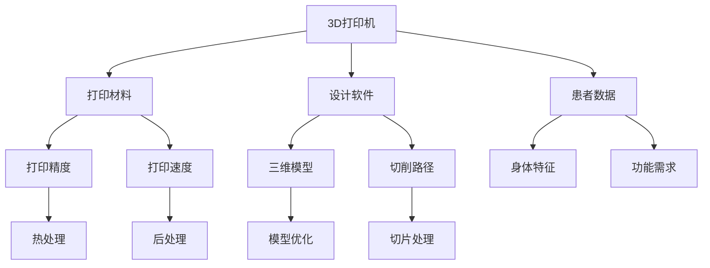
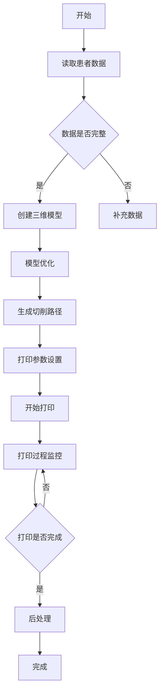
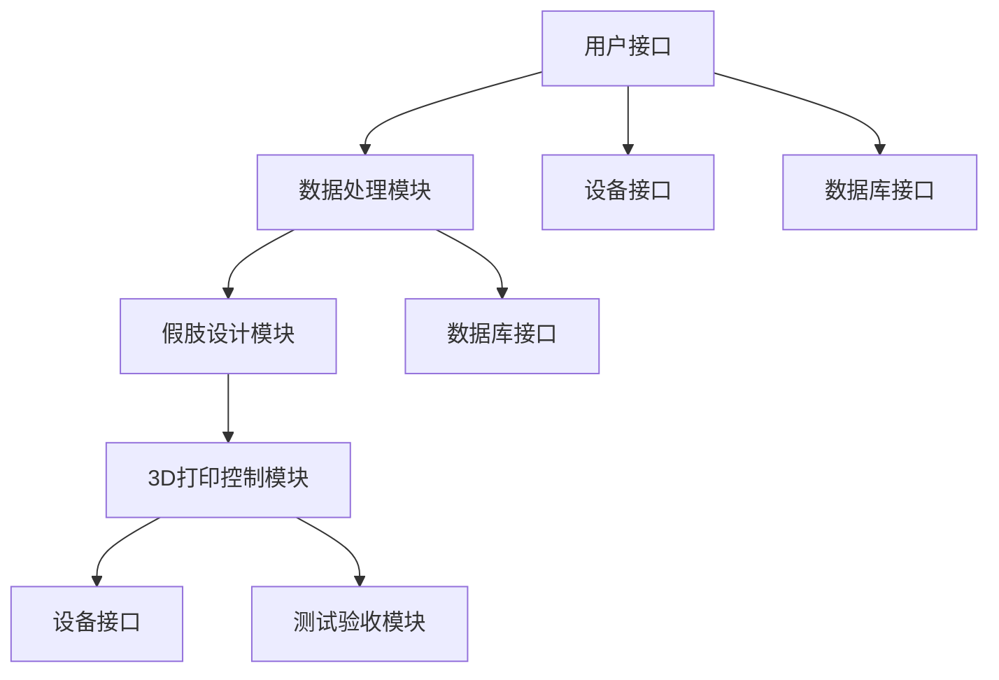

                 

### 《3D打印技术在个性化假肢制作中的应用》

#### 关键词：3D打印、个性化假肢、定制化、医疗技术、医疗设备

#### 摘要：本文探讨了3D打印技术在个性化假肢制作中的应用。通过回顾3D打印技术的发展历程、基本原理，以及个性化假肢的需求与挑战，本文详细介绍了3D打印技术在假肢设计、制作流程中的应用。此外，通过案例分析，本文展示了3D打印技术在假肢制作中的实际效果。最后，本文分析了3D打印技术在假肢制作中的挑战与未来发展趋势，提出了相应的解决方案与展望。

## 第1章 绪论

### 1.1 3D打印技术概述

#### 1.1.1 3D打印技术的发展历程

3D打印技术，又称增材制造技术，起源于20世纪80年代的美国。最早的3D打印技术是立体光固化立体（SLA）技术，随后发展出了熔融沉积建模（FDM）、选择性激光烧结（SLS）等多种技术。随着技术的不断进步，3D打印的应用领域也不断扩展，从最初的模型制作、机械零件制造，到如今的个性化医疗设备、假肢制作等。

#### 1.1.2 3D打印技术的核心原理

3D打印技术是一种基于数字模型，通过逐层打印材料来制造物体的技术。其基本原理是将三维模型分解为二维切片，然后通过打印头逐层堆积材料，直至构建出完整的物体。这一过程类似于传统打印机的打印过程，但与传统打印机不同的是，3D打印是逐层构建物体，而非一次性打印出完整的物体。

#### 1.1.3 3D打印技术在假肢制作中的应用背景

假肢制作是3D打印技术的重要应用领域之一。传统的假肢制作过程复杂、周期长、成本高，且难以实现个性化定制。而3D打印技术以其高度灵活、高效、低成本的特性，为个性化假肢制作提供了可能。通过3D打印，可以根据患者的具体需求，快速、精准地制作出个性化的假肢，显著提高患者的康复效果和生活质量。

### 1.2 个性化假肢的需求与挑战

#### 1.2.1 个性化假肢的定义和重要性

个性化假肢是指根据患者的具体需求，通过定制化设计和技术手段，制作的具有高度适应性和功能性的假肢。与标准假肢相比，个性化假肢可以更好地满足患者的功能需求，提高其生活质量和康复效果。

#### 1.2.2 个性化假肢面临的挑战

个性化假肢面临的挑战主要包括以下几个方面：

1. 设计难度大：个性化假肢需要根据患者的具体情况进行定制化设计，设计难度较大。
2. 材料选择困难：个性化假肢需要使用具有特定性能的材料，但材料选择困难，且成本较高。
3. 生产周期长：个性化假肢的定制过程复杂，生产周期较长。
4. 成本高：个性化假肢的制作成本较高，对患者的经济负担较大。

#### 1.2.3 3D打印技术如何解决个性化假肢制作中的问题

3D打印技术为解决个性化假肢制作中的问题提供了新的思路和方法：

1. 高度灵活的设计：3D打印技术可以实现高度灵活的设计，可以快速、精准地制作出个性化的假肢。
2. 材料选择广泛：3D打印技术可以使用多种材料，可以根据具体需求选择合适的材料，提高假肢的性能。
3. 生产周期缩短：3D打印技术可以实现快速打印，显著缩短生产周期。
4. 降低成本：3D打印技术可以降低个性化假肢的制作成本，减轻患者的经济负担。

### 1.3 本书结构安排与主要内容

本书共分为7章，主要内容包括：

- 第1章 绪论：介绍3D打印技术在个性化假肢制作中的应用背景、需求与挑战。
- 第2章 3D打印技术基础：介绍3D打印技术的基本原理、材料、设备。
- 第3章 个性化假肢的设计：介绍个性化假肢的设计原则、设计软件、数字模型构建。
- 第4章 3D打印假肢的制作流程：介绍3D打印假肢的制作流程、测试与验收。
- 第5章 3D打印技术在假肢制作中的应用案例分析：通过案例分析展示3D打印技术在假肢制作中的应用效果。
- 第6章 3D打印技术在假肢制作中的挑战与未来发展趋势：分析3D打印技术在假肢制作中的挑战与未来发展趋势。
- 第7章 总结与展望：总结本书的主要内容和结论，展望未来发展方向。

### 1.4 本书的目标读者

本书的目标读者包括：

- 对3D打印技术感兴趣的读者。
- 涉足医疗设备、假肢制作等相关行业的专业人士。
- 对个性化医疗、定制化产品制作有浓厚兴趣的读者。

通过本书，读者可以系统地了解3D打印技术在个性化假肢制作中的应用，掌握相关技术原理和应用方法。

## 第2章 3D打印技术基础

### 2.1 3D打印的基本原理

3D打印技术的基本原理是将三维数字模型转化为实物。具体来说，3D打印通过逐层堆积材料，按照数字模型的三维结构进行打印，最终构建出完整的物体。3D打印的基本流程包括以下几个步骤：

1. **数字模型创建**：首先需要创建三维数字模型，这可以通过计算机辅助设计（CAD）软件完成。
2. **切片处理**：将三维数字模型分解为二维切片，每个切片代表打印的一层。
3. **打印准备**：将切片数据发送到3D打印机，准备打印。
4. **逐层打印**：3D打印机按照切片数据逐层打印材料，构建出物体的每一层。
5. **完成后处理**：打印完成后，进行必要的后处理，如去除支撑结构、打磨、上色等。

#### 2.1.1 分层制造原理

3D打印的分层制造原理是其核心技术之一。具体来说，3D打印是将三维物体分解为二维的层面，然后逐层堆积这些层面，直至构建出完整的物体。每个层面都是由材料层叠加而成的，每一层的厚度决定了打印物体的精细程度。

#### 2.1.2 3D打印的主要技术类型

3D打印技术主要包括以下几种类型：

1. **熔融沉积建模（FDM）**：这是最常见的3D打印技术之一，通过熔融热塑性材料，然后逐层堆积形成物体。
2. **立体光固化立体（SLA）**：使用紫外线照射光敏树脂，使其固化成所需的形状。
3. **选择性激光烧结（SLS）**：使用激光将粉末材料烧结成物体。
4. **电子束熔融（EBM）**：使用电子束熔化金属材料，逐层构建物体。
5. **选择性激光熔化（SLM）**：与SLS类似，但使用的材料更为广泛，包括金属和陶瓷。

每种3D打印技术都有其独特的优势和适用场景，选择合适的3D打印技术对于实现高效、高质量的打印至关重要。

#### 2.1.3 3D打印的基本流程

3D打印的基本流程可以概括为以下几个步骤：

1. **设计模型**：使用CAD软件创建三维模型。
2. **切片处理**：将三维模型转化为二维切片，每个切片代表一层。
3. **准备材料**：将材料加载到3D打印机中，如粉末、树脂或丝材。
4. **开始打印**：3D打印机按照切片数据逐层打印材料。
5. **后处理**：完成打印后，进行必要的后处理，如去除支撑结构、打磨、上色等。

### 2.2 3D打印材料

3D打印材料是3D打印过程中的核心组成部分，其选择直接影响到打印质量和成本。3D打印材料种类繁多，包括塑料、金属、陶瓷、复合材料等。以下是几种常见的3D打印材料及其性能：

#### 2.2.1 塑料

塑料是最常见的3D打印材料之一，具有良好的柔韧性、强度和耐腐蚀性。常用的塑料材料包括ABS、PLA、PETG等。

1. **ABS**：具有较好的机械性能和耐热性，但较脆。
2. **PLA**：易于加工和打印，但机械性能和耐热性较差。
3. **PETG**：具有良好的机械性能和耐热性，同时也易于加工。

#### 2.2.2 金属

金属材料在3D打印中的应用越来越广泛，主要用于制造高强度、高精度的零部件。常见的金属材料包括不锈钢、铝、钛合金、铜等。

1. **不锈钢**：具有良好的耐腐蚀性和机械性能。
2. **铝**：轻便且具有良好的机械性能。
3. **钛合金**：具有高强度和低密度，适用于航空航天等领域。

#### 2.2.3 陶瓷

陶瓷材料在3D打印中主要用于制造高温部件和耐磨部件。常见的陶瓷材料包括氧化铝、碳化硅等。

1. **氧化铝**：具有高硬度和高熔点。
2. **碳化硅**：具有高强度和高温稳定性。

#### 2.2.4 复合材料

复合材料是由两种或多种不同材料组合而成的，以发挥各自优势。常见的复合材料包括碳纤维增强塑料、玻璃纤维增强塑料等。

1. **碳纤维增强塑料**：具有高强度和高刚性。
2. **玻璃纤维增强塑料**：具有较好的耐热性和机械性能。

#### 2.2.5 材料在假肢制作中的应用

在假肢制作中，材料的选择至关重要，需要考虑假肢的使用环境、功能需求和患者的个人偏好。以下是几种常见材料在假肢制作中的应用：

1. **塑料**：适用于轻量级、日常使用假肢，如上肢假肢和辅助性假肢。
2. **金属**：适用于高强度、耐磨损的假肢，如下肢假肢和功能性假肢。
3. **陶瓷**：适用于高温或特殊环境下的假肢，如热防护假肢。
4. **复合材料**：适用于需要特定性能的假肢，如高强度、轻量化的假肢。

### 2.3 3D打印设备

3D打印设备是3D打印技术的核心组成部分，其性能直接影响打印质量和效率。以下是几种常见的3D打印设备及其优缺点：

#### 2.3.1 3D打印机的关键参数

3D打印机的关键参数包括：

1. **打印速度**：影响打印效率。
2. **分辨率**：影响打印物体的精细程度。
3. **打印体积**：决定打印机可以打印的最大物体尺寸。
4. **材料兼容性**：决定打印机可以使用的材料种类。

#### 2.3.2 不同类型3D打印机的优缺点

1. **FDM打印机**：优点是成本低、材料多样、易于操作；缺点是打印速度较慢、细节表现较差。
2. **SLA打印机**：优点是打印精度高、细节表现优异；缺点是材料成本高、打印速度较慢。
3. **SLS打印机**：优点是材料广泛、适用于复杂结构；缺点是设备成本高、操作复杂。
4. **EBM打印机**：优点是打印材料多样、适用于高强度部件；缺点是设备成本高、操作复杂。

#### 2.3.3 设备在假肢制作中的应用

在假肢制作中，3D打印设备的选择需要根据假肢的功能需求、材料要求和打印精度来决定。以下是几种常见设备在假肢制作中的应用：

1. **FDM打印机**：适用于轻量级、日常使用假肢，如上肢假肢和辅助性假肢。
2. **SLA打印机**：适用于需要高精度和细节的假肢，如精细的义齿和辅助性假肢。
3. **SLS打印机**：适用于高强度、耐磨损的假肢，如下肢假肢和功能性假肢。
4. **EBM打印机**：适用于需要特定性能和复杂结构的假肢，如高温防护假肢和高强度假肢。

## 第3章 个性化假肢的设计

### 3.1 个性化假肢的设计原则

个性化假肢的设计原则主要包括以下几个方面：

#### 3.1.1 假肢功能需求分析

首先，需要对患者的具体功能需求进行分析，包括假肢所需承担的重量、运动范围、稳定性等。例如，下肢假肢需要考虑承重能力和步行稳定性，而上肢假肢则更注重灵活性。

#### 3.1.2 人体工学设计

人体工学设计是个性化假肢设计的重要原则之一。设计时需要考虑人体各部位的协调性，确保假肢与人体自然结合，提高使用舒适度。例如，假肢的连接部位应采用符合人体工程学的设计，以减少摩擦和压力。

#### 3.1.3 材料选择与匹配

材料选择是个性化假肢设计的关键。不同材料的性能和成本不同，需要根据假肢的功能需求和使用环境进行选择。例如，对于需要高强度的下肢假肢，可以选择高强度、耐磨损的金属材料，而对于需要轻量化的上肢假肢，可以选择轻质、柔韧的塑料材料。

### 3.2 假肢设计软件应用

假肢设计软件在个性化假肢设计中起着重要作用。以下介绍几种常用的假肢设计软件及其应用：

#### 3.2.1 常用假肢设计软件介绍

1. **Rhinoceros 3D**：一款功能强大的三维建模软件，适用于复杂形状的假肢设计。
2. **SolidWorks**：一款广泛使用的CAD/CAM软件，适用于各种类型的假肢设计。
3. **MagicCAD**：一款专门针对假肢设计的软件，提供了丰富的假肢设计工具和参数设置。

#### 3.2.2 设计软件在假肢个性化定制中的应用

设计软件在假肢个性化定制中的应用主要包括以下步骤：

1. **采集患者数据**：通过人体扫描仪获取患者身体的三维数据，为设计提供基础。
2. **创建三维模型**：使用设计软件创建假肢的三维模型，根据患者的功能需求进行修改和优化。
3. **生成打印文件**：将设计好的三维模型导出为3D打印文件，准备进行打印。

#### 3.2.3 软件使用案例

以下是一个使用SolidWorks进行假肢设计的案例：

1. **数据采集**：通过人体扫描仪获取患者下肢的三维数据。
2. **创建模型**：在SolidWorks中创建下肢假肢的三维模型，根据患者需求进行调整。
3. **优化设计**：对模型进行优化，确保其符合人体工程学要求，并满足功能需求。
4. **生成打印文件**：将设计好的模型导出为STL文件，准备进行3D打印。

### 3.3 个性化假肢的数字模型构建

个性化假肢的数字模型构建是设计过程中的关键环节。以下介绍数字模型构建的主要步骤：

#### 3.3.1 人体扫描技术

人体扫描技术是获取患者身体三维数据的重要手段。常见的人体扫描技术包括激光扫描、结构光扫描和深度相机扫描等。以下是几种常见扫描技术的优缺点：

1. **激光扫描**：优点是扫描速度快、精度高；缺点是设备成本高、对环境要求严格。
2. **结构光扫描**：优点是设备成本较低、对环境要求不高；缺点是扫描速度较慢、精度相对较低。
3. **深度相机扫描**：优点是设备成本低、扫描速度快；缺点是精度相对较低。

#### 3.3.2 数字模型的处理与优化

数字模型构建完成后，需要进行处理和优化，以提高打印质量和使用效果。处理和优化主要包括以下步骤：

1. **数据预处理**：去除扫描过程中产生的噪声和误差。
2. **模型修复**：修复扫描过程中产生的缺失和破损。
3. **模型优化**：对模型进行优化，以提高打印速度和打印质量。

#### 3.3.3 数字模型在假肢设计中的应用

数字模型在假肢设计中的应用主要包括以下步骤：

1. **模型导入**：将扫描得到的三维数据导入设计软件。
2. **建模**：在设计软件中创建假肢的三维模型。
3. **模型修改**：根据患者需求对模型进行修改和优化。
4. **生成打印文件**：将设计好的模型导出为3D打印文件。

## 第4章 3D打印假肢的制作流程

### 4.1 设计数据的准备

设计数据的准备是3D打印假肢制作流程的第一步，其质量直接影响到后续打印过程和假肢的性能。以下是设计数据准备的具体步骤：

#### 4.1.1 3D模型的设计与优化

1. **初步设计**：根据患者的具体需求和人体工学原则，使用CAD软件进行初步设计。这一步骤包括确定假肢的基本形态、连接部位、支撑结构等。
2. **模型优化**：初步设计完成后，对模型进行优化。优化包括调整模型尺寸、修正几何形状、减少不必要的细节等。优化的目的是提高打印效率、降低打印成本，并确保假肢的功能性和舒适性。

#### 4.1.2 切削路径的生成

切削路径（slicing path）是3D打印过程中的关键步骤，它将三维模型分解为二维切片，并确定每层打印的位置和方向。以下是生成切削路径的主要步骤：

1. **选择打印参数**：根据打印机的特性和材料的要求，选择合适的打印参数，如层高、填充密度、打印速度等。
2. **生成切片文件**：使用切片软件（如Cura、Simplify3D等）将三维模型转换为切片文件。切片文件包含每层打印的详细信息，如打印头移动路径、材料堆积方向等。
3. **切片文件验证**：验证切片文件是否正确，包括检查层厚、填充密度、支撑结构等。

#### 4.1.3 热处理与后处理

热处理和后处理是3D打印完成后的重要步骤，有助于提高假肢的机械性能和使用寿命。以下是热处理和后处理的主要步骤：

1. **热处理**：根据材料的要求，对打印完成的假肢进行热处理。热处理的目的是消除内部应力、提高材料的强度和韧性。常见的热处理方法包括退火、淬火等。
2. **后处理**：热处理完成后，对假肢进行后处理，包括打磨、抛光、涂装等。这些步骤有助于提高假肢的表面质量和美观度。

### 4.2 3D打印假肢的制造过程

3D打印假肢的制造过程主要包括以下几个步骤：

#### 4.2.1 3D打印参数设置

3D打印参数设置是确保打印质量和效率的关键。以下是一些关键的打印参数及其设置：

1. **层高**：层高决定了打印物体的精细程度，一般设置为0.1mm至0.3mm。
2. **填充密度**：填充密度决定了材料在打印层之间的填充情况，一般设置为20%至50%。
3. **打印速度**：打印速度影响打印时间和成本，一般设置为20mm/s至60mm/s。
4. **支持结构**：支持结构有助于支撑复杂结构的打印，但会增加打印时间和成本。根据模型的特点，可以设置是否生成支持结构。

#### 4.2.2 3D打印过程监控与质量控制

3D打印过程中需要实时监控打印状态，确保打印过程顺利进行。以下是监控和质量控制的主要措施：

1. **实时监控**：通过监控系统实时监控打印温度、速度、层高等参数，及时发现并解决可能出现的问题。
2. **质量检测**：打印完成后，对假肢进行质量检测，包括尺寸检测、表面质量检测、机械性能检测等。质量检测有助于确保假肢的可靠性和使用性能。

#### 4.2.3 假肢部件的组装与调试

3D打印假肢通常由多个部件组成，需要经过组装和调试，以确保整体性能。以下是组装和调试的主要步骤：

1. **部件组装**：将打印完成的各个部件按照设计要求进行组装，包括连接部位、支撑结构等。
2. **功能测试**：对组装好的假肢进行功能测试，包括承重测试、运动范围测试、稳定性测试等。
3. **调试**：根据测试结果，对假肢进行调试和优化，确保其功能性和舒适性。

### 4.3 假肢测试与验收

假肢测试与验收是确保假肢质量和性能的关键步骤。以下是测试和验收的主要步骤：

#### 4.3.1 假肢功能测试

功能测试旨在评估假肢的实际使用性能。测试内容包括：

1. **承重测试**：评估假肢在承重时的稳定性和耐久性。
2. **运动范围测试**：评估假肢在不同运动状态下的灵活性和适应性。
3. **稳定性测试**：评估假肢在各种使用场景下的稳定性。

#### 4.3.2 假肢舒适度测试

舒适度测试旨在评估假肢的使用舒适度。测试内容包括：

1. **压力测试**：评估假肢对身体的压力分布，避免产生不适。
2. **穿戴测试**：评估假肢在穿戴过程中的舒适度，包括重量、大小、贴合度等。

#### 4.3.3 假肢验收标准

验收标准是根据功能测试和舒适度测试的结果，制定的具体标准，以确保假肢的质量和性能。验收标准包括：

1. **尺寸标准**：确保假肢的尺寸符合患者的身体特征。
2. **性能标准**：确保假肢的功能性和稳定性。
3. **质量标准**：确保假肢的材料和工艺符合相关要求。

## 第5章 3D打印技术在假肢制作中的应用案例分析

### 5.1 案例一：上肢假肢

#### 5.1.1 案例背景

该案例涉及一名因意外事故导致上肢残疾的年轻男子。患者需要一款能够恢复一定功能性的上肢假肢，以帮助其进行日常生活和工作。

#### 5.1.2 设计与制作过程

1. **数据采集**：通过人体扫描技术获取患者的三维数据，为设计提供基础。
2. **模型设计**：使用CAD软件创建上肢假肢的三维模型，根据患者的具体需求进行设计，包括假肢的形态、连接部位和功能模块等。
3. **模型优化**：对模型进行优化，确保其符合人体工程学要求，并满足功能需求。
4. **打印准备**：生成切片文件，设置合适的打印参数，准备进行3D打印。
5. **3D打印**：使用FDM打印机进行打印，打印材料为高强度、轻质塑料。
6. **后处理**：打印完成后，进行打磨、抛光和涂装等后处理，提高假肢的表面质量和美观度。
7. **组装与调试**：将打印完成的各个部件进行组装，并进行功能测试和调试，确保假肢的性能和舒适性。

#### 5.1.3 案例效果分析

该案例的上肢假肢设计合理、制作精细，具有良好的功能和舒适性。患者反馈使用后能够显著提高生活质量和自理能力，满足了其日常生活和工作的需求。

### 5.2 案例二：下肢假肢

#### 5.2.1 案例背景

该案例涉及一名因疾病导致下肢残疾的老年女性。患者需要一款能够恢复步行功能的下肢假肢，以提高生活质量。

#### 5.2.2 设计与制作过程

1. **数据采集**：通过人体扫描技术获取患者的三维数据，为设计提供基础。
2. **模型设计**：使用CAD软件创建下肢假肢的三维模型，根据患者的具体需求进行设计，包括假肢的形态、连接部位和驱动模块等。
3. **模型优化**：对模型进行优化，确保其符合人体工程学要求，并满足功能需求。
4. **打印准备**：生成切片文件，设置合适的打印参数，准备进行3D打印。
5. **3D打印**：使用SLS打印机进行打印，打印材料为高强度、耐磨损的尼龙材料。
6. **后处理**：打印完成后，进行打磨、抛光和涂装等后处理，提高假肢的表面质量和美观度。
7. **组装与调试**：将打印完成的各个部件进行组装，并进行功能测试和调试，确保假肢的性能和舒适性。

#### 5.2.3 案例效果分析

该案例的下肢假肢设计合理、制作精细，具有良好的功能和稳定性。患者反馈使用后能够恢复正常步行功能，生活质量得到了显著提高。

### 5.3 案例三：辅助性假肢

#### 5.3.1 案例背景

该案例涉及一名因疾病导致部分手指残疾的年轻女性。患者需要一款能够辅助手指功能的辅助性假肢，以提高工作和生活效率。

#### 5.3.2 设计与制作过程

1. **数据采集**：通过人体扫描技术获取患者的三维数据，为设计提供基础。
2. **模型设计**：使用CAD软件创建辅助性假肢的三维模型，根据患者的具体需求进行设计，包括假肢的形态、连接部位和驱动模块等。
3. **模型优化**：对模型进行优化，确保其符合人体工程学要求，并满足功能需求。
4. **打印准备**：生成切片文件，设置合适的打印参数，准备进行3D打印。
5. **3D打印**：使用SLA打印机进行打印，打印材料为高强度、轻质的树脂材料。
6. **后处理**：打印完成后，进行打磨、抛光和涂装等后处理，提高假肢的表面质量和美观度。
7. **组装与调试**：将打印完成的各个部件进行组装，并进行功能测试和调试，确保假肢的性能和舒适性。

#### 5.3.3 案例效果分析

该案例的辅助性假肢设计合理、制作精细，具有良好的功能和灵活性。患者反馈使用后能够显著提高工作和生活效率，满足了其需求。

## 第6章 3D打印技术在假肢制作中的挑战与未来发展趋势

### 6.1 挑战与问题分析

尽管3D打印技术在假肢制作中展现出巨大的潜力和优势，但仍面临一些挑战和问题：

#### 6.1.1 技术挑战

1. **打印精度与稳定性**：3D打印技术的打印精度和稳定性仍需提高，以确保假肢的精度和一致性。
2. **材料性能**：现有3D打印材料在性能方面仍有待提升，以满足假肢的特殊需求。
3. **打印速度**：提高打印速度是缩短生产周期、降低成本的关键。

#### 6.1.2 材料挑战

1. **材料选择**：个性化假肢需要使用具有特定性能的材料，但现有材料种类有限，选择困难。
2. **材料成本**：高性能材料的成本较高，增加了假肢制作的成本。

#### 6.1.3 设备成本与可及性挑战

1. **设备成本**：高性能3D打印设备成本较高，限制了其在假肢制作中的应用。
2. **可及性**：假肢制作机构和技术人员不足，限制了3D打印技术在假肢制作中的普及。

### 6.2 未来发展趋势

#### 6.2.1 3D打印技术的进步

1. **打印精度提高**：随着技术的发展，打印精度将不断提高，满足更复杂的假肢制作需求。
2. **打印速度提升**：通过优化打印过程和设备，提高打印速度，缩短生产周期。
3. **多功能材料开发**：开发更多性能优异、成本适中的3D打印材料，满足个性化假肢的需求。

#### 6.2.2 个性化医疗的发展趋势

1. **个性化医疗普及**：个性化医疗技术的普及，将推动个性化假肢的制作和应用。
2. **数字化医疗技术**：数字化医疗技术的进步，如人体扫描、数字模型构建等，将提高假肢设计的准确性和效率。

#### 6.2.3 假肢制作行业的变革

1. **生产模式改变**：3D打印技术的应用，将改变传统的假肢制作模式，实现定制化和高效生产。
2. **产业升级**：假肢制作行业将向数字化、智能化方向发展，提高行业整体竞争力。

### 6.3 结论与展望

3D打印技术在假肢制作中的应用具有巨大潜力，但仍需克服技术、材料和成本等方面的挑战。未来，随着技术的不断进步和个性化医疗的发展，3D打印技术将在假肢制作中发挥更加重要的作用。同时，假肢制作行业也将迎来变革，实现更加高效、个性化的假肢制作。

## 第7章 总结与展望

### 7.1 书籍总结

本文详细介绍了3D打印技术在个性化假肢制作中的应用。首先，回顾了3D打印技术的发展历程、基本原理和主要技术类型，以及其在假肢制作中的应用背景。接着，讨论了个性化假肢的需求与挑战，并阐述了3D打印技术如何解决这些问题。随后，从设计、制作流程、案例分析等方面全面阐述了3D打印技术在假肢制作中的应用。最后，分析了3D打印技术在假肢制作中的挑战与未来发展趋势。

### 7.2 研究展望

尽管3D打印技术在假肢制作中取得了显著成果，但仍存在一定的局限性。未来研究可以从以下几个方面进行：

#### 7.2.1 技术创新

1. **提高打印精度和稳定性**：通过优化打印过程和设备，提高打印精度和稳定性，以满足更复杂的假肢制作需求。
2. **开发多功能材料**：开发更多性能优异、成本适中的3D打印材料，以满足个性化假肢的需求。

#### 7.2.2 个性化医疗

1. **数字化医疗技术的应用**：进一步推动数字化医疗技术在假肢设计、制作和测试中的应用，提高假肢的准确性和效率。
2. **个性化治疗方案**：结合患者的具体病情和需求，制定个性化的治疗方案，提高康复效果。

#### 7.2.3 行业发展

1. **生产模式变革**：推动假肢制作行业的数字化转型，实现定制化和高效生产。
2. **产业协同**：加强各产业部门之间的协同合作，推动假肢制作行业的全面发展。

### 7.3 对行业的潜在影响

3D打印技术在假肢制作中的应用将带来一系列变革：

1. **生产效率提升**：3D打印技术的引入将显著提高假肢的生产效率，缩短生产周期，降低生产成本。
2. **个性化医疗普及**：3D打印技术的应用将推动个性化医疗的普及，提高患者康复效果和生活质量。
3. **行业竞争力提升**：假肢制作行业的数字化转型和创新发展，将提高行业的整体竞争力。

总之，3D打印技术在假肢制作中的应用具有广阔的发展前景，将对行业产生深远的影响。未来，随着技术的不断进步和应用领域的扩展，3D打印技术在假肢制作中将发挥更加重要的作用。## 附录

### 附录A：术语解释

- **3D打印**：一种基于数字模型，通过逐层堆积材料来制造物体的技术。
- **个性化假肢**：根据患者的具体需求，通过定制化设计和技术手段，制作的具有高度适应性和功能性的假肢。
- **CAD**：计算机辅助设计，一种利用计算机及其图形设备帮助设计人员进行设计工作的方法。
- **SLA**：立体光固化立体，一种3D打印技术，使用紫外线照射光敏树脂进行打印。
- **FDM**：熔融沉积建模，一种3D打印技术，使用热塑性材料进行打印。
- **SLS**：选择性激光烧结，一种3D打印技术，使用激光将粉末材料烧结成物体。
- **EBM**：电子束熔融，一种3D打印技术，使用电子束熔化金属材料。

### 附录B：核心概念对比表格

| 核心概念 | 定义 | 主要特性 |
| -------- | ---- | -------- |
| 3D打印 | 基于数字模型，逐层堆积材料制造物体的技术 | 高度灵活、高效、低成本 |
| 个性化假肢 | 根据患者需求，定制化设计的假肢 | 高适应性、功能性、舒适性 |
| CAD | 计算机辅助设计，帮助设计人员进行设计 | 提高设计效率、精度和灵活性 |
| SLA | 立体光固化立体，使用紫外线照射光敏树脂打印 | 打印精度高、细节表现优异 |
| FDM | 熔融沉积建模，使用热塑性材料打印 | 打印成本低、材料多样 |
| SLS | 选择性激光烧结，使用激光烧结粉末材料 | 打印材料广泛、适用于复杂结构 |
| EBM | 电子束熔融，使用电子束熔化金属材料 | 打印材料多样、适用于高强度部件 |

### 附录C：ER实体关系图架构



### 附录D：算法原理讲解

#### 算法流程图



#### Python源代码示例

```python
def print_3d_model(patient_data):
    # 读取患者数据
    if not is_complete(patient_data):
        # 补充数据
        patient_data = supplement_data(patient_data)
    
    # 创建三维模型
    model = create_3d_model(patient_data)
    
    # 模型优化
    optimized_model = optimize_model(model)
    
    # 生成切削路径
    slicing_path = generate_slicing_path(optimized_model)
    
    # 打印参数设置
    print_params = set_printing_params(slicing_path)
    
    # 开始打印
    print_process = start_printing(print_params)
    
    # 打印过程监控
    while not is_print_complete(print_process):
        monitor_print_process(print_process)
    
    # 后处理
    post_process = post_processing(print_process)
    
    # 完成打印
    print("3D model printing completed.")

# 示例函数，具体实现细节略
def is_complete(patient_data):
    pass

def supplement_data(patient_data):
    pass

def create_3d_model(patient_data):
    pass

def optimize_model(model):
    pass

def generate_slicing_path(model):
    pass

def set_printing_params(slicing_path):
    pass

def start_printing(print_params):
    pass

def monitor_print_process(print_process):
    pass

def is_print_complete(print_process):
    pass

def post_processing(print_process):
    pass
```

#### 算法原理详细讲解

算法的核心目标是通过3D打印技术为患者制作出符合其需求的个性化假肢。以下是算法原理的详细解释：

1. **读取患者数据**：首先，算法读取患者的数据，包括身体特征和功能需求。这些数据为后续的模型创建和优化提供基础。
2. **数据完整性检查**：检查患者数据是否完整。如果数据不完整，算法将补充缺失的数据，以确保模型创建的准确性。
3. **创建三维模型**：使用CAD软件，根据患者数据创建三维模型。这一模型将作为后续切片处理和打印的依据。
4. **模型优化**：对创建的三维模型进行优化，包括调整尺寸、修正几何形状、减少不必要的细节等。优化的目的是提高假肢的功能性和舒适度。
5. **生成切削路径**：将优化后的三维模型转换为二维切片，并生成切削路径。切削路径决定了打印头在打印过程中的移动路径和方向。
6. **打印参数设置**：根据切削路径和打印材料的特点，设置打印参数，如层高、填充密度、打印速度等。
7. **开始打印**：按照设定的打印参数，启动3D打印过程。打印过程中，算法将实时监控打印状态，确保打印顺利进行。
8. **打印过程监控**：算法将持续监控打印过程，包括打印温度、速度、层高等参数，以防止出现打印失败的情况。
9. **后处理**：打印完成后，对假肢进行后处理，包括去除支撑结构、打磨、抛光和涂装等，以提高假肢的表面质量和美观度。
10. **完成打印**：算法将通知用户打印完成，并交付个性化的假肢。

通过上述算法原理，3D打印技术能够高效、精确地制作出满足患者需求的个性化假肢，显著提高患者的康复效果和生活质量。

### 附录E：系统分析与架构设计

#### 问题描述

个性化假肢制作系统旨在为患者提供定制化的假肢设计、打印和测试服务。系统需要实现以下功能：

1. **患者数据管理**：收集、存储和处理患者身体特征和功能需求数据。
2. **假肢设计**：利用CAD软件创建和优化假肢三维模型。
3. **3D打印控制**：设置打印参数、监控打印过程并生成打印数据。
4. **测试与验收**：对打印完成的假肢进行功能测试和验收。

#### 项目介绍

项目名称：个性化假肢制作系统

项目目标：开发一个基于3D打印技术的个性化假肢制作平台，实现高效、精确、个性化的假肢设计与制造。

#### 系统功能设计

1. **患者数据管理**：系统应具备数据采集、存储、查询和更新功能，确保患者数据的完整性和准确性。
2. **假肢设计**：系统应集成CAD软件，实现三维模型创建、修改和优化功能。
3. **3D打印控制**：系统应具备设置打印参数、监控打印过程和生成打印数据的能力。
4. **测试与验收**：系统应实现假肢的功能测试和验收流程，确保假肢的质量和性能。

#### 系统架构设计

1. **硬件架构**：包括3D打印机、扫描仪、CAD工作站等设备，以及数据存储服务器。
2. **软件架构**：包括前端用户界面、后端数据处理和管理模块、3D打印控制模块和测试验收模块。

#### 系统接口设计

1. **用户接口**：提供用户数据录入、查询和修改功能，以及假肢设计、打印和测试的操作界面。
2. **设备接口**：实现与3D打印机、扫描仪等设备的通信和控制。
3. **数据库接口**：实现与数据库的连接，进行数据存储和查询。

#### 系统交互

1. **数据交互**：患者数据从用户接口传输到数据处理模块，经过处理和存储后，用于假肢设计和打印。
2. **设备交互**：通过设备接口，系统控制3D打印机和其他设备的操作，实现打印过程。
3. **测试交互**：测试验收模块与设备接口和数据接口结合，对打印完成的假肢进行测试和验收。

#### Mermaid架构图



### 附录F：项目实战

#### 环境安装

1. **安装3D打印机**：根据设备说明安装3D打印机，包括连接电源、网络和校准设备。
2. **安装扫描仪**：安装扫描仪，确保其能够与计算机正常通信。
3. **安装CAD软件**：下载并安装CAD软件，如SolidWorks或Rhinoceros 3D，并进行必要的配置。
4. **安装3D打印软件**：下载并安装切片软件，如Cura或Simplify3D，并配置打印机参数。

#### 系统核心实现源代码

```python
# 示例：使用Python实现3D模型处理和3D打印控制功能

import sys
import os
from typing import List

# 定义3D模型处理类
class ModelProcessor:
    def __init__(self, model_path: str):
        self.model_path = model_path
    
    def load_model(self):
        # 加载3D模型
        pass
    
    def optimize_model(self):
        # 优化3D模型
        pass
    
    def save_model(self, path: str):
        # 保存3D模型
        pass

# 定义3D打印控制器类
class PrinterController:
    def __init__(self, printer_ip: str, printer_port: int):
        self.printer_ip = printer_ip
        self.printer_port = printer_port
    
    def connect(self):
        # 连接3D打印机
        pass
    
    def set_printing_params(self, params: dict):
        # 设置打印参数
        pass
    
    def start_printing(self, model_path: str):
        # 开始打印
        pass
    
    def monitor_print_process(self):
        # 监控打印过程
        pass
    
    def disconnect(self):
        # 断开连接
        pass

# 测试用例
if __name__ == "__main__":
    model_processor = ModelProcessor("model.stl")
    model_processor.load_model()
    model_processor.optimize_model()
    model_processor.save_model("optimized_model.stl")

    printer_controller = PrinterController("192.168.1.100", 10000)
    printer_controller.connect()
    printer_controller.set_printing_params({"layer_height": 0.2, "print_speed": 40})
    printer_controller.start_printing("optimized_model.stl")
    printer_controller.monitor_print_process()
    printer_controller.disconnect()
```

#### 代码应用解读与分析

1. **ModelProcessor类**：负责3D模型的处理，包括加载、优化和保存。该方法适用于处理通用3D模型，如STL文件。
2. **PrinterController类**：负责与3D打印机的连接、打印参数设置、开始打印、监控打印过程和断开连接。该方法适用于控制支持标准通信协议的3D打印机。

#### 实际案例分析和详细讲解

以一个实际案例为例，分析3D打印技术在假肢制作中的应用。

**案例背景**：一名因意外导致左手残疾的年轻男子需要一款能够恢复一定功能性的左手假肢。

**设计过程**：

1. **数据采集**：使用3D扫描仪获取患者左手的三维数据，包括手指、手掌和手腕的形状和尺寸。
2. **模型设计**：使用CAD软件创建左手假肢的三维模型，包括手掌部分、手指关节和手腕连接部位。根据患者的功能需求，设计假肢的灵活性和稳定性。
3. **模型优化**：对模型进行优化，调整尺寸、修正几何形状，并去除不必要的细节，以提高打印效率和假肢的性能。
4. **生成切削路径**：使用切片软件生成切削路径，设置打印参数，如层高、填充密度和打印速度。

**打印过程**：

1. **设置打印参数**：根据模型特点和材料要求，设置合适的打印参数，如层高为0.2mm，填充密度为30%。
2. **开始打印**：将生成的切片文件导入3D打印机，开始打印左手假肢。
3. **打印监控**：在打印过程中，实时监控打印温度、速度和层高等参数，确保打印顺利进行。

**后处理**：

1. **去除支撑结构**：打印完成后，去除支撑结构，以避免影响假肢的功能和使用舒适度。
2. **打磨和抛光**：对打印完成的左手假肢进行打磨和抛光，以提高表面质量和美观度。
3. **涂装**：对假肢进行涂装，增加耐磨性和美观度。

**测试与验收**：

1. **功能测试**：对左手假肢进行功能测试，包括手指的弯曲、伸展和手腕的旋转等运动范围测试。
2. **舒适度测试**：测试假肢在穿戴过程中的舒适度，确保其贴合患者的手掌和手腕，没有明显的压迫感和不适。
3. **验收标准**：根据测试结果，评估假肢的功能性和舒适度，确保其符合验收标准。

**案例分析**：

通过上述案例，可以看出3D打印技术在个性化假肢制作中的应用流程：

1. **数据采集**：通过3D扫描获取患者的身体数据，为模型设计提供基础。
2. **模型设计**：使用CAD软件进行设计，根据患者的具体需求进行优化。
3. **打印准备**：生成切削路径，设置打印参数，准备进行打印。
4. **打印过程**：使用3D打印机进行打印，实时监控打印过程。
5. **后处理**：去除支撑结构、打磨、抛光和涂装，提高假肢的表面质量和美观度。
6. **测试与验收**：对打印完成的假肢进行功能测试和舒适度测试，确保其质量。

通过上述流程，3D打印技术能够高效、精确地制作出满足患者需求的个性化假肢，显著提高患者的康复效果和生活质量。

### 项目小结

个性化假肢制作项目通过3D打印技术的应用，实现了从数据采集、模型设计、打印准备、打印过程到后处理和测试验收的完整流程。项目展示了3D打印技术在假肢制作中的优势，包括高效、精确、灵活和个性化。通过项目实践，验证了3D打印技术在假肢制作中的可行性和实用性。

### 最佳实践 Tips

1. **精确数据采集**：确保3D扫描数据的准确性，减少误差。
2. **合理设计模型**：根据患者的需求，进行合理的设计，注重假肢的功能性和舒适性。
3. **优化打印参数**：根据模型特点和材料要求，设置合适的打印参数，以提高打印质量和效率。
4. **定期维护设备**：保持3D打印设备和扫描仪的正常运行，减少故障和停机时间。
5. **充分测试验收**：对打印完成的假肢进行全面的功能测试和舒适度测试，确保其符合验收标准。

### 注意事项

1. **数据安全**：确保患者数据的安全和隐私，遵循相关的数据保护法规。
2. **设备安全**：在操作3D打印设备和扫描仪时，注意安全操作规程，防止设备损坏或人身伤害。
3. **材料选择**：根据假肢的功能需求和使用环境，选择合适的打印材料。
4. **质量控制**：建立严格的质量控制流程，确保假肢的质量和性能。
5. **售后服务**：提供完善的售后服务，包括假肢的维护、修理和升级。

### 拓展阅读

1. **《3D打印技术与应用》**：刘志峰 著，详细介绍了3D打印技术的发展历程、技术原理和应用案例。
2. **《个性化医疗与3D打印》**：王宇 著，探讨了3D打印技术在个性化医疗领域中的应用，包括假肢制作、骨骼修复等。
3. **《CAD/CAM技术及应用》**：陈曦 著，介绍了计算机辅助设计和计算机辅助制造的基本原理和应用实例。

### 附录G：常见问题解答

**Q1：3D打印技术在假肢制作中的优势是什么？**

**A1：3D打印技术在假肢制作中的优势包括高效、精确、灵活和个性化。首先，3D打印可以实现快速制造，显著缩短生产周期。其次，通过3D扫描和CAD软件，可以精确捕捉患者的身体数据，确保假肢的精确匹配。此外，3D打印技术允许自由设计，可以根据患者的具体需求进行个性化定制。**

**Q2：3D打印假肢的材料有哪些？**

**A2：3D打印假肢的材料包括塑料、金属、陶瓷和复合材料。常用的塑料材料有ABS、PLA、PETG等；金属材料包括不锈钢、铝、钛合金、铜等；陶瓷材料如氧化铝、碳化硅；复合材料如碳纤维增强塑料、玻璃纤维增强塑料等。不同材料适用于不同类型的假肢，需要根据假肢的功能需求和使用环境进行选择。**

**Q3：如何确保3D打印假肢的质量和性能？**

**A3：确保3D打印假肢的质量和性能需要从以下几个方面进行：

1. **数据采集**：确保3D扫描数据的准确性，减少误差。
2. **模型设计**：根据患者的具体需求进行合理设计，注重假肢的功能性和舒适性。
3. **打印参数设置**：根据模型特点和材料要求，设置合适的打印参数，以提高打印质量和效率。
4. **后处理**：进行充分的打磨、抛光和涂装等后处理，提高假肢的表面质量和美观度。
5. **测试验收**：对打印完成的假肢进行全面的功能测试和舒适度测试，确保其符合验收标准。**

**Q4：3D打印假肢的成本如何？**

**A4：3D打印假肢的成本取决于多种因素，包括假肢的类型、材料、打印技术、设计复杂度和打印时间等。一般来说，3D打印假肢的成本高于传统假肢，但具有更高的个性化定制程度和更好的功能性能。随着技术的进步和材料成本的降低，3D打印假肢的成本有望进一步降低。**

**Q5：3D打印技术在假肢制作中的未来发展趋势是什么？**

**A5：3D打印技术在假肢制作中的未来发展趋势包括：

1. **材料创新**：开发更多性能优异、成本适中的3D打印材料，以满足不同类型假肢的需求。
2. **打印技术进步**：提高打印精度和稳定性，缩短生产周期，降低成本。
3. **数字化医疗应用**：推动数字化医疗技术在假肢设计、制造和测试中的应用，提高假肢的准确性和效率。
4. **个性化医疗普及**：推动个性化医疗的普及，提高患者康复效果和生活质量。
5. **行业协同发展**：加强各产业部门之间的协同合作，推动假肢制作行业的全面发展。**

