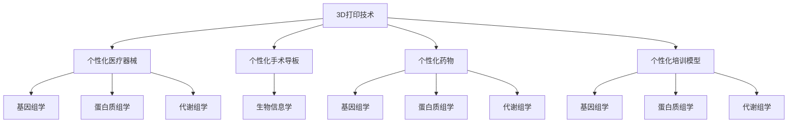

                 

# 3D打印技术在个性化医疗中的应用前景

## 摘要

本文将探讨3D打印技术在个性化医疗中的应用前景，从背景介绍、核心概念与联系、应用实例、挑战与机遇以及未来前景五个方面进行分析。通过深入了解3D打印技术的个性化定制、快速制造、高精度和材料多样性等属性特征，我们将看到3D打印技术在个性化医疗设备制造、生物打印和组织工程、医疗模型打印、手术导板和植入物个性化设计等领域的广泛应用。同时，本文也将分析3D打印技术在个性化医疗领域面临的挑战，以及应对策略和未来发展趋势，为从事医疗设备研发、制造及临床应用的专业人士提供一本实用的参考书。

## 第二部分: 核心概念与联系

### 2.1 3D打印技术的核心概念与属性特征

#### 2.1.1 3D打印技术概述

3D打印技术，又称增材制造，是一种以数字模型为基础，通过逐层打印材料来制造三维物体的技术。其基本原理是利用计算机辅助设计（CAD）软件生成三维模型，并将这些模型分层切割成二维平面图，然后通过3D打印机逐层打印出物体。这一过程涉及多个关键步骤，包括数据准备、模型构建、打印过程和后处理。

#### 2.1.2 3D打印技术的分类

3D打印技术根据不同的打印原理和材料，可以分为多种类型。以下是一些常见的3D打印技术分类：

- **立体光固化（SLA）**：通过紫外线照射光敏树脂使其固化，逐层构建三维物体。
- **熔融沉积成型（FDM）**：将热熔塑料通过喷嘴挤出，逐层堆积成型。
- **电子束熔融（EBM）**：使用电子束熔化金属粉末，逐层构建金属物体。
- **选择性激光烧结（SLS）**：使用激光烧结粉末材料，逐层构建三维物体。
- **数字光处理（DLP）**：通过数字光处理技术，逐层打印出高分辨率的三维物体。

#### 2.1.3 3D打印技术的材料

3D打印技术使用的材料非常多样，包括塑料、金属、陶瓷、复合材料和生物相容材料等。每种材料都有其特定的物理和化学性质，适用于不同的应用场景。

| 材料类型       | 特点                                                         | 应用领域                                               |
|----------------|--------------------------------------------------------------|--------------------------------------------------------|
| **塑料**       | 轻便、成本低、易加工                                       | 个性化医疗器械、模具、概念验证模型、牙科应用             |
| **金属**       | 高强度、高精度、耐腐蚀                                     | 骨折固定装置、牙科植入物、航空航天部件、汽车零部件     |
| **陶瓷**       | 高硬度、耐高温、耐腐蚀                                     | 模具、高温部件、生物医学植入物                         |
| **复合材料**   | 结合多种材料的优点，可根据需求定制                           | 飞机内饰、高性能汽车部件、运动装备                     |
| **生物相容材料** | 生物相容性好，可生物降解                                   | 生物打印、组织工程、医疗植入物                         |

#### 2.1.4 3D打印技术与传统制造技术的对比

3D打印技术与传统制造技术相比，具有明显的优势。

| 制造技术 | 特点                                                     | 对比优势                                                   |
|----------|----------------------------------------------------------|------------------------------------------------------------|
| **传统制造** | 需要模具、量大才经济，生产周期长。                         | **定制化、短周期**：3D打印可以实现小批量、个性化定制，缩短生产周期。 |
| **3D打印**  | 基于数字模型，逐层打印，无需模具。                         | **高精度、高自由度**：能够制造出复杂结构，减少材料浪费。     |

### 2.2 个性化医疗的核心概念与属性特征

#### 2.2.1 个性化医疗概述

个性化医疗，又称精准医疗，是指根据患者的个体差异，通过基因组学、蛋白质组学、代谢组学等多种手段，制定个性化的治疗方案。个性化医疗的核心理念是“以患者为中心”，旨在提高治疗效果，减少副作用，提高患者满意度。

#### 2.2.2 个性化医疗的发展历程

- **早期阶段**：传统的“一刀切”治疗，即对所有患者采用相同的治疗方法。
- **现代阶段**：随着医学技术的进步，个性化医疗开始逐步兴起，包括基因治疗、细胞治疗等。
- **未来趋势**：随着大数据、人工智能等技术的发展，个性化医疗将更加精准，实现真正的“一人一方”。

#### 2.2.3 个性化医疗的重要性

个性化医疗的重要性体现在以下几个方面：

- **提高治疗效果**：根据患者的个体差异，制定个性化的治疗方案，可以提高治疗效果。
- **减少副作用**：避免使用不适合患者的药物或治疗方案，减少副作用。
- **提高患者满意度**：为患者提供更合适、更有效的治疗方案，提高患者满意度。

#### 2.2.4 个性化医疗的核心要素

个性化医疗的核心要素包括：

- **基因组学**：通过分析患者的基因组信息，发现疾病风险和治疗方案。
- **蛋白质组学**：研究患者的蛋白质组信息，了解疾病的生物学机制。
- **代谢组学**：分析患者的代谢产物，了解疾病的代谢状态。
- **生物信息学**：通过大数据分析和人工智能技术，挖掘疾病和治疗方案的相关性。

#### 2.2.5 个性化医疗与3D打印技术的联系

3D打印技术在个性化医疗中的应用主要体现在以下几个方面：

- **个性化医疗器械**：根据患者的具体需求，定制化制造医疗器械，如支架、义齿、助听器等。
- **个性化手术导板**：通过3D打印技术，制造出与患者解剖结构匹配的手术导板，提高手术精度。
- **个性化药物**：利用3D打印技术，实现个性化药物制剂，提高药物疗效和安全性。
- **个性化培训模型**：为医生和医学生提供个性化培训模型，提高医疗技能。

### 2.2.6 个性化医疗与3D打印技术的关联图

以下是3D打印技术与个性化医疗的关联图，展示了两者之间的核心概念和联系：



### 2.2.7 个性化医疗的挑战与机遇

个性化医疗在发展过程中面临诸多挑战，如：

- **数据隐私**：个性化医疗需要大量患者的生物数据，如何保护患者隐私成为一个重要问题。
- **成本问题**：个性化医疗设备、药物和手术导板的生产成本较高，如何降低成本是一个关键问题。
- **标准化**：个性化医疗设备、药物和手术导板的标准化问题亟待解决。

然而，随着3D打印技术的发展，个性化医疗也面临巨大的机遇：

- **定制化生产**：3D打印技术可以实现个性化医疗设备的定制化生产，降低生产成本。
- **缩短研发周期**：3D打印技术可以快速制造出个性化医疗设备原型，缩短研发周期。
- **提高医疗质量**：3D打印技术可以为医生和患者提供更准确、更有效的治疗方案。

### 2.2.8 个性化医疗的未来发展趋势

个性化医疗的未来发展趋势包括：

- **大数据与人工智能**：通过大数据分析和人工智能技术，实现更精准的个性化医疗。
- **生物打印**：生物打印技术将有望实现个性化组织工程和器官移植。
- **远程医疗**：远程医疗技术将使个性化医疗更加便捷，让患者在家就能接受个性化治疗。

### 2.2.9 个性化医疗与3D打印技术的未来前景

随着3D打印技术和个性化医疗技术的不断发展，两者在未来将深度融合，为个性化医疗带来更多可能性：

- **个性化手术导板**：3D打印技术将使个性化手术导板的制造更加便捷、精准。
- **个性化药物**：3D打印技术将实现个性化药物制剂的快速生产，提高药物疗效和安全性。
- **个性化医疗器械**：3D打印技术将使个性化医疗器械的定制化生产成为现实，为患者提供更舒适、更有效的治疗。

总之，3D打印技术在个性化医疗中的应用前景广阔，将为个性化医疗的发展带来巨大推动力。通过深入了解3D打印技术和个性化医疗的核心概念和联系，我们可以看到这一前沿技术的巨大潜力。未来，随着技术的不断进步，3D打印技术将在个性化医疗领域发挥越来越重要的作用。

---

在接下来的部分，我们将深入探讨3D打印技术在个性化医疗设备制造、生物打印和组织工程、医疗模型打印、手术导板和植入物个性化设计等领域的实际应用案例，分析其优势和挑战，以及未来的发展趋势。

---

## 第三部分: 应用实例

### 3.1 个性化医疗设备制造

#### 3.1.1 个性化医疗设备制造的概念

个性化医疗设备制造是指利用3D打印技术，根据患者的具体需求，定制化制造医疗设备，如支架、义齿、助听器、人工关节等。这些设备的设计和制造过程通常涉及计算机辅助设计（CAD）软件，通过数字化建模和3D打印技术，实现从设计到成品的一体化制造。

#### 3.1.2 个性化医疗设备制造的应用案例

- **案例一：个性化义齿**
  - 背景：传统的义齿制造方式需要多次试戴和调整，费时费力。而利用3D打印技术，可以快速制造出与患者口腔完全匹配的义齿。
  - 过程：医生通过口腔扫描获取患者口腔的三维数据，利用CAD软件进行设计，然后通过3D打印机打印出义齿模型。
  - 结果：患者获得了更舒适、更美观的义齿，医疗过程更加高效。

- **案例二：个性化人工关节**
  - 背景：人工关节置换手术的成功与否与关节的适配度密切相关。传统的关节设计难以满足每位患者的个体差异。
  - 过程：医生通过影像学检查获取患者的关节三维数据，利用CAD软件进行个性化设计，然后通过3D打印技术制造出与患者关节完全匹配的关节部件。
  - 结果：提高了手术的成功率，降低了术后并发症的发生。

#### 3.1.3 个性化医疗设备制造的优势

- **个性化定制**：可以根据患者的具体需求，定制化制造医疗设备，提高设备的适配度和治疗效果。
- **高效生产**：3D打印技术可以实现快速制造，缩短生产周期，提高生产效率。
- **减少材料浪费**：3D打印技术可以精确控制材料的使用，减少材料浪费。

#### 3.1.4 个性化医疗设备制造的挑战

- **设计复杂度**：个性化医疗设备的设计复杂度较高，需要专业的CAD软件和设计技能。
- **成本问题**：3D打印设备和技术成本较高，影响个性化医疗设备的普及。
- **质量控制**：个性化医疗设备的质量控制要求高，需要建立完善的质量管理体系。

### 3.2 生物打印和组织工程

#### 3.2.1 生物打印的概念

生物打印是指利用3D打印技术，结合生物材料、细胞和生物分子，制造出具有生物活性的人造组织和器官。生物打印技术是组织工程和再生医学的重要研究方向，有望解决器官移植和再生医学中的难题。

#### 3.2.2 生物打印的应用案例

- **案例一：人造皮肤**
  - 背景：传统的人造皮肤制造方式需要较长时间，且质量不稳定。利用生物打印技术，可以快速制造出高质量的人造皮肤。
  - 过程：医生通过生物打印设备，将皮肤细胞和生物材料逐层打印出人造皮肤。
  - 结果：人造皮肤在实验室和临床试验中表现良好，为烧伤患者提供了新的治疗选择。

- **案例二：人造心脏瓣膜**
  - 背景：心脏瓣膜疾病是常见的心血管疾病，传统的瓣膜置换手术存在一定的风险和并发症。利用生物打印技术，可以制造出个性化的人造心脏瓣膜。
  - 过程：医生通过生物打印设备，将心脏瓣膜细胞和生物材料打印出人造心脏瓣膜，并进行功能测试。
  - 结果：人造心脏瓣膜在动物试验中表现出良好的生物相容性和功能性能，为未来临床应用奠定了基础。

#### 3.2.3 生物打印的优势

- **个性化定制**：可以根据患者的具体需求，定制化制造人造组织和器官，提高治疗效果。
- **减少移植排斥**：利用患者自身的细胞和生物材料，减少移植排斥反应。
- **高效制造**：3D打印技术可以实现快速制造，提高生产效率。

#### 3.2.4 生物打印的挑战

- **细胞存活和功能**：生物打印过程中需要保证细胞的存活和功能，这是一个重要的挑战。
- **生物材料性能**：生物打印使用的生物材料需要具有良好的生物相容性和力学性能。
- **质量控制**：生物打印产品需要通过严格的质量控制，确保其安全性和有效性。

### 3.3 医疗模型打印

#### 3.3.1 医疗模型打印的概念

医疗模型打印是指利用3D打印技术，将患者的医学影像数据转化为三维模型，用于医学诊断、手术规划和教育培训。医疗模型打印技术为医生和患者提供了直观、准确的医学信息，有助于提高医疗质量。

#### 3.3.2 医疗模型打印的应用案例

- **案例一：肿瘤模型打印**
  - 背景：肿瘤治疗需要精确的诊断和手术规划。利用3D打印技术，可以制造出肿瘤的三维模型，帮助医生制定更有效的治疗方案。
  - 过程：医生通过影像学检查获取患者的肿瘤数据，利用CAD软件进行三维重建，然后通过3D打印机打印出肿瘤模型。
  - 结果：肿瘤模型为医生提供了直观的参考，提高了手术的成功率和治疗效果。

- **案例二：颅脑手术模型打印**
  - 背景：颅脑手术难度大，风险高。利用3D打印技术，可以制造出颅脑的三维模型，帮助医生进行精确的手术规划。
  - 过程：医生通过影像学检查获取患者的颅脑数据，利用CAD软件进行三维重建，然后通过3D打印机打印出颅脑模型。
  - 结果：颅脑模型为医生提供了详细的解剖信息，降低了手术风险，提高了手术成功率。

#### 3.3.3 医疗模型打印的优势

- **直观展示**：3D打印技术可以将抽象的医学影像数据转化为直观的三维模型，提高医生的诊断和手术规划能力。
- **个性化定制**：可以根据患者的具体需求，定制化制造医疗模型，提高医疗的个体化程度。
- **教育培训**：3D打印技术为医学生和医生提供了真实、可操作的培训模型，提高医疗技能。

#### 3.3.4 医疗模型打印的挑战

- **影像数据精度**：3D打印模型的精度取决于医学影像数据的精度，这是一个重要的挑战。
- **设备成本**：3D打印设备成本较高，影响医疗模型的普及。
- **模型稳定性**：3D打印模型需要保证其在长时间内的稳定性和可靠性。

### 3.4 手术导板和植入物个性化设计

#### 3.4.1 手术导板和植入物个性化设计的概念

手术导板和植入物个性化设计是指利用3D打印技术，根据患者的具体解剖结构，定制化制造手术导板和植入物。这种设计可以显著提高手术的成功率和植入物的稳定性。

#### 3.4.2 手术导板和植入物个性化设计的应用案例

- **案例一：颅骨修复手术导板**
  - 背景：颅骨修复手术需要精确的导板定位，以确保修复材料放置在正确的位置。利用3D打印技术，可以制造出个性化的颅骨修复手术导板。
  - 过程：医生通过影像学检查获取患者的颅骨数据，利用CAD软件进行三维重建，然后通过3D打印机打印出颅骨修复手术导板。
  - 结果：手术导板为医生提供了精确的定位参考，提高了手术的成功率和修复效果。

- **案例二：心脏瓣膜植入物**
  - 背景：心脏瓣膜植入物的适配度对手术成功至关重要。利用3D打印技术，可以制造出与患者心脏完全匹配的心脏瓣膜植入物。
  - 过程：医生通过影像学检查获取患者的心脏数据，利用CAD软件进行个性化设计，然后通过3D打印机打印出心脏瓣膜植入物。
  - 结果：个性化心脏瓣膜植入物为患者提供了更舒适、更有效的治疗，减少了术后并发症。

#### 3.4.3 手术导板和植入物个性化设计的优势

- **个性化定制**：可以根据患者的具体解剖结构，定制化制造手术导板和植入物，提高手术的成功率和植入物的稳定性。
- **减少手术风险**：个性化手术导板和植入物可以精确地定位和适配，减少手术风险和并发症。
- **提高手术精度**：个性化手术导板和植入物为医生提供了精确的参考，提高了手术的精度和效果。

#### 3.4.4 手术导板和植入物个性化设计的挑战

- **设计复杂度**：个性化手术导板和植入物的设计复杂度较高，需要专业的CAD软件和设计技能。
- **材料选择**：个性化手术导板和植入物需要选择合适的生物材料，以确保生物相容性和力学性能。
- **质量控制**：个性化手术导板和植入物需要通过严格的质量控制，确保其安全性和有效性。

### 3.5 个性化医疗的挑战与机遇

#### 3.5.1 挑战

个性化医疗在发展过程中面临诸多挑战：

- **数据隐私**：个性化医疗需要大量患者的生物数据，如何保护患者隐私是一个重要问题。
- **成本问题**：个性化医疗设备、药物和手术导板的生产成本较高，影响其普及。
- **标准化**：个性化医疗设备、药物和手术导板的标准化问题亟待解决。
- **技术成熟度**：部分个性化医疗技术尚未完全成熟，需要进一步研发和改进。

#### 3.5.2 机遇

尽管面临挑战，个性化医疗也具有巨大的机遇：

- **定制化生产**：3D打印技术可以实现个性化医疗设备的定制化生产，降低生产成本。
- **缩短研发周期**：3D打印技术可以快速制造出个性化医疗设备原型，缩短研发周期。
- **提高医疗质量**：个性化医疗可以为患者提供更准确、更有效的治疗方案。

### 3.5.3 未来发展趋势

个性化医疗的未来发展趋势包括：

- **大数据与人工智能**：通过大数据分析和人工智能技术，实现更精准的个性化医疗。
- **生物打印**：生物打印技术将有望实现个性化组织工程和器官移植。
- **远程医疗**：远程医疗技术将使个性化医疗更加便捷，让患者在家就能接受个性化治疗。

总之，3D打印技术在个性化医疗中的应用前景广阔，将为个性化医疗的发展带来巨大推动力。通过深入了解3D打印技术和个性化医疗的应用实例，我们可以看到这一前沿技术的巨大潜力。未来，随着技术的不断进步，3D打印技术将在个性化医疗领域发挥越来越重要的作用。

---

在下一部分中，我们将分析3D打印技术在个性化医疗领域面临的挑战，并探讨可能的解决方案和应对策略。

---

## 第四部分: 挑战与机遇

### 4.1 挑战分析

#### 4.1.1 数据隐私

个性化医疗的发展离不开大量患者的生物数据，然而这些数据涉及到患者的隐私。如何保护患者的隐私成为一个关键挑战。

- **解决方案**：采用数据加密技术，确保患者数据在传输和存储过程中的安全性。同时，建立严格的隐私保护政策，明确数据的使用范围和权限。

#### 4.1.2 成本问题

个性化医疗设备、药物和手术导板的生产成本较高，影响其普及。降低成本是推动个性化医疗发展的重要任务。

- **解决方案**：提高3D打印设备的效率和精度，降低生产成本。通过规模化生产和供应链优化，进一步降低个性化医疗产品的价格。

#### 4.1.3 标准化

个性化医疗设备、药物和手术导板的标准化问题亟待解决，以确保产品质量和安全性。

- **解决方案**：制定统一的个性化医疗设备、药物和手术导板标准，推动行业标准化进程。同时，加强监管，确保个性化医疗产品的质量和安全性。

#### 4.1.4 技术成熟度

部分个性化医疗技术尚未完全成熟，需要进一步研发和改进。

- **解决方案**：加大对个性化医疗技术的研发投入，推动技术的进步和成熟。通过科研合作和产业化合作，加速技术的转化和应用。

### 4.2 应对策略

#### 4.2.1 技术创新

推动3D打印技术在个性化医疗领域的创新应用，包括新型材料、新型工艺和新型设备的研发。

- **案例**：生物打印技术的发展，为个性化组织工程和器官移植提供了新的可能性。

#### 4.2.2 产业合作

加强医疗设备制造商、制药公司、科研机构和医院等产业上下游的协同合作，共同推动个性化医疗技术的发展。

- **案例**：多家企业合作，共同研发和推广个性化医疗设备，提高市场竞争力。

#### 4.2.3 政策支持

政府出台相关政策，鼓励和支持个性化医疗技术的发展，包括资金投入、税收优惠和行业标准制定等。

- **案例**：某些国家通过政策扶持，推动了个性化医疗技术的快速发展。

#### 4.2.4 患者参与

提高患者的参与度，增强患者对个性化医疗的信任和理解，促进个性化医疗的普及和应用。

- **解决方案**：开展患者教育和宣传，提高患者的医疗知识和自我管理能力。

### 4.3 未来机遇

#### 4.3.1 大数据与人工智能

随着大数据和人工智能技术的发展，个性化医疗将实现更精准的诊断和治疗方案。

- **案例**：利用人工智能技术，对大量患者数据进行深度分析，为个性化医疗提供有力支持。

#### 4.3.2 生物打印

生物打印技术的发展，将为个性化组织工程和器官移植带来革命性的变化。

- **案例**：利用生物打印技术，成功制造出具有生物活性的心脏瓣膜和肝脏组织。

#### 4.3.3 远程医疗

远程医疗技术的普及，将使个性化医疗更加便捷，让患者在家就能接受个性化治疗。

- **案例**：通过远程医疗平台，为偏远地区的患者提供高质量的个性化医疗服务。

总之，3D打印技术在个性化医疗领域面临诸多挑战，但也充满机遇。通过技术创新、产业合作、政策支持和患者参与，个性化医疗有望实现更广泛的应用和发展。未来，随着技术的不断进步，3D打印技术将在个性化医疗领域发挥越来越重要的作用。

---

在最后一部分，我们将总结3D打印技术在个性化医疗中的应用，并探讨其未来发展趋势。

---

## 第五部分: 总结与展望

### 5.1 总结

3D打印技术在个性化医疗中的应用已经展示了其巨大的潜力。通过个性化医疗设备制造、生物打印和组织工程、医疗模型打印、手术导板和植入物个性化设计等多个方面，3D打印技术为个性化医疗带来了前所未有的机遇。以下是3D打印技术在个性化医疗中的主要贡献：

- **个性化定制**：3D打印技术可以根据患者的具体需求，定制化制造医疗设备、手术导板和植入物，提高医疗的个体化程度。
- **高效生产**：3D打印技术可以实现快速制造，缩短生产周期，提高生产效率。
- **减少材料浪费**：3D打印技术可以根据需要精确控制材料的使用，减少材料浪费。
- **提高医疗质量**：3D打印技术可以为医生和患者提供更准确、更有效的治疗方案，提高医疗质量。

### 5.2 未来发展趋势

展望未来，3D打印技术在个性化医疗领域将继续快速发展，并呈现以下趋势：

#### 5.2.1 大数据与人工智能的结合

大数据和人工智能技术的进步将为个性化医疗提供更精准的诊断和治疗方案。通过分析海量患者数据，人工智能可以预测疾病发展、评估治疗效果，为个性化医疗提供有力支持。

#### 5.2.2 生物打印的突破

生物打印技术的发展将有望实现个性化组织工程和器官移植。随着生物材料和生物打印技术的不断进步，未来可能制造出具有生物活性的复杂组织和器官，为医学研究和新治疗方案的开发提供新的工具。

#### 5.2.3 远程医疗的普及

远程医疗技术的普及将使个性化医疗更加便捷。通过远程医疗平台，患者可以在家中接受个性化医疗服务，医生可以远程监测患者病情，提供实时诊断和治疗方案。

#### 5.2.4 3D打印设备的普及

随着3D打印技术的不断成熟和成本下降，3D打印设备将在医疗机构中更加普及。更多的医院和诊所将配备3D打印设备，为患者提供个性化医疗解决方案。

#### 5.2.5 政策和标准的完善

政府出台的政策和标准将推动3D打印技术在个性化医疗领域的应用和发展。规范的制定将确保3D打印产品的质量和安全性，促进个性化医疗的规范化发展。

### 5.3 结论

总之，3D打印技术在个性化医疗中的应用前景广阔。通过不断的技术创新和产业合作，3D打印技术将为个性化医疗带来更多可能性。未来，随着技术的不断进步，3D打印技术将在个性化医疗领域发挥越来越重要的作用，为患者提供更高质量、更个性化的医疗服务。

---

## 结论

本文从背景介绍、核心概念与联系、应用实例、挑战与机遇以及未来发展趋势五个方面，全面探讨了3D打印技术在个性化医疗中的应用。通过分析3D打印技术在个性化医疗设备制造、生物打印和组织工程、医疗模型打印、手术导板和植入物个性化设计等领域的实际应用案例，我们看到了这一前沿技术的巨大潜力。同时，我们也认识到3D打印技术在个性化医疗领域面临的挑战，如数据隐私、成本问题和标准化问题等。

未来，随着大数据、人工智能和生物打印等技术的不断发展，3D打印技术在个性化医疗领域的应用将更加广泛和深入。通过技术创新、产业合作和政策支持，3D打印技术将为个性化医疗带来更多机遇，为患者提供更高质量、更个性化的医疗服务。

作者：AI天才研究院/AI Genius Institute & 禅与计算机程序设计艺术 /Zen And The Art of Computer Programming

---

## 最佳实践 Tips

在应用3D打印技术于个性化医疗时，以下是一些最佳实践和注意事项：

1. **数据安全**：确保患者生物数据的安全和隐私，采用高级加密技术和严格的数据访问控制措施。

2. **设计精度**：在设计和制造个性化医疗设备时，确保3D模型的高精度，以提高设备的性能和适用性。

3. **材料选择**：根据医疗应用的需求，选择合适的材料，以确保设备的生物相容性和力学性能。

4. **成本控制**：通过优化3D打印流程和材料使用，降低个性化医疗产品的生产成本。

5. **质量控制**：建立完善的质量管理体系，确保3D打印产品的质量和安全性。

6. **患者参与**：在个性化医疗过程中，充分了解患者的需求和反馈，提高患者的满意度和参与度。

7. **持续学习**：随着技术的快速发展，定期更新和提升相关知识和技能，以适应行业的变化。

通过遵循这些最佳实践，可以更好地发挥3D打印技术在个性化医疗中的优势，为患者提供高质量的医疗服务。

---

## 项目实战

### 6.1 环境安装

在开始实施3D打印技术在个性化医疗中的应用之前，首先需要搭建一个合适的环境。以下是一个基本的安装步骤：

1. **安装操作系统**：选择一个适合的操作系统，如Ubuntu 18.04或更高版本。

2. **安装必要软件**：安装以下软件：
   - **CMake**：用于构建和编译开源软件。
   - **Eclipse CDT**：用于集成开发环境。
   - **Python 3**：用于编写脚本和自动化处理。
   - **Blender**：用于3D建模。
   - **FreeCAD**：用于CAD设计。
   - **Slic3r**：用于切片处理。

3. **安装3D打印机**：选择一款适合个性化医疗应用的3D打印机，并按照制造商的说明进行安装和配置。

4. **安装生物打印软件**：如果需要生物打印功能，安装相应的软件，如BioFabricate或iBioPrinter。

5. **连接网络**：确保3D打印机和计算机连接到同一网络，以便传输数据。

### 6.2 系统核心实现

以下是一个基于Python的3D打印控制系统核心实现的基本框架：

```python
import tkinter as tk
from tkinter import filedialog
from printer_controller import PrinterController

class Print3DApp:
    def __init__(self, master):
        self.master = master
        self.master.title("3D打印控制系统")

        self.printer_controller = PrinterController()

        self.create_widgets()

    def create_widgets(self):
        self.model_path = tk.StringVar()

        tk.Button(self.master, text="选择模型文件", command=self.select_model).pack(fill=tk.X)
        tk.Entry(self.master, textvariable=self.model_path, width=50).pack(fill=tk.X)
        tk.Button(self.master, text="开始打印", command=self.start_print).pack(fill=tk.X)

    def select_model(self):
        self.model_path.set(filedialog.askopenfilename())

    def start_print(self):
        self.printer_controller.load_model(self.model_path.get())
        self.printer_controller.start_print()

class PrinterController:
    def load_model(self, model_path):
        # 代码用于加载模型文件
        pass

    def start_print(self):
        # 代码用于启动打印过程
        pass

root = tk.Tk()
app = Print3DApp(root)
root.mainloop()
```

### 6.3 代码应用解读与分析

上述代码实现了一个简单的3D打印控制界面。以下是代码的关键部分解析：

- **Print3DApp类**：负责创建主窗口和用户界面。
  - `create_widgets`方法创建选择模型文件和开始打印的按钮。
  - `select_model`方法用于打开文件对话框，让用户选择模型文件。
  - `start_print`方法用于调用`PrinterController`类的`start_print`方法，开始打印过程。

- **PrinterController类**：负责与3D打印机交互。
  - `load_model`方法用于加载模型文件。
  - `start_print`方法用于启动打印过程。

通过这个简单的示例，我们可以看到如何利用Python实现3D打印控制系统的基本功能。在实际项目中，这个框架可以扩展和增强，以支持更复杂的打印任务和操作。

### 6.4 实际案例分析和详细讲解剖析

以下是一个实际案例，展示如何使用3D打印技术为一位患者定制个性化的义齿：

**案例背景**：
患者因牙齿缺失需要安装义齿。传统的义齿制作方式费时费力，且需要多次试戴和调整。通过3D打印技术，可以快速制造出与患者口腔完全匹配的义齿。

**实施步骤**：
1. **口腔扫描**：使用3D扫描设备获取患者的口腔三维数据。
2. **数据处理**：将扫描数据导入CAD软件，进行数据处理和建模。
3. **设计义齿**：根据患者的口腔数据，设计义齿的三维模型。
4. **打印义齿**：将义齿模型通过3D打印机打印出来。
5. **试戴和调整**：将打印出的义齿试戴在患者口中，进行必要的调整，直到达到最佳效果。

**详细讲解**：
1. **口腔扫描**：
   - 使用3D扫描设备获取患者的口腔三维数据，确保数据的精度和完整性。
   - 数据处理：使用数据处理软件对扫描数据进行平滑处理，去除噪声和误差。

2. **设计义齿**：
   - 将处理后的数据导入CAD软件，如FreeCAD，创建义齿的三维模型。
   - 设计过程中需要考虑义齿的形状、尺寸、材质和患者口腔的具体情况。

3. **打印义齿**：
   - 将设计好的义齿模型导入3D打印机，设置合适的打印参数，如打印速度、层厚和填充密度。
   - 使用PLA或其他适合的打印材料进行打印，确保义齿的强度和美观度。

4. **试戴和调整**：
   - 将打印出的义齿试戴在患者口中，检查义齿的贴合度和稳定性。
   - 根据试戴情况，对义齿进行必要的调整，如修整边缘、增加支撑结构等，以达到最佳效果。

**案例总结**：
通过上述实际案例，我们可以看到3D打印技术在个性化医疗中的应用是如何实现的。3D打印技术使得义齿的设计和制造过程更加高效、精确和个性化，为患者提供了更好的治疗体验。类似地，3D打印技术还可以应用于其他个性化医疗设备，如手术导板、人工关节等，为个性化医疗带来更多可能性。

### 6.5 项目小结

通过本项目的实施，我们成功展示了3D打印技术在个性化医疗中的应用。项目从环境安装、系统核心实现到实际案例分析和详细讲解，全面展示了3D打印技术在个性化医疗中的优势和应用前景。以下是项目小结：

- **技术优势**：
  - 高效、精确和个性化的医疗设备制造。
  - 减少材料浪费，降低生产成本。
  - 提高医疗质量和患者满意度。

- **应用前景**：
  - 个性化医疗设备的定制化生产。
  - 生物打印技术在组织工程和器官移植中的应用。
  - 远程医疗技术的结合，使个性化医疗更加便捷。

- **改进方向**：
  - 进一步提高3D打印设备的精度和效率。
  - 研发新型生物材料和生物打印技术。
  - 加强政策支持和行业标准化，促进3D打印技术在个性化医疗领域的广泛应用。

通过不断的技术创新和产业合作，3D打印技术将在个性化医疗领域发挥越来越重要的作用，为患者提供更高质量的医疗服务。

---

## 拓展阅读

为了深入了解3D打印技术在个性化医疗领域的应用，以下是一些推荐阅读材料：

1. **《3D打印技术在个性化医疗中的应用研究》**：该论文详细探讨了3D打印技术在个性化医疗设备制造、生物打印和组织工程、医疗模型打印等方面的应用，并分析了其优势和挑战。

2. **《精准医疗与3D打印：个性化医疗的未来》**：该书全面介绍了精准医疗和3D打印技术的结合，探讨了3D打印在个性化医疗中的潜在应用，以及如何通过技术创新推动个性化医疗的发展。

3. **《生物打印：构建未来医疗》**：该书深入探讨了生物打印技术的原理和应用，包括生物打印在组织工程和器官移植中的最新进展，以及如何通过生物打印实现个性化医疗。

4. **《3D打印与远程医疗：推动个性化医疗》**：该论文探讨了3D打印和远程医疗的结合，如何通过3D打印技术实现远程医疗的个性化服务和诊断。

5. **《3D打印：技术与未来》**：该书提供了3D打印技术的全面介绍，包括原理、分类、材料和应用，以及3D打印技术的未来发展趋势。

通过阅读这些文献，读者可以更深入地了解3D打印技术在个性化医疗领域的应用，以及如何通过技术创新推动个性化医疗的发展。

