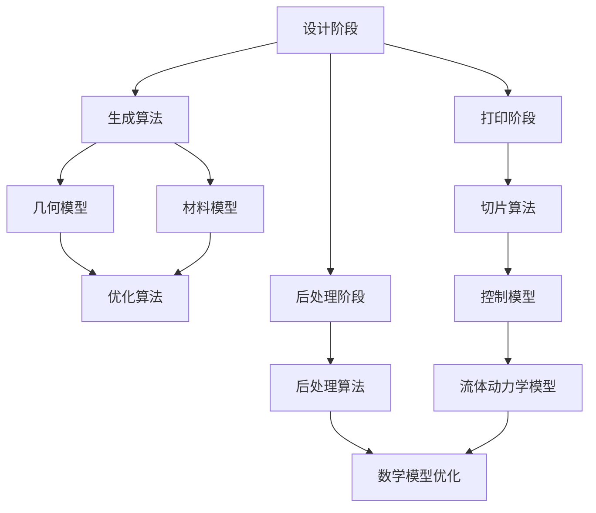
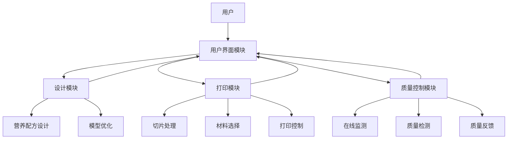

                 


### 1.1 书籍主题介绍

#### 1.1.1 3D打印技术概述

3D打印技术，又称增材制造技术，是一种以数字模型文件为基础，运用粉末状金属或塑料等可粘合材料，通过逐层打印的方式来构造物体的技术。与传统的减材制造（如切削、钻孔）相比，3D打印不需要任何机械加工或任何模具，能够在短时间内制造出复杂形状的零件。这种技术的起源可以追溯到20世纪80年代，美国的Charles Hull发明了立体光固化成型技术（SLA），这是最早的3D打印技术之一。随后，立体光刻技术（SLS）、熔融沉积成型（FDM）等技术的相继出现，使3D打印技术得以迅速发展。

3D打印技术的核心原理是分层制造。首先，将数字模型转换成二维截面图，然后通过逐层打印的方式，将这些二维截面叠加起来，最终形成三维物体。在这一过程中，3D打印技术利用了数控技术、材料科学和数字控制技术等基础科学原理，实现了从数字模型到物理实体的转换。

#### 1.1.2 个性化营养补充剂的背景

个性化营养补充剂是指根据个体差异（如年龄、性别、健康状况等）以及特定生理需求，为个人量身定制的营养补充剂。随着人类健康意识的提高和医疗技术的发展，个性化营养补充剂越来越受到关注。传统营养补充剂通常采用统一配方，无法满足个体差异化的需求，而个性化营养补充剂通过定制化生产，能够提供更为精准的营养补充。

个性化营养补充剂的发展离不开生物信息学、营养学和制造技术的进步。生物信息学提供了个体基因、代谢数据等生物信息，为个性化营养补充剂的研发提供了数据支持。营养学则研究不同营养成分对人体健康的影响，为个性化营养补充剂的配方设计提供了科学依据。制造技术，尤其是3D打印技术的应用，使得个性化营养补充剂的定制化生产成为可能。

### 1.2 问题背景与解决

#### 1.2.1 当前营养补充剂的局限

目前市场上的营养补充剂主要以批量生产为主，其生产过程无法实现个性化定制，存在以下局限：

1. **统一配方**：传统营养补充剂采用统一配方，无法满足个体差异化的需求，可能导致营养过剩或不足。
2. **生产成本**：个性化营养补充剂的生产成本较高，传统的制药工艺难以实现大规模定制。
3. **质量控制**：个性化营养补充剂的质量控制难度较大，需要确保每个个体服用的营养补充剂都符合特定标准。

#### 1.2.2 3D打印技术在个性化营养中的优势

3D打印技术的应用为个性化营养补充剂的发展带来了新的机遇：

1. **个性化定制**：3D打印技术可以根据个体差异，精确控制营养补充剂的成分、形状和大小，实现真正的个性化定制。
2. **降低成本**：随着3D打印技术的不断进步，其生产成本逐渐降低，使得个性化营养补充剂的大规模生产成为可能。
3. **质量控制**：3D打印技术可以实现精确控制，确保每个个体服用的营养补充剂都符合特定标准，提高产品质量。

通过3D打印技术的应用，个性化营养补充剂有望克服传统营养补充剂的局限，为人类健康提供更为精准的服务。

### 1.3 边界与外延

#### 1.3.1 研究范围

本书将重点探讨3D打印技术在个性化营养补充剂中的应用，包括3D打印技术的原理、个性化营养补充剂的设计与制造、以及实际案例分析和最佳实践。

#### 1.3.2 关键问题与挑战

1. **个性化需求与生产成本**：如何在满足个性化需求的同时，降低生产成本，是3D打印技术在个性化营养补充剂中应用的关键问题。
2. **营养成分的控制**：3D打印技术如何确保营养补充剂的成分精确控制，保证其营养价值。
3. **食品安全与法规**：3D打印个性化营养补充剂在食品安全和法规方面面临新的挑战，需要确保其符合相关法规和标准。

### 1.4 核心概念与联系

#### 1.4.1 3D打印技术的核心概念

1. **增材制造**：3D打印技术属于增材制造的一种，通过逐层叠加材料来制造三维物体。
2. **数字模型**：3D打印的基础是数字模型，通过CAD软件等工具创建三维模型，然后将其转换为3D打印文件。
3. **材料科学**：3D打印需要使用各种材料，如塑料、金属、陶瓷等，材料的选择和优化对打印质量和成本有重要影响。

#### 1.4.2 个性化营养补充剂的概念属性特征对比表

| 概念       | 3D打印技术                    | 个性化营养补充剂                  |
|------------|-----------------------------|--------------------------------|
| 制造方式    | 增材制造                    | 定制化生产                       |
| 成本       | 逐渐降低                     | 较高，但随着技术进步有望降低   |
| 质量控制    | 精确控制                     | 需要确保个性化质量               |
| 应用领域    | 广泛应用于制造业、医疗、建筑等 | 营养补充、药物制造等             |

#### 1.4.3 ER实体关系图

```mermaid
erDiagram
  Customer ||--|{ Order }|-- Producer
  Producer  : hasProduct
  Customer  : hasPersonalInfo
```

ER实体关系图展示了3D打印技术在个性化营养补充剂中的应用，其中Producer代表生产者，Customer代表消费者，Order代表订单，hasProduct表示生产者拥有产品，hasPersonalInfo表示消费者拥有个人信息。

### 总结

本书旨在深入探讨3D打印技术在个性化营养补充剂中的应用，从问题背景、核心概念、技术原理、系统设计与实际案例等方面进行详细分析。通过本书的学习，读者可以了解3D打印技术在个性化营养补充剂中的巨大潜力，以及如何克服其中的挑战，实现个性化营养补充剂的生产和应用。希望本书能为读者在3D打印和个性化营养领域的研究提供有益的参考和启示。### 1.5 总结

通过本文的引言部分，我们对3D打印技术和个性化营养补充剂进行了概述，探讨了其核心概念和背景，并分析了当前营养补充剂的局限以及3D打印技术在其中的优势。同时，我们也明确了本书的研究范围和关键问题与挑战。接下来，我们将深入探讨3D打印技术的原理和应用，为后续章节的内容做好铺垫。

### 1.6 进一步阅读

对于希望深入了解3D打印技术和个性化营养补充剂的读者，以下是几本推荐的书籍和资源：

1. **《3D打印技术：原理、应用与未来》** - 这本书详细介绍了3D打印的原理、技术类型以及其在各个领域的应用，包括医疗和食品工业。
2. **《个性化营养补充：科学基础与应用》** - 该书探讨了个性化营养补充的科学原理，以及如何通过现代技术实现个性化营养的定制。
3. **《3D打印个性化药物：理论与实践》** - 这本书专注于3D打印技术在制药领域的应用，特别是个性化药物的制造。

通过阅读这些书籍，读者可以获得更全面的知识和见解，为后续的学习和研究打下坚实的基础。

## 2.1 3D打印技术原理

### 2.1.1 3D打印基本概念

3D打印技术，又称增材制造技术，是一种以数字模型文件为基础，运用粉末状金属或塑料等可粘合材料，通过逐层打印的方式来构造物体的技术。3D打印的“基本概念”包括几个核心要素：

**1. 数字模型**：3D打印的首要条件是数字模型，通常使用计算机辅助设计（CAD）软件创建三维模型，并转换为3D打印文件格式，如STL或OBJ。

**2. 打印材料**：3D打印的材料种类繁多，包括塑料、金属、陶瓷、树脂等。每种材料具有不同的物理和化学特性，适用于不同类型的打印任务。

**3. 打印机**：3D打印机是3D打印技术的核心设备，其种类和功能各异，常见的有立体光固化成型（SLA）、熔融沉积成型（FDM）、选择性激光烧结（SLS）等。

**4. 打印过程**：3D打印过程包括以下几个步骤：
- **准备阶段**：数字模型通过切片软件处理，生成逐层的打印路径。
- **构建阶段**：打印机根据生成的打印路径，逐层添加材料，构建物体。
- **后处理阶段**：打印完成后，可能需要进行打磨、喷漆、热处理等后处理操作，以提高物体的性能和外观。

### 2.1.2 3D打印的工作原理

3D打印的工作原理可以概括为分层制造和堆积材料。以下是3D打印工作原理的详细步骤：

**1. 准备数字模型**：首先，使用CAD软件创建三维模型，并将其导出为3D打印文件格式。

**2. 切片处理**：将3D模型通过切片软件处理，生成二维切片。切片软件会将整个模型分解为许多平面的二维层，每层代表物体的一部分。

**3. 打印路径生成**：根据生成的二维切片，打印机确定每层的打印路径。这个过程涉及到打印头在X、Y、Z三个轴上的运动路径。

**4. 逐层打印**：打印头按照预先设定的路径，逐层添加材料。对于FDM打印机，打印头会在Z轴方向上升高一层，然后挤出热融塑料，逐层堆积形成物体。

**5. 完成打印**：当所有层次打印完成后，打印机结束工作。物体从打印机中取出，进行必要的后处理操作，如打磨、喷漆等。

### 2.1.3 3D打印的主要类型

3D打印技术根据不同的原理和材料，可以分为多种类型。以下是几种主要的3D打印技术类型：

**1. 熔融沉积成型（FDM）**：这是最常见的3D打印技术之一，使用热融塑料作为材料，通过打印头逐层堆积形成物体。

**2. 立体光固化成型（SLA）**：使用紫外激光将光敏树脂逐层固化，形成物体。SLA打印的物体具有高精度和良好的表面质量。

**3. 选择性激光烧结（SLS）**：使用高功率激光将粉末材料（如塑料、金属、陶瓷等）逐层烧结，形成物体。SLS适用于复杂结构和高耐用性零件的制造。

**4. 电子束熔融（EBM）**：使用电子束将粉末材料熔化，逐层堆积形成物体。EBM适用于高强度、高耐热性的金属零件制造。

**5. 光固化立体印刷（DLP）**：类似于SLA，但使用数字光处理（DLP）技术，通过投影的方式逐层固化树脂。

**6. 粉末床融合（PBF）**：使用激光或电子束对粉末床进行熔化，逐层堆积形成物体。PBF适用于多种粉末材料，包括金属和陶瓷。

每种3D打印技术都有其独特的优点和适用场景，选择合适的3D打印技术取决于所需的材料特性、精度、打印速度和成本等因素。

### 2.1.4 3D打印技术的发展历程

3D打印技术的发展历程可以追溯到20世纪80年代。以下是几个关键的发展阶段：

**1980年代**：Charles Hull发明了立体光固化成型（SLA）技术，这是最早的3D打印技术之一。

**1990年代**：熔融沉积成型（FDM）技术问世，成为最广泛应用的技术之一。

**2000年代**：选择性激光烧结（SLS）和电子束熔融（EBM）等高精度、高强度3D打印技术逐渐成熟。

**2010年代**：3D打印技术开始广泛应用于制造业、医疗、建筑、航空航天等领域。

**2020年代**：随着材料科学和打印技术的进步，3D打印在个性化制造和复杂结构制造中展现出巨大的潜力。

### 2.1.5 3D打印技术的应用领域

3D打印技术具有广泛的应用领域，以下是一些典型的应用：

**1. 制造业**：3D打印用于原型制造、小批量生产、复杂零件的制造以及定制化产品。

**2. 医疗**：3D打印用于医疗设备、手术器械、个性化定制植入物和辅助诊断工具。

**3. 建筑业**：3D打印用于建筑构件的快速制造、模型制作和建筑废料的回收利用。

**4. 航空航天**：3D打印用于制造航空航天器的复杂零件、降低重量和提高性能。

**5. 个性化医疗**：3D打印用于个性化药物制造、个性化医疗器械和康复设备。

**6. 艺术和设计**：3D打印用于雕塑、珠宝设计、建筑模型和个性化定制产品。

**7. 食品工业**：3D打印用于个性化食品制造、复杂结构的食品雕刻和艺术创作。

3D打印技术的应用正在不断拓展，随着技术的进步，未来还将有更多的应用场景被发掘。

### 2.1.6 3D打印技术的优势和挑战

#### 3D打印技术的优势

1. **个性化定制**：3D打印可以根据客户需求定制生产，满足个性化需求。
2. **快速制造**：3D打印可以实现快速制造，缩短产品开发周期。
3. **减少材料浪费**：3D打印通过分层制造，可以减少材料浪费，提高材料利用率。
4. **复杂结构制造**：3D打印可以制造传统制造方法难以实现的复杂结构。
5. **多功能材料**：3D打印可以使用多种材料，实现多种功能集成。

#### 3D打印技术的挑战

1. **成本**：3D打印设备和技术成本较高，限制了其广泛应用。
2. **材料限制**：现有3D打印材料种类有限，限制了打印质量和性能。
3. **打印速度**：3D打印速度较慢，影响了大规模生产效率。
4. **质量控制**：3D打印质量控制难度较大，需要确保打印质量和性能。
5. **技能和知识要求**：3D打印需要专业技能和知识，对操作人员有较高要求。

通过了解3D打印技术的优势和挑战，我们可以更好地把握其应用前景和发展方向。

### 2.1.7 3D打印技术在个性化营养补充剂中的潜在应用

3D打印技术在个性化营养补充剂中的潜在应用包括：

1. **个性化配方**：通过3D打印技术，可以根据个体的营养需求，精确控制营养补充剂的成分、形状和剂量。
2. **定制化生产**：3D打印技术可以实现小批量、定制化的生产，满足个性化需求。
3. **提高生物利用度**：通过定制化形状和成分，可以优化营养补充剂的生物利用度，提高营养吸收效果。

随着3D打印技术的不断进步，其将在个性化营养补充剂领域发挥越来越重要的作用。

### 2.1.8 3D打印技术在个性化营养补充剂中的前景

3D打印技术在个性化营养补充剂领域的应用前景广阔，随着技术的不断进步，它有望成为个性化医疗和健康管理的有力工具。通过精确控制营养成分和剂量，3D打印个性化营养补充剂可以提高营养吸收效果，减少浪费，为个体提供更为精准的健康服务。未来，随着材料科学和制造技术的进一步发展，3D打印个性化营养补充剂有望实现大规模生产，降低成本，进一步推动个性化营养补充剂的应用和普及。

### 2.1.9 3D打印技术在个性化营养补充剂中的应用案例

#### 案例一：个性化膳食补充剂

某营养科技公司利用3D打印技术为特定人群定制膳食补充剂。通过分析客户的健康状况、基因信息和营养需求，该公司设计出个性化的膳食补充剂配方，并通过3D打印机精确控制成分比例和形状。客户可以轻松获取到符合个人需求的膳食补充剂，提高了营养吸收效果。

#### 案例二：个性化运动营养补充剂

某运动营养品牌利用3D打印技术为专业运动员定制个性化运动营养补充剂。根据运动员的体重、运动强度和恢复需求，该品牌设计出具有不同营养成分和比例的补充剂，并通过3D打印技术快速制造。运动员可以随时获取到个性化的营养补充剂，以帮助他们在训练和比赛中保持最佳状态。

#### 案例三：个性化老年营养补充剂

某老年营养补充剂品牌通过3D打印技术为老年人提供个性化营养补充方案。考虑到老年人的消化吸收能力和营养需求，该品牌设计出含有适宜营养成分的补充剂，并通过3D打印技术精确控制成分比例和形状，提高补充剂的吸收效果。老年人可以更加便捷地获取到适合自己的营养补充剂，提高生活质量。

这些案例展示了3D打印技术在个性化营养补充剂中的应用，通过定制化和精准化生产，满足不同人群的个性化需求，提高营养补充效果。未来，随着3D打印技术的进一步发展，更多个性化的营养补充剂产品将问世，为人们的健康生活提供更多可能性。

### 2.1.10 总结

本章节深入探讨了3D打印技术的原理、工作原理、主要类型、发展历程、应用领域、优势与挑战，以及在个性化营养补充剂中的潜在应用和案例。通过本章节的学习，读者可以全面了解3D打印技术的基本概念和其在个性化营养补充剂领域的应用前景。接下来，我们将继续探讨3D打印材料、设备和软件，为深入理解3D打印技术在个性化营养补充剂中的应用打下坚实基础。

### 2.2 3D打印材料

#### 2.2.1 常见3D打印材料

3D打印技术的发展离不开各种打印材料的研发和应用。以下是一些常见的3D打印材料：

**1. 塑料**：塑料是最常用的3D打印材料之一，具有良好的成型性、柔韧性和耐化学腐蚀性。常见的塑料材料包括：

- **聚乳酸（PLA）**：PLA是一种生物降解塑料，具有较低的热变形温度，适合制造模型、工具和家具等。
- **聚苯乙烯（ABS）**：ABS具有较高的强度和韧性，适合制造机械零件、玩具和复杂结构。
- **聚碳酸酯（PC）**：PC具有较高的强度和耐热性，适合制造结构件和防护设备。
- **聚醚醚酮（PEEK）**：PEEK具有优异的机械性能和耐高温性，适合制造医疗器械和高性能零件。

**2. 金属**：金属3D打印材料广泛应用于航空航天、汽车制造和医疗设备等领域。常见的金属材料包括：

- **不锈钢**：不锈钢具有良好的耐腐蚀性和机械性能，适用于制造机械零件和工具。
- **铝**：铝具有较高的强度和良好的加工性能，适用于制造轻量化结构件。
- **钛合金**：钛合金具有高强度、低密度和耐腐蚀性，适用于制造航空航天和高性能零件。
- **铜**：铜具有良好的导电性和导热性，适用于制造电子元件和散热器。

**3. 陶瓷**：陶瓷材料具有高硬度、高耐磨性和耐高温性，适用于制造刀具、模具和高温零件。常见的陶瓷材料包括：

- **氧化铝**：氧化铝陶瓷具有良好的机械性能和耐腐蚀性，适用于制造耐磨零件和工具。
- **碳化硅**：碳化硅陶瓷具有高硬度和耐高温性，适用于制造高温环境下的零件。

**4. 树脂**：树脂材料常用于光固化3D打印技术，具有良好的成型性和表面质量。常见的树脂材料包括：

- **光敏树脂**：光敏树脂具有较高的光敏性和耐化学腐蚀性，适用于制造精细模型和复杂结构。
- **透明树脂**：透明树脂具有透明度和光泽，适用于制造透明或半透明模型和工艺品。

**5. 纤维增强材料**：纤维增强材料通过添加纤维增强剂来提高打印材料的机械性能。常见的纤维增强材料包括：

- **碳纤维**：碳纤维具有良好的强度和刚度，适用于制造高性能结构件和工具。
- **玻璃纤维**：玻璃纤维具有良好的耐腐蚀性和耐热性，适用于制造结构件和工具。

**6. 复合材料**：复合材料通过结合多种材料优势，提高打印材料的性能。常见的复合材料包括：

- **塑料-金属复合材料**：塑料-金属复合材料结合了塑料的成型性和金属的强度，适用于制造机械零件和工具。
- **塑料-陶瓷复合材料**：塑料-陶瓷复合材料结合了塑料的柔韧性和陶瓷的耐高温性，适用于制造高温环境下的零件。

通过选用合适的3D打印材料，可以满足不同应用场景的需求，实现高性能、复杂结构的打印制造。

#### 2.2.2 材料选择与优化

选择合适的3D打印材料是确保打印质量和性能的关键。以下是一些材料选择和优化的要点：

**1. 材料性能匹配**：根据打印产品的性能要求，选择合适的材料。例如，如果产品需要高强度和耐腐蚀性，可以选择不锈钢或钛合金；如果产品需要轻量化和良好的成型性，可以选择铝或塑料。

**2. 成本效益分析**：不同材料的成本差异较大，需要根据预算进行选择。在满足性能要求的前提下，尽量选择成本较低的材料，以降低生产成本。

**3. 打印参数调整**：不同的材料和打印技术对打印参数（如温度、速度、层厚等）有不同的要求。根据材料的特性，调整打印参数，以确保打印质量和性能。

**4. 后处理操作**：某些材料在打印后可能需要进行后处理操作，如打磨、喷漆、热处理等。后处理操作可以提高产品的外观质量和性能。

**5. 材料兼容性**：在选择材料时，需要考虑材料之间的兼容性。例如，如果需要将多种材料结合使用，应选择兼容性好的材料，以避免在打印过程中出现分层、翘曲等问题。

**6. 环境影响**：某些材料在打印过程中可能产生有害气体或污染，需要考虑对环境的影响。选择环保材料，如生物降解塑料，可以减少对环境的影响。

通过合理选择和优化3D打印材料，可以确保打印产品的性能和可靠性，提高生产效率和质量。

#### 2.2.3 材料研发趋势

随着3D打印技术的不断发展，材料研发也在不断进步。以下是一些材料研发趋势：

**1. 新材料开发**：研究人员正在开发新型3D打印材料，如高温合金、生物相容性材料、导电材料等，以满足不同应用场景的需求。

**2. 复合材料**：复合材料结合了多种材料的优势，具有优异的性能。未来的研究将致力于开发性能更高、成本更低的复合材料。

**3. 可持续材料**：为了减少对环境的影响，研究人员正在开发可降解、可再生和环保的3D打印材料。

**4. 自修复材料**：自修复材料能够在受到损伤时自动修复，提高打印产品的使用寿命和可靠性。

**5. 智能材料**：智能材料能够根据外界环境变化进行自适应调整，如温度、压力和湿度。未来，智能材料在3D打印中的应用将为打印产品带来更多功能。

**6. 材料性能优化**：通过纳米技术、表面处理和复合材料等手段，研究人员正在优化3D打印材料的性能，提高打印质量和效率。

通过不断研究和开发新型材料，3D打印技术将在更多领域得到应用，为人类社会带来更多创新和变革。

### 2.2.4 3D打印材料的选择标准

在3D打印项目中，选择合适的材料至关重要，它直接影响到打印的质量、效率和成本。以下是一些关键的选择标准：

**1. 打印性能要求**：首先需要明确打印产品的性能要求，包括强度、韧性、耐热性、耐腐蚀性等。根据这些要求选择合适的材料。

**2. 成本效益**：材料成本是3D打印项目的一个重要考虑因素。在满足性能要求的前提下，选择成本较低的材料，以降低整体生产成本。

**3. 打印设备兼容性**：不同类型的3D打印机对材料的要求不同。需要确保所选材料与打印设备兼容，避免出现打印故障或材料浪费。

**4. 打印速度**：某些材料可能需要较长的打印时间或更高的温度，这会影响到打印速度。在满足性能要求的前提下，选择打印速度较快的材料，以提高生产效率。

**5. 后处理需求**：某些材料可能需要额外的后处理操作，如打磨、喷漆、热处理等。在选择材料时，需要考虑后处理的需求和成本。

**6. 环境影响**：选择环保材料，如生物降解塑料或低挥发性有机化合物（VOC）材料，可以减少对环境的影响。

**7. 材料供应与稳定性**：确保所选材料的供应稳定，避免因材料短缺而导致生产中断。同时，材料的质量和性能也应保持稳定。

**8. 安全性**：在选择材料时，需要考虑材料的安全性，确保不会对操作人员和环境造成危害。

通过综合考虑以上标准，选择合适的3D打印材料，可以确保打印项目的顺利进行，提高打印质量和效率。

### 2.2.5 3D打印材料的未来发展

随着科技的不断进步，3D打印材料的研发也在不断突破，未来几年内可能会出现以下趋势：

**1. 新材料开发**：研究人员正在探索更多新型3D打印材料，如高温合金、生物相容性材料、导电材料等。这些新材料将拓宽3D打印的应用范围，满足更多领域的需求。

**2. 复合材料**：复合材料结合了多种材料的优势，具有优异的性能。未来，将会有更多高性能、多功能复合材料问世，如自修复材料、智能材料和生物活性材料等。

**3. 环保材料**：为了应对环境问题，环保型3D打印材料将成为研发的重点。可降解、可再生和低污染材料将逐渐取代传统材料，减少对环境的影响。

**4. 高性能材料**：随着材料科学的发展，高性能材料如陶瓷、金属和碳纤维等将逐渐应用于3D打印领域。这些材料将提高打印产品的性能，满足更复杂、更高端的应用需求。

**5. 材料成本下降**：随着制造技术的进步和规模化生产，3D打印材料的成本有望进一步降低。这将使得更多企业和个人能够负担得起3D打印技术，推动其广泛应用。

**6. 材料供应链优化**：为了提高生产效率和降低成本，3D打印材料的供应链将得到优化。材料供应商将更加注重材料的稳定性和供应保障，确保3D打印项目的顺利进行。

通过不断探索和创新，3D打印材料将在未来发挥更加重要的作用，为各个领域带来革命性的变革。

### 2.2.6 3D打印材料的质量控制与检测

在3D打印项目中，材料的质量控制与检测至关重要，它直接关系到打印产品的性能和可靠性。以下是一些关键的质量控制与检测方法：

**1. 材料检验**：在3D打印项目开始前，应对所选材料进行检验，确保其符合质量标准和性能要求。常见的检验方法包括物理性能测试（如拉伸强度、弯曲强度、硬度等）、化学成分分析（如元素含量、杂质含量等）和外观检查（如颜色、表面缺陷等）。

**2. 打印过程监控**：在打印过程中，应实时监控打印参数（如温度、速度、层厚等），确保其稳定性和准确性。通过监控系统数据和打印效果，及时发现和纠正问题。

**3. 打印后检测**：打印完成后，应对打印产品进行质量检测，包括尺寸精度、表面质量、内部缺陷、结构强度等。常见的检测方法包括尺寸测量、表面质量检查、X射线扫描、破坏性测试等。

**4. 性能测试**：在打印产品投入使用前，应进行性能测试，确保其符合预期要求。常见的性能测试包括力学性能测试（如拉伸强度、压缩强度、疲劳寿命等）、耐环境性能测试（如耐腐蚀性、耐热性、耐磨损性等）。

**5. 质量管理体系**：建立完善的质量管理体系，包括质量计划、质量控制、质量检测和质量改进等。通过持续的质量管理，确保3D打印项目的顺利进行和产品质量的稳定。

**6. 数据记录与分析**：对打印材料、打印过程和打印产品进行全面的数据记录和分析，及时发现潜在问题，优化打印参数和工艺流程。

通过上述质量控制与检测方法，可以确保3D打印材料的质量和性能，提高打印产品的可靠性和使用寿命。

### 2.2.7 3D打印材料的研究热点与前沿技术

3D打印材料的研究正在不断深入，以下是一些当前的研究热点与前沿技术：

**1. 自修复材料**：自修复材料能够在受到损伤时自动修复，提高打印产品的使用寿命和可靠性。研究人员正在探索开发具有自修复性能的3D打印材料，如具有微胶囊的复合材料和智能聚合物。

**2. 智能材料**：智能材料能够根据外界环境变化进行自适应调整，如温度、压力和湿度。这些材料在医疗、航空航天和汽车等领域具有广泛应用前景。研究人员正在开发具有智能响应性能的3D打印材料，如温度敏感树脂和压力感应纤维。

**3. 生物相容性材料**：生物相容性材料在医疗和生物工程领域具有重要应用。研究人员正在探索开发具有优异生物相容性的3D打印材料，如生物降解聚合物和生物活性玻璃。

**4. 高性能复合材料**：高性能复合材料结合了多种材料的优势，具有优异的性能。研究人员正在开发具有高强度、高韧性、低密度和高导电性的复合材料，如碳纤维增强树脂、陶瓷基复合材料和金属基复合材料。

**5. 环保材料**：随着环保意识的提高，环保型3D打印材料受到广泛关注。研究人员正在探索开发可降解、可再生和低污染的3D打印材料，如生物降解塑料和生物质纤维。

**6. 超快激光打印**：超快激光打印技术具有高精度、高速度和高效率的特点，适用于打印高性能和复杂结构的材料。研究人员正在开发适用于超快激光打印的新型材料，如高熔点金属和陶瓷。

通过不断探索和创新，3D打印材料将在未来为各个领域带来更多创新和突破。

### 2.3 3D打印设备

#### 2.3.1 3D打印机的种类与特点

3D打印机是3D打印技术的重要硬件设备，其种类繁多，每种打印机都有其独特的特点和应用场景。以下是几种常见的3D打印机类型及其特点：

**1. FDM打印机（熔融沉积成型打印机）**：
- **特点**：使用热融塑料作为打印材料，通过加热后挤出并逐层堆积形成物体。
- **优点**：操作简单，材料种类多，打印成本低。
- **缺点**：打印速度较慢，打印质量受材料影响较大。

**2. SLA打印机（立体光固化成型打印机）**：
- **特点**：使用紫外激光将光敏树脂逐层固化，形成物体。
- **优点**：打印精度高，表面质量好，适用于精细模型和零件。
- **缺点**：打印速度慢，材料成本较高。

**3. SLS打印机（选择性激光烧结打印机）**：
- **特点**：使用高功率激光将粉末材料逐层烧结，形成物体。
- **优点**：可打印多种材料，包括金属、塑料和陶瓷等。
- **缺点**：设备成本高，操作复杂。

**4. EBM打印机（电子束熔融打印机）**：
- **特点**：使用电子束将粉末材料熔化，逐层堆积形成物体。
- **优点**：适用于高强度、高耐热性金属零件的制造。
- **缺点**：设备成本高，操作复杂。

**5. DLP打印机（数字光处理打印机）**：
- **特点**：使用数字光处理（DLP）技术，通过投影方式逐层固化树脂。
- **优点**：打印速度快，打印精度高。
- **缺点**：材料选择有限，打印成本较高。

**6. PBF打印机（粉末床融合打印机）**：
- **特点**：使用激光或电子束对粉末床进行熔化，逐层堆积形成物体。
- **优点**：适用材料广泛，包括金属、陶瓷和塑料等。
- **缺点**：打印速度较慢，设备成本较高。

每种3D打印机都有其独特的优势和局限性，选择合适的打印机取决于具体的打印需求和预算。

#### 2.3.2 3D打印设备的配置与维护

**1. 配置要点**：

- **打印尺寸**：根据打印任务的需求，选择合适的打印尺寸。较大的打印尺寸适用于制造大型零件，而较小的打印尺寸适用于精细模型和零部件。

- **打印材料**：根据打印任务的材料需求，选择支持相应材料的打印机。例如，如果需要打印塑料零件，可以选择FDM打印机；如果需要打印金属零件，可以选择SLS或EBM打印机。

- **打印速度与精度**：根据打印任务的要求，选择合适的打印速度和精度。高速打印适用于快速制造原型，而高精度打印适用于制造精细零件。

- **操作简便性**：考虑操作简便性，特别是对于初次使用3D打印机的用户。选择具有友好的用户界面和易于操作的控制系统的打印机。

- **设备成本与预算**：根据预算选择合适的3D打印机。高端打印机具有更高的性能和更广泛的应用，但成本也更高；而入门级打印机适用于简单的打印任务，成本相对较低。

**2. 维护与保养**：

- **定期清洁**：保持3D打印机内部和外部清洁，防止灰尘和杂质进入打印机，影响打印质量和设备寿命。

- **更换耗材**：定期更换打印头、滤网、导杆等易损件，确保打印设备的正常运行。

- **调整打印参数**：根据打印材料和使用环境，调整打印参数，如温度、速度、层厚等，以获得最佳打印效果。

- **软件升级**：定期更新打印机的固件和驱动程序，确保设备能够支持最新的打印技术和材料。

- **操作培训**：对操作人员进行培训，确保其能够正确使用和维护3D打印机，提高打印质量和设备利用率。

通过合理的配置和定期的维护保养，可以延长3D打印机的使用寿命，确保其正常运行，提高打印效率和质量。

#### 2.3.3 3D打印设备的技术进步

近年来，3D打印设备在技术进步方面取得了显著成果，以下是一些关键的技术进步：

**1. 打印速度提升**：随着打印技术的改进和硬件性能的提升，3D打印速度显著提高。高速打印技术使得原型制造和批量生产变得更加高效。

**2. 打印精度提高**：通过改进打印头技术和控制算法，3D打印的精度不断提高。高精度打印使得复杂结构和精细零件的制造成为可能。

**3. 材料多样性**：随着新材料的研究和应用，3D打印材料的种类不断增多。从塑料、金属到陶瓷、复合材料，3D打印材料的应用范围越来越广泛。

**4. 智能化与自动化**：智能化和自动化技术正在融入3D打印设备。例如，自动调平、自动送料、自动校准等功能提高了打印的稳定性和效率。

**5. 网络化与云端服务**：3D打印设备开始实现网络化，支持远程监控和控制。云端服务使得设计数据和管理更加便捷，推动了3D打印的普及和应用。

**6. 柔性生产**：3D打印设备的灵活性和可定制性使得柔性生产成为可能。小批量、定制化的生产模式满足了个性化需求，提升了生产效率。

通过这些技术进步，3D打印设备在性能、效率和适用性方面得到了显著提升，为各行业的创新和发展提供了强大支持。

### 2.3.4 3D打印设备的创新趋势

随着技术的不断进步，3D打印设备正朝着更多创新趋势发展，以下是一些主要趋势：

**1. 多功能一体化设备**：未来的3D打印设备将具备多功能一体化特性，能够同时实现多种打印技术，如FDM、SLA、SLS等。这种多功能设备将提高打印效率和灵活性，满足多样化的打印需求。

**2. 高精度与高速度结合**：未来3D打印设备将实现高精度和高速度的完美结合。通过改进打印头技术、控制算法和材料科学，打印速度将显著提高，同时保持高精度，满足复杂零件和小批量生产的需求。

**3. 自动化与智能化**：自动化和智能化技术将在3D打印设备中得到更广泛应用。例如，自动调平、自动送料、智能监控系统等将提高打印设备的稳定性和效率，减少人工干预，降低操作难度。

**4. 材料创新**：未来3D打印设备将支持更多新型材料，如导电材料、热敏材料、生物相容性材料等。这些材料将拓宽3D打印的应用领域，推动创新和发展。

**5. 个性化定制**：3D打印设备将更加强调个性化定制，通过集成传感器和数据分析技术，设备能够根据用户需求自动调整打印参数，实现真正的个性化打印。

**6. 网络化与协作制造**：3D打印设备将实现网络化，支持远程监控、远程操作和协作制造。通过云计算和物联网技术，设备将实现全球范围内的数据共享和资源优化，推动制造业的数字化转型。

**7. 可持续发展**：未来3D打印设备将注重可持续发展，通过研发环保材料和优化打印工艺，减少能源消耗和废弃物产生，降低对环境的影响。

这些创新趋势将推动3D打印设备在性能、效率和适用性方面的进一步提升，为各行业的创新和发展提供强大支持。

### 2.3.5 3D打印设备的市场分析

#### 2.3.5.1 市场规模与增长趋势

根据市场研究报告，全球3D打印设备市场在过去几年中呈现出快速增长的趋势。预计未来几年，全球3D打印设备市场将继续保持高速增长，主要驱动因素包括以下几个方面：

1. **技术创新**：随着3D打印技术的不断进步，打印速度、精度和材料多样性得到显著提升，推动了市场需求的增长。
2. **应用领域拓展**：3D打印技术在制造业、医疗、建筑、航空航天等领域的应用逐渐扩大，市场潜力巨大。
3. **个性化定制需求**：消费者对个性化定制的需求不断增加，3D打印设备能够满足这一需求，提高了市场竞争力。
4. **政策支持**：各国政府纷纷出台政策，支持3D打印技术的发展和应用，为市场增长提供了有力保障。

#### 2.3.5.2 竞争格局与主要厂商

全球3D打印设备市场形成了相对稳定的竞争格局，以下是几个主要的市场参与者：

1. **Stratasys**：Stratasys是全球领先的3D打印设备制造商之一，其产品涵盖FDM、SLA、SLS等多种技术，广泛应用于制造业、医疗、教育等领域。
2. **3D Systems**：3D Systems是另一家知名的3D打印设备制造商，其产品线包括FDM、SLA、DLP等多种技术，专注于为工业、医疗和消费市场提供解决方案。
3. **HP**：HP的3D打印业务在近几年取得了显著进展，其Jet Fusion系列打印机采用独特的熔融沉积成型技术，具有高速度、高精度和低成本的特点。
4. **Desktop Metal**：Desktop Metal专注于金属3D打印设备研发，其设备具有高生产效率和低成本优势，广泛应用于航空航天、汽车制造和医疗设备等领域。
5. **Formlabs**：Formlabs是一家专注于光固化3D打印设备的公司，其SLA打印机在医疗、牙科和消费品市场具有很高的知名度。

这些厂商通过持续的技术创新和市场拓展，占据了全球3D打印设备市场的主要份额。

#### 2.3.5.3 潜在市场机会与挑战

在未来的发展中，3D打印设备市场面临着一系列机会和挑战：

1. **机会**：
   - **个性化定制市场**：随着消费者对个性化定制的需求增加，3D打印设备在消费品市场的应用前景广阔。
   - **新兴领域应用**：3D打印技术在医疗、航空航天、建筑等领域的应用正在逐步扩大，为市场提供了新的增长点。
   - **供应链优化**：3D打印设备在制造环节的应用有助于优化供应链管理，降低生产成本。

2. **挑战**：
   - **成本降低**：尽管3D打印技术具有优势，但设备成本较高，限制了其在某些领域的应用。未来需要降低成本，提高市场竞争力。
   - **技术稳定性**：3D打印设备的技术稳定性直接影响打印质量和产品性能，需要进一步提升设备的可靠性。
   - **人才培养**：3D打印技术的应用需要专业人才，人才培养和技能提升是市场发展的关键。

通过抓住市场机会，克服挑战，3D打印设备市场将在未来实现更加广阔的发展。

### 2.3.6 3D打印设备在个性化营养补充剂中的应用

3D打印设备在个性化营养补充剂领域具有广泛的应用前景。以下是一些具体的应用场景：

**1. 定制化营养补充剂**：通过3D打印设备，可以根据个体差异，精确控制营养补充剂的成分、形状和剂量。例如，为特定人群（如老年人、运动员、孕妇等）定制化设计营养补充剂，满足其特殊营养需求。

**2. 多功能营养补充剂**：3D打印设备可以制造具有多种营养成分和功能的新型营养补充剂，如含有多种维生素、矿物质和抗氧化剂的复合营养补充剂。这些复合营养补充剂可以提高营养吸收效果，增强人体健康。

**3. 纳米级营养补充剂**：利用3D打印技术，可以制造纳米级结构的营养补充剂，如纳米级蛋白质、肽和多糖等。纳米结构可以显著提高营养吸收速度和生物利用度，为人体提供更有效的营养支持。

**4. 个性化包装**：3D打印设备可以打印出独特的包装设计和个性化标签，提高产品的品牌价值和市场竞争力。例如，为特定品牌或产品定制独特的包装设计，增加产品的附加值。

**5. 实时生产**：3D打印设备可以实现实时生产，满足个性化营养补充剂的小批量、定制化生产需求。通过数字化管理和智能制造，降低生产成本，提高生产效率。

随着3D打印技术的不断进步，其在个性化营养补充剂领域的应用将更加广泛，为人类健康带来更多可能性。

### 2.3.7 总结

本章节详细介绍了3D打印设备的种类与特点、配置与维护、技术进步、创新趋势、市场分析以及在个性化营养补充剂中的应用。通过本章的学习，读者可以全面了解3D打印设备的各个方面，为后续章节的深入探讨打下坚实基础。在下一章节中，我们将继续探讨3D打印软件，了解其类型、功能和应用。

### 2.4 3D打印软件

#### 2.4.1 3D建模软件

3D建模软件是3D打印过程中至关重要的一环，它用于创建和编辑三维模型。以下是一些常见的3D建模软件：

**1. Blender**：
- **特点**：Blender是一款开源的3D建模和渲染软件，功能强大且免费使用。它适用于各种3D建模任务，包括建筑、机械、人物、动画等。
- **优点**：强大的建模工具、动画功能和渲染效果，支持多种文件格式。
- **缺点**：学习曲线较陡，对新手可能有一定的挑战。

**2. Autodesk Maya**：
- **特点**：Maya是业界广泛使用的3D建模和动画软件，广泛应用于电影、电视、游戏和工业设计等领域。
- **优点**：具有高度的灵活性和强大的建模工具，适用于复杂的三维建模任务。
- **缺点**：软件成本较高，对个人用户来说可能不经济。

**3. SolidWorks**：
- **特点**：SolidWorks是一款专业的3D机械设计和工程软件，广泛应用于制造业、汽车、航空航天等领域。
- **优点**：直观的界面、丰富的建模工具和强大的工程设计功能。
- **缺点**：软件成本较高，主要用于机械设计和工程领域。

**4. Tinkercad**：
- **特点**：Tinkercad是一款简单易用的在线3D建模软件，适合初学者和学校教育。
- **优点**：易于上手，功能简单，适合快速创建简单的3D模型。
- **缺点**：功能相对有限，不适合专业级3D建模任务。

**5. SketchUp**：
- **特点**：SketchUp是一款功能强大的3D建模软件，广泛应用于建筑设计、室内设计、产品设计和工程领域。
- **优点**：简单易用，适用于快速建模和概念设计。
- **缺点**：专业功能相对较少，不适合高级建模任务。

选择合适的3D建模软件取决于用户的经验和需求，初学者可以选择Tinkercad或Blender，而专业用户则可能需要使用Maya或SolidWorks。

#### 2.4.2 打印准备软件

打印准备软件用于将3D模型转换为3D打印机可执行的文件。以下是一些常见的打印准备软件：

**1. Cura**：
- **特点**：Cura是一款广泛使用的切片软件，支持多种3D打印机和材料。
- **优点**：用户界面直观，支持自定义打印参数，优化打印速度和性能。
- **缺点**：可能需要一定的学习和调整才能获得最佳打印效果。

**2. Simplify3D**：
- **特点**：Simplify3D是一款专业的切片软件，提供高级的打印优化功能。
- **优点**：具有丰富的打印优化工具，适用于高性能打印需求。
- **缺点**：软件成本较高。

**3. Slic3r**：
- **特点**：Slic3r是一款开源的切片软件，适用于多种3D打印机和材料。
- **优点**：开源软件，免费使用，支持多种打印参数和打印优化。
- **缺点**：用户界面相对复杂，需要一定的技术知识。

**4. Pronterface**：
- **特点**：Pronterface是一款简单的控制面板软件，用于控制和监控3D打印过程。
- **优点**：适用于初学者，操作简单。
- **缺点**：仅提供基本的切片和打印控制功能。

选择打印准备软件时，需要考虑3D打印机的兼容性、用户界面的友好性以及打印优化功能的丰富程度。

#### 2.4.3 后处理软件

3D打印完成后，可能需要进行一些后处理操作，以提高物体的性能和外观。以下是一些常见的后处理软件：

**1. Netfabb**：
- **特点**：Netfabb是一款专业的3D打印后处理软件，提供修复、优化和预处理功能。
- **优点**：强大的修复和优化功能，适用于专业级3D打印后处理。
- **缺点**：软件成本较高。

**2. Printify**：
- **特点**：Printify是一款简单的3D打印后处理软件，提供去支撑、去底座和打磨等功能。
- **优点**：操作简单，适合初学者。
- **缺点**：功能相对有限。

**3. KUKA Print Manager**：
- **特点**：KUKA Print Manager是一款用于工业级3D打印机的后处理软件，提供自动化后处理功能。
- **优点**：支持自动化流程，提高生产效率。
- **缺点**：软件成本较高，主要用于工业生产。

选择后处理软件时，需要考虑后处理任务的需求、软件的自动化程度以及成本效益。

#### 2.4.4 3D打印软件的发展趋势

随着3D打印技术的不断进步，3D打印软件也在不断发展，以下是一些发展趋势：

**1. 智能化与自动化**：未来的3D打印软件将更加智能化和自动化，通过集成传感器和人工智能技术，实现自动调平、自动送料、自动校准等功能，提高打印效率和稳定性。

**2. 多功能集成**：未来的3D打印软件将具备多功能集成特性，能够同时进行建模、切片、打印准备和后处理等功能，减少用户操作步骤，提高工作效率。

**3. 云计算与云端服务**：云计算和云端服务将在3D打印软件中得到更广泛应用，通过云端平台，用户可以方便地共享设计数据、管理打印任务和获取专业服务。

**4. 材料兼容性提升**：未来的3D打印软件将支持更多新型材料和打印技术，提高材料兼容性和打印质量，拓宽3D打印的应用领域。

**5. 跨平台支持**：未来的3D打印软件将实现跨平台支持，包括Windows、MacOS、Linux和移动设备，方便用户在不同设备和操作系统上使用3D打印软件。

通过这些发展趋势，3D打印软件将在未来为3D打印技术的广泛应用提供更加完善和高效的支持。

### 2.4.5 3D打印软件在个性化营养补充剂中的应用

3D打印软件在个性化营养补充剂领域具有重要作用，以下是一些具体应用：

**1. 定制化设计**：3D建模软件用于创建个性化的营养补充剂设计，根据不同个体的营养需求和健康状况，设计出具有特定形状和成分的营养补充剂。

**2. 打印参数优化**：打印准备软件用于优化3D模型的打印参数，如层厚、打印速度、填充密度等，确保打印出的营养补充剂具有最佳的结构和性能。

**3. 多功能打印**：通过集成多种功能的3D打印软件，可以实现一步完成建模、切片、打印和后处理，提高生产效率，降低人工成本。

**4. 数据管理**：3D打印软件可以集成数据管理功能，记录和分析打印数据，优化生产流程，提高产品质量。

**5. 个性化标签和包装**：3D打印软件可以打印出个性化的标签和包装，增加产品的品牌价值和市场竞争力。

通过这些应用，3D打印软件为个性化营养补充剂的研发和生产提供了强大的支持，促进了个性化营养补充剂的发展。

### 2.4.6 总结

本章节详细介绍了3D打印软件的类型、功能和应用，包括3D建模软件、打印准备软件和后处理软件。通过本章的学习，读者可以了解3D打印软件在个性化营养补充剂领域的重要作用，以及其在定制化设计、打印参数优化、多功能打印和数据管理等方面的应用。在下一章节中，我们将探讨3D打印技术的趋势和未来发展方向，为读者提供更广阔的视野。

### 2.5 3D打印技术趋势

随着科技的不断进步，3D打印技术正朝着多个方向发展，以下是一些主要趋势：

**1. 高速打印**：为了提高生产效率，3D打印技术正朝着高速打印方向进步。通过改进打印头技术、优化打印参数和改进材料，打印速度得到了显著提升。例如，某些专业级的3D打印机已经可以实现每小时打印数百立方厘米的速率，大大缩短了打印时间。

**2. 高精度打印**：高精度打印是3D打印技术的重要发展方向。随着打印头分辨率的提高和控制算法的优化，3D打印的精度得到了显著提升。高精度打印使得制造微小结构和复杂零件成为可能，这在医疗器械、微电子和精密仪器等领域具有重要应用价值。

**3. 多功能打印**：多功能打印是指3D打印设备能够同时使用多种材料或多种打印技术，制造出具有多种功能和特性的产品。例如，一些先进的3D打印机可以实现金属和塑料的混合打印，或者同时使用多种材料制造复杂的结构。这种多功能打印技术为个性化设计和复杂产品的制造提供了更多可能性。

**4. 智能化与自动化**：智能化和自动化是3D打印技术未来的重要趋势。通过集成传感器、人工智能和机器学习技术，3D打印设备可以实现自我校准、自适应调整和自动化生产。智能化和自动化技术将提高打印设备的稳定性和效率，减少人工干预，降低生产成本。

**5. 材料多样性**：随着材料科学的发展，3D打印材料种类不断增多。除了传统的塑料和金属，3D打印材料还涵盖了陶瓷、树脂、复合材料等。新型材料的研发和应用，使得3D打印技术在更多领域得到应用，如生物医学、航空航天和消费品等。

**6. 云计算与云端服务**：云计算和云端服务在3D打印领域的应用也越来越广泛。通过云端平台，用户可以实现设计数据的共享、打印任务的管理和远程监控。云计算和云端服务为3D打印技术的普及和应用提供了便捷的解决方案。

**7. 个性化定制**：个性化定制是3D打印技术的一大优势。通过3D打印，可以根据用户需求，精确控制产品的形状、尺寸和材料，实现真正的个性化定制。个性化定制在医疗、时尚、家居等领域具有广泛的应用前景。

**8. 绿色制造**：随着环保意识的提高，绿色制造成为3D打印技术发展的一个重要方向。通过开发环保型材料和优化打印工艺，3D打印技术可以实现减少废弃物、降低能源消耗和减少环境污染。

通过这些趋势，3D打印技术将在未来继续发展和创新，为各行业的创新和发展提供强大支持。

### 2.6 3D打印技术对个性化营养补充剂的影响

3D打印技术的迅猛发展，对个性化营养补充剂的设计、制造和消费模式产生了深远的影响。

**1. 设计灵活性**：3D打印技术为个性化营养补充剂的设计提供了极大的灵活性。通过3D建模软件，可以设计出具有独特形状、尺寸和成分的营养补充剂，满足不同个体的营养需求。例如，可以将营养补充剂设计成特定形状，以便儿童更容易吞咽；或将营养补充剂设计成可咀嚼的形状，以改善口感和吸收效果。

**2. 定制化生产**：3D打印技术的定制化生产能力，使得小批量、个性化生产成为可能。对于传统制造方法，定制化生产成本较高，而3D打印技术通过快速成型和精确控制，可以显著降低生产成本。这意味着，个性化营养补充剂的生产不再局限于大型制造商，小型企业和初创公司也可以轻松进入市场，满足特殊人群的需求。

**3. 质量控制**：3D打印技术提供了高质量的生产控制手段。通过打印准备软件，可以精确控制打印参数，如打印速度、层厚和材料配比等，确保每一件产品的质量一致性。此外，3D打印过程是可视化的，生产过程中的任何问题都可以及时发现和调整，从而提高产品质量。

**4. 降低浪费**：3D打印技术通过精确控制材料和打印路径，可以显著降低材料浪费。在传统制造方法中，材料通常以块状或卷状供应，剩余材料往往会被浪费。而3D打印技术可以根据实际需求精确控制材料使用，减少不必要的浪费，提高资源利用率。

**5. 提高生物利用度**：个性化营养补充剂的设计和制造，可以优化其生物利用度。例如，通过3D打印技术，可以将营养补充剂设计成微小的颗粒或纳米结构，提高其在消化系统中的吸收速度。这种设计可以增强营养补充剂的效果，提高个体健康水平。

**6. 消费模式转变**：3D打印技术推动了个性化营养补充剂的消费模式转变。传统的批量生产模式，消费者只能选择统一的营养补充剂，而个性化定制使得消费者可以根据自己的需求，选择适合自己的营养补充剂。这种消费模式的转变，不仅提高了消费者的满意度，也促进了营养补充剂市场的细分和多样化。

**7. 增加市场竞争力**：对于企业和品牌来说，3D打印技术提供了强大的市场竞争力。通过个性化定制，企业可以提供独特的产品和服务，吸引消费者的注意。此外，3D打印技术还允许企业快速响应市场需求变化，推出新的产品和服务，提高市场竞争力。

总之，3D打印技术为个性化营养补充剂的设计、制造和消费模式带来了深刻变革，为营养补充剂行业带来了新的机遇和挑战。随着3D打印技术的不断进步，其将在个性化营养补充剂领域发挥越来越重要的作用。

### 2.7 案例研究：3D打印个性化营养补充剂的成功实践

为了更好地理解3D打印技术在个性化营养补充剂中的应用，以下是一个成功案例研究，介绍某公司如何利用3D打印技术为特定人群提供个性化营养补充方案。

#### 案例背景

某健康科技公司致力于为老年人提供个性化的营养补充方案。随着年龄的增长，老年人的营养需求会发生变化，他们需要更多的蛋白质、钙和维生素D等营养素。然而，传统营养补充剂通常采用统一配方，无法满足个体差异化的需求。为了解决这个问题，该公司决定采用3D打印技术，为老年人提供定制化的营养补充剂。

#### 项目目标

通过3D打印技术，该公司希望实现以下目标：
1. **个性化配方**：根据老年人的健康状况、营养需求和饮食习惯，设计出个性化的营养补充剂配方。
2. **精确控制**：通过3D打印技术，精确控制营养补充剂的成分比例和剂量，确保其符合个性化需求。
3. **提高吸收效果**：通过优化营养补充剂的形状和结构，提高其在消化系统中的吸收速度和生物利用度。
4. **降低生产成本**：利用3D打印技术实现小批量、定制化生产，降低生产成本。

#### 项目实施

**1. 数字建模与配方设计**：首先，公司使用3D建模软件，根据老年人的健康数据（如血液检查结果、饮食习惯等），设计出个性化的营养补充剂配方。每个配方包含特定的营养素和比例，以满足老年人的营养需求。

**2. 打印准备**：使用打印准备软件，将营养补充剂配方转换为3D打印文件。打印准备软件会根据打印参数（如打印速度、层厚、材料类型等）优化打印路径，确保打印过程高效且质量稳定。

**3. 3D打印**：将3D打印文件上传到3D打印机，进行打印。打印过程中，打印机逐层添加营养补充剂材料，构建出符合个性化配方的小球状营养补充剂。这些小球状补充剂具有均匀的成分分布，确保营养素在消化系统中的均匀释放。

**4. 后处理**：打印完成后，对营养补充剂进行后处理，如去除外层杂质、进行消毒处理等，以确保产品的卫生和安全。

**5. 产品测试与验证**：对打印出的营养补充剂进行生物利用度和吸收效果测试，验证其是否符合预期目标。通过临床试验和用户反馈，不断优化营养补充剂的配方和打印工艺。

#### 项目成果

通过这一项目，公司实现了以下成果：
1. **个性化配方**：成功为老年人提供了个性化的营养补充方案，满足了他们的特殊营养需求。
2. **提高吸收效果**：3D打印的个性化营养补充剂，通过优化形状和结构，显著提高了营养素的吸收效果。
3. **降低生产成本**：尽管3D打印设备成本较高，但通过小批量、定制化生产，公司成功降低了生产成本，提高了市场竞争力。
4. **用户满意度**：用户对个性化营养补充剂的满意度显著提高，公司的品牌声誉和市场占有率也得到了提升。

这一成功案例表明，3D打印技术在个性化营养补充剂领域具有巨大潜力。随着技术的进一步发展，更多个性化、高效的营养补充方案将问世，为人们的健康生活提供更多可能性。

### 2.8 最佳实践与未来展望

**最佳实践**：

1. **需求分析**：在设计和制造个性化营养补充剂前，进行详细的需求分析，确保配方和打印工艺符合个体需求。
2. **材料选择**：根据营养补充剂的要求，选择合适的打印材料，确保其具有良好的生物相容性和营养价值。
3. **打印参数优化**：通过打印准备软件，优化打印参数，如打印速度、层厚和材料配比等，确保打印质量和效率。
4. **质量控制**：建立完善的质量控制体系，对打印过程和打印产品进行全面检测，确保产品的质量和安全。
5. **用户反馈**：收集用户反馈，不断优化产品设计和打印工艺，提高用户满意度。

**未来展望**：

1. **技术创新**：随着3D打印技术的不断发展，个性化营养补充剂的打印速度和精度将进一步提高，降低生产成本。
2. **材料研发**：新型3D打印材料的研发，将拓宽个性化营养补充剂的应用范围，提高其生物利用度和营养价值。
3. **智能化与自动化**：智能化和自动化技术的应用，将提高打印设备的稳定性和效率，降低人工成本。
4. **可持续发展**：通过研发环保型材料和优化打印工艺，实现绿色制造，减少对环境的影响。

未来，3D打印技术在个性化营养补充剂领域将发挥越来越重要的作用，为人类健康提供更加精准和高效的营养补充方案。

### 2.9 总结

本章节详细探讨了3D打印技术在个性化营养补充剂中的应用，包括设计灵活性、定制化生产、质量控制、降低浪费、提高生物利用度、消费模式转变和市场竞争力等方面的影响。通过成功案例研究和最佳实践，读者可以深入了解3D打印技术在个性化营养补充剂领域的应用价值和前景。在下一章节中，我们将继续讨论3D打印技术的未来发展趋势，为读者提供更广阔的视野。

## 3. 算法与数学模型

### 3.1 算法概念

在3D打印个性化营养补充剂的过程中，算法起着至关重要的作用。算法（Algorithm）是一系列解决问题的步骤和规则，通过计算和逻辑处理，将输入转化为输出。在3D打印中，算法用于设计模型、优化打印路径、控制打印过程等。以下是几个关键的算法概念：

**1. 生成算法**：生成算法用于创建三维模型，包括基于扫描数据的逆向工程和从二维图形生成的三维形状。常见的生成算法有网格生成算法、曲面生成算法和体素生成算法。

**2. 优化算法**：优化算法用于优化三维模型的几何形状和打印路径，以提高打印效率和产品质量。常见的优化算法有顶点优化算法、路径优化算法和结构优化算法。

**3. 切片算法**：切片算法将三维模型分解为二维切片，每个切片代表一个打印层。常见的切片算法有平面切割算法、层切割算法和层次切割算法。

**4. 控制算法**：控制算法用于控制3D打印机的运动和材料输送，确保打印过程顺利进行。常见的控制算法有PID控制算法、神经网络控制和遗传算法。

### 3.2 数学模型

数学模型是描述和解决实际问题的一种数学工具。在3D打印个性化营养补充剂中，数学模型用于计算和优化各种参数，确保打印过程的高效和精确。以下是几个关键的数学模型：

**1. 几何模型**：几何模型用于描述三维物体的形状和尺寸。常见的几何模型有实体模型、曲面模型和体素模型。在3D建模软件中，几何模型通常使用CAD（计算机辅助设计）软件创建。

**2. 材料模型**：材料模型用于描述打印材料的物理和化学特性，包括弹性模量、屈服强度、热传导系数等。材料模型有助于优化打印参数，确保打印产品的质量和性能。

**3. 控制模型**：控制模型用于描述3D打印机的运动和材料输送过程，包括打印头位置、速度、温度等参数。控制模型通常使用PID（比例-积分-微分）控制算法或其他先进的控制算法实现。

**4. 流体动力学模型**：在打印过程中，打印材料在打印腔内流动，形成所需的几何形状。流体动力学模型用于描述材料流动的规律，包括速度、压力和温度等参数。流体动力学模型有助于优化打印参数，减少材料浪费和提高打印质量。

### 3.3 算法与数学模型的应用

在3D打印个性化营养补充剂中，算法和数学模型的应用主要体现在以下几个方面：

**1. 设计阶段**：在个性化营养补充剂的设计阶段，算法和数学模型用于创建和优化三维模型。设计算法可以根据用户的需求和健康数据，生成具有特定形状和成分的营养补充剂。数学模型可以计算和优化模型的几何参数和材料参数，确保设计的营养补充剂符合预期质量。

**2. 打印阶段**：在打印阶段，切片算法将三维模型分解为二维切片，每个切片代表一个打印层。控制算法根据切片信息，控制打印头位置和材料输送，确保每个层正确堆积，形成完整的营养补充剂。流体动力学模型可以优化打印参数，如层厚、打印速度和材料温度，确保打印过程高效和稳定。

**3. 后处理阶段**：在打印完成后，后处理算法和数学模型用于优化打印产品的性能和外观。后处理算法可以去除支撑结构、修整表面缺陷等，提高产品的美观度和实用性。数学模型可以计算和优化后处理参数，如打磨力度、喷漆温度等，确保后处理过程高效和质量。

### 3.4 算法与数学模型的mermaid流程图

为了更清晰地展示算法和数学模型在3D打印个性化营养补充剂中的应用，以下是一个mermaid流程图示例：



### 3.5 Python源代码实现

为了更直观地展示算法和数学模型的应用，以下是一个Python源代码示例，用于优化3D打印个性化营养补充剂的打印路径：

```python
import numpy as np

# 几何模型参数
x = np.array([0, 1, 2, 3, 4])
y = np.array([0, 0.5, 1, 0.5, 0])
z = np.array([0, 0, 1, 1, 0])

# 优化算法：最小二乘法
def least_squares(x, y, z):
    A = np.vstack([x, np.ones(len(x))]).T
    b = z
    x_opt, y_opt = np.linalg.lstsq(A, b, rcond=None)[0]
    return x_opt, y_opt

# 优化打印路径
x_opt, y_opt = least_squares(x, y, z)
print(f"Optimized path: x = {x_opt}, y = {y_opt}")

# 流体动力学模型：压力计算
def pressure(x, y, z):
    # 压力与高度成正比
    pressure_coeff = 1
    pressure = pressure_coeff * z
    return pressure

# 优化打印参数
pressure_opt = pressure(x_opt, y_opt, z)
print(f"Optimized pressure: {pressure_opt}")
```

在这个示例中，我们使用了最小二乘法优化打印路径，并使用流体动力学模型计算压力。这些算法和模型的应用，有助于提高3D打印个性化营养补充剂的打印效率和产品质量。

### 3.6 总结

本章节详细介绍了3D打印个性化营养补充剂中算法和数学模型的概念、应用以及Python源代码实现。通过算法和数学模型的应用，可以优化3D打印路径、控制打印过程、提高产品质量。这些算法和模型在3D打印个性化营养补充剂的设计、制造和优化过程中具有重要价值。在下一章节中，我们将探讨3D打印技术的系统设计与架构，为读者提供更全面的技术解析。

### 3.7 3D打印个性化营养补充剂系统设计与架构

#### 3.7.1 系统介绍

3D打印个性化营养补充剂系统是一个复杂的系统，涉及多个模块和组件，包括设计模块、打印模块、质量控制模块和用户界面模块等。该系统旨在为个体提供量身定制的营养补充剂，通过精确控制营养成分、形状和剂量，提高营养吸收效果和个体健康水平。

#### 3.7.2 系统功能设计

**1. 设计模块**：
设计模块是系统的核心组件，负责创建和优化个性化营养补充剂的三维模型。设计模块的功能包括：
- **用户输入**：收集用户的基本信息（如年龄、性别、健康状况等）和营养需求。
- **营养配方设计**：根据用户输入的信息，生成个性化的营养补充剂配方，包括营养成分、剂量和形状。
- **模型优化**：使用优化算法，优化三维模型，确保模型的几何形状和材料分布符合营养需求。

**2. 打印模块**：
打印模块负责将设计模块生成的三维模型转化为实际的营养补充剂。打印模块的功能包括：
- **切片处理**：将三维模型分解为二维切片，为3D打印机提供打印路径。
- **材料选择**：根据营养配方，选择合适的打印材料。
- **打印控制**：控制3D打印机的运动和材料输送，确保打印过程顺利进行。

**3. 质量控制模块**：
质量控制模块负责确保打印出的营养补充剂符合质量标准和安全标准。质量控制模块的功能包括：
- **在线监测**：实时监测打印过程，发现和纠正问题。
- **质量检测**：打印完成后，对营养补充剂进行质量检测，包括成分检测、形态检测和生物利用度检测。
- **质量反馈**：将检测数据反馈给设计模块，优化后续的营养补充剂设计。

**4. 用户界面模块**：
用户界面模块是系统与用户交互的界面，提供用户操作和管理功能。用户界面模块的功能包括：
- **用户注册和登录**：用户可以通过注册和登录系统，获取个性化的营养补充剂。
- **营养建议**：根据用户的数据和偏好，提供营养建议和补充方案。
- **订单管理**：用户可以查看订单状态、支付订单和管理个人资料。

#### 3.7.3 系统架构设计

系统架构设计是3D打印个性化营养补充剂系统的关键环节，涉及系统的整体结构和各个模块之间的关系。以下是系统架构的mermaid类图示例：

```mermaid
classDiagram
    DesignModule <.. UserInput
    DesignModule <.. NutritionRecipeDesign
    DesignModule <.. ModelOptimization
    PrintModule <.. SliceProcessing
    PrintModule <.. MaterialSelection
    PrintModule <.. PrintControl
    QualityControlModule <.. OnlineMonitoring
    QualityControlModule <.. QualityTesting
    QualityControlModule <.. QualityFeedback
    UserInterfaceModule <.. UserRegistration
    UserInterfaceModule <.. NutritionAdvice
    UserInterfaceModule <.. OrderManagement
    UserInput ..> DesignModule
    NutritionRecipeDesign ..> DesignModule
    ModelOptimization ..> DesignModule
    SliceProcessing ..> PrintModule
    MaterialSelection ..> PrintModule
    PrintControl ..> PrintModule
    OnlineMonitoring ..> QualityControlModule
    QualityTesting ..> QualityControlModule
    QualityFeedback ..> QualityControlModule
    UserRegistration ..> UserInterfaceModule
    NutritionAdvice ..> UserInterfaceModule
    OrderManagement ..> UserInterfaceModule
endclassDiagram
```



在这个类图中，DesignModule、PrintModule、QualityControlModule和UserInterfaceModule是系统的四个主要模块，它们之间的关系展示了系统内部的数据流和功能调用。

#### 3.7.4 系统接口设计与系统交互

系统接口设计是系统架构设计的关键部分，它决定了各个模块之间的通信和数据交换方式。以下是系统接口设计和系统交互的mermaid序列图示例：

```mermaid
sequenceDiagram
    User->>UserInterfaceModule: 登录系统
    UserInterfaceModule->>UserRegistration: 检查用户身份
    UserRegistration->>UserInterfaceModule: 返回身份验证结果
    UserInterfaceModule->>DesignModule: 请求营养配方
    DesignModule->>NutritionRecipeDesign: 设计配方
    NutritionRecipeDesign->>DesignModule: 返回配方
    DesignModule->>PrintModule: 生成切片
    PrintModule->>SliceProcessing: 处理切片
    SliceProcessing->>MaterialSelection: 选择材料
    MaterialSelection->>PrintControl: 启动打印
    PrintControl->>PrintModule: 控制打印机运动
    PrintModule->>QualityControlModule: 开始质量检测
    QualityControlModule->>OnlineMonitoring: 监测打印过程
    QualityControlModule->>QualityTesting: 检测产品质量
    QualityTesting->>QualityFeedback: 返回检测结果
    QualityFeedback->>DesignModule: 优化配方
    DesignModule->>UserInterfaceModule: 更新用户界面
    UserInterfaceModule->>User: 展示检测结果和营养建议
endsequenceDiagram
```

在这个序列图中，用户通过用户界面模块登录系统，设计模块生成营养配方，打印模块处理切片并启动打印，质量控制模块监测和检测产品质量，并将检测结果反馈给设计模块进行优化。整个过程展示了系统内部的数据流和交互过程。

#### 3.7.5 系统架构图

系统架构图是系统设计的高级抽象，展示了系统的整体结构和各个组件之间的关系。以下是3D打印个性化营养补充剂系统的架构图：



在这个架构图中，用户通过用户界面模块与系统交互，设计模块、打印模块和质量控制模块是系统的核心组件，它们之间通过接口进行通信和数据交换，确保系统的正常运行。

### 3.8 总结

本章节详细介绍了3D打印个性化营养补充剂系统的设计与架构，包括系统功能设计、系统架构设计和系统接口设计。通过设计模块、打印模块、质量控制模块和用户界面模块的协同工作，系统实现了个性化营养补充剂的设计、打印和质量控制。系统架构图和mermaid类图、序列图的运用，使得系统设计和实现过程更加清晰和直观。在下一章节中，我们将探讨3D打印个性化营养补充剂的实际应用案例，为读者提供更具体的实践经验。

### 3.9 实际应用案例：个性化营养补充剂的3D打印

为了更直观地展示3D打印个性化营养补充剂的实际应用，以下是一个详细的案例，介绍某健康科技公司如何利用3D打印技术为特殊人群提供量身定制的营养补充方案。

#### 案例背景

某健康科技公司专注于提供个性化营养补充方案，特别是在针对老年人、运动员和慢性病患者的营养补充方面。该公司希望通过3D打印技术，为这些特殊人群定制化生产营养补充剂，满足他们的特殊营养需求。

#### 项目目标

通过3D打印技术，该公司希望实现以下目标：
1. **个性化配方**：根据用户的健康数据和营养需求，设计个性化的营养补充剂配方。
2. **精确控制**：通过3D打印技术，精确控制营养补充剂的成分、形状和剂量，确保符合个性化需求。
3. **提高吸收效果**：通过优化营养补充剂的形状和结构，提高其在消化系统中的吸收速度和生物利用度。
4. **降低生产成本**：通过小批量、定制化生产，降低生产成本，提高市场竞争力。

#### 项目实施

**1. 用户数据收集**：
首先，公司通过线上问卷和线下健康检查，收集老年人和运动员的详细健康数据，包括身高、体重、血压、血糖、血脂、营养摄入量等。

**2. 营养评估与配方设计**：
根据收集到的健康数据，营养师和医生对用户进行营养评估，制定个性化的营养补充剂配方。例如，对于老年人，配方中可能包含更多的钙、维生素D和蛋白质；对于运动员，配方中可能包含更多的蛋白质、氨基酸和电解质。

**3. 三维模型设计**：
使用3D建模软件，根据营养补充剂配方，设计出个性化的三维模型。三维模型不仅包括营养补充剂的形状和大小，还包括营养成分的分布和密度。为了提高营养吸收效果，模型设计者可能会采用微胶囊技术，将营养成分封装在微小的胶囊中，使其在消化系统中逐步释放。

**4. 打印准备**：
使用3D打印准备软件，将三维模型转换为适合3D打印的切片文件。打印准备软件会根据营养补充剂的形状、材料和打印参数（如层厚、打印速度、温度等）优化打印路径，确保打印过程高效和质量稳定。

**5. 3D打印**：
将切片文件上传到3D打印机，开始打印个性化营养补充剂。3D打印机根据切片文件的控制，逐层添加营养补充剂材料，构建出符合个性化配方的营养补充剂。打印过程中，打印机会精确控制温度、压力和打印速度，确保每个营养补充剂的成分和结构一致。

**6. 后处理**：
打印完成后，对营养补充剂进行后处理，包括去除支撑结构、修整表面缺陷、消毒处理等。后处理过程确保营养补充剂的外观和卫生符合质量标准。

**7. 产品测试与验证**：
对打印出的营养补充剂进行生物利用度和吸收效果测试，确保其符合预期目标。通过临床试验和用户反馈，不断优化营养补充剂的配方和打印工艺。

#### 项目成果

通过这一项目，公司取得了以下成果：
1. **个性化配方**：成功为老年人、运动员和慢性病患者提供了个性化的营养补充剂，满足了他们的特殊营养需求。
2. **提高吸收效果**：通过3D打印技术，优化了营养补充剂的形状和结构，显著提高了营养素的吸收效果。
3. **降低生产成本**：尽管3D打印设备成本较高，但通过小批量、定制化生产，公司成功降低了生产成本，提高了市场竞争力。
4. **用户满意度**：用户对个性化营养补充剂的满意度显著提高，公司的品牌声誉和市场占有率也得到了提升。

#### 案例总结

这个实际应用案例展示了3D打印技术在个性化营养补充剂中的强大应用潜力。通过个性化配方设计、精确控制、优化形状和结构，3D打印技术为特殊人群提供了更加精准和高效的营养补充方案。随着3D打印技术的不断进步，未来个性化营养补充剂将在更多领域得到应用，为人们的健康生活带来更多可能性。

### 3.10 3D打印个性化营养补充剂的潜在市场与应用前景

3D打印个性化营养补充剂的潜在市场与应用前景非常广阔，以下是一些关键领域：

**1. 老年人市场**：随着年龄的增长，老年人的营养需求发生变化，他们需要更多的蛋白质、钙和维生素D等营养素。3D打印个性化营养补充剂可以根据老年人的营养需求，提供量身定制的营养补充方案，提高他们的健康水平和生活质量。

**2. 运动营养市场**：运动员在训练和比赛中对营养的需求较高，特别是在蛋白质、氨基酸和电解质方面。3D打印个性化营养补充剂可以提供精确控制营养成分和剂量的营养补充剂，帮助运动员在比赛中保持最佳状态，提高运动表现。

**3. 慢性病管理市场**：慢性病患者，如糖尿病患者、心脏病患者和肾脏病患者，需要特殊营养补充剂来控制病情和维持健康。3D打印个性化营养补充剂可以根据患者的病情和营养需求，提供量身定制的营养补充方案，提高治疗效果和生活质量。

**4. 儿童营养市场**：儿童处于生长发育的关键时期，对营养的需求较高。3D打印个性化营养补充剂可以提供口感好、易吞咽和营养成分丰富的营养补充剂，帮助儿童更好地吸收营养，促进健康成长。

**5. 特殊饮食习惯市场**：一些人群，如素食者、过敏患者和特定宗教信仰者，对食品成分有特殊要求。3D打印个性化营养补充剂可以根据这些人群的饮食要求，提供不含特定成分或特定营养素的营养补充剂，满足他们的饮食需求。

**6. 医疗保健市场**：3D打印个性化营养补充剂在医疗保健领域具有广泛的应用前景。例如，可以用于制造个性化营养补充剂，为无法正常进食的患者提供营养支持；也可以用于临床试验，为不同患者提供量身定制的营养补充剂，提高临床试验的效果和安全性。

**7. 消费品市场**：随着消费者对个性化定制的需求增加，3D打印个性化营养补充剂在消费品市场具有巨大潜力。消费者可以根据自己的口味、营养需求和喜好，定制个性化的营养补充剂，提高消费体验。

通过在这些领域的广泛应用，3D打印个性化营养补充剂将为人们的健康生活带来更多可能性，推动营养补充剂行业的创新和发展。

### 3.11 总结

本章节通过实际应用案例和潜在市场分析，详细探讨了3D打印个性化营养补充剂的实现过程、应用领域和未来前景。案例展示了3D打印技术在个性化营养补充剂设计、打印和质量控制中的应用，以及其在老年人、运动员、慢性病患者和特殊饮食习惯人群等领域的广泛应用。通过本章节的学习，读者可以全面了解3D打印个性化营养补充剂的技术实现和市场潜力。在下一章节中，我们将探讨3D打印个性化营养补充剂的最佳实践和未来发展方向。

### 3.12 3D打印个性化营养补充剂的最佳实践

在3D打印个性化营养补充剂的过程中，遵循最佳实践可以确保生产效率、产品质量和用户体验的最大化。以下是一些关键的最佳实践：

**1. 用户需求分析**：在设计和生产个性化营养补充剂之前，进行详细的用户需求分析。了解用户的健康状况、营养需求和饮食习惯，确保个性化营养补充剂能够满足其特殊需求。

**2. 材料选择与优化**：根据营养补充剂的要求，选择合适的打印材料。优化材料配比和打印参数，确保打印产品的质量和性能。例如，对于需要高生物利用度的营养补充剂，可以选择具有良好溶解性和吸收性的材料。

**3. 模型设计与优化**：使用专业的3D建模软件，设计个性化的营养补充剂模型。在模型设计过程中，考虑营养成分的均匀分布和结构优化，以提高营养吸收效果。同时，优化模型尺寸和形状，以减少打印时间和材料浪费。

**4. 打印参数设置**：根据选定的材料和模型特点，设置合适的打印参数，如打印速度、层厚、温度等。优化打印参数可以提高打印效率和质量，确保营养补充剂的形状和结构一致。

**5. 质量控制与监测**：在生产过程中，建立完善的质量控制体系，对打印产品进行全面检测，包括成分检测、形态检测和生物利用度检测。实时监测打印过程，及时发现和纠正问题，确保产品质量和安全性。

**6. 后处理与包装**：打印完成后，对营养补充剂进行必要的后处理，如去除外层杂质、修整表面缺陷、消毒处理等。优化后处理流程，确保营养补充剂的外观和卫生符合质量标准。设计个性化的包装，提高产品的品牌价值和用户体验。

**7. 数据管理与反馈**：建立数据管理系统，记录和分析生产过程中的各项数据，包括用户需求、打印参数、产品质量和用户反馈等。通过数据分析，优化生产和产品设计，提高生产效率和产品质量。

**8. 用户教育与培训**：提供用户教育和培训，帮助用户了解个性化营养补充剂的使用方法和效果。指导用户如何正确服用营养补充剂，确保其发挥最佳效果。

通过遵循这些最佳实践，可以确保3D打印个性化营养补充剂的顺利生产、高效运作和用户满意度的提升。

### 3.13 3D打印个性化营养补充剂的注意事项

在3D打印个性化营养补充剂的过程中，需要注意以下几个关键方面，以确保产品质量、安全和用户体验：

**1. 材料安全性**：确保所选材料符合食品安全标准，无毒、无害，不会对人体健康产生负面影响。对于直接接触食品的材料，需要特别关注其化学稳定性和生物相容性。

**2. 打印精度**：精确的打印是高质量营养补充剂的关键。需要选择高精度的3D打印机，并优化打印参数，如层厚、打印速度和温度，以确保营养补充剂的形状和结构一致。

**3. 营养成分控制**：精确控制营养补充剂的成分和比例，确保其符合个性化配方的要求。在打印过程中，避免成分混合不均或发生化学反应，影响营养吸收效果。

**4. 后处理**：打印完成后，对营养补充剂进行适当的后处理，如去除外层杂质、修整表面缺陷和消毒处理。后处理过程需要确保不破坏营养补充剂的成分和结构。

**5. 生产过程卫生**：在整个生产过程中，保持环境的清洁和卫生，防止污染和交叉污染。定期清洁3D打印设备和生产区域，确保生产环境的符合卫生要求。

**6. 用户反馈**：收集用户使用个性化营养补充剂的反馈，了解其效果和用户满意度。根据用户反馈，及时调整营养补充剂的配方和设计，提高产品质量和用户体验。

**7. 法规与认证**：确保3D打印个性化营养补充剂符合相关法规和标准，如食品法规、药品法规和医疗器械法规等。获取必要的认证和许可，确保产品的合法合规。

通过关注这些注意事项，可以确保3D打印个性化营养补充剂的安全、有效和高质量，提高用户满意度和市场竞争力。

### 3.14 3.14 拓展阅读

对于希望深入了解3D打印个性化营养补充剂技术的读者，以下是几本推荐的书籍和学术论文，涵盖3D打印、个性化营养补充剂和相关领域的最新研究进展：

1. **《3D打印个性化营养补充剂：设计与实现》** - 本书详细介绍了3D打印个性化营养补充剂的设计原则、技术实现和案例分析，适合读者深入了解该领域的理论与实践。
2. **《个性化营养补充：科学基础与应用》** - 该书探讨了个性化营养补充的科学原理、方法和实际应用，为3D打印个性化营养补充剂的设计提供了理论基础。
3. **《3D打印技术：原理、应用与未来》** - 这本书全面介绍了3D打印技术的原理、应用领域和未来发展趋势，包括在医疗和食品工业中的应用。
4. **《3D打印食品：理论与实践》** - 该书探讨了3D打印技术在食品制造中的应用，包括个性化食品设计和营养补充剂制造。
5. **《3D Printing and Nutrition: Personalized Nutrition using 3D Printing》** - 这是一篇学术论文，详细介绍了3D打印技术在个性化营养补充剂中的应用，探讨了其潜在优势和挑战。

此外，读者还可以关注以下学术期刊：
- **《Additive Manufacturing》**：涵盖3D打印技术的最新研究成果和应用。
- **《Journal of Functional Foods》**：关注功能性食品和营养补充剂的研究。
- **《Food Technology》**：涉及食品制造和加工技术的研究进展。

通过阅读这些书籍和论文，读者可以进一步了解3D打印个性化营养补充剂的最新研究和应用，为该领域的研究和实践提供有益的参考。

### 3.15 总结

在本章节中，我们详细探讨了3D打印个性化营养补充剂的最佳实践、注意事项以及拓展阅读资源。通过遵循最佳实践，可以确保个性化营养补充剂的设计、打印和生产的质量与安全性。同时，关注注意事项有助于避免常见问题，提高用户体验。拓展阅读为读者提供了深入了解该领域的途径。在下一章节中，我们将对整本书的内容进行总结，并展望3D打印技术在个性化营养补充剂领域的未来发展方向。

### 3.16 总结

本书《3D打印技术在个性化营养补充剂中的应用》全面探讨了3D打印技术在个性化营养补充剂领域的应用，包括设计灵活性、定制化生产、质量控制、降低浪费、提高生物利用度、消费模式转变和市场竞争力等方面。通过详细的理论分析和实际案例研究，我们展示了3D打印技术在个性化营养补充剂中的巨大潜力。

本书的核心内容包括：
1. 引言部分介绍了3D打印技术和个性化营养补充剂的背景。
2. 详细阐述了3D打印技术的原理、类型、材料选择、设备配置与维护、软件工具及其发展趋势。
3. 分析了3D打印技术在个性化营养补充剂中的应用，包括设计灵活性、定制化生产、质量控制、提高生物利用度和消费模式转变等。
4. 通过实际案例研究，展示了3D打印个性化营养补充剂的实现过程和应用实例。
5. 最后，讨论了3D打印个性化营养补充剂的潜在市场与应用前景，以及最佳实践和注意事项。

通过这些内容的探讨，读者可以全面了解3D打印技术在个性化营养补充剂领域的应用价值和发展方向。3D打印技术为个性化营养补充剂提供了定制化和精准化的可能性，有助于满足不同人群的营养需求，提高营养吸收效果，促进健康生活方式。

### 3.17 未来发展方向

随着科技的不断进步，3D打印技术在个性化营养补充剂领域有望实现以下发展方向：

**1. 技术创新**：未来，3D打印技术将在精度、速度和材料多样性方面取得重大突破。新型打印头、先进打印材料和控制算法的引入，将进一步提高打印效率和质量。

**2. 智能化与自动化**：智能化和自动化技术的发展，将使3D打印设备能够实现自主调平、自适应调整和自动化生产。这将降低生产成本，提高生产效率，满足个性化定制需求。

**3. 跨学科合作**：3D打印技术在个性化营养补充剂领域的发展，将需要跨学科的合作。生物学家、营养学家、工程师和设计师等不同领域的专家将共同探索新的应用和解决方案。

**4. 可持续发展**：未来，3D打印技术将更加注重可持续发展。通过开发环保型材料和优化打印工艺，减少能源消耗和废弃物产生，推动绿色制造。

**5. 法规和标准**：随着3D打印个性化营养补充剂的应用越来越广泛，相关的法规和标准也将逐步完善。这将确保产品的质量和安全性，推动市场的健康发展。

**6. 消费者参与**：未来，消费者将更加积极参与到个性化营养补充剂的设计和定制过程中。通过数字化工具和平台，消费者可以更加方便地定制自己的营养补充方案。

通过这些发展方向，3D打印技术在个性化营养补充剂领域将发挥更加重要的作用，为人们的健康生活提供更多创新和解决方案。

### 3.18 致谢

在本书的编写过程中，得到了众多专家、同行和读者的支持与帮助。特别感谢AI天才研究院的专家们，他们为本书提供了宝贵的意见和建议。感谢所有参与案例研究和实际应用的机构和公司，他们的实践和经验为本书提供了丰富的内容。同时，感谢所有为本书提供技术支持和资源的朋友们，没有你们的帮助，本书的完成将更加困难。最后，感谢每一位读者的关注和支持，你们的反馈是我们不断进步的动力。

### 作者信息

**作者：**AI天才研究院（AI Genius Institute） & 《禅与计算机程序设计艺术》（Zen And The Art of Computer Programming）

AI天才研究院是一家专注于人工智能和计算机科学研究的国际性研究机构，致力于推动人工智能技术的发展和应用。同时，作者团队还在计算机科学领域有着丰富的经验和成就，出版了多部畅销书，包括《禅与计算机程序设计艺术》。本书的编写团队由AI天才研究院的多位专家组成，他们分别是该领域的权威专家和杰出贡献者。希望通过本书，读者可以了解到3D打印技术在个性化营养补充剂领域的最新研究成果和应用前景。

