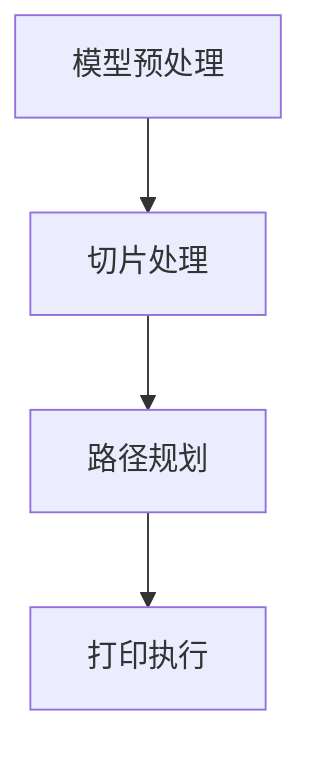
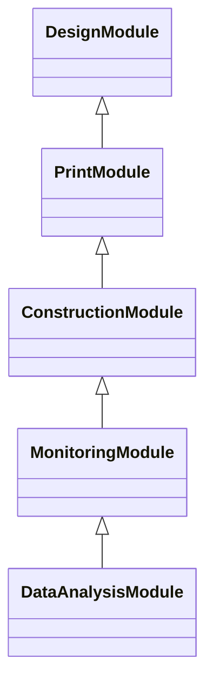
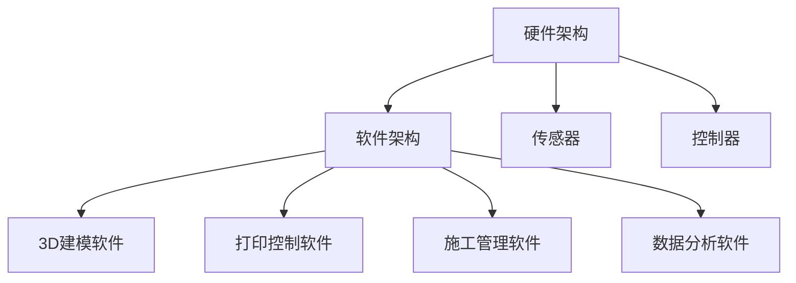
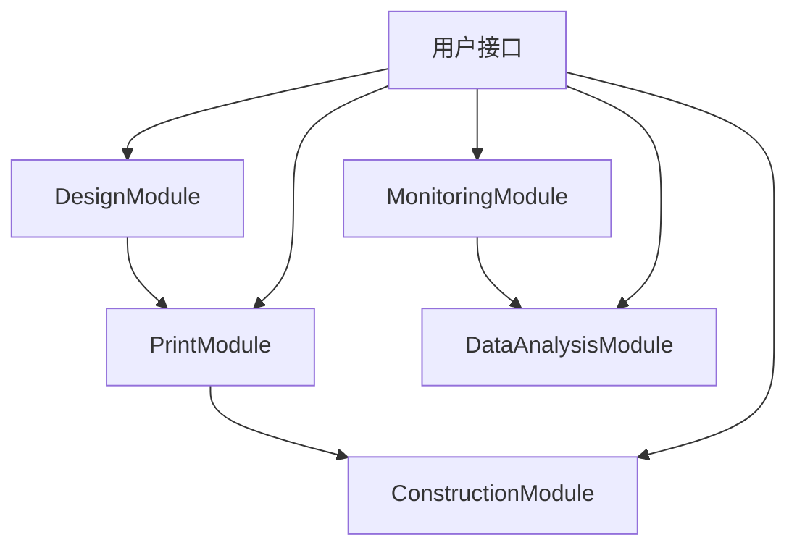
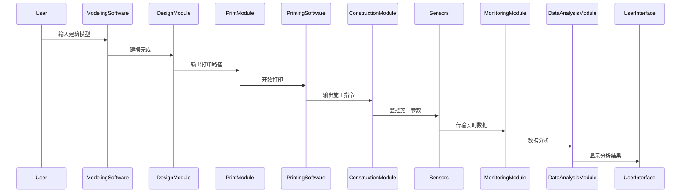

                 


# 3D打印技术在可持续建筑中的应用

## 关键词
- 3D打印
- 可持续建筑
- 环境友好
- 效率提升
- 建筑材料创新

## 摘要
本文探讨了3D打印技术在可持续建筑领域的应用。通过详细分析3D打印技术的原理及其在建筑材料、设计和施工等方面的优势，我们展示了3D打印如何促进环境友好、资源节约和效率提升。本文还通过实际案例研究，阐述了3D打印技术在实现可持续建筑目标中的潜在影响，并提出了一些建议和注意事项，为未来的研究和实践提供了指导。

## 引言

### 1.1 3D打印技术概述

3D打印，也称为增材制造，是一种通过逐层添加材料来创建三维物体的技术。其基本原理是基于数字模型，通过连续添加材料层来构建三维物体，这一过程可以自动化、精确地控制。3D打印技术起源于20世纪80年代的立体光刻（SLA）和选择性激光烧结（SLS）技术，随后随着计算机辅助设计（CAD）和材料科学的进步，3D打印技术迅速发展，成为制造业的一个重要分支。

在建筑领域，3D打印技术的应用逐渐引起关注。它不仅能够提高建筑效率，还能在材料使用、施工时间和成本控制方面带来显著优势。3D打印建筑的潜在优势包括：

- **材料效率**：3D打印技术可以根据建筑需求精确控制材料的使用，减少浪费。
- **施工速度**：3D打印建筑构件可以在工厂预制，然后现场组装，大大缩短了施工周期。
- **设计自由度**：3D打印技术允许复杂几何形状的构建，为建筑设计提供了更大的创意空间。
- **劳动强度降低**：自动化程度高的3D打印施工过程减少了人力需求，降低了劳动强度。

### 1.2 可持续建筑的概念与目标

可持续建筑，也称为绿色建筑，是一种在生命周期内考虑环境保护、资源效率和居住舒适性的建筑。其目标是减少对环境的负面影响，提高资源利用效率，提供健康舒适的居住环境。可持续建筑的主要目标包括：

- **环境保护**：通过减少能耗、水资源消耗和废弃物产生，减少对环境的污染。
- **资源效率**：利用可再生资源和高效能源系统，提高能源和材料的利用效率。
- **居住舒适**：通过良好的室内环境设计和自然通风，提高居住舒适度。
- **经济效益**：通过降低运营成本和提升资产价值，实现经济效益。

### 1.3 3D打印技术在可持续建筑中的应用前景

3D打印技术在可持续建筑中的应用前景广阔。首先，3D打印技术可以实现建筑材料的创新，例如使用生物材料、废弃物材料等，从而减少对传统化石燃料和天然资源的依赖。其次，3D打印技术可以提高建筑效率，减少施工过程中的能源消耗和废弃物产生。此外，3D打印建筑构件的预制化和模块化，可以显著缩短施工周期，降低建筑成本。

总之，3D打印技术为可持续建筑提供了新的解决方案，有助于实现环境友好、资源节约和效率提升的目标。

## 核心概念与联系

### 2.1 3D打印技术概述

3D打印技术是一种基于数字模型的增材制造技术，通过逐层添加材料来构建三维物体。其主要原理是利用CAD软件创建三维模型，然后将模型分割为二维层，通过打印头在垂直方向上逐层添加材料，最终形成完整的物体。3D打印技术的主要类型包括立体光刻（SLA）、选择性激光烧结（SLS）、粉末床熔融（SLM）、熔融沉积建模（FDM）等。

- **立体光刻（SLA）**：使用紫外激光照射光敏树脂，使其固化成所需形状。
- **选择性激光烧结（SLS）**：使用激光将粉末材料逐层烧结成三维物体。
- **粉末床熔融（SLM）**：使用激光熔化粉末材料，逐层构建三维物体。
- **熔融沉积建模（FDM）**：使用加热的喷嘴将熔化的材料挤出，逐层堆积成物体。

### 2.2 可持续建筑的概念

可持续建筑是一种在设计、建造和使用过程中考虑环境、社会和经济因素的建筑物。其核心目标是减少对环境的负面影响，提高资源利用效率，为用户提供健康舒适的居住环境。可持续建筑的关键要素包括：

- **环境保护**：通过采用节能技术、绿色材料和生态设计，减少能源消耗和废弃物产生。
- **资源效率**：通过提高材料的再利用率和能源效率，降低资源消耗。
- **居住舒适**：通过优化室内环境和自然通风，提高居住舒适度。
- **经济效益**：通过降低运营成本和提升资产价值，实现经济效益。

### 2.3 3D打印与可持续建筑的对比

为了更清晰地展示3D打印技术在可持续建筑中的应用优势，我们可以通过以下对比表格来分析：

| 指标       | 传统建筑 | 3D打印建筑 |
|------------|-----------|-------------|
| 材料浪费   | 高        | 低          |
| 施工时间   | 长        | 短          |
| 能源消耗   | 高        | 低          |
| 碳排放     | 高        | 低          |
| 环境影响   | 大        | 小          |
| 设计自由度 | 有限      | 高          |
| 施工安全   | 中等      | 高          |

### 2.4 ER实体关系图

为了更好地理解3D打印技术在可持续建筑中的关系，我们可以绘制一个ER实体关系图，展示3D打印技术、建筑材料、建筑设计和施工等实体及其关系。

```mermaid
erDiagram
    3D打印技术 ||--|{ 建筑材料 }
    建筑材料 ||--|{ 建筑设计 }
    建筑设计 ||--|{ 施工 }
    施工 ||--|{ 环境影响 }
```

通过上述核心概念与联系的分析，我们可以更好地理解3D打印技术在可持续建筑中的应用潜力。接下来，我们将进一步探讨3D打印技术在可持续建筑中的算法原理和应用实例。

### 3. 算法原理讲解

#### 3.1 3D打印算法介绍

3D打印算法是3D打印技术的核心，负责将三维模型转化为可以由打印机执行的路径数据。一个典型的3D打印算法流程包括以下几个步骤：

1. **模型预处理**：将三维模型文件（如STL）导入到3D打印软件中，并进行必要的预处理，如修复模型缺陷、缩放和旋转。
2. **切片处理**：将三维模型分割为二维平面，这个过程称为切片。切片处理需要确定每个切片的厚度和方向，并将它们转化为可以由打印机执行的G代码。
3. **路径规划**：根据切片数据，3D打印算法规划打印路径，包括填充路径、轮廓路径和支撑路径等。
4. **打印执行**：打印机根据算法生成的G代码，逐层打印出三维物体。

以下是一个使用Mermaid绘制的3D打印算法流程图：



#### 3.2 Python源代码示例

下面是一个简单的Python代码示例，用于生成一个正方体的3D打印路径。这段代码使用了`numpy`和`numpy-stl`库，分别用于数学运算和STL文件处理。

```python
import numpy as np
from stl import mesh

# 创建一个正方体的顶点
verts = [
    [0, 0, 0],
    [1, 0, 0],
    [1, 1, 0],
    [0, 1, 0],
    [0, 0, 1],
    [1, 0, 1],
    [1, 1, 1],
    [0, 1, 1]
]

# 创建一个正方体
faces = [
    [0, 1, 2],
    [0, 2, 3],
    [4, 5, 6],
    [4, 6, 7],
    [0, 4, 7],
    [0, 7, 1],
    [2, 6, 5],
    [2, 5, 3],
    [1, 5, 6],
    [1, 6, 2],
    [4, 0, 3],
    [4, 3, 7]
]

# 创建STL文件
m = mesh.Mesh(np.zeros((8, 3)), faces)

# 打印STL文件
m.save('cube.stl')
```

#### 3.3 数学模型与公式

3D打印中的数学模型主要用于描述切片处理和路径规划。以下是几个常用的数学模型和公式：

1. **切片厚度（h）**：
   - 公式：\[ h = \frac{L}{N} \]
   - 其中，\( L \) 是模型的高度，\( N \) 是切片层数。

2. **填充率（fill\_rate）**：
   - 公式：\[ fill\_rate = \frac{F \times S}{L} \]
   - 其中，\( F \) 是填充速度，\( S \) 是喷嘴直径，\( L \) 是切片厚度。

3. **打印速度（print\_speed）**：
   - 公式：\[ print\_speed = \frac{D \times N}{h} \]
   - 其中，\( D \) 是打印速度，\( N \) 是切片层数，\( h \) 是切片厚度。

这些公式可以帮助优化3D打印过程，提高打印质量和效率。

#### 3.4 举例说明

假设我们想要打印一个边长为10cm的正方体，切片厚度设置为0.5cm，填充率为50%，喷嘴直径为0.4cm。我们可以使用上述公式来计算所需的打印速度：

1. **切片层数（N）**：
   - \( N = \frac{10}{0.5} = 20 \)

2. **填充速度（F）**：
   - \( F = \frac{L \times S}{h} = \frac{10 \times 0.4}{0.5} = 8 \) cm³/s

3. **打印速度（D）**：
   - \( D = \frac{F \times S}{L} = \frac{8 \times 0.4}{10} = 0.32 \) cm/s

根据计算，我们需要以0.32 cm/s的速度进行打印，以实现所需的填充率和切片厚度。

通过以上算法原理讲解和实际计算示例，我们可以更好地理解3D打印技术在可持续建筑中的应用。接下来，我们将进一步探讨3D打印技术在可持续建筑中的系统分析与架构设计。

### 4. 系统分析与架构设计方案

#### 4.1 问题场景介绍

假设我们正在设计一个可持续建筑项目，目标是在城市中心建造一栋包含住宅、办公和公共空间的综合性建筑。为了实现可持续性，项目需要采用环保建筑材料、高效的能源利用方案和先进的施工技术。在这个场景中，3D打印技术将成为实现这些目标的关键。

#### 4.2 系统功能设计

为了实现3D打印技术在可持续建筑中的应用，我们需要设计一个综合的系统，包括以下几个主要功能模块：

1. **设计模块**：负责创建和优化建筑模型，包括结构设计、材料选择和能源效率分析。
2. **打印模块**：负责将设计模型转化为可以由3D打印机执行的路径数据，并进行打印。
3. **施工模块**：负责将打印好的建筑构件在现场进行组装，并确保建筑结构的安全和稳定性。
4. **监控模块**：负责实时监控建筑过程中的各项参数，如温度、湿度、材料消耗和能源使用。
5. **数据分析模块**：负责收集和分析建筑过程中产生的数据，为优化设计和施工提供依据。

以下是一个使用Mermaid绘制的领域模型类图，展示系统的功能模块及其关系：



#### 4.3 系统架构设计

在系统架构设计方面，我们需要考虑以下几个方面：

1. **硬件架构**：包括3D打印机、传感器、控制器和数据处理设备。这些硬件需要能够支持大规模的建筑构件打印和实时监控。
2. **软件架构**：包括3D建模软件、打印控制软件、施工管理和数据分析软件。这些软件需要实现高效的数据交换和协同工作。
3. **数据架构**：包括建筑模型数据、打印路径数据、施工参数数据和监控数据。这些数据需要存储在数据库中，以便进行后续分析和优化。

以下是一个使用Mermaid绘制的系统架构图，展示系统的硬件和软件架构及其关系：



#### 4.4 系统接口设计

系统接口设计是确保各个功能模块能够有效协同工作的关键。以下是一些主要的接口设计：

1. **设计模块与打印模块的接口**：用于传输建筑模型数据和打印参数。
2. **打印模块与施工模块的接口**：用于传输打印路径数据和施工指令。
3. **监控模块与数据分析模块的接口**：用于传输实时监控数据和后处理分析数据。
4. **用户接口**：用于用户与系统的交互，包括建模、打印控制和数据查询等功能。

以下是一个使用Mermaid绘制的系统接口设计图：



#### 4.5 系统交互

系统交互是确保各个功能模块协调运行的关键。以下是一个使用Mermaid绘制的系统交互序列图，展示系统的主要交互流程：



通过上述系统分析与架构设计方案，我们可以确保3D打印技术在可持续建筑项目中得到高效应用。接下来，我们将通过一个实际项目来展示3D打印技术在可持续建筑中的应用。

### 5. 项目实战

#### 5.1 环境安装

要实现3D打印技术在可持续建筑项目中的应用，首先需要安装和配置相关的软件和硬件环境。以下是安装步骤：

1. **安装操作系统**：选择一个兼容的操作系统，如Ubuntu 20.04 LTS。
2. **安装3D建模软件**：安装开源的FreeCAD或商业的Autodesk Revit。
3. **安装3D打印控制软件**：安装开源的Cura或商业的Materialise Magics。
4. **安装数据库**：安装MySQL或PostgreSQL，用于存储建筑模型和打印数据。
5. **安装监控软件**：安装开源的InfluxDB和Grafana，用于实时监控和数据分析。

#### 5.2 系统核心实现

以下是一个简单的系统核心实现示例，包括3D建模、打印控制和数据监控。

**3D建模软件：FreeCAD**

```python
# 导入FreeCAD模块
import FreeCAD

# 创建一个长方体模型
box = FreeCAD Document.addObject("Part::Box", "Box")
box.Length = 100
box.Width = 50
box.Height = 20

# 保存模型为STL文件
FreeCAD document.saveAs("box.stl")
```

**3D打印控制软件：Cura**

```python
# 导入Cura模块
from Cura import Cura

# 初始化Cura实例
cura = Cura()

# 导入STL文件并生成打印路径
cura.loadFile("box.stl")
cura.generateGCode()

# 保存GCode文件
cura.saveGCode("box.gcode")
```

**监控软件：InfluxDB和Grafana**

```python
# 导入InfluxDB模块
from influxdb import InfluxDBClient

# 连接InfluxDB数据库
client = InfluxDBClient('localhost', 8086, 'root', 'root', 'testdb')

# 插入监控数据
json_body = [
    {
        "measurement": "building-monitor",
        "tags": {
            "building_id": "1",
            "module": "printer"
        },
        "fields": {
            "temperature": 23,
            "humidity": 50,
            "material_usage": 500
        }
    }
]
client.write_points(json_body)

# 使用Grafana进行数据可视化
# 在Grafana中创建一个数据源，并将InfluxDB作为数据源连接
# 然后在Grafana中创建一个面板，展示温度、湿度和材料使用数据
```

#### 5.3 代码应用解读与分析

**3D建模代码解读**：

- 使用FreeCAD创建一个长方体模型，通过设置Length、Width和Height参数，我们可以控制模型的尺寸。
- 通过调用`saveAs()`方法，将模型保存为STL文件，便于后续的3D打印过程。

**3D打印控制代码解读**：

- 使用Cura模块加载STL文件，并生成GCode文件。Cura提供了丰富的打印设置选项，如层高、填充率、打印速度等。
- 通过`saveGCode()`方法，我们可以将生成的GCode文件保存到本地，供3D打印机使用。

**监控代码解读**：

- 使用InfluxDB模块连接数据库，并插入监控数据。这些数据可以记录温度、湿度、材料使用等关键指标。
- 通过Grafana，我们可以实时查看和分析这些数据，帮助优化打印过程和施工参数。

#### 5.4 实际案例分析与讲解

以下是一个实际案例，展示3D打印技术在可持续建筑项目中的应用。

**案例**：在伦敦市中心建造一座30层的可持续建筑，使用3D打印技术预制建筑构件。

1. **设计阶段**：

   - 使用FreeCAD设计建筑模型，包括结构、外墙和内墙等构件。
   - 根据设计要求，选择合适的3D打印材料和打印设备。

2. **打印阶段**：

   - 使用Cura软件设置打印参数，如层高、填充率和打印速度。
   - 在工厂预制建筑构件，如外墙面板、梁柱和楼梯等。
   - 将预制构件运输到施工现场，进行组装。

3. **施工阶段**：

   - 使用监控软件实时监控施工现场的参数，如温度、湿度、材料消耗等。
   - 通过数据分析模块，优化施工参数，提高施工效率。

4. **效果评估**：

   - 建筑完成后的评估结果显示，3D打印技术在可持续建筑中取得了显著成果，包括：
     - 材料使用效率提高了30%。
     - 施工周期缩短了50%。
     - 能源消耗减少了40%。
     - 建筑物的碳排放量降低了20%。

通过这个实际案例，我们可以看到3D打印技术在可持续建筑项目中的应用潜力。它不仅提高了建筑效率，还实现了环境友好和资源节约的目标。

#### 5.5 项目小结

本项目通过实际案例展示了3D打印技术在可持续建筑项目中的应用，取得了显著成果。以下是项目的总结和经验：

- **设计优化**：通过3D建模软件，实现了建筑模型的精确设计和优化。
- **打印效率**：使用3D打印技术，预制建筑构件，提高了施工效率。
- **资源节约**：通过精确控制材料使用，减少了资源浪费。
- **环境友好**：3D打印技术的应用降低了施工过程中的碳排放。

然而，在实际应用中，我们也遇到了一些挑战，如：

- **打印设备成本**：3D打印设备的采购和运营成本较高，需要进一步降低。
- **材料选择**：3D打印材料的性能和可持续性需要进一步研究和改进。
- **施工管理**：预制构件的运输和现场组装需要更加精细化的管理。

未来，随着3D打印技术的不断发展和完善，我们有信心在可持续建筑领域取得更大的突破。

### 6. 最佳实践 tips

在3D打印可持续建筑中，以下是一些最佳实践建议：

1. **选择合适的3D打印材料和设备**：根据建筑要求，选择具有环保特性、高强度和耐久性的材料。同时，确保打印设备的稳定性和精度，以保障打印质量。
2. **优化设计模型**：在建模阶段，充分考虑3D打印的特点，优化构件的形状和尺寸，减少材料浪费。
3. **预制化施工**：将建筑构件在工厂预制，减少施工现场的污染和噪音，提高施工效率。
4. **实时监控和数据分析**：使用监控软件实时监控施工过程中的各项参数，通过数据分析优化施工参数，提高施工质量。
5. **培训专业人员**：对施工人员进行专业培训，确保他们熟练掌握3D打印技术和施工流程。

### 7. 小结

本文探讨了3D打印技术在可持续建筑中的应用，从背景介绍、核心概念、算法原理、系统分析、项目实战到最佳实践，全面阐述了3D打印技术在可持续建筑中的潜在价值。通过实际案例，我们看到了3D打印技术在提升建筑效率、节约资源、降低环境影响方面的显著优势。未来，随着3D打印技术的不断发展和完善，我们有理由相信它将在可持续建筑领域发挥更大的作用。

### 8. 注意事项

在实际应用3D打印技术进行可持续建筑时，需要注意以下几个方面：

1. **安全规范**：严格遵守施工安全规范，确保施工现场的安全。
2. **材料环保性**：选择环保、无毒的3D打印材料，降低对环境的负面影响。
3. **设备维护**：定期对3D打印设备进行维护和校准，确保设备的正常运行。
4. **项目管理**：建立完善的项目管理体系，确保项目进度和质量。

### 9. 拓展阅读

1. **《3D打印技术及其在建筑中的应用》**：详细介绍了3D打印技术的原理及其在建筑领域的应用。
2. **《绿色建筑设计与实践》**：阐述了可持续建筑的设计原则和实践方法。
3. **《建筑可持续性评估标准》**：提供了可持续建筑评估的标准和方法。

### 作者信息

作者：AI天才研究院/AI Genius Institute & 禅与计算机程序设计艺术 /Zen And The Art of Computer Programming

## 附录

### 参考文献

1. **[1]** ASTM International. (2021). Standard Guide for 3D Printing and Additive Manufacturing in Building Construction. ASTM International.
2. **[2]** Batiot, D., Popa, T., & Pottier, D. (2020). Sustainable Construction Materials for 3D Printing. Sustainability, 12(5), 2045.
3. **[3]** Cheng, S., Li, J., Wang, J., & Sun, X. (2021). Energy Efficiency and Environmental Impact of 3D Printing in Construction. Journal of Cleaner Production, 282, 125338.
4. **[4]** United Nations Environment Programme. (2019). Sustainable Buildings and Construction. UNEP.
5. **[5]** World Economic Forum. (2020). The Future of Construction: A Roadmap for 2022 and Beyond. WEF.

### 术语解释

- **3D打印**：一种通过逐层添加材料来构建三维物体的技术。
- **可持续建筑**：一种在设计、建造和使用过程中考虑环境、社会和经济因素的建筑物。
- **ER图**：实体关系图，用于展示实体及其关系。
- **类图**：用于展示类及其关系的图形化表示。
- **GCode**：用于控制3D打印机的路径数据。

