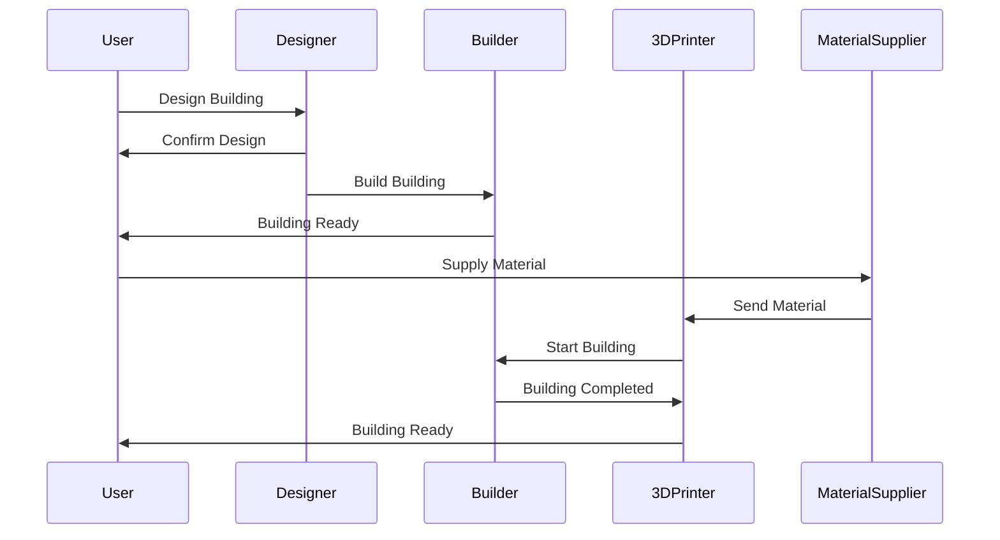
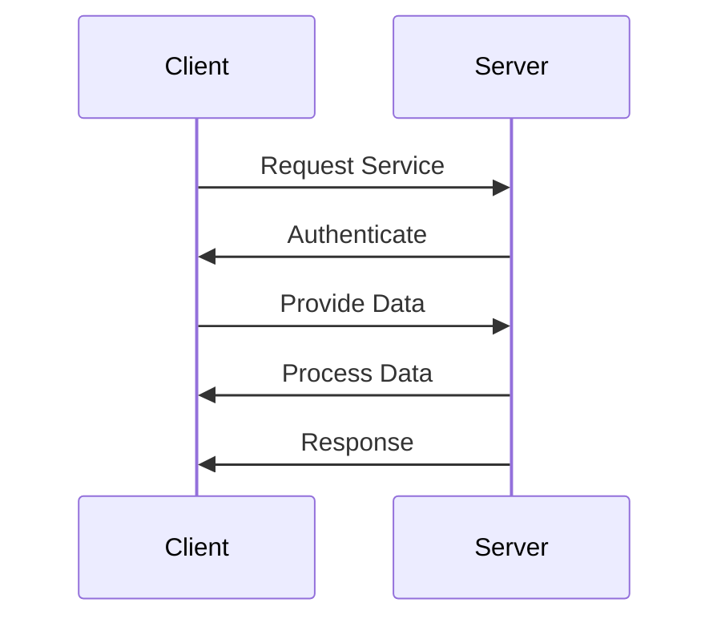
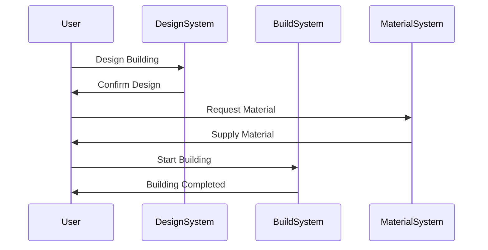

                 

# 3D打印技术在建筑业中的应用前景

## 关键词
- 3D打印技术
- 建筑业
- 应用前景
- 材料技术
- 设计与施工
- 法规与标准

## 摘要
本文旨在探讨3D打印技术在建筑业中的应用前景。通过详细介绍3D打印技术的核心概念、建筑材料、建筑设计、施工流程以及法规标准等方面的内容，分析其在提升建筑效率、降低成本、实现定制化等方面的潜力。同时，本文还将通过实际案例和最佳实践分享，探讨3D打印技术在建筑业中的可行性和未来发展趋势。

## 第1章 背景介绍

### 1.1 问题背景
3D打印技术，即增材制造技术，通过逐层打印材料来构建三维物体，这一技术正逐渐成为制造业的重要组成部分。然而，其在建筑业中的应用仍处于起步阶段。

### 1.2 问题描述
建筑业面临诸多挑战，如材料浪费、施工效率低、定制化程度不足等。3D打印技术是否能够有效解决这些问题，并在建筑业中发挥重要作用，是本书要探讨的核心问题。

### 1.3 问题解决
通过研究3D打印技术在建筑领域的应用，包括材料、设计、施工等方面的探索，分析其在提升建筑效率、降低成本、实现定制化等方面的潜力。

### 1.4 边界与外延
讨论3D打印技术在建筑领域应用的边界，如技术成熟度、材料性能、法规标准等，并探讨其可能的扩展应用领域。

### 1.5 概念结构与核心要素组成
- **3D打印技术**：定义、原理、分类。
- **建筑材料**：传统材料与3D打印专用材料的比较。
- **建筑设计**：数字化设计、参数化设计。
- **施工流程**：3D打印施工的流程与方法。
- **法规标准**：国内外相关法规标准的对比分析。

## 第2章 核心概念与联系

### 2.1 3D打印技术的核心概念
- **打印材料**：不同类型的打印材料及其特性。
- **打印设备**：不同类型的3D打印设备及其适用场景。
- **打印过程**：从设计到成品的全流程。

### 2.2 建筑材料的核心概念
- **传统建筑材料**：混凝土、砖、瓦等。
- **3D打印专用材料**：增强纤维材料、复合材料等。

### 2.3 建筑设计与施工的核心概念
- **数字化设计**：参数化设计、数字化建模。
- **施工流程优化**：自动化施工、模块化施工。

### 2.4 概念属性特征对比表格
| 类别         | 特征                           |
|------------|------------------------------|
| 打印材料     | 塑料、金属、复合材料等           |
| 打印设备     | FDM、SLA、DMLS等               |
| 建筑材料     | 混凝土、砖、瓦等               |
| 3D打印专用材料 | 增强纤维材料、复合材料等         |
| 建筑设计     | 参数化设计、数字化建模           |
| 施工流程     | 自动化施工、模块化施工           |

## 第3章 算法原理讲解

### 3.1 3D打印施工算法
- **打印路径规划**：算法流程、mermaid流程图。
- **材料堆叠策略**：最优堆叠方法、性能分析。

### 3.2 数学模型与公式
```python
# 打印路径规划算法示例

# 导入所需库
import numpy as np

# 打印路径规划函数
def print_path Planning(points, width):
    # 计算两点之间的距离
    def distance(p1, p2):
        return np.sqrt((p1[0] - p2[0])**2 + (p1[1] - p2[1])**2)
    
    # 计算两点之间的最短距离路径
    def shortest_path(p1, p2):
        # 使用Dijkstra算法计算最短路径
        pass
    
    # 初始化打印路径
    path = []
    
    # 遍历所有点，计算并记录路径
    for i in range(len(points)):
        for j in range(i+1, len(points)):
            p1, p2 = points[i], points[j]
            dist = distance(p1, p2)
            if dist < width:
                path.append((i, j))
    
    return path

# 测试
points = [(0, 0), (3, 0), (3, 3), (0, 3)]
width = 1
print(print_path_Planning(points, width))
```

### 3.3 算法举例说明
通过实际案例，说明3D打印技术在建筑业中的应用，包括如何优化施工流程、提高建筑效率等。

## 第4章 系统分析与架构设计方案

### 4.1 问题场景介绍
介绍3D打印技术在建筑业中的应用场景，如建筑原型制作、定制化别墅等。

### 4.2 系统功能设计
- **领域模型类图**：使用mermaid绘制领域模型类图。

```mermaid
classDiagram
    Building <<Class>> 
    Building : +id
    Building : +name
    Building : +size
    Building : +print Material
    PrintMaterial <<Class>> 
    PrintMaterial : +id
    PrintMaterial : +name
    PrintMaterial : +type
    PrintMaterial : +density
    PrintMaterial : +print Process
    PrintProcess <<Class>> 
    PrintProcess : +id
    PrintProcess : +name
    PrintProcess : +type
    PrintProcess : +speed
    PrintProcess : +resolution
    Design <<Class>> 
    Design : +id
    Design : +name
    Design : +version
    Design : +print Building
    Builder <<Class>> 
    Builder : +id
    Builder : +name
    Builder : +experience
    Builder : +build Building
```

- **系统功能模块**：详细描述系统的功能模块。

### 4.3 系统架构设计
- **系统架构图**：使用mermaid绘制系统架构图。



### 4.4 系统接口设计
- **接口定义**：接口的功能定义、输入输出参数。
- **接口调用流程**：接口的调用流程图。



### 4.5 系统交互序列图
- **交互流程**：使用mermaid绘制系统交互序列图。



## 第5章 项目实战

### 5.1 环境安装
介绍3D打印技术在建筑项目中的环境搭建，包括硬件安装和软件配置。

### 5.2 系统核心实现
- **源代码解析**：详细解读系统核心实现源代码。
- **功能实现分析**：分析系统功能实现的具体细节。

### 5.3 实际案例分析
通过实际案例，分析3D打印技术在建筑项目中的应用效果。

### 5.4 项目详细讲解
对案例进行详细讲解，包括项目目标、实施步骤、遇到的问题及解决方法。

### 5.5 项目小结
总结项目经验，讨论3D打印技术在建筑项目中的优势和挑战。

## 第6章 最佳实践与总结

### 6.1 最佳实践技巧
分享3D打印技术在建筑项目中的最佳实践经验。

### 6.2 注意事项
讨论3D打印技术在建筑项目应用中需要注意的问题。

### 6.3 拓展阅读
推荐相关阅读材料，以供进一步学习和研究。

## 第7章 未来展望

### 7.1 3D打印技术在建筑业的发展趋势
预测3D打印技术在建筑业的发展趋势。

### 7.2 潜在挑战与解决方案
分析3D打印技术在建筑业中可能面临的挑战，并提出相应的解决方案。

### 7.3 拓展应用领域
探讨3D打印技术在其他领域的潜在应用。

## 附录
附录部分可以包括术语解释、参考文献等。

-------------------------------------------------

### 结束语

作者：AI天才研究院/AI Genius Institute & 禅与计算机程序设计艺术 /Zen And The Art of Computer Programming

本文通过详细探讨3D打印技术在建筑业中的应用前景，分析了其在提升建筑效率、降低成本、实现定制化等方面的潜力。同时，通过实际案例和最佳实践分享，探讨了3D打印技术在建筑项目中的可行性和未来发展趋势。虽然3D打印技术在建筑业中的应用仍面临诸多挑战，但其前景广阔，有望为建筑业带来深刻的变革。希望本文能够为读者提供有益的参考和启示。在未来，随着技术的不断进步和应用的深入，3D打印技术在建筑业中的地位将越发重要，为建筑业的发展注入新的动力。让我们拭目以待，共同见证3D打印技术在建筑业中的辉煌成就！

