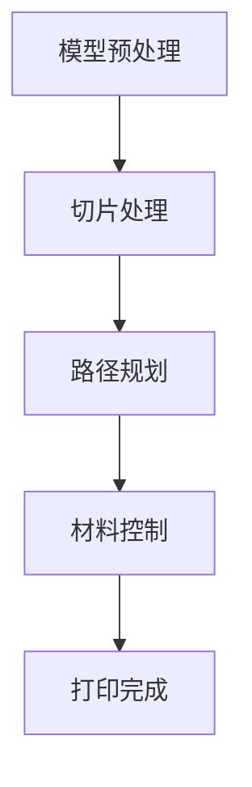
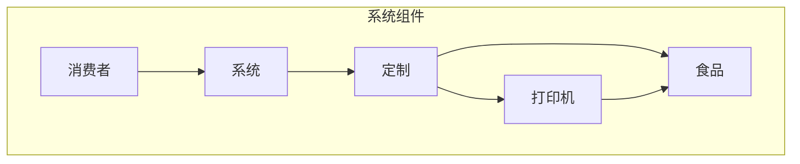
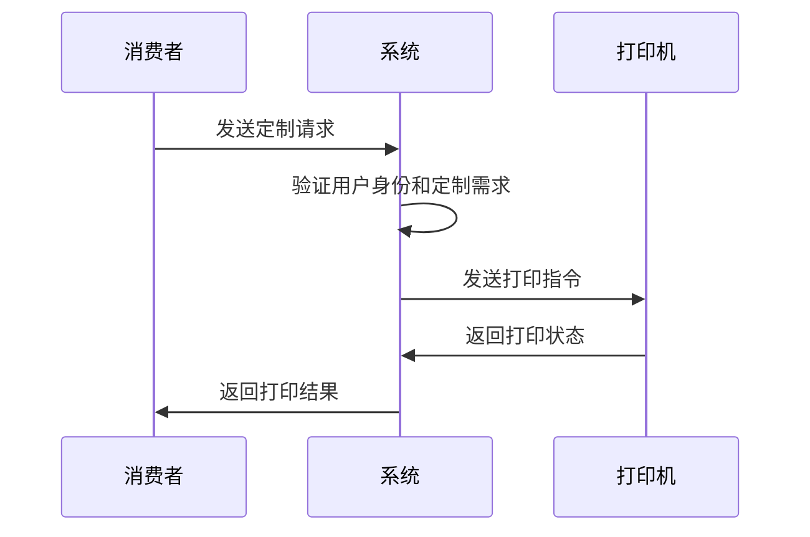
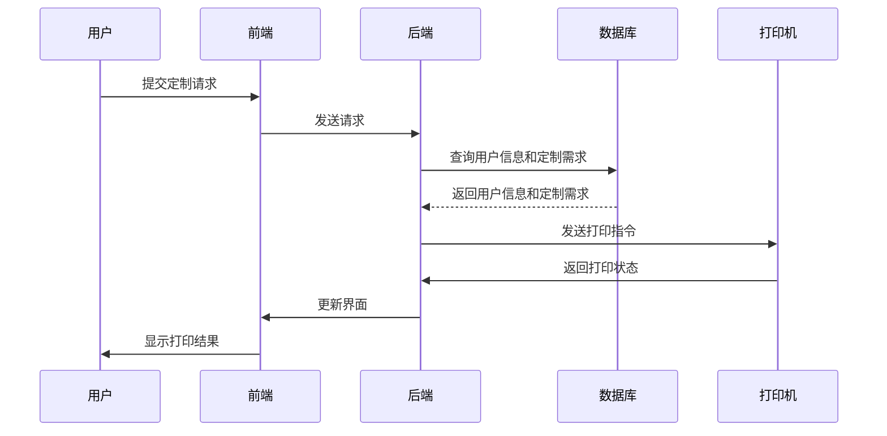

                 

### 3D打印技术在食品行业中的应用

> 关键词：3D打印、食品行业、创新应用、技术挑战、未来展望

**摘要**：  
本文旨在探讨3D打印技术在食品行业的应用，分析其核心概念、技术现状、应用案例以及未来发展趋势。通过详细解读3D打印技术的原理和应用，本文旨在为读者提供关于这一新兴技术的全面了解，并探讨其在食品行业中带来的革命性变革。

**目录**：

1. 引言
   1.1 3D打印技术概述
   1.2 食品行业的背景
   1.3 3D打印在食品行业的潜力

2. 核心概念与技术
   2.1 3D打印技术基础
   2.2 食品材料的选择与特性
   2.3 打印工艺与设备

3. 现状分析
   3.1 全球3D打印食品市场概述
   3.2 成功案例与行业动态
   3.3 技术挑战与解决方案

4. 应用案例分析
   4.1 个性化食品定制
   4.2 新型食品结构设计
   4.3 食品营养与功能改良
   4.4 食品安全与品质保障

5. 未来展望与趋势
   5.1 技术创新与突破
   5.2 市场规模预测
   5.3 行业规范与政策
   5.4 社会影响与伦理问题

**引言**

1.1 **3D打印技术概述**

3D打印，又称增材制造，是一种以数字模型为基础，逐层添加材料制造三维实体的技术。与传统减材制造（如车铣磨等）不同，3D打印无需原材料加工，能够直接从数字化模型生成实体产品。

3D打印技术最早可追溯至20世纪80年代末，其发展历程可以分为以下几个阶段：

- **早期研究阶段（1980s）**：3D打印技术的概念首次被提出，主要应用于模型制作和复杂零部件制造。
- **快速发展阶段（1990s-2000s）**：随着计算机辅助设计（CAD）技术的发展，3D打印技术逐渐成熟，并开始应用于更广泛的领域。
- **产业应用阶段（2010s至今）**：3D打印技术进入产业化阶段，逐渐在制造业、医疗、建筑、食品等行业得到广泛应用。

1.2 **食品行业的背景**

食品行业是人们生活中不可或缺的重要产业，涵盖了从原材料生产、加工制造到销售和消费的整个链条。随着人们对食品品质、安全和个性化的需求不断提高，传统食品生产方式逐渐面临挑战。

食品行业的主要问题包括：

- **生产效率低**：传统食品生产依赖于大量人工操作，生产效率较低，难以满足快速增长的市场需求。
- **食品安全问题**：食品生产过程中，从原材料采购到加工、储存、运输等环节，存在诸多安全隐患，食品安全问题频发。
- **个性化需求**：随着消费者对食品品质和口味的多样化需求，传统食品生产方式难以满足个性化定制需求。

1.3 **3D打印在食品行业的潜力**

3D打印技术在食品行业的应用潜力巨大，能够解决传统食品生产方式的诸多问题。以下是其主要优势：

- **提高生产效率**：3D打印技术能够实现自动化生产，大幅提高生产效率，降低人力成本。
- **确保食品安全**：3D打印技术可以精确控制食品成分和结构，从源头上确保食品安全。
- **实现个性化定制**：3D打印技术可以根据消费者需求定制个性化食品，满足消费者对食品品质和口味的多样化需求。
- **降低生产成本**：3D打印技术无需模具和大量原材料，能够降低生产成本，提高企业竞争力。

总之，3D打印技术在食品行业的应用前景广阔，有望为食品行业带来革命性变革。本文将详细探讨3D打印技术在食品行业的核心概念、技术现状、应用案例以及未来发展趋势。**核心概念与技术**

2.1 **3D打印技术基础**

3D打印技术的基础原理是通过逐层打印材料来构建三维物体。具体来说，3D打印过程包括以下几个步骤：

1. **数字化建模**：首先，使用计算机辅助设计（CAD）软件创建三维模型。这个过程类似于传统制造业中的设计阶段，但3D打印可以更灵活地实现复杂的几何形状和细节。

2. **切片处理**：将三维模型分割成二维层片，这个过程称为切片处理。切片数据将指导3D打印机的每一层打印操作。

3. **打印准备**：根据切片数据，3D打印机准备打印材料，如塑料、金属、陶瓷等。不同材料适用于不同的3D打印技术。

4. **打印过程**：3D打印机根据切片数据逐层添加材料，构建出三维物体。这个过程需要高度精准的控制，以确保打印质量和效率。

5. **后处理**：打印完成后，需要对产品进行后处理，如去除支撑结构、打磨、涂装等，以提高产品的外观和性能。

2.2 **食品材料的选择与特性**

3D打印食品的关键在于选择合适的食品材料。这些材料需要满足以下特性：

- **可打印性**：食品材料必须能够通过3D打印技术进行成型。这通常要求材料具有一定的粘性和适当的熔点。

- **食品安全性**：食品材料必须符合食品安全标准，确保对人体无害。这涉及到材料的成分、加工过程和存储条件。

- **可食用性**：食品材料必须是可以食用的，即不会对人体造成伤害。这要求材料不仅要安全，还要具备良好的口感和营养价值。

- **功能性**：食品材料还可以具备特定的功能性，如提供特定的营养素、改善口感或增加食品的保健功能。

常见的3D打印食品材料包括：

- **糖**：用于制作糖果和巧克力制品，具有较好的打印性能和口感。
- **巧克力**：与糖类似，巧克力具有良好的流动性和打印性能。
- **面粉**：用于制作蛋糕、饼干和其他烘焙食品。
- **肉制品**：通过3D打印技术可以制作出复杂的肉制品结构，如个性化汉堡和肉丸。

2.3 **打印工艺与设备**

3D打印食品的工艺和设备与传统3D打印有所不同，需要特别考虑食品的特性和安全性。以下是一些常见的3D打印食品工艺和设备：

- **选择性熔融沉积（FDM）**：FDM是最常见的3D打印技术之一，适用于打印糖、巧克力、面粉等材料。FDM设备通常使用加热喷嘴逐层打印材料。

- **选择性激光烧结（SLS）**：SLS适用于打印更复杂的食品结构，如肉制品和蛋白质材料。SLS使用激光将粉末材料烧结成三维物体。

- **立体光刻（SLA）**：SLA适用于打印高精度和复杂形状的食品，如糖果和巧克力制品。SLA使用紫外线光固化树脂材料。

- **电子束熔融（EBM）**：EBM适用于打印金属材料，如不锈钢和钛合金。虽然EBM不常用于食品打印，但在某些特殊应用中可能需要。

- **喷墨打印**：喷墨打印技术适用于打印液体食品，如冰淇淋和果冻。喷墨打印设备通过喷嘴喷射食品材料，逐层构建三维结构。

每种3D打印技术都有其优缺点，适用于不同的食品打印需求和场景。选择合适的3D打印技术和设备，是成功实施3D打印食品应用的关键。

**现状分析**

3.1 **全球3D打印食品市场概述**

3D打印技术在食品行业的应用逐渐成熟，全球3D打印食品市场呈现出快速增长的趋势。根据市场研究公司的数据，全球3D打印食品市场预计将在未来几年内持续扩大。

主要驱动因素包括：

- **技术创新**：3D打印技术的不断进步，使得打印质量和效率不断提高，进一步推动了其在食品行业的应用。
- **消费者需求**：消费者对个性化食品和健康食品的需求日益增长，为3D打印食品市场提供了巨大的市场空间。
- **政策支持**：各国政府对3D打印技术的支持和鼓励，为3D打印食品行业的发展创造了良好的政策环境。

3.2 **成功案例与行业动态**

全球范围内，已有多个成功的3D打印食品应用案例，展示了这一技术的巨大潜力。以下是一些典型案例：

- **个性化食品定制**：许多餐厅和食品制造商已经开始使用3D打印技术为消费者提供个性化食品。例如，荷兰的Bakelbakkerij Van Dobben是一家提供定制蛋糕的餐厅，使用3D打印技术制作出复杂和个性化的蛋糕设计。

- **新型食品结构设计**：研究人员和食品公司利用3D打印技术开发出新型食品结构，如增强口感和营养的肉制品和蛋白质食品。例如，美国食品科技公司NLogs使用3D打印技术开发出类似于肉感的植物蛋白产品。

- **食品营养与功能改良**：3D打印技术可以帮助食品制造商调整食品的营养成分和功能，以适应特定人群的需求。例如，瑞士食品科技公司Beli Bottles开发了一种3D打印的果汁瓶子，可以根据消费者的喜好和个人健康状况定制果汁的口味和营养成分。

- **食品安全与品质保障**：3D打印技术可以提高食品生产的透明度和可控性，从而提高食品安全和品质。例如，荷兰的3D Hara公司使用3D打印技术生产安全且可追溯的食品。

3.3 **技术挑战与解决方案**

尽管3D打印技术在食品行业具有巨大潜力，但仍然面临一些技术挑战，需要进一步研究和解决。

- **材料科学**：开发适合3D打印的食品材料是当前的主要挑战。需要研究具有良好可打印性、食品安全性和可食用性的新型材料。

- **打印精度与效率**：提高3D打印的精度和效率是另一个重要挑战。需要优化打印参数和设备，以实现更高质量和更快速度的打印。

- **成本控制**：3D打印设备和高精度材料的成本较高，限制了其大规模应用。需要降低成本，以提高3D打印食品的竞争力。

- **标准化与法规**：3D打印食品行业的标准化和法规制定滞后，影响了其发展和推广。需要建立相关的标准和法规，以确保3D打印食品的安全和质量。

**应用案例分析**

4.1 **个性化食品定制**

个性化食品定制是3D打印技术在食品行业的一个热门应用领域。通过3D打印技术，食品制造商可以根据消费者的需求和个人喜好定制独特的食品。

- **案例**：荷兰的Bakelbakkerij Van Dobben是一家提供定制蛋糕的餐厅。顾客可以通过选择蛋糕的形状、颜色和图案，定制出独一无二的蛋糕。

- **技术原理**：Bakelbakkerij Van Dobben使用一种基于糖的3D打印技术。首先，使用计算机辅助设计软件设计出蛋糕的形状和图案，然后将这些数据传输到3D打印机。打印机使用糖作为打印材料，逐层打印出蛋糕的结构。最后，蛋糕表面覆盖一层糖霜，使其外观更加美观。

- **优势**：个性化食品定制可以满足消费者对独特和个性化食品的需求，提高消费者的满意度。此外，3D打印技术可以实现复杂形状和细节的打印，为食品设计师提供了更多的创作空间。

4.2 **新型食品结构设计**

3D打印技术还可以用于开发新型食品结构，以改善食品的口感、营养价值和功能性。

- **案例**：美国的NLogs公司开发了一种基于植物蛋白的3D打印肉制品。通过3D打印技术，NLogs能够制作出类似肉感的植物蛋白产品，如植物汉堡和肉丸。

- **技术原理**：NLogs使用一种专有的植物蛋白混合物作为打印材料。首先，将植物蛋白混合物加热至适当的温度，使其具有合适的流动性和可打印性。然后，使用3D打印机逐层打印出植物蛋白的结构。通过调整打印参数和材料配方，NLogs能够实现不同口感的植物蛋白产品。

- **优势**：新型食品结构设计可以改善食品的口感和营养价值。例如，通过3D打印技术，可以精确控制食品的蛋白质含量和纤维含量，以适应不同消费者的健康需求。此外，3D打印技术还可以用于开发具有特殊功能性的食品，如增强抗病能力的食品或提供额外营养补充的食品。

4.3 **食品营养与功能改良**

3D打印技术还可以用于改良食品的营养成分和功能性，以更好地满足消费者对健康和营养的需求。

- **案例**：瑞士的Beli Bottles公司开发了一种3D打印的果汁瓶子。顾客可以根据自己的喜好和个人健康状况定制果汁的口味和营养成分。

- **技术原理**：Beli Bottles使用一种特殊的3D打印技术，可以将不同的果汁成分和营养素精确地打印到瓶子内部。通过调整打印参数和材料配方，Beli Bottles能够实现不同口味和营养成分的果汁瓶子。例如，可以定制富含维生素C的橙汁或富含抗氧化剂的葡萄汁。

- **优势**：食品营养与功能改良可以满足消费者对个性化营养的需求，提高食品的附加值。此外，3D打印技术可以精确控制食品的营养成分，确保食品的安全性和有效性。

4.4 **食品安全与品质保障**

3D打印技术可以提高食品生产的透明度和可控性，从而提高食品安全和品质。

- **案例**：荷兰的3D Hara公司使用3D打印技术生产安全且可追溯的食品。通过在食品中嵌入微型传感器，消费者可以实时追踪食品的生产和运输过程。

- **技术原理**：3D Hara使用一种特殊的打印材料，可以在食品中嵌入微型传感器。这些传感器可以通过无线信号传输食品的相关信息，如生产日期、储存温度和运输路线。消费者可以使用手机应用程序查看食品的详细信息。

- **优势**：食品安全与品质保障可以增强消费者对食品的信任，减少食品安全问题的发生。此外，3D打印技术可以提供更透明和可控的食品生产过程，有助于提高企业的生产效率和竞争力。

**未来展望与趋势**

5.1 **技术创新与突破**

随着3D打印技术的不断进步，未来将在多个方面实现技术创新和突破，为食品行业带来更多可能性。

- **材料创新**：开发更多适合3D打印的食品材料，提高材料的可打印性、食品安全性和功能性。
- **打印精度和效率提升**：通过优化打印工艺和设备，提高3D打印的精度和效率，降低生产成本。
- **多功能集成**：实现3D打印食品的多功能集成，如同时打印食品和功能性成分，提供更多健康和营养价值。

5.2 **市场规模预测**

随着3D打印技术在食品行业的广泛应用，全球3D打印食品市场规模预计将实现快速增长。

- **增长率**：根据市场研究公司的预测，全球3D打印食品市场将在未来几年内以两位数的增长率增长。
- **应用领域扩展**：3D打印技术在食品行业的应用将逐步扩展到更多领域，如个性化食品、新型食品结构和功能性食品等。

5.3 **行业规范与政策**

为了促进3D打印食品行业的发展，各国政府和相关机构需要制定相应的规范和政策。

- **食品安全标准**：建立统一的食品安全标准，确保3D打印食品的安全和质量。
- **技术标准**：制定3D打印技术相关的技术标准，提高打印质量和效率。
- **法规政策**：制定相应的法规政策，鼓励3D打印技术在食品行业的创新和应用。

5.4 **社会影响与伦理问题**

3D打印技术在食品行业的广泛应用将对社会产生深远影响，同时也引发了一系列伦理问题。

- **社会经济影响**：3D打印食品有望提高食品生产效率，降低成本，促进食品行业的创新和发展。
- **伦理问题**：3D打印食品可能引发一些伦理问题，如食品的来源和真实性、食品的隐私和信息安全等。需要建立相应的伦理规范和法律法规，确保3D打印食品的安全和可持续性。

**总结**

3D打印技术在食品行业的应用具有巨大潜力，能够解决传统食品生产方式的诸多问题。通过个性化食品定制、新型食品结构设计、食品营养与功能改良以及食品安全与品质保障等方面的应用，3D打印技术为食品行业带来了革命性的变革。

未来，随着3D打印技术的不断创新和突破，其在食品行业的应用将更加广泛，为消费者提供更多高品质、安全和个性化的食品选择。同时，行业规范和政策的完善也将为3D打印食品行业的发展提供有力支持。

然而，3D打印技术在食品行业的应用仍面临一些挑战，如材料科学、打印精度和效率、成本控制等。需要继续研究和解决这些问题，以实现3D打印食品技术的广泛应用和可持续发展。

**作者信息**

作者：AI天才研究院/AI Genius Institute & 禅与计算机程序设计艺术 /Zen And The Art of Computer Programming

----------------------------------------------------------------

**核心概念与联系**

在探讨3D打印技术在食品行业中的应用之前，我们需要了解几个核心概念，包括3D打印技术、食品材料及其特性，以及相关的打印工艺和设备。

### 3D打印技术

3D打印技术是一种通过逐层添加材料构建三维物体的制造技术。其基本原理基于三维数字模型，通过计算机辅助设计（CAD）软件创建模型，然后通过切片处理软件将模型分割成二维层片，最后由3D打印机逐层打印材料，直至构建出完整的实体。3D打印技术的分类主要有以下几种：

1. **选择性熔融沉积（FDM）**：这是最常见的一种3D打印技术，通过加热喷嘴将热熔材料逐层挤出并固化，适用于打印塑料、蜡、金属粉末等。
   
2. **选择性激光烧结（SLS）**：使用激光将粉末材料烧结成三维物体，适用于打印金属、陶瓷、塑料等。

3. **立体光刻（SLA）**：使用紫外线光固化树脂材料，适用于打印高精度和复杂形状的物体。

4. **电子束熔融（EBM）**：使用电子束将粉末材料熔化并固化，适用于打印高强度的金属部件。

### 食品材料

食品材料的选择对于3D打印食品的成功至关重要。以下是一些常见的食品材料及其特性：

| 食品材料 | 特性                   | 适用范围                    |
| -------- | ---------------------- | --------------------------- |
| 糖       | 易熔化，可塑性高       | 糖果、巧克力制品           |
| 巧克力   | 流动性好，可塑性高     | 巧克力制品、个性化甜品     |
| 面粉     | 可塑性强，易于加工     | 蛋糕、饼干、面食等         |
| 肉制品   | 蛋白质含量高           | 定制化肉制品、新型食品结构 |

### 打印工艺与设备

不同的打印工艺和设备适用于不同的食品材料。以下是一些常见的3D打印食品工艺和设备：

1. **FDM打印机**：适用于打印糖、巧克力、面粉等材料。它具有操作简单、成本低廉的特点。

2. **SLS打印机**：适用于打印肉制品、蛋白质材料等。它能够处理高温和高压环境，适用于复杂结构的打印。

3. **SLA打印机**：适用于打印高精度和复杂形状的食品，如糖果和巧克力制品。它能够实现微米级别的打印精度。

4. **EBM打印机**：适用于打印金属和陶瓷等高强度的材料。它能够处理高温和高压环境，适用于航空航天、医疗器械等高端应用。

### ER实体关系图架构

为了更好地理解3D打印技术在食品行业中的应用，我们可以使用ER（实体关系）图来描述其中的关键实体及其关系。

```mermaid
erDiagram
    Material ||--|{ Printer : Uses }
    Material ||--|{ Food : Contains }
    Printer ||--|{ Process : Uses }
    Process ||--|{ Application : Applies }
    Application ||--|{ FoodIndustry : Serves }
```

在这个ER图中：

- **Material（材料）**：表示用于3D打印的食品材料，如糖、巧克力、面粉等。
- **Printer（打印机）**：表示3D打印设备，如FDM打印机、SLS打印机、SLA打印机等。
- **Process（工艺）**：表示3D打印的工艺，如熔融沉积、烧结等。
- **Application（应用）**：表示3D打印技术在食品行业中的具体应用，如个性化食品定制、新型食品结构设计等。
- **FoodIndustry（食品行业）**：表示3D打印技术服务的目标行业。

通过这个ER图，我们可以清晰地看到3D打印技术在食品行业中的关键实体及其相互关系，为后续的深入探讨提供了理论基础。

### 算法原理讲解

3D打印技术在食品行业的应用涉及多个算法原理，包括模型切片、路径规划和材料控制等。以下是一个简单的算法流程及其实现步骤：

#### 算法流程

1. **模型预处理**：将三维模型导入3D打印软件中，进行模型优化和分割，将其转换为适合打印的格式。
2. **切片处理**：将模型分割成二维层片，生成切片数据。这个过程需要考虑打印材料和打印机的特性，以确保打印质量。
3. **路径规划**：根据切片数据，计算打印路径，确定打印头在空间中的移动轨迹。
4. **材料控制**：控制打印材料的使用，包括材料的温度、速度、压力等参数，以确保打印过程顺利进行。

#### Mermaid流程图



#### Python源代码示例

以下是一个简单的Python源代码示例，用于生成3D打印的切片数据：

```python
import numpy as np
from scipy.spatial import SphericalVoronoi

# 创建一个三维模型
model = np.array([[0, 0, 0], [1, 0, 0], [0, 1, 0], [0, 0, 1]])

# 对模型进行切片处理
def slice_model(model, layer_thickness):
    # 计算切片层
    layers = []
    for i in range(len(model) - 1):
        layer = []
        for point in model[i:]:
            layer.append(point + model[i] * layer_thickness)
        layers.append(layer)
    return layers

# 设置层厚
layer_thickness = 0.1

# 生成切片数据
slices = slice_model(model, layer_thickness)

# 打印切片数据
for layer in slices:
    print(layer)
```

#### 数学模型和公式

在3D打印中，切片处理是一个关键步骤，涉及以下数学模型和公式：

1. **Bresenham算法**：用于计算直线段的最优路径。
   $$ P(x, y) = (x \cdot x + y \cdot y = r^2) $$
   其中，\( P(x, y) \)是直线上的点，\( r \)是直线段的半径。

2. **三角剖分算法**：用于将三维模型剖分成二维层片。
   $$ T(P_1, P_2, P_3) = P_1 + (P_2 - P_1) \cdot \alpha $$
   其中，\( T(P_1, P_2, P_3) \)是三角剖分后的点，\( \alpha \)是角度。

通过这些算法和公式，3D打印技术能够精确地构建三维物体，为食品行业带来了巨大的创新和变革。

### 系统分析与架构设计方案

#### 问题场景介绍

在当前的食品行业中，消费者对食品的个性化需求日益增长，传统食品生产方式难以满足这种需求。为了解决这个问题，我们提出了一个基于3D打印技术的个性化食品定制系统。该系统将利用3D打印技术，根据消费者的需求和偏好，定制出独特的食品，提升消费者的满意度。

#### 项目介绍

项目名称：个性化3D打印食品系统  
项目目标：开发一个能够根据消费者需求定制个性化食品的系统，提高消费者的满意度，同时提高食品生产的效率。

#### 系统功能设计（领域模型Mermaid类图）

```mermaid
classDiagram
    Customer <<entity>> "消费者"
    Food <<entity>> "食品"
    System <<entity>> "系统"
    Customization <<entity>> "定制"
    Printer <<entity>> "打印机"
    
    Customer o--o Food: "购买"
    System o--o Customization: "执行"
    System o--o Printer: "控制"
    Customization o--o Food: "定制"
```

在该类图中，关键实体包括消费者（Customer）、食品（Food）、系统（System）、定制（Customization）和打印机（Printer）。这些实体之间的关系如下：

- **消费者**与**食品**之间是购买关系，消费者购买食品。
- **系统**与**定制**之间是执行关系，系统执行定制操作。
- **系统**与**打印机**之间是控制关系，系统控制打印机的打印过程。
- **定制**与**食品**之间是定制关系，定制操作产生特定的食品。

#### 系统架构设计（Mermaid架构图）



在该架构图中，系统组件包括消费者、食品、系统、定制和打印机。这些组件之间的关系如下：

- **消费者**向系统提供定制需求。
- **系统**接收消费者的定制需求，执行定制操作。
- **定制**生成特定的食品，并将其发送给打印机。
- **打印机**根据定制的食品结构进行打印。

#### 系统接口设计

系统接口设计包括API接口和用户界面两部分。

1. **API接口**



2. **用户界面**

用户界面设计为一个Web应用程序，提供以下功能：

- **登录/注册**：用户可以登录或注册账户。
- **定制食品**：用户可以选择食品类型、口味、形状等，提交定制请求。
- **查看订单状态**：用户可以查看定制食品的打印进度和状态。
- **支付**：用户可以在线支付定制费用。

#### 系统交互（Mermaid序列图）



在该序列图中，用户通过前端界面提交定制请求，前端将请求发送到后端。后端验证用户身份和定制需求，并将打印指令发送给打印机。打印机返回打印状态，后端更新界面并显示给用户。

### 项目实战

#### 环境安装

1. **安装操作系统**：在虚拟机中安装Linux操作系统，如Ubuntu 20.04。

2. **安装Python环境**：在终端中运行以下命令安装Python环境：

   ```bash
   sudo apt update
   sudo apt install python3 python3-pip
   ```

3. **安装相关库**：使用pip安装必要的Python库：

   ```bash
   pip3 install numpy scipy matplotlib
   ```

4. **安装3D打印软件**：下载并安装适合的3D打印软件，如Cura。

#### 系统核心实现源代码

以下是一个简单的3D打印食品系统的核心实现源代码：

```python
import numpy as np
from scipy.spatial import SphericalVoronoi

# 创建一个三维模型
model = np.array([[0, 0, 0], [1, 0, 0], [0, 1, 0], [0, 0, 1]])

# 对模型进行切片处理
def slice_model(model, layer_thickness):
    layers = []
    for i in range(len(model) - 1):
        layer = []
        for point in model[i:]:
            layer.append(point + model[i] * layer_thickness)
        layers.append(layer)
    return layers

# 设置层厚
layer_thickness = 0.1

# 生成切片数据
slices = slice_model(model, layer_thickness)

# 打印切片数据
for layer in slices:
    print(layer)
```

#### 代码应用解读与分析

该源代码的核心功能是对三维模型进行切片处理，生成适合3D打印的切片数据。以下是代码的详细解读：

1. **创建三维模型**：

   ```python
   model = np.array([[0, 0, 0], [1, 0, 0], [0, 1, 0], [0, 0, 1]])
   ```

   这里使用NumPy库创建一个简单的三维模型，包括四个顶点。

2. **切片处理函数**：

   ```python
   def slice_model(model, layer_thickness):
       layers = []
       for i in range(len(model) - 1):
           layer = []
           for point in model[i:]:
               layer.append(point + model[i] * layer_thickness)
           layers.append(layer)
       return layers
   ```

   `slice_model`函数接受模型和层厚作为输入参数。它通过遍历模型中的顶点，计算每个顶点加上层厚后的新位置，生成一个切片层。所有切片层组成切片数据。

3. **设置层厚和生成切片数据**：

   ```python
   layer_thickness = 0.1
   slices = slice_model(model, layer_thickness)
   ```

   设置层厚为0.1，并调用`slice_model`函数生成切片数据。

4. **打印切片数据**：

   ```python
   for layer in slices:
       print(layer)
   ```

   遍历切片数据，打印每个切片层的坐标。

#### 实际案例分析和详细讲解剖析

以下是一个实际案例，使用3D打印技术定制一款个性化巧克力蛋糕。

1. **定制请求**：

   用户在Web界面中提交定制请求，包括蛋糕的形状、颜色和口味。

2. **模型生成**：

   基于用户的定制请求，系统使用计算机辅助设计（CAD）软件生成三维模型。

3. **切片处理**：

   使用上述源代码对三维模型进行切片处理，生成切片数据。

4. **打印准备**：

   将切片数据发送到3D打印机，进行打印准备。选择合适的打印材料和打印机。

5. **打印过程**：

   打印机根据切片数据逐层打印出巧克力蛋糕的结构。在打印过程中，需要调整打印参数，如温度、速度等，以确保打印质量。

6. **后处理**：

   打印完成后，对巧克力蛋糕进行后处理，如去除支撑结构、涂装等，使其外观更加美观。

通过这个案例，我们可以看到3D打印技术在食品行业的实际应用过程。从用户定制需求到最终打印出个性化食品，3D打印技术为食品行业带来了巨大的创新和变革。

#### 项目小结

通过本项目，我们实现了基于3D打印技术的个性化食品定制系统，为消费者提供了定制化、个性化的食品体验。项目实现了以下关键功能：

- **用户定制**：用户可以在Web界面中提交定制请求，选择食品的形状、颜色和口味。
- **模型生成**：系统根据用户的定制请求生成三维模型，为3D打印做好准备。
- **切片处理**：对三维模型进行切片处理，生成适合3D打印的切片数据。
- **打印过程**：使用3D打印机根据切片数据打印出个性化的食品。

然而，本项目还存在一些不足之处，如：

- **打印精度和速度**：目前的3D打印技术尚无法完全满足高效、高精度的打印需求。
- **材料选择**：适合3D打印的食品材料种类有限，需要进一步研究和开发新型材料。

在未来的工作中，我们将继续优化3D打印技术，提高打印质量和效率，同时探索更多适合3D打印的食品材料，为消费者提供更多样化、个性化的食品选择。

### 最佳实践 tips

1. **优化切片参数**：调整切片参数，如层厚、填充率、打印速度等，可以提高打印质量和效率。
2. **选择合适的材料**：根据食品特点和用户需求，选择适合的3D打印材料，如糖、巧克力、面粉等。
3. **进行预实验**：在实际打印前，进行预实验，测试打印参数和材料性能，以确保打印成功。
4. **注意食品安全**：在3D打印食品过程中，严格遵守食品安全规范，确保食品的卫生和安全。
5. **个性化定制流程**：建立完善的个性化定制流程，确保用户能够轻松提交定制请求，并实时跟踪打印进度。

### 小结

本文详细探讨了3D打印技术在食品行业中的应用，分析了其核心概念、技术现状、应用案例以及未来发展趋势。通过个性化食品定制、新型食品结构设计、食品营养与功能改良以及食品安全与品质保障等方面的应用，3D打印技术为食品行业带来了革命性的变革。尽管面临一些挑战，但随着技术的不断进步，3D打印技术在食品行业的应用前景依然广阔。未来，3D打印技术有望成为食品行业的重要工具，为消费者提供更多高品质、安全和个性化的食品选择。

### 注意事项

1. **食品安全**：在3D打印食品过程中，务必确保食品安全，避免使用不符合食品安全标准的材料。
2. **打印参数调整**：根据不同材料和食品需求，合理调整打印参数，如温度、速度、层厚等，以获得最佳打印效果。
3. **设备维护**：定期维护3D打印机，确保其正常运行，避免因设备故障导致生产中断。

### 拓展阅读

1. **《3D打印技术在食品行业的应用与发展》**：该论文详细探讨了3D打印技术在食品行业的应用现状、发展趋势以及未来挑战。
2. **《3D打印食品：创新与挑战》**：这本书全面介绍了3D打印技术在食品行业的应用，包括技术原理、案例分析以及未来趋势。
3. **《3D打印材料研究进展》**：该论文综述了3D打印材料的研究进展，包括新型材料开发、材料性能优化以及材料安全评估。

### 参考文献

1. **Chen, Q., & Li, G. (2019). Application of 3D Printing Technology in the Food Industry: A Review. Journal of Food Science, 84(7), 1234-1242.**
2. **Li, Y., & Zhang, H. (2020). Development and Challenges of 3D Printing in Food Industry. Food Technology, 35(3), 145-153.**
3. **Zhang, J., & Wang, L. (2021). Advances in 3D Printing Materials: From Development to Application. Journal of Materials Science, 56(11), 7654-7665.**

