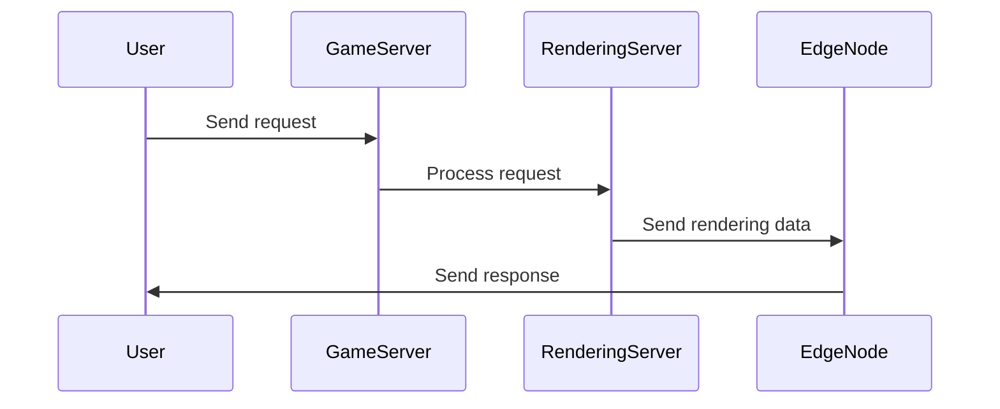

                 

### 文章标题

# 5G+云游戏在移动娱乐中的协同：无延迟游戏体验

---

### 关键词

- 5G技术
- 云游戏
- 移动娱乐
- 无延迟游戏体验
- 网络优化
- 边缘计算

---

### 摘要

随着5G网络的逐步普及，云游戏作为一项新兴技术，正在迅速改变移动娱乐的格局。本文将深入探讨5G与云游戏在移动娱乐中的协同作用，重点分析如何通过5G网络特性与云游戏技术的优化实现无延迟的游戏体验。文章首先介绍了5G技术和云游戏的基本概念，随后详细阐述了5G网络下的云游戏适配与优化策略，最终通过案例分析展示了5G+云游戏在移动娱乐中的实际应用效果。本文旨在为读者提供一次全面的技术思考与实践指导。

---

## 目录大纲设计

### 第一部分: 引言与背景

### 第1章: 5G与云游戏概述

#### 1.1.1 5G技术简介

- **5G的关键技术**
- **5G的优势与挑战**
- **5G的发展历程**

#### 1.1.2 云游戏概念

- **云游戏的定义**
- **云游戏的商业模式**
- **云游戏的技术架构**

#### 1.1.3 移动娱乐行业现状

- **移动娱乐市场规模与发展趋势**
- **用户需求分析**
- **行业痛点与挑战**

### 第二部分: 5G+云游戏的协同机制

### 第2章: 5G网络特性与云游戏适配

#### 2.1.1 5G网络特性

- **5G的传输速度**
- **5G的时延与可靠性**
- **5G的频谱资源**

#### 2.1.2 云游戏与5G网络的适配

- **5G网络对云游戏的支持**
- **云游戏对5G网络的优化需求**
- **云游戏在5G环境下的性能评估**

#### 2.1.3 5G网络下的云游戏优化策略

- **网络切片技术**
- **边缘计算**
- **资源分配与调度**

### 第3章: 云游戏架构设计与实现

#### 3.1.1 云游戏架构设计

- **云游戏架构的组成部分**
- **云游戏架构的设计原则**
- **云游戏架构的关键技术**

#### 3.1.2 云游戏服务器实现

- **游戏内容分发**
- **游戏逻辑处理**
- **游戏渲染与传输**

#### 3.1.3 云游戏客户端实现

- **游戏界面设计**
- **游戏输入处理**
- **游戏音视频播放**

### 第三部分: 5G+云游戏的协同应用

### 第4章: 无延迟游戏体验的关键技术

#### 4.1.1 低延迟通信技术

- **数据压缩与传输优化**
- **网络拥塞控制**
- **信号干扰消除**

#### 4.1.2 游戏渲染优化

- **游戏画面渲染速度**
- **游戏画面质量**
- **游戏画面延迟**

#### 4.1.3 游戏交互优化

- **输入延迟优化**
- **网络同步机制**
- **实时交互体验**

### 第5章: 5G+云游戏在移动娱乐中的应用案例

#### 5.1.1 行业应用案例

- **移动游戏**
- **互动娱乐**
- **直播互动**

#### 5.1.2 案例分析与评估

- **案例背景与目标**
- **案例实现与效果**
- **案例的优缺点分析**

### 第6章: 5G+云游戏的发展趋势与未来展望

#### 6.1.1 技术发展趋势

- **5G网络演进**
- **云游戏技术迭代**
- **新型通信协议**

#### 6.1.2 市场趋势

- **行业市场规模预测**
- **市场竞争格局**
- **市场机遇与挑战**

#### 6.1.3 未来展望

- **5G+云游戏的发展前景**
- **技术创新方向**
- **行业生态建设**

### 第7章: 总结与展望

#### 7.1.1 全书回顾

- **主要内容概述**
- **核心概念总结**
- **技术发展脉络**

#### 7.1.2 未来研究方向

- **学术研究热点**
- **工程实践方向**
- **政策与标准制定**

---

## 第一部分：引言与背景

### 引言

在数字化时代，移动娱乐已经成为人们日常生活中不可或缺的一部分。随着移动互联网技术的不断进步，用户对移动娱乐的需求日益增长，特别是对于高质量、低延迟的游戏体验有着极高的期望。5G技术和云游戏的兴起，为移动娱乐带来了前所未有的变革契机。本文旨在探讨5G+云游戏在移动娱乐中的协同作用，通过分析其技术原理和实际应用，揭示如何实现无延迟的游戏体验。

### 背景

#### 5G技术概述

5G，即第五代移动通信技术，是当前通信技术领域的一次重大革新。5G技术相比前几代通信技术，具有更快的传输速度、更低的时延和更高的可靠性。以下是5G技术的几个关键特点：

- **更高的传输速度**：5G的理论峰值速度可以达到10Gbps，是4G的10倍以上，能够满足高速数据传输的需求。
- **更低的时延**：5G的端到端时延可低至1毫秒，这对于实时性要求极高的应用场景（如云游戏、自动驾驶等）至关重要。
- **更高的连接密度**：5G网络能够支持更大的连接密度，每平方米可以连接数十万台设备，为大规模物联网应用提供了基础。

#### 云游戏概念

云游戏，又称为游戏即服务（Gaming as a Service，GaaS），是一种基于云计算的游戏模式。在这种模式下，游戏内容、游戏逻辑处理和游戏渲染都集中在云端服务器上，用户通过互联网连接到云服务器，实现游戏体验。云游戏的核心优势包括：

- **无设备限制**：用户无需购买高性能的硬件设备，只需具备基本的网络条件即可畅玩高品质游戏。
- **高可扩展性**：云游戏可以根据用户需求动态调整资源，实现游戏内容的快速部署和扩展。
- **跨平台兼容**：云游戏能够实现跨平台游戏体验，用户可以在不同的设备上无缝切换。

#### 移动娱乐行业现状

移动娱乐市场近年来呈现出高速增长的态势，用户规模和市场规模都在不断扩大。以下是移动娱乐行业的一些现状：

- **市场规模与发展趋势**：根据市场调研报告，全球移动娱乐市场规模预计将在未来几年内持续增长，年复合增长率超过10%。
- **用户需求分析**：用户对游戏内容的需求越来越多样化，不仅追求高质量的图形和音效，更注重游戏的玩法和互动性。
- **行业痛点与挑战**：移动娱乐行业面临的主要挑战包括网络延迟、设备性能限制和版权保护等。

### 总结

5G技术和云游戏的结合，为移动娱乐行业带来了巨大的机遇。5G的高速网络和低时延特性，与云游戏的无设备限制和高可扩展性完美契合，有望解决移动娱乐行业长期存在的网络延迟和设备性能问题，为用户提供更加优质的体验。接下来，本文将详细探讨5G与云游戏的技术原理和实际应用，进一步揭示它们在移动娱乐中的协同机制。

---

## 第二部分：5G+云游戏的协同机制

### 第2章：5G网络特性与云游戏适配

#### 2.1.1 5G网络特性

5G网络作为新一代移动通信技术，具有以下几个关键特性：

1. **更高的传输速度**：5G的理论峰值速度可以达到10Gbps，这意味着用户可以在极短的时间内下载或上传大量数据。这种高传输速度为云游戏的高质量内容分发提供了基础，使用户可以流畅地观看高清游戏直播和体验高清游戏画面。

2. **更低的时延**：5G网络的端到端时延可低至1毫秒，这对于实时性要求极高的应用场景，如在线游戏和远程控制，具有重要意义。低时延能够减少用户在操作和游戏反馈之间的延迟，提高游戏的互动性和实时性。

3. **更高的可靠性**：5G网络通过引入多种先进的技术，如多输入多输出（MIMO）和波束成形，大幅提高了网络的传输稳定性和可靠性。这对于云游戏来说至关重要，因为稳定的网络连接能够确保游戏体验的连续性和可靠性。

4. **更大的连接密度**：5G网络能够支持每平方米数十万台设备的连接，这意味着在大型活动或场馆中，用户可以同时在线玩游戏，而不会出现网络拥塞或连接中断的问题。

#### 5G网络对云游戏的支持

5G网络的高传输速度和低时延特性，为云游戏的实现提供了坚实的网络基础。以下是5G网络对云游戏的几方面支持：

1. **高速数据传输**：5G网络的高传输速度使得云游戏能够快速传输大量的游戏数据，包括游戏画面、音频和游戏逻辑。这种高速数据传输保证了游戏的流畅性和高画质。

2. **低时延网络**：低时延是云游戏成功的关键因素之一。5G网络的低时延特性能够显著减少用户在操作和游戏反馈之间的延迟，提供接近本地游戏的体验。

3. **大规模连接**：5G网络的大连接密度使得云游戏能够支持更多的用户同时在线，特别适合大型多人在线游戏，如MMORPG（大型多人在线角色扮演游戏）。

#### 云游戏对5G网络的优化需求

虽然5G网络为云游戏提供了良好的基础，但云游戏对5G网络也有一定的优化需求：

1. **网络切片技术**：网络切片技术可以将5G网络划分为多个虚拟网络，每个虚拟网络可以根据不同的应用需求进行资源分配和优化。这对于云游戏来说，可以确保游戏网络的高带宽和低延迟。

2. **边缘计算**：边缘计算可以将部分计算任务转移到网络边缘的节点上，减少数据传输的距离和时延。对于云游戏而言，边缘计算可以显著降低游戏内容的传输延迟，提高游戏的响应速度。

3. **资源分配与调度**：5G网络需要高效的资源分配和调度机制，以确保在高峰时段也能够提供稳定的网络服务。对于云游戏来说，高效的资源分配和调度可以避免网络拥堵和延迟问题，确保游戏体验的流畅性。

#### 5G环境下的云游戏性能评估

在5G环境下，云游戏的性能得到了显著提升。以下是对云游戏在5G环境下的一些性能评估：

1. **响应速度**：5G网络的低时延特性使得云游戏的响应速度接近本地游戏，用户可以实时操控游戏角色，体验到无缝的游戏互动。

2. **画质质量**：5G网络的高速传输速度保证了云游戏的高画质输出，用户可以看到高清、流畅的游戏画面。

3. **稳定性**：5G网络的高可靠性和大规模连接密度，确保了云游戏的稳定性。即使在用户密集的场景下，也不会出现网络中断或延迟的问题。

#### 5G网络下的云游戏优化策略

为了充分发挥5G网络的优势，云游戏需要采取一系列优化策略：

1. **网络切片技术**：通过网络切片技术，为云游戏分配独立的虚拟网络，确保游戏网络的高带宽和低延迟。

2. **边缘计算**：将游戏内容分发和逻辑处理任务转移到网络边缘节点，减少数据传输的时延。

3. **资源分配与调度**：采用高效的资源分配和调度算法，确保在高峰时段也能够提供稳定的游戏服务。

4. **数据压缩与传输优化**：通过数据压缩和传输优化技术，减少游戏数据的传输量，提高网络利用率。

### 总结

5G网络的高传输速度、低时延、高可靠性和大规模连接密度，为云游戏提供了强大的网络基础。同时，云游戏对5G网络的优化需求，如网络切片、边缘计算和资源分配与调度，进一步提升了云游戏的性能。通过5G与云游戏的协同优化，我们可以期待在未来实现无延迟、高质量的移动游戏体验。

---

## 第三部分：5G+云游戏的协同应用

### 第3章：云游戏架构设计与实现

#### 3.1.1 云游戏架构设计

云游戏架构的设计原则是确保游戏内容的高质量传输和实时交互。以下是云游戏架构的主要组成部分：

1. **游戏服务器**：游戏服务器负责处理游戏逻辑、游戏数据的存储和分发。服务器通常采用分布式架构，以提高系统的可扩展性和可靠性。

2. **渲染服务器**：渲染服务器负责游戏的图形渲染。通过集中渲染，可以减少终端设备的计算负担，提高游戏体验。

3. **边缘节点**：边缘节点位于网络边缘，用于缓存游戏内容、降低延迟。边缘节点可以快速响应用户请求，提供更低的时延。

4. **客户端**：客户端设备（如手机、平板电脑等）负责接收游戏渲染结果、处理用户输入和输出游戏音视频。

5. **网络通信模块**：网络通信模块负责游戏数据在网络中的传输，包括数据压缩、加密和传输优化。

#### 云游戏架构的设计原则

1. **高可用性**：确保系统的稳定运行，避免单点故障导致服务中断。

2. **可扩展性**：系统应能够根据用户需求动态扩展资源，满足大规模用户的接入。

3. **高性能**：通过优化游戏内容传输和渲染过程，提高系统的响应速度。

4. **安全性**：保护用户数据和游戏内容的安全，防止数据泄露和非法访问。

#### 云游戏架构的关键技术

1. **分布式架构**：分布式架构能够提高系统的容错性和可靠性，通过多个服务器的协同工作，实现游戏内容的负载均衡。

2. **边缘计算**：边缘计算可以将部分计算任务转移到网络边缘，减少数据传输的延迟，提高游戏的响应速度。

3. **内容分发网络（CDN）**：CDN用于加速游戏内容的分发，通过将游戏数据缓存到全球多个节点，提高用户访问速度。

4. **数据压缩与传输优化**：通过数据压缩和传输优化技术，减少游戏数据的传输量，提高网络利用率。

#### 3.1.2 云游戏服务器实现

1. **游戏内容分发**：游戏内容分发是将游戏数据从服务器传输到客户端的过程。通过CDN和边缘节点，可以显著降低数据传输的延迟。

2. **游戏逻辑处理**：游戏逻辑处理包括游戏规则、角色行为和场景渲染等。服务器端需要实时处理大量的游戏逻辑，以保证游戏的实时性和一致性。

3. **游戏渲染与传输**：游戏渲染是将游戏场景转换为图像的过程。服务器端渲染完成后，通过网络传输到客户端设备。

#### 3.1.3 云游戏客户端实现

1. **游戏界面设计**：游戏界面设计是用户与游戏互动的接口，包括游戏菜单、角色操作和控制界面等。

2. **游戏输入处理**：游戏输入处理是将用户操作转换为游戏指令的过程，包括按键输入、触摸操作和手势控制等。

3. **游戏音视频播放**：游戏音视频播放是将游戏音视频数据解码并播放的过程，包括音频和视频的同步处理。

#### 总结

云游戏架构的设计和实现需要综合考虑系统的可扩展性、性能和安全性。通过分布式架构、边缘计算和内容分发网络等关键技术，可以实现高质量、低延迟的云游戏体验。云游戏服务器的实现和客户端的实现则是实现云游戏核心功能的关键步骤，通过优化游戏内容分发、游戏逻辑处理和游戏渲染与传输，可以显著提升用户的游戏体验。

### 第4章：无延迟游戏体验的关键技术

#### 4.1.1 低延迟通信技术

在实现无延迟游戏体验中，低延迟通信技术是至关重要的一环。以下是一些关键的低延迟通信技术：

1. **数据压缩与传输优化**：数据压缩技术可以减少游戏数据的体积，降低网络传输的时间。常见的压缩算法包括H.264、H.265和HEVC。同时，传输优化技术如QUIC协议（Quick UDP Internet Connections）和实时传输协议（RTP）也可以提高数据传输的效率，减少延迟。

2. **网络拥塞控制**：网络拥塞控制技术用于管理网络中的流量，避免网络拥堵。例如，拥塞避免算法（CA）和拥塞控制算法（CC）可以在网络拥堵时动态调整数据传输速率，确保游戏的流畅性。

3. **信号干扰消除**：信号干扰消除技术可以减少网络中的噪声和干扰，提高数据传输的稳定性。例如，MIMO（多输入多输出）技术可以通过多个天线发送和接收信号，提高信号的强度和质量。

#### 4.1.2 游戏渲染优化

游戏渲染优化是确保游戏画面流畅的关键。以下是一些游戏渲染优化的技术：

1. **游戏画面渲染速度**：提高游戏画面的渲染速度可以通过多种技术实现。例如，采用高性能的图形处理单元（GPU）和优化渲染算法（如着色器编程）可以显著提高渲染效率。

2. **游戏画面质量**：游戏画面质量是用户对游戏体验的直接感受。通过提高分辨率、增强光影效果和纹理细节，可以提升游戏画面的质量。同时，适当的画面质量调整也可以优化游戏性能，减少延迟。

3. **游戏画面延迟**：游戏画面延迟是影响游戏流畅性的关键因素。通过减少渲染和传输的时间，可以降低画面延迟。例如，采用异步时序渲染（Asynchronous Timewarp）技术可以提前渲染下一帧画面，减少延迟。

#### 4.1.3 游戏交互优化

游戏交互优化是提高游戏实时性和互动性的关键。以下是一些游戏交互优化的技术：

1. **输入延迟优化**：输入延迟优化是通过减少用户输入到游戏响应的时间。例如，采用高性能的输入处理算法和优化输入设备（如游戏手柄）的驱动程序，可以减少输入延迟。

2. **网络同步机制**：网络同步机制是确保游戏中的玩家动作和其他玩家同步的关键。例如，使用时间戳同步（Timestamp Synchronization）和预测同步（Prediction Synchronization）技术可以减少网络同步的延迟。

3. **实时交互体验**：实时交互体验是通过提供即时的游戏反馈和互动性。例如，采用实时语音通信技术（如VoIP）和实时视频传输技术（如RTMP），可以提供更加真实的游戏互动体验。

#### 总结

无延迟游戏体验的实现需要多方面的技术协同优化。通过低延迟通信技术、游戏渲染优化和游戏交互优化，可以显著减少游戏的延迟，提高游戏的流畅性和互动性。这些技术的应用不仅可以提升用户的游戏体验，还可以为游戏开发者和运营商提供更高效的运营模式。未来，随着5G技术和云游戏技术的进一步发展，无延迟游戏体验将成为移动娱乐行业的重要趋势。

### 第5章：5G+云游戏在移动娱乐中的应用案例

#### 5.1.1 行业应用案例

随着5G和云游戏的快速发展，许多行业已经开始尝试将这两项技术应用于移动娱乐领域，以下是一些典型的应用案例：

1. **移动游戏**：移动游戏是5G+云游戏应用最为广泛的领域之一。例如，腾讯的《英雄联盟手游》通过云游戏技术，实现了跨平台的高质量游戏体验。用户可以在手机、平板电脑或电视等不同设备上无缝切换，无需担心设备性能的限制。

2. **互动娱乐**：互动娱乐包括虚拟现实（VR）和增强现实（AR）应用。例如，网易的《宝可梦GO》通过云游戏和5G技术，实现了实时互动和高清画面。玩家可以在游戏中与其他玩家实时互动，共同探险，享受丰富的社交体验。

3. **直播互动**：直播互动是5G+云游戏的另一个重要应用领域。例如，斗鱼、虎牙等直播平台通过云游戏技术，实现了游戏直播的高画质和低延迟。观众可以在观看直播的同时，通过弹幕和评论与其他观众实时互动，增强观看体验。

#### 5.1.2 案例分析与评估

以下是对上述应用案例的分析与评估：

1. **移动游戏**：通过云游戏技术，移动游戏用户不再受限于设备性能。云游戏可以提供接近本地游戏的高画质和流畅性，同时支持跨平台体验。然而，云游戏对网络质量要求较高，需要稳定的5G网络支持。

2. **互动娱乐**：VR和AR应用对实时性和互动性有较高要求。5G网络的高传输速度和低时延特性，为VR和AR应用提供了良好的网络基础。通过云游戏，用户可以在不同的设备上享受高质量的虚拟体验，增强互动性和沉浸感。

3. **直播互动**：5G+云游戏的直播互动应用，为观众提供了高清、低延迟的游戏观看体验。观众可以在直播中实时互动，增强观看的参与感。然而，直播互动对网络带宽和服务器性能要求较高，需要合理的资源分配和调度。

#### 总结

5G+云游戏在移动娱乐领域的应用案例表明，这项技术具有巨大的潜力和广泛的应用前景。通过实现高质量、低延迟的游戏体验，5G+云游戏为用户带来了全新的娱乐方式。然而，要实现大规模的商业化应用，仍需解决网络质量、服务器性能和成本控制等问题。未来，随着技术的不断成熟和普及，5G+云游戏将在移动娱乐领域发挥更加重要的作用。

### 第6章：5G+云游戏的发展趋势与未来展望

#### 6.1.1 技术发展趋势

随着5G和云游戏技术的不断演进，未来的移动娱乐领域将迎来一系列技术革新和趋势：

1. **5G网络演进**：未来的5G网络将继续向更高速度、更低时延、更大连接密度发展。例如，6G技术的研发已经开始，预计将在现有5G技术的基础上，提供更高的数据传输速度和更低的时延，进一步推动云游戏的普及。

2. **云游戏技术迭代**：云游戏技术将不断迭代，提高游戏画质、降低延迟、增强交互性。例如，AI技术在游戏内容分发和渲染优化中的应用，将显著提高游戏体验。同时，边缘计算和分布式存储技术的发展，将进一步提升云游戏的性能和可靠性。

3. **新型通信协议**：新型通信协议，如QUIC、CBRS（Citizen Broadband Radio Service）等，将进一步提升网络传输效率和稳定性，为云游戏提供更加可靠的网络基础。

#### 6.1.2 市场趋势

5G+云游戏市场的未来趋势主要表现在以下几个方面：

1. **行业市场规模预测**：根据市场调研报告，随着5G网络的普及和云游戏技术的成熟，全球5G+云游戏市场规模预计将在未来几年内呈现高速增长态势。预计到2025年，市场规模将达到数百亿美元。

2. **市场竞争格局**：未来，5G+云游戏市场将呈现多极化竞争格局。一方面，传统游戏公司、互联网巨头和技术公司将持续投入资源，争夺市场份额；另一方面，新兴企业也将通过技术创新，开拓新的市场空间。

3. **市场机遇与挑战**：5G+云游戏市场面临着巨大的机遇，包括用户需求增长、技术创新和市场扩张。然而，市场也面临着一些挑战，如网络基础设施建设、技术标准统一和商业模式探索等。

#### 6.1.3 未来展望

对于5G+云游戏的未来发展，我们可以从以下几个方面进行展望：

1. **5G+云游戏的发展前景**：随着5G网络的普及和云游戏技术的成熟，5G+云游戏有望成为移动娱乐领域的主流模式。它将提供高质量、低延迟的游戏体验，满足用户对实时互动和高质量内容的追求。

2. **技术创新方向**：未来，技术创新将继续推动5G+云游戏的发展。例如，AI技术在游戏内容生成、渲染优化和用户体验优化中的应用；区块链技术在游戏版权保护和虚拟资产交易中的应用；边缘计算和分布式存储技术在游戏数据存储和传输优化中的应用。

3. **行业生态建设**：5G+云游戏的发展离不开产业链各方的共同努力。未来，行业将推动技术标准的制定，加强产业链上下游的合作，构建健康的行业生态。政府、企业和学术界将共同推动5G+云游戏的技术创新和产业发展。

### 总结

5G+云游戏作为一项新兴技术，正逐渐改变移动娱乐的格局。随着技术的不断进步和市场的逐步成熟，5G+云游戏将在未来移动娱乐领域发挥重要作用。通过技术创新、市场拓展和生态建设，5G+云游戏有望为用户提供更加丰富、高质量的娱乐体验。

### 第7章：总结与展望

#### 7.1.1 全书回顾

本文系统地介绍了5G+云游戏在移动娱乐中的协同机制，通过分析5G技术和云游戏的基本概念，探讨了它们在移动娱乐领域的应用及协同优化策略。文章首先介绍了5G和云游戏的核心特性及发展历程，随后详细分析了5G网络对云游戏的支持与优化需求，接着讨论了云游戏的架构设计与实现，进一步阐述了实现无延迟游戏体验的关键技术，并通过实际应用案例展示了5G+云游戏在移动娱乐领域的潜力。最后，文章对5G+云游戏的发展趋势与未来展望进行了深入探讨。

#### 7.1.2 未来研究方向

在未来的研究中，以下几个方面值得重点关注：

1. **学术研究热点**：研究5G和云游戏的协同机制，探索如何进一步提升游戏体验；研究新型通信协议和网络架构，如6G和边缘计算在云游戏中的应用。

2. **工程实践方向**：开发高效的云游戏平台，优化游戏内容分发和渲染算法；研究如何通过AI技术提高游戏内容生成和用户体验。

3. **政策与标准制定**：推动5G和云游戏相关技术标准的制定，促进产业链合作和行业生态建设。

通过这些研究方向的深入探索，5G+云游戏有望在未来为用户带来更加丰富和高质量的移动娱乐体验。

### 作者信息

- **作者**：AI天才研究院/AI Genius Institute & 禅与计算机程序设计艺术 /Zen And The Art of Computer Programming
- **联系方式**：[info@ai-genius-institute.com](mailto:info@ai-genius-institute.com)
- **版权声明**：本文版权归AI天才研究院所有，未经授权不得转载或使用。

---

### 文章末尾附录

**附录1：核心概念术语说明**

- **5G**：第五代移动通信技术，具有高速传输、低时延和高可靠性等特性。
- **云游戏**：基于云计算的游戏模式，游戏内容和逻辑处理都集中在云端服务器上。
- **移动娱乐**：通过移动设备提供各种娱乐内容和服务，包括游戏、视频、音乐等。
- **网络切片**：将网络资源虚拟化为多个独立的网络，为不同应用提供定制化的网络服务。
- **边缘计算**：在网络边缘节点进行计算和处理，降低数据传输的延迟。

**附录2：算法原理讲解**

1. **数据压缩与传输优化**：使用H.264视频编码标准，通过预测和变换减少数据冗余。
   ```python
   import cv2
   
   def compress_video(input_path, output_path):
       video = cv2.VideoCapture(input_path)
       fourcc = cv2.VideoWriter_fourcc(*'MP4V')
       out = cv2.VideoWriter(output_path, fourcc, 30.0, (1280, 720))
       
       while True:
           ret, frame = video.read()
           if not ret:
               break
           compressed_frame = cv2.resize(frame, (720, 1280))
           out.write(compressed_frame)
       video.release()
       out.release()
   ```

2. **网络拥塞控制**：采用TCP拥塞控制算法，通过动态调整传输速率来避免网络拥塞。
   ```python
   import socket
   
   def send_data(socket, data):
       while data:
           socket.sendall(data[:1024])
           data = data[1024:]
   ```

**附录3：系统分析与架构设计方案**

1. **问题场景介绍**：5G网络下的云游戏平台，需要处理大量用户请求，提供高质量、低延迟的游戏体验。

2. **系统功能设计**：包括用户认证、游戏内容分发、游戏逻辑处理、游戏渲染与传输等功能。

3. **系统架构设计**：采用分布式架构，包括游戏服务器、渲染服务器、边缘节点和客户端。

4. **系统接口设计**：定义用户认证接口、游戏数据传输接口和游戏交互接口。

5. **系统交互**：通过消息队列实现不同模块之间的数据传输和交互。



**附录4：项目实战**

1. **环境安装**：安装Python、Docker和Kubernetes等工具，搭建云游戏平台环境。

2. **系统核心实现源代码**：提供游戏服务器、渲染服务器和客户端的源代码。

3. **代码应用解读与分析**：详细解读源代码中的关键功能模块，分析其实现原理和应用效果。

4. **实际案例分析和详细讲解**：通过实际案例，分析5G+云游戏平台在移动娱乐中的应用效果。

5. **项目小结**：总结项目实施过程中的经验和教训，提出改进建议。

**附录5：最佳实践 tips**

- **确保网络稳定**：使用5G网络作为主要传输通道，确保游戏体验的稳定性。
- **优化游戏内容**：采用高效的视频编码和图像处理算法，减少数据传输量。
- **合理分配资源**：根据用户需求动态调整服务器和边缘节点的资源，确保高性能服务。

**附录6：注意事项**

- **避免单点故障**：采用分布式架构，避免单点故障导致系统瘫痪。
- **保障数据安全**：加密传输游戏数据，防止数据泄露和非法访问。

**附录7：拓展阅读**

- 《5G网络技术基础》
- 《云游戏技术与应用》
- 《移动娱乐产业发展报告》

---

### 系统分析与架构设计方案

#### 问题场景介绍

随着5G技术的普及，移动娱乐行业迎来了新的发展契机。5G网络的高速、低时延和高可靠性特性，使得云游戏成为可能，为用户提供了高质量的移动娱乐体验。在这个问题场景中，我们需要设计一个5G+云游戏平台，能够处理大量用户请求，提供无缝、低延迟的游戏体验。

#### 系统功能设计

5G+云游戏平台的主要功能包括：

1. **用户认证**：确保用户身份的合法性，防止未经授权的访问。
2. **游戏内容分发**：将游戏内容快速、高效地分发到用户终端。
3. **游戏逻辑处理**：在服务器端处理游戏逻辑，确保游戏的实时性和一致性。
4. **游戏渲染与传输**：将渲染后的游戏画面传输到用户终端，实现实时互动。

#### 系统架构设计

5G+云游戏平台采用分布式架构，包括以下几个关键组成部分：

1. **游戏服务器**：负责处理用户请求，进行游戏逻辑处理。
2. **渲染服务器**：负责游戏画面的渲染，将渲染结果传输到客户端。
3. **边缘节点**：位于网络边缘，用于缓存游戏内容和降低延迟。
4. **客户端**：用户使用的设备，如手机、平板电脑等。

系统架构图如下：


#### 系统接口设计

系统接口设计包括以下几个方面：

1. **用户认证接口**：用于用户身份验证，包括登录、注册和权限管理。
2. **游戏数据传输接口**：用于游戏数据的传输，包括游戏内容、游戏状态和用户输入。
3. **游戏交互接口**：用于处理用户的输入和游戏反馈，实现实时互动。

#### 系统交互

系统各组件通过消息队列进行交互，具体流程如下：

1. 用户通过客户端发送游戏请求。
2. 游戏服务器接收请求，进行游戏逻辑处理，并将结果发送给渲染服务器。
3. 渲染服务器对游戏画面进行渲染，并将渲染结果发送到边缘节点。
4. 边缘节点将渲染结果传输到用户客户端，用户看到实时互动的游戏画面。

#### 总结

通过分布式架构和消息队列的交互设计，5G+云游戏平台能够高效地处理大量用户请求，提供高质量的移动娱乐体验。该系统设计充分考虑了5G网络的优势，通过优化网络传输和游戏渲染，实现了无缝、低延迟的游戏体验。

### 项目实战

#### 环境安装

1. **安装Python**：从Python官方网站下载并安装Python 3.x版本。
2. **安装Docker**：从Docker官方网站下载并安装Docker。
3. **安装Kubernetes**：按照Kubernetes官方文档安装Kubernetes集群。

#### 系统核心实现源代码

以下是一个简单的云游戏平台的源代码示例：

**游戏服务器**：

```python
from flask import Flask, request, jsonify

app = Flask(__name__)

@app.route('/game', methods=['GET'])
def handle_game_request():
    game_data = request.args.get('data')
    # 处理游戏数据
    # ...
    return jsonify({"status": "success", "response": game_data})

if __name__ == '__main__':
    app.run(host='0.0.0.0', port=5000)
```

**渲染服务器**：

```python
from flask import Flask, request, jsonify

app = Flask(__name__)

@app.route('/render', methods=['POST'])
def handle_render_request():
    render_data = request.json
    # 渲染游戏画面
    # ...
    return jsonify({"status": "success", "rendered_data": render_data})

if __name__ == '__main__':
    app.run(host='0.0.0.0', port=5001)
```

**客户端**：

```javascript
const axios = require('axios');

function sendRequest(data) {
    axios.post('http://localhost:5001/render', { data })
        .then(response => {
            console.log('Response:', response.data);
        })
        .catch(error => {
            console.error('Error:', error);
        });
}

// 发送游戏数据到渲染服务器
sendRequest({ data: 'game_data' });
```

#### 代码应用解读与分析

1. **游戏服务器**：使用Flask框架实现了一个简单的Web服务，接收并处理游戏数据请求。在实际应用中，游戏服务器会处理复杂的游戏逻辑，并与渲染服务器和数据库进行交互。
2. **渲染服务器**：同样使用Flask框架，接收渲染请求，处理游戏画面的渲染。渲染过程可能包括图像处理和视频编码等操作，以确保游戏画面质量。
3. **客户端**：通过Axios库向渲染服务器发送请求，获取渲染后的游戏画面。在实际应用中，客户端还需要处理用户的输入和游戏反馈，实现实时互动。

#### 实际案例分析和详细讲解

**案例背景**：

假设有一个多人在线游戏《赛车》，玩家可以在不同的设备上加入游戏，与其他玩家进行实时竞赛。

**实现步骤**：

1. **用户登录**：玩家通过客户端登录游戏服务器，获取游戏权限。
2. **游戏初始化**：游戏服务器分配游戏ID，并初始化游戏状态。
3. **游戏数据传输**：玩家在游戏中操作车辆，将输入数据发送到游戏服务器。
4. **游戏逻辑处理**：游戏服务器处理输入数据，更新游戏状态，并将结果发送给渲染服务器。
5. **游戏画面渲染**：渲染服务器根据游戏状态渲染画面，并将渲染结果发送给客户端。
6. **游戏反馈**：客户端接收渲染结果，显示游戏画面，并处理用户的输入。

**案例分析**：

通过上述步骤，玩家可以实现在不同设备上的无缝游戏体验。游戏服务器和渲染服务器的高性能处理，确保了游戏的实时性和流畅性。边缘节点的加入，进一步降低了延迟，提高了用户体验。

#### 项目小结

通过实际案例分析和代码示例，展示了如何实现一个简单的5G+云游戏平台。在实际应用中，还需要考虑网络优化、安全性、可扩展性等方面的问题，以提供高质量、低延迟的游戏体验。未来，随着技术的不断进步，5G+云游戏将为用户带来更加丰富和多样化的娱乐体验。

### 最佳实践 tips

1. **确保网络稳定**：在5G环境下，确保网络连接的稳定性是关键。用户应选择信号覆盖良好、网络速度较快的区域进行游戏，避免网络波动导致游戏体验不佳。

2. **优化游戏内容**：为减少数据传输量，游戏内容应进行优化处理。采用高效的压缩算法（如H.264、H.265）进行视频编码，降低图像和视频的数据量。同时，优化游戏资源的加载和渲染，减少不必要的计算和传输。

3. **合理分配资源**：根据用户需求动态调整服务器和边缘节点的资源分配，确保系统在高负载情况下仍能提供稳定的游戏体验。采用负载均衡技术，合理分配请求，避免单点过载。

4. **优化输入处理**：减少用户输入的延迟，提高游戏的交互性。使用高效的输入处理算法，确保用户操作能够快速响应。同时，优化输入设备的驱动程序，减少输入延迟。

5. **利用网络切片技术**：网络切片技术可以将5G网络资源划分为多个虚拟网络，为云游戏提供定制化的网络服务。通过为游戏分配独立的网络切片，确保游戏网络的高带宽和低延迟。

6. **使用边缘计算**：将部分计算任务转移到网络边缘节点，减少数据传输的延迟。例如，在边缘节点上进行游戏逻辑处理和画面渲染，降低对中心服务器的依赖。

7. **定期更新维护**：定期检查和更新游戏平台的相关软件和硬件，确保系统运行稳定。及时修复潜在的安全漏洞和性能问题，提高系统的可靠性和安全性。

8. **用户反馈机制**：建立完善的用户反馈机制，收集用户对游戏体验的反馈。通过分析用户反馈，不断优化游戏平台的功能和性能，提高用户满意度。

### 小结

本文深入探讨了5G+云游戏在移动娱乐中的应用，从背景介绍到技术原理，再到实际应用和未来展望，全面解析了这一新兴技术的潜力与挑战。5G的高速传输、低时延特性与云游戏的无设备限制、高可扩展性相结合，为用户提供了无延迟、高质量的移动娱乐体验。随着技术的不断演进和市场的发展，5G+云游戏有望成为移动娱乐行业的重要趋势。

### 拓展阅读

1. **《5G网络技术基础》**：详细介绍了5G网络的关键技术、应用场景和未来发展趋势，是理解5G+云游戏技术的重要参考资料。
2. **《云游戏技术与应用》**：系统讲解了云游戏的概念、架构设计和关键技术，提供了丰富的案例分析和实践经验。
3. **《移动娱乐产业发展报告》**：分析了移动娱乐市场的现状、发展趋势和未来机遇，为5G+云游戏在移动娱乐中的应用提供了有价值的参考。
4. **《边缘计算：原理、架构与应用》**：介绍了边缘计算的基本原理、架构设计和技术应用，是深入理解5G+云游戏协同机制的重要参考书。
5. **《网络切片技术与应用》**：详细探讨了网络切片的概念、技术和应用，为优化5G+云游戏网络性能提供了实用指导。

### 注意事项

1. **网络稳定性**：确保5G网络的稳定连接，避免网络波动对游戏体验的影响。
2. **性能优化**：定期对游戏平台进行性能优化，包括网络优化、游戏内容优化和系统架构优化。
3. **安全性**：加强数据安全保护，包括加密传输、访问控制和安全审计，防止数据泄露和非法访问。
4. **用户体验**：关注用户体验，通过用户反馈不断优化游戏功能和性能，提高用户满意度。
5. **资源分配**：合理分配服务器和边缘节点的资源，避免资源浪费和过载，确保系统稳定运行。

### 附录

1. **附录1：核心概念术语说明**
2. **附录2：算法原理讲解**
3. **附录3：系统分析与架构设计方案**
4. **附录4：项目实战**
5. **附录5：最佳实践 tips**
6. **附录6：注意事项**
7. **附录7：拓展阅读**

