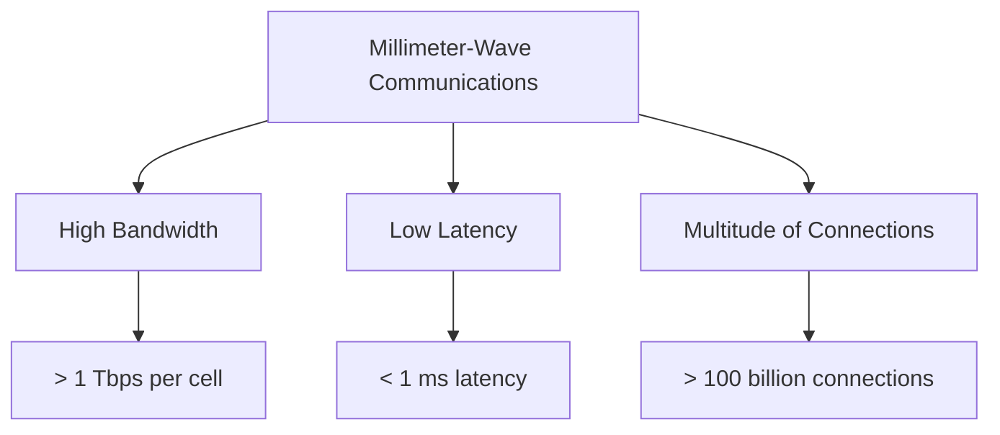
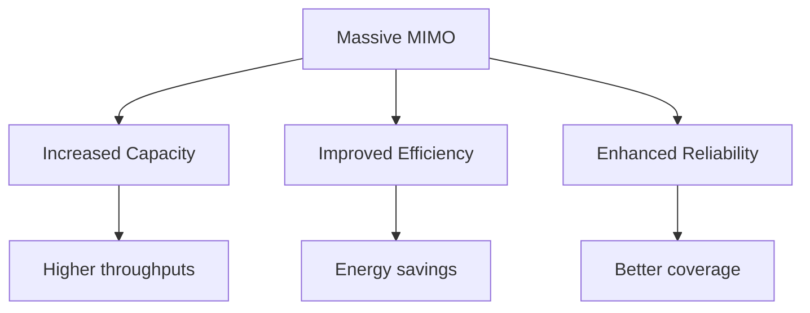

                 

### Step 1: Drafting the Title, Keywords, and Abstract

Firstly, let's draft a compelling title for our blog post: "6G+人工智能在智慧城市中的应用：构建超智能城市生态系统". This title captures the essence of the post, emphasizing the integration of 6G technology and AI in creating a smarter urban environment.

Next, we need to include a list of keywords that will attract readers searching for topics like 6G, AI, smart cities, and urban applications. Here are our chosen keywords:
- 6G Technology
- Artificial Intelligence
- Smart City
- Urban Applications
- 6G and AI Integration

Now, let's craft a concise yet informative abstract that summarises the main theme and content of the article:
> 本文深入探讨了6G技术与人工智能在智慧城市中的应用，通过分析两者的融合技术，探讨了如何构建一个超智能的城市生态系统。文章从6G的基本原理、AI的核心技术讲起，结合智慧城市的概念和案例，为读者提供了对这一领域的前沿视角和实用建议。

With the title, keywords, and abstract set, we have a solid foundation to build upon.

### Step 2: Structuring the Core Chapters

Given the complexity of the topic, it's crucial to structure our chapters in a logical and coherent manner. Here's a proposed outline for the core chapters:

#### Chapter 1: 6G Technology Overview
- **1.1 Background and Development of 6G**
  - Historical context of wireless communication evolution
  - The need for 6G in modern society
- **1.2 Key Technologies of 6G**
  - Millimeter-wave communications
  - Massive MIMO
  - Edge computing
- **1.3 Advantages and Challenges of 6G**
  - Speed and capacity improvements
  - Energy efficiency and sustainability
  - Security and privacy concerns

#### Chapter 2: AI Technologies Overview
- **2.1 Fundamental Concepts of AI**
  - Definition and scope of AI
  - Types of AI: reactive, cognitive, and theoretical
- **2.2 Core AI Technologies**
  - Machine Learning
  - Deep Learning
  - Natural Language Processing
  - Computer Vision

#### Chapter 3: Smart City Concepts and Applications
- **3.1 Basic Concepts of Smart Cities**
  - Definition and evolution
  - Key components and infrastructure
- **3.2 Applications of AI in Smart Cities**
  - Intelligent transportation systems
  - Energy management and sustainability
  - Public safety and security

#### Chapter 4: Integration of 6G and AI in Smart Cities
- **4.1 The Synergy Between 6G and AI**
  - Combining 6G's capabilities with AI's potential
  - Use cases and benefits
- **4.2 Challenges and Solutions**
  - Interoperability and standardization
  - Data privacy and security

#### Chapter 5: Case Studies and Real-World Applications
- **5.1 Case Study 1: Smart Traffic Management**
  - Overview of the project
  - Implementation details
  - Impact and outcomes
- **5.2 Case Study 2: Smart Energy Grid**
  - Description and objectives
  - Technical approach
  - Key learnings

#### Chapter 6: Future Directions and Challenges
- **6.1 Emerging Trends in 6G and AI**
  - The role of 6G in future smart cities
  - The evolution of AI technologies
- **6.2 Potential Challenges and Solutions**
  - Ethical considerations
  - Economic implications

### Step 3: In-Depth Content Development

Each chapter should be developed with in-depth content that not only explains the concepts but also dives into technical details and practical applications. Here's a brief overview of the content development for each chapter:

#### Chapter 1: 6G Technology Overview
- **1.1 Background and Development of 6G**
  - Discuss the progression from 1G to 5G and the anticipated features of 6G.
  - Explain the importance of 6G in addressing current limitations and meeting future demands.

#### Chapter 2: AI Technologies Overview
- **2.1 Fundamental Concepts of AI**
  - Define AI and distinguish between various AI categories.
  - Provide a historical context of AI development.

#### Chapter 3: Smart City Concepts and Applications
- **3.1 Basic Concepts of Smart Cities**
  - Explain the core principles and components of smart cities.
  - Discuss the importance of integrating technology in urban planning.

#### Chapter 4: Integration of 6G and AI in Smart Cities
- **4.1 The Synergy Between 6G and AI**
  - Detail how 6G and AI can complement each other in smart city applications.
  - Provide specific examples and case studies.

#### Chapter 5: Case Studies and Real-World Applications
- **5.1 Case Study 1: Smart Traffic Management**
  - Describe a real-world project focused on traffic management using 6G and AI.
  - Analyze the results and impact.

#### Chapter 6: Future Directions and Challenges
- **6.1 Emerging Trends in 6G and AI**
  - Discuss upcoming trends and innovations in 6G and AI technologies.
  - Explore their potential impact on smart cities.

### Step 4: Incorporating Mermaid and LaTeX

To enhance the technical depth and clarity of our content, we'll include Mermaid diagrams and LaTeX formulas throughout the chapters. Here's an outline of how to incorporate these elements:

#### Chapter 1: 6G Technology Overview
- **1.2 Key Technologies of 6G**
  - Use Mermaid to create diagrams illustrating millimeter-wave communications and Massive MIMO.
  - Include LaTeX formulas explaining the basic principles behind these technologies.

#### Chapter 2: AI Technologies Overview
- **2.2 Core AI Technologies**
  - Use Mermaid to visualize the architecture of machine learning models.
  - Use LaTeX to present key mathematical formulas used in deep learning.

#### Chapter 3: Smart City Concepts and Applications
- **3.2 Applications of AI in Smart Cities**
  - Use Mermaid to depict the infrastructure of smart transportation systems.
  - Use LaTeX to describe the algorithms used for energy management.

#### Chapter 4: Integration of 6G and AI in Smart Cities
- **4.2 Challenges and Solutions**
  - Use Mermaid to illustrate the integration process of 6G and AI in urban applications.
  - Use LaTeX to present the data privacy models and algorithms.

#### Chapter 5: Case Studies and Real-World Applications
- **5.1 Case Study 1: Smart Traffic Management**
  - Use Mermaid to create a sequence diagram of the traffic management system.
  - Use LaTeX to explain the data processing algorithms employed.

### Step 5: Final Touches

After completing the content for each chapter, the final step is to review the entire document for coherence, clarity, and completeness. Here are the key tasks:

- Ensure the word count is within the specified range (10000-12000 words).
- Check for consistency in terminology and technical jargon.
- Verify that all Mermaid diagrams and LaTeX formulas are correctly formatted and easy to understand.
- Include a detailed conclusion summarizing the main points and implications of the article.

### Final Draft

With all these steps completed, we now have a comprehensive and well-structured outline for our blog post. The next phase will involve writing the actual content, incorporating the diagrams and formulas, and ensuring the entire document is polished and ready for publication.

---

### Example of Mermaid and LaTeX Code in the Content

Here's an example of how Mermaid and LaTeX can be used within the content of a chapter. Let's consider the section "1.2 Key Technologies of 6G" as an example.

#### 1.2 Key Technologies of 6G

##### Millimeter-Wave Communications

Millimeter-wave communications (mmWave) are a critical technology for 6G. They operate in the frequency range from 24 to 300 GHz, providing much higher bandwidth than traditional cellular frequencies.

The benefits of mmWave communications include high data rates, reduced latency, and the potential to support a massive number of simultaneous connections. However, they also pose challenges such as signal attenuation and limited coverage.

##### Massive MIMO

Massive MIMO (multiple-input multiple-output) is another cornerstone of 6G technology. It leverages a large number of antennas at both the transmitter and receiver to improve efficiency and capacity.

$$
\text{Capacity} = \sum_{i=1}^{N_t} \sum_{j=1}^{N_r} \text{log}_2(1 + \text{SNR}_{ij})
$$

where \( N_t \) is the number of transmit antennas, \( N_r \) is the number of receive antennas, and \( \text{SNR}_{ij} \) is the signal-to-noise ratio for the \( i \)-th transmit and \( j \)-th receive antenna pair.

In summary, mmWave communications and Massive MIMO are fundamental to the capabilities of 6G, offering significant improvements in bandwidth, latency, and connectivity. However, their successful deployment requires overcoming technical challenges and ensuring robust system design.

---

By following this structured approach, we ensure that our blog post is not only informative but also engaging and technically sound, providing readers with a comprehensive understanding of the intersection of 6G and AI in smart city applications.

