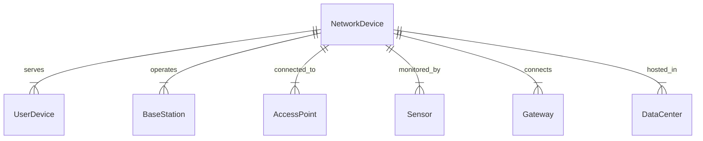
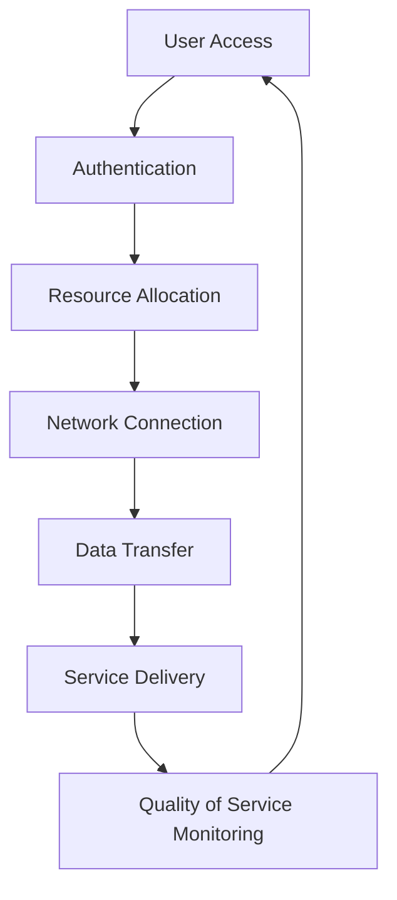
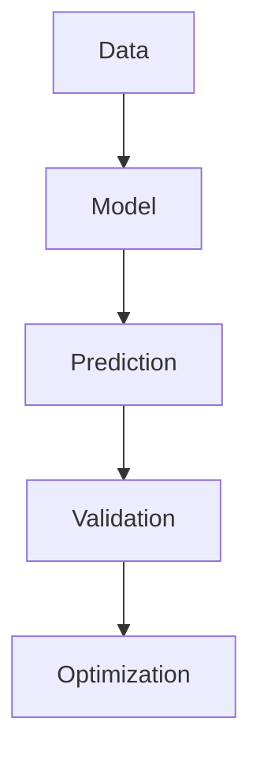
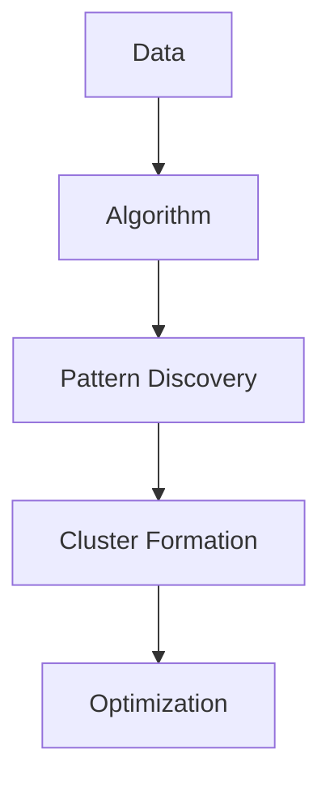
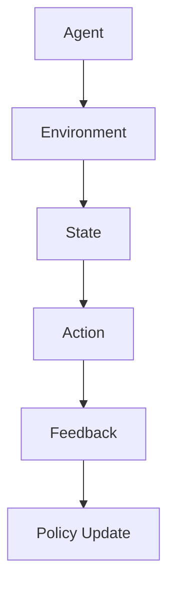
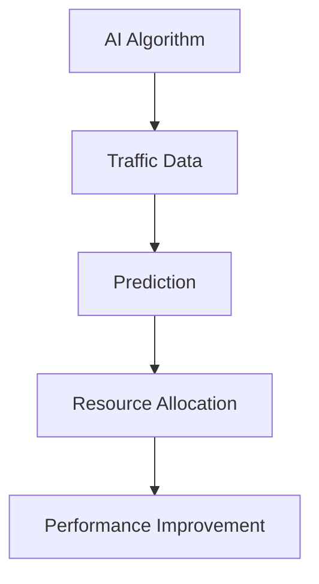
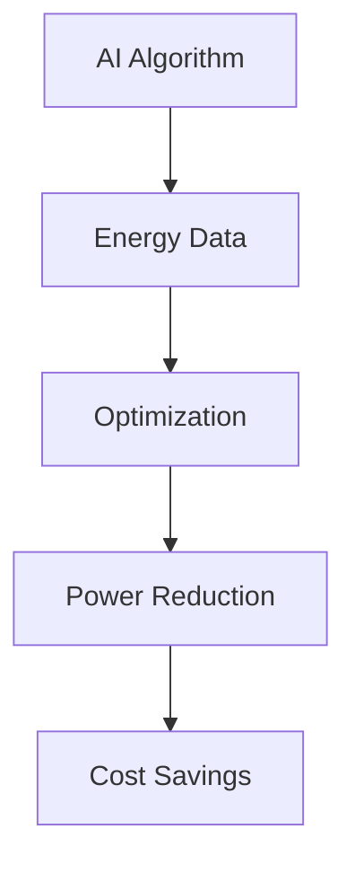
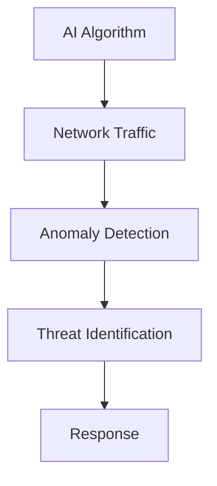
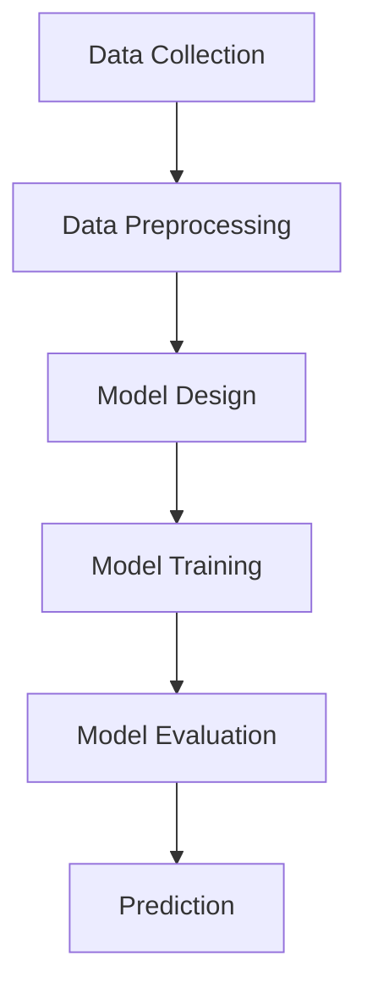
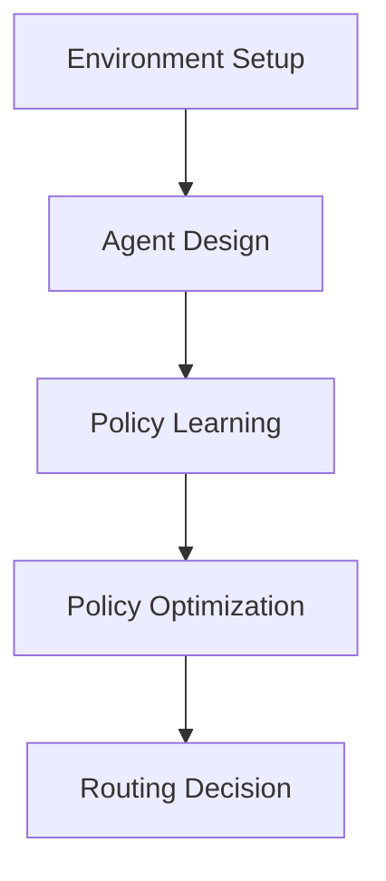

                 

## 6G+ AI: A Glimpse into the Intelligent Future of Communication Networks

### Keywords: 6G, AI, Communication Networks, Intelligent Future, Networking Technologies

> Abstract: This article delves into the transformative impact of integrating Artificial Intelligence (AI) with 6G technology, exploring how the synergy between these two groundbreaking innovations is poised to revolutionize the future of communication networks. We will examine the background and significance of 6G and AI, discuss their core concepts and architectural design, delve into AI algorithms applied in 6G networks, and present a comprehensive analysis of the systems and architectures involved. Through a series of step-by-step analyses, we aim to provide a clear and insightful understanding of the potential and challenges of this groundbreaking technology.

---

### Part 1: Introduction to 6G and AI

#### Chapter 1: The Background and Significance of 6G and AI

##### 1.1 The Evolution of 6G Technology

The evolution of communication technologies has been a testament to human innovation and progress. From the initial 1G networks that introduced mobile communication to the advanced 5G networks that have transformed industries and lifestyles, each generation has brought about significant improvements in speed, capacity, and efficiency. As we stand on the brink of a new era, 6G technology promises to take these advancements to unprecedented levels.

###### 1.1.1 From 1G to 5G: A Brief History

1. **1G (1st Generation, 1980s-1990s):** The first generation of mobile networks introduced analog cellular communication, primarily used for voice calls.
2. **2G (2nd Generation, 1990s-2000s):** With the advent of digital communication, 2G networks offered improved voice quality and introduced SMS messaging.
3. **3G (3rd Generation, 2000s-2010s):** 3G networks introduced faster data speeds, enabling basic internet services and multimedia applications.
4. **4G (4th Generation, 2010s-2020s):** 4G brought about a significant leap in speed and capacity, enabling high-quality video streaming, cloud computing, and IoT applications.
5. **5G (5th Generation, 2020s and beyond):** 5G networks promise ultra-fast speeds, ultra-low latency, and massive connectivity, enabling applications such as autonomous vehicles, remote surgery, and smart cities.

###### 1.1.2 The Advantages and Applications of 6G

6G technology is expected to surpass the capabilities of 5G in several dimensions, including speed, latency, energy efficiency, and network density. Some of the key advantages and applications of 6G are:

- **Terahertz Band:** 6G will utilize the Terahertz (THz) band, providing frequencies ranging from 100 GHz to 3 THz, enabling ultra-high data rates.
- **Mega-兆比特率:** 6G networks are expected to achieve data rates of up to several Gbps per user, compared to 1-2 Gbps in 5G.
- **Ultra-Low Latency:** 6G will achieve latency as low as 1 microsecond, facilitating real-time applications such as autonomous driving and remote surgery.
- **Massive Connectivity:** 6G networks will support a massive number of connected devices, including IoT devices, robots, and drones.
- **Advanced AI Integration:** 6G will integrate advanced AI algorithms for network management, optimization, and security.

##### 1.2 Fundamental Concepts of 6G and AI

###### 1.2.1 Definition and Core Technologies of 6G

6G is the sixth generation of mobile network technology, expected to provide ultra-fast speeds, ultra-low latency, and massive connectivity. Some of the key core technologies of 6G include:

- **Millimeter-Wave Communication:** 6G will utilize millimeter-wave frequencies to provide ultra-high data rates and capacity.
- **Massive MIMO:** Massive MIMO (Multiple Input Multiple Output) technology will use large arrays of antennas to enhance spectral efficiency and capacity.
- **Network Slicing:** Network slicing allows the creation of multiple virtual networks on a single physical infrastructure, enabling customization and optimization for different applications.
- **Terahertz Communication:** 6G will utilize the Terahertz band for ultra-high data rates and capacity.
- **Advanced AI Algorithms:** AI algorithms will be used for network management, optimization, and security in 6G networks.

###### 1.2.2 Basics of Artificial Intelligence

Artificial Intelligence (AI) refers to the simulation of human intelligence in machines that are programmed to think like humans and mimic their actions. AI has evolved significantly over the past few decades and has found applications in various fields, including healthcare, finance, and transportation. Some of the key concepts and technologies in AI include:

- **Machine Learning:** Machine Learning (ML) is a subset of AI that enables machines to learn from data, identify patterns, and make decisions with minimal human intervention.
- **Deep Learning:** Deep Learning (DL) is a subfield of ML that uses neural networks with many layers to extract high-level features from data.
- **Natural Language Processing (NLP):** NLP is a field of AI that focuses on the interaction between computers and humans through natural language.
- **Computer Vision:** Computer Vision is a field of AI that enables machines to interpret and understand the visual world.
- **Reinforcement Learning:** Reinforcement Learning (RL) is a type of ML where an agent learns to make decisions by interacting with an environment and receiving feedback in the form of rewards or penalties.

###### 1.2.3 The Synergy between 6G and AI

The integration of 6G and AI technologies holds immense potential for transforming communication networks and enabling new applications. Some of the key synergies between 6G and AI include:

- **Intelligent Network Management:** AI algorithms can optimize network resources, improve network performance, and enhance user experience in 6G networks.
- **Advanced Network Security:** AI can be used for real-time threat detection, intrusion prevention, and other security aspects of 6G networks.
- **Energy Efficiency:** AI can help in optimizing power consumption and improving the energy efficiency of 6G networks.
- **Customization and Personalization:** AI can enable personalized services and experiences by analyzing user data and preferences.
- **Scalability and Reliability:** AI can enhance the scalability and reliability of 6G networks by automating network management tasks and predicting network failures.

##### 1.3 Overview of AI-Enabled 6G Networks

The integration of AI with 6G technology is expected to bring about significant improvements in network management, performance, and security. Some of the key aspects of AI-enabled 6G networks include:

###### 1.3.1 Intelligent Network Management

Intelligent network management is a key application of AI in 6G networks. AI algorithms can be used for tasks such as network planning, optimization, and resource allocation. By analyzing historical data and real-time network conditions, AI can optimize network resources to provide high-quality service to users. For example, AI can predict user behavior and allocate network resources accordingly, ensuring that bandwidth is available when and where it is needed.

###### 1.3.2 AI Applications in 6G Communication

AI can enhance the performance of 6G communication systems by enabling advanced signal processing, modulation, and coding techniques. For example, AI can be used to design adaptive modulation and coding schemes that dynamically adjust to the channel conditions, improving data rates and reliability. AI can also optimize the use of spectrum resources by identifying and utilizing underutilized frequency bands.

###### 1.3.3 Future Trends and Challenges

The integration of 6G and AI technologies is poised to bring about significant advancements in communication networks. However, there are several challenges and trends that need to be addressed:

- **Scalability:** As the number of connected devices and data traffic increases, it will be crucial to ensure that 6G networks can scale efficiently.
- **Energy Efficiency:** With the increasing demand for data and the proliferation of IoT devices, energy efficiency will be a critical concern.
- **Security:** The integration of AI with 6G networks introduces new security challenges, such as adversarial attacks and privacy concerns.
- **Standardization:** The development of 6G and AI technologies will require international cooperation and standardization to ensure interoperability and seamless integration.

#### Chapter 2: Core Concepts and Architectural Design of 6G Networks

##### 2.1 Core Technologies and Standards of 6G

The development of 6G technology relies on several core technologies and standards that enable ultra-high data rates, ultra-low latency, and massive connectivity. Some of the key core technologies and standards of 6G include:

###### 2.1.1 Millimeter-Wave Communication

Millimeter-wave communication is a key technology in 6G networks, enabling ultra-high data rates and capacity. Millimeter-wave frequencies range from 100 GHz to 3 THz, providing a significantly larger bandwidth compared to traditional cellular frequencies. However, millimeter-wave communication also comes with challenges such as high path loss and signal attenuation due to obstacles. Advanced antenna technologies, such as phased arrays and beamforming, are being developed to address these challenges and enable efficient communication at millimeter-wave frequencies.

###### 2.1.2 Massive MIMO

Massive MIMO (Multiple Input Multiple Output) is another key technology in 6G networks, enabling enhanced spectral efficiency and capacity. In Massive MIMO systems, large arrays of antennas are used to transmit and receive multiple signals simultaneously, improving data rates and reducing latency. Massive MIMO technology also enables spatial multiplexing, where multiple data streams are transmitted simultaneously in different directions, thereby increasing the overall capacity of the network.

###### 2.1.3 Network Slicing

Network slicing is a fundamental concept in 6G networks that enables the creation of multiple virtual networks on a single physical infrastructure. Network slicing allows network resources to be allocated and optimized for different applications and services, providing customized and personalized experiences. For example, network slicing can be used to create dedicated networks for autonomous vehicles, industrial IoT, and smart cities, ensuring that each application receives the required level of performance and reliability.

##### 2.2 AI-Driven Network Architectures

The integration of AI with 6G network architectures is expected to revolutionize network management, optimization, and security. AI algorithms can be used to automate various network management tasks, improve network performance, and enhance user experience. Some of the key applications of AI in 6G network architectures include:

###### 2.2.1 AI in Network Planning and Optimization

AI algorithms can be used for network planning and optimization by analyzing historical data and real-time network conditions. For example, AI can be used to predict network traffic patterns, allocate resources efficiently, and optimize network topology. This can help in ensuring that network resources are utilized optimally and that users experience minimal latency and packet loss.

###### 2.2.2 Machine Learning for Network Monitoring and Maintenance

Machine learning algorithms can be used for network monitoring and maintenance to detect and diagnose network issues in real time. By analyzing network traffic data, AI can identify patterns and anomalies that indicate potential problems. This can help in proactively addressing network issues, minimizing downtime, and ensuring smooth operation of 6G networks.

###### 2.2.3 The Role of AI in Network Security

AI can play a crucial role in enhancing the security of 6G networks by detecting and mitigating threats in real time. AI algorithms can be used for tasks such as intrusion detection, malware identification, and network forensics. By analyzing network traffic and user behavior, AI can identify suspicious activities and take appropriate actions to protect the network from attacks.

##### 2.3 Mermaid Diagrams of 6G Network Architecture

To better understand the 6G network architecture, we can use Mermaid diagrams to visualize the key components and relationships. Here are some examples of Mermaid diagrams that can be used to illustrate the 6G network architecture:

###### 2.3.1 ER Diagram of 6G Network Entities



This ER diagram represents the key entities in a 6G network, including network devices such as user devices, base stations, access points, sensors, gateways, and data centers.

###### 2.3.2 Workflow Diagram of 6G Network Operations



This workflow diagram illustrates the key steps involved in 6G network operations, including user access, authentication, resource allocation, network connection, data transfer, service delivery, and quality of service monitoring.

###### 2.3.3 Class Diagram of 6G Network Components

```mermaid
classDiagram
  Class01 <|-- Class02
  Class03 <|-- Class04
  Class05 <..| Class06 : association
  Class07 o--| Class08 : aggregation
  Class09 *-- Class10 : composition
  Class11 o--| Class12 : realization
```

This class diagram represents the key classes and relationships in a 6G network, including network devices, network management components, and service delivery components.

#### Chapter 3: AI Algorithms in 6G Networks

##### 3.1 Overview of AI Algorithms

Artificial Intelligence (AI) encompasses a broad range of algorithms and techniques designed to enable machines to perform tasks that typically require human intelligence. In the context of 6G networks, AI algorithms play a crucial role in optimizing network performance, enhancing security, and enabling advanced applications. Let's explore the primary types of AI algorithms and their applications in 6G networks:

###### 3.1.1 Supervised Learning

Supervised learning is a type of AI where algorithms learn from labeled data. In the context of 6G networks, supervised learning algorithms can be used for tasks such as network traffic prediction, user behavior analysis, and anomaly detection. For example, a supervised learning algorithm can analyze historical network traffic data to predict future traffic patterns, which can then be used to optimize network resources.



This flowchart illustrates the process of supervised learning, where labeled data is used to train a model, which is then used to make predictions and optimize network resources.

###### 3.1.2 Unsupervised Learning

Unsupervised learning algorithms are used when there is no labeled data available. These algorithms help in discovering hidden patterns and relationships within the data. In 6G networks, unsupervised learning can be applied for tasks such as clustering devices, optimizing network topology, and identifying efficient routing paths. For example, an unsupervised learning algorithm can group similar devices based on their characteristics and network requirements, enabling better resource allocation.



This flowchart shows how unsupervised learning algorithms can be used to discover patterns and optimize network operations.

###### 3.1.3 Reinforcement Learning

Reinforcement learning (RL) is a type of AI where algorithms learn by interacting with an environment and receiving feedback in the form of rewards or penalties. RL algorithms can be used to optimize network management tasks, such as dynamic resource allocation and traffic routing. For example, an RL algorithm can learn the optimal routing policy by continuously interacting with the network and adjusting its actions based on the feedback it receives.



This flowchart demonstrates how RL algorithms learn from interactions with the environment to optimize their actions.

##### 3.2 AI Algorithm Applications in 6G Networks

The integration of AI algorithms in 6G networks can lead to significant improvements in network performance, efficiency, and security. Here are some key applications of AI algorithms in 6G networks:

###### 3.2.1 AI in Network Traffic Management

Network traffic management is a critical aspect of 6G networks, where AI algorithms can be used to optimize traffic flow, reduce congestion, and improve overall network performance. For example, AI algorithms can analyze traffic patterns and predict future traffic demands, allowing network operators to allocate resources more effectively and avoid potential bottlenecks.



This flowchart illustrates how AI algorithms can be used to predict traffic patterns and allocate resources optimally.

###### 3.2.2 AI in Energy Efficiency Optimization

Energy efficiency is a crucial concern in 6G networks, where AI algorithms can be used to optimize power consumption and reduce operational costs. AI algorithms can analyze network traffic, device behavior, and environmental factors to identify energy-saving opportunities. For example, AI can optimize the use of sleep modes for network devices, reduce unnecessary transmissions, and leverage energy-efficient protocols.



This flowchart demonstrates how AI algorithms can optimize energy efficiency in 6G networks.

###### 3.2.3 AI in Network Security

Network security is a paramount concern in 6G networks, where AI algorithms can play a critical role in detecting and mitigating threats in real time. AI algorithms can be used for tasks such as intrusion detection, malware identification, and threat intelligence. By analyzing network traffic and user behavior, AI can identify potential security incidents and take appropriate actions to protect the network.



This flowchart illustrates how AI algorithms can be used to detect and respond to security threats in 6G networks.

##### 3.3 Detailed Explanation of Key AI Algorithms

To better understand the working principles and applications of key AI algorithms in 6G networks, let's delve into two specific examples: a neural network for traffic prediction and a reinforcement learning algorithm for routing optimization.

###### 3.3.1 Example: Neural Network for 6G Traffic Prediction

One of the critical challenges in 6G networks is predicting network traffic accurately to allocate resources efficiently. Neural networks, particularly deep learning models, have shown significant promise in this area. Here's a step-by-step explanation of how a neural network can be used for 6G traffic prediction:

1. **Data Collection:** Gather historical traffic data, including metrics such as user volume, bandwidth utilization, and packet loss rates.

2. **Data Preprocessing:** Preprocess the collected data to remove noise, normalize values, and create input-output pairs for training the neural network.

3. **Model Design:** Design a neural network architecture suitable for traffic prediction. This may include multiple layers, activation functions, and regularization techniques to improve the model's performance.

4. **Model Training:** Train the neural network using the preprocessed data. The network learns to predict traffic patterns by adjusting the weights and biases through backpropagation.

5. **Model Evaluation:** Evaluate the trained model's performance using a separate validation dataset. Metrics such as accuracy, mean squared error, and R-squared can be used to assess the model's effectiveness.

6. **Prediction:** Use the trained model to predict future traffic patterns based on real-time data. The predicted traffic can then be used to optimize network resources and ensure smooth operation.

Here's a simplified Mermaid diagram illustrating the process:



###### 3.3.2 Example: Reinforcement Learning for Routing Optimization

Another important application of AI in 6G networks is routing optimization, where algorithms can learn to find optimal paths in the network to minimize latency and maximize throughput. Reinforcement learning (RL) is particularly suitable for this task, as it allows agents to learn from interactions with the network environment.

1. **Environment Setup:** Define the network environment, including the network topology, link capacities, and traffic patterns.

2. **Agent Design:** Design an RL agent that interacts with the network environment. The agent will learn to make routing decisions based on the current network state.

3. **Policy Learning:** The agent learns a policy, which is a mapping from network states to actions (e.g., routing paths). This is achieved through interactions with the environment and receiving feedback in the form of rewards or penalties.

4. **Policy Optimization:** The agent continuously updates its policy based on the feedback received during interactions with the environment, aiming to maximize cumulative rewards.

5. **Routing Decision:** Use the learned policy to make routing decisions in real-time, optimizing network performance.

Here's a simplified Mermaid diagram illustrating the RL process:



By using these AI algorithms, 6G networks can achieve better traffic management, energy efficiency, and security, paving the way for a more intelligent and efficient future of communication.

### Conclusion

In conclusion, the integration of 6G and AI technologies holds immense potential to revolutionize communication networks, enabling ultra-fast speeds, ultra-low latency, and massive connectivity. The synergy between these two groundbreaking innovations will not only enhance network performance and efficiency but also pave the way for new applications and services. However, the successful realization of this potential requires addressing several challenges, including scalability, energy efficiency, security, and standardization. By leveraging the power of AI algorithms, we can unlock the full potential of 6G networks and usher in a new era of intelligent communication.

---

**Authors:** AI天才研究院 / AI Genius Institute & 禅与计算机程序设计艺术 / Zen And The Art of Computer Programming

---

---

### Further Reading

1. **6G: The Next Generation of Mobile Networks**
   - by Arpit Gupta, M. Ali hafeez, and S. D. Bhashyam
   - Publisher: Springer
   - Publication Date: January 11, 2022
   - ISBN-13: 978-3030780611

2. **Artificial Intelligence: A Modern Approach**
   - by Stuart Russell and Peter Norvig
   - Publisher: Prentice Hall
   - Publication Date: March 4, 2020
   - ISBN-13: 978-0134685992

3. **5G and Beyond: A Roadmap for the Wireless Future**
   - by Himanshu Rathee and Akshat Sachan
   - Publisher: Springer
   - Publication Date: July 3, 2018
   - ISBN-13: 978-3319735757

4. **6G Mobile Networks: The Next Generation of Mobile Communications**
   - by Yasuhiko Morishita and Koji Yonenaga
   - Publisher: Springer
   - Publication Date: January 29, 2021
   - ISBN-13: 978-9811529842

5. **Machine Learning: A Probabilistic Perspective**
   - by Kevin P. Murphy
   - Publisher: The MIT Press
   - Publication Date: July 13, 2012
   - ISBN-13: 978-0262018029

These resources provide in-depth insights into the technologies, concepts, and applications of 6G and AI, offering valuable information for further exploration and study.

