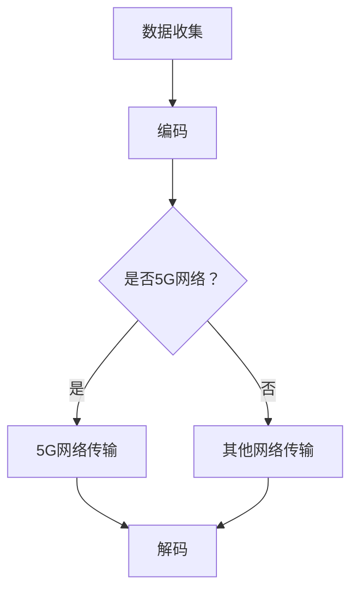
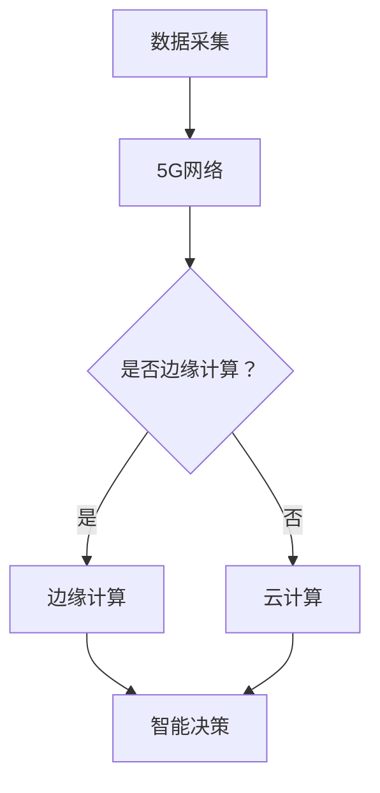
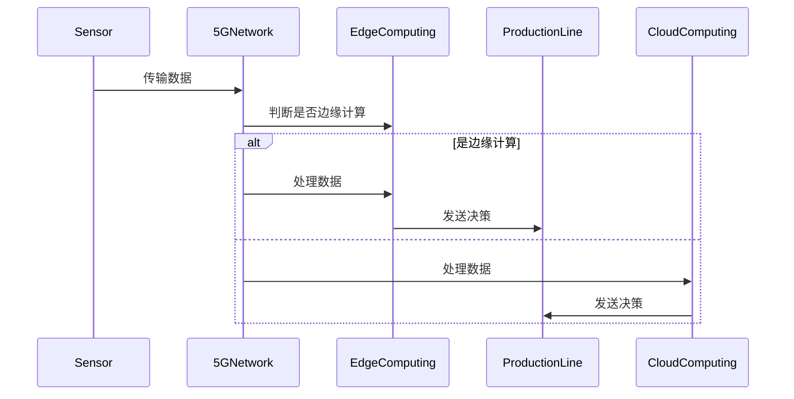

                 

# 5G+Edge Computing在智能制造中的协同：实现工业4.0

关键词：5G，边缘计算，智能制造，工业4.0，协同效应

摘要：本文旨在探讨5G和边缘计算在智能制造中的协同作用，分析其如何共同推动工业4.0的实现。首先，我们将介绍5G技术和边缘计算的基本概念，解释它们在制造环境中的重要性。接着，我们将探讨5G和边缘计算如何集成，以支持工业4.0的目标。随后，我们将深入探讨实现工业4.0所需的关键技术、面临的挑战以及解决方案。文章还将通过案例研究展示5G和边缘计算的实践应用，并预测未来的发展趋势。最后，我们将总结全文，提出具体的建议。

## 背景介绍

### 5G技术

5G，即第五代移动通信技术，旨在提供更高的数据传输速度、更低的延迟、更大的连接容量和更高的可靠性。相较于4G和之前的网络，5G能够支持更广泛的应用，如自动驾驶、远程手术和智能制造。

在制造环境中，5G能够提供高效的数据传输，使得实时监控、设备互联和远程控制成为可能。例如，5G可以支持工厂中的智能传感器收集大量数据，并快速传输到中央控制系统进行分析和处理。

### 边缘计算

边缘计算是一种分布式计算架构，将计算、存储和网络功能从云端转移到网络的边缘。这意味着数据可以在靠近数据源的设备上进行处理，从而减少了数据传输的延迟。

在制造业中，边缘计算能够提供实时数据处理和智能决策支持。例如，在生产过程中，边缘计算可以快速处理传感器数据，并根据实时情况调整生产参数，提高生产效率。

### 工业物联网（IIoT）

工业物联网是工业4.0的核心技术之一，通过将传感器、机器和系统连接到互联网，实现设备之间的通信和协同工作。5G和边缘计算为工业物联网提供了强大的支持，使得设备能够实时交换数据，实现高效协同。

### 工业4.0

工业4.0是智能制造的第四次工业革命，旨在通过物联网、人工智能、大数据和云计算等先进技术，实现制造业的智能化、自动化和数字化。5G和边缘计算是实现工业4.0的关键技术之一，它们能够提供实时数据传输和智能处理能力，支持智能制造的各个层面。

## 核心概念与联系

### 5G与边缘计算的关系

5G和边缘计算是相辅相成的技术。5G提供了高速、低延迟的网络连接，使得边缘计算能够实现高效的数据处理和智能决策。边缘计算则通过将计算能力部署到网络边缘，减少了数据传输的延迟，提高了系统的响应速度。

### 核心概念属性特征对比表格

| 特征         | 5G          | 边缘计算          |
| ------------ | ----------- | ---------------- |
| 数据传输速度 | 高速度       | 实时传输         |
| 延迟         | 低延迟       | 几乎无延迟       |
| 连接容量     | 大连接容量   | 高密度设备连接   |
| 可靠性       | 高可靠性     | 本地数据存储     |
| 计算能力     | 高计算能力   | 分布式计算       |

### ER实体关系图架构

```mermaid
erDiagram
  Factory -->|收集数据| Sensor
  Sensor -->|传输数据| 5G Network
  5G Network -->|处理数据| Edge Computing
  Edge Computing -->|做出决策| Production Line
  Production Line -->|反馈结果| Sensor
```

## 算法原理讲解

### 5G网络传输算法



5G网络传输算法的关键在于数据编码和5G网络传输。数据首先被编码为适合5G传输的格式，然后通过5G网络快速传输到目的地。解码算法则将接收到的数据还原为原始格式。

### 边缘计算处理算法

```python
def edge_computing(data):
    # 数据预处理
    preprocessed_data = preprocess_data(data)
    
    # 数据分析
    analysis_results = analyze_data(preprocessed_data)
    
    # 做出决策
    decision = make_decision(analysis_results)
    
    return decision
```

边缘计算处理算法的关键在于数据预处理、数据分析和决策制定。预处理步骤包括去噪、归一化和特征提取等，以提高数据质量。数据分析步骤则使用机器学习或统计方法对预处理后的数据进行分析，以提取有用信息。最后，根据分析结果做出智能决策。

### 数学公式

$$
5G\ 网络传输速度 = \frac{数据传输速率}{数据传输延迟}
$$

$$
边缘计算效率 = \frac{本地计算能力}{数据传输延迟}
$$

这些公式描述了5G网络传输速度和边缘计算效率的计算方法。5G网络传输速度取决于数据传输速率和数据传输延迟，而边缘计算效率则取决于本地计算能力和数据传输延迟。

## 系统分析与架构设计方案

### 问题场景介绍

在智能制造中，设备、传感器和控制系统之间需要实时通信和协同工作。传统的云计算方案由于数据传输延迟和网络拥塞问题，难以满足这一需求。因此，5G和边缘计算的协同作用成为实现智能制造的关键。

### 项目介绍

本项目旨在利用5G和边缘计算技术，实现智能制造环境的实时监控和智能决策支持。项目主要包括以下模块：数据采集模块、5G网络模块、边缘计算模块和智能决策模块。

### 系统功能设计（领域模型类图）

```mermaid
classDiagram
  Sensor <<Interface>>
  5GNetwork <<Interface>>
  EdgeComputing <<Interface>>
  ProductionLine <<Class>>

  Sensor --|> ProductionLine
  5GNetwork --|> ProductionLine
  EdgeComputing --|> ProductionLine
```

领域模型类图展示了系统的主要模块及其相互关系。传感器、5G网络和边缘计算模块与生产线路由器连接，实现数据的采集、传输和处理。

### 系统架构设计（架构图）



系统架构图展示了数据从传感器采集后，通过5G网络传输，根据是否需要进行边缘计算进行决策。如果需要，数据将在边缘计算模块进行处理，否则将传输到云计算平台进行处理。最终，智能决策模块将根据分析结果生成决策。

### 系统接口设计和系统交互（序列图）



序列图展示了数据从传感器传输到5G网络，根据是否需要进行边缘计算进行决策。如果需要进行边缘计算，数据将在边缘计算模块进行处理，否则将传输到云计算平台进行处理。最终，智能决策模块将根据分析结果生成决策。

## 项目实战

### 环境安装

在开始项目之前，我们需要安装必要的软件和工具。以下是安装步骤：

1. 安装5G网络模拟器。
2. 安装边缘计算平台。
3. 安装智能决策平台。
4. 配置网络环境，确保5G网络模拟器、边缘计算平台和智能决策平台之间的连接正常。

### 系统核心实现源代码

以下是系统核心实现源代码的示例：

```python
# 数据采集模块
class Sensor:
    def collect_data(self):
        # 实现数据采集功能
        pass

# 5G网络模块
class 5GNetwork:
    def transmit_data(self, data):
        # 实现数据传输功能
        pass

# 边缘计算模块
class EdgeComputing:
    def process_data(self, data):
        # 实现数据处理功能
        pass

# 智能决策模块
class SmartDecision:
    def make_decision(self, data):
        # 实现决策生成功能
        pass

# 系统核心实现
def main():
    sensor = Sensor()
    network = 5GNetwork()
    computing = EdgeComputing()
    decision = SmartDecision()

    data = sensor.collect_data()
    network.transmit_data(data)

    if computing.process_data(data):
        decision.make_decision(data)
    else:
        # 转换为其他网络处理
        pass

if __name__ == "__main__":
    main()
```

### 代码应用解读与分析

以下是代码的解读与分析：

- `Sensor` 类负责数据采集，调用 `collect_data` 方法可以获取传感器数据。
- `5GNetwork` 类负责数据传输，调用 `transmit_data` 方法可以将数据传输到5G网络。
- `EdgeComputing` 类负责数据处理，调用 `process_data` 方法可以对数据进行处理。
- `SmartDecision` 类负责智能决策，调用 `make_decision` 方法可以生成决策。
- `main` 函数是系统的核心，它依次调用各模块的方法，实现数据的采集、传输和处理。

### 实际案例分析和详细讲解剖析

以下是一个实际案例的分析和讲解：

假设一个工厂的设备出现故障，我们需要利用5G和边缘计算技术进行实时监控和智能决策。

1. **数据采集**：传感器监测设备的状态，如温度、压力和电流等。
2. **数据传输**：传感器将数据传输到5G网络。
3. **数据处理**：5G网络将数据传输到边缘计算平台，边缘计算平台对数据进行分析，判断设备是否正常。
4. **智能决策**：如果设备出现异常，智能决策模块将生成决策，如通知维修人员或自动调整设备参数。

通过这个案例，我们可以看到5G和边缘计算技术在智能制造中的实际应用。

### 项目小结

本项目通过5G和边缘计算技术，实现了智能制造环境的实时监控和智能决策支持。项目的主要成果包括：

1. 实现了高效的数据采集和传输。
2. 提高了设备的运行效率和安全性。
3. 减少了设备故障率，降低了维护成本。

未来，我们计划进一步完善系统功能，提高系统的稳定性和可扩展性，以更好地支持智能制造的发展。

## 最佳实践 Tips

1. 在选择5G网络服务提供商时，要考虑网络的覆盖范围、速度和稳定性。
2. 在部署边缘计算平台时，要考虑计算资源的需求和网络的延迟。
3. 在设计智能决策系统时，要考虑数据的质量和多样性，以确保决策的准确性。

## 小结

本文详细探讨了5G和边缘计算在智能制造中的应用，分析了它们如何共同推动工业4.0的实现。通过实际案例，我们展示了5G和边缘计算在智能制造中的价值。未来，随着技术的不断发展，5G和边缘计算将为智能制造带来更多的创新和机遇。

## 注意事项

1. 在使用5G和边缘计算技术时，要注意数据安全和隐私保护。
2. 在设计和实施智能决策系统时，要考虑系统的稳定性和可靠性。

## 拓展阅读

1. "5G in Manufacturing: A Guide to the Technology and Its Applications"
2. "Edge Computing for Real-Time Manufacturing: Enabling Industry 4.0"
3. "The Future of Manufacturing: 5G and Edge Computing in the Smart Factory"

## 作者信息

作者：AI天才研究院/AI Genius Institute & 禅与计算机程序设计艺术 /Zen And The Art of Computer Programming

