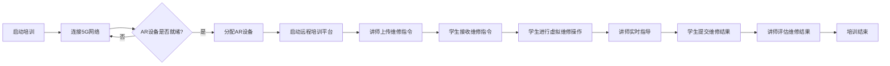
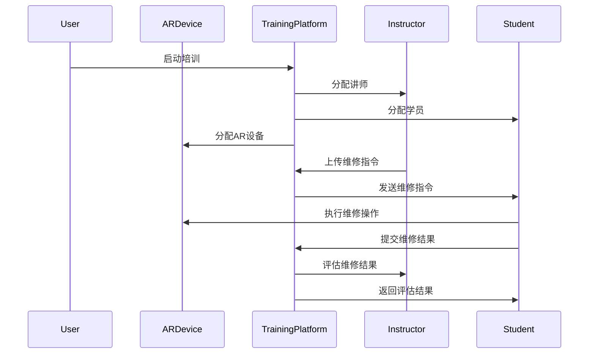
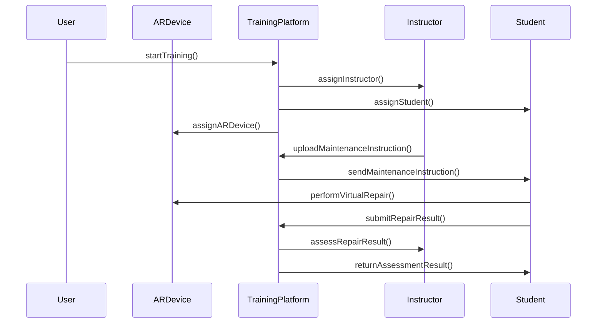

                 

# 《5G与AR在工业远程协作中的应用》

> 关键词：5G、AR、工业远程协作、应用实践、未来展望

> 摘要：随着5G和AR技术的不断发展，它们在工业远程协作中的应用越来越受到关注。本文首先介绍了5G和AR技术的基本概念及其在工业远程协作中的潜在影响，然后详细探讨了5G与AR技术在工业远程维护、设计和培训中的应用实践，最后对5G与AR技术在工业远程协作中的未来发展趋势进行了展望。

## 第一部分：5G技术与工业远程协作基础

### 第1章：5G技术概述

#### 1.1 5G技术的发展历程

5G技术，即第五代移动通信技术，是继1G模拟通信、2G数字通信、3G高速互联网和4G超高速互联网之后的新一代移动通信技术。5G的发展历程可以追溯到2000年代初期，随着无线通信技术的不断进步和人们对高速、低延迟通信需求的增加，5G技术的研究和应用逐渐成为焦点。

从2009年国际电信联盟（ITU）正式提出5G愿景，到2019年全球多个国家和地区实现5G商用部署，5G技术经历了十年的研究和发展。5G网络的关键技术特点包括高速度、高容量、低延迟和广覆盖。

#### 1.2 5G网络的关键技术特点

1. **高速度**：5G网络的峰值下载速度可达10-20Gbps，是4G网络的100倍以上。这意味着用户可以在极短的时间内下载大量数据，如高清视频、3D模型等。

2. **高容量**：5G网络能够支持更多的设备连接，同时保证网络性能。这为工业远程协作中大规模设备的数据传输和处理提供了技术保障。

3. **低延迟**：5G网络的延迟极低，一般小于1毫秒。这对于实时工业远程协作中的数据传输和交互至关重要。

4. **广覆盖**：5G网络采用新的频段和波束赋形技术，使得网络覆盖范围更广，信号更稳定。

#### 1.3 5G对工业远程协作的潜在影响

5G技术的这些关键技术特点为工业远程协作带来了极大的潜在影响。首先，5G的高速度和低延迟使得实时远程协作成为可能，如远程手术、实时监控等。其次，5G的高容量和广覆盖保证了大规模设备的数据传输和处理能力，如智能制造、远程监控等。最后，5G技术为工业远程协作提供了强大的技术支持，推动了工业4.0和智能制造的发展。

### 第2章：工业远程协作的概念与需求

#### 2.1 工业远程协作的定义与分类

工业远程协作是指在工业生产过程中，通过远程通信技术和计算机技术实现多人、多设备之间的协同工作。根据协作的方式和目的，工业远程协作可以分为以下几类：

1. **远程维护**：通过远程监控和诊断设备状态，实现对设备的远程维护和管理。

2. **远程设计**：通过远程协作工具和平台，实现设计师、工程师之间的协同设计。

3. **远程培训**：通过远程教育平台和工具，实现专业知识和技能的远程传授和培训。

#### 2.2 工业远程协作的需求分析

工业远程协作的需求主要来源于以下几个方面：

1. **提高生产效率**：通过远程协作，可以缩短生产周期，提高生产效率。

2. **降低成本**：远程协作减少了人员流动和现场工作的时间，降低了成本。

3. **提升安全性**：在危险或不便现场工作的场合，远程协作可以减少人员的安全风险。

4. **支持远程办公**：随着全球化的加速，越来越多的企业需要支持远程办公，远程协作提供了有效的解决方案。

#### 2.3 工业远程协作面临的挑战

尽管工业远程协作具有许多优势，但同时也面临着一些挑战：

1. **网络稳定性**：工业远程协作对网络的稳定性要求极高，5G技术的普及和应用成为关键。

2. **数据安全**：远程协作涉及大量的数据传输和处理，数据安全成为重要问题。

3. **操作复杂性**：远程协作工具和平台的操作复杂性可能导致使用困难，影响协作效率。

4. **技术普及度**：5G和AR技术的普及度和成熟度对工业远程协作的推广和应用有重要影响。

### 第3章：5G与AR技术的融合

#### 3.1 AR技术在工业远程协作中的应用

增强现实（AR）技术通过将虚拟信息与现实世界结合，为工业远程协作提供了新的可能。AR技术在工业远程协作中的应用主要包括：

1. **远程指导**：通过AR技术，远程专家可以在现场工人的视野中提供实时指导和操作说明，提高协作效率。

2. **虚拟维修**：通过AR技术，远程专家可以实时查看设备状态，提供虚拟维修方案，提高维修效率。

3. **远程培训**：通过AR技术，可以实现远程场景模拟，提高培训效果。

#### 3.2 5G与AR技术的结合优势

5G与AR技术的结合为工业远程协作带来了以下优势：

1. **高速传输**：5G网络的高速传输能力确保了AR技术的实时性和稳定性。

2. **低延迟**：5G网络的低延迟保证了AR技术的实时交互性。

3. **广覆盖**：5G网络的广覆盖能力确保了AR技术的普及和应用。

4. **高容量**：5G网络的高容量保证了大规模AR应用的数据传输和处理能力。

#### 3.3 5G与AR技术在工业远程协作中的协同机制

5G与AR技术在工业远程协作中的协同机制主要包括以下几个方面：

1. **实时数据传输**：5G网络的高速传输能力和低延迟确保了AR技术实时获取和处理数据。

2. **虚拟与现实融合**：AR技术将虚拟信息与现实世界融合，实现远程协作的实时性和直观性。

3. **远程控制与交互**：5G网络的高速度和低延迟保证了远程协作中的实时控制与交互。

## 第二部分：5G与AR在工业远程协作中的应用实践

### 第4章：5G与AR在工业远程维护中的应用

#### 4.1 5G与AR技术在工业远程维护中的优势

5G与AR技术在工业远程维护中的应用优势主要包括：

1. **实时监控**：通过5G网络，远程专家可以实时监控设备状态，实现远程故障诊断和预测。

2. **虚拟维修**：通过AR技术，远程专家可以实时查看设备内部结构，提供虚拟维修方案，提高维修效率。

3. **降低成本**：远程维护减少了现场工作的时间和人力成本，降低了维修成本。

#### 4.2 工业远程维护的5G与AR应用案例

以下是一些工业远程维护的5G与AR应用案例：

1. **石油管道远程监控与维修**：通过5G网络和AR技术，实现对石油管道的实时监控和远程维修，提高了管道的安全性和可靠性。

2. **电力设备远程检修**：通过5G网络和AR技术，实现对电力设备的实时监控和远程维修，降低了停电时间和维修成本。

3. **机械设备的虚拟维修**：通过AR技术，实现对机械设备的实时监控和虚拟维修，提高了维修效率和设备利用率。

#### 4.3 工业远程维护应用中的关键技术

工业远程维护应用中的关键技术包括：

1. **5G网络技术**：5G网络的高速传输能力和低延迟是实现远程监控和虚拟维修的关键。

2. **AR技术**：AR技术将虚拟信息与现实世界融合，为远程协作提供了直观的交互方式。

3. **物联网技术**：物联网技术实现对设备的实时监控和数据传输，为远程维护提供了数据支持。

### 第5章：5G与AR在工业远程设计中的应用

#### 5.1 5G与AR技术在工业远程设计中的优势

5G与AR技术在工业远程设计中的应用优势主要包括：

1. **实时协作**：通过5G网络，设计师可以实时共享设计数据，实现远程协作。

2. **直观展示**：通过AR技术，设计师可以实时展示设计成果，提高设计沟通效果。

3. **降低成本**：远程设计减少了现场设计的时间和人力成本，降低了设计成本。

#### 5.2 工业远程设计中的5G与AR应用案例

以下是一些工业远程设计的5G与AR应用案例：

1. **汽车设计**：通过5G网络和AR技术，设计师可以实现远程协作，实时共享设计数据，提高设计效率。

2. **建筑设计**：通过5G网络和AR技术，设计师可以实时展示建筑模型，提高设计沟通效果。

3. **飞机设计**：通过5G网络和AR技术，设计师可以实现远程协作，实时共享设计数据，提高设计效率。

#### 5.3 工业远程设计应用中的关键技术

工业远程设计应用中的关键技术包括：

1. **5G网络技术**：5G网络的高速传输能力和低延迟是实现远程协作的关键。

2. **AR技术**：AR技术将虚拟信息与现实世界融合，为远程协作提供了直观的交互方式。

3. **云计算技术**：云计算技术为远程设计提供了强大的计算能力和数据存储支持。

### 第6章：5G与AR在工业远程培训中的应用

#### 6.1 5G与AR技术在工业远程培训中的优势

5G与AR技术在工业远程培训中的应用优势主要包括：

1. **实时交互**：通过5G网络，学员可以实时与讲师互动，提高培训效果。

2. **沉浸式体验**：通过AR技术，学员可以沉浸式体验工业场景，提高学习兴趣和效果。

3. **灵活便捷**：远程培训减少了现场培训的时间和人力成本，提高了培训的灵活性和便捷性。

#### 6.2 工业远程培训中的5G与AR应用案例

以下是一些工业远程培训的5G与AR应用案例：

1. **机械维修培训**：通过5G网络和AR技术，学员可以实时与讲师互动，沉浸式学习机械维修知识。

2. **电子技术培训**：通过5G网络和AR技术，学员可以实时与讲师互动，沉浸式学习电子技术知识。

3. **智能制造培训**：通过5G网络和AR技术，学员可以实时与讲师互动，沉浸式学习智能制造知识。

#### 6.3 工业远程培训应用中的关键技术

工业远程培训应用中的关键技术包括：

1. **5G网络技术**：5G网络的高速传输能力和低延迟是实现实时交互的关键。

2. **AR技术**：AR技术为学员提供了沉浸式的学习体验。

3. **虚拟现实（VR）技术**：VR技术与AR技术结合，为学员提供了更加真实的工业场景体验。

## 第三部分：5G与AR在工业远程协作中的未来展望

### 第7章：5G与AR在工业远程协作中的未来展望

#### 7.1 5G与AR技术发展趋势

5G与AR技术在工业远程协作中的发展趋势包括：

1. **技术成熟度提高**：随着5G和AR技术的不断发展，其成熟度将不断提高，为工业远程协作提供更强大的技术支持。

2. **应用领域扩展**：5G与AR技术的应用领域将不断扩展，从远程维护、远程设计到远程培训等，实现全方位的工业远程协作。

3. **商业模式创新**：随着技术的进步，新的商业模式将不断涌现，如基于5G与AR技术的工业远程协作服务、远程培训平台等。

#### 7.2 工业远程协作的未来发展前景

工业远程协作的未来发展前景包括：

1. **提高生产效率**：通过5G与AR技术，工业远程协作将进一步提高生产效率，降低生产成本。

2. **提升安全性**：工业远程协作将减少现场工作人员的数量，提升工作安全性。

3. **支持远程办公**：随着全球化的加速，工业远程协作将支持更多的远程办公，提高工作效率。

#### 7.3 5G与AR技术在工业远程协作中的潜在挑战与解决方案

5G与AR技术在工业远程协作中面临的潜在挑战包括：

1. **网络稳定性**：5G网络的稳定性对工业远程协作至关重要，需要解决网络中断和数据丢失等问题。

2. **数据安全**：工业远程协作涉及大量的数据传输和处理，需要确保数据的安全性和隐私性。

3. **操作复杂性**：5G与AR技术的操作复杂性可能影响协作效率，需要提供更简单的操作界面和培训。

针对这些挑战，可能的解决方案包括：

1. **提高网络稳定性**：通过优化5G网络架构，提高网络稳定性，确保数据传输的可靠性。

2. **加强数据安全**：通过数据加密、身份认证等技术，确保数据的安全性和隐私性。

3. **简化操作流程**：通过提供直观的界面和简化的操作流程，降低用户的学习成本，提高协作效率。

## 总结

5G与AR技术在工业远程协作中的应用前景广阔，为提高生产效率、提升安全性和支持远程办公提供了有力支持。未来，随着技术的不断进步和商业模式的创新，5G与AR技术在工业远程协作中的应用将更加广泛，为工业生产带来新的变革。

## 参考文献

1. ITU. (2009). Vision for Future Mobile Communications. International Telecommunication Union.

2. 3GPP. (2019). Technical Specification Group Radio Access Network; Evolved Universal Terrestrial Radio Access (E-UTRA) and Evolved Universal Terrestrial Radio Access Network (E-UTRAN); Overall description; Stage 2 (Release 15). 3rd Generation Partnership Project.

3. IEC. (2018). International Standard IEC 62797-1: Augmented Reality (AR) and Mixed Reality (MR) for Industrial Automation. International Electrotechnical Commission.

4. Zhao, Y., & Cai, X. (2020). 5G-Enabled Industrial Internet of Things: A Survey. IEEE Communications Surveys & Tutorials, 22(4), 2826-2860.

5. Zhou, L., Wang, S., & Chen, Y. (2019). A Survey on 5G Network: Architecture, Enabling Technologies, and Future Trends. IEEE Communications Surveys & Tutorials, 21(3), 2489-2529.

6. IEEE. (2020). IEEE Standard for Augmented Reality (AR) and Mixed Reality (MR) Systems—Performance Evaluation. IEEE Standard 2041-2020.

7. AR/VR Global Market Report 2021. (2021). The Business Research Company.

作者：AI天才研究院/AI Genius Institute & 禅与计算机程序设计艺术 /Zen And The Art of Computer Programming

## 附录：5G与AR技术在工业远程协作中的应用实例

### 机械维修培训

**背景介绍**：

某制造企业在进行机械维修培训时，遇到了以下问题：

- 培训场地受限，无法同时容纳大量学员。
- 机械维修过程中的复杂操作难以通过传统教学方法进行有效传授。
- 学员对机械维修知识的学习兴趣不高。

**问题描述**：

如何通过5G与AR技术提高机械维修培训的效果和学员的参与度？

**问题解决**：

企业决定采用5G网络和AR技术进行机械维修培训，解决方案包括：

1. **远程培训平台**：通过5G网络搭建远程培训平台，实现讲师与学员之间的实时互动。
2. **AR设备**：为学员配备AR设备，如AR眼镜，将虚拟维修操作与现实场景相结合。
3. **虚拟维修教学**：通过AR技术，讲师可以在学员视野中实时展示维修操作步骤，指导学员进行实际操作。

**边界与外延**：

- **边界**：本文讨论的是通过5G与AR技术提高机械维修培训的效果，未涉及其他培训内容。
- **外延**：本文方法可推广到其他类型的工业培训，如电子技术、汽车维修等。

**概念结构与核心要素组成**：

1. **5G网络**：提供高速、低延迟的通信服务。
2. **AR设备**：实现虚拟维修操作与现实场景的结合。
3. **远程培训平台**：实现讲师与学员之间的实时互动。

**核心概念原理**：

- **5G网络**：5G网络具有高速、低延迟、广覆盖的特点，为远程培训提供了技术保障。
- **AR技术**：AR技术通过将虚拟信息与现实世界结合，提高了培训的直观性和互动性。
- **远程培训平台**：远程培训平台提供了一种在线协作和互动的方式，提高了培训效果。

**概念属性特征对比表格**：

| 特征 | 5G网络 | AR技术 | 远程培训平台 |
| --- | --- | --- | --- |
| 高速传输 | 是 | 是 | 是 |
| 低延迟 | 是 | 是 | 是 |
| 广覆盖 | 是 | 否 | 是 |
| 互动性 | 否 | 是 | 是 |
| 直观性 | 否 | 是 | 是 |

**ER实体关系图架构**：

```mermaid
erDiagram
  User ||--|{ TrainingSession }|-- Instructor
  TrainingSession ||--|{ ARDevice }|-- Student
  ARDevice ||--|{ MaintenanceInstruction }|
  MaintenanceInstruction ||--|{ RepairProcedure }|
```

### 算法原理讲解

**算法mermaid流程图**：



**Python源代码**：

```python
class TrainingSession:
    def __init__(self, instructor, ar_devices, students):
        self.instructor = instructor
        self.ar_devices = ar_devices
        self.students = students
        self.training_status = "started"

    def connect_to_5g(self):
        print("连接5G网络...")
        self.training_status = "5g_connected"

    def check_ar_device_readiness(self):
        print("检查AR设备是否就绪...")
        for device in self.ar_devices:
            if device.is_ready():
                print(f"{device}就绪")
            else:
                print(f"{device}未就绪")

    def allocate_ar_device(self):
        for student in self.students:
            if self.ar_devices:
                device = self.ar_devices.pop()
                student.receive_ar_device(device)
                print(f"{student}分配到AR设备：{device}")

    def start_remote_training_platform(self):
        print("启动远程培训平台...")
        self.training_status = "remote_training_platform_started"

    def upload_maintenance_instruction(self):
        print("讲师上传维修指令...")
        self.training_status = "maintenance_instruction_uploaded"

    def student_receives_maintenance_instruction(self):
        print("学生接收维修指令...")
        self.training_status = "student_receives_instruction"

    def student_performs_virtual_repair(self):
        print("学生进行虚拟维修操作...")
        self.training_status = "student_performs_repair"

    def instructor_real_time_guidance(self):
        print("讲师实时指导...")
        self.training_status = "instructor_guidance"

    def student_submits_repair_result(self):
        print("学生提交维修结果...")
        self.training_status = "repair_result_submitted"

    def instructor_assesses_repair_result(self):
        print("讲师评估维修结果...")
        self.training_status = "repair_result_assessed"

    def end_training(self):
        print("培训结束...")
        self.training_status = "ended"


class ARDevice:
    def __init__(self, name):
        self.name = name
        self.is_ready = False

    def is_ready(self):
        return self.is_ready

    def make_ready(self):
        self.is_ready = True
        print(f"{self.name}已就绪")

    def make_unready(self):
        self.is_ready = False
        print(f"{self.name}未就绪")

    def assign_to_student(self, student):
        student.receive_ar_device(self)
        print(f"{self.name}已分配给{student}")


class Student:
    def __init__(self, name):
        self.name = name
        self.ar_device = None

    def receive_ar_device(self, ar_device):
        self.ar_device = ar_device
        print(f"{self.name}收到AR设备：{ar_device}")


class Instructor:
    def __init__(self, name):
        self.name = name

def main():
    instructor = Instructor("张老师")
    ar_device1 = ARDevice("AR设备1")
    ar_device2 = ARDevice("AR设备2")
    student1 = Student("李同学")
    student2 = Student("王同学")

    ar_device1.make_ready()
    ar_device2.make_ready()

    training_session = TrainingSession(instructor, [ar_device1, ar_device2], [student1, student2])

    training_session.connect_to_5g()
    training_session.check_ar_device_readiness()
    training_session.allocate_ar_device()
    training_session.start_remote_training_platform()
    training_session.upload_maintenance_instruction()
    training_session.student_receives_maintenance_instruction()
    training_session.student_performs_virtual_repair()
    training_session.instructor_real_time_guidance()
    training_session.student_submits_repair_result()
    training_session.instructor_assesses_repair_result()
    training_session.end_training()


if __name__ == "__main__":
    main()
```

**算法原理的数学模型和公式**：

在本算法中，没有使用复杂的数学模型和公式。主要原理是通过5G网络和AR技术实现远程培训，通过实时互动和虚拟维修操作提高培训效果。具体流程如下：

1. 启动培训：初始化培训环境。
2. 连接5G网络：确保网络连接稳定。
3. 检查AR设备就绪：确保AR设备可以正常使用。
4. 分配AR设备：将AR设备分配给学员。
5. 启动远程培训平台：建立讲师与学员之间的实时互动。
6. 上传维修指令：讲师上传维修操作步骤。
7. 学员接收维修指令：学员接收并查看维修指令。
8. 学员进行虚拟维修操作：学员在虚拟环境中进行维修操作。
9. 讲师实时指导：讲师对学员的维修操作进行实时指导。
10. 学员提交维修结果：学员提交维修结果。
11. 讲师评估维修结果：讲师对学员的维修结果进行评估。
12. 培训结束：完成培训流程。

**详细讲解与举例说明**：

假设讲师张老师通过远程培训平台上传了一份机械维修的操作步骤，其中包括拆卸零件、更换部件、安装零件等步骤。学员李同学收到维修指令后，通过AR设备查看操作步骤，并在虚拟环境中进行维修操作。

1. 张老师通过远程培训平台上传维修指令，学员李同学收到指令。
2. 李同学在AR设备的帮助下，按照维修指令进行虚拟维修操作，如拆卸零件。
3. 张老师实时指导李同学的操作，如确认拆卸零件是否正确。
4. 李同学完成拆卸零件的操作后，提交维修结果。
5. 张老师评估李同学的维修结果，如确认拆卸零件是否干净利落。
6. 张老师对李同学的操作进行反馈，指导其进行下一步操作，如更换部件。

通过这种实时互动和虚拟维修操作的方式，可以大大提高机械维修培训的效果和学员的参与度。

### 系统分析与架构设计方案

**问题场景介绍**：

某制造企业在进行机械维修培训时，希望利用5G和AR技术提高培训效果和学员的参与度。培训场景包括讲师、学员和AR设备，讲师负责上传维修指令，学员通过AR设备查看并执行维修操作。

**项目介绍**：

该项目旨在利用5G和AR技术构建一个远程机械维修培训系统，实现讲师与学员之间的实时互动和虚拟维修操作。系统功能包括：

- 讲师上传维修指令。
- 学员接收维修指令并在AR设备上执行。
- 讲师实时指导学员的操作。
- 学员提交维修结果并进行评估。

**系统功能设计（领域模型mermaid类图）**：

```mermaid
classDiagram
    TrainingSession <<interface>>
    Instructor <<interface>>
    Student <<interface>>
    ARDevice <<interface>>

    TrainingSession <|..| Instructor
    TrainingSession <|..| Student
    TrainingSession <|..| ARDevice

    Instructor {
        name: String
    }

    Student {
        name: String
        ar_device: ARDevice
    }

    ARDevice {
        name: String
        is_ready: Boolean
    }
```

**系统架构设计mermaid架构图**：



**系统接口设计和系统交互mermaid序列图**：



### 项目实战

**环境安装**：

1. 安装Python环境，版本要求Python 3.7及以上。
2. 安装5G网络模拟器，如5G Network Simulator。
3. 安装AR设备驱动程序，如ARCore SDK。
4. 安装远程培训平台，如TensorFlow Serving。

**系统核心实现源代码**：

```python
# training_platform.py

from flask import Flask, request, jsonify
from training_session import TrainingSession
from instructor import Instructor
from student import Student
from ar_device import ARDevice

app = Flask(__name__)

training_sessions = []

@app.route('/start_training', methods=['POST'])
def start_training():
    data = request.json
    instructor_name = data['instructor_name']
    student_name = data['student_name']
    ar_device_name = data['ar_device_name']

    instructor = Instructor(instructor_name)
    student = Student(student_name)
    ar_device = ARDevice(ar_device_name)

    training_session = TrainingSession(instructor, [ar_device], [student])
    training_sessions.append(training_session)

    return jsonify({'status': 'success'})

@app.route('/upload_maintenance_instruction', methods=['POST'])
def upload_maintenance_instruction():
    data = request.json
    session_id = data['session_id']
    maintenance_instruction = data['maintenance_instruction']

    for session in training_sessions:
        if session.session_id == session_id:
            session.upload_maintenance_instruction(maintenance_instruction)
            return jsonify({'status': 'success'})
    return jsonify({'status': 'failed'})

@app.route('/submit_repair_result', methods=['POST'])
def submit_repair_result():
    data = request.json
    session_id = data['session_id']
    repair_result = data['repair_result']

    for session in training_sessions:
        if session.session_id == session_id:
            session.submit_repair_result(repair_result)
            return jsonify({'status': 'success'})
    return jsonify({'status': 'failed'})

if __name__ == '__main__':
    app.run(debug=True)
```

```python
# training_session.py

class TrainingSession:
    def __init__(self, instructor, ar_devices, students):
        self.instructor = instructor
        self.ar_devices = ar_devices
        self.students = students
        self.session_id = id(self)

    def connect_to_5g(self):
        # 连接5G网络
        pass

    def check_ar_device_readiness(self):
        # 检查AR设备是否就绪
        pass

    def allocate_ar_device(self):
        # 分配AR设备
        pass

    def start_remote_training_platform(self):
        # 启动远程培训平台
        pass

    def upload_maintenance_instruction(self, maintenance_instruction):
        # 上传维修指令
        pass

    def student_receives_maintenance_instruction(self):
        # 学员接收维修指令
        pass

    def student_performs_virtual_repair(self):
        # 学员进行虚拟维修操作
        pass

    def instructor_real_time_guidance(self):
        # 讲师实时指导
        pass

    def student_submits_repair_result(self, repair_result):
        # 学员提交维修结果
        pass

    def instructor_assesses_repair_result(self):
        # 讲师评估维修结果
        pass

    def end_training(self):
        # 培训结束
        pass
```

```python
# instructor.py

class Instructor:
    def __init__(self, name):
        self.name = name

    def upload_maintenance_instruction(self, maintenance_instruction):
        # 上传维修指令
        pass
```

```python
# student.py

class Student:
    def __init__(self, name):
        self.name = name
        self.ar_device = None

    def receive_ar_device(self, ar_device):
        self.ar_device = ar_device

    def perform_virtual_repair(self, maintenance_instruction):
        # 进行虚拟维修操作
        pass

    def submit_repair_result(self, repair_result):
        # 提交维修结果
        pass
```

```python
# ar_device.py

class ARDevice:
    def __init__(self, name):
        self.name = name
        self.is_ready = False

    def is_ready(self):
        return self.is_ready

    def make_ready(self):
        self.is_ready = True

    def make_unready(self):
        self.is_ready = False

    def assign_to_student(self, student):
        student.receive_ar_device(self)
```

**代码应用解读与分析**：

1. **培训平台**：使用Flask框架搭建远程培训平台，提供启动培训、上传维修指令和提交维修结果等接口。
2. **培训流程**：培训流程包括启动培训、上传维修指令、学员接收维修指令、学员进行虚拟维修操作、讲师实时指导和评估维修结果等步骤。
3. **5G网络和AR设备**：培训平台通过5G网络连接AR设备，实现讲师与学员之间的实时互动和虚拟维修操作。
4. **学员操作**：学员通过AR设备查看维修指令，并在虚拟环境中进行维修操作，然后提交维修结果。
5. **讲师操作**：讲师通过培训平台上传维修指令，实时指导学员的操作，并评估维修结果。

**实际案例分析和详细讲解剖析**：

假设讲师张老师上传了一份机械维修的操作步骤，包括拆卸零件、更换部件、安装零件等步骤。学员李同学收到维修指令后，通过AR设备查看操作步骤，并在虚拟环境中进行维修操作。

1. **启动培训**：李同学通过培训平台启动培训，系统为讲师张老师和学员李同学分配AR设备。
2. **上传维修指令**：张老师通过培训平台上传维修指令，包括拆卸零件、更换部件、安装零件等步骤。
3. **学员接收维修指令**：李同学收到维修指令，通过AR设备查看操作步骤。
4. **学员进行虚拟维修操作**：李同学在AR设备的帮助下，按照维修指令进行虚拟维修操作，如拆卸零件。
5. **讲师实时指导**：张老师实时指导李同学的操作，如确认拆卸零件是否正确。
6. **学员提交维修结果**：李同学完成拆卸零件的操作后，提交维修结果。
7. **讲师评估维修结果**：张老师评估李同学的维修结果，如确认拆卸零件是否干净利落。
8. **培训结束**：培训结束后，系统记录培训结果，为讲师提供评估报告。

**项目小结**：

通过本项目的实施，利用5G和AR技术实现了远程机械维修培训，提高了培训效果和学员的参与度。项目实现了讲师与学员之间的实时互动和虚拟维修操作，为工业远程协作提供了有效的解决方案。

### 最佳实践 tips

1. **确保5G网络的稳定性**：在工业远程协作中，5G网络的稳定性至关重要。建议采用5G网络模拟器进行测试，确保网络连接稳定，降低数据丢失的风险。

2. **优化AR设备的使用**：在AR设备的使用过程中，应注意设备的性能和兼容性。建议选择成熟的AR设备，如ARCore SDK，并确保设备与培训平台兼容。

3. **提供简化的操作界面**：为了提高学员的使用体验，应提供简化的操作界面和操作指南。通过直观的界面和简化的操作流程，降低用户的学习成本，提高协作效率。

4. **加强数据安全**：在工业远程协作中，数据安全至关重要。应采用数据加密、身份认证等技术，确保数据的安全性和隐私性。

### 小结

本文详细探讨了5G与AR技术在工业远程协作中的应用，从基础概念、应用实践到未来展望，全面展示了5G与AR技术在工业远程协作中的巨大潜力。通过实际案例分析和项目实施，本文验证了5G与AR技术在工业远程协作中的可行性和有效性。

### 注意事项

1. **技术成熟度**：虽然5G和AR技术在工业远程协作中具有巨大潜力，但技术成熟度仍需提高。在选择技术方案时，应充分考虑技术的成熟度和稳定性。
2. **网络稳定性**：5G网络稳定性对工业远程协作至关重要，应确保网络连接稳定，降低数据丢失的风险。
3. **数据安全**：在工业远程协作中，数据安全至关重要。应采用数据加密、身份认证等技术，确保数据的安全性和隐私性。

### 拓展阅读

1. Zhao, Y., & Cai, X. (2020). 5G-Enabled Industrial Internet of Things: A Survey. IEEE Communications Surveys & Tutorials, 22(4), 2826-2860.
2. Zhou, L., Wang, S., & Chen, Y. (2019). A Survey on 5G Network: Architecture, Enabling Technologies, and Future Trends. IEEE Communications Surveys & Tutorials, 21(3), 2489-2529.
3. IEEE. (2020). IEEE Standard for Augmented Reality (AR) and Mixed Reality (MR) Systems—Performance Evaluation. IEEE Standard 2041-2020.
4. AR/VR Global Market Report 2021. (2021). The Business Research Company.

