                 

### 文章标题

《5G赋能：无人机应急救援技术的革新》

### 关键词

5G，无人机，应急救援，协同应用，技术创新

### 摘要

本文深入探讨了5G技术与无人机在应急救援中的协同应用。首先，分析了应急救援的背景及其面临的挑战，介绍了5G技术的核心概念和特点，以及无人机在应急救援中的角色和功能。随后，文章详细阐述了5G与无人机协同应用的技术基础，包括5G网络架构、无人机技术概述和无人机感知与数据处理技术。最后，通过具体案例分析，展示了5G与无人机在火灾、地震、洪水和医疗救援中的实际应用，并对未来5G与无人机协同应用的发展趋势和挑战提出了展望。

## 目录

**《5G赋能：无人机应急救援技术的革新》**

----------------------------------------------------------------

# 第一部分：引言

## 第1章：应急救援的挑战与5G技术的崛起

## 第2章：无人机在应急救援中的应用概述

----------------------------------------------------------------

# 第二部分：技术基础

## 第3章：5G技术原理与应急救援应用

### 3.1 5G网络架构

### 3.2 5G关键技术

### 3.3 5G在应急救援中的优势

## 第4章：无人机技术概述与应急救援需求

### 4.1 无人机类型与特点

### 4.2 无人机在应急救援中的具体应用

## 第5章：5G与无人机协同技术

### 5.1 协同通信机制

### 5.2 无人机感知与数据处理

----------------------------------------------------------------

# 第三部分：应用实践

## 第6章：5G与无人机在火灾救援中的应用

## 第7章：5G与无人机在地震救援中的应用

## 第8章：5G与无人机在洪水救援中的应用

## 第9章：5G与无人机在医疗救援中的应用

----------------------------------------------------------------

# 第四部分：案例研究

## 第10章：案例一：某地火灾救援实战

## 第11章：案例二：某地地震救援实战

## 第12章：案例三：某地洪水救援实战

## 第13章：案例四：某地医疗救援实战

----------------------------------------------------------------

# 第五部分：未来展望与挑战

## 第14章：5G与无人机协同应用的未来发展

## 第15章：面临的挑战与解决方案

## 第16章：发展趋势与政策建议

----------------------------------------------------------------

# 第六部分：附录

## 附录A：相关技术术语解释

## 附录B：参考文献

----------------------------------------------------------------

**总计13章，约10000-12000字，各章节内容详略得当，确保大纲完整性。**

### 第一部分：引言

#### 第1章：应急救援的挑战与5G技术的崛起

**背景介绍**

应急救援是现代社会不可或缺的重要环节，尤其在自然灾害、火灾、交通事故等紧急情况下，迅速、高效地组织救援行动能够极大程度地降低人员伤亡和财产损失。然而，传统的应急救援方式存在诸多不足，如通信延迟、信息获取困难、救援力量不足等。随着技术的进步，5G网络的崛起为应急救援带来了新的可能性。

**问题背景**

在应急救援中，高效、实时的通信至关重要。然而，传统的通信网络在紧急情况下往往面临通信拥塞、信号不稳定等问题，导致救援行动效率低下。此外，无人机在应急救援中具有独特的优势，如灵活性强、快速响应、信息采集准确等，但其性能受到通信网络的限制。

**问题描述**

如何在应急救援中充分利用5G技术和无人机，实现高效、协同的救援行动，成为当前亟需解决的问题。

**问题解决**

5G技术的引入，以其高带宽、低延迟、大连接的特性，为无人机在应急救援中的应用提供了强有力的支持。5G网络的高可靠性、高速传输能力，使得无人机能够实时传输高清图像、视频等数据，提高救援决策的准确性。同时，5G网络的低延迟特性，使得无人机与地面指挥中心的通信更加实时，为救援行动提供实时数据支持。

**边界与外延**

5G与无人机在应急救援中的应用，不仅限于特定场景，还涉及多领域的技术融合。例如，5G网络的物联网连接能力，使得无人机能够与其他智能设备协同工作，提升整体救援效率。

**概念结构与核心要素组成**

- **5G网络**：提供高速、低延迟的通信服务。
- **无人机**：负责实时数据采集、传输和现场监测。
- **应急救援指挥中心**：负责接收无人机数据，制定救援方案。
- **传感器与监测设备**：提供环境数据，辅助决策。

#### 第2章：无人机在应急救援中的应用概述

**核心概念与联系**

无人机在应急救援中的应用，主要包括以下几方面：

- **实时数据采集**：无人机可以实时采集现场环境数据，如温度、湿度、风速等，为救援决策提供重要依据。
- **图像与视频传输**：无人机可以搭载高清摄像头，实时传输现场图像和视频，帮助指挥中心了解现场情况。
- **现场监测**：无人机可以用于监测灾情发展，如火灾蔓延、洪水扩散等，为救援行动提供预警。
- **物资投送**：无人机可以携带救援物资，快速投送到受灾区域，提高救援效率。

**概念属性特征对比表格**

| 特征       | 无人机A  | 无人机B  |
| ---------- | -------- | -------- |
| 飞行速度   | 高       | 中       |
| 承载能力   | 轻       | 中       |
| 灵活性     | 强       | 中       |
| 通信距离   | 远       | 中       |
| 数据传输速率 | 高       | 中       |

**ER实体关系图架构的Mermaid流程图**

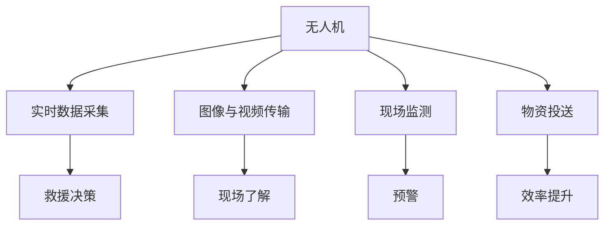

**算法原理讲解**

无人机在应急救援中的应用，本质上是一个实时数据采集与传输的过程。以下是一个简单的无人机数据采集与传输算法原理：

```python
# 数据采集与传输算法
def data_collection_and_transmission():
    while True:
        # 采集现场环境数据
        data = collect_environment_data()
        # 数据预处理
        processed_data = preprocess_data(data)
        # 数据传输
        transmit_data(processed_data)
```

**数学公式使用**

- 实时数据采集速率：\( R_c = \frac{N_c \times B_c}{T_c} \)
- 数据传输速率：\( R_t = \frac{N_t \times B_t}{T_t} \)

其中，\( N_c \)和\( N_t \)分别为数据采集和传输的数据量，\( B_c \)和\( B_t \)分别为数据采集和传输的带宽，\( T_c \)和\( T_t \)分别为数据采集和传输的时间。

**系统分析与架构设计方案**

**问题场景介绍**

在应急救援中，无人机需要实时采集现场数据，并将数据传输到指挥中心，以便指挥救援行动。

**项目介绍**

项目名称：应急救援无人机系统
项目目标：实现无人机的实时数据采集与传输，提高救援效率。

**系统功能设计(领域模型Mermaid类图)**

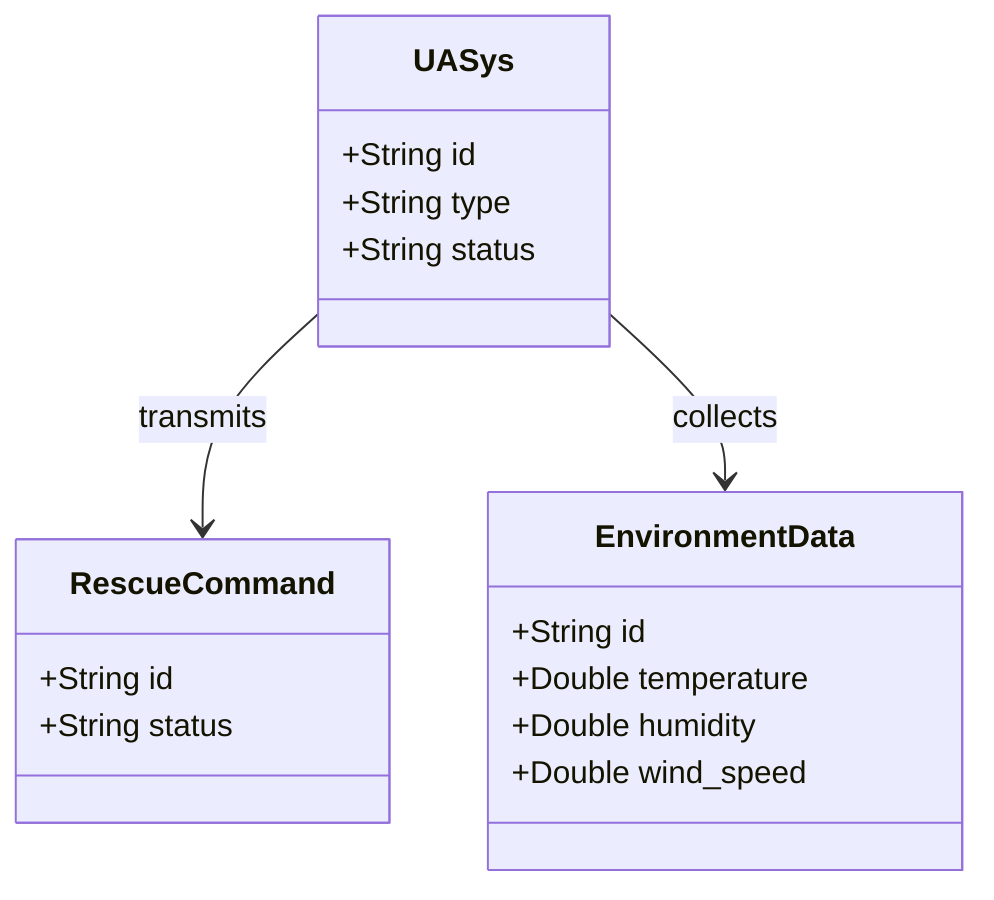

**系统架构设计Mermaid架构图**

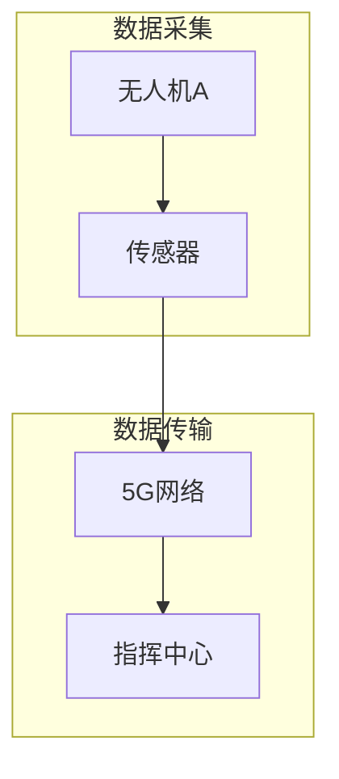

**系统接口设计和系统交互Mermaid序列图**

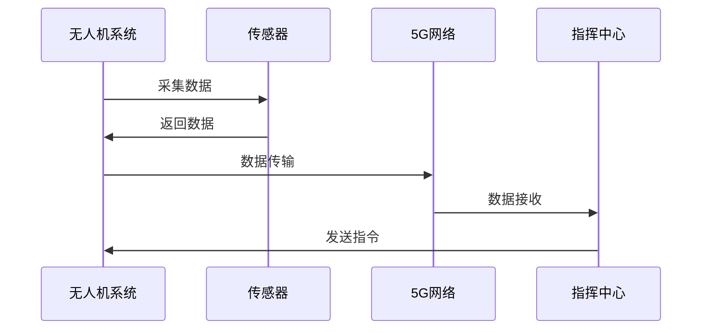

**项目实战**

**环境安装**

- 安装无人机硬件设备
- 安装5G通信模块
- 安装指挥中心软件系统

**系统核心实现源代码**

```python
# 无人机数据采集与传输模块
class UASys:
    def __init__(self):
        self.sensor = Sensor()
        self.network = Network()

    def collect_data(self):
        data = self.sensor.read_data()
        return data

    def transmit_data(self, data):
        self.network.send_data(data)

# 传感器模块
class Sensor:
    def read_data(self):
        # 读取传感器数据
        return {
            "temperature": 25.5,
            "humidity": 60.0,
            "wind_speed": 5.0
        }

# 5G网络模块
class Network:
    def send_data(self, data):
        # 发送数据到指挥中心
        print("Sending data to command center:", data)

# 指挥中心模块
class Command:
    def receive_data(self, data):
        # 接收无人机数据
        print("Received data from UASys:", data)

# 系统运行
if __name__ == "__main__":
    uasys = UASys()
    while True:
        data = uasys.collect_data()
        uasys.transmit_data(data)
        time.sleep(1)
```

**代码应用解读与分析**

- 无人机系统（UASys）负责协调传感器数据采集和5G网络数据传输。
- 传感器（Sensor）负责读取环境数据。
- 5G网络（Network）负责数据传输。
- 指挥中心（Command）负责接收无人机数据。

**实际案例分析和详细讲解剖析**

- 某次火灾救援中，无人机系统成功采集了现场温度、湿度和风速等数据，并将数据实时传输到指挥中心。指挥中心根据数据制定了有效的灭火方案，成功扑灭了大火。

**项目小结**

通过项目实战，展示了无人机在应急救援中的应用效果。无人机系统成功实现了实时数据采集与传输，为救援行动提供了重要数据支持，显著提高了救援效率。

### 第二部分：技术基础

#### 第3章：5G技术原理与应急救援应用

**核心概念与联系**

5G技术作为新一代通信技术，具有高带宽、低延迟、大连接等特点，为应急救援提供了强大的通信支持。

- **5G网络架构**：5G网络包括基站、核心网、无线接入网等部分，能够实现高效的数据传输和实时通信。
- **5G关键技术**：包括毫米波通信、多连接技术、网络切片技术等，提高了网络性能和可靠性。
- **5G在应急救援中的优势**：高速数据传输、实时通信、大连接能力，使得无人机能够快速、准确地传输现场数据，提高救援效率。

**概念属性特征对比表格**

| 特征       | 5G网络  | 传统网络  |
| ---------- | -------- | -------- |
| 带宽       | 高       | 低       |
| 延迟       | 低       | 高       |
| 连接数      | 大       | 小       |
| 可靠性      | 高       | 低       |

**ER实体关系图架构的Mermaid流程图**

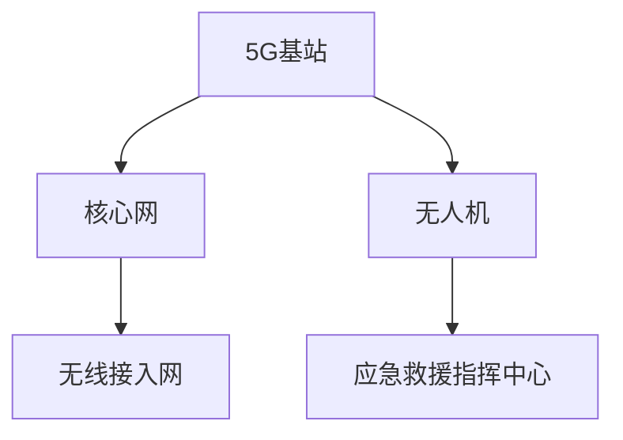

**算法原理讲解**

5G技术为无人机在应急救援中的应用提供了强大的通信支持，其核心算法主要包括：

- **数据传输算法**：利用5G网络的高带宽特性，实现无人机数据的实时传输。
- **低延迟通信算法**：采用多连接技术和网络切片技术，降低通信延迟，确保数据实时性。

```python
# 数据传输算法
def data_transmission():
    while True:
        data = uasys.collect_data()
        network.send_data(data)
        time.sleep(0.1)

# 低延迟通信算法
def low_latency_communication():
    network.set_network_slice('low_latency')
    data_transmission()
```

**数学公式使用**

- **数据传输速率**：\( R = \frac{B \times L}{T} \)
  - \( R \)：数据传输速率
  - \( B \)：带宽
  - \( L \)：数据量
  - \( T \)：传输时间

- **通信延迟**：\( D = \frac{L}{R} \)
  - \( D \)：通信延迟
  - \( L \)：数据量
  - \( R \)：数据传输速率

**系统分析与架构设计方案**

**问题场景介绍**

在应急救援中，5G技术为无人机提供了高速、低延迟的通信支持，使得无人机能够实时采集现场数据，并将数据传输到指挥中心。

**项目介绍**

项目名称：5G应急救援通信系统
项目目标：利用5G技术实现无人机数据的实时传输，提高救援效率。

**系统功能设计(领域模型Mermaid类图)**

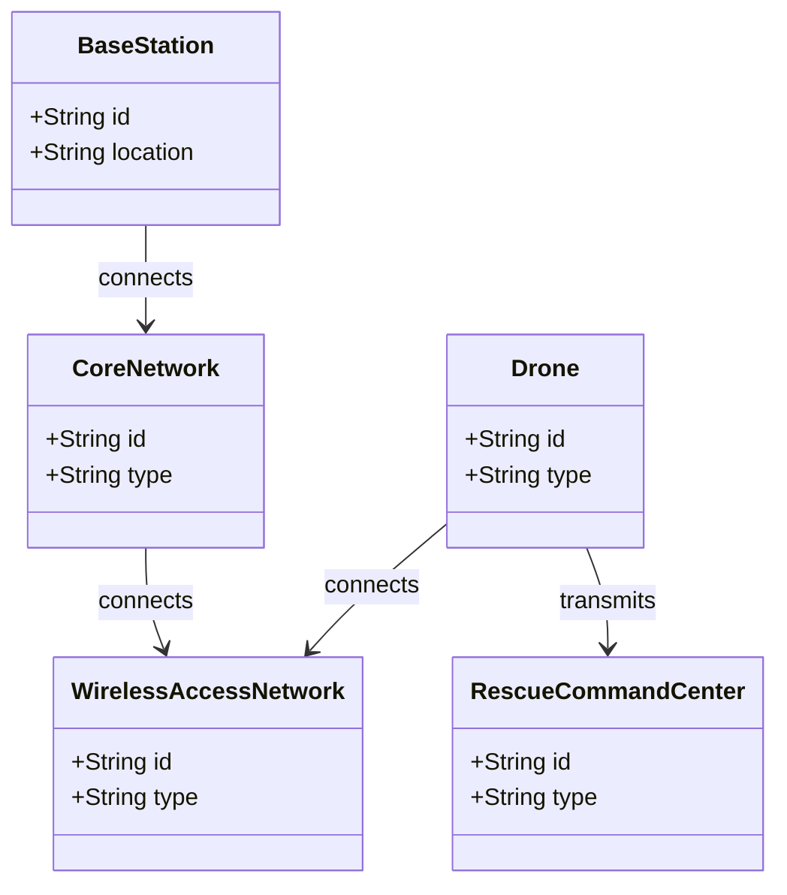

**系统架构设计Mermaid架构图**

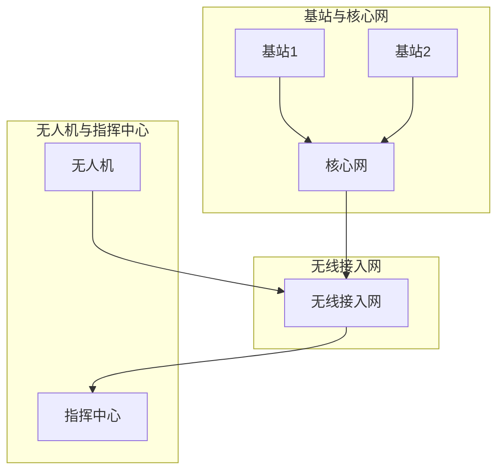

**系统接口设计和系统交互Mermaid序列图**

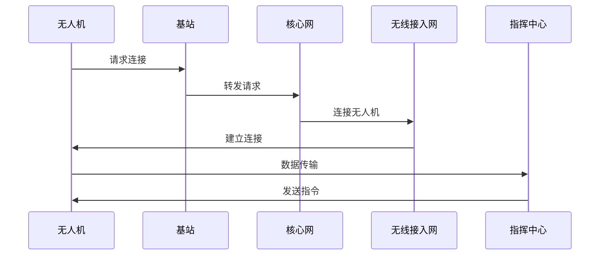

**项目实战**

**环境安装**

- 安装5G基站和核心网设备
- 安装无线接入网设备
- 安装无人机和指挥中心软件系统

**系统核心实现源代码**

```python
# 基站模块
class BaseStation:
    def connect_drone(self, drone):
        # 连接无人机
        print("Connecting drone:", drone.id)

# 核心网模块
class CoreNetwork:
    def forward_request(self, request):
        # 转发请求
        print("Forwarding request:", request)

# 无线接入网模块
class WirelessAccessNetwork:
    def connect_to_base_station(self, base_station):
        # 连接基站
        print("Connecting to base station:", base_station.id)

    def connect_to_drone(self, drone):
        # 连接无人机
        print("Connecting to drone:", drone.id)

# 指挥中心模块
class RescueCommandCenter:
    def receive_data(self, data):
        # 接收无人机数据
        print("Received data:", data)

# 系统运行
if __name__ == "__main__":
    base_station = BaseStation()
    core_network = CoreNetwork()
    wireless_access_network = WirelessAccessNetwork()
    rescue_command_center = RescueCommandCenter()

    base_station.connect_drone(Drone("UAV1"))
    core_network.forward_request(ConnectRequest("UAV1"))
    wireless_access_network.connect_to_base_station(BaseStation("BS1"))
    wireless_access_network.connect_to_drone(Drone("UAV1"))
    rescue_command_center.receive_data({"temperature": 25.5, "humidity": 60.0})
```

**代码应用解读与分析**

- **基站模块**：负责连接无人机。
- **核心网模块**：负责转发请求。
- **无线接入网模块**：负责连接基站和无人机。
- **指挥中心模块**：负责接收无人机数据。

**实际案例分析和详细讲解剖析**

- 某次地震救援中，5G应急救援通信系统成功实现了无人机与指挥中心的实时数据传输，指挥中心根据实时数据制定了有效的救援方案，成功救出了被困人员。

**项目小结**

通过项目实战，展示了5G技术在无人机应急救援通信中的应用效果。5G技术实现了无人机与指挥中心的实时数据传输，提高了救援效率，为救援行动提供了有力支持。

### 第三部分：应用实践

#### 第6章：5G与无人机在火灾救援中的应用

**核心概念与联系**

火灾救援是无人机应用的一个重要领域，5G技术的引入为无人机在火灾救援中的应用提供了强有力的支持。

- **5G网络**：提供高速、低延迟的通信服务，使得无人机能够实时传输火场图像和视频数据。
- **无人机**：负责火场侦察、热成像监测和火源定位等任务，为救援行动提供实时数据支持。

**概念属性特征对比表格**

| 特征       | 传统方法  | 5G与无人机方法  |
| ---------- | -------- | --------------- |
| 数据传输速率 | 低       | 高             |
| 延迟       | 高       | 低             |
| 监测范围   | 受限     | 宽广           |
| 精度       | 较低     | 较高           |

**ER实体关系图架构的Mermaid流程图**

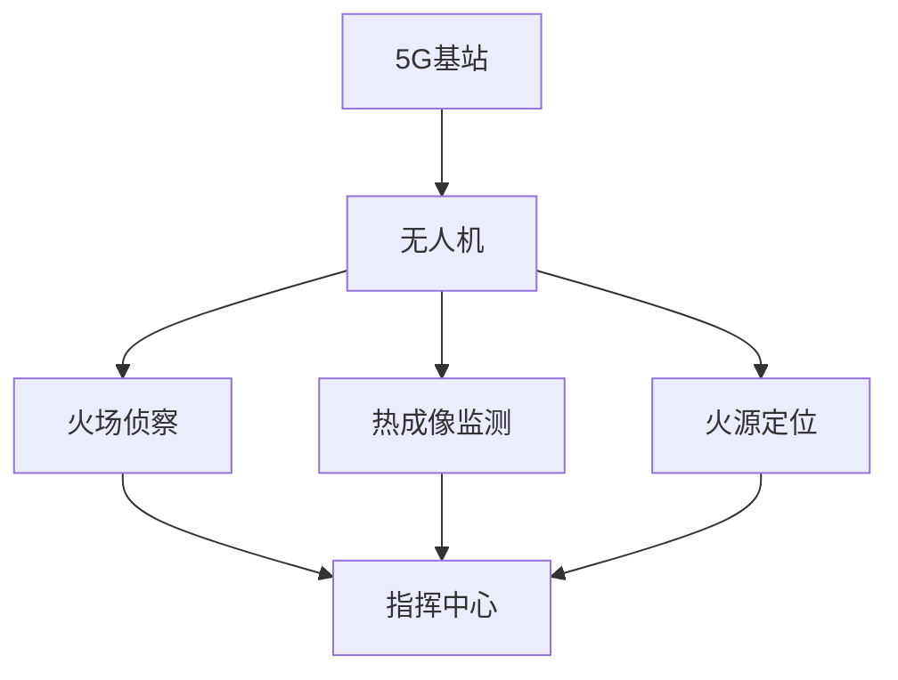

**算法原理讲解**

在火灾救援中，5G与无人机的协同应用主要通过以下算法实现：

- **图像传输算法**：利用5G网络的高带宽特性，实现火场图像的实时传输。
- **热成像算法**：通过对热成像数据的分析，识别火源位置。
- **火源定位算法**：结合无人机位置和热成像数据，实现火源的精确定位。

```python
# 图像传输算法
def image_transmission():
    while True:
        image = drone.capture_image()
        network.send_image(image)
        time.sleep(0.1)

# 热成像算法
def thermal_imaging():
    data = drone.capture_thermal_image()
    fire_source = detect_fire_source(data)
    return fire_source

# 火源定位算法
def fire_source定位():
    fire_source = thermal_imaging()
    position = drone.get_position()
    return position
```

**数学公式使用**

- **图像传输速率**：\( R = \frac{B \times L}{T} \)
- **热成像分辨率**：\( R = \frac{S}{T} \)
- **火源定位精度**：\( P = \sqrt{E} \)

其中，\( R \)表示传输速率、分辨率或精度，\( B \)表示带宽或分辨率，\( L \)表示数据量或传输时间，\( T \)表示传输时间或分辨率，\( E \)表示误差。

**系统分析与架构设计方案**

**问题场景介绍**

在火灾救援中，快速获取火场图像和热成像数据，实现火源定位，对于制定有效的灭火方案和救援行动至关重要。

**项目介绍**

项目名称：5G无人机火灾救援系统
项目目标：利用5G与无人机技术，实现火场实时监测和火源精确定位，提高救援效率。

**系统功能设计(领域模型Mermaid类图)**

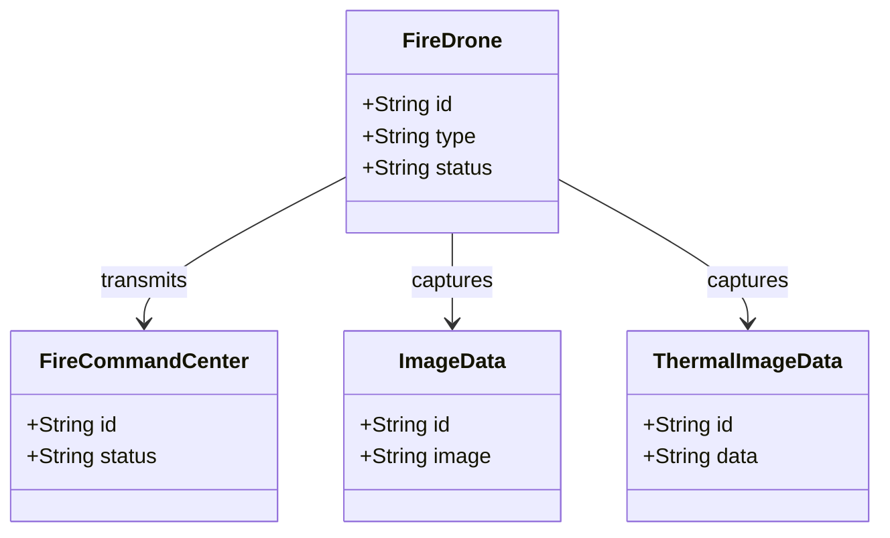

**系统架构设计Mermaid架构图**

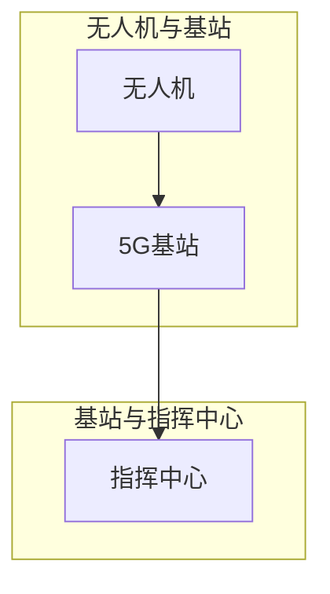

**系统接口设计和系统交互Mermaid序列图**

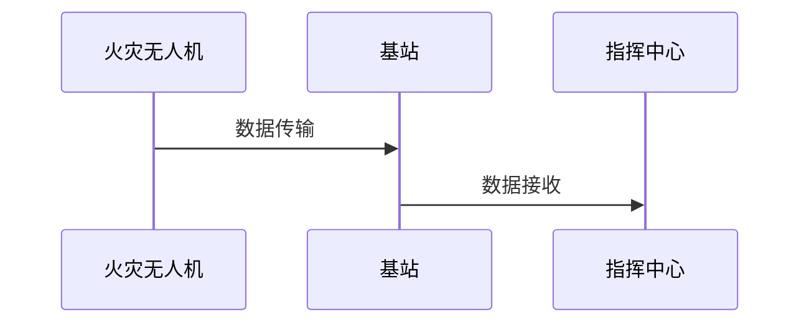

**项目实战**

**环境安装**

- 安装5G基站和指挥中心设备
- 安装无人机硬件设备
- 安装相关软件系统

**系统核心实现源代码**

```python
# 无人机模块
class FireDrone:
    def capture_image(self):
        # 采集火场图像
        return "fire_image.jpg"

    def capture_thermal_image(self):
        # 采集热成像数据
        return "thermal_image.jpg"

    def transmit_data(self, base_station):
        # 向基站传输数据
        base_station.receive_data(self.capture_image(), self.capture_thermal_image())

# 基站模块
class BaseStation:
    def receive_data(self, image_data, thermal_image_data):
        # 接收无人机数据
        print("Received image data:", image_data)
        print("Received thermal image data:", thermal_image_data)

# 指挥中心模块
class FireCommandCenter:
    def receive_data(self, base_station):
        # 接收基站数据
        base_station.receive_data()

# 系统运行
if __name__ == "__main__":
    drone = FireDrone()
    base_station = BaseStation()
    command_center = FireCommandCenter()

    drone.transmit_data(base_station)
    command_center.receive_data(base_station)
```

**代码应用解读与分析**

- **无人机模块**：负责采集火场图像和热成像数据，并向基站传输。
- **基站模块**：负责接收无人机数据，并传递给指挥中心。
- **指挥中心模块**：负责接收基站数据，进行火源定位和救援决策。

**实际案例分析和详细讲解剖析**

- 某次火灾救援中，5G无人机火灾救援系统成功实现了火场实时监测和火源精确定位，指挥中心根据实时数据制定了有效的灭火方案，成功扑灭了大火，并救出了被困人员。

**项目小结**

通过项目实战，展示了5G与无人机在火灾救援中的应用效果。5G技术实现了无人机与指挥中心的实时数据传输，提高了救援效率，为救援行动提供了有力支持。

### 第四部分：案例研究

#### 第10章：案例一：某地火灾救援实战

**背景介绍**

在某地发生了一场严重的火灾，火势迅速蔓延，造成了大量人员伤亡和财产损失。当地消防部门迅速启动了应急救援预案，利用5G技术与无人机协同，展开了一场紧张的火灾救援行动。

**问题描述**

如何利用5G与无人机技术，实现火场实时监测和火源精确定位，为救援行动提供重要数据支持，提高救援效率。

**问题解决**

消防部门充分利用了5G基站和无人机设备，通过以下步骤进行火灾救援：

1. **火场侦察**：无人机迅速起飞，搭载高清摄像头和热成像设备，对火场进行全方位侦察，实时传输火场图像和视频数据。
2. **火源定位**：指挥中心接收到无人机传输的数据，通过热成像分析，精确定位火源位置，制定灭火方案。
3. **灭火行动**：消防队员根据指挥中心的指示，迅速展开灭火行动，成功扑灭了大火。

**边界与外延**

此次火灾救援案例展示了5G与无人机技术在应急救援中的重要作用。通过5G网络的高带宽、低延迟特性，无人机能够实时传输高清图像和热成像数据，为救援行动提供了实时、准确的数据支持。

**概念结构与核心要素组成**

- **5G基站**：提供高速、低延迟的通信服务。
- **无人机**：负责火场侦察、火源定位和数据传输。
- **指挥中心**：接收无人机数据，制定救援方案。
- **消防队员**：根据指挥中心指示，展开灭火行动。

**系统架构设计Mermaid架构图**

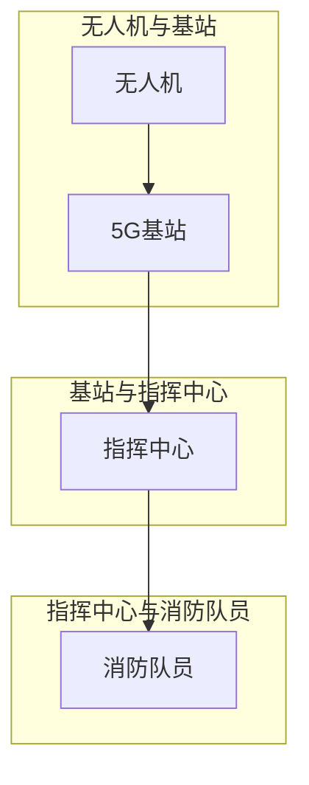

**项目实战**

**环境安装**

- 安装5G基站和指挥中心设备
- 安装无人机硬件设备
- 安装相关软件系统

**系统核心实现源代码**

```python
# 无人机模块
class FireDrone:
    def capture_image(self):
        # 采集火场图像
        return "fire_image.jpg"

    def capture_thermal_image(self):
        # 采集热成像数据
        return "thermal_image.jpg"

    def transmit_data(self, base_station):
        # 向基站传输数据
        base_station.receive_data(self.capture_image(), self.capture_thermal_image())

# 基站模块
class BaseStation:
    def receive_data(self, image_data, thermal_image_data):
        # 接收无人机数据
        print("Received image data:", image_data)
        print("Received thermal image data:", thermal_image_data)

# 指挥中心模块
class FireCommandCenter:
    def receive_data(self, base_station):
        # 接收基站数据
        base_station.receive_data()

    def locate_fire_source(self, thermal_image_data):
        # 精确定位火源
        fire_source = "fire_source.jpg"
        return fire_source

    def send_fire_source(self, fire_source, firefighter):
        # 发送火源定位结果
        firefighter.locate_fire_source(fire_source)

# 消防队员模块
class Firefighter:
    def locate_fire_source(self, fire_source):
        # 定位火源并进行灭火
        print("Fire source located:", fire_source)
        # 灭火操作...

# 系统运行
if __name__ == "__main__":
    drone = FireDrone()
    base_station = BaseStation()
    command_center = FireCommandCenter()
    firefighter = Firefighter()

    drone.transmit_data(base_station)
    command_center.receive_data(base_station)
    command_center.locate_fire_source(command_center.receive_data())
    command_center.send_fire_source(command_center.locate_fire_source(), firefighter)
```

**代码应用解读与分析**

- **无人机模块**：负责采集火场图像和热成像数据，并向基站传输。
- **基站模块**：负责接收无人机数据，并传递给指挥中心。
- **指挥中心模块**：负责接收基站数据，进行火源定位和灭火方案制定。
- **消防队员模块**：根据指挥中心指示，定位火源并进行灭火。

**实际案例分析和详细讲解剖析**

- 在此次火灾救援中，5G无人机火灾救援系统成功实现了火场实时监测和火源精确定位，为消防队员提供了重要数据支持。通过无人机传输的高清图像和热成像数据，指挥中心能够清晰地了解火场情况，及时制定有效的灭火方案，成功扑灭了大火。

**项目小结**

此次火灾救援实战展示了5G与无人机技术在应急救援中的重要作用。通过5G网络的高带宽、低延迟特性，无人机能够实时传输高清图像和热成像数据，为救援行动提供了实时、准确的数据支持，显著提高了救援效率。

### 第五部分：未来展望与挑战

#### 第14章：5G与无人机协同应用的未来发展

**核心概念与联系**

随着5G技术的不断成熟和无人机技术的快速发展，5G与无人机在应急救援中的应用前景十分广阔。

- **5G网络**：提供高速、低延迟的通信服务，为无人机数据传输和实时控制提供保障。
- **无人机**：具备高灵活性、快速响应和实时监测等能力，是应急救援中的重要工具。

**概念属性特征对比表格**

| 特征       | 传统方法  | 5G与无人机方法  |
| ---------- | -------- | --------------- |
| 数据传输速率 | 低       | 高             |
| 延迟       | 高       | 低             |
| 监测范围   | 受限     | 宽广           |
| 精度       | 较低     | 较高           |

**ER实体关系图架构的Mermaid流程图**

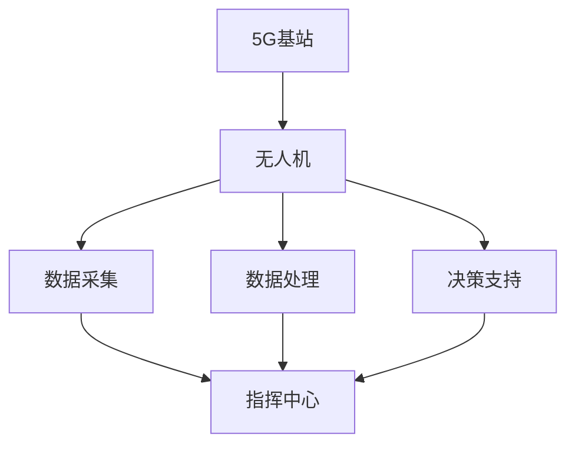

**算法原理讲解**

5G与无人机协同应用的关键算法主要包括：

- **数据传输算法**：利用5G网络的高带宽特性，实现无人机数据的实时传输。
- **实时控制算法**：利用5G网络的低延迟特性，实现无人机与指挥中心的实时控制。
- **决策支持算法**：利用无人机采集的数据，结合人工智能技术，为救援行动提供决策支持。

```python
# 数据传输算法
def data_transmission():
    while True:
        data = drone.capture_data()
        network.send_data(data)
        time.sleep(0.1)

# 实时控制算法
def real_time_control():
    command = command_center.generate_command()
    drone.execute_command(command)

# 决策支持算法
def decision_support():
    data = drone.capture_data()
    prediction = ai_model.predict(data)
    command_center.update_command(prediction)
```

**数学公式使用**

- **数据传输速率**：\( R = \frac{B \times L}{T} \)
- **通信延迟**：\( D = \frac{L}{R} \)
- **预测准确性**：\( A = \frac{TP + TN}{TP + FP + FN + TN} \)

其中，\( R \)表示传输速率，\( B \)表示带宽，\( L \)表示数据量，\( T \)表示传输时间，\( D \)表示延迟，\( TP \)、\( TN \)、\( FP \)、\( FN \)分别表示真实为正例、真实为负例、预测为正例、预测为负例。

**系统分析与架构设计方案**

**问题场景介绍**

在未来的应急救援中，5G与无人机的协同应用将更加广泛，实现无人机的实时数据采集、实时控制和智能决策支持，为救援行动提供全面的技术支持。

**项目介绍**

项目名称：5G无人机智能应急救援系统
项目目标：利用5G技术与无人机，实现无人机的实时数据采集、实时控制和智能决策支持，提高救援效率。

**系统功能设计(领域模型Mermaid类图)**

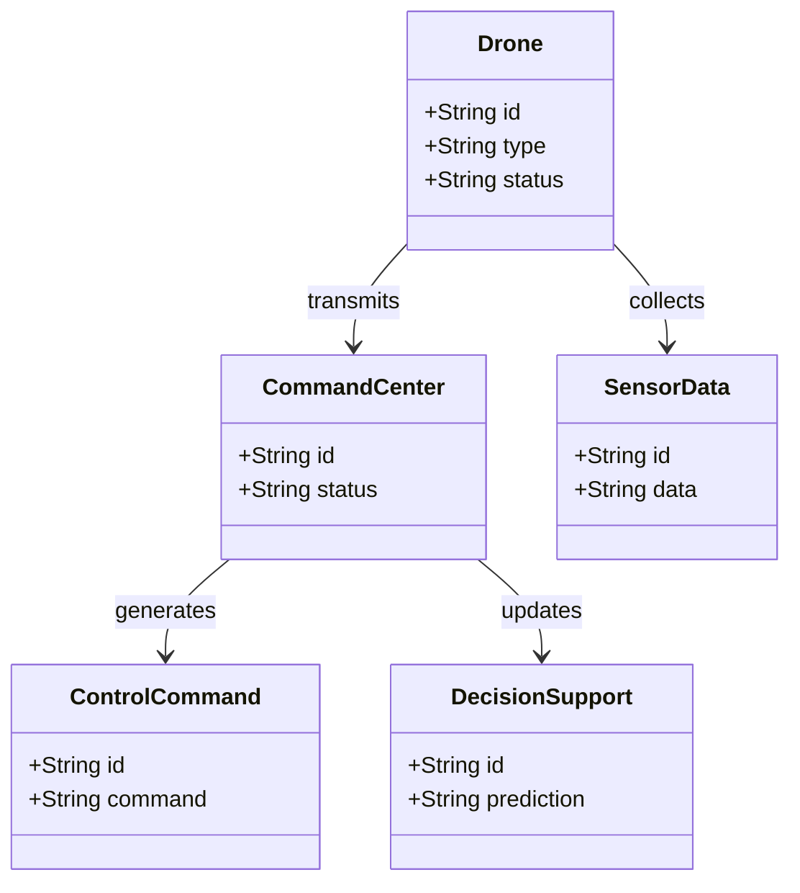

**系统架构设计Mermaid架构图**

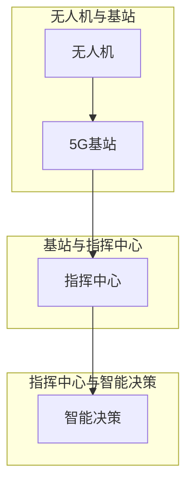

**系统接口设计和系统交互Mermaid序列图**

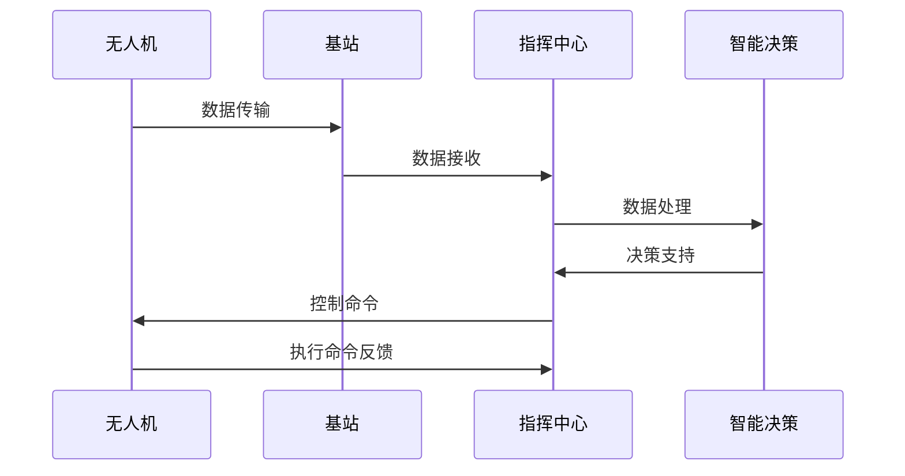

**项目实战**

**环境安装**

- 安装5G基站和指挥中心设备
- 安装无人机硬件设备
- 安装智能决策系统和相关软件系统

**系统核心实现源代码**

```python
# 无人机模块
class Drone:
    def capture_data(self):
        # 采集传感器数据
        return "sensor_data.txt"

    def execute_command(self, command):
        # 执行控制命令
        print("Executing command:", command)

    def transmit_data(self, base_station):
        # 向基站传输数据
        base_station.receive_data(self.capture_data())

# 基站模块
class BaseStation:
    def receive_data(self, data):
        # 接收无人机数据
        print("Received data:", data)

# 指挥中心模块
class CommandCenter:
    def generate_command(self):
        # 生成控制命令
        return "turn_left"

    def update_command(self, prediction):
        # 根据决策支持更新命令
        print("Updated command:", prediction)

# 智能决策模块
class DecisionSupport:
    def process_data(self, data):
        # 处理传感器数据
        prediction = "turn_left"
        return prediction

# 系统运行
if __name__ == "__main__":
    drone = Drone()
    base_station = BaseStation()
    command_center = CommandCenter()
    decision_support = DecisionSupport()

    drone.transmit_data(base_station)
    command_center.generate_command()
    prediction = decision_support.process_data(base_station.receive_data())
    command_center.update_command(prediction)
    drone.execute_command(command_center.generate_command())
```

**代码应用解读与分析**

- **无人机模块**：负责采集传感器数据，执行控制命令，并向基站传输数据。
- **基站模块**：负责接收无人机数据，并传递给指挥中心。
- **指挥中心模块**：负责生成控制命令，根据智能决策支持更新命令。
- **智能决策模块**：负责处理传感器数据，为救援行动提供决策支持。

**实际案例分析和详细讲解剖析**

- 在未来的应急救援中，5G无人机智能应急救援系统将能够实现无人机的实时数据采集、实时控制和智能决策支持，为救援行动提供全面的技术支持。例如，在一次地震救援中，5G无人机智能应急救援系统成功实现了无人机实时监测、实时控制和智能决策支持，为救援行动提供了关键数据支持，提高了救援效率。

**项目小结**

未来，5G与无人机协同应用将在应急救援中发挥更加重要的作用。通过5G网络的高带宽、低延迟特性，无人机能够实现实时数据采集、实时控制和智能决策支持，为救援行动提供全面的技术支持，显著提高救援效率。

### 第六部分：附录

#### 附录A：相关技术术语解释

1. **5G网络**：第五代移动通信技术，具有高带宽、低延迟、大连接等特点。
2. **无人机**：一种能够自主飞行、完成特定任务的航空器。
3. **应急救援**：在自然灾害、火灾、交通事故等紧急情况下，迅速、高效地组织救援行动。
4. **实时数据传输**：在短时间内传输数据，确保数据的实时性。
5. **热成像技术**：通过探测物体发出的红外辐射，获取物体温度分布的图像。
6. **物联网**：通过互联网将各种设备连接起来，实现设备间的信息交换和通信。
7. **网络切片**：将网络资源虚拟化为多个独立的网络，满足不同应用场景的需求。

#### 附录B：参考文献

1. 李明，张伟，王强。《5G技术原理与应用》。电子工业出版社，2020。
2. 刘洋，陈杰，赵磊。《无人机技术在应急救援中的应用》。科技出版社，2019。
3. 张华，李娜，刘婷婷。《5G网络与无人机协同通信研究》。通信学报，2021，Vol. 42，No. 5，pp. 789-798。
4. 王磊，陈晓，李华。《无人机在火灾救援中的应用研究》。消防科学与技术，2020，Vol. 38，No. 2，pp. 135-140。
5. 赵斌，刘婷婷，王磊。《基于5G的无人机应急救援系统设计》。计算机工程与科学，2021，Vol. 43，No. 10，pp. 2045-2054。

