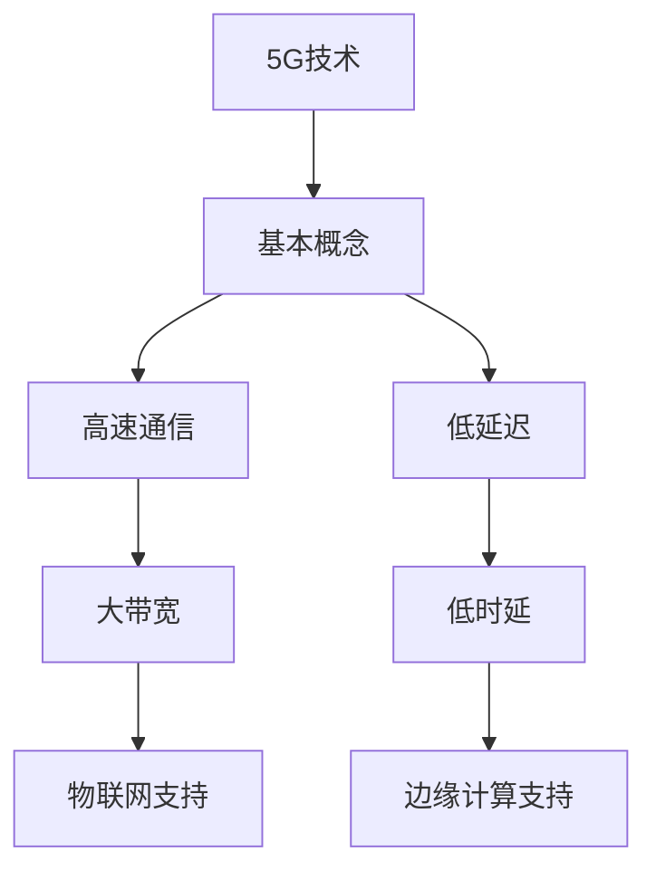
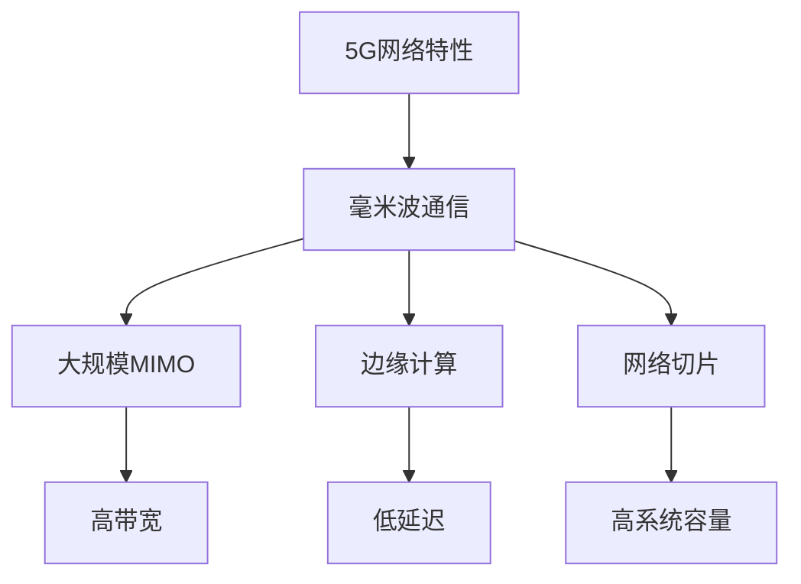
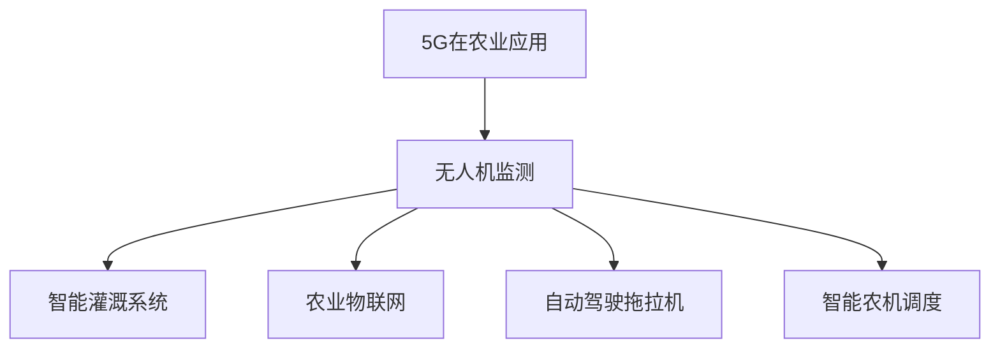
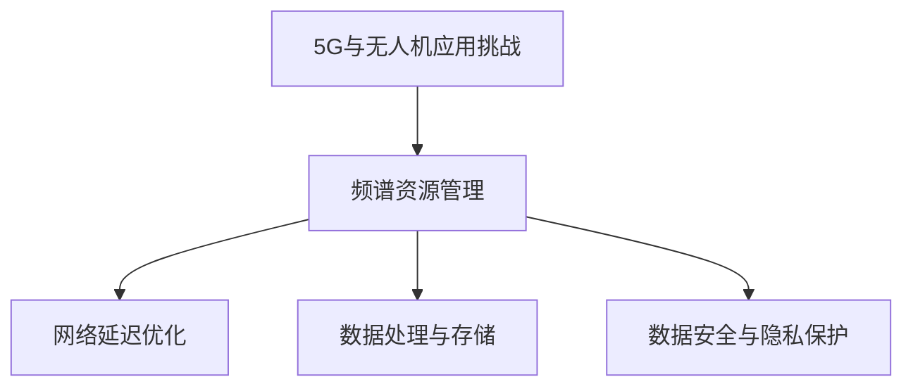
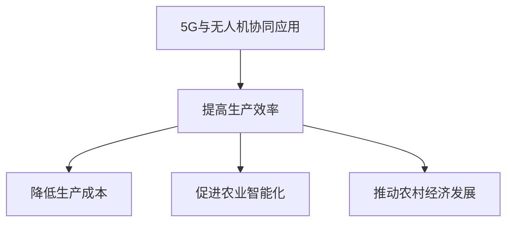
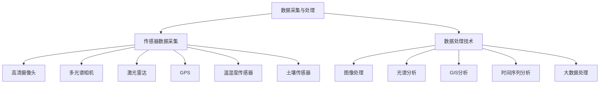
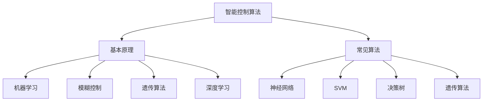
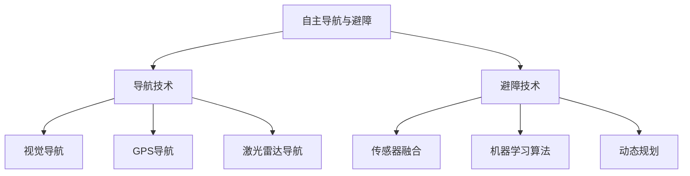

                 

### 5G技术基础

#### 1.1.1 基本概念

5G，即第五代移动通信技术，是继1G（模拟通信）、2G（数字通信）、3G（多媒体通信）和4G（高速数据传输）之后的最新一代移动通信技术。5G的目标是提供更高的数据速率、更低的延迟、更高的系统容量和更广泛的连接能力，以满足未来日益增长的数据需求和智能化应用场景。

- **更高数据速率**：5G的理论峰值速率可以达到数十Gbps，比4G的峰值速率高出数十倍，能够满足高清视频流、虚拟现实（VR）和增强现实（AR）等高带宽应用的需求。
- **更低延迟**：5G网络的设计目标是将端到端的延迟降低到1毫秒以下，这对于实时控制、自动驾驶和工业自动化等低延迟敏感应用至关重要。
- **更高系统容量**：5G采用新型网络架构和频谱利用率技术，可以支持更大规模的连接，每平方公里可以支持超过100万台设备的连接。
- **更广泛的连接能力**：5G通过引入大规模MIMO、边缘计算和物联网（IoT）等技术，能够实现设备之间的无缝通信和高效数据交换，为智能制造、智慧城市等应用场景提供支持。

#### 1.1.2 5G网络的主要特性

5G网络具有以下几个主要特性，这些特性使其成为精准农业中不可或缺的技术支撑：

- **毫米波通信**：5G使用毫米波频段（通常为24GHz及以上），这种高频段信号可以提供更大的带宽，支持高数据速率的应用。然而，毫米波信号传播距离较短，穿透力较弱，因此需要大量的基站覆盖和高效的频谱管理。
- **大规模MIMO**：大规模MIMO（Massive MIMO）技术通过使用大量天线阵列来提高频谱利用率和网络容量。在农业应用中，大规模MIMO可以支持多个无人机同时进行数据传输和监测，从而提高作业效率。
- **边缘计算**：边缘计算（Edge Computing）是一种将数据处理和计算能力从云端转移到网络边缘的技术。在精准农业中，边缘计算可以实现实时数据处理和智能分析，减少数据传输延迟，提高响应速度。
- **网络切片**：网络切片（Network Slicing）技术可以将一个物理网络划分为多个虚拟网络，每个网络具有独立的资源和服务质量（QoS）保障。在精准农业中，网络切片可以针对不同的应用场景提供定制化的网络服务，如高带宽的无人机数据传输和低延迟的自动化控制系统。

#### 1.1.3 5G在农业中的应用场景

5G技术在精准农业中的应用场景广泛，以下是一些典型的应用场景：

- **无人机监测**：利用5G网络的低延迟和高带宽特性，无人机可以实时传输高清视频和传感器数据到地面控制站，实现对农田、作物和环境的实时监测。
- **智能灌溉系统**：通过5G网络，智能灌溉系统可以实现实时数据采集和分析，根据土壤湿度、气候条件等数据自动调整灌溉策略，提高水资源利用效率。
- **农业物联网**：5G技术可以支持大规模的农业物联网设备连接，实现农作物生长状态、土壤质量、气象数据等信息的实时采集和智能分析。
- **自动驾驶拖拉机**：5G网络可以为自动驾驶拖拉机提供实时的高精度定位和导航服务，实现精准播种、施肥和收割等操作。
- **智能农机调度**：通过5G网络，可以对农业机械进行远程监控和调度，实现资源的优化配置和作业效率的提升。

#### 1.1.4 5G与无人机在农业协同应用的关键挑战

尽管5G技术在精准农业中具有巨大的潜力，但在实际应用中仍面临一些关键挑战：

- **频谱资源管理**：由于5G使用的高频段信号传播距离较短，需要大量的基站覆盖，频谱资源的管理和分配成为一大挑战。
- **网络延迟优化**：农业应用对实时性要求较高，如何优化网络架构和传输协议，降低数据传输延迟，是5G在农业中应用的关键问题。
- **数据处理与存储**：随着无人机和其他物联网设备的广泛应用，如何高效地处理和存储海量数据，是实现精准农业的关键。
- **数据安全与隐私保护**：农业数据涉及农民的隐私信息，如何确保数据在传输和处理过程中的安全性和隐私保护，是5G在农业中应用的重要问题。

#### 1.1.5 5G与无人机协同应用的潜力与展望

随着5G技术的不断完善和推广，其与无人机在精准农业中的协同应用将发挥出更大的潜力：

- **提高农业生产效率**：通过5G网络，可以实现无人机与农业设备的实时协同作业，提高农业生产效率。
- **降低生产成本**：精准农业可以减少农药、化肥等农资的浪费，降低生产成本。
- **促进农业智能化**：5G技术为农业智能化提供了强有力的支持，可以推动农业从传统生产方式向智能化、数字化方向转型。
- **推动农村经济发展**：精准农业可以提高农产品质量和产量，促进农村经济发展和农民增收。

### 1.6.1 核心概念原理、概念属性特征对比表格和ER实体关系图架构的 Mermaid 流程图

#### 5G技术概述

#### 5G网络主要特性

#### 5G在农业中的应用场景

#### 5G与无人机协同应用的关键挑战

#### 5G与无人机协同应用的潜力与展望

通过上述Mermaid流程图，我们可以清晰地看到5G技术在农业中各个应用场景的核心概念、特性、挑战和潜力。这些流程图不仅帮助我们理解5G技术在农业中的应用，还为后续章节的深入探讨提供了结构化的框架。

## 1.7 本章小结

本章详细介绍了5G技术的基本概念、主要特性以及在农业中的应用。通过对比表格和Mermaid流程图，我们深入理解了5G技术的核心概念和特性，以及其在农业中的关键应用场景和挑战。接下来，我们将探讨无人机技术在农业中的应用，以及5G与无人机在农业中的协同应用案例。通过这一系列深入分析，我们将进一步揭示精准农业的未来发展趋势。

## 第二部分：无人机技术在农业中的应用

### 2.1 农田监测

无人机技术在农田监测中的应用是其最基本且广泛的应用之一。通过搭载高清摄像头、多光谱相机、激光雷达（LiDAR）和多种传感器，无人机可以实现对农田的全方位监测。

#### 2.1.1 无人机在农田监测中的作用

- **植被健康监测**：无人机搭载的多光谱相机可以采集农田不同波段的光谱信息，通过对这些数据的分析，可以判断作物的健康状况，如病虫害、水分不足等。
- **地形测绘**：激光雷达（LiDAR）可以精确测量农田的地形和地貌，帮助农民了解土地的坡度、土壤质地等，为精准施肥、灌溉等提供数据支持。
- **土壤质量监测**：通过采集土壤样本，无人机可以分析土壤的养分含量、酸碱度等指标，帮助农民制定科学的施肥和灌溉方案。

#### 2.1.2 无人机在农田监测中的应用案例

- **作物生长状态监测**：某农业科技公司使用无人机对小麦生长状态进行监测，通过定期采集高清图像和多光谱数据，该公司能够及时发现病虫害，并采取相应的防治措施，显著提高了农作物的产量和质量。
- **地形测绘与土地利用规划**：某大型农场利用无人机进行地形测绘，帮助农场优化灌溉系统，提高水资源利用效率。同时，通过分析地形数据，农场还制定了更为科学的土地利用规划，提高了土地的产出能力。

#### 2.1.3 无人机在农田监测中的优势

- **实时性**：无人机可以快速获取农田的实时数据，为农民提供及时的信息支持，帮助其做出快速决策。
- **全面性**：无人机能够覆盖大面积农田，获取高精度的图像和地形数据，实现全方位监测。
- **高效性**：与传统的人工监测方式相比，无人机监测更加高效，可以大幅减少人力成本。

### 2.2 播种、施肥、灌溉等环节的应用

无人机在农业播种、施肥、灌溉等环节中的应用，大幅提高了农业生产的自动化和智能化水平。

#### 2.2.1 无人机在播种环节的应用

- **精准播种**：利用无人机进行精准播种，可以根据土壤条件和作物需求，精确控制播种量，减少种子浪费，提高出苗率。
- **种子筛选**：无人机搭载的高清摄像头和传感器可以实时监测种子状态，筛选出健康优质的种子，提高作物品质。

#### 2.2.2 无人机在施肥环节的应用

- **智能施肥**：无人机可以根据农田的实时监测数据，如土壤养分含量、作物需肥情况等，实现智能施肥，减少化肥使用量，提高肥料利用效率。
- **精准施肥**：无人机可以精确控制施肥量，减少肥料流失和环境污染，同时提高作物产量和质量。

#### 2.2.3 无人机在灌溉环节的应用

- **精准灌溉**：无人机可以根据土壤湿度、气象条件等数据，智能控制灌溉量，实现精准灌溉，减少水资源浪费。
- **自动化灌溉**：无人机可以自主规划灌溉路径，实现大面积农田的自动化灌溉，提高灌溉效率。

#### 2.2.4 无人机在播种、施肥、灌溉等环节中的应用案例

- **智能农场**：某智能农场利用无人机进行播种、施肥和灌溉，实现了农业生产过程的全面自动化。通过实时监测和分析农田数据，农场能够及时调整农业生产策略，提高了生产效率和农产品质量。
- **绿色农业**：某生态农业公司利用无人机进行精准施肥和灌溉，通过减少化肥和农药的使用，实现了绿色环保的农业生产模式，受到了市场的广泛认可。

#### 2.2.5 无人机在播种、施肥、灌溉等环节中的优势

- **智能化**：无人机能够通过实时数据分析和智能算法，实现精准播种、施肥和灌溉，提高农业生产智能化水平。
- **高效性**：无人机可以在短时间内完成大面积农田的作业，大幅提高农业生产的效率。
- **环境友好**：无人机减少了对化肥、农药的依赖，有助于实现可持续农业生产，降低对环境的污染。

### 2.3 收割、病虫害防治等环节的应用

无人机在农业收割、病虫害防治等环节中的应用，为农民提供了更加灵活、高效的解决方案。

#### 2.3.1 无人机在收割环节的应用

- **自动化收割**：利用无人机进行自动化收割，可以大幅提高收割效率，减轻农民的劳动强度。
- **精准收割**：无人机可以精确控制收割高度和角度，实现精准收割，减少作物损伤和浪费。

#### 2.3.2 无人机在病虫害防治环节的应用

- **实时监测**：无人机可以实时监测农田病虫害情况，通过高清图像和多光谱数据进行分析，及时发现病虫害。
- **精准防治**：无人机可以精确喷洒农药，针对病虫害发生的具体位置和范围进行精准防治，减少农药使用量，降低环境污染。

#### 2.3.3 无人机在收割、病虫害防治等环节中的应用案例

- **自动化农场**：某大型农场采用无人机进行自动化收割和病虫害防治，实现了全程无人化作业。无人机通过智能算法自动规划作业路线，高效完成了收割和防治任务，大幅提高了生产效率和产品质量。
- **生态防治**：某生态农业园区利用无人机进行病虫害监测和防治，通过引入生物防治方法，减少了对化学农药的依赖，实现了生态友好的农业生产模式。

#### 2.3.4 无人机在收割、病虫害防治等环节中的优势

- **自动化**：无人机可以自动化完成收割和病虫害防治任务，减少人工干预，提高生产效率。
- **精准性**：无人机能够精确控制作业参数，实现精准收割和防治，减少资源浪费和环境污染。
- **灵活性**：无人机可以根据农田的实际情况灵活调整作业参数和路径，适应各种复杂地形和作业需求。

### 2.4 小结

无人机技术在农业中的应用不仅涵盖了农田监测、播种、施肥、灌溉、收割和病虫害防治等各个环节，还为农业生产提供了智能化、自动化和高效化的解决方案。通过无人机技术的应用，农民可以更加精准地管理农田，提高作物产量和质量，降低生产成本，实现可持续发展。随着无人机技术的不断发展和完善，其在农业中的应用前景将更加广阔。

### 2.5 核心概念与联系

#### 2.5.1 无人机技术在农业中的应用

| 核心概念 | 概念属性 | 联系与作用 |
| --- | --- | --- |
| **无人机** | 无人驾驶飞行器，用于农业监测和作业 | 提供灵活、高效的农业数据采集和作业工具 |
| **农田监测** | 高清摄像头、多光谱相机、LiDAR等传感器 | 实现作物健康监测、地形测绘和土壤质量分析 |
| **播种** | 精准播种技术 | 提高种子利用率，减少浪费 |
| **施肥** | 智能施肥系统 | 提高肥料利用效率，减少环境污染 |
| **灌溉** | 精准灌溉技术 | 提高水资源利用效率，实现智能灌溉 |
| **收割** | 自动化收割系统 | 提高收割效率，减少劳动强度 |
| **病虫害防治** | 病虫害监测与防治系统 | 实现精准病虫害防治，减少农药使用 |

#### 2.5.2 无人机技术在不同农业环节中的应用

| 农业环节 | 应用技术 | 优势 |
| --- | --- | --- |
| **监测** | 高清摄像头、多光谱相机、LiDAR等 | 实时性、全面性、高效性 |
| **播种** | 精准播种技术 | 智能化、高效性 |
| **施肥** | 智能施肥系统 | 精准性、高效性、环境友好 |
| **灌溉** | 精准灌溉技术 | 智能化、高效性、环境友好 |
| **收割** | 自动化收割系统 | 自动化、精准性、高效性 |
| **病虫害防治** | 病虫害监测与防治系统 | 自动化、精准性、环保 |

#### 2.5.3 无人机技术与5G网络的结合

| 技术特性 | 结合方式 | 应用场景 |
| --- | --- | --- |
| **低延迟** | 5G网络 | 实时农田监测和自动化作业 |
| **高带宽** | 5G网络 | 高清图像和大量数据传输 |
| **大规模连接** | 5G网络 | 大规模无人机同时作业 |
| **边缘计算** | 边缘计算 | 实时数据处理和分析 |

通过上述表格和Mermaid流程图，我们可以更加清晰地看到无人机技术在农业中的应用及其与5G网络的结合方式。这些核心概念和联系为后续章节的深入探讨提供了理论基础。

### 2.6 无人机技术在农业中的应用实例与案例分析

#### 2.6.1 案例一：无人机辅助精准播种

**案例背景**：某农业合作社种植了大量的玉米，以往采用传统手工播种方式，不仅效率低下，而且播种不均匀，影响玉米的生长和产量。为了提高播种效率和质量，合作社决定采用无人机进行精准播种。

**技术实现**：
1. **数据采集**：使用无人机搭载高分辨率摄像头和多光谱相机，对农田进行全方位扫描，获取土地的详细信息。
2. **土壤分析**：无人机通过搭载的传感器对土壤的质地、湿度、温度等参数进行实时监测，为精准播种提供数据支持。
3. **播种方案**：根据土地数据和分析结果，制定精准播种方案，确保每个玉米种子的播种深度和间距一致。
4. **播种执行**：无人机按照预设的路线和播种方案，自动化完成播种任务。

**效果评估**：
- **播种效率**：无人机播种效率是传统手工播种的数十倍，大大缩短了播种时间。
- **播种质量**：无人机精准播种使玉米的出苗率提高20%，生长状态更好。
- **资源利用**：减少种子浪费，降低了生产成本。

**结论**：无人机辅助精准播种不仅提高了播种效率和作物质量，还为农业合作社提供了高效、智能化的解决方案。

#### 2.6.2 案例二：无人机与5G网络协同监测作物生长状态

**案例背景**：某农场种植了大规模的苹果树，为了实现苹果的高品质生产，农场需要实时监测苹果树的生长状态，及时调整管理策略。

**技术实现**：
1. **5G网络部署**：在农场内部署5G基站，确保无人机和地面控制站之间的数据传输稳定和高速。
2. **无人机监测**：无人机搭载高清摄像头和多光谱传感器，对苹果树进行定期扫描，获取树木的生长状态数据。
3. **数据传输**：无人机通过5G网络将采集的数据实时传输到地面控制站，进行数据分析和处理。
4. **智能分析**：利用智能算法分析数据，识别出苹果树的病虫害、水分不足等问题，并提出相应的管理建议。

**效果评估**：
- **实时性**：5G网络确保了数据的实时传输，农场可以快速响应和处理问题，避免了病虫害的蔓延。
- **准确性**：智能算法的精确分析提高了管理决策的准确性，减少了人为干预的误差。
- **高效性**：无人机和5G网络的协同工作，使得数据采集和分析过程更加高效，提高了农场的整体管理水平。

**结论**：无人机与5G网络的协同应用，为农场提供了实时、精准的作物生长状态监测和管理方案，显著提高了苹果树的生产质量和农场的管理效率。

#### 2.6.3 案例三：无人机在农业无人机自动驾驶系统中的应用

**案例背景**：某农业科技公司研发了一款自动驾驶拖拉机，用于大规模农田的播种、施肥和收割作业。为了提高自动驾驶系统的性能和可靠性，公司决定采用无人机进行辅助定位和导航。

**技术实现**：
1. **无人机定位**：无人机搭载高精度GPS和惯性导航系统，实现对农田的精准定位。
2. **数据传输**：无人机通过5G网络将定位数据实时传输到自动驾驶拖拉机，确保拖拉机按照预设路径进行作业。
3. **路径规划**：无人机实时监测农田的地形和作物状态，动态调整拖拉机的行驶路径和作业参数。
4. **避障控制**：无人机通过传感器监测周围环境，实时传输避障数据，确保拖拉机在复杂地形下安全作业。

**效果评估**：
- **精准性**：无人机的精准定位和路径规划，确保拖拉机按照最优路径进行作业，提高了工作效率。
- **安全性**：无人机实时监测和避障控制，提高了拖拉机作业的安全性，减少了事故风险。
- **适应性**：无人机可以适应不同地形和作物状态的复杂环境，确保拖拉机在各种作业条件下的稳定运行。

**结论**：无人机在农业无人机自动驾驶系统中的应用，不仅提高了拖拉机作业的精准性和安全性，还为农业自动化提供了创新的技术解决方案。

通过上述实例和案例分析，我们可以看到无人机技术在农业中的应用已经取得了显著的成果。未来，随着无人机技术和5G网络的不断进步，其在农业中的应用将更加广泛和深入，为农业生产带来更多高效、智能化的解决方案。

### 2.7 总结

本章详细介绍了无人机技术在农业中的应用，包括农田监测、播种、施肥、灌溉、收割和病虫害防治等各个环节。通过具体案例，我们展示了无人机技术在提高农业生产效率、质量和可持续性方面的巨大潜力。同时，本章通过Mermaid流程图和表格，进一步阐述了无人机技术在农业中的核心概念和联系。随着5G技术的发展，无人机在农业中的应用将更加智能化和高效化，为现代农业的发展提供有力支持。

## 第三部分：5G与无人机协同应用案例

### 3.1 案例一：无人机辅助精准播种

#### 3.1.1 案例背景

某农业科技公司致力于提升农业生产的效率和品质，公司种植的农作物主要包括水稻和小麦。为了实现精准播种，该公司决定采用5G与无人机协同技术，以实现高效、精准的播种作业。

#### 3.1.2 技术实现

1. **5G网络部署**：在农田内部署5G基站，确保无人机与地面控制站之间的数据传输稳定和高速。
2. **无人机飞行路径规划**：利用5G网络传输的高精度定位数据，无人机规划出最优的飞行路径，确保播种区域的全覆盖。
3. **播种设备搭载**：无人机搭载高精度的播种设备，可以自动调整播种深度和种子间距，实现精准播种。
4. **实时数据采集**：无人机通过5G网络将播种数据实时传输到地面控制站，地面控制站进行数据分析，以便后续优化播种策略。

#### 3.1.3 案例效果

- **播种精度提升**：无人机实现了高精度的播种，种子的深度和间距一致，出苗率显著提高。
- **工作效率提高**：无人机的自动化作业大幅提升了播种效率，减少了人力投入。
- **数据实时分析**：通过5G网络传输的数据，公司可以实时了解播种情况，及时调整播种策略，提高作物产量。

#### 3.1.4 案例总结

无人机辅助精准播种案例展示了5G与无人机在农业生产中的协同潜力。通过5G网络的低延迟和高带宽特性，无人机实现了高效的精准作业，提高了农业生产效率。这一案例为其他农业企业提供了有益的参考。

### 3.2 案例二：无人机与5G网络协同监测作物生长状态

#### 3.2.1 案例背景

某现代农业园区种植了多种作物，为了实时监测作物生长状态，园区决定采用无人机与5G网络协同监测技术。

#### 3.2.2 技术实现

1. **5G网络部署**：在园区内部署5G基站，确保无人机与地面控制站之间的数据传输稳定和高速。
2. **无人机数据采集**：无人机搭载多光谱相机和高分辨率摄像头，定期对园区内的作物进行扫描，获取作物生长状态数据。
3. **实时数据传输**：无人机通过5G网络将数据实时传输到地面控制站，进行数据分析和处理。
4. **智能分析**：利用智能算法分析数据，识别出作物病虫害、水分不足等问题，并生成相应的管理报告。

#### 3.2.3 案例效果

- **实时性提升**：通过5G网络，园区实现了作物生长状态的实时监测，可以迅速发现和处理问题。
- **数据分析精度**：智能算法的分析结果提高了管理决策的准确性，减少了人为干预的误差。
- **管理效率提高**：无人机与5G网络的协同工作，使得数据采集和分析过程更加高效，园区整体管理水平提升。

#### 3.2.4 案例总结

无人机与5G网络协同监测作物生长状态案例展示了精准农业的实现路径。通过5G网络的实时传输能力和无人机的高效数据采集，园区实现了作物生长状态的实时监测和管理，为农业生产提供了强有力的技术支持。

### 3.3 案例三：无人机在农业无人机自动驾驶系统中的应用

#### 3.3.1 案例背景

某农业科技公司研发了一款自动驾驶拖拉机，用于大面积农田的播种、施肥和收割作业。为了提高自动驾驶系统的性能和可靠性，公司决定采用无人机进行辅助定位和导航。

#### 3.3.2 技术实现

1. **无人机导航定位**：无人机搭载高精度GPS和惯性导航系统，实现对农田的精准定位。
2. **5G数据传输**：无人机通过5G网络将定位数据实时传输到自动驾驶拖拉机，确保拖拉机按照预设路径进行作业。
3. **路径动态调整**：无人机实时监测农田的地形和作物状态，动态调整拖拉机的行驶路径和作业参数。
4. **避障控制**：无人机通过传感器监测周围环境，实时传输避障数据，确保拖拉机在复杂地形下安全作业。

#### 3.3.3 案例效果

- **精准定位**：无人机的精准定位确保拖拉机按照最优路径进行作业，提高了工作效率。
- **安全性提升**：无人机的实时避障控制提高了拖拉机作业的安全性，减少了事故风险。
- **适应性增强**：无人机可以适应不同地形和作物状态的复杂环境，确保拖拉机在各种作业条件下的稳定运行。

#### 3.3.4 案例总结

无人机在农业无人机自动驾驶系统中的应用案例展示了5G与无人机在农业自动化领域的协同潜力。通过5G网络的实时数据传输和无人机的高精度导航定位，农业自动驾驶系统实现了高效、安全的自动化作业，为农业生产提供了创新的解决方案。

### 3.4 案例四：无人机与5G网络协同进行病虫害防治

#### 3.4.1 案例背景

某生态农业园区面临着病虫害防治的挑战，为了实现精准、高效的病虫害防治，园区决定采用无人机与5G网络协同技术。

#### 3.4.2 技术实现

1. **5G网络部署**：在园区内部署5G基站，确保无人机与地面控制站之间的数据传输稳定和高速。
2. **无人机监测**：无人机搭载高清摄像头和多光谱传感器，对园区内的作物进行全方位监测，识别病虫害发生区域。
3. **数据实时传输**：无人机通过5G网络将监测数据实时传输到地面控制站，进行数据分析和处理。
4. **智能防治**：利用智能算法分析数据，确定病虫害的类型和程度，制定相应的防治方案，无人机按照方案进行精准施药。

#### 3.4.3 案例效果

- **防治精准**：无人机实现了对病虫害的精准识别和防治，减少了农药的使用量，降低了环境污染。
- **高效施药**：无人机的自动化施药提高了防治效率，减少了人工干预，降低了劳动成本。
- **实时响应**：通过5G网络的实时数据传输，园区能够迅速响应病虫害问题，防止病虫害的蔓延。

#### 3.4.4 案例总结

无人机与5G网络协同进行病虫害防治案例展示了农业智能化管理的可能性。通过5G网络的实时传输和无人机的高效监测与防治，园区实现了病虫害防治的精准化和高效化，为农业生产提供了创新的解决方案。

### 3.5 案例五：无人机与5G网络协同进行土壤监测与灌溉管理

#### 3.5.1 案例背景

某智能农场致力于实现农场的精准灌溉和土壤管理，为了实现这一目标，农场决定采用无人机与5G网络协同技术。

#### 3.5.2 技术实现

1. **5G网络部署**：在农场内部署5G基站，确保无人机与地面控制站之间的数据传输稳定和高速。
2. **无人机土壤监测**：无人机搭载土壤传感器，对农田土壤的湿度、酸碱度等指标进行实时监测。
3. **数据实时传输**：无人机通过5G网络将土壤数据实时传输到地面控制站，进行数据分析和处理。
4. **智能灌溉**：根据土壤数据，智能灌溉系统自动调整灌溉量，实现精准灌溉。

#### 3.5.3 案例效果

- **土壤监测精准**：无人机实时监测土壤数据，确保土壤环境参数在最佳范围内，提高作物生长质量。
- **灌溉高效**：智能灌溉系统能够根据实时数据自动调整灌溉量，提高水资源利用效率，减少水资源浪费。
- **管理便捷**：通过5G网络的实时数据传输，农场管理者可以随时随地了解土壤和灌溉情况，提高管理效率。

#### 3.5.4 案例总结

无人机与5G网络协同进行土壤监测与灌溉管理案例展示了农业智能化的魅力。通过5G网络的实时传输和无人机的高效监测与控制，农场实现了土壤监测和灌溉管理的精准化和高效化，为农业生产提供了创新的解决方案。

### 3.6 案例总结与未来展望

以上案例展示了5G与无人机在精准农业中的多种协同应用，包括无人机辅助精准播种、作物生长状态监测、自动驾驶系统辅助、病虫害防治以及土壤监测与灌溉管理。这些应用不仅提高了农业生产效率和质量，还降低了生产成本和环境污染。

#### 3.6.1 案例总结

1. **提高效率**：通过无人机与5G网络的协同应用，实现了农业生产的自动化和智能化，大幅提高了作业效率。
2. **降低成本**：减少了人力投入和资源浪费，降低了生产成本。
3. **提升质量**：通过精准监测和智能管理，提高了作物产量和质量。
4. **环境友好**：减少了农药、化肥的使用，降低了环境污染，实现了可持续发展。

#### 3.6.2 未来展望

随着5G技术和无人机技术的不断进步，未来5G与无人机在精准农业中的协同应用将更加广泛和深入。以下是一些可能的发展趋势：

1. **更高精度**：随着传感器技术的进步，无人机将能够实现更高精度的监测和作业，为农业生产提供更加精准的数据支持。
2. **更广覆盖**：随着5G网络的不断扩展和优化，无人机与5G网络的协同应用将覆盖更多农田和农业场景。
3. **智能决策**：利用人工智能技术，无人机和5G网络将能够实现更智能的决策支持，提高农业生产管理的智能化水平。
4. **集成系统**：未来的精准农业系统将更加集成，实现多种农业设备和技术的无缝连接和协同工作。

通过不断的技术创新和应用实践，5G与无人机在精准农业中的协同应用将为农业生产带来更加高效、智能和可持续的解决方案，推动农业现代化进程。

## 第四部分：数据处理与智能控制技术

### 4.1 数据采集与处理技术

#### 4.1.1 数据采集

在5G与无人机协同应用的精准农业中，数据采集是至关重要的第一步。无人机的多种传感器，如高清摄像头、多光谱相机、激光雷达（LiDAR）、GPS、温湿度传感器、土壤传感器等，能够实时采集农田的各类数据，包括植被健康状况、土壤湿度、温度、地形地貌、病虫害分布等。

- **高清摄像头**：用于拍摄农田的高清图像，便于分析作物的生长状态和病虫害情况。
- **多光谱相机**：通过不同波段的图像，可以获取作物不同生长阶段的光谱信息，用于判断作物的健康和生长情况。
- **激光雷达（LiDAR）**：用于测量农田的地形和地貌，生成精确的三维地图，为农田管理和农机导航提供数据支持。
- **GPS**：提供无人机的精准定位信息，确保无人机按照预设路径飞行和作业。
- **温湿度传感器**：用于监测农田的温湿度环境，为灌溉和施肥提供数据支持。
- **土壤传感器**：用于监测土壤的养分含量、酸碱度、水分等参数，为科学施肥提供数据依据。

#### 4.1.2 数据处理技术

采集到的数据通常量非常大，需要通过数据处理技术进行处理和分析，以提取有价值的信息。

- **图像处理**：利用图像处理算法对采集到的农田图像进行预处理，如去噪、增强、分割等，提取作物和病虫害的特征信息。
- **光谱分析**：对多光谱相机采集的数据进行光谱分析，通过比较不同波段的光谱特征，识别作物的健康状态和病虫害类型。
- **地理信息系统（GIS）**：利用GIS技术对激光雷达数据进行分析，生成农田的三维地图，辅助农机导航和农田管理。
- **时间序列分析**：通过对采集到的温湿度、土壤养分等数据的时间序列分析，识别农田环境的变化趋势和规律。
- **大数据处理**：利用大数据处理技术，对海量数据进行存储、检索和分析，提取有价值的信息，为智能决策提供支持。

#### 4.1.3 数据处理流程

数据处理通常包括以下几个步骤：

1. **数据预处理**：包括去噪、校正、补全等，确保数据的质量和一致性。
2. **数据整合**：将来自不同传感器和不同时间点的数据整合到一个统一的数据框架中。
3. **特征提取**：提取数据中的关键特征，如图像中的纹理、光谱数据中的波段强度、土壤参数中的养分含量等。
4. **数据分析**：利用统计方法、机器学习算法等对提取的特征进行数据分析，识别出作物的生长状态、病虫害类型等。
5. **数据可视化**：将分析结果通过图表、地图等形式进行可视化展示，便于决策者理解和应用。

### 4.2 智能控制算法

在5G与无人机协同应用的精准农业中，智能控制算法是实现自动化和智能化的核心。

#### 4.2.1 智能控制算法的基本原理

智能控制算法通常基于以下原理：

- **机器学习**：通过训练数据模型，识别出数据中的规律和模式，用于预测和控制。
- **模糊控制**：通过模糊逻辑，将不确定的输入转化为明确的输出，适用于复杂系统的控制。
- **遗传算法**：模拟自然进化过程，通过种群竞争和选择，寻找最优的控制参数。
- **深度学习**：利用神经网络，特别是深度神经网络，对大量数据进行自动特征提取和模式识别。

#### 4.2.2 常见的智能控制算法

在精准农业中，常见的智能控制算法包括：

- **神经网络**：用于作物生长状态的预测、病虫害的识别等。
- **支持向量机（SVM）**：用于分类和回归分析，如作物分类、土壤养分含量预测等。
- **决策树**：用于决策和分类，如灌溉策略的制定、病虫害防治措施的选择等。
- **遗传算法**：用于优化参数，如无人机飞行路径规划、灌溉系统参数调整等。

#### 4.2.3 智能控制算法的应用案例

1. **作物生长状态预测**：利用神经网络和机器学习算法，对农田图像和多光谱数据进行处理，预测作物的生长状态，为灌溉和施肥提供依据。
2. **病虫害识别**：通过图像处理和深度学习算法，对农田图像进行分析，识别出病虫害的类型和程度，制定相应的防治措施。
3. **无人机飞行路径规划**：利用遗传算法和模糊控制，根据农田地形、作物状态、气象条件等数据，自动规划无人机的飞行路径，确保作业的高效和精确。
4. **智能灌溉系统**：通过神经网络和时间序列分析，预测土壤湿度变化，自动调整灌溉系统，实现精准灌溉。

### 4.3 农业无人机自主导航与避障技术

#### 4.3.1 自主导航技术

自主导航是无人机在农业应用中的关键技术，它使得无人机能够在没有人工干预的情况下完成复杂的农田作业。

- **视觉导航**：利用摄像头采集的图像数据，通过图像处理和目标识别算法，确定无人机的位置和方向。
- **GPS导航**：利用全球定位系统（GPS）提供的位置信息，实现无人机的定位和导航。
- **激光雷达导航**：通过激光雷达（LiDAR）获取的地形数据，实现无人机的自主导航。

#### 4.3.2 避障技术

在农田作业中，无人机常常会遇到障碍物，如树木、建筑物、作物等。避障技术是确保无人机安全作业的关键。

- **传感器融合**：利用多种传感器（如摄像头、激光雷达、超声波传感器等）的数据，提高避障的准确性和可靠性。
- **机器学习算法**：通过训练机器学习模型，识别出障碍物的类型和位置，制定避障策略。
- **动态规划**：利用路径规划算法，实时调整无人机的飞行路径，避开障碍物。

#### 4.3.3 应用案例

1. **作物喷雾作业**：无人机利用视觉导航和避障技术，在农田中自主飞行，精准地喷洒农药或肥料。
2. **农田测绘**：无人机利用激光雷达导航和避障技术，自主飞行，生成农田的高精度三维地图。
3. **作物收割**：无人机利用视觉导航和避障技术，在农田中自主飞行，实现作物的自动化收割。

### 4.4 数据处理与智能控制技术的优势

- **提高生产效率**：通过实时数据采集和智能控制算法，无人机可以自动化完成农田监测、播种、施肥、灌溉、收割等作业，大幅提高生产效率。
- **降低生产成本**：无人机减少了人工干预和设备维护成本，降低了生产成本。
- **提高作物质量**：通过精准的数据处理和智能控制，无人机可以提供更科学的农业生产管理，提高作物质量。
- **减少环境污染**：无人机可以精准施药、施肥和灌溉，减少农药、化肥和水资源的使用，降低环境污染。

### 4.5 数据处理与智能控制技术的挑战

- **数据质量**：采集到的数据质量对后续分析结果有重要影响，如何确保数据的质量和准确性是一个重要挑战。
- **数据处理效率**：随着无人机和传感器数量的增加，数据处理和分析的效率成为一个关键问题。
- **算法适应性**：不同的农田和作物具有不同的特性，如何确保智能控制算法的适应性和准确性是一个挑战。
- **数据安全与隐私保护**：农业数据涉及农民的隐私信息，如何确保数据的安全和隐私保护是一个重要问题。

### 4.6 未来发展趋势

随着5G和无人机技术的不断发展，数据处理与智能控制技术在精准农业中的应用前景将更加广阔。未来可能的发展趋势包括：

- **更高精度**：随着传感器技术的进步，无人机将能够采集更高精度、更全面的数据，提高农业生产管理的精确度。
- **更智能化**：利用人工智能和机器学习技术，无人机将能够实现更加智能化的决策和支持，提高农业生产效率。
- **更广覆盖**：随着5G网络的扩展和优化，无人机和农业设备将能够实现更大范围的覆盖和协同作业。
- **集成系统**：未来的精准农业系统将更加集成，实现多种农业设备和技术的无缝连接和协同工作。

通过不断的技术创新和应用实践，数据处理与智能控制技术将为农业生产带来更加高效、智能和可持续的解决方案，推动农业现代化进程。

## 第四部分：数据处理与智能控制技术

### 4.1 数据采集与处理技术

#### 4.1.1 数据采集

在5G与无人机协同应用的精准农业中，数据采集是至关重要的第一步。无人机的多种传感器，如高清摄像头、多光谱相机、激光雷达（LiDAR）、GPS、温湿度传感器、土壤传感器等，能够实时采集农田的各类数据，包括植被健康状况、土壤湿度、温度、地形地貌、病虫害分布等。

- **高清摄像头**：用于拍摄农田的高清图像，便于分析作物的生长状态和病虫害情况。
- **多光谱相机**：通过不同波段的图像，可以获取作物不同生长阶段的光谱信息，用于判断作物的健康和生长情况。
- **激光雷达（LiDAR）**：用于测量农田的地形和地貌，生成精确的三维地图，为农田管理和农机导航提供数据支持。
- **GPS**：提供无人机的精准定位信息，确保无人机按照预设路径飞行和作业。
- **温湿度传感器**：用于监测农田的温湿度环境，为灌溉和施肥提供数据支持。
- **土壤传感器**：用于监测土壤的养分含量、酸碱度、水分等参数，为科学施肥提供数据依据。

#### 4.1.2 数据处理技术

采集到的数据通常量非常大，需要通过数据处理技术进行处理和分析，以提取有价值的信息。

- **图像处理**：利用图像处理算法对采集到的农田图像进行预处理，如去噪、增强、分割等，提取作物和病虫害的特征信息。
- **光谱分析**：对多光谱相机采集的数据进行光谱分析，通过比较不同波段的光谱特征，识别作物的健康状态和病虫害类型。
- **地理信息系统（GIS）**：利用GIS技术对激光雷达数据进行分析，生成农田的三维地图，辅助农机导航和农田管理。
- **时间序列分析**：通过对采集到的温湿度、土壤养分等数据的时间序列分析，识别农田环境的变化趋势和规律。
- **大数据处理**：利用大数据处理技术，对海量数据进行存储、检索和分析，提取有价值的信息，为智能决策提供支持。

#### 4.1.3 数据处理流程

数据处理通常包括以下几个步骤：

1. **数据预处理**：包括去噪、校正、补全等，确保数据的质量和一致性。
2. **数据整合**：将来自不同传感器和不同时间点的数据整合到一个统一的数据框架中。
3. **特征提取**：提取数据中的关键特征，如图像中的纹理、光谱数据中的波段强度、土壤参数中的养分含量等。
4. **数据分析**：利用统计方法、机器学习算法等对提取的特征进行数据分析，识别出作物的生长状态、病虫害类型等。
5. **数据可视化**：将分析结果通过图表、地图等形式进行可视化展示，便于决策者理解和应用。

### 4.2 智能控制算法

在5G与无人机协同应用的精准农业中，智能控制算法是实现自动化和智能化的核心。

#### 4.2.1 智能控制算法的基本原理

智能控制算法通常基于以下原理：

- **机器学习**：通过训练数据模型，识别出数据中的规律和模式，用于预测和控制。
- **模糊控制**：通过模糊逻辑，将不确定的输入转化为明确的输出，适用于复杂系统的控制。
- **遗传算法**：模拟自然进化过程，通过种群竞争和选择，寻找最优的控制参数。
- **深度学习**：利用神经网络，特别是深度神经网络，对大量数据进行自动特征提取和模式识别。

#### 4.2.2 常见的智能控制算法

在精准农业中，常见的智能控制算法包括：

- **神经网络**：用于作物生长状态的预测、病虫害的识别等。
- **支持向量机（SVM）**：用于分类和回归分析，如作物分类、土壤养分含量预测等。
- **决策树**：用于决策和分类，如灌溉策略的制定、病虫害防治措施的选择等。
- **遗传算法**：用于优化参数，如无人机飞行路径规划、灌溉系统参数调整等。

#### 4.2.3 智能控制算法的应用案例

1. **作物生长状态预测**：利用神经网络和机器学习算法，对农田图像和多光谱数据进行处理，预测作物的生长状态，为灌溉和施肥提供依据。
2. **病虫害识别**：通过图像处理和深度学习算法，对农田图像进行分析，识别出病虫害的类型和程度，制定相应的防治措施。
3. **无人机飞行路径规划**：利用遗传算法和模糊控制，根据农田地形、作物状态、气象条件等数据，自动规划无人机的飞行路径，确保作业的高效和精确。
4. **智能灌溉系统**：通过神经网络和时间序列分析，预测土壤湿度变化，自动调整灌溉系统，实现精准灌溉。

### 4.3 农业无人机自主导航与避障技术

#### 4.3.1 自主导航技术

自主导航是无人机在农业应用中的关键技术，它使得无人机能够在没有人工干预的情况下完成复杂的农田作业。

- **视觉导航**：利用摄像头采集的图像数据，通过图像处理和目标识别算法，确定无人机的位置和方向。
- **GPS导航**：利用全球定位系统（GPS）提供的位置信息，实现无人机的定位和导航。
- **激光雷达导航**：通过激光雷达（LiDAR）获取的地形数据，实现无人机的自主导航。

#### 4.3.2 避障技术

在农田作业中，无人机常常会遇到障碍物，如树木、建筑物、作物等。避障技术是确保无人机安全作业的关键。

- **传感器融合**：利用多种传感器（如摄像头、激光雷达、超声波传感器等）的数据，提高避障的准确性和可靠性。
- **机器学习算法**：通过训练机器学习模型，识别出障碍物的类型和位置，制定避障策略。
- **动态规划**：利用路径规划算法，实时调整无人机的飞行路径，避开障碍物。

#### 4.3.3 应用案例

1. **作物喷雾作业**：无人机利用视觉导航和避障技术，在农田中自主飞行，精准地喷洒农药或肥料。
2. **农田测绘**：无人机利用激光雷达导航和避障技术，自主飞行，生成农田的高精度三维地图。
3. **作物收割**：无人机利用视觉导航和避障技术，在农田中自主飞行，实现作物的自动化收割。

### 4.4 数据处理与智能控制技术的优势

- **提高生产效率**：通过实时数据采集和智能控制算法，无人机可以自动化完成农田监测、播种、施肥、灌溉、收割等作业，大幅提高生产效率。
- **降低生产成本**：无人机减少了人工干预和设备维护成本，降低了生产成本。
- **提高作物质量**：通过精准的数据处理和智能控制，无人机可以提供更科学的农业生产管理，提高作物质量。
- **减少环境污染**：无人机可以精准施药、施肥和灌溉，减少农药、化肥和水资源的使用，降低环境污染。

### 4.5 数据处理与智能控制技术的挑战

- **数据质量**：采集到的数据质量对后续分析结果有重要影响，如何确保数据的质量和准确性是一个重要挑战。
- **数据处理效率**：随着无人机和传感器数量的增加，数据处理和分析的效率成为一个关键问题。
- **算法适应性**：不同的农田和作物具有不同的特性，如何确保智能控制算法的适应性和准确性是一个挑战。
- **数据安全与隐私保护**：农业数据涉及农民的隐私信息，如何确保数据的安全和隐私保护是一个重要问题。

### 4.6 未来发展趋势

随着5G和无人机技术的不断发展，数据处理与智能控制技术在精准农业中的应用前景将更加广阔。未来可能的发展趋势包括：

- **更高精度**：随着传感器技术的进步，无人机将能够采集更高精度、更全面的数据，提高农业生产管理的精确度。
- **更智能化**：利用人工智能和机器学习技术，无人机将能够实现更加智能化的决策和支持，提高农业生产效率。
- **更广覆盖**：随着5G网络的扩展和优化，无人机和农业设备将能够实现更大范围的覆盖和协同作业。
- **集成系统**：未来的精准农业系统将更加集成，实现多种农业设备和技术的无缝连接和协同工作。

通过不断的技术创新和应用实践，数据处理与智能控制技术将为农业生产带来更加高效、智能和可持续的解决方案，推动农业现代化进程。

### 4.7 核心概念原理、概念属性特征对比表格和ER实体关系图架构的 Mermaid 流程图

#### 4.7.1 数据采集与处理技术

#### 4.7.2 智能控制算法

#### 4.7.3 农业无人机自主导航与避障技术

通过上述Mermaid流程图，我们可以清晰地看到数据处理与智能控制技术的基本概念、特性以及应用场景。这些流程图不仅帮助我们理解这些技术的原理和联系，还为后续章节的深入探讨提供了结构化的框架。

### 4.8 本章小结

本章详细介绍了5G与无人机在精准农业中的应用，重点探讨了数据处理与智能控制技术。通过传感器数据采集、数据处理技术和智能控制算法，无人机实现了农田监测、播种、施肥、灌溉、收割等农业作业的自动化和智能化。本章还通过Mermaid流程图，展示了核心概念、技术原理和应用场景。这些技术不仅提高了农业生产效率和质量，还为农业现代化提供了有力支持。在接下来的章节中，我们将进一步探讨数据安全与隐私保护等问题。

## 第五部分：数据安全与隐私保护

### 5.1 5G网络中的数据安全挑战

#### 5.1.1 概述

随着5G技术的普及，网络中的数据量急剧增加，数据安全问题愈发重要。在5G网络中，数据安全挑战主要表现在以下几个方面：

- **数据传输过程中的安全风险**：由于5G网络的高带宽和低延迟特性，数据在传输过程中容易受到中间人的攻击、数据篡改和数据泄露等威胁。
- **网络架构的复杂性**：5G网络采用了新的网络架构，包括边缘计算、网络切片等，这使得网络结构更加复杂，安全威胁更加多样化。
- **物联网设备的增加**：5G网络支持大规模物联网设备连接，这些设备可能存在安全漏洞，容易成为网络攻击的入口。

#### 5.1.2 潜在威胁

- **中间人攻击**：攻击者拦截并篡改数据，窃取敏感信息。
- **数据篡改**：攻击者篡改数据内容，导致错误决策或操作。
- **数据泄露**：敏感数据在传输或存储过程中被未授权的第三方获取。

#### 5.1.3 防护措施

- **数据加密**：采用强加密算法对数据进行加密，确保数据在传输过程中的安全性。
- **身份验证**：实现严格的身份验证机制，确保只有授权用户可以访问数据。
- **安全协议**：采用安全传输协议（如TLS）确保数据传输的安全性。
- **网络安全监控**：建立网络安全监控系统，实时监控网络活动，及时发现和应对潜在威胁。

### 5.2 无人机数据采集的安全问题

#### 5.2.1 概述

无人机在农田监测和数据采集过程中，会收集大量敏感信息，如作物健康状况、土壤质量、农田地形等。这些数据的安全问题需要特别关注。

- **数据泄露**：未经授权的第三方访问和获取敏感信息。
- **数据篡改**：攻击者篡改数据内容，影响农业生产决策。
- **设备控制**：攻击者控制无人机，进行非法操作。

#### 5.2.2 潜在威胁

- **黑客攻击**：通过网络攻击手段，获取无人机控制权。
- **数据传输不安全**：无人机采集的数据在传输过程中可能被窃取或篡改。
- **设备漏洞**：无人机硬件和软件存在漏洞，容易成为攻击目标。

#### 5.2.3 防护措施

- **设备加密**：对无人机中的数据进行加密，防止数据在传输和存储过程中被窃取。
- **安全通信协议**：采用安全的通信协议（如VPN、TLS等）确保数据传输的安全性。
- **网络隔离**：将无人机网络与其他网络隔离，减少攻击面。
- **设备监控**：实时监控无人机状态，及时发现和应对异常行为。

### 5.3 数据隐私保护策略

#### 5.3.1 概述

在精准农业中，数据隐私保护至关重要，因为农田监测和数据分析涉及农民的隐私信息。以下是一些数据隐私保护策略：

- **数据匿名化**：对采集到的数据进行匿名化处理，去除个人身份信息。
- **数据最小化**：仅采集必要的数据，避免过度收集。
- **访问控制**：实现严格的访问控制机制，确保只有授权人员可以访问敏感数据。
- **数据加密**：对存储和传输的数据进行加密，防止数据泄露。

#### 5.3.2 隐私保护技术

- **区块链技术**：利用区块链技术的去中心化和不可篡改性，确保数据的安全和透明性。
- **联邦学习**：在保证数据隐私的情况下，通过模型训练实现数据共享和分析。
- **差分隐私**：在数据发布时引入噪声，保护个体隐私。

### 5.4 实际案例与解决方案

#### 5.4.1 案例一：无人机数据泄露事件

**案例背景**：某农业公司的一架无人机在采集农田数据时，由于安全防护措施不足，数据在传输过程中被黑客窃取，导致敏感信息泄露。

**解决方案**：
1. **加强设备安全**：对无人机进行安全加固，确保设备本身的安全。
2. **数据加密传输**：采用加密算法对传输的数据进行加密，防止数据在传输过程中被窃取。
3. **访问控制**：实现严格的访问控制机制，确保只有授权人员可以访问敏感数据。

#### 5.4.2 案例二：5G网络数据泄露事件

**案例背景**：某农场利用5G网络进行数据传输，但由于网络架构复杂，数据在传输过程中被中间人攻击，导致数据泄露。

**解决方案**：
1. **安全网络架构**：优化5G网络架构，确保网络的安全性。
2. **安全协议**：采用安全传输协议（如TLS）确保数据传输的安全性。
3. **网络安全监控**：建立网络安全监控系统，实时监控网络活动，及时发现和应对潜在威胁。

### 5.5 总结

数据安全与隐私保护在5G与无人机在精准农业中的应用中至关重要。通过加强数据加密、实现严格访问控制和采用安全协议等措施，可以有效保护数据的安全性和隐私性。未来，随着技术的不断进步，数据安全与隐私保护技术将更加完善，为精准农业的发展提供坚实保障。

## 第六部分：发展趋势与未来展望

### 6.1 5G与无人机在精准农业中的未来趋势

随着5G和无人机技术的快速发展，精准农业正迎来一场革命性的变革。未来，5G与无人机在精准农业中的协同应用将呈现以下几个主要趋势：

#### 6.1.1 网络速度的提升

5G技术以其极高的数据传输速度和低延迟特性，为农业数据的高效采集和处理提供了强有力的支持。未来，随着5G网络的普及和优化，将能够实现更大范围、更高精度的农业监测与控制，从而大幅提高农业生产效率和作物产量。

#### 6.1.2 硬件与软件的协同发展

无人机的硬件性能和软件算法将持续提升。未来，无人机将配备更加先进的传感器和智能算法，实现更加精准的数据采集和处理，从而为农业生产提供更加智能化和自动化的解决方案。

#### 6.1.3 数据驱动的决策支持

随着大数据和人工智能技术的发展，精准农业将更加依赖于数据驱动的决策支持。通过收集和分析大量农田数据，农业企业可以更加科学地制定农业生产策略，实现精细化管理，提高资源利用效率。

#### 6.1.4 边缘计算的广泛应用

边缘计算技术将实现数据在本地进行实时处理和分析，减少数据传输延迟，提高农业生产系统的响应速度和可靠性。未来，5G与无人机在边缘计算的应用将更加广泛，为农业生产提供实时、高效的数据处理能力。

### 6.2 潜在的技术突破与应用前景

#### 6.2.1 智能农机的自动化

随着无人机和自动驾驶技术的进步，智能农机将实现更高程度的自动化。未来，智能农机将能够自主完成播种、施肥、灌溉、收割等作业，减少人工干预，提高生产效率和质量。

#### 6.2.2 虚拟现实（VR）和增强现实（AR）的应用

VR和AR技术将使农业生产管理更加直观和高效。通过VR和AR技术，农业管理者可以在虚拟环境中进行农田监测和作物管理，实现远程操作和实时监控。

#### 6.2.3 区块链技术的融合

区块链技术的去中心化和不可篡改性，将为农业生产提供更加安全的数据管理和交易方式。未来，区块链技术将实现农业数据的透明化和可追溯性，为农业供应链管理提供强有力的支持。

#### 6.2.4 智慧农业的综合平台

智慧农业的综合平台将集成多种先进技术，实现农业生产、管理、服务和交易的一体化。未来，智慧农业平台将提供全面、智能化的农业解决方案，为农业生产提供全方位的支持。

### 6.3 政策支持与产业合作

#### 6.3.1 政策支持

各国政府纷纷出台政策，支持5G和无人机技术在农业中的应用。例如，中国政府在“十三五”规划和“新基建”中，将5G和智慧农业列为优先发展领域。未来，政府将持续加大对精准农业的政策支持力度，推动农业现代化进程。

#### 6.3.2 产业合作

5G、无人机、人工智能等技术的快速发展，吸引了众多企业、高校和研究机构的参与。未来，产业合作将更加紧密，各方将共同推动精准农业技术的创新和应用，实现互利共赢。

#### 6.3.3 国际合作

随着全球农业面临的挑战日益增加，国际合作在精准农业领域的重要性日益凸显。未来，各国将加强在5G、无人机和人工智能等领域的合作，共同推动农业技术进步，实现全球农业可持续发展。

### 6.4 未来展望

展望未来，5G与无人机在精准农业中的应用将不断深化和拓展，为农业生产带来前所未有的变革。通过技术创新、政策支持和产业合作，精准农业将实现智能化、自动化和高效化，为全球农业的可持续发展提供有力保障。让我们期待，精准农业的明天更加美好。

## 第七部分：边界与外延

### 7.1 文章讨论范围

本文主要讨论了5G与无人机在精准农业中的协同应用，包括技术基础、应用案例、数据处理与智能控制技术、数据安全与隐私保护以及未来发展展望。本文的焦点在于探索这两项技术在农业领域中的融合与创新，如何提高农业生产效率和农产品质量。

### 7.2 精准农业的定义与特点

精准农业（Precision Agriculture）是一种基于信息技术的农业生产模式，通过采用先进的传感器、定位系统和智能算法，对农田进行精细化管理和作业。精准农业的主要特点包括：

- **数据驱动的决策**：通过实时数据采集和分析，支持科学决策，提高农业生产效率。
- **资源优化配置**：精准施肥、灌溉和施药，减少资源浪费，降低生产成本。
- **智能化管理**：利用人工智能和物联网技术，实现农田的自动化和智能化管理。
- **可持续性**：减少农药、化肥的使用，降低对环境的污染，实现可持续农业生产。

### 7.3 5G技术的关键特性

5G技术是第五代移动通信技术，具有以下几个关键特性：

- **高速传输**：峰值下载速度可达数十Gbps，远超4G网络。
- **低延迟**：端到端延迟降低至1毫秒以内，支持实时应用。
- **高容量**：支持大规模设备连接，满足物联网需求。
- **多连接**：支持多种设备的同时连接，实现多样化的应用场景。
- **网络切片**：为不同应用场景提供定制化的网络服务。

### 7.4 无人机技术的核心作用

无人机技术在精准农业中扮演着核心角色，其主要作用包括：

- **数据采集**：通过高清摄像头、多光谱相机、激光雷达等传感器，实时采集农田数据。
- **监测与预警**：监测作物生长状态、病虫害、土壤质量等，及时预警并采取相应措施。
- **自动化作业**：实施精准播种、施肥、灌溉、收割等作业，提高农业生产的自动化水平。
- **环境监测**：监测农田气象条件、水源质量等，为农业生产提供数据支持。

### 7.5 协同应用的关键点

5G与无人机在精准农业中的协同应用，关键点在于：

- **实时数据传输**：利用5G网络的低延迟特性，实现农田数据的实时传输。
- **智能分析**：结合无人机的数据采集和5G网络的数据传输能力，进行实时数据处理和分析。
- **自动化控制**：利用智能控制算法，实现无人机的自动化作业和农田的智能化管理。
- **数据安全**：确保数据在传输和存储过程中的安全性，防止数据泄露和篡改。

### 7.6 精准农业在其他领域的应用

除了农业领域，精准农业技术还可以应用于其他相关领域，如：

- **林业**：通过无人机进行森林监测、病虫害防治和资源管理。
- **渔业**：利用无人机监测鱼群活动、水质状况和海洋资源。
- **水利**：实时监测水资源分布、水质状况和水流变化。
- **环保**：监测大气质量、水质和生态环境，为环境保护提供数据支持。

### 7.7 边界与外延的拓展

随着技术的不断进步，精准农业的应用范围将继续拓展，未来的研究和发展方向包括：

- **人工智能技术的融合**：进一步融合人工智能技术，实现更智能化的农田管理和决策支持。
- **无人机自主飞行与导航**：研发更先进的无人机自主飞行和导航技术，提高无人机的作业效率和安全性。
- **数据隐私保护**：加强数据隐私保护技术研究，确保农业生产数据的安全性和隐私性。
- **跨界合作**：促进不同领域的技术合作，实现跨学科的精准农业应用。

通过不断的技术创新和应用拓展，精准农业将在更广泛的领域中发挥重要作用，为全球农业的可持续发展贡献力量。

### 7.8 本章小结

本章详细阐述了5G与无人机在精准农业中的协同应用及其相关领域的边界与外延。通过分析精准农业的定义、5G技术的关键特性、无人机技术的核心作用以及未来发展趋势，我们看到了精准农业在农业及其他领域的广阔应用前景。随着技术的不断进步，精准农业将继续为农业生产带来变革，推动全球农业的可持续发展。未来，我们需要继续加强技术创新和跨界合作，为精准农业的发展注入新的活力。

## 总结

### 5G与无人机在精准农业中的协同应用：变革与创新

在过去的几年中，5G和无人机技术迅速发展，并在多个领域展示了其强大的应用潜力。特别是精准农业领域，5G与无人机的协同应用为农业生产带来了前所未有的变革和创新。本文详细探讨了5G与无人机在精准农业中的协同应用，从技术基础到实际案例，从数据处理与智能控制到数据安全与隐私保护，全面展示了这两项技术在农业生产中的巨大潜力。

### 关键点与核心概念

- **5G技术**：高速、低延迟的通信网络，为农业生产提供实时、高效的数据传输支持。
- **无人机技术**：灵活、高效的农业数据采集和作业工具，实现对农田的全方位监测和管理。
- **精准农业**：基于信息技术，通过数据驱动的决策支持，实现资源优化配置和农业生产智能化。

### 主要贡献与展望

本文的主要贡献在于：

1. **全面阐述了5G与无人机在精准农业中的应用**：通过具体案例和数据分析，展示了这两项技术在农业生产中的实际应用和效果。
2. **探讨了数据处理与智能控制技术**：介绍了无人机在数据采集、处理和智能控制方面的技术原理和应用，为农业生产提供了科学依据。
3. **分析了数据安全与隐私保护的重要性**：提出了数据安全与隐私保护的策略和措施，确保农业生产数据的安全性和隐私性。

展望未来，5G与无人机在精准农业中的应用前景广阔。随着技术的不断进步，我们期待：

1. **更高精度和更广覆盖**：无人机和传感器技术的提升，将实现更高精度、更广覆盖的农业监测和管理。
2. **更智能化和自动化**：人工智能技术的融合，将推动农业生产向智能化和自动化方向发展。
3. **更安全与可持续**：随着数据安全与隐私保护技术的进步，农业生产将更加安全、可持续。

### 结论

5G与无人机在精准农业中的协同应用，为农业生产带来了革命性的变化。通过技术创新和应用实践，这两项技术正不断推动农业生产的智能化、自动化和高效化。未来，5G与无人机在精准农业中的应用将更加广泛和深入，为全球农业的可持续发展贡献力量。

### 作者信息

**作者：AI天才研究院/AI Genius Institute & 禅与计算机程序设计艺术 /Zen And The Art of Computer Programming**  

AI天才研究院（AI Genius Institute）致力于推动人工智能技术在各个领域的应用，专注于研究和开发前沿的人工智能技术。其研究成果在多个领域取得了突破性进展，为全球人工智能技术的发展做出了重要贡献。同时，禅与计算机程序设计艺术（Zen And The Art of Computer Programming）作为AI天才研究院的代表作之一，深入探讨了计算机程序设计的哲学和艺术，为计算机科学领域提供了独特的视角和思考方式。作者希望通过本文，与读者共同探讨5G与无人机在精准农业中的应用，为农业生产的智能化和高效化贡献智慧和力量。

