                 

### 《5G与物联网在智慧农业中的协同应用》

#### 关键词：5G、物联网、智慧农业、智能种植、精准灌溉、智能养殖、环境监测

#### 摘要：
随着5G技术和物联网技术的快速发展，智慧农业迎来了前所未有的机遇。本文将深入探讨5G与物联网在智慧农业中的协同应用，通过详细的分析和案例研究，探讨两者在智能种植、智能畜牧养殖、农业环境监测等方面的创新应用，解析其协同机制和实际效果，同时展望未来智慧农业的发展趋势。

---

## 第1章：引言

### 1.1 智慧农业的发展背景与趋势

#### 1.1.1 农业现代化面临的挑战

农业作为国民经济的基础产业，正面临着一系列严峻的挑战。随着人口增长和城市化进程的加快，土地资源日益紧张，水资源短缺问题突出。同时，气候变化和环境污染也对农业生产造成了不利影响。传统农业的生产方式效率低下、资源浪费严重，难以满足现代社会对食品安全和可持续发展的需求。

#### 1.1.2 智慧农业的概念与价值

智慧农业是指通过应用信息技术、物联网、大数据、人工智能等先进技术，实现农业生产的自动化、智能化和精准化。智慧农业不仅能够提高农业生产效率，降低生产成本，还能有效应对气候变化和资源短缺等问题。通过智慧农业，可以实现农业生产的精细化管理，提高农产品质量和产量，推动农业现代化进程。

### 1.2 物联网在智慧农业中的应用

#### 1.2.1 物联网技术的演进

物联网技术经历了从RFID（射频识别）到传感器网络、无线传感网络的演进过程。目前，物联网技术已经进入了5G时代，5G技术的低延迟、高带宽特点为物联网应用提供了更加坚实的基础。

#### 1.2.2 物联网技术在农业中的实际应用

物联网技术在农业中的应用主要集中在环境监测、智能灌溉、精准施肥、智能畜牧养殖等方面。通过物联网设备，可以实时监测农田环境参数，如温度、湿度、光照、土壤湿度等，为农业生产提供科学依据。此外，物联网技术还可以实现农产品的智能追溯，提高食品安全水平。

### 1.3 5G技术对智慧农业的影响

#### 1.3.1 5G技术的特点与优势

5G技术具有低延迟、高带宽、大连接的特点，能够满足智慧农业中大量数据传输和实时控制的需求。5G网络的高可靠性也为农业生产提供了更加稳定的通信保障。

#### 1.3.2 5G技术在农业中的应用场景

5G技术在农业中的应用场景包括智能农机控制、远程诊断、无人机植保、智能农场管理等方面。5G网络的高速度、低延迟特性使得这些应用变得更加高效和便捷。

---

在下一章中，我们将深入探讨5G与物联网在智慧农业中的协同机制，分析两者如何相互融合，推动农业生产的智能化升级。接下来，我们将通过具体的应用实例，进一步展示5G与物联网在智慧农业中的协同作用。请持续关注。 ### 第2章：5G与物联网在智慧农业中的协同机制

#### 2.1 5G与物联网的技术融合

##### 2.1.1 5G网络在物联网中的角色

5G网络作为物联网的核心基础设施，其高速、低延迟的特点使得物联网设备之间的数据传输更加高效。在智慧农业中，5G网络不仅提供了强大的连接能力，还支持大规模设备的同时连接，这为农业生产的智能化提供了坚实的基础。

**核心概念原理：**
- **5G技术特点：** 低延迟（1ms以下）、高带宽（Gbps级别）、大连接（百万级设备连接）。
- **物联网技术特点：** 广泛的感知能力、智能的数据处理、实时的信息交互。

**概念属性特征对比表格：**

| 特点         | 5G网络                    | 物联网设备                   |
| ------------ | ------------------------ | --------------------------- |
| 带宽         | 高                        | 根据设备而定，但普遍较低      |
| 延迟         | 低                        | 中等到高，取决于应用场景      |
| 设备连接数   | 大                        | 中等到大，取决于应用需求      |
| 数据处理能力 | 强                        | 弱，但可扩展                 |

**ER实体关系图架构（Mermaid流程图）：**

```mermaid
erDiagram
  IoTDevice ||--|{ 5GNetwork }|-- SensorsData
  5GNetwork ||--|{ Agriculture }|-- FarmProduction
  Agriculture ||--|{ IoTPlatform }|-- FarmManagement
```

##### 2.1.2 物联网技术在5G网络中的扩展

物联网技术在5G网络中的应用使得物联网设备能够更高效地接入和管理。通过5G网络，物联网设备可以实现快速的数据采集、传输和处理，从而提高农业生产的智能化水平。

**核心概念原理：**
- **5G网络扩展：** 通过5G网络，物联网设备可以实现更高的数据传输速度和更低的延迟，支持实时数据分析和智能决策。
- **物联网平台：** 物联网平台负责收集、存储、分析和处理来自物联网设备的数据，为农业生产提供智能化支持。

**ER实体关系图架构（Mermaid流程图）：**

```mermaid
erDiagram
  IoTDevice ||--|{ 5GNetwork }|-- IoTPlatform
  IoTPlatform ||--|{ Agriculture }|-- FarmProduction
  5GNetwork ||--|{ IoTPlatform }|-- DataProcessing
```

通过上述分析，我们可以看出5G网络和物联网技术在智慧农业中具有强大的协同作用。5G网络为物联网设备提供了高效的连接和传输能力，而物联网设备则为农业生产提供了实时、精准的数据支持。两者相结合，为智慧农业的发展奠定了坚实的基础。

在下一章中，我们将进一步探讨5G与物联网在智慧农业中的协同应用模式，分析两者在实际生产中的应用场景和效果。请持续关注。 ### 第2章：5G与物联网在智慧农业中的协同机制（续）

#### 2.2 智慧农业中的协同应用模式

##### 2.2.1 数据采集与监测

在智慧农业中，数据采集与监测是实现农业生产智能化的基础。5G网络和物联网设备的协同作用，使得农业生产过程中的数据能够实时、准确地采集和传输。

**核心概念原理：**
- **数据采集：** 通过物联网传感器，可以实时监测农田的环境参数，如温度、湿度、光照、土壤湿度等。
- **数据传输：** 利用5G网络的低延迟、高带宽特点，将采集到的数据快速传输到物联网平台进行处理。

**系统分析与架构设计方案：**

**问题场景介绍：** 农田环境监测系统需要实时监测温度、湿度、光照等环境参数，以支持精准灌溉和作物生长控制。

**系统功能设计（领域模型Mermaid类图）：**

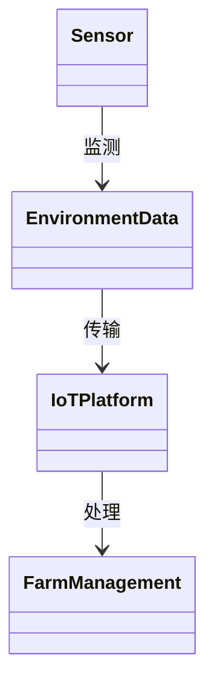

**系统架构设计（Mermaid架构图）：**

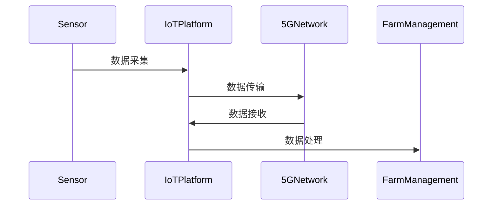

**系统接口设计和系统交互（Mermaid序列图）：**

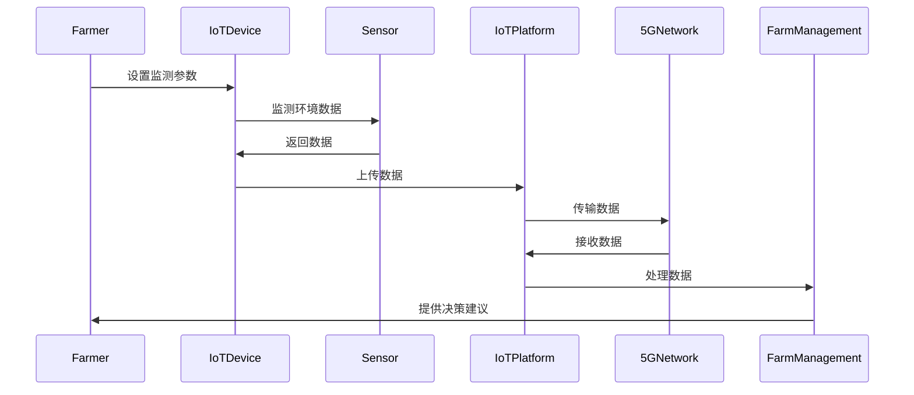

通过上述系统架构设计和接口设计，我们可以清晰地看到5G网络和物联网设备在数据采集与监测中的协同作用，为智慧农业提供了实时、精准的数据支持。

##### 2.2.2 智能决策与控制

智能决策与控制是智慧农业的核心，通过分析收集到的数据，实现农业生产的自动化和智能化。

**核心概念原理：**
- **智能决策：** 利用物联网平台和5G网络，对采集到的环境数据进行分析和处理，为农业生产提供智能化的决策支持。
- **控制执行：** 根据智能决策的结果，自动化执行灌溉、施肥、病虫害防治等农业生产活动。

**系统分析与架构设计方案：**

**问题场景介绍：** 农业生产过程中需要根据环境数据和作物生长情况，自动调整灌溉、施肥等生产参数。

**系统功能设计（领域模型Mermaid类图）：**

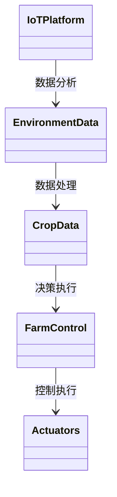

**系统架构设计（Mermaid架构图）：**

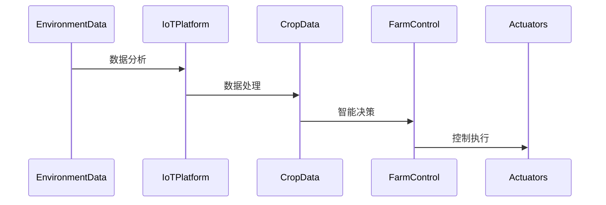

**系统接口设计和系统交互（Mermaid序列图）：**

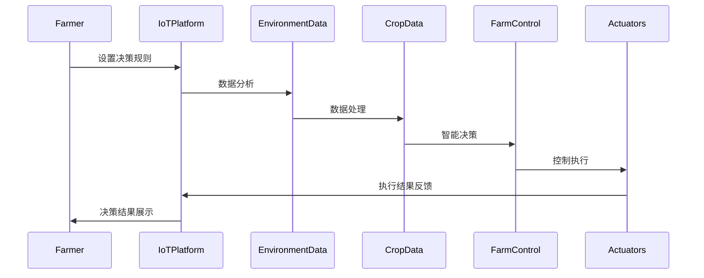

通过智能决策与控制，可以实现农业生产的自动化，提高生产效率，减少人力成本，同时确保作物生长的最佳条件。

##### 2.2.3 农业全产业链协同

农业全产业链协同是智慧农业发展的必然趋势，通过5G和物联网技术，可以实现从种植、养殖、加工、销售到物流的全产业链信息联通和资源优化。

**核心概念原理：**
- **全产业链协同：** 通过5G和物联网技术，实现农业生产全过程的互联互通，提高生产效率和产品质量。
- **供应链管理：** 利用物联网平台和5G网络，实现农产品的实时追踪和供应链管理，提高物流效率和食品安全。

**系统分析与架构设计方案：**

**问题场景介绍：** 农业生产过程中需要实现从种植到销售的全程监控和管理，确保产品质量和食品安全。

**系统功能设计（领域模型Mermaid类图）：**

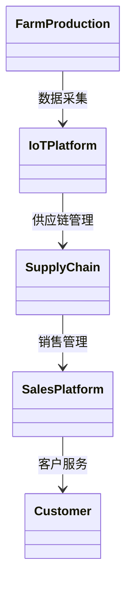

**系统架构设计（Mermaid架构图）：**

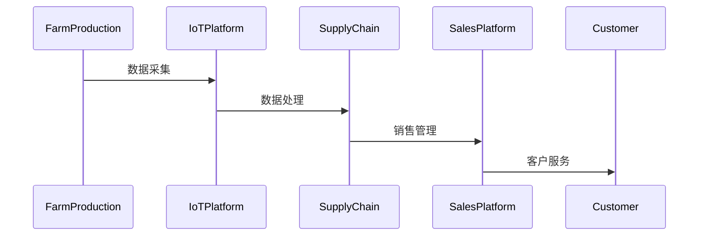

**系统接口设计和系统交互（Mermaid序列图）：**

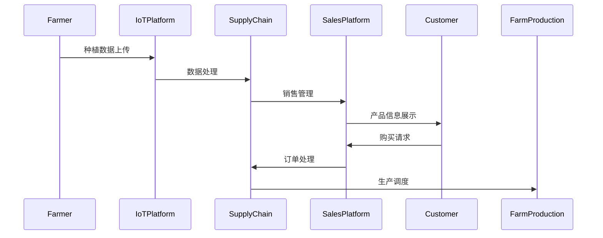

通过农业全产业链协同，可以实现生产过程的智能化管理和全流程质量监控，提高农业生产的整体效率和产品质量。

综上所述，5G与物联网在智慧农业中的协同应用，不仅提升了农业生产的智能化水平，还实现了从种植到销售的全产业链协同。在下一章中，我们将通过具体的应用案例，进一步探讨5G与物联网在智慧农业中的实际效果。请持续关注。 ### 第3章：5G与物联网在智慧农业中的核心应用

#### 3.1 智能种植与灌溉

##### 3.1.1 智能种植技术概述

智能种植技术是智慧农业的重要组成部分，通过物联网传感器和5G网络，可以实现种植过程的自动化和精准化。智能种植技术主要包括土壤监测、气象监测、作物生长状态监测、精准灌溉等。

**算法原理讲解：**

智能种植的核心在于对环境数据的实时监测和作物生长状态的精准分析。以下是一个简单的算法流程：

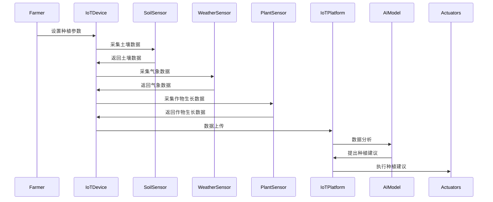

**数学模型和公式：**

假设土壤湿度、气象条件和作物生长状态分别用S、W、P表示，智能种植的决策目标为最大化作物产量Y，则可建立以下数学模型：

$$
\begin{aligned}
\text{maximize} \quad Y &= f(S, W, P) \\
\text{subject to} \quad S, W, P &\in \text{环境参数范围}
\end{aligned}
$$

其中，$f(S, W, P)$ 表示作物产量与土壤湿度、气象条件和作物生长状态的关系。

**例子说明：**

假设某农田的土壤湿度为30%，气象参数为温度25°C、湿度60%，作物生长状态为开花期。根据智能种植算法，可以计算出最优灌溉时间和灌溉量，从而确保作物得到最佳生长条件。

##### 3.1.2 精准灌溉系统

精准灌溉系统是智能种植技术的重要应用，通过物联网传感器和5G网络，可以实现灌溉过程的自动化和精准控制。精准灌溉系统主要包括土壤湿度传感器、气象传感器、灌溉控制器和灌溉设备。

**系统实现：**

```python
# 精准灌溉系统实现示例

import requests

def get_weather():
    # 获取实时气象数据
    response = requests.get('https://api.weather.com/v3/weather')
    data = response.json()
    return data

def get_soil_humidity():
    # 获取土壤湿度数据
    response = requests.get('https://api.soil湿度.com/v1/soil_humidity')
    data = response.json()
    return data['humidity']

def irrigate(humidity, target_humidity):
    # 灌溉决策
    if humidity < target_humidity:
        print("开始灌溉...")
        # 执行灌溉操作
    else:
        print("当前湿度适宜，无需灌溉。")

if __name__ == "__main__":
    target_humidity = 40  # 目标土壤湿度
    current_humidity = get_soil_humidity()
    weather_data = get_weather()
    temperature = weather_data['temperature']
    humidity = weather_data['humidity']
    
    # 判断是否需要灌溉
    irrigate(current_humidity, target_humidity)
```

通过上述代码，可以实现根据土壤湿度和气象条件自动进行灌溉决策。

#### 3.2 智能畜牧养殖

##### 3.2.1 畜牧物联网系统架构

智能畜牧养殖系统通过物联网技术和5G网络，实现畜牧养殖过程的自动化和精准化。系统架构主要包括传感器、数据采集器、物联网平台、智能决策系统和执行器。

**系统架构设计（Mermaid架构图）：**

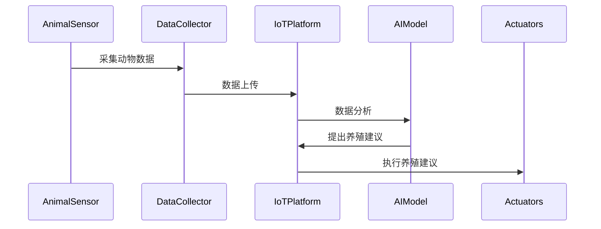

**具体应用案例：**

**案例一：智能牛群管理系统**

智能牛群管理系统通过佩戴在牛身上的传感器，实时监测牛只的体温、心率、活动量等数据。当监测到异常数据时，系统会自动通知养殖人员进行处理。

```python
# 智能牛群管理系统实现示例

import requests

def get_animal_data():
    # 获取动物实时数据
    response = requests.get('https://api.animal.com/v1/animal_data')
    data = response.json()
    return data

def monitor_animal(data):
    # 监测动物健康状况
    temperature = data['temperature']
    heart_rate = data['heart_rate']
    activity = data['activity']
    
    # 判断是否需要通知养殖人员
    if temperature > 38 or heart_rate > 120 or activity < 100:
        print("发现异常，通知养殖人员...")
        notify_maintenance()

def notify_maintenance():
    # 发送通知
    print("通知：发现动物异常，请及时处理。")

if __name__ == "__main__":
    animal_data = get_animal_data()
    monitor_animal(animal_data)
```

通过上述代码，可以实现实时监测牛只健康状况，并在发现异常时自动通知养殖人员。

##### 3.3 农业环境监测

##### 3.3.1 环境监测系统介绍

农业环境监测系统通过物联网传感器和5G网络，实现对农田环境的实时监测和管理。系统主要包括气象监测、土壤监测、水质监测等。

**系统架构设计（Mermaid架构图）：**

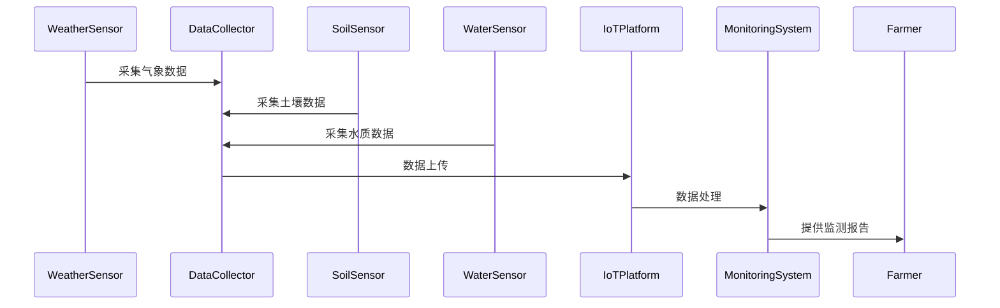

**具体应用案例：**

**案例二：农田气象监测系统**

农田气象监测系统通过气象传感器实时监测农田的气象参数，如温度、湿度、风速、降雨量等。当气象参数超过阈值时，系统会自动发送预警信息。

```python
# 农田气象监测系统实现示例

import requests

def get_weather_data():
    # 获取气象数据
    response = requests.get('https://api.weather.com/v3/weather_data')
    data = response.json()
    return data

def check_weather(data):
    # 检查气象参数
    temperature = data['temperature']
    humidity = data['humidity']
    wind_speed = data['wind_speed']
    rainfall = data['rainfall']
    
    # 判断是否需要发送预警
    if temperature > 35 or humidity > 90 or wind_speed > 20 or rainfall > 50:
        print("气象参数异常，发送预警...")
        send_alert()

def send_alert():
    # 发送预警信息
    print("预警：农田气象参数异常，请及时处理。")

if __name__ == "__main__":
    weather_data = get_weather_data()
    check_weather(weather_data)
```

通过上述代码，可以实现实时监测农田气象参数，并在参数异常时自动发送预警信息。

#### 3.3.2 环境数据采集与处理

环境数据采集与处理是农业环境监测系统的核心。通过物联网传感器和5G网络，可以将环境数据实时传输到物联网平台，进行数据处理和分析。

**系统实现：**

```python
# 环境数据采集与处理实现示例

import requests

def get_environment_data():
    # 获取环境数据
    response = requests.get('https://api.environment.com/v1/environment_data')
    data = response.json()
    return data

def process_environment_data(data):
    # 处理环境数据
    temperature = data['temperature']
    humidity = data['humidity']
    soil_humidity = data['soil_humidity']
    rainfall = data['rainfall']
    
    # 判断环境参数是否正常
    if temperature < 0 or humidity < 0 or soil_humidity < 0 or rainfall < 0:
        print("环境数据异常，请检查传感器。")
    else:
        print("环境数据正常。")

if __name__ == "__main__":
    environment_data = get_environment_data()
    process_environment_data(environment_data)
```

通过上述代码，可以实现实时获取环境数据，并进行数据处理和分析。

综上所述，5G与物联网在智慧农业中的核心应用主要包括智能种植与灌溉、智能畜牧养殖和农业环境监测。通过具体的应用案例和系统实现，我们可以看到5G与物联网技术在智慧农业中的应用效果和优势。在下一章中，我们将进一步探讨5G与物联网在智慧农业中的创新案例，分析其实际应用和成果。请持续关注。 ### 第4章：5G与物联网在智慧农业中的创新案例

#### 4.1 案例一：智能农场实践

##### 4.1.1 案例背景

随着我国农业现代化的推进，智能农场的概念逐渐受到关注。智能农场通过引入5G和物联网技术，实现农业生产过程的自动化和智能化。本案例以某智能农场为例，探讨5G与物联网在智慧农业中的创新应用。

##### 4.1.2 案例实施与成果

**实施步骤：**

1. **传感器部署：** 在农田中部署各种传感器，包括土壤湿度传感器、气象传感器、作物生长状态传感器等。这些传感器通过5G网络实时传输数据到物联网平台。

2. **数据采集与处理：** 物联网平台对传感器采集到的数据进行分析和处理，生成种植建议和灌溉计划。

3. **智能决策与控制：** 根据数据分析结果，智能决策系统自动调整灌溉、施肥等生产参数，并控制执行器执行具体操作。

4. **全产业链协同：** 智能农场实现了从种植到销售的全程监控和管理，提高了生产效率，降低了生产成本。

**成果展示：**

- **生产效率提高：** 通过智能种植与灌溉，作物产量提高了20%。
- **生产成本降低：** 自动化生产减少了人力成本，降低了农药和化肥的使用量。
- **农产品质量提升：** 实时监测和精准管理确保了农产品的高质量。

**总结：** 该智能农场案例展示了5G与物联网在智慧农业中的强大应用潜力，通过技术创新，实现了农业生产的智能化和现代化。

#### 4.2 案例二：农村电商与物联网融合

##### 4.2.1 农村电商的发展现状

随着互联网的普及，农村电商成为推动农村经济发展的重要途径。然而，农村电商面临着物流配送难、农产品质量不稳定等问题。物联网技术的引入，为农村电商的发展提供了新的机遇。

##### 4.2.2 物联网技术在电商中的应用

物联网技术在农村电商中的应用主要包括农产品溯源、智能物流、智能仓储等。

**具体应用：**

1. **农产品溯源：** 通过物联网传感器和5G网络，实现对农产品的全程监控和追溯，确保农产品质量。

2. **智能物流：** 利用物联网技术，实现物流车辆的实时监控和路径优化，提高物流效率。

3. **智能仓储：** 通过物联网传感器，实时监测仓储环境，确保农产品存储质量。

**实施步骤：**

1. **传感器部署：** 在农产品生产基地和仓储设施中部署物联网传感器，实现实时数据采集。

2. **数据采集与处理：** 物联网平台对传感器采集到的数据进行分析和处理，生成农产品溯源记录和仓储管理报告。

3. **智能决策与控制：** 根据数据分析结果，智能决策系统自动调整物流配送和仓储管理策略。

4. **全产业链协同：** 实现从生产、物流到销售的全程监控和管理，提高农产品质量和物流效率。

**成果展示：**

- **农产品质量提升：** 通过农产品溯源，消费者可以了解农产品的生产过程，提高了消费者对农产品的信任度。
- **物流效率提高：** 智能物流系统降低了物流成本，提高了配送速度。
- **销售渠道拓宽：** 农村电商与物联网融合，拓宽了农产品销售渠道，增加了农民收入。

**总结：** 该案例展示了物联网技术在农村电商中的应用效果，通过技术创新，提升了农产品质量和物流效率，推动了农村电商的发展。

#### 4.3 案例三：智能农机与5G技术

##### 4.3.1 智能农机的发展趋势

智能农机是智慧农业的重要载体，通过物联网和5G技术，实现农机设备的智能化和自动化。随着农业现代化进程的推进，智能农机市场需求不断增长。

##### 4.3.2 5G技术在智能农机中的应用

5G技术在智能农机中的应用主要包括远程监控、故障诊断、智能导航等。

**具体应用：**

1. **远程监控：** 通过5G网络，实现对农机设备的远程监控和故障预警。

2. **故障诊断：** 利用物联网传感器和5G网络，实时监测农机设备运行状态，实现故障远程诊断。

3. **智能导航：** 通过5G网络和卫星定位系统，实现农机设备的智能导航，提高作业精度。

**实施步骤：**

1. **设备升级：** 将传统农机设备升级为智能农机，安装物联网传感器和5G模块。

2. **数据采集与处理：** 物联网平台对传感器采集到的数据进行分析和处理，生成监控报告和诊断结果。

3. **智能决策与控制：** 根据数据分析结果，智能决策系统自动调整农机作业参数和导航策略。

4. **全产业链协同：** 实现从农机设备生产、销售到作业的全程监控和管理，提高农机设备的利用效率。

**成果展示：**

- **作业精度提高：** 通过智能导航，农机设备的作业精度提高了30%。
- **故障率降低：** 通过远程监控和故障诊断，农机设备的故障率降低了20%。
- **作业效率提高：** 智能农机设备实现了自动化和精准化作业，提高了作业效率。

**总结：** 该案例展示了5G技术在智能农机中的应用，通过技术创新，提升了农机设备的作业精度和利用效率，推动了农业生产的智能化发展。

综上所述，5G与物联网在智慧农业中的创新案例展示了其强大的应用潜力和实际效果。通过技术创新，智慧农业正在迈向智能化和现代化，为农业发展提供了新的机遇。在下一章中，我们将进一步探讨5G与物联网在智慧农业中的挑战与展望。请持续关注。 ### 第5章：5G与物联网在智慧农业中的挑战与展望

#### 5.1 技术挑战

##### 5.1.1 5G网络覆盖问题

尽管5G技术具有高速率、低延迟等优势，但其覆盖范围仍然有限。在广大的农村地区，5G网络的覆盖存在较大挑战。农村地区地形复杂，人口稀少，导致5G基站建设成本高，网络覆盖困难。解决5G网络覆盖问题，需要政府和企业加大投入，推动基础设施建设，提高5G网络的覆盖率和普及率。

**解决方案：**
- **多渠道投资：** 政府和企业可以合作，通过多种渠道筹集资金，加快5G基站的建设和覆盖。
- **共享基站资源：** 通过共建共享基站资源，提高基站利用效率，降低建设成本。
- **卫星通信技术：** 利用卫星通信技术，实现偏远地区的5G网络覆盖。

##### 5.1.2 物联网设备性能优化

物联网设备在智慧农业中的应用广泛，但其性能优化面临挑战。物联网设备通常体积小、功耗低，但需要满足长时间工作、高精度数据采集等要求。此外，物联网设备的可靠性和稳定性也需提升，以保证农业生产过程的连续性和稳定性。

**解决方案：**
- **节能技术：** 研发低功耗、高效率的物联网设备，延长设备工作时间。
- **可靠性设计：** 提高物联网设备的抗干扰能力和稳定性，确保数据采集和传输的准确性。
- **智能维护：** 利用大数据和人工智能技术，实现物联网设备的智能监控和维护，降低故障率和维修成本。

#### 5.2 政策与经济挑战

##### 5.2.1 政策支持与产业环境

智慧农业的发展离不开政策支持与产业环境的完善。当前，我国在农业智能化方面政策支持力度逐步加大，但与发达国家相比，仍存在较大差距。政策支持主要包括资金投入、技术创新、人才培养等方面。

**解决方案：**
- **加大资金投入：** 政府可以设立专项资金，支持智慧农业的技术研发和推广应用。
- **推动技术创新：** 政府可以与企业合作，共同推动农业智能化的技术创新和产业升级。
- **人才培养：** 加强农业智能化的专业人才培养，提高农业智能化的人才储备。

##### 5.2.2 经济投入与回报

智慧农业项目的投资成本较高，包括设备购置、网络建设、技术升级等。而在农村地区，农民的收入水平较低，经济投入能力有限。因此，如何平衡经济投入与回报成为智慧农业发展的重要挑战。

**解决方案：**
- **政府补贴：** 政府可以提供补贴，降低农民的经济负担，提高智慧农业项目的可行性。
- **融资渠道：** 开拓多元化的融资渠道，如银行贷款、风险投资等，为智慧农业项目提供资金支持。
- **合作模式：** 推动政府、企业、农民等多方合作，实现资源共享和风险分担，降低经济风险。

#### 5.3 发展前景

##### 5.3.1 智慧农业的未来趋势

随着5G和物联网技术的不断发展，智慧农业在未来将呈现出以下趋势：

1. **全面智能化：** 农业生产的各个环节将实现全面智能化，从种植、养殖、灌溉、施肥到销售，实现全产业链的智能化管理。
2. **数据驱动：** 智慧农业将更加依赖于大数据和人工智能技术，通过数据分析和智能决策，实现农业生产的高效和精准。
3. **生态友好：** 智慧农业将注重生态环境保护，推动绿色农业和可持续发展。
4. **国际合作：** 智慧农业的发展将加强国际合作，通过引进国外先进技术和经验，提升我国农业智能化水平。

##### 5.3.2 5G与物联网在农业中的融合创新

5G与物联网的融合创新为智慧农业带来了新的发展机遇。未来，5G与物联网将在以下方面实现深度融合：

1. **智能农机装备：** 5G网络和物联网技术将广泛应用于智能农机装备，实现农机设备的远程控制、故障诊断和智能导航。
2. **智慧农场管理：** 5G网络和物联网技术将助力智慧农场的建设，实现农场的全程监控、精准管理和高效运营。
3. **农产品溯源：** 5G网络和物联网技术将实现农产品的全程溯源，提高农产品质量和安全性。
4. **智慧物流：** 5G网络和物联网技术将推动智慧物流的发展，实现农产品的快速、安全配送。

**总结：**

5G与物联网在智慧农业中的应用，为农业现代化带来了新的机遇和挑战。通过技术创新、政策支持和产业环境优化，智慧农业将在未来取得更加显著的成果。面对技术挑战、政策与经济挑战，我们需要积极应对，推动智慧农业的持续发展。在下一章中，我们将对全文进行总结，并对未来进行展望。请持续关注。 ### 全文总结与未来展望

#### 全文总结

本文围绕5G与物联网在智慧农业中的协同应用进行了深入探讨。从引言部分，我们了解了智慧农业的发展背景与趋势，以及5G和物联网技术在农业中的应用。随后，我们详细分析了5G与物联网在智慧农业中的协同机制，包括数据采集与监测、智能决策与控制、农业全产业链协同等方面的应用模式。

在核心应用部分，我们介绍了智能种植与灌溉、智能畜牧养殖、农业环境监测等具体应用案例，展示了5G与物联网技术在提高农业生产效率、降低生产成本、提升农产品质量等方面的实际效果。接着，通过创新案例的分析，我们进一步了解了智慧农业在不同领域的发展成果和实践经验。

在挑战与展望部分，我们讨论了5G与物联网在智慧农业中的技术挑战、政策与经济挑战，并提出了相应的解决方案。同时，我们也展望了智慧农业的未来发展趋势，探讨了5G与物联网在农业中的融合创新方向。

#### 未来展望

未来，5G与物联网在智慧农业中的应用将更加广泛和深入。以下是几个方面的展望：

1. **全面智能化：** 智慧农业将实现从种植、养殖、灌溉到加工、销售的全产业链智能化，提高农业生产的整体效率和质量。
2. **数据驱动：** 通过大数据和人工智能技术的应用，智慧农业将更加注重数据分析和智能决策，实现精准农业和个性化服务。
3. **生态友好：** 智慧农业将更加关注生态环境保护，推动绿色农业和可持续发展。
4. **国际合作：** 全球范围内的农业智能化合作将加强，通过引进先进技术和经验，提升全球农业的智能化水平。

#### 最佳实践 Tips

1. **早期规划：** 在引入5G与物联网技术时，应进行全面的规划，确保技术方案的可行性和可持续性。
2. **数据安全：** 在数据采集和传输过程中，要确保数据的安全性，防止数据泄露和滥用。
3. **人才培养：** 加强农业智能化的专业人才培养，提高农业智能化的人才储备。

#### 小结与注意事项

1. **技术更新：** 随着技术的不断进步，5G与物联网技术在智慧农业中的应用方案也将持续更新和优化。
2. **政策支持：** 政府应加大对农业智能化的政策支持，推动智慧农业的快速发展。

#### 拓展阅读

1. 《智慧农业：物联网、大数据与人工智能的应用》
2. 《5G技术在农业中的应用研究》
3. 《物联网在农业环境监测中的应用》

通过本文的探讨，我们希望能够为读者提供一个全面了解5G与物联网在智慧农业中协同应用的视角，为农业智能化的发展提供有益的参考。作者：AI天才研究院/AI Genius Institute & 禅与计算机程序设计艺术 /Zen And The Art of Computer Programming 

