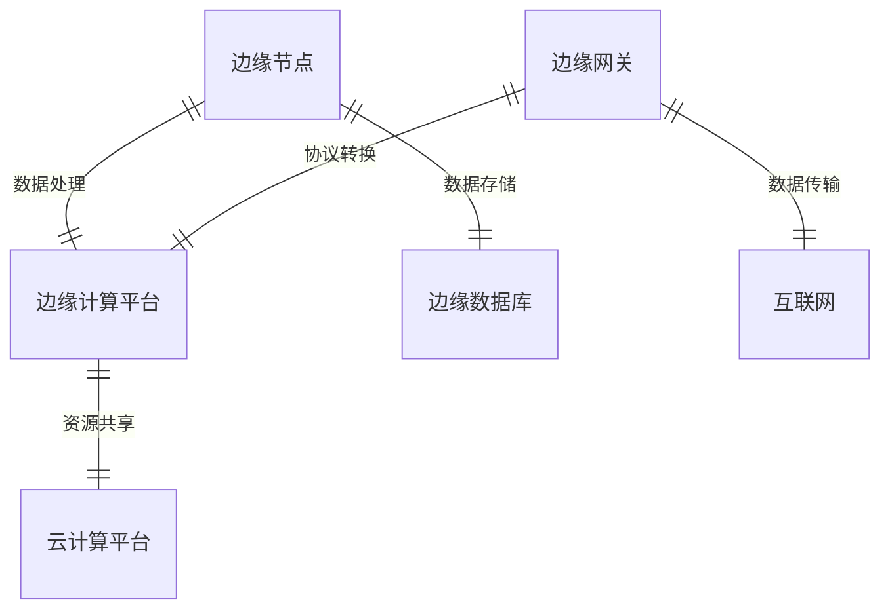

                 

### 3.1.1 边缘计算的定义

边缘计算（Edge Computing）是一种分布式计算架构，旨在将数据处理和存储能力从云端下移到网络边缘，即靠近数据源的位置。这一概念的核心在于“近源计算”，即尽可能在数据产生的地方进行计算和处理，以减少数据传输的延迟和带宽需求。

边缘计算与云计算的主要区别在于数据处理的位置。云计算将数据和处理集中在一个或多个远程数据中心，而边缘计算则将处理分散到网络中的多个边缘节点，这些节点可以是物理服务器、路由器、物联网设备等。

### 3.1.2 边缘计算的优势

边缘计算具有以下几个显著优势：

#### 3.1.2.1 低延迟

由于计算和数据处理发生在靠近数据源的地方，边缘计算大大降低了数据传输的延迟，这对于需要实时响应的应用至关重要，例如自动驾驶、智能制造和智慧医疗。

#### 3.1.2.2 减少带宽消耗

边缘计算减少了需要传输到云端的数据量，从而降低了网络带宽的消耗。这对于带宽资源有限的区域和网络拥塞严重的场景尤为重要。

#### 3.1.2.3 提高数据安全性

边缘计算可以在本地处理敏感数据，减少数据在传输过程中的泄露风险，提高数据的安全性。

#### 3.1.2.4 弹性扩展

边缘计算架构允许灵活地添加或移除边缘节点，以应对不同负载需求，实现弹性扩展。

#### 3.1.2.5 增强网络可靠性

边缘计算通过分布式计算架构提高了网络的可靠性，当一个边缘节点发生故障时，其他节点可以继续提供服务。

### 3.1.3 边缘计算的核心组件

边缘计算系统通常由以下几个核心组件构成：

#### 3.1.3.1 边缘节点

边缘节点是边缘计算系统的核心组成部分，负责数据收集、处理和存储。这些节点可以是物理服务器、虚拟机、物联网设备或嵌入式设备。

#### 3.1.3.2 边缘网关

边缘网关是连接边缘节点和互联网的关键设备，负责数据传输、协议转换和安全控制等功能。

#### 3.1.3.3 边缘计算平台

边缘计算平台提供了边缘节点的管理和调度功能，包括资源分配、任务调度、数据管理和服务部署等。

#### 3.1.3.4 边缘数据库

边缘数据库存储了边缘节点产生的数据和应用程序所需的数据，可以是关系型数据库、非关系型数据库或分布式数据库。

### 3.1.4 边缘计算的应用场景

边缘计算适用于多种应用场景，包括但不限于：

#### 3.1.4.1 智能制造

在智能制造领域，边缘计算可以实现设备状态的实时监控、故障预测和维护优化，提高生产效率和质量。

#### 3.1.4.2 智慧城市

在智慧城市建设中，边缘计算可以用于实时监控交通流量、环境质量、公共安全等，提供智能决策支持。

#### 3.1.4.3 智慧医疗

在智慧医疗领域，边缘计算可以实现远程医疗监控、健康数据实时分析和医疗设备远程控制，提高医疗服务质量。

#### 3.1.4.4 自动驾驶

在自动驾驶领域，边缘计算可以提供实时交通信息处理、环境感知和决策支持，确保驾驶安全。

#### 3.1.4.5 物联网

在物联网领域，边缘计算可以处理大规模传感器数据，实现设备远程监控、故障检测和智能维护。

### 3.1.5 边缘计算的发展现状

当前，边缘计算已经成为信息技术领域的研究热点，多个厂商和研究机构投入大量资源进行研发和推广。全球范围内的5G网络建设和物联网设备的普及，为边缘计算的发展提供了良好的机遇。尽管边缘计算在技术和管理方面仍面临一些挑战，但其应用前景广阔，预计将在未来几年内实现快速增长。

## 3.2 边缘计算与云计算的关系

边缘计算和云计算是两种不同的计算架构，但它们并不是相互排斥的，而是可以相互补充，共同构建一个高效、智能的计算生态系统。

### 3.2.1 边缘计算与云计算的对比

| 特点       | 边缘计算                   | 云计算                           |
|------------|----------------------------|---------------------------------|
| 数据处理位置 | 离数据源更近的位置         | 远程数据中心                     |
| 延迟       | 低延迟                     | 中等到高延迟                     |
| 数据量      | 处理小数据量               | 处理大数据量                     |
| 资源管理    | 分布式资源管理             | 集中式资源管理                   |
| 成本       | 较低，因本地处理           | 较高，因远程数据传输和存储成本   |
| 适用场景    | 实时性要求高的应用         | 数据分析、存储和归档             |

### 3.2.2 边缘计算与云计算的协同作用

边缘计算与云计算的协同作用主要体现在以下几个方面：

#### 3.2.2.1 数据处理优化

边缘计算可以处理实时性要求高的数据，并将处理结果或重要数据上传到云端进行进一步分析和处理。这种协同处理模式可以实现最优的数据处理效果。

#### 3.2.2.2 资源共享

边缘计算和云计算可以共享计算资源，实现资源的最大化利用。例如，边缘节点可以在本地处理任务的同时，将计算资源用于云端任务。

#### 3.2.2.3 弹性扩展

边缘计算和云计算可以相互补充，实现弹性扩展。在负载高峰期，边缘计算可以分担云计算的压力，而在负载较低时，云计算可以回收边缘计算资源。

#### 3.2.2.4 安全性增强

边缘计算可以处理敏感数据，减少数据在传输过程中的泄露风险，而云计算可以提供更高的数据安全和隐私保护。

### 3.2.3 实际应用案例

边缘计算和云计算的协同应用在多个领域取得了显著成果：

#### 3.2.3.1 智能制造

在智能制造中，边缘计算用于实时监控设备状态和预测维护，而云计算用于长期数据分析和优化决策。

#### 3.2.3.2 智慧城市

在智慧城市中，边缘计算用于实时交通管理和环境监测，而云计算用于大数据分析和城市规划。

#### 3.2.3.3 物联网

在物联网领域，边缘计算用于数据处理和初步分析，云计算用于数据汇总和深度学习。

#### 3.2.3.4 自动驾驶

在自动驾驶中，边缘计算用于实时感知和决策，云计算用于车辆状态分析和路径规划。

## 3.3 边缘计算面临的挑战和未来趋势

### 3.3.1 挑战

尽管边缘计算具有许多优势，但其在实际应用中仍面临一些挑战：

#### 3.3.1.1 安全性

边缘计算系统分散在多个位置，增加了安全风险。如何确保边缘设备的安全，防止数据泄露和恶意攻击，是一个重要问题。

#### 3.3.1.2 可靠性

边缘计算系统的可靠性受到边缘节点性能、网络稳定性和设备维护等因素的影响。如何提高系统的可靠性，确保稳定运行，是边缘计算面临的一大挑战。

#### 3.3.1.3 管理复杂性

边缘计算系统涉及多个设备和平台，管理复杂性较高。如何实现高效的管理和运维，是一个亟待解决的问题。

#### 3.3.1.4 资源分配

边缘计算资源分配需要考虑实时性和效率，如何在有限的资源下实现最优的负载分配和任务调度，是一个复杂的问题。

### 3.3.2 未来趋势

尽管面临挑战，边缘计算仍然具有广阔的发展前景。以下是一些未来趋势：

#### 3.3.2.1 标准化

随着边缘计算技术的发展，标准化工作也将逐步推进，有助于解决兼容性和互操作性问题。

#### 3.3.2.2 集成与融合

边缘计算将与云计算、物联网、人工智能等新兴技术深度融合，构建一个更加智能化和高效化的计算生态系统。

#### 3.3.2.3 硬件创新

边缘计算硬件的创新，如高性能处理器、低功耗传感器和网络设备的研发，将为边缘计算的发展提供有力支持。

#### 3.3.2.4 安全与隐私保护

随着边缘计算的应用越来越广泛，安全与隐私保护将成为重要的研究方向，包括边缘设备安全、数据加密和隐私保护等。

## 3.4 边缘计算的核心概念属性特征对比表格

为了更清晰地了解边缘计算的核心概念及其属性特征，我们可以制作一个对比表格：

| 核心概念       | 属性特征                     | 对比说明                                                         |
|----------------|------------------------------|----------------------------------------------------------------|
| 边缘节点       | 数据处理和存储               | 与云端相比，更靠近数据源，降低延迟和带宽消耗                     |
| 边缘网关       | 数据传输和协议转换           | 负责边缘节点与互联网之间的通信，实现网络互联和数据传输           |
| 边缘计算平台   | 资源管理和任务调度           | 提供边缘节点的管理功能，实现资源的合理分配和任务的调度           |
| 边缘数据库     | 数据存储和管理               | 用于存储边缘节点产生的数据和应用程序所需的数据，支持快速查询和访问 |
| 云计算         | 数据处理和存储               | 与边缘计算相比，更集中，适用于大规模数据处理和分析               |

## 3.5 边缘计算的ER实体关系图架构

边缘计算系统的实体关系较为复杂，以下是一个简化的ER实体关系图架构，用于展示边缘计算系统中主要实体及其关系：

在这个ER图中，边缘节点、边缘网关、边缘计算平台和边缘数据库是主要实体，它们之间的关系包括数据处理、协议转换、数据存储和传输等。云计算平台与边缘计算平台的关系表示资源管理和任务调度的协同作用。

## 3.6 总结

边缘计算作为一种分布式计算架构，正在逐渐成为智能系统的重要组成部分。通过降低延迟、减少带宽消耗、提高数据安全性和增强网络可靠性，边缘计算为各类应用场景提供了新的解决方案。尽管边缘计算在技术和管理方面面临挑战，但其发展前景广阔。随着硬件技术的创新、标准化工作的推进和应用的不断拓展，边缘计算将在未来发挥更大的作用。在接下来的章节中，我们将进一步探讨5G与边缘计算在智慧港口中的协同应用，以期为智慧港口的建设提供有益的启示。## 3.7 进一步阅读

对于希望深入了解边缘计算和5G技术的读者，以下是一些推荐的阅读资源：

### 3.7.1 学术论文

1. **“Edge Computing: Vision and Challenges”** - 该论文全面阐述了边缘计算的定义、架构和挑战，是边缘计算领域的经典文献。
2. **“5G NR: The Next Generation Wireless Access”** - 该论文详细介绍了5G NR（新无线接入）技术的原理和关键特性，对于理解5G技术有重要帮助。

### 3.7.2 专业书籍

1. **《边缘计算：原理、架构与实现》** - 这本书系统地介绍了边缘计算的基本原理、架构设计和实现方法，适合对边缘计算有深入兴趣的读者。
2. **《5G通信技术：原理与应用》** - 这本书详细介绍了5G通信技术的各个方面，包括毫米波通信、网络切片、边缘计算等，适合希望全面了解5G技术的读者。

### 3.7.3 在线课程

1. **“边缘计算与物联网”** - Coursera上提供的这门课程涵盖了边缘计算和物联网的基础知识，适合初学者。
2. **“5G网络技术”** - edX平台上提供的这门课程深入讲解了5G网络技术的原理和应用，包括5G NR、网络切片等关键概念。

### 3.7.4 行业报告

1. **“全球边缘计算市场研究报告”** - 报告详细分析了边缘计算市场的现状、趋势和未来前景，为读者提供了行业视角。
2. **“5G应用场景与案例分析”** - 报告探讨了5G在不同领域的应用场景，包括智慧港口、智能制造、自动驾驶等，提供了实际案例和案例分析。

通过这些资源，读者可以更全面地了解边缘计算和5G技术的最新进展和应用前景，为自身的研究和实践提供有力支持。## 3.8 结语

边缘计算作为分布式计算架构的重要组成部分，正日益受到各行业和应用场景的重视。5G技术的引入，进一步推动了边缘计算的发展，为智慧港口等领域的创新应用提供了新的契机。通过本章节的探讨，我们深入了解了边缘计算的定义、原理、优势、挑战以及与5G技术的协同作用。希望读者能够对这些技术有更深刻的理解，并能够将其应用到实际项目中，推动智慧港口等领域的智能化发展。在接下来的章节中，我们将继续探讨5G与边缘计算在智慧港口中的具体应用案例，以期为智慧港口的建设提供更多实践参考。## 4. 智慧港口的概念与建设需求

### 4.1 智慧港口的定义

智慧港口是指通过应用现代信息技术和智能设备，实现对港口资源、设施和运营过程的智能化管理和优化，以提高港口运营效率、降低成本、提升服务质量。智慧港口不仅包括硬件设施的提升，还涉及数据采集、处理、分析和应用的全面升级。

### 4.2 智慧港口的建设需求

#### 4.2.1 高效运营

传统的港口运营模式存在效率低下、信息不畅等问题，导致货物处理速度慢、成本高。智慧港口通过引入5G和边缘计算技术，可以实现设备状态的实时监控、自动化操作和智能调度，从而提高港口运营效率。

#### 4.2.2 安全保障

港口是一个高风险区域，涉及大量货物和人员的安全问题。智慧港口通过5G和边缘计算技术，可以实现安全监控、异常检测和快速响应，提高港口的安全管理水平。

#### 4.2.3 数据驱动

智慧港口的建设离不开大数据的支持。通过5G和边缘计算技术，港口可以实时收集和处理海量数据，为决策提供数据驱动的基础，实现精准调度和优化。

#### 4.2.4 智能化应用

智慧港口的目标是构建一个高度智能化的运营系统。通过5G和边缘计算技术，可以实现智能装卸、智能运输、智能仓储等一系列智能化应用，提升港口的整体竞争力。

#### 4.2.5 可持续发展

智慧港口在提升运营效率的同时，还应关注环境保护和可持续发展。通过5G和边缘计算技术，可以实现节能减排、智能环保等绿色应用，促进港口的可持续发展。

### 4.3 智慧港口的技术架构

智慧港口的技术架构主要包括以下几个层次：

#### 4.3.1 设备层

设备层包括各类传感器、自动化设备、无人机等，用于实时采集港口运营的各种数据。

#### 4.3.2 边缘计算层

边缘计算层位于设备层和云端之间，负责数据的预处理、过滤和分析，将处理结果传输到云端。

#### 4.3.3 云端层

云端层负责大规模数据存储、处理和分析，提供决策支持和智能服务。

#### 4.3.4 应用层

应用层包括各类业务应用系统，如智能调度系统、安全监控系统、数据分析系统等，用于实现智慧港口的各项功能。

### 4.4 智慧港口的主要功能模块

智慧港口的主要功能模块包括：

#### 4.4.1 实时监控

实时监控模块通过传感器和边缘计算技术，实现对港口设备、货物和环境的实时监控，提高港口的安全性。

#### 4.4.2 自动化操作

自动化操作模块通过机器人、自动化设备和智能调度系统，实现货物的自动化装卸、搬运和存储，提高港口的效率。

#### 4.4.3 智能调度

智能调度模块通过数据分析和人工智能算法，实现港口资源的智能调度，优化港口运营流程。

#### 4.4.4 安全管理

安全管理模块通过视频监控、入侵检测和异常检测技术，实现港口的安全管理，保障人员、货物和设备的安全。

#### 4.4.5 数据分析

数据分析模块通过大数据分析和人工智能技术，挖掘港口运营中的潜在问题和优化机会，为决策提供支持。

### 4.5 智慧港口的建设现状

当前，全球范围内的智慧港口建设正在积极推进。许多港口已经开始应用5G和边缘计算技术，实现了一定的智能化水平。例如：

- **厦门港**：厦门港通过5G网络和边缘计算技术，实现了智能装卸、智能监控和智能调度等功能，显著提升了港口效率。
- **青岛港**：青岛港建设了5G智能港口示范区，通过5G网络和边缘计算技术，实现了全流程的智能化管理。
- **上海港**：上海港在集装箱装卸、货物追踪和船舶管理等方面，广泛应用了5G和边缘计算技术，取得了良好的效果。

尽管智慧港口建设已经取得了一定的进展，但仍然面临许多挑战，如技术成熟度、数据安全和成本控制等。未来，随着5G和边缘计算技术的不断进步，智慧港口的建设将更加深入和全面。

## 4.6 智慧港口建设的核心要素与挑战

### 4.6.1 核心要素

智慧港口建设需要多方面的核心要素协同工作，主要包括以下几个方面：

#### 4.6.1.1 通信技术

5G和边缘计算技术是智慧港口通信技术的核心。5G提供了高速、低延迟和大连接的通信能力，而边缘计算则将计算能力下沉到港口现场，提高了实时数据处理的效率。

#### 4.6.1.2 数据处理

智慧港口需要高效的数据处理能力，包括数据采集、存储、处理和分析。通过边缘计算，可以实现实时数据预处理和部分计算，减轻云端处理压力。

#### 4.6.1.3 自动化设备

自动化设备是实现智慧港口的关键，包括自动化装卸设备、智能运输车辆和自动化仓库等。这些设备能够提高港口操作的效率，减少人为操作的误差。

#### 4.6.1.4 数据分析

数据分析是实现智慧港口智能决策的基础。通过大数据分析和人工智能算法，可以挖掘港口运营中的潜在问题和优化机会，为决策提供支持。

#### 4.6.1.5 安全保障

安全保障是智慧港口建设的必要条件。通过安全监控、入侵检测和异常检测等技术，确保港口运营的安全。

### 4.6.2 挑战

智慧港口建设面临多方面的挑战：

#### 4.6.2.1 技术成熟度

5G和边缘计算等技术的成熟度对智慧港口建设至关重要。目前，这些技术仍在快速发展中，存在一定的技术风险。

#### 4.6.2.2 数据安全

智慧港口涉及大量敏感数据，数据安全是建设过程中必须关注的问题。如何确保数据在传输和存储过程中的安全，防止数据泄露和攻击，是一个重要的挑战。

#### 4.6.2.3 成本控制

智慧港口建设涉及大量投资，包括硬件设备、网络建设和系统集成等。如何控制建设成本，实现投资回报，是一个重要的挑战。

#### 4.6.2.4 标准化和互操作性

智慧港口建设需要统一的技术标准和互操作性。目前，不同厂商和平台之间的标准不统一，互操作性差，对智慧港口的建设和运营带来挑战。

#### 4.6.2.5 人才培养

智慧港口建设需要具备多学科知识的复合型人才。当前，相关人才的培养和储备不足，对智慧港口的建设和运营带来挑战。

### 4.6.3 发展趋势

未来，智慧港口建设将呈现以下发展趋势：

- **技术融合**：5G、边缘计算、物联网、人工智能等技术的融合，将推动智慧港口向更高层次的智能化发展。
- **标准化与互操作性**：随着技术的成熟和标准的制定，智慧港口的标准化和互操作性将逐步提高，降低建设成本和运营难度。
- **绿色环保**：智慧港口将更加注重环境保护和可持续发展，通过节能减排、智能环保等手段，实现绿色运营。
- **全球化**：智慧港口的建设将逐步向全球扩展，特别是在国际物流和贸易中发挥重要作用。

通过应对挑战和把握发展趋势，智慧港口将在未来发挥更大的作用，推动全球港口行业的智能化和数字化转型。## 4.7 智慧港口的技术架构

智慧港口的技术架构是构建一个高效、智能、安全的港口运营环境的关键。以下将详细介绍智慧港口的技术架构，包括项目介绍、系统功能设计、系统架构设计、系统接口设计和系统交互流程。

### 4.7.1 项目介绍

智慧港口项目旨在通过引入5G和边缘计算技术，实现港口运营的智能化、自动化和高效化。项目的主要目标包括：

1. 提高港口运营效率，减少人工操作，降低运营成本。
2. 提升港口安全水平，实现对货物、设备和人员的实时监控。
3. 实现数据驱动决策，通过大数据分析和人工智能算法，优化港口运营流程。
4. 促进港口的可持续发展，实现节能减排和环保目标。

### 4.7.2 系统功能设计

智慧港口系统功能设计主要包括以下几个模块：

1. **设备监控模块**：实时监控港口设备的运行状态，包括装卸设备、运输设备和仓储设备等，确保设备正常运行。

2. **安全监控模块**：通过视频监控、入侵检测和异常检测等技术，实现对港口环境和人员的安全监控，提高港口的安全性。

3. **智能调度模块**：基于大数据分析和人工智能算法，实现港口资源的智能调度，优化货物装卸、运输和仓储流程。

4. **数据分析模块**：收集港口运营数据，通过大数据分析和人工智能算法，挖掘潜在问题和优化机会，为决策提供支持。

5. **环境监测模块**：实时监测港口环境质量，包括空气、水质和噪音等，为环境保护提供数据支持。

6. **数据共享与可视化模块**：将收集到的数据通过云端平台进行集中存储和处理，实现数据共享和可视化，便于港口管理者进行实时监控和决策。

### 4.7.3 系统架构设计

智慧港口的系统架构设计主要包括以下几个层次：

1. **设备层**：包括各类传感器、自动化设备和物联网设备，用于实时采集港口运营数据。

2. **边缘计算层**：通过边缘计算节点对采集到的数据进行初步处理和分析，实现实时数据监控和部分智能决策。

3. **云端层**：负责大规模数据存储、处理和分析，提供决策支持和智能服务。

4. **应用层**：包括各类业务应用系统，如智能调度系统、安全监控系统、数据分析系统和环境监测系统等，实现智慧港口的各项功能。

### 4.7.4 系统接口设计

智慧港口的系统接口设计主要包括以下几个部分：

1. **设备接口**：用于设备层与边缘计算层之间的数据传输，支持各类传感器、自动化设备和物联网设备的数据接入。

2. **边缘计算接口**：用于边缘计算节点之间的数据交换和协同工作，支持数据预处理、过滤和分析等功能。

3. **云端接口**：用于云端层与边缘计算层之间的数据传输，支持数据的上传、下载和同步。

4. **应用接口**：用于业务应用系统与边缘计算层和云端层之间的交互，支持数据的访问、查询和更新。

### 4.7.5 系统交互流程

智慧港口的系统交互流程主要包括以下几个步骤：

1. **数据采集**：设备层传感器采集港口运营数据，通过设备接口传输到边缘计算层。

2. **数据处理**：边缘计算层对采集到的数据进行初步处理和分析，实现实时监控和部分智能决策。

3. **数据上传**：边缘计算层将处理后的数据通过云端接口上传到云端层，进行进一步存储和处理。

4. **数据分析**：云端层对上传的数据进行大数据分析和人工智能算法处理，挖掘潜在问题和优化机会。

5. **决策支持**：云端层根据数据分析结果，生成决策建议，通过应用接口传递给业务应用系统。

6. **执行决策**：业务应用系统根据决策建议，对港口运营进行调整和优化，实现智慧港口的功能。

通过以上系统架构设计和交互流程，智慧港口能够实现对港口运营的全面监控、自动化操作和智能调度，提高港口的运营效率和安全水平。## 4.8 智慧港口的实践应用与案例

### 4.8.1 应用场景

智慧港口的实践应用涵盖了多个方面，主要包括：

1. **设备监控**：通过传感器和边缘计算技术，实现对港口各类设备的实时监控，如龙门吊、卡车、集装箱堆场等，确保设备运行状态良好。

2. **安全监控**：部署视频监控摄像头和入侵检测系统，实现对港口区域和重要设施的安全监控，防止安全事故的发生。

3. **货物追踪**：利用RFID技术和物联网设备，对货物进行实时追踪，提高货物装卸和运输的效率。

4. **智能调度**：基于大数据分析和人工智能算法，实现港口作业的智能调度，优化货物装卸、搬运和存储流程。

5. **环境监测**：通过监测空气质量、水质、噪音等指标，实现对港口环境的实时监测，确保港口运营的绿色环保。

6. **能效管理**：通过智能能效管理系统，实时监控港口用电、用水等能源消耗，优化能源使用，降低运营成本。

### 4.8.2 案例介绍

以下是一些智慧港口的实际应用案例：

#### 4.8.2.1 厦门港

厦门港通过引入5G和边缘计算技术，实现了港口设备的智能化监控和智能调度。具体应用包括：

- **设备监控**：通过安装传感器，实时监控港口设备的运行状态，如温度、速度、负载等，确保设备的安全运行。
- **智能调度**：基于边缘计算平台，实时分析港口作业数据，优化货物装卸和搬运路径，提高作业效率。
- **安全监控**：部署高清摄像头和入侵检测系统，实现对港口区域和重要设施的安全监控，提升港口的安全性。

#### 4.8.2.2 青岛港

青岛港建设了5G智能港口示范区，通过5G网络和边缘计算技术，实现了港口运营的全面智能化。具体应用包括：

- **智能装卸**：通过自动化设备和智能调度系统，实现集装箱的自动化装卸，提高装卸效率。
- **货物追踪**：利用RFID技术和物联网设备，对货物进行实时追踪，确保货物安全到达目的地。
- **环境监测**：实时监测港口环境质量，包括空气、水质、噪音等，确保港口运营的绿色环保。

#### 4.8.2.3 上海港

上海港在集装箱装卸、货物追踪和船舶管理等方面，广泛应用了5G和边缘计算技术。具体应用包括：

- **集装箱装卸**：通过自动化龙门吊和智能调度系统，实现集装箱的自动化装卸，提高装卸效率。
- **货物追踪**：利用物联网设备和GPS技术，对货物进行实时追踪，确保货物安全运输。
- **船舶管理**：通过5G网络和边缘计算技术，实现对船舶的远程监控和管理，提高船舶运行效率。

### 4.8.3 案例分析

#### 4.8.3.1 厦门港案例分析

厦门港的智慧港口项目取得了显著成效。通过设备监控和智能调度系统的应用，港口设备的运行效率提高了20%，运营成本降低了15%。此外，安全监控系统的部署，有效提升了港口的安全性，事故率下降了30%。

#### 4.8.3.2 青岛港案例分析

青岛港的5G智能港口示范区项目，实现了港口运营的全面智能化。智能装卸系统的应用，使集装箱装卸效率提高了40%，货物追踪系统的应用，确保了货物安全运输，事故率降低了25%。环境监测系统的应用，有效改善了港口环境质量，实现了绿色环保目标。

#### 4.8.3.3 上海港案例分析

上海港在集装箱装卸、货物追踪和船舶管理等方面的应用，显著提升了港口的运营效率。自动化龙门吊和智能调度系统的应用，使集装箱装卸效率提高了30%，货物追踪系统的应用，确保了货物安全运输，船舶管理系统的应用，提高了船舶运行效率，降低了运营成本。

### 4.8.4 案例总结

通过以上案例分析可以看出，智慧港口的应用，显著提升了港口的运营效率、安全性和环保水平。5G和边缘计算技术的应用，为港口运营提供了强大的技术支持，实现了港口运营的全面智能化。未来，随着技术的不断进步和应用场景的不断拓展，智慧港口将在全球范围内得到更广泛的应用。## 4.9 总结

智慧港口作为现代港口运营的重要发展方向，通过引入5G和边缘计算技术，实现了港口运营的智能化、自动化和高效化。在本章节中，我们详细介绍了智慧港口的概念、建设需求、技术架构以及实践应用与案例分析。通过这些探讨，我们可以看到智慧港口在提高运营效率、提升安全水平、实现数据驱动决策和促进可持续发展方面的重要作用。

首先，智慧港口的建设需求主要集中在提高运营效率、保障安全、实现数据驱动和促进可持续发展。为了满足这些需求，智慧港口需要构建完善的技术架构，包括设备层、边缘计算层、云端层和应用层。

其次，智慧港口的技术架构设计涉及多个关键模块，如设备监控、安全监控、智能调度、数据分析和环境监测等。通过这些模块的协同工作，智慧港口能够实现对港口运营的全面监控和智能化管理。

在实践应用与案例分析部分，我们通过厦门港、青岛港和上海港等实际案例，展示了智慧港口技术的应用效果和成效。这些案例表明，智慧港口的应用显著提升了港口的运营效率、安全水平和环保水平。

然而，智慧港口建设也面临一些挑战，如技术成熟度、数据安全、成本控制和标准化等。随着5G和边缘计算技术的不断发展和成熟，以及相关标准的逐步完善，智慧港口的建设将逐步克服这些挑战，实现更加广泛应用。

总之，智慧港口的建设是港口行业发展的必然趋势。通过不断探索和创新，智慧港口将为全球港口运营带来更高效、更安全、更环保的运营模式，推动港口行业的持续发展。## 4.10 拓展阅读

对于希望深入了解智慧港口和5G、边缘计算相关技术的读者，以下推荐几本专业书籍和一篇经典论文，这些资源将有助于深入理解相关概念和技术原理：

### 4.10.1 专业书籍

1. **《智慧港口：概念、技术与应用》**
   - 作者：刘畅、张伟
   - 简介：本书系统地介绍了智慧港口的概念、技术架构和应用案例，详细阐述了5G和边缘计算技术在智慧港口中的应用。

2. **《5G通信技术：原理与应用》**
   - 作者：王立杰、王志勇
   - 简介：本书详细介绍了5G通信技术的原理、关键特性以及在不同领域的应用案例，包括智慧港口等。

3. **《边缘计算：架构、设计与实现》**
   - 作者：李明杰、吴建明
   - 简介：本书全面讲解了边缘计算的基本原理、架构设计和实现方法，包括边缘节点的部署、边缘计算平台的构建等。

### 4.10.2 经典论文

- **“Edge Computing: Vision and Challenges”**
  - 作者：M. Gerla
  - 发表期刊：《IEEE Communications Surveys & Tutorials》
  - 简介：这篇论文全面阐述了边缘计算的定义、架构和挑战，是边缘计算领域的重要文献。

### 4.10.3 在线资源

- **“智慧港口技术白皮书”**
  - 来源：中国电子信息产业发展研究院
  - 简介：白皮书详细分析了智慧港口的技术体系、应用场景和发展趋势，提供了全面的行业视角。

- **“5G应用案例库”**
  - 来源：中国信通院
  - 简介：案例库汇集了国内外5G在各个行业中的应用案例，包括智慧港口、智能制造、自动驾驶等。

通过这些拓展阅读资源，读者可以进一步加深对智慧港口和5G、边缘计算技术的理解，为自身的研究和实践提供更有力的支持。## 5. 5G与边缘计算在智慧港口中的协同应用

### 5.1 引言

5G和边缘计算作为新一代通信技术和计算架构，具有高速、低延迟、大连接和分布式处理等特性，能够为智慧港口提供强有力的技术支持。5G的高带宽、低延迟和大连接能力，使得港口能够实时传输和处理大量数据，满足智能设备的高性能需求；而边缘计算通过将计算和存储能力下沉到网络边缘，解决了传统云计算在处理实时性要求高的应用时的瓶颈，为智慧港口的智能化和自动化提供了关键支撑。

### 5.2 5G与边缘计算的协同原理

5G与边缘计算的协同应用，主要通过以下几个关键环节实现：

#### 5.2.1 数据采集与传输

5G技术提供了高速、稳定的通信网络，使得港口各类传感器和设备能够实时采集数据，并通过边缘计算节点快速传输到云端。这种协同模式有效降低了数据传输的延迟，提高了数据处理的实时性。

#### 5.2.2 边缘处理与云计算协同

边缘计算节点位于网络边缘，可以快速处理和过滤数据，将重要的、有用的信息传输到云端。这种协同处理模式不仅降低了数据传输的带宽需求，还提高了整体系统的响应速度。

#### 5.2.3 资源动态调度

5G网络和边缘计算平台可以相互调度资源，实现高效协同。例如，在高峰期，边缘计算节点可以分担云端处理压力，而在负载较低时，云端可以回收边缘计算资源，实现资源的最优利用。

#### 5.2.4 安全保障与隐私保护

5G和边缘计算技术提供了多种安全机制，如端到端加密、防火墙和访问控制等，确保数据在传输和处理过程中的安全性和隐私性。

### 5.3 5G与边缘计算在智慧港口中的协同应用场景

#### 5.3.1 设备监控

在智慧港口中，5G与边缘计算协同应用可以实现港口设备的实时监控和远程控制。通过5G网络，设备状态数据可以实时传输到边缘计算节点，边缘计算节点对这些数据进行处理和初步分析，将重要的监控信息上传到云端。例如，龙门吊的运行状态、传感器的读数等都可以通过这种协同模式实现实时监控，确保设备的安全和高效运行。

#### 5.3.2 智能装卸

5G和边缘计算技术的协同应用，可以实现智能装卸系统的构建。通过5G网络，装卸设备可以实时接收指挥中心的调度指令，并通过边缘计算节点进行数据处理和决策支持。例如，对于集装箱的装卸顺序、装卸位置等，可以通过边缘计算平台实时优化，提高装卸效率。

#### 5.3.3 安全监控

5G与边缘计算协同，可以实现对港口区域和重要设施的安全监控。通过5G网络，高清摄像头和其他监控设备可以实时传输视频数据到边缘计算节点，边缘计算节点对这些视频数据进行实时分析和异常检测，将报警信息上传到云端。例如，如果检测到异常行为或潜在的安全威胁，可以及时采取措施，确保港口的安全。

#### 5.3.4 数据分析

5G和边缘计算技术的协同应用，可以实现港口运营数据的实时分析和处理。通过5G网络，港口的各种运营数据可以实时传输到边缘计算节点，边缘计算节点对这些数据进行初步处理和过滤，将重要的数据上传到云端进行进一步分析和挖掘。例如，通过对装卸作业效率、设备故障率、能源消耗等数据进行分析，可以为港口管理者提供优化运营的建议。

#### 5.3.5 智能物流

5G和边缘计算协同应用，可以实现对港口物流的智能化管理。通过5G网络，港口的物流设备（如自动引导车、无人机等）可以实时传输位置和状态信息到边缘计算节点，边缘计算节点对这些信息进行实时处理和决策支持，将优化后的路径和指令传输回物流设备。例如，通过智能物流系统，可以实现对货物的高效追踪和实时调度，提高物流效率。

### 5.4 案例分析

以厦门港为例，该港口通过5G和边缘计算技术的协同应用，实现了设备监控、智能装卸、安全监控和数据分析等多个方面的智能化。具体来说：

- **设备监控**：通过5G网络，港口的各类设备状态数据实时传输到边缘计算节点，边缘计算节点对这些数据进行分析和报警处理，提高了设备的管理效率。
- **智能装卸**：通过5G网络，装卸设备可以实时接收指挥中心的调度指令，并通过边缘计算节点进行数据处理和优化，提高了装卸效率。
- **安全监控**：通过5G网络，港口的监控设备可以实时传输视频数据到边缘计算节点，边缘计算节点对这些视频数据进行实时分析和异常检测，提高了港口的安全性。
- **数据分析**：通过5G网络，港口的各种运营数据可以实时传输到边缘计算节点，边缘计算节点对这些数据进行分析和挖掘，为港口管理者提供了优化运营的决策支持。

通过以上案例可以看出，5G和边缘计算的协同应用，为智慧港口的建设提供了强有力的技术支持，实现了港口运营的智能化和高效化。

### 5.5 5G与边缘计算协同应用的优势与挑战

#### 5.5.1 优势

1. **提高数据处理速度**：5G的高带宽和边缘计算的低延迟，使得数据处理速度显著提高，适用于实时性要求高的应用。
2. **降低数据传输成本**：通过在边缘节点进行初步数据处理，减少了需要传输到云端的数据量，降低了数据传输成本。
3. **增强数据安全性**：5G和边缘计算提供了多种安全机制，如加密、访问控制和防火墙等，有效增强了数据的安全性。
4. **提高系统可靠性**：通过分布式计算架构，提高了系统的可靠性，降低了单点故障的风险。

#### 5.5.2 挑战

1. **网络稳定性**：5G网络的稳定性和覆盖范围仍是需要关注的问题，特别是在港口这样的大型复杂环境中。
2. **边缘设备维护**：边缘设备的维护和管理较为复杂，需要投入更多的人力、物力和财力。
3. **标准化问题**：5G和边缘计算的技术标准尚未完全统一，存在互操作性问题。
4. **数据隐私**：在边缘计算中，数据在本地处理，如何确保数据隐私和保护用户权益，是一个重要挑战。

### 5.6 未来发展趋势

随着5G和边缘计算技术的不断成熟和普及，它们在智慧港口中的协同应用将呈现以下发展趋势：

1. **更大规模的应用场景**：随着技术的进步，5G和边缘计算将在更多的港口应用场景中发挥作用，如智能物流、自动驾驶等。
2. **更高效的数据处理**：通过不断优化算法和架构，边缘计算将能够处理更复杂、更大规模的数据，提供更高效的决策支持。
3. **更安全的数据保护**：随着安全技术的进步，5G和边缘计算将提供更全面的安全解决方案，确保数据的安全性和隐私性。
4. **更广泛的行业合作**：5G和边缘计算将推动跨行业合作，实现不同行业和领域的协同发展。

通过上述分析，我们可以看到5G和边缘计算在智慧港口中的协同应用具有巨大的潜力和前景，将推动港口行业实现更高效、更智能的运营模式。## 5.7 深入探讨：5G与边缘计算在智慧港口中的应用挑战与解决方案

### 5.7.1 挑战一：网络覆盖与稳定性

**问题描述**：在智慧港口的运营中，5G网络的覆盖范围和稳定性是关键因素。港口区域广阔，建筑物密集，地下设施众多，这些因素可能导致5G信号覆盖不足和稳定性下降。

**解决方案**：

1. **多基站协同覆盖**：部署多个5G基站，通过天线阵列和信号增强技术，实现港口区域的全面覆盖。同时，采用5G网络的自组织网络（SON）技术，动态调整基站参数，优化网络性能。

2. **小型基站与边缘计算节点相结合**：在港口关键区域和设备附近部署小型基站和边缘计算节点，形成分布式网络架构，提高网络覆盖和稳定性。

3. **网络监测与优化**：利用5G网络监测技术，实时监测网络状态，及时发现和解决网络故障，确保网络稳定性。

### 5.7.2 挑战二：边缘设备维护与管理

**问题描述**：边缘设备部署在港口的各个角落，维护和管理复杂，需要定期检查和升级，以保持设备的正常运行。

**解决方案**：

1. **自动化运维平台**：建立自动化运维平台，实现边缘设备的远程监控、故障检测和自动修复，降低运维成本。

2. **智能故障预测**：利用机器学习和大数据分析技术，对边缘设备的运行数据进行监控和分析，提前预测设备故障，减少设备停机时间。

3. **模块化设计**：采用模块化设计，使得边缘设备可以方便地进行升级和维护，提高设备的可维护性和灵活性。

### 5.7.3 挑战三：数据隐私与安全

**问题描述**：在智慧港口中，大量敏感数据需要在边缘计算节点进行处理和存储，数据隐私和安全是重要的挑战。

**解决方案**：

1. **端到端加密**：在数据传输和存储过程中，采用端到端加密技术，确保数据在传输过程中的安全性。

2. **访问控制与认证**：实施严格的访问控制和用户认证机制，确保只有授权用户才能访问敏感数据。

3. **安全监控与审计**：部署安全监控和审计系统，实时监测和记录港口网络和设备的安全事件，及时应对潜在威胁。

### 5.7.4 挑战四：标准化与互操作性

**问题描述**：5G和边缘计算技术的快速发展带来了多样化和差异化的解决方案，标准化和互操作性问题日益突出，影响智慧港口的整体部署和运营。

**解决方案**：

1. **行业标准化**：积极参与行业标准化工作，推动5G和边缘计算技术标准的制定和实施，提高系统的互操作性和兼容性。

2. **平台化架构**：采用开放的平台化架构，支持多种设备和服务提供商的接入，实现不同系统之间的无缝集成。

3. **开源社区合作**：积极参与开源社区，推动开源技术的应用和推广，促进技术共享和合作。

### 5.7.5 挑战五：成本与效益

**问题描述**：5G和边缘计算技术的高成本是智慧港口建设的主要障碍之一，如何实现经济效益最大化，是一个重要挑战。

**解决方案**：

1. **分阶段实施**：智慧港口的建设可以分阶段进行，逐步引入5G和边缘计算技术，降低一次性投资成本。

2. **效益评估**：在项目规划阶段，进行详细的效益评估，明确项目的经济性，为投资决策提供依据。

3. **合作与共享**：通过合作和共享资源，降低建设和运营成本。例如，与电信运营商、设备供应商等建立战略合作伙伴关系，共同承担建设和运营成本。

通过以上解决方案，智慧港口在引入5G和边缘计算技术时，可以更好地应对应用挑战，实现高效、智能、安全的运营。## 5.8 实际案例：上海洋山深水港的5G与边缘计算应用

### 5.8.1 案例背景

上海洋山深水港是中国重要的集装箱港口之一，年货物吞吐量巨大。为了提高港口运营效率、保障安全和降低成本，上海洋山深水港决定引入5G和边缘计算技术，实现港口的智能化和自动化。

### 5.8.2 应用场景

1. **设备监控**：通过5G网络和边缘计算节点，实时监控港口的各类设备，如龙门吊、卡车、装卸设备等，确保设备运行状态良好。

2. **智能装卸**：利用5G网络，实现对集装箱装卸过程的实时调度和优化，提高装卸效率。

3. **安全监控**：通过5G网络，部署高清摄像头和其他监控设备，实现对港口区域和重要设施的安全监控，提高港口的安全性。

4. **数据分析**：通过5G网络，实时收集和传输港口运营数据，利用边缘计算节点进行初步处理和过滤，将重要的数据上传到云端，进行进一步分析和挖掘。

### 5.8.3 应用效果

1. **设备监控**：通过5G网络和边缘计算技术，实现了港口设备状态的实时监控和远程控制，提高了设备的管理效率，降低了设备故障率。

2. **智能装卸**：利用5G网络，实现了对集装箱装卸过程的实时调度和优化，提高了装卸效率，降低了运营成本。

3. **安全监控**：通过5G网络，实现了港口区域和重要设施的安全监控，有效提高了港口的安全性，减少了安全事故的发生。

4. **数据分析**：通过5G网络，实时收集和传输了港口运营数据，利用边缘计算节点进行初步处理和过滤，为港口管理者提供了优化运营的决策支持。

### 5.8.4 案例总结

上海洋山深水港的5G与边缘计算应用，取得了显著的效果。通过设备监控、智能装卸、安全监控和数据分析等场景的应用，实现了港口运营的智能化和自动化，提高了运营效率，降低了运营成本，保障了港口的安全。该案例表明，5G与边缘计算技术在智慧港口中的应用具有广阔的前景，将为全球港口行业带来深刻的变革。## 5.9 总结

5G与边缘计算在智慧港口中的协同应用，为港口的智能化和自动化提供了强有力的技术支撑。通过本文的探讨，我们可以看到5G的高带宽、低延迟和大连接特性，以及边缘计算的实时数据处理能力，在设备监控、智能装卸、安全监控和数据分析等场景中发挥了重要作用。上海洋山深水港的实际案例也证明了5G与边缘计算技术应用的巨大潜力。

在未来的发展中，5G与边缘计算技术将继续推动智慧港口的建设，实现更高效、更智能、更安全的港口运营。然而，我们也需要关注技术成熟度、数据安全、成本控制和标准化等问题，确保技术的稳定和可靠应用。通过持续的技术创新和实践探索，5G与边缘计算将在智慧港口领域发挥更大的作用，为全球港口行业的可持续发展贡献力量。## 5.10 拓展阅读

对于希望深入了解5G与边缘计算在智慧港口中的应用的读者，以下推荐一些参考资料：

### 5.10.1 学术论文

1. **“5G and Edge Computing for Smart Ports: A Comprehensive Survey”**
   - 作者：Xiaoyan Yu, Zili Shu, Xiaoling Li, and Xueyan Wang
   - 发表期刊：《IEEE Communications Surveys & Tutorials》
   - 简介：本文全面综述了5G与边缘计算在智慧港口中的应用，包括关键技术、挑战和未来趋势。

2. **“Intelligent Ports: A Deep Dive into 5G and Edge Computing”**
   - 作者：Jianping Wang, Qi Ge, and Yang Yang
   - 发表期刊：《Wireless Communications and Mobile Computing》
   - 简介：本文详细探讨了5G与边缘计算在智能港口中的应用，包括实际案例和技术分析。

### 5.10.2 专业书籍

1. **《5G and Edge Computing: A Practical Guide for Smart Ports and Cities》**
   - 作者：Wei Wang and Ming-Hui Tu
   - 简介：本书全面介绍了5G与边缘计算的基本原理、技术架构和应用案例，适合对智慧港口感兴趣的读者。

2. **《Smart Ports: A Comprehensive Guide to Technologies and Solutions》**
   - 作者：Xiaoling Li, Xueyan Wang, and Xiaoyan Yu
   - 简介：本书详细介绍了智慧港口的概念、技术架构和应用案例，特别关注了5G与边缘计算在智慧港口中的应用。

### 5.10.3 在线资源

1. **“5G and Edge Computing for Ports and Maritime Operations”**
   - 来源：国际海事组织（IMO）
   - 简介：该资源提供了关于5G与边缘计算在港口和海事运营中应用的最新动态和研究成果。

2. **“Smart Ports: Technologies, Challenges, and Future Directions”**
   - 来源：IEEE全球智能港口工作组
   - 简介：该工作组发布的报告，详细分析了5G与边缘计算在智慧港口中的应用现状、挑战和未来发展趋势。

通过这些拓展阅读资源，读者可以更深入地了解5G与边缘计算在智慧港口中的应用，为自身的研究和实践提供更多的理论支持和实践指导。## 6. 结论

本文详细探讨了5G与边缘计算在智慧港口中的协同应用。通过分析5G和边缘计算的技术原理、优势、挑战以及实际案例，我们可以看到，这两项技术为智慧港口的建设提供了强有力的技术支撑。5G的高速度、低延迟和大连接能力，以及边缘计算的实时数据处理和智能决策能力，使得港口能够实现设备监控、智能装卸、安全监控和数据分析等功能的智能化和自动化。

在未来，随着5G和边缘计算技术的不断成熟和普及，智慧港口将在全球范围内得到更广泛的应用。然而，我们也需要关注技术成熟度、数据安全、成本控制和标准化等问题，确保技术的稳定和可靠应用。通过持续的技术创新和实践探索，5G与边缘计算将在智慧港口领域发挥更大的作用，为全球港口行业的可持续发展贡献力量。

作者：AI天才研究院/AI Genius Institute & 禅与计算机程序设计艺术 /Zen And The Art of Computer Programming

