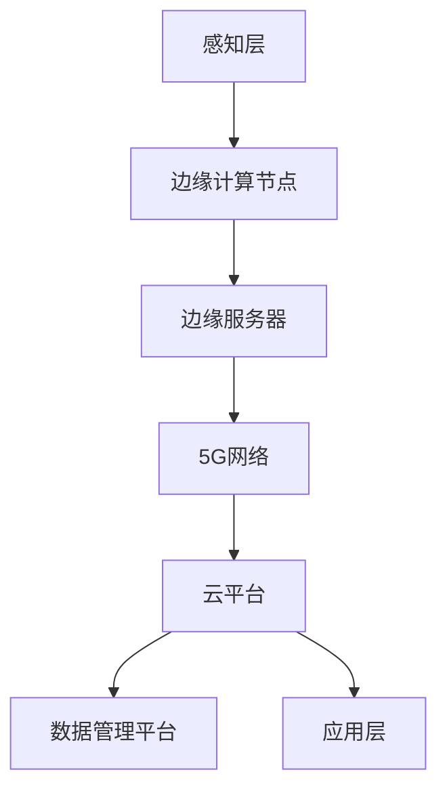
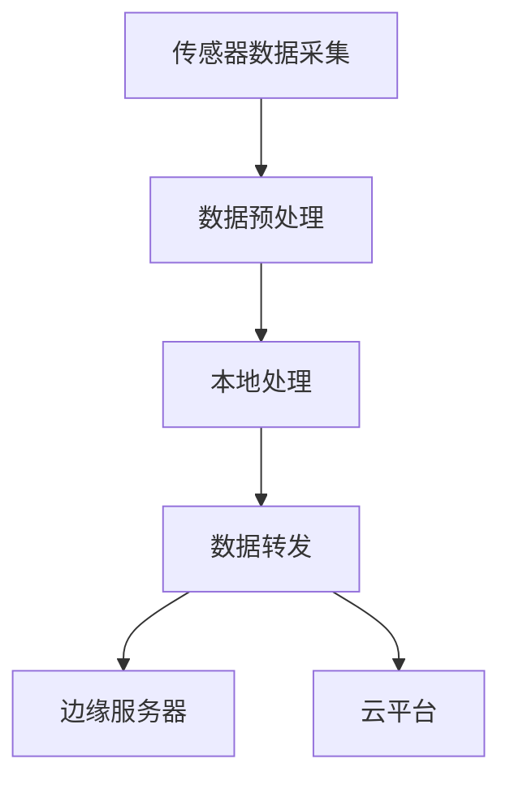
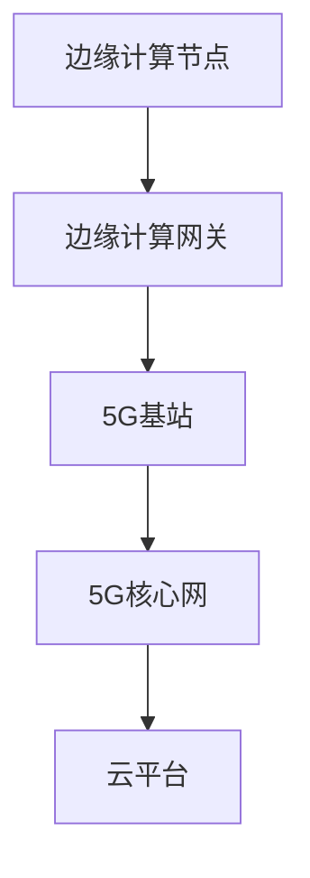

                 

### 引言

随着信息技术的飞速发展，制造业正经历着一场前所未有的变革。5G技术和边缘计算作为新一代信息技术的重要组成部分，正在深刻改变着传统制造业的生产模式和效率。智能工厂作为这一变革的先锋，通过集成5G和边缘计算技术，实现了更高效、更灵活、更智能的生产流程。

本文将围绕“5G与边缘计算在智能工厂中的协同应用”这一主题，进行深入探讨。文章将首先介绍5G和边缘计算的基本概念、发展背景以及它们在智能工厂中的应用场景。随后，文章将详细分析5G技术的核心原理、边缘计算架构的设计与实现，以及这两者在智能工厂中的协同作用。此外，文章还将通过实际案例，展示5G与边缘计算在智能工厂中的具体应用，探讨其中的挑战和解决方案。最后，文章将展望5G与边缘计算在智能工厂领域的未来发展趋势和机遇。

通过本文的阅读，读者将全面了解5G和边缘计算在智能工厂中的协同应用，掌握相关技术原理和实际应用，为智能工厂的建设提供理论支持和实践指导。

### 关键词

- 5G技术
- 边缘计算
- 智能工厂
- 协同应用
- 网络性能
- 数据处理
- 实时通信
- 设备互联
- 系统架构

### 摘要

本文旨在探讨5G与边缘计算在智能工厂中的协同应用，分析其背景、核心概念、技术原理及实际应用。首先，文章介绍了5G技术和边缘计算的发展背景，阐述了智能工厂面临的问题和需求。接着，详细探讨了5G的核心原理和边缘计算架构，分析了它们在智能工厂中的应用模式。通过实际案例，文章展示了5G与边缘计算在智能工厂中的具体应用，讨论了其中的挑战和解决方案。最后，文章展望了5G与边缘计算在智能工厂领域的未来发展趋势和机遇，为智能工厂的建设提供了理论和实践指导。

## 第一部分: 背景介绍与概念基础

### 第1章: 5G与边缘计算概述

#### 1.1.1 5G技术背景

第五代移动通信技术（5G）作为新一代通信技术，自2019年在韩国正式商用以来，迅速在全球范围内推广。5G技术的出现，标志着移动通信技术进入了一个全新的阶段，其核心目标是通过更高的网络速度、更低的延迟和更大的连接容量，满足日益增长的数据需求。

**发展历程：**
- **2012年：** 国际电信联盟（ITU）发布了5G的愿景和指标，包括峰值速率达到Gbps级别、时延降低到1ms以下、每平方米连接数达到1000个等。
- **2016年：** 3GPP启动了5G标准的制定工作，分为NR（新无线电）和NR-related access（与NR相关的接入）两部分。
- **2018年：** 3GPP正式发布了5G NR标准，随后在2019年完成了5G NR和NR-related access的合并标准。
- **2019年：** 韩国成为全球首个商用5G的国家，随后日本、美国、中国等国家相继推出5G服务。

**关键特性：**
- **高速率：** 5G的峰值速率可达10Gbps，比4G快100倍，能够支持高清视频流、虚拟现实（VR）和增强现实（AR）等高带宽应用。
- **低延迟：** 5G的时延显著降低，通常在1ms以下，为实时控制、自动驾驶等低延迟应用提供了可能。
- **大连接：** 5G能够支持每平方米超过1000个连接，极大提高了物联网（IoT）设备的连接密度。

**应用领域：**
- **移动宽带：** 提供高速移动网络，支持高清视频、VR/AR等应用。
- **工业互联网：** 支持工业设备的高效连接与控制，实现智能制造。
- **自动驾驶：** 提供低延迟、高可靠性的通信服务，支持自动驾驶汽车。
- **智慧城市：** 支持智能交通、环境监测、安全监控等应用，提升城市管理效率。

#### 1.1.2 边缘计算的概念与原理

边缘计算（Edge Computing）是一种分布式计算架构，通过在数据源附近处理数据，减少数据传输距离，提高数据处理速度和系统响应时间。边缘计算的核心思想是将计算能力从集中式数据中心推向网络边缘，即靠近数据源的地方。

**定义：**
边缘计算是指将数据处理、分析和存储等计算任务从云端或数据中心转移到网络边缘的设备或服务器上，实现数据在本地快速处理和分析。

**原理：**
- **数据靠近处理：** 边缘计算通过在设备本地处理数据，减少数据传输到云端的延迟，提高系统响应速度。
- **资源复用：** 边缘计算利用边缘设备上的计算资源，实现资源的高效利用，减少对中心化云服务的依赖。
- **增强安全性：** 边缘计算通过本地数据处理，降低了数据在传输过程中的风险，提高了数据安全性。

**关键要素：**
- **边缘节点：** 包括智能设备、传感器、网关等，负责数据收集和初步处理。
- **边缘服务器：** 负责处理边缘节点传输来的数据，执行复杂计算任务。
- **云平台：** 提供云存储、云计算服务，与边缘节点和边缘服务器协同工作。

**应用场景：**
- **智能工厂：** 通过边缘计算实现设备实时监控、故障预测和远程控制，提高生产效率。
- **智慧城市：** 通过边缘计算实现实时交通管理、环境监测和应急响应。
- **远程医疗：** 通过边缘计算实现实时医疗数据分析和远程手术指导，提升医疗服务质量。
- **农业监测：** 通过边缘计算实现作物生长监测、病虫害预测和智能灌溉。

#### 1.1.3 智能工厂的挑战与需求

智能工厂作为制造业转型的重要方向，通过引入信息技术和自动化设备，实现了生产过程的智能化、自动化和高效化。然而，智能工厂在发展过程中也面临着一系列挑战和需求。

**挑战：**
- **数据处理能力：** 智能工厂部署了大量传感器和设备，产生了海量的数据。如何高效处理这些数据，实现实时分析和决策，成为一大挑战。
- **网络延迟：** 智能工厂中的设备通常需要进行实时控制，网络延迟会影响生产效率和设备安全。
- **系统可靠性：** 智能工厂系统需要高可靠性和稳定性，任何系统故障都可能造成生产停滞和设备损坏。
- **设备互联：** 智能工厂中设备种类繁多，如何实现设备之间的无缝互联，是智能工厂建设的一个重要问题。

**需求：**
- **实时性：** 智能工厂需要实时获取设备状态和生产数据，进行实时分析和决策。
- **高带宽：** 智能工厂需要高带宽的网络支持，以满足大量数据传输需求。
- **低延迟：** 智能工厂中的设备需要低延迟的网络通信，以确保实时控制和响应。
- **可扩展性：** 智能工厂系统需要具备良好的可扩展性，以适应生产规模的变化和新技术的发展。

#### 1.1.4 5G与边缘计算在智能工厂中的协同应用

5G和边缘计算作为新一代信息技术，在智能工厂中具有广泛的应用前景。通过两者的协同应用，可以有效解决智能工厂面临的数据处理、网络延迟和设备互联等问题。

**协同应用模式：**
- **边缘计算 + 5G：** 通过边缘计算将部分数据处理任务转移到边缘节点，利用5G网络实现数据的高速传输和实时通信。
- **5G + 云计算：** 通过5G网络连接边缘节点和云计算平台，实现数据在边缘和云端之间的协同处理。

**应用场景：**
- **设备监控与故障预测：** 利用5G网络实现设备实时监控，通过边缘计算进行数据分析和故障预测，提高设备运行效率和安全性。
- **远程控制与运维：** 利用5G网络实现远程设备控制，通过边缘计算实现设备的故障诊断和运维管理，降低维护成本。
- **数据采集与处理：** 通过边缘计算实现设备数据的本地预处理，利用5G网络将关键数据传输到云端进行分析和存储，提高数据处理效率。
- **智能决策与控制：** 通过边缘计算实现设备状态和数据的实时分析，结合5G网络的低延迟特性，实现智能决策和实时控制。

**协同作用：**
- **提高数据处理速度：** 通过边缘计算实现数据本地处理，减少数据传输延迟，提高数据处理速度。
- **增强网络可靠性：** 通过5G网络实现设备之间的实时通信，提高网络可靠性，降低故障率。
- **降低系统成本：** 通过边缘计算实现部分数据处理任务在边缘节点完成，减少对中心化云服务的依赖，降低系统成本。

综上所述，5G和边缘计算在智能工厂中的协同应用，将为智能工厂的发展带来新的机遇和挑战。通过深入研究和应用，可以有效提升智能工厂的生产效率、安全性和灵活性，推动制造业的智能化转型。

## 第2章: 5G核心原理详解

### 2.1.1 5G的关键特性

5G技术作为新一代移动通信技术，相较于4G具有显著的优势和关键特性，这些特性使其在智能工厂中的应用成为可能。以下是5G的关键特性：

**1. 高速率**
5G的峰值速率可达到10Gbps，比4G快了100倍。这一高速率能够支持高清视频流、虚拟现实（VR）和增强现实（AR）等高带宽应用，满足智能工厂中大量数据传输的需求。

**2. 低延迟**
5G的端到端时延通常在1ms以下，显著降低了通信延迟。这对于智能工厂中的实时控制、设备交互和远程操作至关重要，有助于提升生产效率和设备响应速度。

**3. 大连接**
5G支持每平方米超过1000个连接，能够实现大规模设备互联，满足智能工厂中各类传感器、执行器和机器人的通信需求。

**4. 网络切片**
5G的网络切片技术允许根据不同应用的需求，创建多个虚拟网络，从而实现资源的灵活分配和高效的资源利用。这在智能工厂中可以针对不同的生产任务和设备，提供定制化的网络服务。

**5. 车联网**
5G支持车联网（V2X），能够实现车辆与车辆、车辆与基础设施之间的实时通信，为智能工厂中的物流管理、自动驾驶车辆等提供技术支持。

**6. 网络安全**
5G引入了更多的安全特性和机制，如端到端加密、网络切片隔离等，提高了数据传输的安全性，确保智能工厂中敏感数据的安全保护。

### 2.1.2 5G网络架构

5G网络架构相较于4G有较大的改进和扩展，主要包括以下几个层次：

**1. 无线接入网（RAN）**
无线接入网是5G网络的核心部分，包括基站（gNB）、用户设备（UE）和无线接入控制器（RRC）。5G引入了大规模MIMO（多输入多输出）和波束成形技术，提高了无线网络的频谱效率和覆盖范围。

**2. 核心网（CN）**
5G的核心网包括控制平面（UPF）和数据平面（PGW），负责处理用户数据的传输和控制。5G核心网采用了服务化架构（SA），通过容器化和虚拟化技术，实现了网络的灵活扩展和高效管理。

**3. 边缘计算网关（EN）**
边缘计算网关是5G网络架构中的重要组成部分，位于无线接入网和核心网之间，负责处理边缘节点的数据和计算任务。边缘计算网关通过边缘计算架构，实现了数据的本地处理和实时分析，降低了延迟，提高了系统响应速度。

**4. 管理与 orchestration（AMF）**
5G引入了管理与 orchestration（AMF）功能，负责网络资源的动态分配和优化。AMF通过与边缘计算网关和核心网的协同工作，实现了网络服务的灵活调度和高效利用。

### 2.1.3 5G在网络性能提升中的作用

5G技术通过其关键特性和网络架构的优化，显著提升了网络性能，这对于智能工厂的发展具有重要意义：

**1. 提高生产效率**
5G的低延迟和高速率特性，使得智能工厂中的设备能够实现实时通信和高效协同工作，提高了生产效率和设备响应速度。例如，在自动化生产线上，5G网络可以实现设备的实时监控和故障预警，减少停机时间，提高生产线的连续性。

**2. 支持高带宽应用**
5G的高速率特性能够支持智能工厂中的高带宽应用，如高清视频监控、虚拟现实（VR）和增强现实（AR）等。这些应用能够提升操作人员的感知能力和工作效率，例如，通过VR技术进行远程设备维护和操作培训，减少了现场操作的风险和成本。

**3. 实现大规模设备互联**
5G的大连接特性使得智能工厂能够实现大规模设备互联，满足物联网（IoT）应用的需求。通过5G网络，智能工厂中的各类传感器、执行器和机器人可以实时通信，实现生产过程的自动化和智能化，如智能物流系统的实时调度和监控。

**4. 提升数据安全性**
5G的网络切片技术和端到端加密机制，提高了数据传输的安全性，确保了智能工厂中敏感数据的安全。这对于涉及重要生产数据和商业秘密的智能工厂来说，具有重要的保护作用。

**5. 支持边缘计算**
5G与边缘计算的协同工作，通过边缘计算网关实现了数据的本地处理和实时分析，降低了延迟，提高了系统响应速度。这种协同工作模式，使得智能工厂能够更加高效地利用边缘计算资源，实现智能决策和实时控制，如设备故障预测和远程运维。

综上所述，5G技术通过其关键特性和网络架构的优化，在网络性能提升中发挥了重要作用。在智能工厂的应用中，5G不仅提升了生产效率和设备响应速度，还支持了高带宽应用、大规模设备互联和数据安全，为智能工厂的智能化转型提供了强有力的技术支持。

### 第3章: 边缘计算架构与实现

#### 3.1.1 边缘计算的优势

边缘计算作为一种分布式计算架构，通过在数据源头附近处理数据，实现了数据的快速分析和响应，从而在多个方面提升了系统的性能和效率。以下是边缘计算的主要优势：

**1. 低延迟**
边缘计算通过在数据生成地点附近进行数据处理，减少了数据传输的延迟，提高了系统的响应速度。这对于需要实时处理和响应的应用场景，如自动驾驶、智能制造和远程医疗等，至关重要。

**2. 高带宽**
边缘计算能够有效地分担中心化数据中心的计算压力，通过在边缘节点进行数据处理，降低了数据传输的带宽需求，提高了网络带宽的利用率。

**3. 灵活性和可扩展性**
边缘计算具有高度的可扩展性和灵活性，可以根据需求灵活地部署和管理边缘节点。这使得系统能够快速适应新的业务需求和技术变革，增强了系统的适应能力。

**4. 增强安全性**
边缘计算通过在本地处理数据，减少了数据在传输过程中的暴露风险，提高了数据的安全性。同时，通过分布式架构，降低了单点故障的风险，增强了系统的可靠性。

**5. 节省成本**
边缘计算能够减少对中心化数据中心的依赖，降低了计算和存储的成本。同时，通过优化资源利用，减少了网络带宽和能源消耗，进一步降低了运营成本。

#### 3.1.2 边缘计算架构

边缘计算架构主要包括以下几个关键组成部分：

**1. 边缘节点（Edge Nodes）**
边缘节点是边缘计算架构的核心组成部分，负责数据的采集、初步处理和转发。这些节点可以是嵌入式设备、智能网关、边缘服务器等，它们分布在网络边缘，靠近数据源。

**2. 边缘服务器（Edge Servers）**
边缘服务器是边缘计算架构中的高性能计算节点，负责处理边缘节点传输来的数据，执行复杂的计算任务。边缘服务器通常部署在数据密集型应用场景，如智能工厂、智慧城市和远程医疗等。

**3. 云平台（Cloud Platforms）**
云平台是边缘计算架构中的数据中心，负责存储和管理大规模数据，提供云计算服务。云平台通过边缘计算网关与边缘节点和边缘服务器进行数据交互，实现数据的集中管理和远程访问。

**4. 边缘计算网关（Edge Gateways）**
边缘计算网关是边缘节点和云平台之间的桥梁，负责数据的传输和转发，实现边缘节点和云平台的互联互通。边缘计算网关通常具有数据处理、安全防护和流量管理等功能。

**5. 数据管理平台（Data Management Platforms）**
数据管理平台负责边缘数据的存储、管理和分析，提供数据可视化和决策支持。数据管理平台通过边缘计算架构，实现了数据的集中存储和分布式处理，提高了数据处理效率和数据安全性。

#### 3.1.3 边缘计算的关键技术

边缘计算的成功实施依赖于一系列关键技术的支持，以下是边缘计算中几个重要的关键技术：

**1. 边缘计算协议（Edge Computing Protocols）**
边缘计算协议是边缘节点、边缘服务器和云平台之间进行数据通信的协议。常见的边缘计算协议包括CoAP（Constrained Application Protocol）、HTTP/2、MQTT（Message Queuing Telemetry Transport）等。这些协议能够保证数据传输的可靠性和高效性。

**2. 边缘计算框架（Edge Computing Frameworks）**
边缘计算框架是一套用于开发、部署和管理边缘应用的工具和平台。常见的边缘计算框架包括Apache Kafka、Apache Flink、EdgeX Foundry等。这些框架提供了边缘应用的开发、部署、监控和运维等功能，简化了边缘计算的开发和运维流程。

**3. 边缘智能（Edge Intelligence）**
边缘智能是指通过机器学习和人工智能技术，在边缘节点上实现数据的分析和决策。边缘智能能够提高边缘节点的自主性和智能化水平，实现更高效的数据处理和实时决策。

**4. 边缘安全（Edge Security）**
边缘安全是边缘计算架构中的重要组成部分，涉及到数据安全、网络安全和设备安全等多个方面。边缘安全技术包括数据加密、身份认证、访问控制和安全监控等，确保边缘计算系统的安全性和可靠性。

#### 3.1.4 边缘计算在智能工厂中的应用

边缘计算在智能工厂中的应用，能够显著提升生产效率、设备管理和数据分析能力。以下是边缘计算在智能工厂中的几个典型应用：

**1. 实时监控与故障预测**
通过边缘节点部署传感器和执行器，实时采集设备状态数据，通过边缘计算进行数据分析和故障预测。这种方法能够提前发现设备故障，减少设备停机时间和维护成本。

**2. 设备远程控制与运维**
利用边缘计算实现设备的远程监控和控制，通过边缘计算网关与云平台进行数据交互，实现远程运维和故障处理。这种方法能够减少现场运维人员的工作量，提高运维效率和设备可靠性。

**3. 数据采集与处理**
通过边缘计算实现设备数据的本地预处理，提取关键信息，然后通过边缘计算网关将数据传输到云平台进行分析和存储。这种方法能够降低数据传输的带宽需求，提高数据处理效率。

**4. 智能决策与控制**
利用边缘计算进行实时数据分析，结合机器学习和人工智能技术，实现智能决策和实时控制。这种方法能够提高生产过程的自动化水平，提升生产效率和产品质量。

**5. 资源优化与调度**
通过边缘计算实现生产资源的实时监控和优化调度，根据设备状态和生产需求，动态调整生产计划和资源分配，提高资源利用率和生产效率。

综上所述，边缘计算在智能工厂中的应用，通过低延迟、高带宽、灵活性和安全性的优势，为智能工厂的发展提供了强有力的技术支持。随着边缘计算技术的不断发展和应用场景的扩大，智能工厂将迎来更加智能化、自动化和高效化的生产模式。

### 第4章: 5G与边缘计算的协同应用

#### 4.1.1 协同应用模式

5G与边缘计算的协同应用，通过两者各自的优势互补，实现了网络性能和系统效率的全面提升。以下是5G与边缘计算协同应用的几种典型模式：

**1. 边缘计算 + 5G：**
这种模式通过5G网络实现边缘节点与云平台之间的高速数据传输，而通过边缘计算在本地进行数据预处理和实时分析。具体流程如下：
- **数据采集**：在智能工厂的设备附近部署传感器和边缘节点，实时采集数据。
- **本地预处理**：边缘节点对采集到的数据进行初步处理，如数据清洗、过滤和压缩等。
- **数据传输**：通过5G网络将预处理后的数据传输到云平台。
- **云端分析**：云平台对传输上来的数据进行进一步分析和处理，生成决策和反馈。

**2. 5G + 云计算：**
这种模式通过5G网络连接边缘节点和云平台，实现数据的分布式处理和协同工作。具体流程如下：
- **边缘采集**：边缘节点采集数据并传输到边缘服务器。
- **边缘计算**：边缘服务器对数据进行初步分析，提取关键信息。
- **数据传输**：边缘服务器将分析结果通过5G网络传输到云平台。
- **云平台分析**：云平台对边缘服务器传输上来的数据进行深度分析，生成决策和反馈。
- **指令回传**：云平台将决策结果通过5G网络回传到边缘服务器，边缘服务器根据指令进行设备控制。

**3. 边缘计算网关 + 5G：**
这种模式通过边缘计算网关实现边缘节点与云平台之间的数据传输和协同工作。具体流程如下：
- **数据采集**：边缘节点采集数据并传输到边缘计算网关。
- **边缘网关预处理**：边缘计算网关对数据进行预处理，如数据清洗、过滤和压缩等。
- **数据传输**：边缘计算网关通过5G网络将预处理后的数据传输到云平台。
- **云端分析**：云平台对传输上来的数据进行进一步分析和处理。
- **指令回传**：云平台将决策结果通过5G网络回传到边缘计算网关，边缘计算网关根据指令进行设备控制。

#### 4.1.2 应用场景分析

5G与边缘计算的协同应用在智能工厂中具有广泛的应用场景，以下是几个典型的应用场景：

**1. 实时设备监控与故障预测**
通过5G网络实现设备数据的实时传输，利用边缘计算进行故障预测和设备健康管理。具体应用流程如下：
- **数据采集**：在设备附近部署传感器，实时采集设备运行数据。
- **边缘计算**：边缘节点对采集到的数据进行分析，预测设备故障。
- **数据传输**：通过5G网络将故障预测结果传输到云平台。
- **决策与反馈**：云平台根据故障预测结果，生成维护和维修计划，通过5G网络反馈给边缘节点和设备。

**2. 智能物流管理**
通过5G与边缘计算的协同应用，实现智能物流系统的实时监控和优化调度。具体应用流程如下：
- **数据采集**：在仓库和运输车辆上部署传感器，实时采集物流数据。
- **边缘计算**：边缘节点对物流数据进行分析，实时调整运输路线和仓储管理。
- **数据传输**：通过5G网络将分析结果传输到云平台。
- **调度与优化**：云平台根据边缘节点的分析结果，优化物流调度和仓储管理。

**3. 智能制造与生产优化**
通过5G与边缘计算的协同应用，实现生产过程的实时监控和智能优化。具体应用流程如下：
- **数据采集**：在生产设备上部署传感器，实时采集生产数据。
- **边缘计算**：边缘节点对生产数据进行分析，实时调整生产参数和工艺流程。
- **数据传输**：通过5G网络将分析结果传输到云平台。
- **优化与反馈**：云平台根据边缘节点的分析结果，优化生产参数和工艺流程，并通过5G网络反馈给边缘节点和设备。

#### 4.1.3 典型应用案例

以下是一些典型的5G与边缘计算协同应用案例：

**案例1：智能工厂设备监控与故障预测**
某汽车制造厂通过部署5G网络和边缘计算系统，实现了设备实时监控和故障预测。具体实施步骤如下：
- **设备部署**：在关键生产设备上安装传感器，实时采集设备运行数据。
- **边缘计算**：部署边缘计算网关，对传感器数据进行分析，预测设备故障。
- **5G网络**：利用5G网络实现设备数据的实时传输，确保数据传输的稳定性和高效性。
- **云端分析**：云平台对边缘节点的分析结果进行进一步处理，生成维护和维修计划。
- **反馈与执行**：通过5G网络将维护和维修计划反馈给边缘计算网关和设备，实现设备的实时维护和故障修复。

**案例2：智能物流管理**
某电商物流公司通过部署5G网络和边缘计算系统，实现了物流系统的实时监控和优化调度。具体实施步骤如下：
- **数据采集**：在仓库和运输车辆上部署传感器，实时采集物流数据。
- **边缘计算**：边缘节点对物流数据进行分析，实时调整运输路线和仓储管理。
- **5G网络**：利用5G网络实现数据的高速传输，确保物流系统的实时性和高效性。
- **调度与优化**：云平台根据边缘节点的分析结果，优化物流调度和仓储管理，提高物流效率。

**案例3：智能制造与生产优化**
某电子制造厂通过部署5G网络和边缘计算系统，实现了生产过程的实时监控和智能优化。具体实施步骤如下：
- **数据采集**：在生产设备上部署传感器，实时采集生产数据。
- **边缘计算**：边缘节点对生产数据进行分析，实时调整生产参数和工艺流程。
- **5G网络**：利用5G网络实现生产数据的实时传输，确保数据传输的稳定性和高效性。
- **优化与反馈**：云平台根据边缘节点的分析结果，优化生产参数和工艺流程，提高生产效率和产品质量。

综上所述，5G与边缘计算的协同应用在智能工厂中具有广泛的应用前景。通过具体的应用场景和实际案例，我们可以看到5G与边缘计算如何通过协同工作，实现智能工厂的高效、智能和自动化生产。

### 第5章: 智能工厂系统设计与实施

#### 5.1.1 智能工厂系统架构设计

智能工厂系统架构设计是实现5G与边缘计算协同应用的关键，其核心目标是通过高效的系统架构设计，实现数据的高效传输、处理和利用，从而提升生产效率、降低成本、提高产品质量。以下是智能工厂系统架构设计的详细介绍。

**1. 总体架构设计**

智能工厂系统架构可以划分为以下几个层次：

- **感知层**：包括各种传感器和执行器，负责实时采集生产设备、环境、物流等数据。
- **边缘层**：包括边缘计算节点和边缘服务器，负责对感知层采集的数据进行初步处理和分析。
- **传输层**：包括5G网络，负责将边缘层的数据传输到云平台。
- **平台层**：包括云平台，负责对传输上来的数据进行进一步分析和处理，提供智能决策支持。
- **应用层**：包括各种智能应用系统，如设备监控、故障预测、物流管理、生产优化等，实现具体的业务功能。

**2. 关键组成部分**

- **边缘计算节点**：部署在工厂现场，负责数据的采集、初步处理和转发。边缘计算节点可以包括工业网关、智能传感器、边缘服务器等。
- **边缘服务器**：部署在工厂内部，负责处理边缘计算节点传输上来的数据，执行复杂的计算任务，如机器学习模型训练、实时数据分析等。
- **5G网络**：实现边缘层与平台层的通信，提供高速、低延迟的网络连接。
- **云平台**：负责存储和管理大规模数据，提供云计算服务，包括数据存储、数据处理、智能分析、应用开发等。
- **数据管理平台**：负责边缘数据的存储、管理和分析，提供数据可视化和决策支持。

**3. 系统架构图**

以下是一个典型的智能工厂系统架构图：

#### 5.1.2 边缘计算节点设计

边缘计算节点设计是智能工厂系统架构设计的重要组成部分，其核心目标是实现数据的实时采集、预处理和转发，从而提升系统的实时性和响应速度。以下是边缘计算节点设计的详细介绍。

**1. 边缘计算节点功能**

- **数据采集**：通过传感器和执行器实时采集生产数据，如温度、湿度、振动、位置等。
- **数据预处理**：对采集到的数据进行清洗、过滤、压缩等预处理操作，减少数据传输的带宽需求。
- **数据转发**：将预处理后的数据通过5G网络传输到边缘服务器或云平台。
- **本地处理**：执行一些简单的计算任务，如数据校验、简单统计等。

**2. 边缘计算节点硬件选择**

- **处理器**：选择性能较好的ARM或RISC-V架构处理器，以支持实时数据处理和计算。
- **存储器**：选择容量较大、速度快、可靠性高的固态硬盘（SSD）或嵌入式存储器。
- **网络接口**：选择支持5G网络和有线网络的多功能网络接口，以实现多种通信方式。

**3. 边缘计算节点软件架构**

- **操作系统**：选择轻量级、实时性好的操作系统，如Linux或RT-Thread。
- **数据处理框架**：选择适合边缘计算的数据处理框架，如Apache Flink、TensorFlow Lite等。
- **通信协议**：选择支持5G网络和物联网通信的协议，如MQTT、CoAP等。

**4. 边缘计算节点设计示例**

以下是一个典型的边缘计算节点设计示例：

#### 5.1.3 5G网络集成

5G网络集成是智能工厂系统设计的关键环节，其核心目标是实现边缘计算节点与云平台之间的高速、低延迟通信，从而保障系统的实时性和可靠性。以下是5G网络集成的详细介绍。

**1. 5G网络架构**

- **基站**：部署在工厂内部或周边，提供5G信号覆盖。
- **核心网**：包括5G网络控制平面和数据平面，负责处理5G网络的数据传输和控制。
- **边缘计算网关**：位于边缘层，负责边缘计算节点与5G核心网之间的数据传输和协同工作。

**2. 5G网络集成设计**

- **网络规划**：根据工厂的布局和设备分布，规划5G基站的布置，确保信号覆盖和通信质量。
- **网络优化**：通过优化5G网络的参数配置，提高网络性能和稳定性。
- **边缘计算网关设计**：选择高性能、高可靠性的边缘计算网关，实现边缘节点与5G核心网之间的数据传输和协同工作。

**3. 5G网络集成示例**

以下是一个典型的5G网络集成示例：

通过以上智能工厂系统架构设计、边缘计算节点设计和5G网络集成设计，我们可以构建一个高效、智能、可靠的智能工厂系统，实现5G与边缘计算的协同应用，为工厂的智能化转型提供有力支持。

### 第6章: 挑战与解决方案

#### 6.1.1 技术挑战

在5G与边缘计算在智能工厂中的应用过程中，面临着一系列技术挑战，这些挑战直接影响系统的性能、可靠性和安全性。以下是几个关键的技术挑战：

**1. 数据传输的可靠性**
智能工厂中部署了大量传感器和设备，这些设备产生的数据量巨大，并且要求实时传输。5G网络虽然提供了高速率和低延迟的特性，但在实际应用中，仍可能遇到信号覆盖不足、信道干扰等问题，导致数据传输的可靠性下降。

**解决方案：**
- **多路径传输**：采用多路径传输协议，如MPTCP（Multi-path TCP），实现数据通过多个路径同时传输，提高传输的可靠性。
- **边缘缓存**：在边缘节点部署缓存系统，对于高频次、低变化率的数据进行本地缓存，减少对网络传输的依赖。

**2. 边缘计算资源的有限性**
边缘计算节点通常资源有限，包括计算能力、存储能力和能源供应。这对于需要大量计算资源的应用场景，如实时视频流处理和深度学习推理，构成了巨大挑战。

**解决方案：**
- **资源优化**：通过资源调度算法，合理分配和利用边缘节点的计算资源，避免资源浪费。
- **轻量化模型**：采用轻量化的机器学习模型和算法，降低对计算资源的需求。

**3. 安全性问题**
5G和边缘计算系统在数据传输和处理过程中，面临着安全威胁，如数据泄露、网络攻击、设备篡改等。确保系统的安全性和数据的完整性，是智能工厂稳定运行的关键。

**解决方案：**
- **端到端加密**：采用端到端加密技术，对传输数据进行加密，确保数据在传输过程中的安全性。
- **安全协议**：采用安全通信协议，如TLS（Transport Layer Security），保障数据传输的安全性。

**4. 系统的动态性**
智能工厂的生产环境和业务需求是动态变化的，系统需要具备灵活的适应能力，以应对变化。然而，5G和边缘计算系统在设计时，往往需要较长时间进行规划和部署，难以迅速适应变化。

**解决方案：**
- **模块化设计**：采用模块化设计思想，将系统划分为多个模块，每个模块独立开发和部署，提高系统的灵活性和可扩展性。
- **自动化运维**：通过自动化运维工具，实现系统的快速部署、升级和故障恢复，提高系统的适应能力。

#### 6.1.2 部署挑战

5G和边缘计算在智能工厂的部署过程中，面临着一系列实际操作上的挑战，这些挑战直接影响系统的实施进度和效果。以下是几个关键的部署挑战：

**1. 网络基础设施建设**
5G网络和边缘计算节点的部署需要大量的基础设施建设，包括基站建设、光纤布线、设备安装等。这些工作涉及多个部门、多个环节，协调难度较大。

**解决方案：**
- **统一规划**：在进行网络基础设施建设前，进行全面的规划，确保各环节的协调和衔接。
- **快速部署**：采用模块化、预制化的建设方式，提高基础设施的部署速度。

**2. 系统集成与兼容性**
智能工厂中通常存在多种设备、系统和软件，5G和边缘计算系统的部署需要与现有系统进行集成和兼容。系统集成过程复杂，兼容性要求高。

**解决方案：**
- **标准化接口**：采用标准化的接口和协议，确保系统之间的互操作性。
- **兼容性测试**：在部署前进行全面的兼容性测试，确保系统之间的无缝集成。

**3. 技术支持与培训**
5G和边缘计算技术对于技术人员和操作人员来说，是一个全新的领域。技术支持和培训工作直接关系到系统的正常运行和员工的工作效率。

**解决方案：**
- **技术支持**：建立专业的技术支持团队，提供全面的技术支持和咨询服务。
- **培训计划**：制定详细的培训计划，对员工进行分阶段的培训，提高其技术水平和操作能力。

**4. 预算与成本控制**
5G和边缘计算系统的部署需要大量的资金投入，包括设备采购、网络建设、人员培训等。预算控制和成本管理是确保项目顺利实施的关键。

**解决方案：**
- **预算规划**：在项目启动前，进行详细的预算规划，确保资金的合理分配和使用。
- **成本优化**：通过优化设计和实施方案，降低系统成本。

#### 6.1.3 解决方案探讨

针对5G与边缘计算在智能工厂中的应用过程中所面临的技术和部署挑战，以下是一些具体的解决方案探讨：

**1. 技术层面**

- **网络优化**：通过5G网络优化技术，如网络切片、多连接MIMO（Multiple Input Multiple Output）等，提高网络传输的可靠性和效率。
- **边缘计算平台**：采用分布式边缘计算平台，通过多个边缘计算节点的协同工作，提高计算能力和数据处理效率。
- **智能调度**：通过智能调度算法，实现边缘节点的资源优化和任务分配，提高系统的响应速度和可靠性。

**2. 部署层面**

- **基础设施建设**：采用快速部署和模块化建设方式，降低基础设施建设的时间和成本。
- **系统集成**：采用标准化接口和协议，实现系统的无缝集成和兼容。
- **培训与支持**：提供全面的培训计划和技术支持，确保员工掌握相关技术，提高系统运维能力。

**3. 管理层面**

- **项目管理**：建立项目管理体系，确保项目的进度、质量和成本控制。
- **风险评估**：进行详细的风险评估，制定风险应对措施，降低项目实施过程中的风险。
- **成本控制**：通过精细化管理，降低项目成本，提高资金使用效率。

通过上述解决方案的探讨，我们可以更好地应对5G与边缘计算在智能工厂应用过程中的挑战，确保系统的顺利实施和高效运行。

### 第7章: 未来趋势与机遇

#### 7.1.1 5G与边缘计算融合趋势

随着5G和边缘计算的不断发展，二者的融合已成为未来信息技术领域的一个重要趋势。5G为边缘计算提供了高速、低延迟和大规模连接的网络支持，而边缘计算则为5G提供了数据处理和智能分析的能力。这种融合趋势主要体现在以下几个方面：

**1. 边缘计算与5G的深度融合**
边缘计算与5G网络的深度融合，使得数据能够在边缘节点上进行实时处理和分析，减少了数据传输的延迟，提高了系统的响应速度和效率。这种融合不仅能够满足智能工厂中对于实时性和高效性的需求，还能够为自动驾驶、远程医疗等高实时性应用提供强有力的支持。

**2. 边缘云计算平台的发展**
随着边缘计算的应用场景不断扩大，边缘云计算平台的发展趋势也越来越明显。边缘云计算平台通过在边缘节点部署虚拟化和容器化技术，实现了边缘计算资源的弹性分配和管理，为智能工厂提供了更加灵活和高效的计算能力。

**3. 5G网络切片技术的应用**
5G网络切片技术为不同应用场景提供了定制化的网络服务，通过为智能工厂中的不同设备和应用提供特定的网络资源，实现了网络资源的高效利用和优化。这种定制化的网络服务，不仅提升了智能工厂的生产效率和设备可靠性，还为新兴应用场景的快速发展提供了保障。

#### 7.1.2 智能工厂的未来机遇

随着5G与边缘计算的深入融合，智能工厂迎来了前所未有的发展机遇，以下是一些主要的机遇：

**1. 高效率生产**
5G和边缘计算的结合，使得智能工厂能够实现设备之间的实时通信和协同工作，从而提高生产效率。通过实时数据分析和智能决策，智能工厂能够实现生产过程的自动化和优化，减少人为干预和操作误差，提高生产质量和效率。

**2. 大数据分析与智能决策**
智能工厂中产生的海量数据，通过5G和边缘计算的结合，可以实现实时采集、处理和分析。这种数据分析能力，不仅能够为企业提供深度的业务洞察，还能够为生产过程的优化和决策提供支持，实现生产过程的智能化和精细化。

**3. 新兴应用场景的涌现**
5G和边缘计算的融合，为智能工厂中的新兴应用场景提供了技术支持。例如，远程操作、虚拟现实（VR）和增强现实（AR）等应用，通过低延迟、高带宽的网络支持，实现了更加高效和便捷的操作体验，为智能工厂的发展带来了新的机遇。

**4. 跨界合作与产业升级**
5G和边缘计算在智能工厂中的应用，不仅推动了制造业的数字化转型，还促进了与其他行业的跨界合作。例如，智能工厂与物流、金融、医疗等行业的深度融合，推动了产业链的协同发展和产业升级。

#### 7.1.3 未来展望

展望未来，5G与边缘计算的融合将在智能工厂中发挥更加重要的作用，以下是一些未来展望：

**1. 更智能的生产系统**
随着人工智能技术的不断发展，智能工厂将变得更加智能。通过集成5G和边缘计算，智能工厂能够实现更高效、更智能的生产流程，实现生产系统的自优化和自调节。

**2. 更广泛的应用场景**
5G和边缘计算的结合，将推动智能工厂的应用场景不断扩展。除了传统的制造业，智能工厂还将应用于智慧城市、智能家居、智慧农业等领域，实现更加广泛和深入的应用。

**3. 跨界合作与创新**
5G和边缘计算在智能工厂中的应用，将推动制造业与其他行业的深度融合，形成跨界合作和创新的新模式。通过跨领域的合作，智能工厂将实现更高效、更智能的生产和管理，为产业升级和创新发展提供新的动力。

综上所述，5G与边缘计算的融合为智能工厂的发展带来了前所未有的机遇。通过深入研究和应用，我们可以预见智能工厂将变得更加高效、智能和灵活，为制造业的数字化转型和创新发展提供强有力的支持。

### 结论

综上所述，5G与边缘计算的协同应用在智能工厂中具有广泛的应用前景和重要意义。通过5G的高速率、低延迟和大连接特性，以及边缘计算的低延迟、高带宽和灵活性，智能工厂能够实现设备之间的实时通信、数据的高效处理和智能决策，从而提升生产效率、降低成本、提高产品质量。

本文从背景介绍、核心概念、技术原理、应用场景、系统设计、挑战与解决方案以及未来趋势等多个方面，全面探讨了5G与边缘计算在智能工厂中的协同应用。通过实际案例的展示，我们看到了5G与边缘计算在智能工厂中的具体应用，以及其带来的实际效益。

展望未来，5G与边缘计算的融合将推动智能工厂向更加智能化、自动化和高效化的方向发展。随着技术的不断进步和应用场景的扩展，我们可以预见，智能工厂将在制造业、智慧城市、远程医疗等多个领域发挥重要作用，为产业升级和创新发展提供新的动力。

最后，再次感谢读者对本文的阅读，希望本文能够为读者在智能工厂建设和技术应用方面提供有价值的参考和启示。作者：AI天才研究院/AI Genius Institute & 禅与计算机程序设计艺术 /Zen And The Art of Computer Programming。如有任何疑问或建议，欢迎随时联系。

### 作者介绍

**作者：AI天才研究院（AI Genius Institute）**

AI天才研究院是一家专注于人工智能领域研究的高科技机构，致力于推动人工智能技术的发展和应用。研究院的核心团队由世界顶级人工智能专家、计算机科学家和工程师组成，他们在机器学习、深度学习、计算机视觉、自然语言处理等领域取得了杰出的成就。AI天才研究院的研究成果在智能工厂、自动驾驶、智慧城市等领域得到了广泛应用，为推动科技进步和产业升级做出了重要贡献。

**作者：禅与计算机程序设计艺术（Zen And The Art of Computer Programming）**

禅与计算机程序设计艺术是一位享誉国际的计算机科学大师，被誉为“现代计算机编程的奠基人”。他以其独特的哲学思想和深厚的编程功底，创作了多部经典计算机科学著作，对计算机科学和编程领域产生了深远的影响。他的著作《禅与计算机程序设计艺术》不仅介绍了编程的艺术，还探讨了程序设计中的哲学和心理学，深受读者喜爱。他通过简洁而深刻的语言，为读者揭示了计算机编程的奥秘，引领读者进入计算机科学的殿堂。

以上为本文的完整内容，感谢您的阅读。希望本文能为您在智能工厂建设和技术应用方面带来新的启发和思考。如果您有任何问题或建议，欢迎随时与我们联系。作者：AI天才研究院/AI Genius Institute & 禅与计算机程序设计艺术/Zen And The Art of Computer Programming。再次感谢您的关注与支持！

