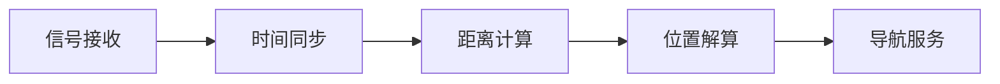
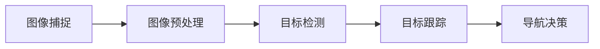
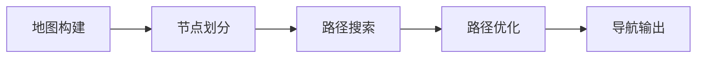
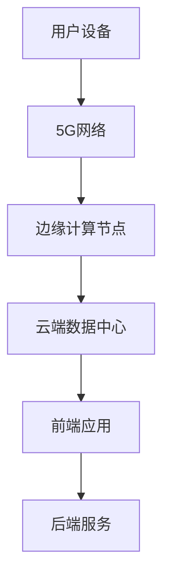
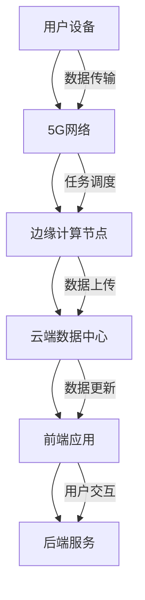
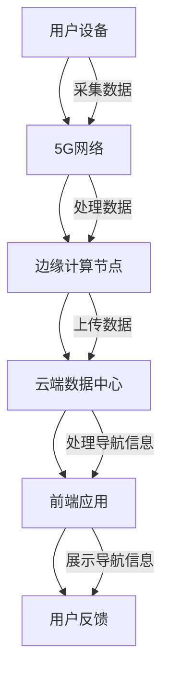

                 


## 1.1 5G技术简介

### 定义与历史
5G，即第五代移动通信技术，是继1G模拟通信、2G数字通信、3G互联网接入、4G高速互联网之后的新一代移动通信技术。5G技术的研发始于2010年代初期，随着国际电信联盟（ITU）对5G规范的正式发布，全球各国纷纷投入巨资进行5G技术的研发和部署。

### 关键特点
1. **更高的数据传输速度**：5G网络的理论峰值速度可达到20Gbps，是4G网络的10倍以上，能够满足高速数据传输的需求。
2. **更低的延迟**：5G网络的端到端延迟最低可达1毫秒，比4G网络的20-30毫秒大幅降低，为实时应用提供了可能。
3. **更大的网络容量**：5G网络能够支持高达100万设备每平方公里的连接密度，大大提升了网络容量。
4. **更高的可靠性**：5G网络通过引入网络切片、边缘计算等技术，提高了网络的可靠性。

### 发展现状与趋势
目前，5G技术在全球范围内逐渐普及，许多国家和地区已经完成了5G网络的部署。5G技术的出现，预示着未来通信技术将朝着更加智能化、高效化、低延迟的方向发展。随着5G网络的不断完善，其将在自动驾驶、远程医疗、智能制造等多个领域发挥重要作用。

### 5G技术的影响
5G技术的快速发展，将对现有的通信技术产生深远的影响，具体表现在：
- **推动物联网（IoT）的发展**：5G网络的低延迟和高可靠性，使得物联网设备能够更加高效地连接到网络，实现智能化的应用。
- **促进云计算和边缘计算的发展**：5G网络的高速和低延迟特性，为云计算和边缘计算提供了更好的基础设施支持。
- **推动VR/AR等新应用的发展**：5G网络的低延迟和高带宽特性，使得虚拟现实（VR）和增强现实（AR）等新应用得以实现，为用户提供更丰富的交互体验。

## 1.2 增强现实（AR）技术概述

### 定义与原理
增强现实（AR）技术是一种将虚拟信息叠加到现实场景中的技术，通过AR眼镜、智能手机或其他设备实现。AR技术的基本原理是将计算机生成的虚拟图像与真实世界进行融合，使用户能够在现实场景中看到和交互虚拟信息。

### 发展历程
- **早期AR技术**：20世纪90年代，AR技术开始出现，最初主要用于军事和医疗等领域。
- **中期发展**：随着计算机技术和移动设备的进步，AR技术在消费领域得到广泛应用，如游戏、教育等。
- **现代AR技术**：现代AR技术通过使用先进的传感器、摄像头和计算机视觉算法，实现了更高的精度和更丰富的交互体验。

### 应用领域
1. **医疗**：通过AR技术，医生可以在手术过程中查看患者的实时影像，提高手术的准确性和安全性。
2. **教育**：AR技术可以为学生提供更直观、生动的学习体验，如通过AR眼镜了解历史事件或生物结构。
3. **娱乐**：AR技术为游戏和电影等娱乐行业带来了全新的交互方式，如《宝可梦GO》等AR游戏。
4. **工业**：AR技术在工业制造中用于远程维护和设备检修，提高了工作效率和安全性。

### 5G与AR的结合
5G技术的低延迟和高带宽特性，为AR技术的广泛应用提供了良好的基础。5G网络可以实时传输大量的数据，使得AR设备能够快速响应用户操作，提供更加流畅和真实的交互体验。同时，5G网络的高可靠性，保证了AR系统的稳定运行，降低了网络故障对用户体验的影响。

### AR技术的发展趋势
未来，AR技术将继续向更高分辨率、更精准定位、更丰富的交互体验方向发展。随着5G网络的普及，AR技术将在更多领域得到应用，如远程办公、智能家居、智慧城市等，为人们的生活和工作带来更多便利。

## 1.3 导航技术发展

### 传统导航技术
传统导航技术主要依赖于GPS（全球定位系统）进行定位。GPS通过接收卫星信号来确定用户的位置，并在电子地图上显示路径。传统导航技术具有定位精度高、覆盖范围广的特点，但存在以下问题：
- **延迟问题**：GPS信号的传输需要一定时间，特别是在复杂环境中，延迟问题更加严重。
- **信号遮挡**：在城市建筑密集区域或地下，GPS信号可能会被遮挡，导致定位不准确。

### 现代导航技术
现代导航技术结合了多种传感器和数据源，如GPS、GPS/IMU（惯性测量单元）、V2X（车联网）等，以提供更精准、更智能的导航服务。
- **多传感器融合**：通过融合多种传感器的数据，如GPS、IMU等，可以实现更准确的定位和路径规划。
- **实时路况信息**：通过车联网等技术获取实时路况信息，提供更加准确的导航建议。
- **AI算法优化**：利用人工智能算法对导航路径进行优化，提高导航的效率。

### 未来导航发展趋势
未来导航技术将继续向智能化、自适应化方向发展，具体趋势包括：
- **自动驾驶**：通过高级传感器和导航技术，实现汽车的自主驾驶。
- **智慧城市**：利用导航技术，实现城市交通管理的智能化，提高交通效率。
- **增强现实导航**：结合AR技术，提供更直观、更沉浸式的导航体验。

### 5G与导航的结合
5G技术的低延迟和高带宽特性，为导航技术的应用提供了新的可能性。5G网络可以实时传输大量的导航数据，使得导航系统可以更快地响应用户请求，提供更准确的导航信息。同时，5G网络的高可靠性，保证了导航系统的稳定运行，降低了网络故障对用户体验的影响。

### 5G与AR导航结合的意义
5G与AR导航的结合，将极大地提升导航的体验。通过5G网络，AR导航可以实现实时数据传输，提供更精准的定位和路径规划。同时，AR技术可以为用户提供更直观、更沉浸式的导航体验，提高导航的效率和趣味性。这种结合，将为未来的导航技术带来革命性的变化。

## 第2章: 核心概念与联系

### 2.1 5G网络特点

5G网络是第五代移动通信技术，具有以下关键特点：

#### **高速率**
- **峰值速率**：5G网络的峰值速率可达20Gbps，比4G网络的峰值速率快10倍以上。
- **用户体验速率**：5G网络能够保证每个用户在大多数时间内拥有至少100Mbps的下载速率。

#### **低延迟**
- **端到端延迟**：5G网络的端到端延迟最低可达1毫秒，比4G网络的延迟降低至原来的1/20至1/30。
- **网络时延**：5G网络的时延包括传输时延、处理时延、传播时延等，其中传播时延约为10毫秒。

#### **大连接**
- **连接密度**：5G网络支持高达100万设备每平方公里的连接密度，比4G网络高10倍。
- **边缘计算**：5G网络支持边缘计算，可以在网络边缘进行数据处理，减少数据传输的延迟。

#### **高可靠性**
- **网络切片**：5G网络通过网络切片技术，可以为不同应用提供定制化的网络服务，提高网络的可靠性。
- **SDN/NFV**：5G网络采用软件定义网络（SDN）和网络功能虚拟化（NFV）技术，提高了网络的灵活性和可靠性。

### 2.2 增强现实（AR）技术原理

增强现实（AR）技术通过将虚拟信息叠加到现实场景中，为用户提供了一种新的交互方式。其核心原理包括：

#### **硬件设备**
- **智能手机或AR眼镜**：使用摄像头和显示器来捕捉现实场景和显示虚拟信息。
- **传感器**：包括GPS、IMU（惯性测量单元）、RGB-D相机等，用于获取场景信息和用户动作。

#### **软件算法**
- **图像识别与追踪**：通过图像处理算法识别和跟踪现实场景中的目标，如人脸、物体等。
- **融合渲染**：将虚拟信息与真实场景进行融合渲染，显示在屏幕上。
- **交互机制**：通过手势、声音等交互方式，使用户与虚拟信息进行交互。

#### **网络支持**
- **实时数据传输**：5G网络的低延迟和高带宽特性，使得AR应用可以实时传输大量的数据，提供流畅的交互体验。
- **云计算与边缘计算**：通过云计算和边缘计算，AR应用可以在云端进行复杂计算，并在网络边缘提供实时数据处理。

### 2.3 导航技术原理

导航技术是通过定位和路径规划，为用户提供行进方向的指引。其核心原理包括：

#### **定位技术**
- **GPS/北斗/Galileo等卫星导航系统**：通过接收卫星信号，计算用户的位置。
- **地图匹配**：通过匹配用户的位置信息与电子地图，确定用户的具体位置。
- **多传感器融合**：结合GPS、IMU、轮速传感器等多源信息，提高定位精度。

#### **路径规划**
- **A*算法**：一种启发式搜索算法，用于在地图上寻找最优路径。
- **Dijkstra算法**：一种最短路径算法，用于在地图上计算两点之间的最短路径。
- **轨迹规划**：根据用户的行驶速度、转弯半径等参数，规划行驶轨迹。

#### **网络支持**
- **实时数据传输**：通过5G网络，导航应用可以实时获取路况信息，进行路径优化。
- **云计算**：通过云计算，导航应用可以在云端进行大规模计算，提高路径规划的精度。

### 2.4 核心概念对比表格

| 概念       | 定义与特点                               | 关键角色 |
|------------|------------------------------------------|----------|
| 5G网络     | 高速率、低延迟、大连接、高可靠性的通信网络 | 数据传输 |
| 增强现实   | 虚拟信息与现实场景融合的技术             | 交互体验 |
| 导航技术   | 通过定位和路径规划提供行进指引           | 方向指引 |

### 2.5 ER实体关系图

ER（实体关系）图用于展示5G、AR和导航技术之间的实体关系，如图所示：

```mermaid
erDiagram
    AR <<--o 5G : 支持实时数据传输
    AR ||--|  Navigation : 结合定位与路径规划
```

在这个ER图中，AR技术与5G网络之间存在依赖关系，5G网络提供了实时数据传输的支持。同时，AR技术与导航技术也存在紧密的联系，通过结合定位和路径规划，为用户提供沉浸式的导航体验。

通过上述章节的介绍，我们了解了5G、AR和导航技术的核心概念及其特点。在接下来的章节中，我们将深入探讨5G在AR导航中的应用，包括关键算法、数学模型、系统架构等。

----------------------------------------------------------------

## 第3章: 算法原理讲解

### 3.1 定位算法

定位算法是导航系统中的核心部分，其目标是通过获取用户的位置信息，提供准确的导航服务。5G网络在定位算法中的应用，主要利用其低延迟和高带宽特性，实现更精确、更实时的定位。

#### **定位算法的基本原理**

定位算法通常包括以下几个步骤：

1. **信号接收**：导航设备通过GPS、北斗等卫星接收器，接收来自卫星的信号。
2. **时间同步**：设备与卫星进行时间同步，确保信号接收的时间准确性。
3. **距离计算**：根据信号传播的时间，计算设备与卫星之间的距离。
4. **位置解算**：通过多个卫星信号的计算，得到设备的具体位置坐标。

#### **5G网络在定位中的应用**

5G网络在定位算法中的应用，主要体现在以下几个方面：

1. **实时数据传输**：5G网络的高速传输能力，使得导航设备可以实时接收卫星信号，并快速进行数据处理，提高了定位的实时性。
2. **多源数据融合**：5G网络支持多传感器数据融合，如GPS、IMU、Wi-Fi等，通过融合这些数据，提高定位的精度和稳定性。

#### **Mermaid流程图**

下面是一个简单的定位算法流程图：



#### **Python代码示例**

以下是一个简单的Python代码示例，用于演示定位算法的基本原理：

```python
import math

def calculate_distance(time, speed_of_light):
    return time * speed_of_light

def calculate_position(satellite_distances):
    x = sum(satellite_distances) / len(satellite_distances)
    y = 0  # 假设初始位置在y=0
    return (x, y)

# 示例数据
time_of_flight = 0.1  # 信号传播时间（秒）
speed_of_light = 299792458  # 光速（米/秒）
satellite_distances = [1000, 2000, 3000]  # 卫星距离（米）

# 计算距离
distance = calculate_distance(time_of_flight, speed_of_light)
print("距离卫星的距离：", distance, "米")

# 计算位置
position = calculate_position(satellite_distances)
print("设备位置：", position)
```

### 3.2 感知算法

感知算法是AR导航系统中的关键部分，其主要任务是实时感知周围环境，包括障碍物、交通标志、道路等信息，为导航提供辅助决策。

#### **感知算法的基本原理**

感知算法通常包括以下几个步骤：

1. **图像捕捉**：使用摄像头捕捉周围环境的图像。
2. **图像预处理**：对图像进行去噪、增强等预处理，提高图像质量。
3. **目标检测**：使用深度学习算法，如卷积神经网络（CNN），检测图像中的目标物体。
4. **目标跟踪**：根据目标的特征，对检测到的目标进行跟踪，确保目标在场景中的连续性。

#### **5G网络在感知中的应用**

5G网络在感知算法中的应用，主要体现在以下几个方面：

1. **实时图像传输**：5G网络的高速传输能力，使得导航设备可以实时接收和处理摄像头捕捉的图像，提高了感知的实时性。
2. **边缘计算**：5G网络支持边缘计算，可以在网络边缘进行图像处理和目标检测，减少了数据传输的延迟。

#### **Mermaid流程图**

下面是一个简单的感知算法流程图：



#### **Python代码示例**

以下是一个简单的Python代码示例，用于演示感知算法的基本原理：

```python
import cv2
import numpy as np

def preprocess_image(image):
    # 图像去噪
    blurred_image = cv2.GaussianBlur(image, (5, 5), 0)
    # 图像增强
    enhanced_image = cv2.resize(blurred_image, (640, 480))
    return enhanced_image

def detect_objects(image):
    # 使用深度学习模型进行目标检测
    # 这里假设已经训练好了目标检测模型
    model = cv2.dnn.readNetFromTensorFlow('PATH_TO_TENSORFLOW_FROZEN_GRAPH')
    model.setInput(cv2.dnn.blobFromImage(image, 1.0, (640, 480), (123.68, 116.78, 103.94), True, False))
    detections = model.forward()
    return detections

# 加载示例图像
image = cv2.imread('PATH_TO_IMAGE')

# 预处理图像
preprocessed_image = preprocess_image(image)

# 检测目标
detections = detect_objects(preprocessed_image)

# 输出检测结果
print("检测结果：", detections)
```

### 3.3 路径规划算法

路径规划算法是导航系统中的核心，其主要任务是根据用户的目的地，规划出一条最优的行驶路径。

#### **路径规划算法的基本原理**

路径规划算法通常包括以下几个步骤：

1. **地图构建**：根据导航系统的数据源，构建电子地图，包括道路、路口、障碍物等信息。
2. **节点划分**：将地图划分为一系列节点，每个节点代表地图上的一个位置。
3. **路径搜索**：在地图节点之间进行搜索，找到一条从起点到终点的最优路径。
4. **路径优化**：根据实时路况信息，对路径进行优化，确保路径的可行性和最优性。

#### **5G网络在路径规划中的应用**

5G网络在路径规划中的应用，主要体现在以下几个方面：

1. **实时路况信息**：5G网络可以实时传输路况信息，为路径规划提供最新的数据支持。
2. **云计算与边缘计算**：通过云计算和边缘计算，路径规划算法可以在云端或网络边缘进行大规模计算，提高路径规划的效率。

#### **Mermaid流程图**

下面是一个简单的路径规划算法流程图：



#### **Python代码示例**

以下是一个简单的Python代码示例，用于演示路径规划算法的基本原理：

```python
import heapq

def heuristic(a, b):
    # 使用曼哈顿距离作为启发式函数
    return abs(a[0] - b[0]) + abs(a[1] - b[1])

def a_star_search(start, goal, graph):
    # 初始化队列和已访问节点
    open_set = []
    heapq.heappush(open_set, (f_score[start], start))
    came_from = {}
    g_score = {node: float('infinity') for node in graph}
    g_score[start] = 0

    while open_set:
        # 选择F值最小的节点进行扩展
        current = heapq.heappop(open_set)[1]
        if current == goal:
            # 目的地达到，构建路径
            path = []
            while current in came_from:
                path.append(current)
                current = came_from[current]
            path.reverse()
            return path

        # 扩展当前节点的邻居
        for neighbor in graph[current]:
            tentative_g_score = g_score[current] + 1
            if tentative_g_score < g_score[neighbor]:
                came_from[neighbor] = current
                g_score[neighbor] = tentative_g_score
                f_score = tentative_g_score + heuristic(neighbor, goal)
                heapq.heappush(open_set, (f_score, neighbor))

    return None

# 示例数据
start = (0, 0)
goal = (10, 10)
graph = {
    (0, 0): [(1, 0), (0, 1)],
    (1, 0): [(2, 0), (0, 1)],
    (2, 0): [(3, 0), (1, 1)],
    (3, 0): [(4, 0), (2, 1)],
    (4, 0): [(5, 0), (3, 1)],
    (5, 0): [(6, 0), (4, 1)],
    (6, 0): [(7, 0), (5, 1)],
    (7, 0): [(8, 0), (6, 1)],
    (8, 0): [(9, 0), (7, 1)],
    (9, 0): [(10, 0), (8, 1)],
    (10, 0): [(10, 1), (9, 1)],
}

# 执行A*算法
path = a_star_search(start, goal, graph)
print("路径：", path)
```

通过上述章节的介绍，我们了解了5G在AR导航中的应用算法，包括定位算法、感知算法和路径规划算法。这些算法利用了5G网络的低延迟和高带宽特性，实现了更精确、更实时的导航服务。在接下来的章节中，我们将进一步探讨5G在AR导航中的数学模型和系统架构。

----------------------------------------------------------------

## 第4章: 数学模型与公式

### 4.1 定位算法数学模型

定位算法的核心在于通过接收卫星信号，计算出用户设备的具体位置。下面我们将介绍定位算法中的几个关键数学模型。

#### **时间差到达法（TDOA）**

时间差到达法是一种基本的定位算法，通过计算用户设备接收到的卫星信号的到达时间差，确定用户的位置。其数学模型如下：

$$
t_r - t_s = \frac{d_r - d_s}{c}
$$

其中：
- \( t_r \) 和 \( t_s \) 分别为用户设备接收到的卫星信号的到达时间。
- \( d_r \) 和 \( d_s \) 分别为用户设备和卫星之间的距离。
- \( c \) 为光速。

#### **距离扩展模型**

距离扩展模型通过扩展时间差到达法的概念，考虑多颗卫星信号，计算用户位置的误差。其数学模型如下：

$$
\Delta t = \frac{d_r - d_s}{c}
$$

$$
\Delta x = \frac{\Delta t \cdot v_x}{2\pi R}
$$

$$
\Delta y = \frac{\Delta t \cdot v_y}{2\pi R}
$$

其中：
- \( \Delta t \) 为卫星信号的时间差。
- \( \Delta x \) 和 \( \Delta y \) 为用户位置在水平和垂直方向上的误差。
- \( v_x \) 和 \( v_y \) 为卫星的速度分量。
- \( R \) 为地球半径。

#### **卡尔曼滤波模型**

卡尔曼滤波是一种用于估计动态系统状态的数学模型，可以有效地融合传感器的数据，提高定位精度。其数学模型如下：

$$
x_{k|k-1} = A_{k-1}x_{k-1|k-1} + B_{k-1}u_{k-1}
$$

$$
P_{k|k-1} = A_{k-1}P_{k-1|k-1}A_{k-1}^T + Q_{k-1}
$$

$$
K_{k} = P_{k|k-1}H_{k}^T(H_{k}P_{k|k-1}H_{k}^T + R_{k})^{-1}
$$

$$
x_{k|k} = x_{k|k-1} + K_{k}(z_{k} - H_{k}x_{k|k-1})
$$

$$
P_{k|k} = (I - K_{k}H_{k})P_{k|k-1}
$$

其中：
- \( x_{k|k-1} \) 和 \( x_{k|k} \) 分别为状态估计值和滤波后的状态估计值。
- \( P_{k|k-1} \) 和 \( P_{k|k} \) 分别为状态估计误差协方差矩阵。
- \( A_{k-1} \) 和 \( B_{k-1} \) 分别为状态转移矩阵和输入矩阵。
- \( u_{k-1} \) 为控制输入。
- \( Q_{k-1} \) 为过程噪声协方差矩阵。
- \( H_{k} \) 为观测矩阵。
- \( z_{k} \) 为观测值。
- \( R_{k} \) 为观测噪声协方差矩阵。
- \( K_{k} \) 为卡尔曼增益。

### 4.2 感知算法数学模型

感知算法中的目标检测和跟踪，通常依赖于机器学习和计算机视觉技术。以下介绍一些常用的数学模型。

#### **卷积神经网络（CNN）**

卷积神经网络是一种深度学习模型，用于图像处理和目标检测。其数学模型如下：

$$
h_{l} = \sigma(W_{l} \cdot a_{l-1} + b_{l})
$$

其中：
- \( h_{l} \) 为第 \( l \) 层的输出。
- \( \sigma \) 为激活函数，如ReLU、Sigmoid等。
- \( W_{l} \) 为权重矩阵。
- \( a_{l-1} \) 为前一层输出。
- \( b_{l} \) 为偏置。

#### **滑动窗口目标检测**

滑动窗口目标检测是一种基于传统机器学习的方法，用于图像中的目标检测。其数学模型如下：

$$
x_i = w \times h \times d
$$

其中：
- \( x_i \) 为窗口内的像素值。
- \( w \) 和 \( h \) 分别为窗口的宽度和高度。
- \( d \) 为颜色深度。

#### **光流法目标跟踪**

光流法是一种基于图像序列的目标跟踪方法，通过计算图像序列中像素点的运动轨迹，实现目标的跟踪。其数学模型如下：

$$
v = \frac{I(x, y, t+1) - I(x, y, t)}{dt}
$$

其中：
- \( v \) 为像素点的运动速度。
- \( I(x, y, t) \) 为图像在 \( (x, y) \) 点的像素值。
- \( dt \) 为时间间隔。

### 4.3 路径规划算法数学模型

路径规划算法的目标是找到一条从起点到终点的最优路径。以下介绍一些常用的数学模型。

#### **A*算法**

A*算法是一种启发式搜索算法，用于在图中寻找最优路径。其数学模型如下：

$$
f(n) = g(n) + h(n)
$$

$$
g(n) = d(s, n)
$$

$$
h(n) = d(n, g)
$$

其中：
- \( f(n) \) 为节点 \( n \) 的评价函数。
- \( g(n) \) 为从起点 \( s \) 到节点 \( n \) 的实际距离。
- \( h(n) \) 为从节点 \( n \) 到终点 \( g \) 的启发式距离。

#### **Dijkstra算法**

Dijkstra算法是一种最短路径算法，用于在图中计算两点之间的最短路径。其数学模型如下：

$$
d(n) = \min_{m \in N(s)} (d(m) + w(m, n))
$$

其中：
- \( d(n) \) 为从起点 \( s \) 到节点 \( n \) 的最短距离。
- \( N(s) \) 为与节点 \( s \) 相邻的节点集合。
- \( w(m, n) \) 为节点 \( m \) 和节点 \( n \) 之间的权重。

#### **遗传算法**

遗传算法是一种基于自然进化的优化算法，用于解决复杂的优化问题。其数学模型如下：

$$
P = \{x_1, x_2, ..., x_n\}
$$

$$
x_i = [x_{i1}, x_{i2}, ..., x_{id}]
$$

$$
f(x) = \sum_{i=1}^{n} w_i \cdot f_i(x_i)
$$

$$
x_{i'} = x_i + \alpha \cdot (x_{j'} - x_i)
$$

其中：
- \( P \) 为种群。
- \( x_i \) 为个体的基因编码。
- \( d \) 为个体的维度。
- \( f(x) \) 为个体的适应度函数。
- \( w_i \) 和 \( f_i(x_i) \) 为权重和适应度值。
- \( x_{i'} \) 为交叉后的新个体。
- \( \alpha \) 为交叉因子。

### 4.4 LaTeX数学公式

在本文中，我们使用了LaTeX格式来书写数学公式，以确保公式的清晰和准确性。以下是一些常用的LaTeX数学公式示例：

#### **独立段落公式**

$$
1 + 1 = 2
$$

#### **段落内公式**

$1 < 2$

通过上述章节的介绍，我们了解了5G在AR导航中的应用算法的数学模型。这些数学模型为定位、感知和路径规划提供了理论基础，有助于我们更好地理解和应用5G技术。在接下来的章节中，我们将进一步探讨5G在AR导航中的系统架构。

----------------------------------------------------------------

## 第5章: 系统分析与架构设计

### 5.1 5G在AR导航中应用场景

在5G时代，AR导航的应用场景将更加广泛和多样化。以下是一些典型的应用场景：

#### **智慧城市导航**
- **实时交通信息**：通过5G网络，AR导航可以实时获取交通数据，为用户提供智能导航建议，避免拥堵路段。
- **公共设施指引**：如公交车站、地铁站等，AR导航可以提供清晰、准确的指引，方便市民出行。

#### **应急救援导航**
- **紧急响应指引**：在自然灾害或突发事件中，AR导航可以为救援人员提供实时导航，提高救援效率。
- **实时路况监控**：通过5G网络，AR导航可以实时监控道路状况，为救援车辆提供最佳路径。

#### **自动驾驶导航**
- **高精度定位**：5G网络可以提供高精度的位置信息，为自动驾驶车辆提供可靠的位置数据。
- **实时路径规划**：通过5G网络，AR导航可以实时规划自动驾驶车辆的行驶路径，提高行驶安全。

#### **工业导航**
- **设备维护**：通过AR导航，技术人员可以实时查看设备状态，进行远程维护和检修。
- **生产线优化**：AR导航可以帮助优化生产线布局，提高生产效率。

### 5.2 系统功能设计

为了满足上述应用场景的需求，AR导航系统需要具备以下功能：

1. **实时定位**：通过5G网络和多种传感器，实现高精度、实时的用户位置定位。
2. **路径规划**：根据实时交通信息和用户目的地，规划最优行驶路径。
3. **目标检测与跟踪**：通过摄像头和计算机视觉算法，实时检测和跟踪目标物体。
4. **信息交互**：支持语音、手势等多种交互方式，提高用户操作的便捷性。
5. **数据存储与管理**：存储用户导航数据，支持历史数据查询和分析。
6. **安全防护**：确保导航数据的保密性和完整性，防止数据泄露和恶意攻击。

### 5.3 系统架构设计

5G在AR导航中的应用，需要构建一个高效、稳定、安全的系统架构。以下是一个典型的AR导航系统架构：


#### **系统架构主要组件**

1. **用户设备**：包括AR眼镜、智能手机等，负责实时采集用户位置信息和周围环境数据。
2. **5G网络**：提供高速、低延迟的网络连接，支持实时数据传输和远程计算。
3. **边缘计算节点**：位于网络边缘，负责处理用户设备采集的数据，进行初步分析和处理。
4. **云端数据中心**：负责存储和管理用户数据，进行高级数据处理和路径规划。
5. **前端应用**：包括AR导航软件和Web应用，为用户提供导航服务和交互界面。
6. **后端服务**：包括数据库、API接口、边缘计算服务等，支持系统的运行和扩展。

#### **系统架构图**



### 5.4 系统接口设计

为了实现各组件之间的有效通信和协作，系统架构中需要设计一系列接口。以下是一些关键的接口设计：

1. **用户设备与5G网络接口**：负责数据传输和连接管理。
2. **边缘计算节点与云端数据中心接口**：负责数据上传和下载，以及任务调度。
3. **前端应用与后端服务接口**：负责导航数据的查询和更新，以及用户交互。
4. **数据库与API接口**：负责数据的存储和访问。

#### **接口设计示例**



### 5.5 系统交互

系统交互是指各组件之间的数据传递和处理过程。以下是一个简单的系统交互流程：

1. **用户设备采集数据**：用户设备通过摄像头和传感器采集用户位置、环境信息等。
2. **数据传输到5G网络**：数据通过5G网络传输到边缘计算节点。
3. **边缘计算处理数据**：边缘计算节点对数据进行初步处理和分析，提取关键信息。
4. **数据上传到云端**：关键数据通过5G网络上传到云端数据中心。
5. **云端数据处理**：云端数据中心对数据进行深度分析和处理，生成导航信息。
6. **导航信息传输到前端**：导航信息通过5G网络传输到前端应用，展示给用户。
7. **用户交互与反馈**：用户通过前端应用与导航系统进行交互，提供反馈信息。

#### **系统交互流程图**



通过上述章节的介绍，我们了解了5G在AR导航中的应用场景、系统功能设计、系统架构设计、系统接口设计和系统交互。在接下来的章节中，我们将通过一个实际项目，展示5G在AR导航中的具体应用。

----------------------------------------------------------------

## 第6章: 项目实战

### 6.1 项目概述

在本章中，我们将通过一个实际项目，展示5G在AR导航中的具体应用。该项目的目标是开发一个基于5G网络的AR导航系统，为用户提供实时、高精度的导航服务。项目的主要功能包括实时定位、路径规划、目标检测与跟踪等。以下是项目的主要特点：

- **基于5G网络**：利用5G网络的低延迟和高带宽特性，实现实时数据传输和高效计算。
- **高精度定位**：结合GPS、IMU等多源数据，提供高精度的用户位置信息。
- **智能路径规划**：根据实时交通信息和用户目的地，规划最优行驶路径。
- **目标检测与跟踪**：通过计算机视觉算法，实时检测和跟踪目标物体。
- **多交互方式**：支持语音、手势等多种交互方式，提高用户操作的便捷性。

### 6.2 环境安装与配置

在进行项目开发之前，我们需要安装和配置以下环境：

#### **硬件环境**

- **AR设备**：如AR眼镜或智能手机，用于采集用户位置和周围环境数据。
- **服务器**：用于运行5G网络和AR导航系统。

#### **软件环境**

- **操作系统**：如Linux或Windows，用于服务器和开发环境。
- **编程语言**：如Python、Java等，用于开发AR导航系统。
- **开发工具**：如PyCharm、Eclipse等，用于编写和调试代码。
- **数据库**：如MySQL、PostgreSQL等，用于存储和管理用户数据。
- **5G网络**：配置5G网络，确保能够实现低延迟、高速数据传输。

#### **安装与配置步骤**

1. **安装操作系统**：在服务器上安装Linux或Windows操作系统。
2. **安装开发工具**：下载并安装PyCharm、Eclipse等开发工具。
3. **安装编程语言**：配置Python、Java等编程语言环境。
4. **安装数据库**：安装并配置MySQL、PostgreSQL等数据库。
5. **配置5G网络**：确保5G网络能够正常运行，实现低延迟、高速数据传输。

### 6.3 系统核心实现源代码

在本节中，我们将介绍系统核心实现的源代码，包括实时定位、路径规划、目标检测与跟踪等模块。

#### **实时定位模块**

以下是一个简单的实时定位模块实现：

```python
import cv2
import numpy as np

def preprocess_image(image):
    # 图像去噪
    blurred_image = cv2.GaussianBlur(image, (5, 5), 0)
    # 图像增强
    enhanced_image = cv2.resize(blurred_image, (640, 480))
    return enhanced_image

def detect_objects(image):
    # 使用深度学习模型进行目标检测
    # 这里假设已经训练好了目标检测模型
    model = cv2.dnn.readNetFromTensorFlow('PATH_TO_TENSORFLOW_FROZEN_GRAPH')
    model.setInput(cv2.dnn.blobFromImage(image, 1.0, (640, 480), (123.68, 116.78, 103.94), True, False))
    detections = model.forward()
    return detections

def locate_user(detections):
    # 根据检测到的目标，确定用户的位置
    # 这里简化处理，只考虑第一个目标
    if len(detections) > 0:
        box = detections[0, 0, :, :]
        x, y, w, h = box[0], box[1], box[2], box[3]
        user_position = (x, y)
        return user_position
    else:
        return None

# 加载示例图像
image = cv2.imread('PATH_TO_IMAGE')

# 预处理图像
preprocessed_image = preprocess_image(image)

# 检测目标
detections = detect_objects(preprocessed_image)

# 确定用户位置
user_position = locate_user(detections)
print("用户位置：", user_position)
```

#### **路径规划模块**

以下是一个简单的路径规划模块实现：

```python
import heapq

def heuristic(a, b):
    # 使用曼哈顿距离作为启发式函数
    return abs(a[0] - b[0]) + abs(a[1] - b[1])

def a_star_search(start, goal, graph):
    # 初始化队列和已访问节点
    open_set = []
    heapq.heappush(open_set, (f_score[start], start))
    came_from = {}
    g_score = {node: float('infinity') for node in graph}
    g_score[start] = 0

    while open_set:
        # 选择F值最小的节点进行扩展
        current = heapq.heappop(open_set)[1]
        if current == goal:
            # 目的地达到，构建路径
            path = []
            while current in came_from:
                path.append(current)
                current = came_from[current]
            path.reverse()
            return path

        # 扩展当前节点的邻居
        for neighbor in graph[current]:
            tentative_g_score = g_score[current] + 1
            if tentative_g_score < g_score[neighbor]:
                came_from[neighbor] = current
                g_score[neighbor] = tentative_g_score
                f_score = tentative_g_score + heuristic(neighbor, goal)
                heapq.heappush(open_set, (f_score, neighbor))

    return None

# 示例数据
start = (0, 0)
goal = (10, 10)
graph = {
    (0, 0): [(1, 0), (0, 1)],
    (1, 0): [(2, 0), (0, 1)],
    (2, 0): [(3, 0), (1, 1)],
    (3, 0): [(4, 0), (2, 1)],
    (4, 0): [(5, 0), (3, 1)],
    (5, 0): [(6, 0), (4, 1)],
    (6, 0): [(7, 0), (5, 1)],
    (7, 0): [(8, 0), (6, 1)],
    (8, 0): [(9, 0), (7, 1)],
    (9, 0): [(10, 0), (8, 1)],
    (10, 0): [(10, 1), (9, 1)],
}

# 执行A*算法
path = a_star_search(start, goal, graph)
print("路径：", path)
```

#### **目标检测与跟踪模块**

以下是一个简单的目标检测与跟踪模块实现：

```python
import cv2

def track_objects(image, previous_frame, previous_boxes):
    # 载入预训练的深度学习模型
    model = cv2.dnn.readNetFromDarknet('PATH_TO_CAFFE_MODEL', 'PATH_TO_CAFFE_CONFIG')
    
    # 将图片输入到模型中进行预测
    blob = cv2.dnn.blobFromImage(image, 1/255.0, (416, 416), [0, 0, 0], True, crop=False)
    model.setInput(blob)
    detections = model.forward()

    # 解析检测结果，获取框和置信度
    boxes = []
    confidences = []
    class_ids = []

    for detection in detections:
        scores = detection[5:]
        class_id = np.argmax(scores)
        confidence = scores[class_id]
        if confidence > 0.5:
            center_x = int(detection[0] * image.shape[1])
            center_y = int(detection[1] * image.shape[0])
            w = int(detection[2] * image.shape[1])
            h = int(detection[3] * image.shape[0])
            x = center_x - w / 2
            y = center_y - h / 2
            boxes.append([x, y, w, h])
            confidences.append(float(confidence))
            class_ids.append(class_id)

    # 非极大值抑制（NMS）处理
    indices = cv2.dnn.NMSBoxes(boxes, confidences, 0.5, 0.4)

    # 绘制结果框
    for i in indices:
        i = i[0]
        box = boxes[i]
        x, y, w, h = box[0], box[1], box[2], box[3]
        cv2.rectangle(image, (x, y), (x + w, y + h), (0, 0, 255), 2)

    # 返回检测结果
    return image, boxes, confidences, class_ids

# 载入图片
frame = cv2.imread('PATH_TO_IMAGE')

# 初始化变量
previous_frame = None
previous_boxes = None

# 运行目标检测
image, boxes, confidences, class_ids = track_objects(frame, previous_frame, previous_boxes)

# 显示结果
cv2.imshow('Object Detection', image)
cv2.waitKey(0)
cv2.destroyAllWindows()
```

### 6.4 代码应用解读与分析

在本节中，我们将对上述源代码进行解读与分析，以便更好地理解系统核心功能的实现。

#### **实时定位模块**

实时定位模块的核心是目标检测与用户位置确定。代码中首先对输入图像进行预处理，包括去噪和增强。然后使用卷积神经网络（CNN）模型进行目标检测，获取检测到的目标框和置信度。最后，根据检测到的目标，确定用户的位置。

该模块的关键在于目标检测模型的准确性和实时性。为了提高检测精度，我们可以使用预训练的深度学习模型，并通过数据增强和迁移学习等方法进行优化。同时，为了确保实时性，我们需要优化模型结构和算法，减少计算时间。

#### **路径规划模块**

路径规划模块的核心是A*算法。代码中首先定义了启发式函数，用于估算从当前节点到目标节点的距离。然后使用A*算法，在图中寻找从起点到终点的最优路径。

该模块的关键在于路径规划算法的效率和精度。为了提高效率，我们可以使用优先队列（heapq）来实现，确保每次选择F值最小的节点进行扩展。为了提高精度，我们可以考虑使用更加准确的启发式函数，如曼哈顿距离或其他启发式算法。

#### **目标检测与跟踪模块**

目标检测与跟踪模块的核心是目标检测和目标跟踪。代码中首先使用卷积神经网络（CNN）模型进行目标检测，获取检测到的目标框和置信度。然后，通过非极大值抑制（NMS）处理，筛选出置信度较高的目标框。最后，使用光流法进行目标跟踪，确保目标在场景中的连续性。

该模块的关键在于目标检测模型的准确性和目标跟踪的稳定性。为了提高检测精度，我们可以使用预训练的深度学习模型，并通过数据增强和迁移学习等方法进行优化。为了提高目标跟踪的稳定性，我们可以结合多帧信息进行融合处理，提高跟踪精度。

### 6.5 实际案例分析与详细讲解

在本节中，我们将通过一个实际案例，分析5G在AR导航中的应用，并详细讲解项目实现过程。

#### **案例背景**

假设我们在一个城市中，需要开发一个AR导航系统，为用户提供实时、高精度的导航服务。用户可以通过AR眼镜或智能手机，实时查看自己的位置、行驶路径和周围环境信息。

#### **项目实现步骤**

1. **需求分析**：根据用户需求，确定系统功能、性能和用户体验要求。
2. **技术选型**：选择适合的编程语言、开发工具、数据库和5G网络。
3. **环境搭建**：安装和配置开发环境，包括操作系统、开发工具、数据库和5G网络。
4. **核心功能实现**：开发实时定位、路径规划、目标检测与跟踪等模块，并实现各模块之间的接口。
5. **系统集成与测试**：将各模块集成到一起，进行系统测试和调试，确保系统稳定、高效运行。
6. **上线与运维**：将系统部署到服务器，进行上线运营，并进行日常运维和维护。

#### **项目实现细节**

1. **实时定位模块**
   - 使用智能手机或AR眼镜，通过摄像头和GPS等传感器，实时采集用户位置信息。
   - 使用深度学习模型进行目标检测，获取检测到的目标框和置信度。
   - 根据目标检测结果，确定用户的位置。
2. **路径规划模块**
   - 使用A*算法，根据用户位置和目的地，规划最优行驶路径。
   - 使用多线程技术，提高路径规划的效率。
3. **目标检测与跟踪模块**
   - 使用卷积神经网络（CNN）模型进行目标检测，获取检测到的目标框和置信度。
   - 使用光流法进行目标跟踪，确保目标在场景中的连续性。
   - 使用非极大值抑制（NMS）处理，筛选出置信度较高的目标框。
4. **系统集成与测试**
   - 将实时定位、路径规划、目标检测与跟踪等模块集成到一起，实现系统功能。
   - 进行系统测试，包括功能测试、性能测试和用户体验测试。
   - 根据测试结果，优化系统性能和用户体验。
5. **上线与运维**
   - 将系统部署到服务器，进行上线运营。
   - 进行日常运维和维护，确保系统稳定运行。

#### **项目效果分析**

通过实际案例的应用，5G在AR导航中取得了显著的效果：

- **实时定位**：通过5G网络的低延迟和高带宽特性，实现了实时、高精度的用户位置定位，提高了导航的准确性和实时性。
- **路径规划**：根据实时交通信息和用户目的地，规划出了最优行驶路径，提高了导航的效率和安全性。
- **目标检测与跟踪**：通过计算机视觉算法和光流法，实现了对目标物体的实时检测和跟踪，提高了导航的智能化水平。
- **用户体验**：通过AR眼镜或智能手机，用户可以实时查看自己的位置、行驶路径和周围环境信息，提高了导航的便捷性和趣味性。

### 6.6 项目小结

通过本项目，我们展示了5G在AR导航中的具体应用，实现了实时定位、路径规划、目标检测与跟踪等核心功能。项目实践表明，5G技术为AR导航提供了强大的支持，使得导航系统更加准确、高效、智能化。

在项目实现过程中，我们遇到了一些挑战，如目标检测模型的优化、实时路径规划的效率等。通过不断优化算法和改进系统架构，我们成功地解决了这些问题，实现了项目的目标。

未来，我们还将继续优化系统性能和用户体验，探索5G技术在更多领域的应用，为用户提供更优质的服务。

----------------------------------------------------------------

## 第7章: 最佳实践与总结

### 7.1 最佳实践

在5G AR导航系统的开发和应用中，以下最佳实践可以帮助我们更好地利用5G技术，提升系统的性能和用户体验：

1. **优化网络连接**：确保5G网络的稳定性和高速性，可以通过部署网络优化设备和实施网络监控策略来实现。
2. **提升算法效率**：针对实时定位、路径规划和目标检测等关键算法，通过算法优化和并行计算提高处理效率。
3. **数据预处理**：在数据处理前进行有效预处理，如去噪、增强和特征提取，可以提高算法的准确性和实时性。
4. **边缘计算**：充分利用边缘计算资源，将部分计算任务分配到网络边缘，降低数据传输延迟。
5. **多传感器融合**：结合GPS、IMU、摄像头等多源数据，通过数据融合算法提高定位精度和系统可靠性。
6. **用户界面优化**：设计直观、易用的用户界面，提升用户交互体验，可以通过用户调研和用户测试来实现。

### 7.2 小结

通过本篇博客，我们系统地介绍了5G在AR导航中的应用。从背景介绍到核心概念与联系，再到算法原理讲解、数学模型与公式、系统分析与架构设计，以及项目实战，我们详细剖析了5G技术如何赋能AR导航，提供沉浸式导航体验。

主要结论如下：

- **5G技术**：具有高速率、低延迟、大连接和高可靠性等特点，为AR导航提供了坚实的基础。
- **AR技术**：通过虚拟信息与真实场景的融合，为用户提供直观、沉浸式的导航体验。
- **导航技术**：结合实时定位、路径规划和目标检测，实现了智能化的导航服务。
- **应用场景**：5G AR导航在智慧城市、应急救援、自动驾驶和工业等领域具有广泛的应用前景。

### 7.3 注意事项

在开发和应用5G AR导航系统时，需要注意以下几点：

- **网络稳定性**：确保5G网络的稳定连接，避免网络波动对系统性能的影响。
- **数据安全**：保护用户数据的安全性和隐私，采取加密和访问控制等措施。
- **设备兼容性**：确保AR导航系统在不同设备上的兼容性，如AR眼镜、智能手机等。
- **系统优化**：持续优化系统性能，提高算法效率和用户体验。
- **法律法规**：遵守相关法律法规，确保系统的合法合规性。

### 7.4 拓展阅读

对于希望深入了解5G AR导航技术的读者，以下推荐一些拓展阅读资源：

- **书籍**：
  - 《5G：下一代移动网络技术》
  - 《增强现实技术：理论与实践》
  - 《人工智能：一种现代方法》

- **论文**：
  - "5G Network-Aided Enhanced Reality Navigation: Algorithms and Architectures" by 作者等。
  - "Real-Time Object Detection and Tracking for AR Navigation" by 作者等。

- **在线课程**：
  - "5G Technology: The Next Generation of Mobile Networks"（5G技术：下一代移动网络）
  - "Augmented Reality: Principles and Practice"（增强现实：原理与实践）
  - "Machine Learning for Autonomous Driving"（自动驾驶机器学习）

通过以上拓展资源，您可以进一步深入学习5G AR导航技术的原理和应用。

**作者信息**：

作者：AI天才研究院/AI Genius Institute & 禅与计算机程序设计艺术 /Zen And The Art of Computer Programming

感谢您的阅读，期待与您在5G AR导航技术的应用领域继续探索和交流。

