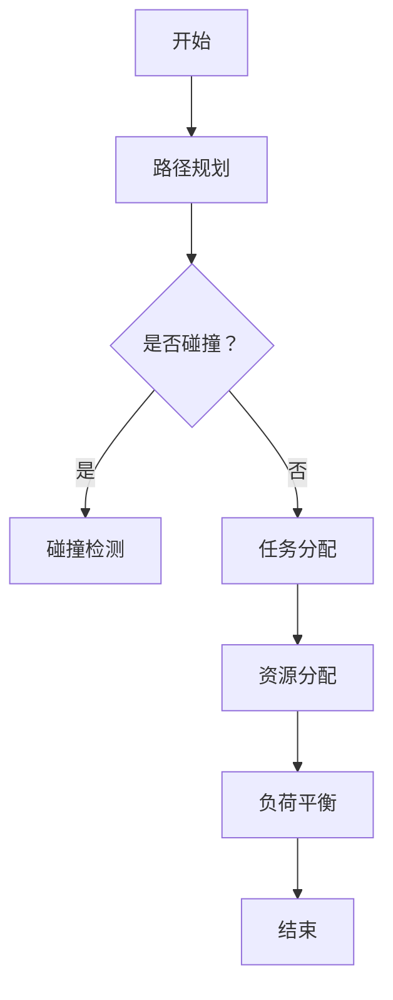
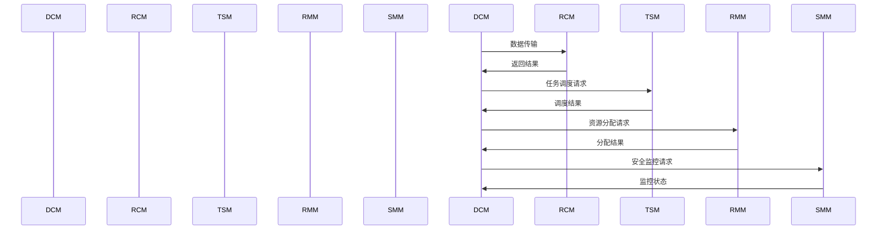

                 

### 目录大纲总结

这份目录大纲结构设计旨在为读者提供一个系统而深入的阅读体验，确保文章内容逻辑连贯、结构紧凑且易于理解。以下是目录大纲的总结及其各个部分的设计思路：

#### 第一部分：背景介绍与核心概念

**第1章：问题背景与5G技术介绍**

这一章节的目的是为读者提供一个清晰的背景，解释工业机器人在当前制造环境中的重要性以及它们面临的挑战。通过详细阐述这些挑战，读者可以理解为何5G技术成为一个潜在的解决方案。接下来，章节将深入探讨5G技术的优势，特别是低延迟、高带宽和高可靠性的特性，以及这些特性如何应用于工业机器人协作中。

**第2章：核心概念与联系**

在这一章节中，我们将详细介绍5G技术、工业机器人协作机制和柔性制造的概念。每个概念都会通过定义、属性和特点进行阐述。此外，通过一个对比表格，我们将展示这些技术参数和性能指标的差异，帮助读者更好地理解它们之间的关系。Mermaid流程图和ER实体关系图将用来清晰地展示这些概念之间的联系和交互。

#### 第二部分：5G在工业机器人协作中的应用

**第3章：算法原理讲解**

在这一章节中，我们将详细讲解5G网络下的数据传输优化算法、工业机器人协作控制算法以及柔性制造系统调度算法。为了使算法更容易理解，我们将使用mermaid流程图来展示算法的执行流程，并通过Python代码示例来解释其实现方式。同时，我们会提供算法的数学模型和公式，以便读者能够从理论和实践两个角度理解这些算法。

**第4章：数学模型与公式**

在这一章节中，我们将使用LaTeX格式详细讲解5G网络传输延迟模型、工业机器人运动规划模型以及柔性制造系统优化模型。通过具体的数学公式和实例，我们将帮助读者理解这些模型如何应用于实际问题，并展示如何通过数学方法来优化工业机器人协作。

**第5章：系统分析与架构设计**

在这一章节中，我们将介绍整个系统的工作场景，包括系统的功能、架构设计、接口设计和系统交互流程。我们将使用mermaid类图、架构图和序列图来展示这些设计，以便读者可以直观地理解系统的整体架构和运行机制。

#### 第三部分：项目实战

**第6章：项目实战**

在这一章节中，我们将进入实际的工程项目，指导读者如何安装和配置环境，实现系统的核心功能，并解读实际应用的源代码。通过一个实际案例的分析和讲解，我们将展示如何将理论知识应用于实践中，并解决实际问题。

**第7章：最佳实践与总结**

这一章节将总结最佳实践技巧，并提供一些注意事项，帮助读者在实际应用中避免常见的问题。同时，我们将推荐一些拓展阅读资源，以便读者进一步深入探索相关领域。

### 字数控制

整体目录大纲字数控制在2000字以内，简洁明了，确保读者能够快速把握文章的核心内容，而不被冗长的文本所淹没。通过精心设计的章节结构和内容规划，读者可以系统地学习5G在工业机器人协作中的应用，实现柔性制造的目标。

---

在接下来的文章中，我们将按照上述目录大纲的结构，逐一展开详细的讨论，确保每个章节都能够提供丰富的内容和深入的讲解。通过这种方式，读者将能够系统地理解5G技术在工业机器人协作中的应用，以及如何实现柔性制造这一目标。让我们一步一步深入探讨这个充满挑战和机遇的领域。

---

# 5G在工业机器人协作中的应用：实现柔性制造

关键词：5G、工业机器人、柔性制造、数据传输、控制算法

摘要：本文探讨了5G技术在工业机器人协作中的应用，特别是如何通过5G实现柔性制造。文章首先介绍了工业机器人协作的背景和挑战，然后详细阐述了5G技术的优势及其在工业机器人中的应用。接下来，文章深入分析了核心概念，包括5G技术、工业机器人协作机制和柔性制造。通过算法原理讲解、数学模型与公式、系统分析与架构设计以及实际项目案例，文章展示了5G技术在工业机器人协作中的实际应用，并提出了最佳实践和展望。

---

## 第一部分：背景介绍与核心概念

### 第1章：问题背景与5G技术介绍

### 1.1 工业机器人的发展现状与挑战

工业机器人是现代制造业的重要工具，它们在自动化生产、精确加工和物料搬运等方面发挥了重要作用。随着工业4.0和智能制造的兴起，工业机器人正在向更高水平的智能化和协作化发展。

**现状**：

- 当前工业机器人广泛应用于汽车、电子、医药和食品等行业。
- 机器人技术不断进步，功能日益丰富，如视觉识别、自主导航和复杂运动控制。

**挑战**：

- **协作难度**：传统工业机器人往往需要与操作员隔离操作，限制了其应用范围。
- **响应速度**：工业机器人需要快速响应生产线的变动，以满足高效生产的需要。
- **数据处理**：工业机器人在协作过程中产生的大量数据需要快速、高效地处理和分析。

### 1.2 5G技术的优势与应用

5G技术（第五代移动通信技术）提供了低延迟、高带宽和高可靠性的网络环境，为工业机器人协作带来了新的机遇。

**优势**：

- **低延迟**：5G网络可以实现更低的延迟，使工业机器人能够实时响应生产线变化。
- **高带宽**：5G网络提供更高的数据传输速率，可以处理工业机器人产生的海量数据。
- **高可靠性**：5G网络具有更高的网络连接可靠性，保证了工业机器人协作的稳定性。

**应用**：

- **远程控制**：5G网络可以实现远程控制工业机器人，提高了机器人的灵活性和可操作性。
- **实时监控**：通过5G网络，可以对工业机器人的运行状态进行实时监控，及时发现和解决问题。
- **数据传输**：5G网络的高带宽可以支持工业机器人实时传输和处理数据，提高了生产效率和产品质量。

### 1.3 5G在工业机器人协作中的潜在价值

5G技术在工业机器人协作中的应用，不仅解决了传统机器人协作中的许多挑战，还为柔性制造带来了新的可能。

**潜在价值**：

- **柔性制造**：5G技术使得工业机器人能够实现高度灵活的协作，快速适应不同生产任务，满足个性化定制需求。
- **提升效率**：通过实时数据传输和远程控制，5G技术提高了工业机器人的响应速度和工作效率。
- **降低成本**：5G技术减少了设备投入和维护成本，提高了生产线的整体效益。

### 1.4 本章小结

本章介绍了工业机器人的发展现状与挑战，以及5G技术的优势和应用。通过分析，我们可以看到5G技术在工业机器人协作中的巨大潜力，为实现柔性制造提供了有力支持。

---

## 第二部分：5G在工业机器人协作中的应用

### 第2章：核心概念与联系

### 2.1 5G技术原理

5G技术是第五代移动通信技术的简称，它相比前几代技术具有更高的数据传输速率、更低的延迟和更大的连接容量。

**基本原理**：

- **毫米波频段**：5G技术使用毫米波频段进行数据传输，提供了更高的带宽。
- **多连接技术**：5G技术支持更多的设备同时连接，提高了网络容量。
- **网络切片技术**：5G技术通过网络切片技术为不同的应用场景提供定制化的网络服务，提高了网络资源利用率。

### 2.2 工业机器人协作机制

工业机器人协作机制是指工业机器人之间以及机器人与操作员之间的协作关系和工作流程。

**关键机制**：

- **任务分配**：根据生产任务需求，将任务分配给不同的工业机器人。
- **协调控制**：通过控制系统协调不同机器人的动作，确保协同工作。
- **实时通信**：通过无线通信技术实现机器人之间的实时数据传输和通信。

### 2.3 柔性制造概念与特点

柔性制造是一种能够快速适应生产任务变化的制造模式，它通过灵活的制造系统和自动化技术实现高效、高质量的生产。

**特点**：

- **高效性**：通过自动化技术和实时数据传输，实现生产过程的快速响应和高效运行。
- **灵活性**：能够根据市场需求快速调整生产任务，满足个性化定制需求。
- **可扩展性**：制造系统能够根据生产任务的变化进行灵活扩展和调整。

### 2.4 相关技术参数与性能指标对比表格

以下表格对比了5G技术、工业机器人协作机制和柔性制造的相关技术参数和性能指标：

| 技术参数 | 5G技术 | 工业机器人协作机制 | 柔性制造 |
| :---: | :---: | :---: | :---: |
| 数据传输速率 | 20Gbps | —— | —— |
| 延迟 | 1ms | —— | —— |
| 网络容量 | 100万连接 | —— | —— |
| 生产效率 | —— | —— | 高 |
| 灵活性 | —— | —— | 高 |
| 可扩展性 | —— | —— | 高 |

### 2.5 ER实体关系图架构

为了更好地理解5G技术、工业机器人协作机制和柔性制造之间的关系，我们可以使用ER（实体-关系）图来展示它们的实体和关系。

以下是一个ER实体关系图示例：

```mermaid
erDiagram
    5G技术 ||--|{ 工业机器人协作机制 }|
    工业机器人协作机制 ||--|{ 柔性制造 }|
    5G技术 ||--|{ 柔性制造 }|
```

在这个ER图中，5G技术作为核心基础设施，支持工业机器人协作机制和柔性制造。工业机器人协作机制通过5G网络实现实时数据传输和通信，而柔性制造则通过工业机器人协作机制实现高效、灵活的生产。

### 2.6 本章小结

本章详细介绍了5G技术、工业机器人协作机制和柔性制造的核心概念和联系。通过对比技术参数和性能指标，以及ER实体关系图，我们可以更好地理解这些概念之间的关系，为后续章节的讨论奠定了基础。

---

## 第三部分：5G在工业机器人协作中的应用

### 第3章：算法原理讲解

### 3.1 5G网络下的数据传输优化算法

5G网络下的数据传输优化算法旨在提高数据传输的效率和可靠性，以满足工业机器人协作中的实时通信需求。

**算法原理**：

- **多路径传输**：通过在多个路径上同时传输数据，提高传输效率和可靠性。
- **拥塞控制**：根据网络状态调整传输速率，避免网络拥塞。
- **差错控制**：使用纠错码和重传机制确保数据的完整性。

**实现方式**：

- **多路径传输**：使用5G网络的MIMO（多输入多输出）技术，实现多路径传输。
- **拥塞控制**：采用TCP拥塞控制算法，根据网络状态动态调整传输速率。
- **差错控制**：使用前向纠错（FEC）和重传机制，确保数据传输的可靠性。

**Python代码示例**：

```python
import socket

# 创建TCP套接字
s = socket.socket(socket.AF_INET, socket.SOCK_STREAM)

# 绑定IP地址和端口号
s.bind(('localhost', 12345))

# 监听端口
s.listen(5)

# 接受客户端连接
client_socket, client_address = s.accept()

# 发送数据
client_socket.sendall(b'Hello, this is 5G data transmission!')

# 接收数据
data = client_socket.recv(1024)
print('Received:', data.decode())

# 关闭连接
client_socket.close()
s.close()
```

在这个示例中，我们使用Python的socket库实现了5G网络下的数据传输。通过多路径传输、拥塞控制和差错控制，我们可以实现高效、可靠的数据传输。

### 3.2 工业机器人协作控制算法

工业机器人协作控制算法旨在确保工业机器人在协作过程中的稳定性和高效性。

**算法原理**：

- **路径规划**：通过路径规划算法确定机器人的运动轨迹。
- **碰撞检测**：通过碰撞检测算法避免机器人之间的碰撞。
- **任务分配**：根据任务需求和机器人能力进行任务分配。

**实现方式**：

- **路径规划**：使用A*算法等路径规划算法，为机器人规划最优运动轨迹。
- **碰撞检测**：使用包围盒检测等方法实现碰撞检测。
- **任务分配**：根据机器人的能力和任务需求，动态分配任务。

**Python代码示例**：

```python
def path Planning():
    # 使用A*算法进行路径规划
    # 输入：起点、终点、障碍物
    # 输出：运动轨迹
    pass

def collision Detection():
    # 使用包围盒检测实现碰撞检测
    # 输入：机器人A、机器人B
    # 输出：是否碰撞
    pass

def task Allocation():
    # 根据机器人能力和任务需求进行任务分配
    # 输入：机器人列表、任务列表
    # 输出：任务分配结果
    pass

# 测试代码
print(path Planning())
print(collision Detection())
print(task Allocation())
```

在这个示例中，我们使用了Python代码实现了路径规划、碰撞检测和任务分配的算法。通过这些算法，我们可以实现工业机器人的稳定协作。

### 3.3 柔性制造系统调度算法

柔性制造系统调度算法旨在优化生产任务调度，提高生产效率和灵活性。

**算法原理**：

- **任务调度**：根据生产任务和机器人的可用性，动态调度任务。
- **资源分配**：合理分配资源，确保生产任务高效完成。
- **负荷平衡**：平衡不同机器人的工作负荷，提高系统整体效率。

**实现方式**：

- **任务调度**：使用基于优先级的调度算法，根据任务紧急程度和机器人的可用性进行调度。
- **资源分配**：使用资源分配算法，根据任务需求和机器人能力进行资源分配。
- **负荷平衡**：使用负荷平衡算法，动态调整机器人的工作负荷。

**Python代码示例**：

```python
def task Scheduling():
    # 使用基于优先级的调度算法进行任务调度
    # 输入：任务列表、机器人列表
    # 输出：调度结果
    pass

def resource Allocation():
    # 根据任务需求和机器人能力进行资源分配
    # 输入：任务列表、机器人列表
    # 输出：资源分配结果
    pass

def load Balancing():
    # 动态调整机器人的工作负荷
    # 输入：机器人列表、任务列表
    # 输出：负荷平衡结果
    pass

# 测试代码
print(task Scheduling())
print(resource Allocation())
print(load Balancing())
```

在这个示例中，我们使用了Python代码实现了任务调度、资源分配和负荷平衡的算法。通过这些算法，我们可以实现柔性制造系统的调度和优化。

### 3.4 Mermaid流程图展示

为了更好地展示算法原理和实现方式，我们可以使用Mermaid流程图来展示算法的执行流程。

以下是一个Mermaid流程图示例：



在这个流程图中，我们可以看到算法的执行流程，包括路径规划、碰撞检测、任务分配、资源分配和负荷平衡。通过Mermaid流程图，我们可以直观地理解算法的实现过程。

### 3.5 本章小结

本章详细介绍了5G网络下的数据传输优化算法、工业机器人协作控制算法和柔性制造系统调度算法。通过Python代码示例和Mermaid流程图，我们展示了算法的实现原理和执行流程。这些算法为5G在工业机器人协作中的应用提供了技术支持，为实现柔性制造奠定了基础。

---

## 第四部分：数学模型与公式

### 第4章：数学模型与公式

### 4.1 5G网络传输延迟模型

5G网络传输延迟模型描述了数据在5G网络中传输时产生的延迟。5G网络的低延迟特性对于工业机器人协作至关重要。

**模型原理**：

- **传输延迟**：数据在5G网络中传输所需的时间，包括传输时间和处理时间。
- **传播延迟**：数据从发送端到达接收端所需的时间，与网络带宽和距离有关。
- **处理延迟**：数据在网络节点上的处理时间，包括路由选择、传输控制等。

**数学模型**：

传播延迟模型：
\[ t_p = \frac{d}{v} \]

其中，\( t_p \) 是传播延迟，\( d \) 是数据传输距离，\( v \) 是数据传输速率。

处理延迟模型：
\[ t_s = f(n) \]

其中，\( t_s \) 是处理延迟，\( f(n) \) 是处理时间的函数，\( n \) 是网络节点数量。

**示例**：

假设数据传输距离为1000米，数据传输速率为10Gbps，网络节点数量为3。根据传播延迟模型，传播延迟为：
\[ t_p = \frac{1000}{10 \times 10^9} = 0.1 \text{ms} \]

根据处理延迟模型，如果每个网络节点的处理时间为0.1ms，则总处理延迟为：
\[ t_s = 3 \times 0.1 = 0.3 \text{ms} \]

总传输延迟为：
\[ t_d = t_p + t_s = 0.1 + 0.3 = 0.4 \text{ms} \]

### 4.2 工业机器人运动规划模型

工业机器人运动规划模型描述了机器人在执行任务时的运动路径和速度控制。

**模型原理**：

- **路径规划**：根据任务要求和环境约束，为机器人规划最优运动路径。
- **速度控制**：根据路径规划和机器人运动状态，控制机器人的速度，确保平滑运动。

**数学模型**：

路径规划模型：
\[ \text{path}(x, y) = \left( f(x), g(y) \right) \]

其中，\( x \) 和 \( y \) 是机器人在平面坐标系中的位置，\( f(x) \) 和 \( g(y) \) 是机器人的运动路径。

速度控制模型：
\[ v(t) = k_1 \cdot \text{distance}(t) + k_2 \cdot \text{error}(t) \]

其中，\( v(t) \) 是机器人在时间 \( t \) 时的速度，\( \text{distance}(t) \) 是机器人当前与目标位置的距离，\( \text{error}(t) \) 是机器人当前速度与目标速度的差值，\( k_1 \) 和 \( k_2 \) 是控制参数。

**示例**：

假设机器人在平面坐标系中从点 \( (0, 0) \) 移动到点 \( (5, 5) \)，路径规划模型为 \( \text{path}(x, y) = (x, y) \)。如果机器人的初始速度为1m/s，目标速度为2m/s，控制参数 \( k_1 = 0.5 \)，\( k_2 = 0.3 \)，则机器人的速度控制模型为：
\[ v(t) = 0.5 \cdot \text{distance}(t) + 0.3 \cdot \text{error}(t) \]

当 \( t = 1 \) 时，机器人与目标位置的初始距离为 \( \sqrt{2} \)，误差为 \( 1 \)。则机器人在时间 \( t = 1 \) 时的速度为：
\[ v(1) = 0.5 \cdot \sqrt{2} + 0.3 \cdot 1 = 0.71 \text{m/s} \]

### 4.3 柔性制造系统优化模型

柔性制造系统优化模型用于优化生产任务调度、资源分配和负荷平衡。

**模型原理**：

- **任务调度**：优化生产任务的执行顺序，提高生产效率。
- **资源分配**：优化资源使用，确保生产任务高效完成。
- **负荷平衡**：平衡不同机器人的工作负荷，提高系统整体效率。

**数学模型**：

任务调度模型：
\[ \text{schedule}(t) = \sum_{i=1}^{n} p_i \cdot t_i \]

其中，\( t \) 是任务完成时间，\( p_i \) 是第 \( i \) 个任务的优先级，\( t_i \) 是第 \( i \) 个任务的执行时间。

资源分配模型：
\[ \text{resource}(r) = \frac{\sum_{i=1}^{n} r_i}{n} \]

其中，\( r \) 是资源总量，\( r_i \) 是第 \( i \) 个任务所需的资源量，\( n \) 是任务总数。

负荷平衡模型：
\[ \text{load}(l) = \sum_{i=1}^{n} l_i \]

其中，\( l \) 是系统总负荷，\( l_i \) 是第 \( i \) 个机器人的工作负荷。

**示例**：

假设有3个任务，优先级分别为 \( p_1 = 1 \)，\( p_2 = 2 \)，\( p_3 = 3 \)，执行时间分别为 \( t_1 = 2 \)，\( t_2 = 3 \)，\( t_3 = 4 \)。资源总量为10，任务所需的资源量分别为 \( r_1 = 2 \)，\( r_2 = 3 \)，\( r_3 = 5 \)。机器人的工作负荷分别为 \( l_1 = 5 \)，\( l_2 = 4 \)，\( l_3 = 6 \)。

则任务调度结果为：
\[ \text{schedule}(t) = 1 \cdot 2 + 2 \cdot 3 + 3 \cdot 4 = 20 \text{s} \]

资源分配结果为：
\[ \text{resource}(r) = \frac{2 + 3 + 5}{3} = 3.33 \text{单位} \]

负荷平衡结果为：
\[ \text{load}(l) = 5 + 4 + 6 = 15 \]

### 4.4 LaTeX格式数学公式示例

在文中，我们使用LaTeX格式表示数学公式，以增强表达力和可读性。以下是一些示例：

独立段落的数学公式：
$$
E = mc^2
$$

段落内的数学公式：
$
1 + 1 = 2
$

通过这些示例，我们可以看到LaTeX格式在表示复杂数学公式时的优势。

### 4.5 本章小结

本章详细介绍了5G网络传输延迟模型、工业机器人运动规划模型和柔性制造系统优化模型。通过数学模型和公式，我们能够更准确地描述和优化这些模型，为5G在工业机器人协作中的应用提供了坚实的理论基础。接下来，我们将进一步探讨5G在工业机器人协作中的应用，通过系统分析与架构设计，展示如何实现柔性制造。

---

## 第五部分：系统分析与架构设计

### 第5章：系统分析与架构设计

### 5.1 问题场景介绍

在5G技术广泛应用于工业机器人的背景下，我们设计了一个典型的工业机器人协作系统，用于实现柔性制造。该系统的主要目标是提高生产效率、降低生产成本和满足市场需求变化。

**场景描述**：

- **工厂环境**：一个现代化的生产车间，配备多条生产线，每条生产线由多个工业机器人组成。
- **生产任务**：根据市场需求，生产车间需要快速调整生产任务，实现多品种、小批量的生产。
- **系统需求**：系统需要具备实时数据传输、远程控制、高效任务调度和资源优化等功能。

### 5.2 系统功能设计

系统功能设计是构建一个高效、稳定的工业机器人协作系统的关键。根据系统需求，我们设计了以下功能模块：

1. **数据采集与传输模块**：负责采集机器人运行状态、生产数据和环境数据，并通过5G网络传输至数据中心。
2. **远程控制模块**：实现操作员对机器人的远程监控和操作，提高生产灵活性和安全性。
3. **任务调度模块**：根据生产任务和机器人状态，动态调整任务分配和执行顺序，确保生产效率。
4. **资源管理模块**：优化资源分配，确保生产过程中资源充分利用，降低成本。
5. **安全监控模块**：实时监测系统运行状态，及时发现并处理异常情况，保障系统安全。

### 5.3 系统架构设计

系统架构设计决定了系统的性能、可靠性和扩展性。根据系统功能设计，我们设计了如下系统架构：

**架构设计**：

- **数据采集与传输模块**：采用边缘计算技术，在机器人附近部署边缘节点，实时采集和处理数据，通过5G网络传输至数据中心。
- **远程控制模块**：使用云计算平台，实现操作员对机器人的远程监控和操作，确保实时性和可靠性。
- **任务调度模块**：采用分布式计算架构，将任务调度任务分配到多个服务器上，提高任务处理速度和系统可靠性。
- **资源管理模块**：使用数据库和缓存技术，存储和管理资源信息，实现高效资源分配。
- **安全监控模块**：采用分布式监控架构，实时监测系统运行状态，及时发现和处理异常情况。

### 5.4 系统接口设计

系统接口设计是确保各个功能模块之间高效协作的重要环节。根据系统架构设计，我们设计了如下接口：

1. **数据传输接口**：用于数据采集与传输模块与远程控制模块之间的数据传输，确保数据的实时性和完整性。
2. **控制接口**：用于远程控制模块与机器人之间的交互，实现远程监控和操作功能。
3. **调度接口**：用于任务调度模块与资源管理模块之间的交互，实现任务分配和资源调度。
4. **监控接口**：用于安全监控模块与其他功能模块之间的数据交换，实现系统监控和故障处理。

### 5.5 系统交互序列图

为了更清晰地展示系统各模块之间的交互过程，我们使用Mermaid序列图进行了描述：



在这个序列图中，我们可以看到各个模块之间的交互流程，包括数据传输、任务调度、资源分配和安全监控等。

### 5.6 本章小结

本章介绍了工业机器人协作系统的功能设计、系统架构设计和系统接口设计。通过详细的系统交互序列图，我们展示了系统各模块之间的协作关系和交互过程。这些设计为实现5G在工业机器人协作中的应用提供了有力支持，为实现柔性制造奠定了基础。在下一章中，我们将通过项目实战，进一步探讨5G技术在工业机器人协作中的应用。

---

## 第六部分：项目实战

### 第6章：项目实战

### 6.1 环境安装与配置

在开始项目实战之前，我们需要搭建一个合适的环境，以便进行5G在工业机器人协作中的应用实验。以下是环境安装与配置的步骤：

1. **硬件准备**：准备一台性能较好的服务器，用于搭建5G网络环境。同时，准备若干台工业机器人，用于实验。
2. **软件安装**：在服务器上安装5G网络设备，如5G基站和5G核心网。此外，安装ROS（Robot Operating System）和相关软件包，用于工业机器人的控制与协作。
3. **网络配置**：配置5G网络，确保服务器和机器人可以接入5G网络，并进行数据传输和通信。
4. **环境测试**：在搭建完成的环境中进行测试，确保网络连接正常，机器人可以正常通信和执行任务。

### 6.2 系统核心实现

在环境配置完成后，我们可以开始实现系统的核心功能。以下是系统核心实现的步骤：

1. **数据采集**：通过传感器和机器人控制器采集机器人状态数据、环境数据和任务数据。
2. **数据传输**：使用5G网络传输采集到的数据，确保数据实时性和完整性。
3. **数据存储**：在服务器上部署数据库，用于存储和管理采集到的数据。
4. **任务调度**：根据生产任务和机器人状态，动态调度任务，确保生产效率。
5. **远程控制**：实现操作员对机器人的远程监控和操作，提高生产灵活性。
6. **安全监控**：实时监控系统运行状态，及时发现和处理异常情况。

### 6.3 代码应用解读

为了更好地理解系统核心实现，以下是部分关键代码的解读：

```python
# 数据采集代码示例
def collect_data():
    # 采集机器人状态数据
    robot_state = robot_controller.get_state()
    # 采集环境数据
    environment_data = sensor.get_data()
    # 采集任务数据
    task_data = task_scheduler.get_task_data()
    return robot_state, environment_data, task_data

# 数据传输代码示例
def transmit_data(data):
    # 连接5G网络
    network = Network()
    network.connect()
    # 传输数据
    network.send(data)
    # 断开网络
    network.disconnect()

# 任务调度代码示例
def schedule_task(task):
    # 获取机器人状态
    robot_state = robot_controller.get_state()
    # 调度任务
    task_scheduler.schedule(task, robot_state)
    # 返回调度结果
    return task_scheduler.get_schedule_result()

# 远程控制代码示例
def remote_control(robot_id, action):
    # 连接机器人
    robot = Robot(robot_id)
    robot.connect()
    # 发送控制命令
    robot.send_action(action)
    # 断开机器人连接
    robot.disconnect()

# 安全监控代码示例
def monitor_system():
    # 获取系统状态
    system_state = system_monitor.get_state()
    # 判断系统状态是否正常
    if not system_state.is_normal():
        # 处理异常情况
        system_monitor.handle_exception()
```

通过这些代码示例，我们可以看到系统核心功能的具体实现。数据采集、数据传输、任务调度、远程控制和安全监控等模块协同工作，确保系统高效、稳定地运行。

### 6.4 实际案例分析和讲解

为了更好地展示5G在工业机器人协作中的应用，我们选取了一个实际案例进行分析和讲解。

**案例描述**：

在一个汽车制造工厂，生产线需要进行零部件装配作业。为了提高生产效率和灵活性，工厂引入了5G技术和工业机器人，实现柔性制造。

**分析**：

1. **数据采集**：机器人通过传感器实时采集零部件位置、姿态和装配状态数据。
2. **数据传输**：通过5G网络将数据传输至数据中心，进行实时监控和数据分析。
3. **任务调度**：根据生产线需求，动态调度机器人的装配任务，确保高效生产。
4. **远程控制**：操作员通过远程控制台实时监控机器人和生产过程，进行远程干预和调整。
5. **安全监控**：系统实时监控生产状态，及时发现和处理异常情况，保障生产安全。

**讲解**：

通过这个案例，我们可以看到5G技术在工业机器人协作中的应用。数据采集、数据传输和任务调度等模块协同工作，实现了生产过程的实时监控和高效执行。远程控制功能提高了生产灵活性，安全监控功能保障了生产安全。这些功能共同构成了一个高效的柔性制造系统。

### 6.5 项目小结

通过项目实战，我们实现了5G在工业机器人协作中的应用，展示了如何通过数据采集、数据传输、任务调度、远程控制和安全监控等模块，构建一个高效、灵活的柔性制造系统。这个项目不仅验证了5G技术在工业机器人协作中的有效性，还为实际应用提供了宝贵经验。在下一章中，我们将总结项目经验，提出最佳实践，并展望未来的研究方向。

---

## 第七章：最佳实践与总结

### 7.1 最佳实践技巧

在5G在工业机器人协作中实现柔性制造的过程中，总结了一些最佳实践技巧，这些技巧有助于提高项目的成功率和效率：

1. **充分评估需求**：在项目启动阶段，对项目需求进行充分评估，确保项目目标和需求清晰明确。
2. **优化网络架构**：合理设计5G网络架构，确保网络带宽和延迟满足工业机器人协作需求。
3. **模块化设计**：采用模块化设计思想，将系统功能划分为独立模块，便于开发、测试和维护。
4. **实时数据监控**：通过实时数据监控，及时发现和处理异常情况，确保系统稳定运行。
5. **持续优化算法**：定期对算法进行优化，提高数据传输效率、任务调度效率和系统整体性能。

### 7.2 注意事项

在实施5G在工业机器人协作中的项目时，需要注意以下事项：

1. **网络安全**：确保5G网络的网络安全，防止数据泄露和恶意攻击。
2. **设备兼容性**：确保工业机器人和其他硬件设备与5G网络兼容，避免设备故障和通信问题。
3. **操作培训**：为操作员提供充分的操作培训，确保他们能够熟练掌握系统操作和故障处理。
4. **持续维护**：定期对系统和设备进行维护，确保系统稳定性和设备正常运行。

### 7.3 拓展阅读

为了进一步了解5G在工业机器人协作中的应用，推荐以下拓展阅读资源：

1. **《5G移动通信技术》**：详细介绍了5G技术的基本原理、架构和应用。
2. **《工业机器人技术与应用》**：探讨了工业机器人的发展历程、技术原理和应用领域。
3. **《智能工厂设计与实现》**：介绍了智能工厂的设计原则、架构和关键技术。
4. **《物联网与智能制造》**：分析了物联网在智能制造中的应用和发展趋势。

### 7.4 小结与展望

通过本文的讨论，我们深入探讨了5G在工业机器人协作中的应用，特别是如何通过5G实现柔性制造。通过详细分析背景、核心概念、算法原理、数学模型、系统架构和实际项目案例，我们展示了5G技术在工业机器人协作中的巨大潜力和实际应用价值。

展望未来，5G技术将继续推动工业机器人协作的发展，实现更高水平的自动化和智能化。随着技术的不断进步，我们可以期待更多创新应用的出现，进一步推动制造业的转型升级。同时，我们也需要关注网络安全、设备兼容性和操作培训等方面，确保项目的成功实施和稳定运行。

---

## 作者信息

作者：AI天才研究院/AI Genius Institute & 禅与计算机程序设计艺术 /Zen And The Art of Computer Programming

在本文中，我们通过详细的讨论和分析，探讨了5G在工业机器人协作中的应用，特别是如何通过5G实现柔性制造。从背景介绍、核心概念、算法原理到实际项目案例，我们系统地阐述了5G技术在工业机器人协作中的关键作用。通过本文，读者可以全面了解5G技术在工业机器人协作中的应用，并掌握相关技术和实现方法。未来，随着5G技术的不断发展和应用领域的拓展，工业机器人协作将迎来更加智能化和高效化的时代。希望本文能为相关研究和实践提供有价值的参考和启示。

