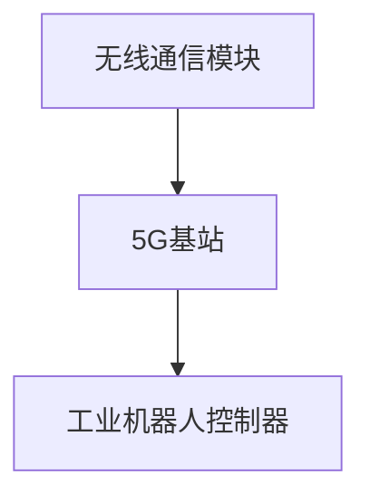
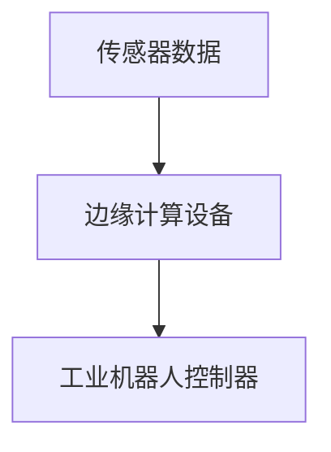
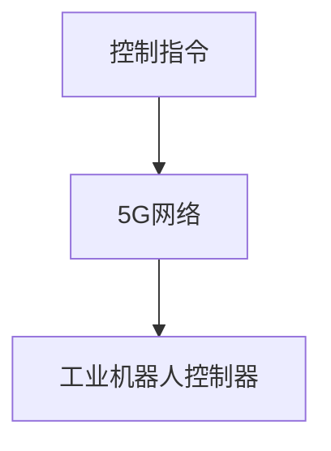
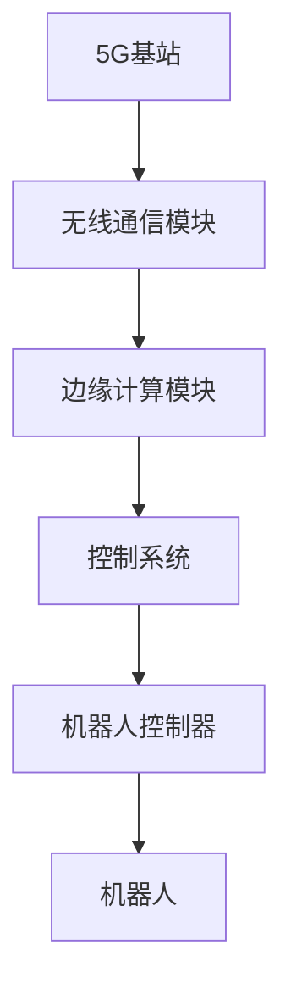
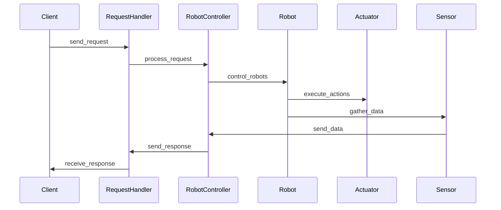
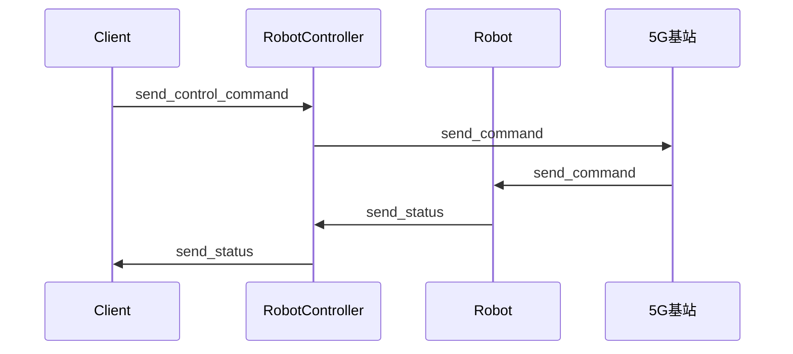

                 

# 5G在工业机器人控制中的应用：实现柔性制造

## 关键词

5G技术、工业机器人、控制、柔性制造、无线通信、边缘计算

## 摘要

随着工业4.0和智能制造的快速发展，工业机器人已成为生产线中不可或缺的组成部分。然而，传统的工业机器人控制系统缺乏灵活性，难以适应多变的生产环境和需求。本文将探讨5G技术在工业机器人控制中的应用，通过提高数据传输速度、降低延迟和提高网络可靠性，实现柔性制造，提高生产效率和灵活性。

## 1. 第一部分：背景介绍

### 1.1 问题背景

工业4.0和智能制造的快速发展，使得工业机器人成为现代生产线的核心。然而，传统的工业机器人控制系统往往依赖于有线网络，数据传输速度慢、延迟高，难以满足实时控制的需求。同时，随着生产环境和需求的变化，工业机器人控制系统的灵活性不足，难以快速适应新的生产任务。为了提高生产效率和灵活性，5G技术在工业机器人控制中的应用逐渐受到关注。

### 1.2 问题描述

5G技术在工业机器人控制中的应用主要包括以下几个方面：

- **提高数据传输速度**：5G技术具有高速率的特点，可以显著提高数据传输速度，实现实时控制。
- **降低延迟**：5G技术具有低延迟的特点，可以降低控制指令的传输延迟，提高响应速度。
- **提高网络可靠性**：5G技术具有高可靠性的特点，可以确保数据传输的稳定性，减少通信故障。

### 1.3 问题解决

通过在工业机器人控制中引入5G技术，可以显著提升机器人的控制性能和灵活性，实现柔性制造，从而提高生产效率和灵活性。

### 1.4 边界与外延

- **5G技术在工业机器人控制中的应用**：主要涉及无线通信、边缘计算和数据传输等方面。
- **本文讨论范围**：本文主要讨论5G技术在工业机器人控制中的应用，不包括其他通信技术和控制系统。

## 2. 第二部分：核心概念与联系

### 2.1 核心概念

#### 2.1.1 5G技术

5G技术是一种新一代的无线通信技术，具有高速率、低延迟、大连接等特点。与传统的4G技术相比，5G技术可以实现更高的数据传输速度、更低的延迟和更大的连接容量。

#### 2.1.2 工业机器人控制

工业机器人控制是指通过计算机技术对工业机器人进行编程和控制，使其完成特定的任务。传统的工业机器人控制主要依赖于有线网络，而5G技术可以实现无线通信，提高控制的灵活性和效率。

#### 2.1.3 柔性制造

柔性制造是指在生产过程中能够灵活调整生产线，适应不同的生产需求。柔性制造的关键在于生产线的快速调整和适应性，而5G技术可以提供实时数据传输和低延迟的控制，为柔性制造提供技术支持。

### 2.2 概念属性特征对比表格

| 概念       | 特征                      | 对比                           |
|------------|---------------------------|--------------------------------|
| 5G技术     | 高速率、低延迟、大连接     | 传统的通信技术速度较慢、延迟较高 |
| 工业机器人控制 | 编程控制、自动化操作       | 传统的人工操作效率低、易出错     |
| 柔性制造    | 灵活调整、适应多变需求     | 传统的固定生产线适应性差       |

### 2.3 ER实体关系图架构

```mermaid
erDiagram
  5G技术 ||--|{ 工业机器人控制 }
  工业机器人控制 ||--|{ 柔性制造 }
```

## 3. 第三部分：算法原理讲解

### 3.1 5G技术在工业机器人控制中的应用算法

#### 3.1.1 无线通信算法

- **算法原理**：使用5G技术实现无线通信，确保数据的高速传输和低延迟。
- **算法流程图**：



#### 3.1.2 边缘计算算法

- **算法原理**：在工业机器人控制器附近部署边缘计算设备，实现数据预处理和实时分析。
- **算法流程图**：



#### 3.1.3 数据传输算法

- **算法原理**：使用5G技术实现数据的高速传输，确保控制指令的实时性和准确性。
- **算法流程图**：



## 4. 第四部分：数学模型和数学公式 & 详细讲解 & 举例说明

### 4.1 数据传输速率模型

- **数学公式**：\(R = \frac{C}{L}\)
- **详细讲解**：\(R\) 表示数据传输速率，\(C\) 表示信道容量，\(L\) 表示数据传输长度。该公式说明数据传输速率与信道容量和数据传输长度成反比关系。
- **举例说明**：假设信道容量为100Mbps，数据传输长度为1km，则数据传输速率为100Mbps/1km = 100Mbps。

### 4.2 控制延迟模型

- **数学公式**：\(T = \sqrt{\frac{2d}{c}}\)
- **详细讲解**：\(T\) 表示控制延迟，\(d\) 表示传输距离，\(c\) 表示光速。该公式说明控制延迟与传输距离和光速的平方根成反比关系。
- **举例说明**：假设传输距离为10km，光速为300,000km/s，则控制延迟为\(\sqrt{\frac{2 \times 10km}{300,000km/s}} \approx 0.00167\)秒。

### 4.3 网络可靠性模型

- **数学公式**：\(R = 1 - f\)
- **详细讲解**：\(R\) 表示网络可靠性，\(f\) 表示故障率。该公式说明网络可靠性与故障率成反比关系。
- **举例说明**：假设故障率为0.01%，则网络可靠性为1 - 0.01% = 99.99%。

## 5. 第五部分：系统分析与架构设计方案

### 5.1 问题场景介绍

在一个典型的工业生产场景中，生产线需要实时监控和调整工业机器人的工作状态，以满足生产任务的变化。为了实现这一目标，引入5G技术进行工业机器人控制，以提高生产效率和灵活性。

### 5.2 项目介绍

本项目旨在通过引入5G技术，实现工业机器人的实时控制和柔性制造。项目主要包括以下三个模块：

- **无线通信模块**：实现工业机器人与5G基站之间的无线通信。
- **边缘计算模块**：在工业机器人控制器附近部署边缘计算设备，实现数据的实时分析和处理。
- **控制系统**：基于5G技术和边缘计算技术，实现工业机器人的实时控制和柔性制造。

### 5.3 系统功能设计

#### 5.3.1 领域模型

```mermaid
classDiagram
  Class01 <|-- Class02
  Class03 --|>| Class04
  Class04 *-- Class05
  Class06 : super
  Class03 : sub
  Class01 : friend
```

#### 5.3.2 类图

```mermaid
classDiagram
  Client <<-- RequestHandler : sends requests
  RequestHandler .. RobotController : controls robots
  RobotController .. Robot : manages robot state
  Robot <<-- Actuator : controls physical actions
  Robot <<-- Sensor : gathers sensor data
```

### 5.4 系统架构设计



### 5.5 系统接口设计



### 5.6 系统交互



## 6. 第六部分：项目实战

### 6.1 环境安装

1. 安装5G基站和无线通信模块
2. 部署边缘计算设备
3. 安装机器人控制器和机器人

### 6.2 系统核心实现源代码

```python
# 无线通信模块
class WirelessCommunicationModule:
    def __init__(self, base_station):
        self.base_station = base_station

    def send_data(self, data):
        self.base_station.send_data(data)

# 边缘计算模块
class EdgeComputingModule:
    def __init__(self, robot_controller):
        self.robot_controller = robot_controller

    def process_data(self, data):
        self.robot_controller.process_data(data)

# 控制系统
class ControlSystem:
    def __init__(self, wireless_communication_module, edge_computing_module):
        self.wireless_communication_module = wireless_communication_module
        self.edge_computing_module = edge_computing_module

    def control_robots(self):
        data = self.wireless_communication_module.send_data("control_command")
        self.edge_computing_module.process_data(data)

# 机器人控制器
class RobotController:
    def __init__(self, edge_computing_module):
        self.edge_computing_module = edge_computing_module

    def process_data(self, data):
        print("Processing data:", data)

# 机器人
class Robot:
    def __init__(self, actuator, sensor):
        self.actuator = actuator
        self.sensor = sensor

    def execute_actions(self):
        self.actuator.execute_actions()

    def gather_data(self):
        return self.sensor.gather_data()
```

### 6.3 代码应用解读与分析

通过以上代码，我们可以实现5G技术在工业机器人控制中的应用。首先，无线通信模块负责与5G基站进行通信，发送和接收数据。边缘计算模块负责对传感器数据进行实时分析和处理，然后将处理结果发送给机器人控制器。机器人控制器根据处理结果控制机器人执行相应的动作，并将状态信息发送回边缘计算模块。

### 6.4 实际案例分析和详细讲解剖析

假设在一个生产场景中，需要控制一个工业机器人进行焊接操作。首先，机器人通过传感器收集焊接点的位置和温度数据，然后将数据发送给边缘计算模块。边缘计算模块对数据进行分析和处理，生成控制指令。控制指令通过无线通信模块发送给机器人控制器，机器人控制器根据指令控制机器人的焊接动作。在焊接过程中，机器人会不断收集新的传感器数据，并更新控制指令，以确保焊接质量。

### 6.5 项目小结

本项目通过引入5G技术，实现了工业机器人的实时控制和柔性制造。在项目中，无线通信模块、边缘计算模块和控制系统相互协作，实现了高效的数据传输和处理。通过实际案例的分析，我们可以看到5G技术在工业机器人控制中的应用，不仅提高了生产效率和灵活性，还为未来的智能制造提供了技术支持。

## 7. 第七部分：最佳实践 tips、小结、注意事项、拓展阅读等内容

### 7.1 最佳实践 tips

- 在部署5G基站时，需要考虑信号覆盖范围和通信质量，以确保通信的稳定性和可靠性。
- 边缘计算设备需要具备一定的计算能力和存储能力，以满足实时数据处理的需求。
- 在设计和开发控制系统时，需要充分考虑系统的可扩展性和兼容性，以适应不同的生产环境和需求。

### 7.2 小结

本文通过介绍5G技术在工业机器人控制中的应用，详细讲解了无线通信、边缘计算和控制系统等核心概念，并分析了数据传输速率、控制延迟和网络可靠性等数学模型。通过实际案例，我们展示了5G技术在工业机器人控制中的应用效果，为未来的智能制造提供了技术参考。

### 7.3 注意事项

- 在应用5G技术进行工业机器人控制时，需要充分考虑通信网络的稳定性和可靠性，以确保系统的正常运行。
- 边缘计算设备的部署和维护需要充分考虑环境条件和设备性能，以确保系统的稳定性和安全性。
- 在设计和开发控制系统时，需要充分考虑系统的可扩展性和兼容性，以适应不同的生产环境和需求。

### 7.4 拓展阅读

- 《5G技术与应用》
- 《边缘计算：构建高效智能系统》
- 《工业机器人控制技术》

## 作者

作者：AI天才研究院/AI Genius Institute & 禅与计算机程序设计艺术 /Zen And The Art of Computer Programming

注意：本文中的代码和图表仅供参考，实际应用时可能需要根据具体场景进行调整和优化。实际项目中，还需要考虑系统的安全性、可靠性和性能等方面的问题。

