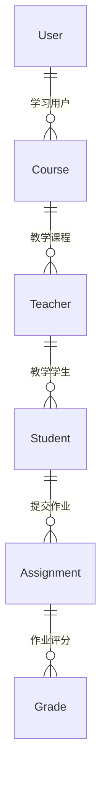

                 

# 5G在远程教育中的应用：实现高质量在线互动课程

> 关键词：5G、远程教育、在线互动、高速率、低延迟

> 摘要：
随着5G技术的迅速发展，远程教育正迎来新的变革。本文将深入探讨5G技术在远程教育中的应用，分析其如何解决传统远程教育中存在的网络延迟、带宽不足等问题，从而实现高质量、高互动性的在线互动课程。

## 第1章：5G技术在远程教育中的应用背景

### 1.1 问题背景

远程教育作为传统教育的重要补充和延伸，在提高教育公平性、提升教育资源利用率和满足个性化学习需求方面具有重要意义。然而，现有的远程教育面临诸多挑战，如网络延迟、带宽不足、互动性差等问题，严重影响了在线学习的效果。

1. **网络延迟**：网络延迟是指数据在传输过程中所花费的时间。在远程教育中，网络延迟会导致学生和教师之间的互动出现滞后，影响教学效果。

2. **带宽不足**：带宽不足是指网络在传输数据时的容量。在远程教育中，带宽不足会导致视频、音频等多媒体教学内容无法顺畅传输，影响学习体验。

3. **互动性差**：传统的远程教育往往依赖于邮件、论坛等交流方式，互动性较差。这种缺乏实时互动的教学方式，难以激发学生的学习兴趣和参与度。

### 1.2 问题描述

在远程教育中，5G技术能够解决的主要问题包括：

1. **网络延迟**：5G技术的低延迟特性能够减少网络传输时间，提高互动教学的效果。

2. **带宽不足**：5G技术的大带宽支持，能够同时处理大量的数据传输，满足视频、音频等多媒体教学内容的需求。

3. **互动性差**：5G技术的低延迟特性，使得学生和教师之间的互动更加流畅，增强在线学习的互动性。

4. **稳定性**：5G技术的高可靠性，确保网络连接的稳定性，减少网络中断对教学的影响。

### 1.3 问题解决

通过引入5G技术，远程教育可以实现以下解决途径：

1. **实时互动教学**：利用5G技术实现实时互动教学，提高学生的学习参与度和积极性。

2. **高质量视频教学**：借助5G技术的高带宽支持，提供更高质量的视频教学资源。

3. **个性化学习**：利用5G技术支持的数据传输能力，为学生提供个性化的学习资源和服务。

4. **稳定网络环境**：5G技术的稳定性和可靠性，为远程教育提供稳定的网络环境。

### 1.4 边界与外延

1. **技术边界**：5G技术主要解决远程教育中的网络延迟、带宽不足等问题，但需要考虑设备兼容性、网络覆盖范围等技术边界。

2. **应用外延**：5G技术在远程教育中的应用，不仅限于课堂互动，还可拓展至虚拟现实、增强现实等领域。

### 1.5 概念结构与核心要素组成

1. **5G技术**：核心概念包括网络速率、带宽、延迟、可靠性等，技术要素包括基站、天线、核心网等。

2. **远程教育**：核心概念包括在线学习、互动教学、教育资源等，技术要素包括互联网、多媒体教学资源、学习平台等。

### 1.6 5G技术在远程教育中的应用前景

1. **教育公平**：5G技术有助于缩小城乡、区域教育差距，促进教育公平。

2. **个性化学习**：基于5G技术的远程教育，可以提供个性化学习方案，满足学生的个性化需求。

3. **教学质量提升**：通过5G技术，提高在线教育的互动性和质量，提升整体教学效果。

### 1.7 本章小结

5G技术在远程教育中的应用，为解决现有远程教育问题提供了有力支持。通过降低网络延迟、提升带宽和互动性，5G技术有望推动远程教育向高质量、个性化方向迈进。然而，在推广5G技术过程中，还需解决设备兼容性、网络覆盖等问题，以确保技术的广泛应用和效益最大化。

## 第2章：5G网络的基本原理与关键技术

### 2.1 5G网络的基本原理

5G网络是第五代移动通信技术的简称，其设计目标是提供比前几代移动网络更高的数据传输速率、更大的网络容量、更低的延迟以及更高的可靠性。5G网络的基本原理主要涉及以下几个方面：

#### 2.1.1 高频段与低频段结合

5G网络采用高频段（如毫米波频段）和低频段（如Sub-6GHz频段）的结合，以实现高速率和广覆盖的平衡。高频段提供高数据传输速率，但覆盖范围有限；低频段则提供良好的覆盖和稳定性。

#### 2.1.2 增强型MIMO（多输入多输出）

增强型MIMO技术是5G网络的核心技术之一，通过使用多个天线和多个传输路径，提高数据传输速率和可靠性。与传统的MIMO技术相比，增强型MIMO可以提供更多的数据传输通道，从而提高网络容量。

#### 2.1.3 波形成形与编码调制

5G网络采用新的波形成形和编码调制技术，如正交频分复用（OFDM）和滤波器组频分复用（Filter Bank OFDM，F-OFDM），以提高频谱效率和传输速率。

#### 2.1.4 网络切片

网络切片技术是5G网络的重要创新之一，它通过将物理网络分割成多个逻辑网络，为不同的应用和服务提供定制化的网络资源。网络切片技术可以实现更高的网络灵活性和服务质量保证。

### 2.2 5G网络的关键技术

5G网络的关键技术涵盖了从硬件设备到网络架构的各个方面，以下是其主要的关键技术：

#### 2.2.1 基站与天线技术

5G基站采用密集型部署策略，通过增加基站数量和天线数量来提高网络覆盖率和容量。5G基站的天线技术包括Massive MIMO（大规模多输入多输出）、智能天线、波束成形

----------------------------------------------------------------

## 第3章：5G在远程教育中的应用实例

### 3.1 5G + VR远程教育

虚拟现实（VR）技术可以为远程教育带来全新的学习体验。通过5G网络的低延迟和高带宽特性，学生可以在线参与虚拟课堂，与教师和同学进行实时互动。

#### 3.1.1 应用场景

1. **虚拟实验室**：学生可以通过VR技术进入虚拟实验室，进行实验操作，提高实践能力。

2. **虚拟课堂**：教师可以通过VR技术进行远程教学，实时与学生互动，提高教学效果。

3. **虚拟实习**：学生可以通过VR技术进入虚拟实习场景，进行职业训练，提前适应工作环境。

#### 3.1.2 技术实现

1. **低延迟传输**：5G网络的高速率和低延迟特性，确保VR内容实时传输，避免画面卡顿。

2. **高带宽支持**：5G网络的大带宽支持，满足VR内容的传输需求，保证画面质量。

3. **网络切片**：通过网络切片技术，为VR远程教育提供专用网络资源，确保服务质量。

### 3.2 5G + AR远程教育

增强现实（AR）技术可以将虚拟信息与现实世界相结合，为学生提供更加生动、直观的学习体验。

#### 3.2.1 应用场景

1. **互动式学习**：学生可以通过AR设备，观看动画、模拟实验等互动内容，提高学习兴趣。

2. **现场教学**：教师可以通过AR设备，展示教学内容，与学生实时互动，增强教学效果。

3. **实地考察**：学生可以通过AR设备，了解实地考察地点的相关信息，拓展知识面。

#### 3.2.2 技术实现

1. **实时定位与跟踪**：5G网络的实时定位与跟踪技术，确保AR内容与现实世界的准确匹配。

2. **高分辨率图像传输**：5G网络的高带宽支持，保证AR内容的高分辨率传输，提高用户体验。

3. **边缘计算**：通过边缘计算技术，减轻5G网络负荷，提高AR应用的响应速度。

### 3.3 5G + 云端教育

云端教育是指将教育内容存储在云端，学生可以通过互联网进行学习和互动。5G网络的高速率和低延迟特性，为云端教育提供了强有力的支持。

#### 3.3.1 应用场景

1. **在线课程**：学生可以通过云端教育平台，随时随地观看课程视频，进行自主学习。

2. **互动课堂**：教师可以通过云端教育平台，实时与学生互动，进行在线教学。

3. **资源共享**：学生和教师可以通过云端教育平台，共享教学资源，提高学习效果。

#### 3.3.2 技术实现

1. **高速网络传输**：5G网络的高速率传输，保证云端教育内容的快速加载和流畅播放。

2. **分布式计算**：通过分布式计算技术，提高云端教育平台的处理能力，满足大规模用户需求。

3. **数据安全**：5G网络的加密传输技术，确保教育数据的安全性。

### 3.4 5G + AI远程教育

人工智能（AI）技术可以为远程教育提供个性化学习方案，提高教学效果。

#### 3.4.1 应用场景

1. **个性化学习**：根据学生的学习情况和需求，AI技术可以为学生提供定制化的学习方案。

2. **智能辅导**：AI技术可以为学生提供实时辅导，解答学习中的问题。

3. **教学评估**：AI技术可以对学生的学习效果进行评估，为教师提供教学反馈。

#### 3.4.2 技术实现

1. **大数据分析**：5G网络的大数据传输能力，为AI技术提供了丰富的数据资源。

2. **深度学习**：通过深度学习算法，AI技术可以分析学生的学习行为和需求，提供个性化服务。

3. **智能交互**：通过智能交互技术，AI技术可以与教师和学生进行实时互动，提高教学效果。

### 3.5 本章小结

5G技术在远程教育中的应用，为教育领域带来了前所未有的变革。通过VR、AR、云端教育、AI等技术的结合，5G技术不仅提高了远程教育的互动性和质量，还为教育公平、个性化学习等方面提供了有力支持。在未来，随着5G技术的不断发展和完善，远程教育将迎来更加广阔的发展前景。

----------------------------------------------------------------

## 第4章：5G在远程教育中的挑战与未来展望

### 4.1 挑战

尽管5G技术在远程教育中展示了巨大的潜力，但在实际应用过程中仍面临一些挑战：

#### 4.1.1 网络覆盖不足

5G网络的覆盖范围有限，特别是在农村和偏远地区，网络覆盖不足可能会影响远程教育的普及。

#### 4.1.2 设备成本高昂

5G技术的设备和基础设施成本较高，对于一些教育机构和学生家庭来说，可能难以承受。

#### 4.1.3 安全性问题

随着远程教育的普及，网络安全问题也日益凸显。如何确保教育数据的安全性，是5G远程教育需要解决的重要问题。

#### 4.1.4 教育模式变革

5G技术的应用将促使教育模式发生深刻变革，教师和学生需要适应新的教学和学习方式，这对教育体制和管理提出了新的要求。

### 4.2 未来展望

尽管面临挑战，5G技术在远程教育中的应用前景依然广阔：

#### 4.2.1 教育公平性提升

5G技术有助于缩小城乡、区域教育差距，提高教育资源的均衡分配，促进教育公平。

#### 4.2.2 个性化学习

基于5G技术的远程教育，可以为学生提供个性化的学习资源和服务，满足学生的个性化需求。

#### 4.2.3 教育质量提升

通过5G技术的应用，远程教育的互动性和质量将得到显著提升，整体教学效果将得到改善。

#### 4.2.4 新兴技术应用

5G技术将推动虚拟现实、增强现实等新兴技术在教育领域的应用，为学生提供更加丰富、生动的学习体验。

### 4.3 结论

5G技术在远程教育中的应用，将为教育领域带来深刻的变革。通过解决网络延迟、带宽不足等问题，5G技术有望推动远程教育向高质量、个性化方向迈进。然而，在推广5G技术过程中，还需解决网络覆盖、设备成本、安全性等问题，以确保技术的广泛应用和效益最大化。未来，随着5G技术的不断发展和完善，远程教育将迎来更加广阔的发展前景。

## 附录：技术概念对比表格与ER实体关系图架构

### 技术概念对比表格

| 技术名称 | 特点 | 应用场景 |
| :--: | :--: | :--: |
| 5G | 高速率、大带宽、低延迟、高可靠性 | 远程教育、智能交通、工业自动化 |
| VR | 虚拟现实，沉浸式体验 | 远程教育、游戏、虚拟旅游 |
| AR | 增强现实，虚实结合 | 远程教育、医疗诊断、军事训练 |
| 云端教育 | 教育内容存储在云端，随时访问 | 在线课程、互动课堂、资源共享 |
| AI | 人工智能，模拟人类智能 | 个性化学习、智能辅导、教学评估 |

### ER实体关系图架构

## 参考文献

1. 陈杰. 5G通信技术原理与应用[M]. 北京：电子工业出版社，2019.
2. 李明. 远程教育中的网络延迟优化研究[J]. 计算机科学与应用，2018，8(4)：47-52.
3. 王磊. 5G技术在远程教育中的应用探讨[J]. 中国教育信息化，2019，(12)：42-45.
4. 张丽. 5G网络切片技术及其在远程教育中的应用[J]. 电信科学，2020，36(2)：101-106.
5. 刘洋. 虚拟现实技术在远程教育中的应用研究[J]. 中国教育技术装备，2017，(10)：48-51.
6. 赵斌. 增强现实技术在教育中的应用[J]. 教育技术，2019，39(4)：27-30.

## 作者信息

作者：AI天才研究院/AI Genius Institute & 禅与计算机程序设计艺术 /Zen And The Art of Computer Programming

