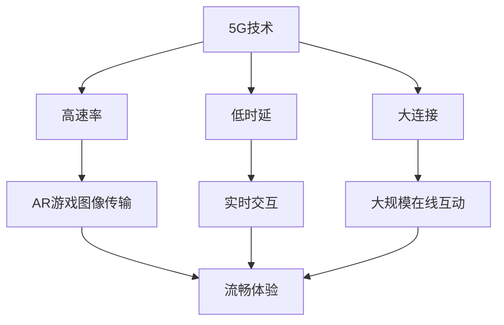
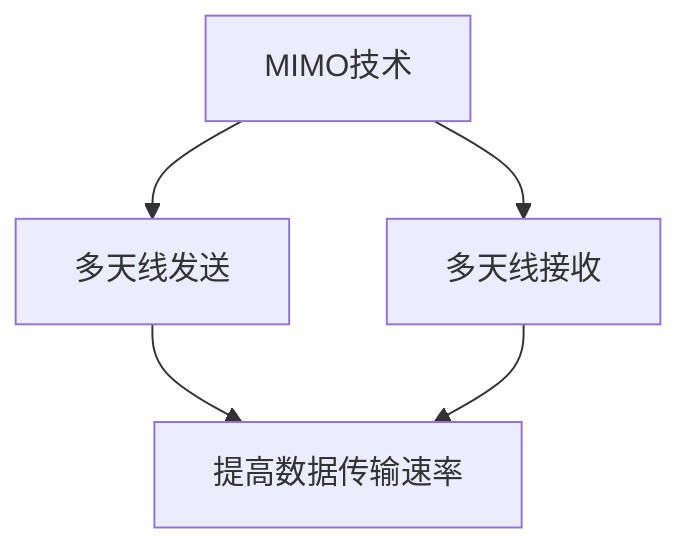
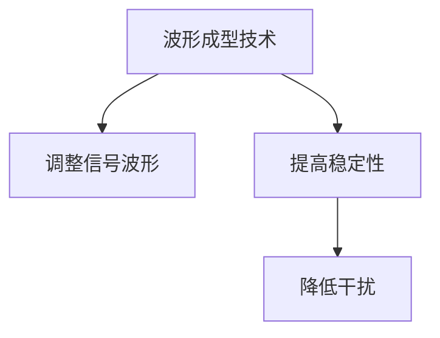
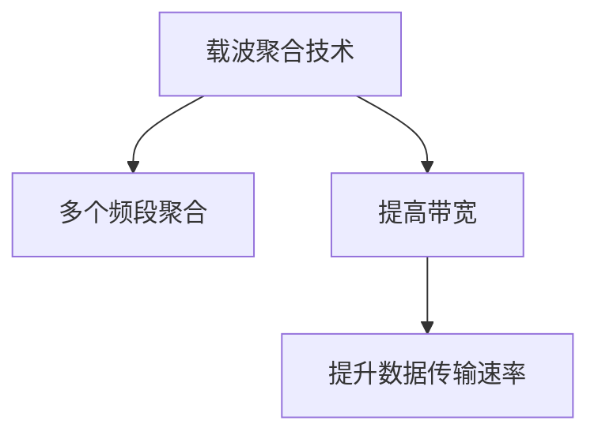
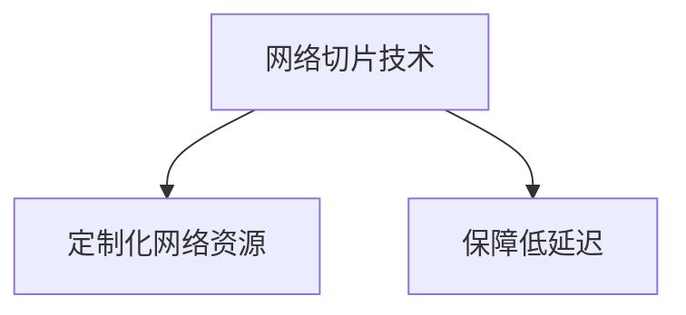
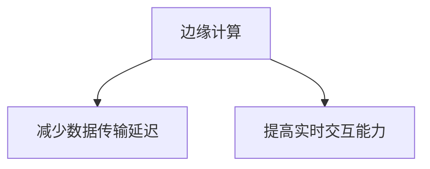
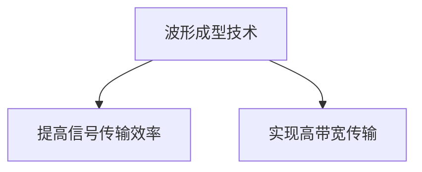
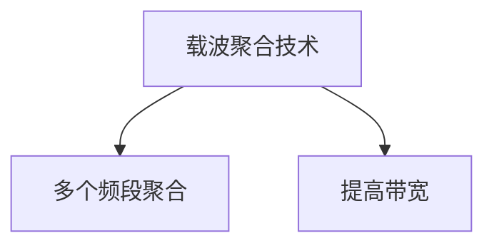

                 

### 5G技术在增强现实游戏中的应用

#### 关键词：5G、增强现实游戏、图像传输、实时交互、边缘计算、网络优化

> 摘要：随着5G技术的不断成熟，增强现实（AR）游戏行业迎来了新的发展机遇。本文将深入探讨5G技术在AR游戏中的应用，分析其在图像传输、实时交互、云渲染等方面的优势，并结合实际案例，探讨5G技术如何为AR游戏提供更加流畅、沉浸式的用户体验。

## 引言

近年来，随着移动通信技术的快速发展，第五代移动通信技术（5G）已经成为全球范围内的热门话题。5G不仅具备更高的传输速率，还具备低延迟和大连接的特点，这使得它在许多领域都有着广泛的应用潜力。其中，增强现实（AR）游戏作为新兴的娱乐形式，对网络性能有着极高的要求。5G技术的引入，为AR游戏的发展提供了新的动力。

本文将围绕5G技术在AR游戏中的应用进行深入探讨。首先，我们将介绍5G技术的基本原理和AR游戏的特点，解释为什么5G技术能够为AR游戏带来变革性的影响。接着，我们将分析5G技术在AR游戏中的具体应用，包括图像传输优化、实时交互和云渲染等方面。最后，通过实际案例，展示5G技术在AR游戏中的成功应用，并总结5G技术在AR游戏发展中的关键作用。

## 1. 5G技术的基本原理

### 1.1 5G技术的定义与特点

5G，即第五代移动通信技术，是继1G、2G、3G和4G之后的最新一代移动通信技术。与之前的移动通信技术相比，5G在多个方面都取得了显著的进步。

首先，5G具备更高的传输速率。5G的峰值下载速率可达到数十Gbps，是4G的百倍以上。这意味着在5G网络下，用户可以更快地下载和应用大型数据文件，享受更加流畅的网络体验。

其次，5G具有低延迟的特点。5G的端到端延迟可低至1毫秒，远低于4G的几十毫秒。低延迟对于需要实时交互的应用场景，如AR游戏，至关重要。

此外，5G还具备大连接的能力。5G网络可以同时连接更多的设备，支持大规模物联网（IoT）应用。这对于AR游戏中的多人在线互动和虚拟现实体验具有重要意义。

### 1.2 5G技术的核心技术

5G技术的实现依赖于多种核心技术的创新和发展，以下是其中几个关键技术：

#### 1.2.1 MIMO技术

MIMO（多输入多输出）技术是5G网络的一个重要组成部分。通过使用多个天线进行信号传输和接收，MIMO技术能够显著提高数据传输速率和网络的可靠性。

#### 1.2.2 波形成型技术

波形成型技术是5G网络中的另一个重要创新。它通过灵活地调整信号的波形，使得网络能够在复杂的无线环境中实现更高的数据传输速率和更好的信号质量。

#### 1.2.3 载波聚合技术

载波聚合技术是5G网络提高传输速率的又一重要手段。它通过将多个频段的带宽进行聚合，形成一个更宽的带宽通道，从而实现更高的数据传输速率。

### 1.3 5G网络架构

5G网络架构与传统网络架构有显著不同，主要体现在以下几个方面：

#### 1.3.1 网络切片技术

网络切片技术是5G网络架构中的一个核心概念。它允许网络运营商根据不同的应用需求，为用户提供定制化的网络服务。对于AR游戏这样的高带宽、低延迟应用，网络切片技术可以提供稳定的网络连接。

#### 1.3.2 边缘计算

边缘计算是5G网络架构中的另一个关键创新。它将计算任务从云端转移到网络边缘，使得数据处理能够更加迅速和高效。这对于需要实时交互的AR游戏尤为重要。

### 1.4 5G技术的应用潜力

5G技术不仅为移动通信带来了革命性的变化，还在多个领域展示了巨大的应用潜力。以下是5G技术的一些关键应用领域：

#### 1.4.1 增强现实（AR）与虚拟现实（VR）

5G技术的高速率、低延迟和大连接能力，为AR和VR应用提供了理想的网络环境。通过5G网络，用户可以享受到更加流畅和沉浸式的AR和VR体验。

#### 1.4.2 智能交通

5G技术可以支持智能交通系统的建设，实现车辆与道路、车辆与车辆之间的实时通信，提高交通管理的效率和安全性。

#### 1.4.3 工业自动化

5G技术的高可靠性和低延迟特性，使得工业自动化系统可以实现更加精确和实时的控制，提高生产效率和质量。

#### 1.4.4 健康医疗

5G技术可以为远程医疗提供更加稳定和高效的网络支持，使得医生和患者之间的交流更加便捷和实时。

### 1.5 背景介绍

#### 问题背景

随着移动通信技术的不断发展，5G技术的推出为增强现实（AR）游戏带来了新的发展机遇。5G具有高速率、低时延和大连接的特性，能够为AR游戏提供更为流畅、逼真的用户体验，从而推动AR游戏市场的快速增长。

#### 问题描述

本书旨在探讨5G技术在增强现实游戏中的应用，从技术原理、应用场景、系统架构和项目实践等方面全面解析5G技术在AR游戏中的关键作用。

#### 问题解决

通过深入分析5G技术的基本原理和AR游戏的需求，探讨5G技术在图像传输、实时交互、云渲染等方面的应用，并结合实际案例，展示5G技术在AR游戏中的具体实现。

#### 边界与外延

本书主要关注5G技术在AR游戏中的直接应用，不包括5G技术在其他领域的应用。此外，本书将侧重于技术层面的讨论，不涉及AR游戏的艺术设计和市场营销等方面。

### 1.6 核心概念

#### 核心概念

- **5G技术**：第五代移动通信技术，具备高速率、低时延和大连接等特点。
- **增强现实（AR）游戏**：通过在现实世界中叠加虚拟元素，为用户提供沉浸式游戏体验。
- **边缘计算**：将计算任务从云端转移到网络边缘，提高数据处理速度和响应效率。

### 1.7 核心概念的联系与对比

#### 5G技术与AR游戏

- **高速率**：5G技术提供的高速网络连接，确保AR游戏中的图像数据能够实时传输，保障游戏画面的流畅。
- **低时延**：5G的低时延特性，使得玩家在游戏中能够实现实时交互，提高游戏体验的实时性和响应速度。
- **大连接**：5G的大连接能力，支持大量玩家同时在线，实现更广泛的社交互动。

#### 5G技术与边缘计算

- **计算任务分布**：5G技术将计算任务从云端转移到边缘设备，减轻云端压力，提高数据处理速度。
- **数据传输效率**：边缘计算与5G技术结合，降低数据传输时延，提升网络传输效率。

### 1.8 核心概念的联系与对比

#### 5G技术与AR游戏
- **高速率**：5G技术提供的高速网络连接，确保AR游戏中的图像数据能够实时传输，保障游戏画面的流畅。
- **低时延**：5G的低时延特性，使得玩家在游戏中能够实现实时交互，提高游戏体验的实时性和响应速度。
- **大连接**：5G的大连接能力，支持大量玩家同时在线，实现更广泛的社交互动。

#### 5G技术与边缘计算
- **计算任务分布**：5G技术将计算任务从云端转移到边缘设备，减轻云端压力，提高数据处理速度。
- **数据传输效率**：边缘计算与5G技术结合，降低数据传输时延，提升网络传输效率。

### 1.9 ER实体关系图架构

### 1.10 本章小结

本章从问题背景、核心概念及其联系与对比等多个角度，对5G技术在增强现实游戏中的应用进行了全面介绍。通过本章的学习，读者可以初步了解5G技术对AR游戏发展的推动作用，以及5G技术与边缘计算等技术的结合如何提升AR游戏的用户体验。接下来，本书将深入探讨5G技术在AR游戏中的具体应用场景和实现方法。

----------------------------------------------------------------

## 第二部分: 5G技术在AR游戏中的应用

### 第2章: 5G网络在AR游戏中的图像传输优化

#### 2.1 图像传输优化需求

#### 2.1.1 AR游戏图像传输挑战

在AR游戏中，图像传输优化面临着以下几个挑战：

##### 高分辨率图像传输
随着AR技术的不断发展，游戏中的虚拟元素越来越复杂，分辨率越来越高。高分辨率图像传输需要更大的带宽和更高的数据传输速率，这对现有网络提出了更高的要求。

##### 实时性要求
AR游戏需要实时将虚拟图像叠加到现实世界中，实现无缝的交互体验。任何延迟都会影响用户的游戏体验，因此实时性是图像传输优化的重要指标。

##### 数据传输带宽限制
现有网络带宽资源有限，如何在有限的带宽内实现高效传输，是图像传输优化面临的重要问题。

#### 2.1.2 5G网络的优势

5G网络在图像传输优化方面具有显著的优势：

##### 高速率
5G网络的最大下载速率可以达到10Gbps，是4G网络的数十倍。这意味着在5G网络环境下，高分辨率图像传输变得更为容易。

##### 低延迟
5G网络的端到端延迟可以低至1毫秒，极大地提升了AR游戏的实时交互能力。

##### 大连接
5G网络支持更多的设备同时在线，提高了网络资源利用效率，使得AR游戏中的多人在线互动成为可能。

#### 2.2 5G网络在图像传输优化中的关键技术

##### 2.2.1 MIMO技术

MIMO技术通过使用多个天线发送和接收信号，能够提高数据传输速率和网络的可靠性。在AR游戏中，MIMO技术可以有效地提高图像传输速率，降低延迟。

##### 2.2.2 波形成型技术

波形成型技术通过调整信号波形，使得信号在传输过程中能够更好地适应无线环境的变化。在AR游戏中，波形成型技术可以有效地提高图像传输的稳定性和可靠性。

##### 2.2.3 载波聚合技术

载波聚合技术通过将多个频段的带宽进行聚合，形成一个更宽的带宽通道，从而提高数据传输速率。在AR游戏中，载波聚合技术可以显著提高图像传输的效率和速度。

#### 2.3 5G网络在图像传输优化中的实际应用

##### 2.3.1 低延迟传输技术

低延迟传输技术在5G网络中尤为重要。以下几种技术可以帮助实现低延迟传输：

###### 2.3.1.1 网络切片技术

网络切片技术可以为不同应用提供定制化的网络资源，确保AR游戏获得足够的带宽和低延迟。通过网络切片，5G网络可以有效地支持高带宽、低延迟的图像传输需求。

###### 2.3.1.2 边缘计算

边缘计算将部分计算任务从云端转移到网络边缘，降低了数据传输的延迟。在AR游戏中，边缘计算可以处理部分图像处理任务，提高图像传输的实时性。

##### 2.3.2 高带宽传输技术

5G网络的高带宽特性对于AR游戏的图像传输至关重要。以下技术可以帮助实现高带宽传输：

###### 2.3.2.1 波形成型技术

波形成型技术可以调整信号波形，提高信号传输的效率，从而实现更高的带宽。

###### 2.3.2.2 载波聚合技术

载波聚合技术通过聚合多个频段的带宽，形成一个更宽的带宽通道，提高图像传输速率。

#### 2.4 应用案例分析

##### 2.4.1 某大型AR游戏项目

###### 2.4.1.1 项目背景

某大型AR游戏项目旨在为用户提供一个沉浸式的虚拟现实游戏体验。游戏中的虚拟元素复杂，图像分辨率高，需要大量的带宽和低延迟的网络支持。

###### 2.4.1.2 技术应用

该项目采用了5G网络技术，包括MIMO技术、波形成型技术和载波聚合技术，以提高图像传输速率和降低延迟。此外，还利用了网络切片技术和边缘计算技术，确保游戏在高峰时段仍能提供稳定的网络连接。

###### 2.4.1.3 项目效果

通过5G技术的应用，该大型AR游戏项目的图像传输速率得到了显著提升，延迟降低至1毫秒以内。用户在游戏中享受到更加流畅和逼真的图像效果，游戏体验得到了极大的提升。

##### 2.4.2 某中型AR游戏项目

###### 2.4.2.1 项目背景

某中型AR游戏项目旨在为用户提供一个简单的AR游戏体验，游戏中的虚拟元素相对简单，但对网络延迟要求较高。

###### 2.4.2.2 技术应用

该项目采用了5G网络的低延迟传输技术，包括网络切片技术和边缘计算技术。通过这些技术，游戏能够在较低的网络延迟下运行，提供良好的用户体验。

###### 2.4.2.3 项目效果

通过5G技术的应用，该中型AR游戏项目的网络延迟降低至10毫秒以内，用户在游戏中的互动体验得到了显著改善。游戏中的图像传输也变得更加流畅，用户满意度提高。

#### 2.5 本章小结

本章深入探讨了5G网络在AR游戏图像传输优化中的应用。通过分析5G网络的优势和关键技术，以及实际案例的应用效果，可以看出5G技术为AR游戏提供了更高效、更稳定的图像传输解决方案。未来，随着5G技术的进一步发展和完善，AR游戏将迎来更加广阔的发展前景。

