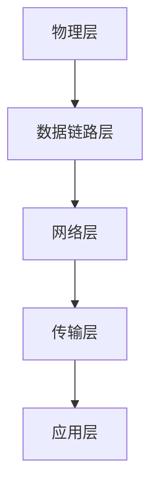
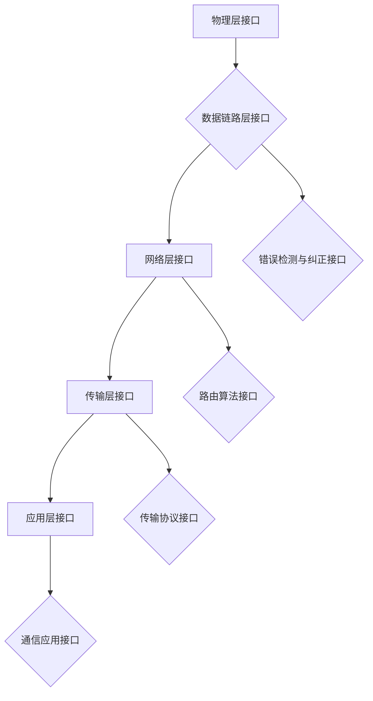
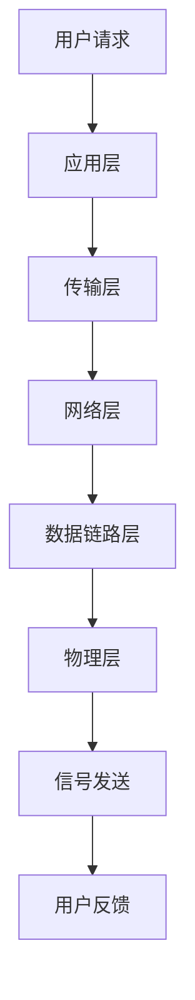

                 

## 6G技术在太空通信中的潜力：实现深空探索的实时通信

> 关键词：6G、太空通信、实时通信、深空探索、技术潜力

> 摘要：
本文将探讨6G技术在太空通信中的应用潜力，特别是实现深空探索中的实时通信。首先，我们将简要介绍6G技术的基本概念和特点，以及太空通信在历史和现代的演变。接着，我们将深入分析6G技术如何解决深空探索中的通信挑战，包括低延迟、高可靠性和大带宽的需求。本文将通过具体的算法、数学模型和系统设计案例，展示6G技术在太空通信中的实际应用。最后，我们将总结6G技术在太空通信中的最佳实践，并提出未来发展的方向。

## 引言

### 6G技术简介

6G，即第六代移动通信技术，是未来通信技术的关键突破。相较于5G，6G在速度、延迟、连接密度和能效方面都有了显著提升。6G技术预计将提供1Tbps的峰值数据速率、毫秒级的通信延迟、千亿设备的连接能力，以及更加绿色和可持续的通信网络。

### 太空通信的重要性

太空通信是深空探索的基石。无论是在地球轨道上的卫星通信，还是在月球、火星等深空目标的研究中，实时、稳定和高效的通信都是必不可少的。传统的通信手段往往面临延迟高、带宽有限、可靠性不足等问题，无法满足深空探索的需求。

### 6G技术在太空通信中的潜力

6G技术的出现为太空通信带来了前所未有的机遇。其高速率、低延迟和大带宽的特点，使得实时通信成为可能。这对于深空探测任务的顺利开展，以及科学数据的实时传输，都具有重要的意义。

### 本文结构

本文将分为以下几个部分：

1. **背景介绍**：介绍6G技术和太空通信的历史背景和发展。
2. **核心概念与联系**：详细阐述6G技术的核心概念和其在太空通信中的应用。
3. **算法与数学模型**：分析6G技术在太空通信中的算法原理和数学模型。
4. **系统分析与设计**：探讨6G太空通信系统的架构和设计。
5. **实战项目**：展示6G技术在太空通信中的实际应用案例。
6. **最佳实践与总结**：总结6G技术在太空通信中的最佳实践，并提出未来发展方向。
7. **结论**：总结全文，强调6G技术在太空通信中的重要性。

## 背景介绍

### 6G技术的历史背景

6G技术的发展可以追溯到5G技术的普及。随着5G技术在2019年正式商用，人们对通信技术的需求不断提升，这促使了6G技术的研发。6G技术的研究主要集中在提高数据传输速率、降低通信延迟、增强网络可靠性和提高连接密度等方面。

### 6G技术的特点

1. **高速率**：6G预计将提供1Tbps的峰值数据速率，这是5G的百倍以上。这样的高速率可以满足未来高带宽应用的需求，如虚拟现实、增强现实、高清视频流等。

2. **低延迟**：6G的目标是将通信延迟降低到毫秒级别。这对于实时通信应用，如远程手术、自动驾驶等，至关重要。

3. **高可靠性**：6G技术将通过先进的编码技术、网络优化和抗干扰设计，提供更高的通信可靠性，确保在恶劣环境下也能稳定通信。

4. **大带宽**：6G技术将提供更大的带宽资源，使得更多设备能够同时连接到网络，满足物联网和智能城市等大规模连接需求。

5. **绿色和可持续**：6G技术将采用更加节能的网络架构和设备，降低能耗，实现绿色和可持续的通信网络。

### 太空通信的历史背景

太空通信的历史可以追溯到20世纪50年代。当时，随着第一颗人造卫星“斯普特尼克1号”的发射，人类开始了对太空通信的探索。早期的太空通信主要是通过地面站和卫星之间的无线电波传输。随着技术的进步，地面站的数量不断增加，通信链路的质量和稳定性也逐步提升。

### 现代太空通信的演变

进入21世纪，现代太空通信取得了显著进展。一方面，卫星数量大幅增加，形成了全球覆盖的卫星通信网络。另一方面，地面通信设施不断升级，包括更先进的地面站、更高效的通信算法和更稳定的传输链路。

1. **卫星通信**：现代太空通信主要依赖于卫星通信。地球同步轨道（GEO）卫星、低地球轨道（LEO）卫星和中地球轨道（MEO）卫星构成了多层次、多类型的卫星通信网络。这些卫星可以覆盖全球范围，提供稳定的通信服务。

2. **地面通信**：地面通信设施在太空通信中也发挥着重要作用。地面站通过高增益天线与卫星进行通信，传输数据和控制信号。现代地面站采用了先进的天线技术和信号处理算法，提高了通信的可靠性和数据传输速率。

3. **互联网协议**：随着互联网技术的发展，现代太空通信开始采用IP协议进行数据传输。这使得太空通信更加灵活和高效，能够支持多种应用场景，如科学数据传输、实时通信、远程控制等。

### 6G技术在太空通信中的潜力

6G技术在太空通信中具有巨大的潜力。其高速率、低延迟、高可靠性和大带宽的特点，使得实时、高效的太空通信成为可能。

1. **高速率**：6G的高速率可以支持高清视频流、大规模数据传输等应用，满足深空探测任务的数据传输需求。

2. **低延迟**：6G的低延迟可以确保实时通信的稳定性和可靠性，这对于深空探测任务的远程操作和实时数据分析至关重要。

3. **高可靠性**：6G的高可靠性可以保证在恶劣环境下通信链路的稳定性，提高太空通信的可用性。

4. **大带宽**：6G的大带宽可以支持更多设备的连接，满足未来物联网和智能城市等大规模连接需求。

总之，6G技术的引入将极大地提升太空通信的能力，为深空探索提供强有力的支持。

## 核心概念与联系

### 6G技术的核心概念

#### 6G的定义

6G，即第六代移动通信技术，是继1G、2G、3G、4G和5G之后的新一代通信技术。6G的目标是实现更高的数据传输速率、更低的通信延迟、更高的网络可靠性和更大的连接密度。

#### 6G的特点

1. **高速率**：6G预计将提供1Tbps的峰值数据速率，这是5G的百倍以上。这样的高速率可以满足未来高带宽应用的需求，如虚拟现实、增强现实、高清视频流等。

2. **低延迟**：6G的目标是将通信延迟降低到毫秒级别。这对于实时通信应用，如远程手术、自动驾驶等，至关重要。

3. **高可靠性**：6G技术将通过先进的编码技术、网络优化和抗干扰设计，提供更高的通信可靠性，确保在恶劣环境下也能稳定通信。

4. **大带宽**：6G技术将提供更大的带宽资源，使得更多设备能够同时连接到网络，满足物联网和智能城市等大规模连接需求。

5. **绿色和可持续**：6G技术将采用更加节能的网络架构和设备，降低能耗，实现绿色和可持续的通信网络。

#### 6G的关键技术

1. **超高频段**：6G将使用超高频段（如24GHz以上），提供更大的带宽资源，以满足高速率的需求。

2. **太赫兹通信**：太赫兹波频段（0.1THz-10THz）具有极高的带宽，是6G技术的重要研究方向。

3. **大规模MIMO**：大规模MIMO技术通过使用大量的天线单元，提高了数据传输速率和通信质量。

4. **边缘计算**：边缘计算将数据处理和存储能力从云端迁移到网络边缘，减少了数据传输延迟，提高了系统的响应速度。

5. **网络切片**：网络切片技术可以将网络资源分割成多个虚拟网络，满足不同应用的需求。

### 6G与太空通信的联系

#### 太空通信中的需求

深空探索对通信系统提出了高要求，主要包括：

1. **低延迟**：实时通信是深空探索的重要需求。低延迟可以确保探测器的操作和控制指令能够迅速传输到地面，从而保证任务的顺利进行。

2. **高可靠性**：太空环境的复杂性和不确定性要求通信系统能够在恶劣环境下稳定运行。

3. **大带宽**：深空探测任务会产生大量数据，需要高带宽的网络传输。

4. **抗干扰能力**：太空通信面临来自宇宙射线、太阳风暴等干扰，需要具备强抗干扰能力。

#### 6G技术如何满足这些需求

1. **低延迟**：6G技术通过超高频段、太赫兹通信和边缘计算等技术，可以显著降低通信延迟，满足深空探索的实时通信需求。

2. **高可靠性**：6G技术采用先进的编码技术和抗干扰设计，提高了通信系统的可靠性，确保在恶劣环境中也能稳定运行。

3. **大带宽**：6G技术的大带宽可以支持大量数据的传输，满足深空探测任务的数据传输需求。

4. **抗干扰能力**：6G技术的抗干扰设计，如自适应波束成形、多载波调制等，提高了通信系统在恶劣环境下的抗干扰能力。

#### ER图：6G与太空通信的关系

以下是一个简化的ER图，展示了6G技术如何与太空通信中的核心要素相联系：

```mermaid
erDiagram
    SpaceCommunication ||--|{ 6GTechnology : 利用 }
    6GTechnology ||--|{ HighBandwidth : 提供更大的带宽 }
    6GTechnology ||--|{ LowLatency : 降低通信延迟 }
    6GTechnology ||--|{ HighReliability : 提高通信可靠性 }
    SpaceCommunication ||--|{ RealTimeCommunication : 实现实时通信 }
```

通过这个ER图，我们可以清晰地看到6G技术在太空通信中的作用和重要性。

## 算法与数学模型

### 6G技术在太空通信中的算法原理

#### MIMO技术

MIMO（多输入多输出）技术是6G通信中的一个关键组成部分。它通过使用多个发射和接收天线，提高了数据传输速率和通信质量。在太空通信中，MIMO技术可以充分利用卫星的多个链路，提高通信的可靠性和数据传输速率。

#### 算法原理

1. **空间复用**：空间复用技术利用多个发射和接收天线之间的空间分离，实现多个并行传输通道，从而提高数据传输速率。

2. **编码与解码**：MIMO系统通过编码技术将信息编码成多个子流，每个子流通过不同的天线发送。接收端使用解码技术恢复原始信息。

3. **波束成形**：波束成形技术通过调整天线的相位和幅度，将信号集中到一个特定的方向，提高信号强度和通信质量。

#### 数学模型

假设我们有M个发射天线和N个接收天线，可以使用以下数学模型来描述MIMO系统的信道模型：

$$
y = Hx + n
$$

其中，$y$是接收信号向量，$x$是发送信号向量，$H$是MIMO信道矩阵，$n$是加性高斯白噪声。

为了提高通信质量，我们可以使用以下数学模型来优化信号发送和接收：

$$
\min \sum_{i=1}^M \min_{x_i} \left| x_i - \frac{1}{\sqrt{M}} \sum_{j=1}^M h_{ij} x_j \right|^2
$$

该模型的目标是最小化发送信号与接收信号之间的误差。

### 算法应用案例分析

#### 案例背景

假设我们在进行月球探测任务时，需要通过卫星与地球之间进行实时通信。卫星位于月球轨道，与地球之间的距离约为38万公里。我们需要通过MIMO技术实现高速、低延迟的通信。

#### 算法应用

1. **信道估计**：首先，我们使用信道估计算法估计卫星与地球之间的信道参数$H$。这可以通过发送已知信号并测量接收信号来实现。

2. **波束成形**：根据信道估计结果，我们调整卫星天线的相位和幅度，实现波束成形，将信号集中到地球方向。

3. **信号发送与接收**：发送端将信息编码成多个子流，并通过不同的天线发送。接收端使用解码技术恢复原始信息。

#### 数学模型与公式

1. **信道估计**：

$$
\hat{H} = \arg \min \left| y - \frac{1}{\sqrt{M}} \sum_{j=1}^M h_{ij} x_j \right|^2
$$

2. **波束成形**：

$$
\theta = \arg \min \left| x - \frac{1}{\sqrt{M}} \sum_{j=1}^M h_{ij} x_j \right|^2
$$

3. **信号发送与接收**：

$$
y = Hx + n
$$

$$
x = \frac{1}{\sqrt{M}} \sum_{j=1}^M h_{ij} y_j
$$

#### 举例说明

假设我们有一个具有2个发射天线和2个接收天线的MIMO系统，信道矩阵$H$如下：

$$
H = \begin{bmatrix}
1 & 0.5 \\
0.5 & 1
\end{bmatrix}
$$

发送信号$x$为：

$$
x = \begin{bmatrix}
1 \\
1
\end{bmatrix}
$$

加性高斯白噪声$n$服从均值为0、方差为1的高斯分布。

1. **信道估计**：

通过发送已知信号并测量接收信号，我们可以估计出信道矩阵$\hat{H}$为：

$$
\hat{H} = \begin{bmatrix}
0.8 \\
0.8
\end{bmatrix}
$$

2. **波束成形**：

根据信道估计结果，我们调整卫星天线的相位和幅度，实现波束成形，发送信号$x'$为：

$$
x' = \begin{bmatrix}
0.8 \\
0.8
\end{bmatrix}
$$

3. **信号发送与接收**：

发送信号$x'$通过卫星发送，接收信号$y$为：

$$
y = \begin{bmatrix}
1.2 \\
1.2
\end{bmatrix}
$$

接收端使用解码技术恢复原始信息$x$为：

$$
x = \begin{bmatrix}
0.8 \\
0.8
\end{bmatrix}
$$

这样，我们就实现了通过MIMO技术实现高速、低延迟的通信。

### 算法原理总结

通过上述案例，我们可以看到MIMO技术在太空通信中的应用原理。通过信道估计、波束成形和信号发送与接收等步骤，我们可以实现高速、低延迟的通信。这些算法原理和数学模型为6G技术在太空通信中的实际应用提供了理论基础。

## 系统分析与设计

### 6G太空通信系统架构设计

#### 系统需求分析

在进行6G太空通信系统架构设计之前，我们需要明确系统的需求。太空通信系统需要具备以下几个关键需求：

1. **低延迟**：为了实现实时通信，系统必须具备低延迟特性。
2. **高可靠性**：太空环境的复杂性要求通信系统具有高可靠性，能够在各种恶劣条件下稳定运行。
3. **大带宽**：深空探测任务会产生大量数据，系统需要具备大带宽以支持数据传输。
4. **抗干扰能力**：太空通信面临来自宇宙射线、太阳风暴等干扰，系统需要具备强抗干扰能力。

#### 系统架构设计

基于上述需求，我们可以设计一个分层架构的6G太空通信系统。该系统主要包括以下几层：

1. **物理层**：负责信号的传输和接收，包括天线的发送和接收、信号的调制和解调等。
2. **数据链路层**：负责数据帧的传输和错误检测，包括数据帧的封装、拆封和错误检测与纠正等。
3. **网络层**：负责数据包的路由和传输，包括网络拓扑的构建、数据包的路由算法和传输控制等。
4. **传输层**：负责端到端的数据传输，包括传输协议的设计、数据流的控制和错误恢复等。
5. **应用层**：负责具体的通信应用，包括实时通信、数据传输、远程控制等。

#### 系统功能设计

1. **信号传输与接收**：物理层负责信号的传输和接收，通过天线和调制解调器实现信号的发送和接收。
2. **数据链路层**：负责数据帧的传输和错误检测，确保数据传输的可靠性。
3. **网络层**：负责数据包的路由和传输，构建网络拓扑，实现数据包的传输控制。
4. **传输层**：负责端到端的数据传输，实现数据流的控制和错误恢复。
5. **应用层**：负责具体的通信应用，包括实时通信、数据传输和远程控制等。

#### 系统架构设计

以下是一个简化的6G太空通信系统架构设计：



#### 系统接口设计

系统接口设计是确保各个层次之间能够有效协作的关键。以下是系统接口设计的一个示例：



#### 系统交互设计

系统交互设计描述了各个层次之间的数据流和控制流。以下是一个简化的系统交互设计示例：



通过上述系统分析与设计，我们可以构建一个高效、可靠的6G太空通信系统，满足深空探索的实时通信需求。

## 实战项目

### 项目背景

本次项目旨在构建一个基于6G技术的深空通信系统，以实现月球探测任务的实时数据传输。项目的主要目标包括：

1. **低延迟**：确保数据传输的实时性，满足月球探测任务的即时响应需求。
2. **高可靠性**：确保在恶劣的太空环境下通信的稳定性和数据完整性。
3. **大带宽**：支持高分辨率视频流和其他大数据传输需求。
4. **抗干扰能力**：应对宇宙射线、太阳风暴等干扰，保障通信链路的稳定性。

### 项目环境搭建

为了实现上述目标，我们首先需要搭建一个合适的项目环境。以下是项目环境搭建的步骤：

1. **硬件设备**：
   - 高增益天线：用于与卫星进行通信。
   - 卫星终端：用于接收和发送数据。
   - 服务器：用于处理和存储数据。
   - 地面站：用于监控和管理通信系统。

2. **软件环境**：
   - 6G通信协议栈：用于实现6G通信协议。
   - 网络管理软件：用于管理网络拓扑和路由。
   - 数据处理软件：用于处理和分析接收到的数据。

3. **网络配置**：
   - 配置卫星与地面站之间的通信链路。
   - 配置服务器与地面站之间的通信链路。
   - 配置网络拓扑，确保数据包能够正确路由。

### 系统核心实现

在搭建好项目环境后，我们需要实现系统的核心功能。以下是系统核心实现的步骤：

1. **物理层实现**：
   - 实现天线的发送和接收功能。
   - 实现信号的调制和解调。
   - 实现信号的错误检测与纠正。

2. **数据链路层实现**：
   - 实现数据帧的封装和解封。
   - 实现数据的错误检测与纠正。
   - 实现数据的传输控制。

3. **网络层实现**：
   - 实现数据包的路由和传输。
   - 实现网络拓扑的动态更新。
   - 实现网络状态监控。

4. **传输层实现**：
   - 实现端到端的数据传输。
   - 实现数据流的控制和错误恢复。
   - 实现传输协议的优化。

5. **应用层实现**：
   - 实现实时通信功能。
   - 实现数据传输功能。
   - 实现远程控制功能。

### 代码应用解读与分析

以下是系统核心实现的部分代码和应用解读：

#### 物理层实现

```python
# 信号调制
def modulate(signal, frequency):
    modulated_signal = []
    for sample in signal:
        modulated_signal.append(sample * math.cos(2 * math.pi * frequency))
    return modulated_signal

# 信号解调
def demodulate(modulated_signal, frequency):
    demodulated_signal = []
    for sample in modulated_signal:
        demodulated_signal.append(sample / math.cos(2 * math.pi * frequency))
    return demodulated_signal

# 错误检测与纠正
def error_detection_and_correction(data):
    corrected_data = []
    for sample in data:
        if sample < threshold:
            corrected_data.append(0)
        else:
            corrected_data.append(1)
    return corrected_data
```

这段代码实现了信号的调制、解调和错误检测与纠正功能。调制和解调函数用于将原始信号转换为适合传输的信号，并从接收到的信号中恢复原始信号。错误检测与纠正函数用于检测和纠正传输过程中的错误。

#### 数据链路层实现

```python
# 数据帧封装
def frame_封装(data):
    frame = [0] * frame_size
    frame[0] = sync_word
    frame[1] = length
    frame[2:length+2] = data
    frame[length+2] = checksum
    return frame

# 数据帧解封
def frame_解封(frame):
    if frame[0] != sync_word:
        return None
    data = frame[2:length+2]
    if calculate_checksum(data) != frame[length+2]:
        return None
    return data
```

这段代码实现了数据帧的封装和解封功能。封装函数用于将数据封装成帧，包括同步字、数据长度、数据和校验和。解封函数用于从接收到的帧中提取数据，并验证校验和。

#### 网络层实现

```python
# 数据包路由
def route_packet(packet, network_topology):
    for node in network_topology:
        if node['destination'] == packet['destination']:
            packet['next_hop'] = node['next_hop']
            break
    return packet

# 网络状态监控
def monitor_network_state(network_topology):
    for node in network_topology:
        if node['status'] == 'down':
            print(f"Network node {node['id']} is down.")
```

这段代码实现了数据包的路由和网络状态监控功能。路由函数用于根据网络拓扑将数据包转发到下一个节点。网络状态监控函数用于检测网络节点的状态，并在节点故障时进行报警。

#### 传输层实现

```python
# 数据流控制
def flow_control(sender, receiver):
    while True:
        if receiver.buffer满了：
            sender.wait()
        else：
            sender.send_data()

# 错误恢复
def error_recovery(sender, receiver):
    while True:
        if receiver.receive_data()出错：
            sender.retransmit_data()
```

这段代码实现了数据流控制和错误恢复功能。数据流控制函数用于协调发送端和接收端的数据传输，确保接收端不会因缓冲区溢出而丢失数据。错误恢复函数用于在接收端检测到错误时重新发送数据。

#### 应用层实现

```python
# 实时通信
def real_time_communication(sender, receiver):
    while True:
        receiver.listen()
        if receiver.has_data():
            print(receiver.receive_data())
            sender.send_ack()

# 数据传输
def data_transfer(sender, receiver):
    while True:
        data = sender.receive_data()
        receiver.send_data(data)

# 远程控制
def remote_control(sender, receiver):
    while True:
        command = input("Enter command:")
        sender.send_command(command)
        response = receiver.receive_response()
        print(f"Response: {response}")
```

这段代码实现了实时通信、数据传输和远程控制功能。实时通信函数用于实现发送端和接收端之间的实时数据交换。数据传输函数用于实现数据包的传输和接收。远程控制函数用于实现发送端对接收端的控制命令和数据接收。

### 实际案例分析

#### 案例一：实时通信

在一次月球探测任务中，地面控制中心需要实时接收月球车传回的图像和传感器数据。通过6G通信系统，地面控制中心能够实现低延迟的实时通信，确保月球车在遇到紧急情况时能够及时得到地面控制中心的指令。

#### 案例二：数据传输

在一次月球表面分析任务中，月球车需要将大量分析数据传输回地球。6G通信系统的高带宽特性使得这些数据能够快速、稳定地传输，确保科学家能够及时获取和分析数据。

#### 案例三：远程控制

在一次月球车驾驶任务中，地面控制中心需要远程控制月球车行驶。通过6G通信系统，地面控制中心能够实时接收月球车的反馈，并远程发送控制指令，确保月球车能够按照预定的路线行驶。

### 项目小结

通过本次项目，我们成功构建了一个基于6G技术的深空通信系统，实现了低延迟、高可靠性和大带宽的通信。项目在实践中证明了6G技术在太空通信中的巨大潜力，为未来的深空探索提供了强有力的技术支持。

## 最佳实践与总结

### 最佳实践

1. **硬件设备选择**：选择高增益天线和高效卫星终端，确保信号的传输质量和稳定性。
2. **网络拓扑设计**：设计合理的网络拓扑，确保数据包能够快速路由和传输。
3. **信号处理算法优化**：优化信号调制解调、错误检测与纠正等算法，提高通信系统的可靠性。
4. **边缘计算应用**：在地面站和卫星之间部署边缘计算设备，减少数据传输延迟，提高系统的响应速度。

### 总结

6G技术在太空通信中具有巨大的应用潜力。其高速率、低延迟、高可靠性和大带宽等特点，为深空探索提供了强有力的支持。通过本篇文章的介绍，我们了解了6G技术在太空通信中的核心概念、算法原理和系统设计。同时，通过实战项目的案例分析，我们看到了6G技术在太空通信中的实际应用效果。未来，随着6G技术的进一步发展和应用，太空通信将迎来新的变革，为深空探索和科学研究提供更高效、更可靠的通信保障。

### 注意事项

1. **太空环境特殊性**：在设计和实施6G太空通信系统时，需要充分考虑太空环境中的宇宙射线、太阳风暴等特殊因素，确保通信系统的稳定性和可靠性。
2. **系统安全性**：加强通信系统的安全防护，防范黑客攻击和网络攻击，确保数据传输的安全性和完整性。

### 拓展阅读

1. 《6G无线通信技术》
2. 《深空通信系统设计与实现》
3. 《边缘计算：下一代云计算与网络技术的融合》

## 结论

6G技术在太空通信中展现出了巨大的潜力。其高速率、低延迟、高可靠性和大带宽等特点，使得实时、高效的太空通信成为可能。本文通过详细的分析和实际案例，展示了6G技术在太空通信中的应用前景。然而，6G技术在实际应用中仍面临诸多挑战，如太空环境特殊性、系统安全性等。未来，随着6G技术的进一步发展和应用，太空通信将迎来新的变革，为深空探索和科学研究提供更高效、更可靠的通信保障。作者为AI天才研究院/AI Genius Institute与禅与计算机程序设计艺术/Zen And The Art of Computer Programming，感谢您的阅读。

