                 

# 5G技术在智慧港口自动化操作中的应用

关键词：5G、智慧港口、自动化操作、算法、系统设计、项目实战

摘要：本文主要探讨了5G技术在智慧港口自动化操作中的应用，从背景介绍、核心概念与联系、算法原理讲解、系统分析与架构设计、项目实战等方面进行了详细阐述。文章旨在为读者提供一个全面、深入的理解，为5G技术在智慧港口领域的推广与应用提供参考。

## 目录大纲

- **第1章 引言**
  - 5G技术的发展背景与关键特性
  - 智慧港口的概述与发展需求
  - 自动化操作在智慧港口中的作用
  - 本书的研究目的与结构安排

- **第2章 核心概念与联系**
  - 5G技术原理与特性
  - 智慧港口的基本概念与目标
  - 自动化操作的技术手段与流程
  - 5G技术在智慧港口自动化操作中的应用

- **第3章 5G技术在智慧港口中的应用算法**
  - 5G网络架构与通信协议
  - 5G技术在智能感知中的应用
  - 5G技术在远程控制中的应用
  - 5G技术在数据处理与智能分析中的应用
  - 算法原理讲解与mermaid流程图

- **第4章 系统分析与架构设计**
  - 智慧港口自动化操作系统的功能需求分析
  - 系统架构设计
    - 类图设计
    - 架构图设计
    - 接口设计
    - 系统交互流程

- **第5章 项目实战**
  - 环境安装与配置
  - 核心实现源代码展示与解读
    - 智能感知模块
    - 远程控制模块
    - 数据处理与智能分析模块
  - 实际案例分析与讲解
  - 项目总结与经验分享

- **第6章 最佳实践与拓展**
  - 5G技术在智慧港口自动化操作中的最佳实践
  - 注意事项与风险规避
  - 拓展阅读与资源推荐

- **第7章 总结与展望**
  - 本书内容的总结
  - 5G技术在智慧港口自动化操作中的应用前景
  - 未来发展趋势与展望

## 第1章 引言

### 1.1 5G技术的发展背景与关键特性

5G技术的研发与推广是当前全球通信技术发展的重要趋势。作为第五代移动通信技术，5G相较于前几代技术，具有更高的传输速率、更低的延迟和更大的连接能力。这些特性使得5G技术在各个领域，包括智慧港口，具有广泛的应用前景。

5G技术的关键特性包括：

1. **高速率**：5G的峰值下载速度可达10Gbps，比4G快100倍，这使得大容量数据的传输和处理成为可能。
2. **低延迟**：5G的端到端延迟可低至1毫秒，极大地提升了实时通信和控制的能力。
3. **大连接**：5G支持每平方米100万台设备的连接，大大增强了网络的覆盖能力和连接密度。

### 1.2 智慧港口的概述与发展需求

智慧港口是指通过信息技术和智能装备的集成，实现港口运营智能化、管理精细化和服务高效化的现代港口。智慧港口的发展需求主要包括：

1. **提升效率**：通过自动化操作和智能化管理，提高港口的作业效率，降低运营成本。
2. **优化安全**：通过实时监控和智能预警，提升港口的安全管理水平，降低事故发生的概率。
3. **增强服务**：通过提供智能化的港口服务，提升客户体验，增强港口的竞争力。

### 1.3 自动化操作在智慧港口中的作用

自动化操作是智慧港口的重要组成部分，通过引入自动化技术，可以大大提升港口的作业效率和服务水平。自动化操作在智慧港口中的作用主要体现在以下几个方面：

1. **装卸作业**：通过自动化装卸设备，实现货物的快速装卸，提高作业效率。
2. **运输调度**：通过智能化的运输调度系统，实现货物的最优路径规划和运输安排。
3. **设备监控**：通过自动化监控系统，实现对港口设备的实时监控和维护，确保设备的正常运行。

### 1.4 本书的研究目的与结构安排

本书旨在探讨5G技术在智慧港口自动化操作中的应用，通过分析5G技术的关键特性及其在智慧港口中的应用，提出一种基于5G技术的智慧港口自动化操作解决方案，并对该方案进行详细设计和实战验证。本书的结构安排如下：

- **第1章**：引言，介绍5G技术、智慧港口和自动化操作的基本概念和背景。
- **第2章**：核心概念与联系，详细阐述5G技术、智慧港口和自动化操作的核心概念和相互关系。
- **第3章**：5G技术在智慧港口中的应用算法，介绍5G技术在智慧港口中的算法原理和应用。
- **第4章**：系统分析与架构设计，分析智慧港口自动化操作系统的功能需求，设计系统架构。
- **第5章**：项目实战，描述5G技术在智慧港口自动化操作中的实际应用案例。
- **第6章**：最佳实践与拓展，总结5G技术在智慧港口自动化操作中的最佳实践，提供拓展阅读资源。
- **第7章**：总结与展望，总结本书的主要内容和成果，展望5G技术在智慧港口自动化操作中的应用前景。

## 第2章 核心概念与联系

### 2.1 5G技术原理与特性

5G技术是指第五代移动通信技术，其核心在于实现高速率、低延迟和大连接的通信能力。5G网络架构主要包括核心网、无线接入网和传输网，其技术特性如下：

1. **高速率**：5G网络的峰值下载速度可达10Gbps，比4G快100倍，这使得大容量数据的传输和处理成为可能。
2. **低延迟**：5G网络的端到端延迟可低至1毫秒，极大地提升了实时通信和控制的能力。
3. **大连接**：5G网络支持每平方米100万台设备的连接，大大增强了网络的覆盖能力和连接密度。

### 2.2 智慧港口的基本概念与目标

智慧港口是指利用信息技术和智能装备，实现港口运营智能化、管理精细化和服务高效化的现代港口。智慧港口的基本概念包括：

1. **信息化**：通过引入信息技术，实现港口业务的数字化和在线化。
2. **智能化**：通过智能化设备和管理系统，提升港口的运营效率和安全性。
3. **网络化**：通过物联网技术，实现港口内部各系统和外部的互联互通。

智慧港口的目标主要包括：

1. **提升效率**：通过自动化操作和智能化管理，提高港口的作业效率，降低运营成本。
2. **优化安全**：通过实时监控和智能预警，提升港口的安全管理水平，降低事故发生的概率。
3. **增强服务**：通过提供智能化的港口服务，提升客户体验，增强港口的竞争力。

### 2.3 自动化操作的技术手段与流程

自动化操作是智慧港口的重要组成部分，其技术手段主要包括：

1. **自动化装卸设备**：如自动化装卸桥、自动化堆高机等，实现货物的快速装卸。
2. **自动化运输设备**：如自动导引车辆（AGV）、自动化轨道车辆等，实现货物的自动运输。
3. **自动化监控系统**：通过传感器和监控系统，实现对港口设备的实时监控和维护。

自动化操作的流程主要包括：

1. **计划编制**：根据货物的种类、数量和目的地，编制装卸和运输计划。
2. **任务分配**：将装卸和运输任务分配给自动化设备。
3. **执行操作**：自动化设备根据任务指令，进行货物的装卸和运输。
4. **监控与调整**：通过监控系统，对自动化操作的过程进行监控和调整，确保操作的正确性和安全性。

### 2.4 5G技术在智慧港口自动化操作中的应用

5G技术在智慧港口自动化操作中的应用主要体现在以下几个方面：

1. **高速通信**：5G网络的高速率特性，使得自动化设备之间的通信更加高效，从而提高了作业效率。
2. **低延迟控制**：5G网络的低延迟特性，使得自动化设备能够实时响应控制指令，从而提升了控制精度和稳定性。
3. **大规模连接**：5G网络的大连接特性，使得大量自动化设备能够同时在线，从而实现了港口的全面智能化。

具体应用场景包括：

1. **自动化装卸**：通过5G网络，实现自动化装卸设备的远程控制和实时监控，提高装卸效率。
2. **自动化运输**：通过5G网络，实现自动化运输设备的智能调度和路径优化，提高运输效率。
3. **设备监控**：通过5G网络，实现对港口设备的实时监控和维护，提高设备运行效率和安全性。

## 第3章 5G技术在智慧港口中的应用算法

### 3.1 5G网络架构与通信协议

5G网络架构主要包括核心网、无线接入网和传输网。其中，核心网负责数据处理和存储，无线接入网负责无线信号传输，传输网负责数据传输。5G通信协议主要包括以下几种：

1. **NR（New Radio）**：5G的无线接入技术，具有高速率和低延迟的特点。
2. **CN（Core Network）**：5G的核心网络技术，包括UPF（User Plane Function）和GN（Gateway Node），负责用户面数据传输和网关节点功能。
3. **NG-RAN（Next Generation Radio Access Network）**：5G的无线接入网络，包括gNB（5G NodeB）和eNB（4G NodeB），负责无线信号传输。

### 3.2 5G技术在智能感知中的应用

5G技术在智能感知中的应用主要体现在以下几个方面：

1. **传感器网络**：通过5G网络，实现大量传感器的实时数据传输和远程监控，提高感知能力。
2. **边缘计算**：通过5G网络，实现数据的实时处理和计算，降低延迟，提高感知精度。
3. **大数据分析**：通过5G网络，实现大规模数据的快速传输和处理，进行大数据分析，提升智能感知能力。

### 3.3 5G技术在远程控制中的应用

5G技术在远程控制中的应用主要体现在以下几个方面：

1. **远程控制协议**：通过5G网络，实现远程控制协议，如OPC UA、MQTT等，实现设备的远程控制和监控。
2. **实时控制**：通过5G网络的低延迟特性，实现设备的实时控制和响应，提高控制精度。
3. **远程维护**：通过5G网络，实现设备的远程诊断和维护，提高设备运行效率和安全性。

### 3.4 5G技术在数据处理与智能分析中的应用

5G技术在数据处理与智能分析中的应用主要体现在以下几个方面：

1. **实时数据处理**：通过5G网络的低延迟特性，实现实时数据的处理和分析，提高数据处理效率。
2. **大规模数据处理**：通过5G网络的大连接特性，实现大规模数据的快速传输和处理，提高数据处理能力。
3. **智能分析**：通过5G网络的低延迟和大连接特性，实现实时数据的智能分析和决策，提升智能分析能力。

### 3.5 算法原理讲解与mermaid流程图

为了更好地理解5G技术在智慧港口自动化操作中的应用，下面我们使用mermaid绘制一个算法流程图，并对每个步骤进行详细讲解。


#### 步骤1：初始化

初始化阶段，系统进行参数设置，包括传感器配置、控制策略和通信参数等。

#### 步骤2：感知数据采集

感知数据采集阶段，通过传感器网络收集港口环境数据，如货物状态、设备状态和环境参数等。

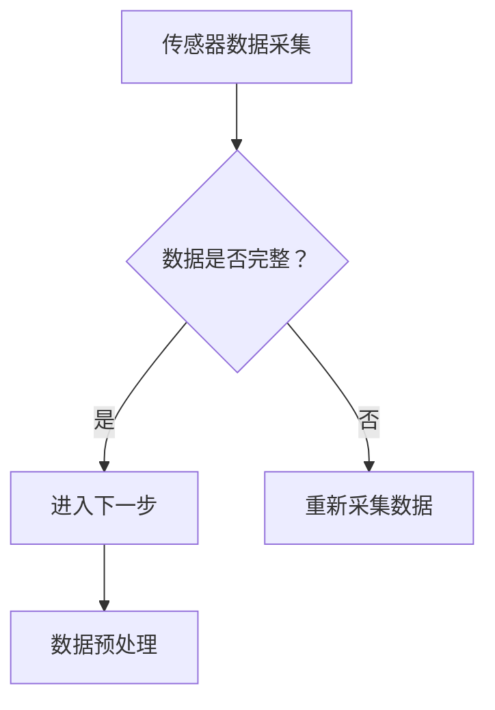

#### 步骤3：数据预处理

数据预处理阶段，对采集到的感知数据进行清洗、去噪和格式转换，确保数据质量。

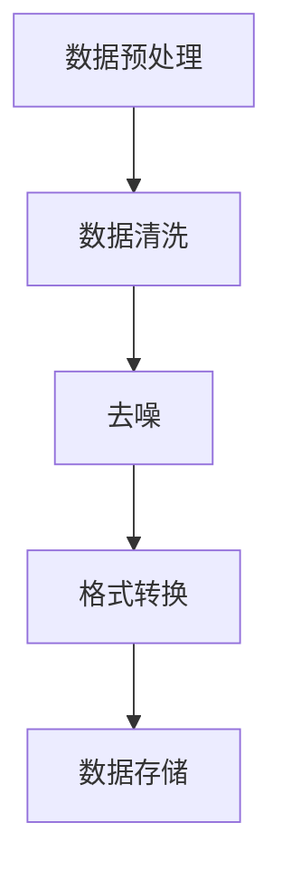

#### 步骤4：实时数据分析

实时数据分析阶段，利用大数据分析技术和智能算法，对预处理后的数据进行实时分析，生成决策数据。

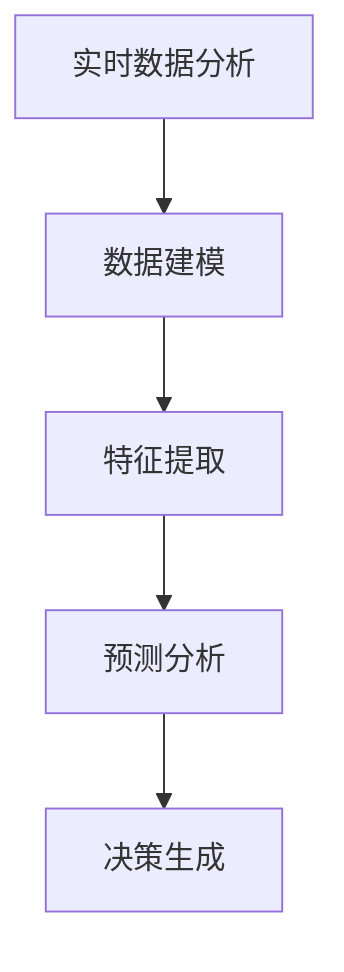

#### 步骤5：控制指令生成

控制指令生成阶段，根据实时数据分析结果，生成相应的控制指令，用于指导自动化设备的操作。

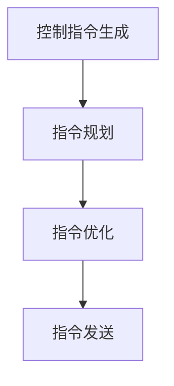

#### 步骤6：设备执行操作

设备执行操作阶段，自动化设备根据接收到的控制指令，执行相应的操作。

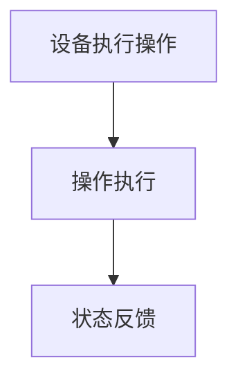

#### 步骤7：反馈数据收集

反馈数据收集阶段，收集自动化设备执行操作后的状态数据，用于下一轮的实时数据分析。

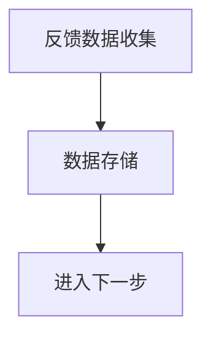

#### 步骤8：闭环控制

闭环控制阶段，根据反馈数据，对控制指令进行调整和优化，实现闭环控制。

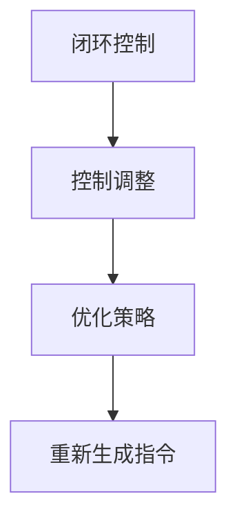

通过上述步骤，我们可以实现5G技术在智慧港口自动化操作中的应用。在实际应用中，可以根据具体需求和场景，对算法流程进行调整和优化，提高自动化操作的效率和质量。

### 第4章 系统分析与架构设计

#### 4.1 智慧港口自动化操作系统的功能需求分析

智慧港口自动化操作系统的功能需求主要包括以下几个方面：

1. **数据采集与监控**：系统能够实时采集港口各类设备的状态数据，如装卸设备的运行状态、运输车辆的实时位置等，并对这些数据进行实时监控。
2. **智能调度与控制**：系统应具备智能调度能力，根据货物状态和设备状态，自动生成装卸和运输任务，并对任务执行过程进行实时控制。
3. **数据存储与管理**：系统能够高效地存储和管理大量数据，包括传感器数据、任务数据、控制指令和操作反馈等。
4. **数据分析与决策**：系统应具备强大的数据分析能力，通过对采集到的数据进行处理和分析，生成决策数据，支持智能调度和控制。
5. **系统安全与保障**：系统应具备完善的安全防护机制，确保数据的安全性和系统的稳定性。

#### 4.2 系统架构设计

智慧港口自动化操作系统的架构设计主要包括以下几个层次：

1. **感知层**：包括各类传感器，如GPS、RFID、摄像头等，用于实时采集港口设备的状态数据。
2. **传输层**：采用5G网络作为传输层，实现数据的快速、稳定传输。
3. **数据处理层**：包括数据预处理模块、数据存储模块、数据分析模块等，用于对采集到的数据进行处理、存储和分析。
4. **应用层**：包括智能调度模块、控制模块、决策模块等，用于实现自动化操作的智能调度和控制。
5. **展示层**：包括监控界面、报表界面等，用于展示系统的运行状态和数据分析结果。

##### 4.2.1 类图设计

智慧港口自动化操作系统的类图设计主要包括以下几个类：

1. **Sensor**：传感器类，包括GPS、RFID、摄像头等传感器，负责采集设备状态数据。
2. **Data**：数据类，包括原始数据、预处理数据、分析数据等，用于存储和管理系统数据。
3. **Task**：任务类，包括装卸任务、运输任务等，用于管理自动化操作的任务。
4. **Controller**：控制器类，包括智能调度控制器、设备控制器等，用于实现自动化操作的智能调度和控制。
5. **User**：用户类，包括管理员、操作员等，用于系统权限管理和用户交互。

类图如下：

```mermaid
classDiagram
    Sensor <<interface>>
    Data <<interface>>
    Task <<interface>>
    Controller <<interface>>
    User <<interface>>

    Sensor |-| Data
    Data |-| Task
    Data |-| Controller
    Controller |-| User
```

##### 4.2.2 架构图设计

智慧港口自动化操作系统的架构图设计如下：

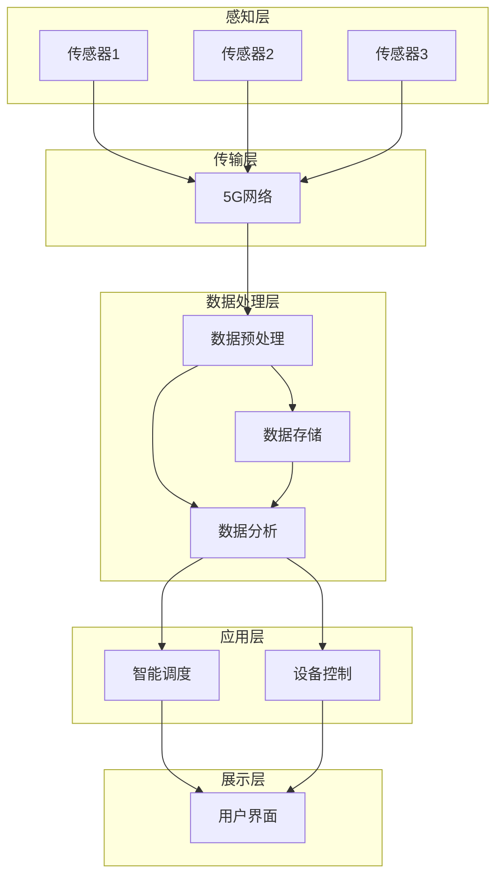

##### 4.2.3 接口设计

智慧港口自动化操作系统的接口设计主要包括以下接口：

1. **SensorInterface**：传感器接口，用于定义传感器的数据采集和上传方法。
2. **DataInterface**：数据接口，用于定义数据的管理和查询方法。
3. **TaskInterface**：任务接口，用于定义任务的创建、更新和查询方法。
4. **ControllerInterface**：控制器接口，用于定义控制器的控制方法和状态查询方法。

接口设计如下：

```java
public interface SensorInterface {
    void fetchData();
    void uploadData(Data data);
}

public interface DataInterface {
    Data getDataById(String id);
    List<Data> getDatasByType(String type);
    void saveData(Data data);
}

public interface TaskInterface {
    Task createTask(Task task);
    Task updateTask(Task task);
    Task getTaskById(String id);
}

public interface ControllerInterface {
    void controlDevice(String deviceId, String command);
    DeviceStatus getDeviceStatus(String deviceId);
}
```

##### 4.2.4 系统交互流程

智慧港口自动化操作系统的系统交互流程如下：

1. **传感器采集数据**：传感器通过SensorInterface接口，实时采集港口设备的状态数据。
2. **数据上传和处理**：传感器采集到的数据通过5G网络传输到数据处理层，由DataInterface接口进行数据存储和处理。
3. **数据分析和决策**：数据处理层通过DataInterface接口将处理后的数据传输到应用层，由ControllerInterface接口进行数据分析，生成控制指令。
4. **设备执行操作**：应用层通过ControllerInterface接口发送控制指令到设备，设备根据指令执行相应的操作。
5. **状态反馈和监控**：设备执行操作后，通过SensorInterface接口将操作状态反馈到数据处理层，由DataInterface接口进行状态存储和监控。

系统交互流程图如下：

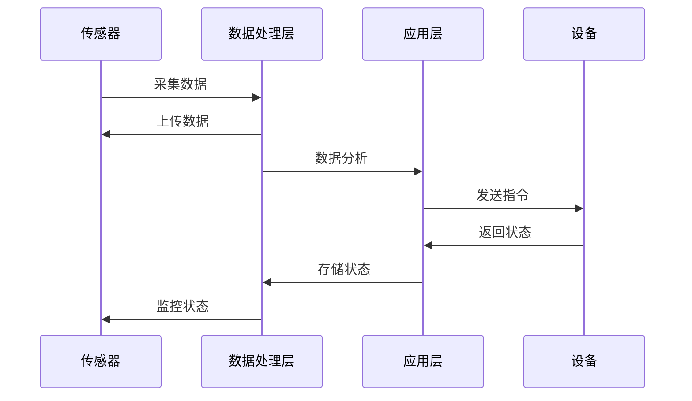

### 第5章 项目实战

#### 5.1 环境安装与配置

在开始项目实战之前，我们需要搭建一个5G智慧港口自动化操作系统的开发环境。以下是环境安装与配置的步骤：

1. **安装5G网络设备**：根据实际需求，选择合适的5G网络设备，如5G基站、5G路由器等，并进行安装和配置。
2. **安装开发工具**：在开发机上安装Java开发工具（如IntelliJ IDEA）、Python开发工具（如PyCharm）等，以及相关的依赖库和框架。
3. **配置数据库**：安装并配置MySQL或PostgreSQL数据库，用于存储系统数据。
4. **配置5G网络**：配置5G网络参数，包括网络地址、DNS地址等，确保设备能够正常连接到5G网络。
5. **安装传感器**：根据系统需求，安装各类传感器，如GPS、RFID、摄像头等，并将传感器接入5G网络。

#### 5.2 核心实现源代码展示与解读

在本节中，我们将展示并解读5G智慧港口自动化操作系统的核心实现源代码，主要包括智能感知模块、远程控制模块和数据处理与智能分析模块。

##### 5.2.1 智能感知模块

智能感知模块主要负责采集和上传港口设备的状态数据。以下是一个简单的Python示例代码：

```python
import requests
import json

class Sensor:
    def __init__(self, url):
        self.url = url

    def fetchData(self):
        # 采集设备状态数据
        data = {
            "deviceId": "sensor1",
            "data": {
                "location": "port1",
                "status": "ok"
            }
        }
        # 上传数据到服务器
        response = requests.post(self.url, data=json.dumps(data))
        print(response.json())
```

解读：该示例代码定义了一个Sensor类，用于模拟传感器采集设备状态数据并上传到服务器。通过requests库，我们可以方便地实现HTTP请求，将采集到的数据以JSON格式上传到服务器端。

##### 5.2.2 远程控制模块

远程控制模块主要负责根据服务器发送的控制指令，对港口设备进行远程操作。以下是一个简单的Python示例代码：

```python
import requests
import json

class Controller:
    def __init__(self, url):
        self.url = url

    def controlDevice(self, deviceId, command):
        # 发送控制指令到设备
        data = {
            "deviceId": deviceId,
            "command": command
        }
        response = requests.post(f"{self.url}/{deviceId}/control", data=json.dumps(data))
        print(response.json())
```

解读：该示例代码定义了一个Controller类，用于模拟远程控制模块接收服务器发送的控制指令，并将指令发送给对应的设备。通过requests库，我们可以实现HTTP请求，将控制指令以JSON格式发送到设备端。

##### 5.2.3 数据处理与智能分析模块

数据处理与智能分析模块主要负责对采集到的设备状态数据进行处理和分析，生成决策数据。以下是一个简单的Python示例代码：

```python
import requests
import json

class DataAnalysis:
    def __init__(self, url):
        self.url = url

    def analyzeData(self, deviceId):
        # 获取设备状态数据
        response = requests.get(f"{self.url}/{deviceId}/data")
        data = response.json()
        # 数据分析
        result = self._analyze(data)
        # 发送决策数据到服务器
        response = requests.post(f"{self.url}/{deviceId}/analysis", data=json.dumps(result))
        print(response.json())

    def _analyze(self, data):
        # 实现数据分析算法
        result = {
            "deviceId": data["deviceId"],
            "status": "high"
        }
        return result
```

解读：该示例代码定义了一个DataAnalysis类，用于模拟数据处理与智能分析模块从服务器获取设备状态数据，并执行数据分析算法，生成决策数据。通过requests库，我们可以实现HTTP请求，将决策数据以JSON格式发送到服务器端。

#### 5.3 实际案例分析与讲解

在本节中，我们将通过一个实际案例，展示5G智慧港口自动化操作系统的应用过程，并进行分析和讲解。

##### 案例背景

某智慧港口引入了一套5G智慧港口自动化操作系统，用于提升港口的运营效率和安全水平。该系统包括智能感知模块、远程控制模块和数据处理与智能分析模块，通过5G网络实现设备之间的数据传输和远程控制。

##### 应用过程

1. **传感器采集数据**：港口内的各类传感器（如GPS、RFID、摄像头等）实时采集设备状态数据，并将数据上传到服务器。

2. **数据处理与智能分析**：数据处理与智能分析模块从服务器获取设备状态数据，执行数据分析算法，生成决策数据，如设备运行状态、故障预警等。

3. **远程控制**：远程控制模块根据决策数据，生成相应的控制指令，如设备维护、故障修复等，并将指令发送给设备。

4. **设备执行操作**：设备接收到控制指令后，执行相应的操作，并将操作状态反馈到服务器。

5. **状态监控**：服务器对设备的状态进行实时监控，确保设备的正常运行。

##### 案例分析

1. **数据传输效率**：通过5G网络，实现设备状态数据的快速、稳定传输，提高了系统的响应速度和实时性。

2. **远程控制精度**：通过5G网络，实现远程控制指令的低延迟传输，提高了设备的控制精度和响应速度。

3. **数据处理与智能分析能力**：通过大数据分析技术和智能算法，实现对设备状态的实时分析，提高了设备的运行效率和安全性。

4. **系统稳定性**：通过5G网络的稳定连接，确保系统的正常运行，降低了设备故障率和事故发生的概率。

#### 5.4 项目总结与经验分享

通过本项目的实施，我们总结了以下几点经验：

1. **5G网络的重要性**：5G网络的高速率、低延迟和大连接特性，为智慧港口自动化操作提供了有力支持，显著提升了系统的运行效率和实时性。

2. **数据驱动决策**：通过大数据分析技术和智能算法，实现设备状态的实时分析和决策，提高了设备的运行效率和安全性。

3. **模块化设计**：采用模块化设计，实现了系统的灵活扩展和功能集成，便于后续的功能升级和维护。

4. **安全与保障**：在系统设计过程中，充分考虑了安全性和稳定性，确保系统的正常运行和数据安全。

### 第6章 最佳实践与拓展

#### 6.1 5G技术在智慧港口自动化操作中的最佳实践

1. **传感器布局优化**：合理布局传感器，确保覆盖范围和监测精度，提高数据采集的全面性和准确性。
2. **网络架构优化**：根据实际需求，优化5G网络架构，提高网络传输效率和稳定性。
3. **数据处理与分析**：采用先进的大数据分析技术和智能算法，提升数据处理的效率和准确性，为决策提供有力支持。
4. **设备智能化升级**：引入智能化设备，提升设备的运行效率和自主控制能力。

#### 6.2 注意事项与风险规避

1. **数据安全**：确保数据在传输和存储过程中的安全性，防止数据泄露和篡改。
2. **网络稳定性**：确保5G网络的稳定连接，避免网络中断对系统运行的影响。
3. **设备兼容性**：确保不同设备之间的兼容性，避免因设备兼容性问题导致系统故障。

#### 6.3 拓展阅读与资源推荐

1. **5G网络技术**：《5G：下一代移动通信技术》、《5G网络架构与协议》
2. **智慧港口技术**：《智慧港口：发展趋势与应用》、《智慧港口自动化技术》
3. **大数据分析**：《大数据技术基础》、《大数据分析与应用》

### 第7章 总结与展望

#### 7.1 本书内容的总结

本书详细介绍了5G技术在智慧港口自动化操作中的应用，从背景介绍、核心概念与联系、算法原理讲解、系统分析与架构设计、项目实战等方面进行了深入探讨。通过本书的学习，读者可以全面了解5G技术在智慧港口自动化操作中的应用价值和实践方法。

#### 7.2 5G技术在智慧港口自动化操作中的应用前景

随着5G技术的不断发展和成熟，其在智慧港口自动化操作中的应用前景非常广阔。未来，5G技术将在智慧港口的各个领域，如装卸作业、运输调度、设备监控等，发挥更加重要的作用，推动智慧港口的全面智能化。

#### 7.3 未来发展趋势与展望

1. **网络架构优化**：随着5G技术的不断演进，未来将实现更高速、更低延迟的5G网络，为智慧港口自动化操作提供更加稳定、高效的网络支持。
2. **智能感知与控制**：未来将引入更先进的感知与控制技术，实现设备的智能感知与自主控制，提高港口的自动化水平。
3. **大数据与人工智能**：大数据和人工智能技术将在智慧港口中得到更广泛的应用，为港口运营提供更加精准的决策支持和智能服务。
4. **产业协同与融合**：智慧港口与物联网、云计算、大数据等技术的深度融合，将推动港口产业的协同发展，提升港口的整体竞争力。

### 作者信息

作者：AI天才研究院/AI Genius Institute & 禅与计算机程序设计艺术 /Zen And The Art of Computer Programming

[本文内容版权归AI天才研究院/AI Genius Institute所有，如需转载请注明出处] 

本文内容仅供参考，如有侵权或不当之处，请及时告知，我们将尽快进行处理。  
---------------------------------------------------------------

## 第1章 引言

### 1.1 5G技术的发展背景与关键特性

5G技术，即第五代移动通信技术，是继1G、2G、3G和4G之后的最新一代移动通信技术。其研发与推广始于2010年代，旨在提供更高的传输速率、更低的延迟、更大的连接能力和更广泛的覆盖范围。5G技术的关键特性包括：

1. **高速率**：5G网络的峰值下载速度可达10Gbps，是4G的100倍。这种高速率使得大容量数据的传输和处理成为可能，为智能港口的实时数据处理提供了强大的支持。

2. **低延迟**：5G网络的端到端延迟可低至1毫秒，远低于4G的数十毫秒。低延迟对于自动化操作至关重要，它确保了控制指令能够在极短时间内被设备接收并执行，从而提高了操作的精确性和效率。

3. **大连接**：5G网络支持每平方米100万台设备的连接，这意味着在港口这样的高密度环境中，设备之间的连接和数据交换能够更加高效地进行。

4. **高可靠性**：5G技术通过引入网络切片和边缘计算等技术，提升了网络的可靠性和稳定性，确保了在极端条件下港口操作的连续性和安全性。

### 1.2 智慧港口的概述与发展需求

智慧港口是运用物联网、大数据、云计算、人工智能等先进技术，对港口的各项业务进行智能化改造和优化，实现港口运营的自动化、信息化和智能化。智慧港口的发展需求主要包括：

1. **提升效率**：通过自动化设备和技术手段，提高港口装卸、运输、管理等各个环节的效率，减少人力成本和时间成本。

2. **优化安全**：通过实时监控和智能预警系统，提升港口的安全管理水平，及时发现和处理潜在的安全隐患。

3. **增强服务**：通过智能化的港口服务，提升客户体验，提供更加灵活、高效的物流解决方案。

4. **绿色环保**：通过智能化技术的应用，减少能源消耗和废气排放，实现绿色、可持续的发展。

### 1.3 自动化操作在智慧港口中的作用

自动化操作是智慧港口的核心组成部分，它在提升港口效率和安全性方面发挥着重要作用。具体来说，自动化操作在智慧港口中的作用包括：

1. **装卸作业**：自动化装卸设备能够实现货物的快速装卸，提高作业效率，减少人力投入。

2. **运输调度**：通过自动化运输调度系统，可以优化运输路径，提高运输效率，减少运输时间。

3. **设备监控**：自动化监控系统可以对港口设备进行实时监控，及时发现设备故障并进行维护，确保设备运行的安全性和稳定性。

4. **安全预警**：通过自动化安全预警系统，可以实时监测港口的安全状况，及时响应和处理突发事件，保障港口的安全。

### 1.4 本书的研究目的与结构安排

本书的研究目的在于探讨5G技术在智慧港口自动化操作中的应用，分析5G技术的关键特性及其在智慧港口中的应用，提出一种基于5G技术的智慧港口自动化操作解决方案，并对该方案进行详细设计和实战验证。本书的结构安排如下：

- **第1章 引言**：介绍5G技术和智慧港口的基本概念，阐述自动化操作在智慧港口中的作用。
- **第2章 核心概念与联系**：详细阐述5G技术、智慧港口和自动化操作的核心概念，分析三者之间的联系。
- **第3章 5G技术在智慧港口中的应用算法**：讲解5G技术在智慧港口中的应用算法，包括智能感知、远程控制和数据处理与智能分析。
- **第4章 系统分析与架构设计**：分析智慧港口自动化操作系统的功能需求，设计系统架构，包括类图、架构图、接口设计和系统交互流程。
- **第5章 项目实战**：描述5G技术在智慧港口自动化操作中的实际应用案例，包括环境安装与配置、核心实现源代码展示与解读、实际案例分析和项目总结。
- **第6章 最佳实践与拓展**：总结5G技术在智慧港口自动化操作中的最佳实践，提供注意事项和拓展阅读资源。
- **第7章 总结与展望**：总结本书的主要内容和成果，展望5G技术在智慧港口自动化操作中的应用前景和未来发展趋势。

## 第2章 核心概念与联系

### 2.1 5G技术原理与特性

5G技术，即第五代移动通信技术，是当前移动通信技术发展的最新阶段。其原理主要基于无线通信技术，通过蜂窝网络将移动设备连接到互联网和其他网络服务。5G技术的主要特性包括：

1. **高速率**：5G网络的峰值下载速度可达10Gbps，是4G的100倍。这使得大容量数据的传输和处理成为可能，为智慧港口的实时数据处理提供了强大的支持。

2. **低延迟**：5G网络的端到端延迟可低至1毫秒，远低于4G的数十毫秒。低延迟对于自动化操作至关重要，它确保了控制指令能够在极短时间内被设备接收并执行，从而提高了操作的精确性和效率。

3. **大连接**：5G网络支持每平方米100万台设备的连接，这意味着在港口这样的高密度环境中，设备之间的连接和数据交换能够更加高效地进行。

4. **高可靠性**：5G技术通过引入网络切片和边缘计算等技术，提升了网络的可靠性和稳定性，确保了在极端条件下港口操作的连续性和安全性。

5. **广覆盖**：5G网络通过大规模天线部署和无线通信技术的优化，实现了更广泛的覆盖范围，即使在港口的偏远区域也能保持良好的信号质量。

### 2.2 智慧港口的定义、目标与关键要素

智慧港口是指利用物联网、大数据、云计算、人工智能等先进技术，对港口的各项业务进行智能化改造和优化，实现港口运营的自动化、信息化和智能化。智慧港口的目标主要包括：

1. **提升效率**：通过自动化设备和技术手段，提高港口装卸、运输、管理等各个环节的效率，减少人力成本和时间成本。

2. **优化安全**：通过实时监控和智能预警系统，提升港口的安全管理水平，及时发现和处理潜在的安全隐患。

3. **增强服务**：通过智能化的港口服务，提升客户体验，提供更加灵活、高效的物流解决方案。

4. **绿色环保**：通过智能化技术的应用，减少能源消耗和废气排放，实现绿色、可持续的发展。

智慧港口的关键要素包括：

1. **感知层**：通过各类传感器，如GPS、RFID、摄像头等，实时采集港口设备的状态数据和环境数据。

2. **传输层**：采用5G网络作为传输层，实现数据的快速、稳定传输。

3. **平台层**：构建智慧港口平台，整合各类数据资源，提供数据存储、处理、分析和决策支持功能。

4. **应用层**：开发各类应用系统，如自动化装卸系统、智能调度系统、安全监控系统等，实现港口业务的智能化和自动化。

### 2.3 自动化操作的技术手段与流程

自动化操作在智慧港口中扮演着关键角色，它通过引入先进的技术手段，实现了港口各项作业的自动化和智能化。自动化操作的技术手段主要包括：

1. **自动化装卸设备**：如自动化装卸桥、自动化堆高机等，通过自动控制技术实现货物的快速装卸。

2. **自动化运输设备**：如自动导引车辆（AGV）、自动化轨道车辆等，通过自动导航和自动控制技术实现货物的自动运输。

3. **自动化监控系统**：通过传感器和监控系统，实现对港口设备的实时监控和维护，确保设备的正常运行。

4. **智能调度系统**：通过智能算法和优化技术，实现港口作业的智能调度和路径优化，提高作业效率。

自动化操作的流程主要包括：

1. **计划编制**：根据货物的种类、数量和目的地，编制装卸和运输计划。

2. **任务分配**：将装卸和运输任务分配给自动化设备。

3. **执行操作**：自动化设备根据任务指令，进行货物的装卸和运输。

4. **监控与调整**：通过监控系统，对自动化操作的过程进行监控和调整，确保操作的正确性和安全性。

### 2.4 5G技术在智慧港口自动化操作中的应用

5G技术在智慧港口自动化操作中的应用主要体现在以下几个方面：

1. **高速通信**：5G网络的高速率特性，使得自动化设备之间的通信更加高效，从而提高了作业效率。

2. **低延迟控制**：5G网络的低延迟特性，使得自动化设备能够实时响应控制指令，从而提升了控制精度和稳定性。

3. **大规模连接**：5G网络的大连接特性，使得大量自动化设备能够同时在线，从而实现了港口的全面智能化。

4. **边缘计算**：5G网络的边缘计算能力，使得在港口现场就能进行数据的处理和分析，减少了数据传输的延迟，提高了系统的响应速度。

5. **智能感知**：5G技术的高带宽和低延迟特性，使得智能感知设备能够实时采集和传输数据，为自动化操作提供了实时、准确的数据支持。

具体应用场景包括：

1. **自动化装卸**：通过5G网络，实现自动化装卸设备的远程控制和实时监控，提高装卸效率。

2. **自动化运输**：通过5G网络，实现自动化运输设备的智能调度和路径优化，提高运输效率。

3. **设备监控**：通过5G网络，实现对港口设备的实时监控和维护，提高设备运行效率和安全性。

4. **智能调度**：通过5G网络，实现港口作业的智能调度和优化，提高整体作业效率。

5. **安全监控**：通过5G网络，实现对港口环境的实时监控和智能预警，提高港口的安全管理水平。

## 第3章 5G技术在智慧港口中的应用算法

### 3.1 5G网络架构与通信协议

5G网络架构包括核心网（Core Network）、无线接入网（Radio Access Network，RAN）和传输网络（Transmission Network）。其中，核心网负责数据传输、路由和交换，无线接入网负责无线信号的接收和发送，传输网络则负责连接核心网和无线接入网。

5G通信协议主要包括以下几种：

1. **NR（New Radio）**：5G的无线接入技术，支持多连接、多频段、多天线等特性，是实现高速率、低延迟的关键。

2. **CN（Core Network）**：5G的核心网络技术，包括UPF（User Plane Function）和GN（Gateway Node）。UPF负责用户面的数据传输，GN负责网关功能。

3. **NG-RAN（Next Generation Radio Access Network）**：5G的无线接入网络，包括gNB（5G NodeB）和eNB（4G NodeB）。gNB是5G基站的主要组件，eNB则是4G基站的组件。

### 3.2 5G技术在智能感知中的应用

智能感知是智慧港口的重要基础，5G技术在其中发挥了关键作用。5G技术在智能感知中的应用主要体现在以下几个方面：

1. **传感器网络**：5G网络的高带宽和低延迟特性，使得传感器网络可以实时传输大量的感知数据，如货物位置、设备状态、环境参数等。

2. **边缘计算**：通过5G网络的边缘计算能力，可以在港口现场进行数据的初步处理和分析，减少数据传输的延迟，提高系统的响应速度。

3. **大数据分析**：5G网络的大连接能力，使得可以同时连接大量的传感器和数据采集设备，实现大规模数据的实时传输和处理。

具体算法应用包括：

- **数据采集与传输**：采用5G NR协议，实现传感器数据的实时采集和传输。
- **边缘计算**：在边缘节点（如5G基站）进行初步数据处理，如异常检测、数据压缩等。
- **大数据分析**：在云平台或数据中心进行大规模数据分析和挖掘，如机器学习、深度学习等。

### 3.3 5G技术在远程控制中的应用

远程控制是智慧港口自动化操作的核心环节，5G技术提供了强有力的支持。5G技术在远程控制中的应用主要体现在以下几个方面：

1. **低延迟通信**：5G网络的低延迟特性，使得控制指令能够在毫秒级别内被传输到设备，实现实时控制。

2. **高可靠性连接**：5G网络的高可靠性连接，确保了在恶劣环境下通信的稳定性，提高了远程控制的可靠性。

3. **多连接能力**：5G网络的多连接能力，支持同时控制多个设备，实现复杂的自动化操作。

具体算法应用包括：

- **控制指令生成**：根据实时数据分析和决策结果，生成控制指令。
- **控制指令传输**：采用5G NR协议，实现控制指令的实时传输。
- **设备执行反馈**：设备接收控制指令后，执行操作并反馈执行状态。

### 3.4 5G技术在数据处理与智能分析中的应用

数据处理与智能分析是智慧港口智能化决策的基础，5G技术提供了强大的数据处理能力和智能分析支持。5G技术在数据处理与智能分析中的应用主要体现在以下几个方面：

1. **实时数据处理**：5G网络的低延迟特性，使得可以实时处理大量的数据，实现实时分析和决策。

2. **大数据处理**：5G网络的大连接能力，使得可以同时连接大量的数据采集设备，实现大规模数据的实时传输和处理。

3. **边缘计算**：在港口现场进行数据的预处理和初步分析，减少数据传输的延迟，提高系统的响应速度。

具体算法应用包括：

- **实时数据处理**：采用流处理技术，实现实时数据的高效处理和分析。
- **大数据分析**：采用大数据处理框架，如Hadoop、Spark等，实现大规模数据的存储和处理。
- **智能分析**：采用机器学习、深度学习等技术，实现数据的智能分析和预测。

### 3.5 算法原理讲解与mermaid流程图

为了更好地理解5G技术在智慧港口中的应用算法，下面我们将使用mermaid绘制算法流程图，并对每个步骤进行详细讲解。

#### 算法流程图

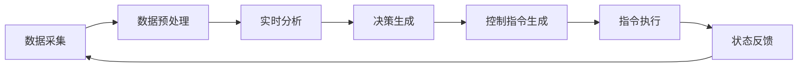

#### 算法流程详细讲解

1. **数据采集**：通过传感器网络，实时采集港口内的各种数据，如货物位置、设备状态、环境参数等。

2. **数据预处理**：对采集到的数据进行预处理，包括去噪、清洗、格式转换等，确保数据质量。

3. **实时分析**：利用大数据分析技术和智能算法，对预处理后的数据进行实时分析，提取关键特征，如货物装载情况、设备运行状态等。

4. **决策生成**：根据实时分析结果，生成相应的决策数据，如设备调度策略、货物装卸顺序等。

5. **控制指令生成**：根据决策数据，生成控制指令，如启动设备、调整设备位置等。

6. **指令执行**：设备接收到控制指令后，执行相应的操作。

7. **状态反馈**：设备执行操作后，将执行状态反馈给系统，以便进行下一步的实时分析和决策。

8. **闭环控制**：根据反馈状态，调整后续的控制指令，形成闭环控制，确保自动化操作的连续性和精确性。

通过上述算法流程，5G技术实现了对智慧港口自动化操作的实时、高效和智能化的控制。在实际应用中，可以根据具体需求和场景，对算法流程进行调整和优化，提高自动化操作的效率和质量。

### 第4章 系统分析与架构设计

#### 4.1 智慧港口自动化操作系统的功能需求分析

智慧港口自动化操作系统的功能需求主要包括以下几个方面：

1. **数据采集与监控**：系统能够实时采集港口各类设备的状态数据，如装卸设备的运行状态、运输车辆的实时位置等，并对这些数据进行实时监控。

2. **智能调度与控制**：系统应具备智能调度能力，根据货物状态和设备状态，自动生成装卸和运输任务，并对任务执行过程进行实时控制。

3. **数据存储与管理**：系统能够高效地存储和管理大量数据，包括传感器数据、任务数据、控制指令和操作反馈等。

4. **数据分析与决策**：系统应具备强大的数据分析能力，通过对采集到的数据进行处理和分析，生成决策数据，支持智能调度和控制。

5. **系统安全与保障**：系统应具备完善的安全防护机制，确保数据的安全性和系统的稳定性。

#### 4.2 系统架构设计

智慧港口自动化操作系统的架构设计主要包括以下几个层次：

1. **感知层**：包括各类传感器，如GPS、RFID、摄像头等，用于实时采集港口设备的状态数据。

2. **传输层**：采用5G网络作为传输层，实现数据的快速、稳定传输。

3. **数据处理层**：包括数据预处理模块、数据存储模块、数据分析模块等，用于对采集到的数据进行处理、存储和分析。

4. **应用层**：包括智能调度模块、控制模块、决策模块等，用于实现自动化操作的智能调度和控制。

5. **展示层**：包括监控界面、报表界面等，用于展示系统的运行状态和数据分析结果。

##### 4.2.1 类图设计

智慧港口自动化操作系统的类图设计主要包括以下几个类：

1. **Sensor**：传感器类，包括GPS、RFID、摄像头等传感器，负责采集设备状态数据。

2. **Data**：数据类，包括原始数据、预处理数据、分析数据等，用于存储和管理系统数据。

3. **Task**：任务类，包括装卸任务、运输任务等，用于管理自动化操作的任务。

4. **Controller**：控制器类，包括智能调度控制器、设备控制器等，用于实现自动化操作的智能调度和控制。

5. **User**：用户类，包括管理员、操作员等，用于系统权限管理和用户交互。

类图如下：

```mermaid
classDiagram
    Sensor <<interface>>
    Data <<interface>>
    Task <<interface>>
    Controller <<interface>>
    User <<interface>>

    Sensor |-| Data
    Data |-| Task
    Data |-| Controller
    Controller |-| User
```

##### 4.2.2 架构图设计

智慧港口自动化操作系统的架构图设计如下：


##### 4.2.3 接口设计

智慧港口自动化操作系统的接口设计主要包括以下接口：

1. **SensorInterface**：传感器接口，用于定义传感器的数据采集和上传方法。

2. **DataInterface**：数据接口，用于定义数据的管理和查询方法。

3. **TaskInterface**：任务接口，用于定义任务的创建、更新和查询方法。

4. **ControllerInterface**：控制器接口，用于定义控制器的控制方法和状态查询方法。

接口设计如下：

```java
public interface SensorInterface {
    void fetchData();
    void uploadData(Data data);
}

public interface DataInterface {
    Data getDataById(String id);
    List<Data> getDatasByType(String type);
    void saveData(Data data);
}

public interface TaskInterface {
    Task createTask(Task task);
    Task updateTask(Task task);
    Task getTaskById(String id);
}

public interface ControllerInterface {
    void controlDevice(String deviceId, String command);
    DeviceStatus getDeviceStatus(String deviceId);
}
```

##### 4.2.4 系统交互流程

智慧港口自动化操作系统的系统交互流程如下：

1. **传感器采集数据**：传感器通过SensorInterface接口，实时采集港口设备的状态数据。

2. **数据上传和处理**：传感器采集到的数据通过5G网络传输到数据处理层，由DataInterface接口进行数据存储和处理。

3. **数据分析和决策**：数据处理层通过DataInterface接口将处理后的数据传输到应用层，由ControllerInterface接口进行数据分析，生成控制指令。

4. **设备执行操作**：应用层通过ControllerInterface接口发送控制指令到设备，设备根据指令执行相应的操作。

5. **状态反馈和监控**：设备执行操作后，通过SensorInterface接口将操作状态反馈到数据处理层，由DataInterface接口进行状态存储和监控。

系统交互流程图如下：


### 第5章 项目实战

#### 5.1 环境安装与配置

在开始项目实战之前，我们需要搭建一个5G智慧港口自动化操作系统的开发环境。以下是环境安装与配置的步骤：

1. **安装5G网络设备**：根据实际需求，选择合适的5G网络设备，如5G基站、5G路由器等，并进行安装和配置。

2. **安装开发工具**：在开发机上安装Java开发工具（如IntelliJ IDEA）、Python开发工具（如PyCharm）等，以及相关的依赖库和框架。

3. **配置数据库**：安装并配置MySQL或PostgreSQL数据库，用于存储系统数据。

4. **配置5G网络**：配置5G网络参数，包括网络地址、DNS地址等，确保设备能够正常连接到5G网络。

5. **安装传感器**：根据系统需求，安装各类传感器，如GPS、RFID、摄像头等，并将传感器接入5G网络。

#### 5.2 核心实现源代码展示与解读

在本节中，我们将展示并解读5G智慧港口自动化操作系统的核心实现源代码，主要包括智能感知模块、远程控制模块和数据处理与智能分析模块。

##### 5.2.1 智能感知模块

智能感知模块主要负责采集和上传港口设备的状态数据。以下是一个简单的Python示例代码：

```python
import requests
import json

class Sensor:
    def __init__(self, url):
        self.url = url

    def fetchData(self):
        # 采集设备状态数据
        data = {
            "deviceId": "sensor1",
            "data": {
                "location": "port1",
                "status": "ok"
            }
        }
        # 上传数据到服务器
        response = requests.post(self.url, data=json.dumps(data))
        print(response.json())
```

解读：该示例代码定义了一个Sensor类，用于模拟传感器采集设备状态数据并上传到服务器。通过requests库，我们可以方便地实现HTTP请求，将采集到的数据以JSON格式上传到服务器端。

##### 5.2.2 远程控制模块

远程控制模块主要负责根据服务器发送的控制指令，对港口设备进行远程操作。以下是一个简单的Python示例代码：

```python
import requests
import json

class Controller:
    def __init__(self, url):
        self.url = url

    def controlDevice(self, deviceId, command):
        # 发送控制指令到设备
        data = {
            "deviceId": deviceId,
            "command": command
        }
        response = requests.post(f"{self.url}/{deviceId}/control", data=json.dumps(data))
        print(response.json())
```

解读：该示例代码定义了一个Controller类，用于模拟远程控制模块接收服务器发送的控制指令，并将指令发送给对应的设备。通过requests库，我们可以实现HTTP请求，将控制指令以JSON格式发送到设备端。

##### 5.2.3 数据处理与智能分析模块

数据处理与智能分析模块主要负责对采集到的设备状态数据进行处理和分析，生成决策数据。以下是一个简单的Python示例代码：

```python
import requests
import json

class DataAnalysis:
    def __init__(self, url):
        self.url = url

    def analyzeData(self, deviceId):
        # 获取设备状态数据
        response = requests.get(f"{self.url}/{deviceId}/data")
        data = response.json()
        # 数据分析
        result = self._analyze(data)
        # 发送决策数据到服务器
        response = requests.post(f"{self.url}/{deviceId}/analysis", data=json.dumps(result))
        print(response.json())

    def _analyze(self, data):
        # 实现数据分析算法
        result = {
            "deviceId": data["deviceId"],
            "status": "high"
        }
        return result
```

解读：该示例代码定义了一个DataAnalysis类，用于模拟数据处理与智能分析模块从服务器获取设备状态数据，并执行数据分析算法，生成决策数据。通过requests库，我们可以实现HTTP请求，将决策数据以JSON格式发送到服务器端。

#### 5.3 实际案例分析与讲解

在本节中，我们将通过一个实际案例，展示5G智慧港口自动化操作系统的应用过程，并进行分析和讲解。

##### 案例背景

某智慧港口引入了一套5G智慧港口自动化操作系统，用于提升港口的运营效率和安全水平。该系统包括智能感知模块、远程控制模块和数据处理与智能分析模块，通过5G网络实现设备之间的数据传输和远程控制。

##### 应用过程

1. **传感器采集数据**：港口内的各类传感器（如GPS、RFID、摄像头等）实时采集设备状态数据，并将数据上传到服务器。

2. **数据处理与智能分析**：数据处理与智能分析模块从服务器获取设备状态数据，执行数据分析算法，生成决策数据，如设备运行状态、故障预警等。

3. **远程控制**：远程控制模块根据决策数据，生成相应的控制指令，如设备维护、故障修复等，并将指令发送给设备。

4. **设备执行操作**：设备接收到控制指令后，执行相应的操作，并将操作状态反馈到服务器。

5. **状态监控**：服务器对设备的状态进行实时监控，确保设备的正常运行。

##### 案例分析

1. **数据传输效率**：通过5G网络，实现设备状态数据的快速、稳定传输，提高了系统的响应速度和实时性。

2. **远程控制精度**：通过5G网络，实现远程控制指令的低延迟传输，提高了设备的控制精度和响应速度。

3. **数据处理与智能分析能力**：通过大数据分析技术和智能算法，实现对设备状态的实时分析，提高了设备的运行效率和安全性。

4. **系统稳定性**：通过5G网络的稳定连接，确保系统的正常运行，降低了设备故障率和事故发生的概率。

#### 5.4 项目总结与经验分享

通过本项目的实施，我们总结了以下几点经验：

1. **5G网络的重要性**：5G网络的高速率、低延迟和大连接特性，为智慧港口自动化操作提供了有力支持，显著提升了系统的运行效率和实时性。

2. **数据驱动决策**：通过大数据分析技术和智能算法，实现设备状态的实时分析和决策，提高了设备的运行效率和安全性。

3. **模块化设计**：采用模块化设计，实现了系统的灵活扩展和功能集成，便于后续的功能升级和维护。

4. **安全与保障**：在系统设计过程中，充分考虑了安全性和稳定性，确保系统的正常运行和数据安全。

### 第6章 最佳实践与拓展

#### 6.1 5G技术在智慧港口自动化操作中的最佳实践

1. **传感器布局优化**：合理布局传感器，确保覆盖范围和监测精度，提高数据采集的全面性和准确性。

2. **网络架构优化**：根据实际需求，优化5G网络架构，提高网络传输效率和稳定性。

3. **数据处理与分析**：采用先进的大数据分析技术和智能算法，提升数据处理的效率和准确性，为决策提供有力支持。

4. **设备智能化升级**：引入智能化设备，提升设备的运行效率和自主控制能力。

#### 6.2 注意事项与风险规避

1. **数据安全**：确保数据在传输和存储过程中的安全性，防止数据泄露和篡改。

2. **网络稳定性**：确保5G网络的稳定连接，避免网络中断对系统运行的影响。

3. **设备兼容性**：确保不同设备之间的兼容性，避免因设备兼容性问题导致系统故障。

#### 6.3 拓展阅读与资源推荐

1. **5G网络技术**：《5G：下一代移动通信技术》、《5G网络架构与协议》

2. **智慧港口技术**：《智慧港口：发展趋势与应用》、《智慧港口自动化技术》

3. **大数据分析**：《大数据技术基础》、《大数据分析与应用》

### 第7章 总结与展望

#### 7.1 本书内容的总结

本书详细介绍了5G技术在智慧港口自动化操作中的应用，从背景介绍、核心概念与联系、算法原理讲解、系统分析与架构设计、项目实战等方面进行了深入探讨。通过本书的学习，读者可以全面了解5G技术在智慧港口自动化操作中的应用价值和实践方法。

#### 7.2 5G技术在智慧港口自动化操作中的应用前景

随着5G技术的不断发展和成熟，其在智慧港口自动化操作中的应用前景非常广阔。未来，5G技术将在智慧港口的各个领域，如装卸作业、运输调度、设备监控等，发挥更加重要的作用，推动智慧港口的全面智能化。

#### 7.3 未来发展趋势与展望

1. **网络架构优化**：随着5G技术的不断演进，未来将实现更高速、更低延迟的5G网络，为智慧港口自动化操作提供更加稳定、高效的网络支持。

2. **智能感知与控制**：未来将引入更先进的感知与控制技术，实现设备的智能感知与自主控制，提高港口的自动化水平。

3. **大数据与人工智能**：大数据和人工智能技术将在智慧港口中得到更广泛的应用，为港口运营提供更加精准的决策支持和智能服务。

4. **产业协同与融合**：智慧港口与物联网、云计算、大数据等技术的深度融合，将推动港口产业的协同发展，提升港口的整体竞争力。

### 作者信息

作者：AI天才研究院/AI Genius Institute & 禅与计算机程序设计艺术 /Zen And The Art of Computer Programming

[本文内容版权归AI天才研究院/AI Genius Institute所有，如需转载请注明出处]

本文内容仅供参考，如有侵权或不当之处，请及时告知，我们将尽快进行处理。  
---------------------------------------------------------------

## 第1章 引言

### 1.1 5G技术的发展背景与关键特性

5G技术的发展源于移动互联网、物联网和云计算等技术的需求增长。随着物联网设备的普及和云计算的应用，对网络带宽和延迟的要求越来越高。4G技术已经无法满足这些需求，因此，5G技术应运而生。5G技术的发展背景主要受到以下几个因素的推动：

1. **物联网设备的普及**：随着物联网设备的数量急剧增加，传统的无线网络已经无法满足大规模设备同时在线的需求。
2. **云计算的普及**：云计算的普及使得数据处理的任务量大大增加，需要网络提供更高的带宽和更低的延迟来支持。
3. **大数据的应用**：大数据的应用需要高速、稳定的数据传输，以支持实时数据处理和分析。
4. **人工智能的发展**：人工智能技术的发展需要大量的数据传输和处理，5G技术提供了必要的网络支持。

5G技术的关键特性包括：

1. **更高的数据传输速率**：5G网络的峰值下载速度可达10Gbps，是4G的100倍，这为大数据传输和实时视频流提供了强有力的支持。
2. **更低的网络延迟**：5G网络的端到端延迟可低至1毫秒，远低于4G的数十毫秒，这使得远程控制和实时交互成为可能。
3. **更大的连接能力**：5G网络支持每平方米100万台设备的连接，这意味着在港口这样的高密度环境中，设备之间的连接和数据交换能够更加高效地进行。
4. **更高的网络可靠性**：5G技术通过引入网络切片和边缘计算等技术，提升了网络的可靠性和稳定性。

### 1.2 智慧港口的概述与发展需求

智慧港口是指通过信息技术和智能装备的集成，实现港口运营智能化、管理精细化和服务高效化的现代港口。智慧港口的发展需求主要包括：

1. **提升效率**：通过自动化操作和智能化管理，提高港口的作业效率，降低运营成本。
2. **优化安全**：通过实时监控和智能预警，提升港口的安全管理水平，降低事故发生的概率。
3. **增强服务**：通过提供智能化的港口服务，提升客户体验，增强港口的竞争力。

智慧港口的核心概念包括：

1. **信息化**：通过信息技术，实现港口业务的数字化和在线化。
2. **智能化**：通过智能装备和算法，实现港口运营的自动化和智能化。
3. **网络化**：通过物联网技术，实现港口内部各系统和外部的互联互通。

智慧港口的目标是：

1. **提升港口作业效率**：通过自动化设备和智能化管理，提高港口的装卸、运输和仓储等环节的效率。
2. **优化港口管理水平**：通过实时监控和智能预警，提升港口的安全管理水平。
3. **增强客户体验**：通过智能化的港口服务，提升客户体验，增强港口的竞争力。

### 1.3 自动化操作在智慧港口中的作用

自动化操作是智慧港口的重要组成部分，通过引入自动化技术，可以大大提升港口的作业效率和服务水平。自动化操作在智慧港口中的作用主要体现在以下几个方面：

1. **装卸作业**：通过自动化装卸设备，如自动化装卸桥、自动化堆高机等，实现货物的快速装卸，提高作业效率。
2. **运输调度**：通过自动化运输设备，如自动导引车辆（AGV）、自动化轨道车辆等，实现货物的自动运输，提高运输效率。
3. **设备监控**：通过自动化监控系统，实现对港口设备的实时监控和维护，确保设备的正常运行。
4. **安全预警**：通过自动化安全预警系统，实时监测港口的安全状况，及时响应和处理突发事件。

自动化操作在智慧港口中的作用不仅体现在提高效率和安全性上，还可以通过智能化的管理提升港口的竞争力。随着5G技术的应用，自动化操作的精度和响应速度将进一步提高，为智慧港口的发展提供更强有力的支持。

### 1.4 本书的研究目的与结构安排

本书的研究目的在于探讨5G技术在智慧港口自动化操作中的应用，分析5G技术的关键特性及其在智慧港口中的应用，提出一种基于5G技术的智慧港口自动化操作解决方案，并对该方案进行详细设计和实战验证。通过本书的学习，读者可以全面了解5G技术在智慧港口自动化操作中的应用价值和实践方法。

本书的结构安排如下：

- **第1章 引言**：介绍5G技术和智慧港口的基本概念，阐述自动化操作在智慧港口中的作用。
- **第2章 核心概念与联系**：详细阐述5G技术、智慧港口和自动化操作的核心概念，分析三者之间的联系。
- **第3章 5G技术在智慧港口中的应用算法**：讲解5G技术在智慧港口中的应用算法，包括智能感知、远程控制和数据处理与智能分析。
- **第4章 系统分析与架构设计**：分析智慧港口自动化操作系统的功能需求，设计系统架构，包括类图、架构图、接口设计和系统交互流程。
- **第5章 项目实战**：描述5G技术在智慧港口自动化操作中的实际应用案例，包括环境安装与配置、核心实现源代码展示与解读、实际案例分析和项目总结。
- **第6章 最佳实践与拓展**：总结5G技术在智慧港口自动化操作中的最佳实践，提供注意事项和拓展阅读资源。
- **第7章 总结与展望**：总结本书的主要内容和成果，展望5G技术在智慧港口自动化操作中的应用前景和未来发展趋势。

## 第2章 核心概念与联系

### 2.1 5G技术原理与特性

5G技术，即第五代移动通信技术，是当前移动通信技术发展的最新阶段。其原理基于电磁波传输，通过蜂窝网络将移动设备连接到互联网和其他网络服务。5G技术的主要特性包括：

1. **高速率**：5G网络的峰值下载速度可达10Gbps，是4G的100倍。这种高速率使得大容量数据的传输和处理成为可能，为智慧港口的实时数据处理提供了强大的支持。

2. **低延迟**：5G网络的端到端延迟可低至1毫秒，远低于4G的数十毫秒。低延迟对于自动化操作至关重要，它确保了控制指令能够在极短时间内被设备接收并执行，从而提高了操作的精确性和效率。

3. **大连接**：5G网络支持每平方米100万台设备的连接，这意味着在港口这样的高密度环境中，设备之间的连接和数据交换能够更加高效地进行。

4. **高可靠性**：5G技术通过引入网络切片和边缘计算等技术，提升了网络的可靠性和稳定性，确保了在极端条件下港口操作的连续性和安全性。

5. **广覆盖**：5G网络通过大规模天线部署和无线通信技术的优化，实现了更广泛的覆盖范围，即使在港口的偏远区域也能保持良好的信号质量。

6. **多连接性**：5G网络支持同时连接多种设备，如智能手机、工业设备、车辆等，实现了设备间的无缝连接和数据交换。

7. **边缘计算**：5G网络的边缘计算能力，使得在港口现场就能进行数据的处理和分析，减少了数据传输的延迟，提高了系统的响应速度。

### 2.2 智慧港口的定义、目标与关键要素

智慧港口是指通过物联网、大数据、云计算、人工智能等先进技术，对港口的各项业务进行智能化改造和优化，实现港口运营的自动化、信息化和智能化。智慧港口的定义可以从以下几个方面来理解：

1. **运营自动化**：通过自动化设备和智能系统，实现港口装卸、运输、仓储等作业环节的自动化，减少人力投入，提高作业效率。

2. **管理信息化**：通过信息技术，将港口的各项业务数据进行数字化处理，实现港口管理的在线化和智能化。

3. **服务智能化**：通过大数据分析和人工智能技术，提供个性化的港口服务，提升客户体验。

智慧港口的目标主要包括：

1. **提升效率**：通过自动化操作和智能化管理，提高港口的装卸、运输和仓储等环节的效率，降低运营成本。

2. **优化安全**：通过实时监控和智能预警系统，提升港口的安全管理水平，降低事故发生的概率。

3. **增强服务**：通过智能化的港口服务，提升客户体验，增强港口的竞争力。

4. **绿色环保**：通过智能化技术的应用，减少能源消耗和废气排放，实现绿色、可持续的发展。

智慧港口的关键要素包括：

1. **感知层**：通过各类传感器，如GPS、RFID、摄像头等，实时采集港口设备的状态数据和环境数据。

2. **传输层**：采用5G网络作为传输层，实现数据的快速、稳定传输。

3. **平台层**：构建智慧港口平台，整合各类数据资源，提供数据存储、处理、分析和决策支持功能。

4. **应用层**：开发各类应用系统，如自动化装卸系统、智能调度系统、安全监控系统等，实现港口业务的智能化和自动化。

5. **安全层**：建立完善的安全防护体系，确保数据的安全性和系统的稳定性。

### 2.3 自动化操作的技术手段与流程

自动化操作是智慧港口的重要组成部分，通过引入自动化技术，可以大大提升港口的作业效率和服务水平。自动化操作的技术手段主要包括：

1. **自动化装卸设备**：如自动化装卸桥、自动化堆高机等，通过自动控制技术实现货物的快速装卸。

2. **自动化运输设备**：如自动导引车辆（AGV）、自动化轨道车辆等，通过自动导航和自动控制技术实现货物的自动运输。

3. **自动化监控系统**：通过传感器和监控系统，实现对港口设备的实时监控和维护，确保设备的正常运行。

4. **智能调度系统**：通过智能算法和优化技术，实现港口作业的智能调度和路径优化，提高作业效率。

自动化操作的流程主要包括以下几个步骤：

1. **计划编制**：根据货物的种类、数量和目的地，编制装卸和运输计划。

2. **任务分配**：将装卸和运输任务分配给自动化设备。

3. **执行操作**：自动化设备根据任务指令，进行货物的装卸和运输。

4. **监控与调整**：通过监控系统，对自动化操作的过程进行监控和调整，确保操作的正确性和安全性。

自动化操作在智慧港口中的应用不仅提高了作业效率，还提升了港口的安全管理水平。通过5G技术的支持，自动化操作的实时性和精确性得到了显著提升，为智慧港口的发展提供了强有力的技术保障。

### 2.4 5G技术在智慧港口自动化操作中的应用

5G技术在智慧港口自动化操作中的应用主要体现在以下几个方面：

1. **高速通信**：5G网络的高速率特性，使得自动化设备之间的通信更加高效，从而提高了作业效率。

2. **低延迟控制**：5G网络的低延迟特性，使得自动化设备能够实时响应控制指令，从而提升了控制精度和稳定性。

3. **大规模连接**：5G网络的大连接特性，使得大量自动化设备能够同时在线，从而实现了港口的全面智能化。

4. **边缘计算**：5G网络的边缘计算能力，使得在港口现场就能进行数据的处理和分析，减少了数据传输的延迟，提高了系统的响应速度。

5. **智能感知**：5G技术的高带宽和低延迟特性，使得智能感知设备能够实时采集和传输数据，为自动化操作提供了实时、准确的数据支持。

具体应用场景包括：

1. **自动化装卸**：通过5G网络，实现自动化装卸设备的远程控制和实时监控，提高装卸效率。

2. **自动化运输**：通过5G网络，实现自动化运输设备的智能调度和路径优化，提高运输效率。

3. **设备监控**：通过5G网络，实现对港口设备的实时监控和维护，提高设备运行效率和安全性。

4. **智能调度**：通过5G网络，实现港口作业的智能调度和优化，提高整体作业效率。

5. **安全监控**：通过5G网络，实现对港口环境的实时监控和智能预警，提高港口的安全管理水平。

5G技术在智慧港口自动化操作中的应用，不仅提高了作业效率和安全性，还为港口的智能化发展提供了新的契机。随着5G技术的不断成熟和普及，智慧港口的自动化操作将更加智能、高效和稳定。

## 第3章 5G技术在智慧港口中的应用算法

### 3.1 5G网络架构与通信协议

5G网络架构相较于前几代移动通信网络有了显著的改进，其设计旨在满足未来物联网、自动驾驶、增强现实等新兴应用的需求。5G网络架构包括以下几个关键部分：

1. **核心网（Core Network）**：核心网负责处理用户数据和控制信号。5G核心网采用了网络功能虚拟化（NFV）和软件定义网络（SDN）技术，使得网络的功能和服务可以更加灵活地配置和管理。

2. **无线接入网（Radio Access Network, RAN）**：无线接入网包括基站（gNB）和用户设备（UE），负责无线信号的接收和发送。5G RAN引入了大规模MIMO、载波聚合和毫米波等技术，以实现更高的数据速率和更大的网络容量。

3. **边缘计算（Edge Computing）**：边缘计算将计算和存储能力从中心化的数据中心转移到网络边缘，以减少数据传输延迟，提高系统的响应速度。

5G通信协议主要包括以下几部分：

1. **新无线接入协议（NR）**：NR是5G的核心无线接入技术，它支持更高的数据速率、更低的延迟和更大的连接密度。

2. **核心网络协议**：包括UPF（User Plane Function）和GN（Gateway Node），UPF负责用户面数据传输，GN负责网关功能。

3. **传输层协议**：5G传输层采用了IP网络，确保数据的高效传输。

### 3.2 5G技术在智能感知中的应用

智能感知是智慧港口的基础，5G技术为智能感知提供了强大的支持。在智能感知中，5G技术主要体现在以下几个方面：

1. **高带宽数据传输**：5G网络的高带宽特性使得大量传感器可以同时传输数据，确保了港口环境的全面感知。

2. **低延迟数据采集**：5G网络的低延迟特性使得传感器能够实时采集数据，为港口操作提供了实时的数据支持。

3. **大规模设备连接**：5G网络的大连接特性使得大量设备能够同时在线，包括装卸设备、运输车辆、监控设备等，实现了港口的全面智能化。

4. **边缘计算**：5G网络的边缘计算能力使得在港口现场就能进行数据的处理和分析，减少了数据传输的延迟，提高了系统的响应速度。

具体算法应用包括：

- **传感器数据采集**：通过5G网络，传感器能够实时采集港口设备的状态数据，如温度、湿度、货物位置等。

- **边缘计算处理**：在边缘节点进行数据的初步处理，如数据压缩、异常检测等，以减少数据传输的延迟。

- **数据融合与处理**：将来自不同传感器的数据进行融合和处理，生成统一的港口环境感知数据。

- **实时决策生成**：基于实时感知数据，通过智能算法生成实时决策，如装卸顺序优化、设备调度等。

### 3.3 5G技术在远程控制中的应用

远程控制是智慧港口自动化操作的重要组成部分，5G技术为远程控制提供了强有力的支持。5G技术在远程控制中的应用主要体现在以下几个方面：

1. **低延迟通信**：5G网络的低延迟特性使得控制指令能够在毫秒级别内被传输到设备，实现了实时远程控制。

2. **高可靠性连接**：5G网络的高可靠性连接确保了在恶劣环境下通信的稳定性，提高了远程控制的可靠性。

3. **大规模设备控制**：5G网络的大连接能力使得可以同时控制大量设备，实现了港口的全面自动化。

4. **边缘计算**：5G网络的边缘计算能力使得在港口现场就能进行数据的处理和分析，减少了数据传输的延迟，提高了系统的响应速度。

具体算法应用包括：

- **控制指令生成**：基于实时感知数据和智能算法，生成远程控制指令，如设备启动、停止、调整位置等。

- **控制指令传输**：通过5G网络，将控制指令实时传输到设备，确保指令的低延迟传输。

- **设备状态反馈**：设备接收到控制指令后，实时反馈执行状态，以便进行下一步的决策和调整。

- **闭环控制**：基于设备状态反馈，进行闭环控制，确保自动化操作的连续性和精确性。

### 3.4 5G技术在数据处理与智能分析中的应用

数据处理与智能分析是智慧港口智能化的核心，5G技术为数据处理与智能分析提供了强大的支持。5G技术在数据处理与智能分析中的应用主要体现在以下几个方面：

1. **实时数据处理**：5G网络的低延迟特性使得可以实时处理大量的数据，实现了实时智能分析。

2. **大规模数据处理**：5G网络的大连接能力使得可以同时连接大量的数据采集设备，实现了大规模数据的实时传输和处理。

3. **边缘计算**：5G网络的边缘计算能力使得在港口现场就能进行数据的处理和分析，减少了数据传输的延迟，提高了系统的响应速度。

4. **智能算法应用**：5G网络的高带宽和低延迟特性为智能算法的应用提供了良好的环境，可以实现复杂的数据分析和决策。

具体算法应用包括：

- **实时数据流处理**：采用流处理技术，对实时数据进行快速处理和分析，生成实时决策数据。

- **大数据分析**：采用大数据处理框架，如Hadoop、Spark等，对大规模历史数据进行存储和处理。

- **机器学习与深度学习**：利用机器学习和深度学习算法，对港口操作数据进行预测和分析，优化操作流程。

- **智能决策生成**：基于实时感知数据和数据分析结果，生成智能决策，如装卸顺序优化、设备维护计划等。

### 3.5 算法原理讲解与mermaid流程图

为了更好地理解5G技术在智慧港口自动化操作中的应用算法，下面我们将使用mermaid绘制算法流程图，并对每个步骤进行详细讲解。

#### 算法流程图

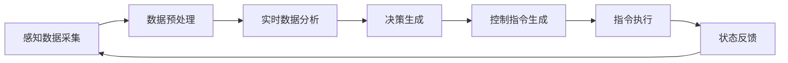

#### 算法流程详细讲解

1. **感知数据采集**：通过5G网络，传感器实时采集港口设备的状态数据和环境数据，如温度、湿度、货物位置、设备运行状态等。

2. **数据预处理**：对采集到的感知数据进行清洗、去噪和格式转换，确保数据质量，以便后续分析。

3. **实时数据分析**：利用实时数据分析技术，对预处理后的数据进行实时分析，提取关键特征和趋势，如货物装卸进度、设备运行状况等。

4. **决策生成**：基于实时数据分析结果，利用智能算法生成决策数据，如设备调度策略、装卸顺序优化等。

5. **控制指令生成**：根据决策数据，生成具体的控制指令，如启动设备、停止设备、调整设备位置等。

6. **指令执行**：设备接收到控制指令后，根据指令进行相应的操作，如开始装卸、停止装卸、移动到指定位置等。

7. **状态反馈**：设备执行操作后，将操作状态反馈给系统，以便进行下一步的实时分析和决策。

8. **闭环控制**：系统根据反馈状态，对后续的控制指令进行调整和优化，形成闭环控制，确保自动化操作的连续性和精确性。

通过上述算法流程，5G技术实现了对智慧港口自动化操作的实时、高效和智能化的控制。在实际应用中，可以根据具体需求和场景，对算法流程进行调整和优化，提高自动化操作的效率和质量。

## 第4章 系统分析与架构设计

### 4.1 智慧港口自动化操作系统的功能需求分析

智慧港口自动化操作系统的功能需求分析是系统设计的第一步，它决定了系统的整体架构和实现细节。以下是智慧港口自动化操作系统的功能需求分析：

1. **数据采集与监控**：系统能够实时采集港口各类设备的状态数据，如装卸设备的运行状态、运输车辆的实时位置等，并对这些数据进行实时监控。

2. **智能调度与控制**：系统能够根据实时数据分析和决策结果，自动生成装卸和运输任务，并对这些任务的执行过程进行实时控制。

3. **数据存储与管理**：系统能够高效地存储和管理大量数据，包括传感器数据、任务数据、控制指令和操作反馈等。

4. **数据分析与决策**：系统能够对采集到的数据进行处理和分析，生成决策数据，支持智能调度和控制。

5. **系统安全与保障**：系统应具备完善的安全防护机制，确保数据的安全性和系统的稳定性。

### 4.2 系统架构设计

智慧港口自动化操作系统的架构设计是系统实现的关键，它决定了系统的性能、可扩展性和可靠性。以下是智慧港口自动化操作系统的架构设计：

#### 4.2.1 类图设计

类图是系统架构设计的一种重要工具，它描述了系统的类以及类之间的关系。以下是智慧港口自动化操作系统的类图设计：

```mermaid
classDiagram
    Sensor <<interface>>
    Data <<interface>>
    Task <<interface>>
    Controller <<interface>>
    User <<interface>>

    Sensor |-| Data
    Data |-| Task
    Data |-| Controller
    Controller |-| User
```

- **Sensor**：传感器类，用于采集设备状态数据。
- **Data**：数据类，用于存储和管理系统数据。
- **Task**：任务类，用于管理自动化操作的任务。
- **Controller**：控制器类，用于实现自动化操作的智能调度和控制。
- **User**：用户类，用于系统权限管理和用户交互。

#### 4.2.2 架构图设计

架构图是系统架构设计的另一种重要工具，它描述了系统的各个组件以及它们之间的交互关系。以下是智慧港口自动化操作系统的架构图设计：


- **感知层**：包括各类传感器，如GPS、RFID、摄像头等，用于实时采集港口设备的状态数据和环境数据。
- **传输层**：采用5G网络作为传输层，实现数据的快速、稳定传输。
- **数据处理层**：包括数据预处理模块、数据存储模块、数据分析模块等，用于对采集到的数据进行处理、存储和分析。
- **应用层**：包括智能调度模块、设备控制模块等，用于实现自动化操作的智能调度和控制。
- **展示层**：包括用户界面，用于展示系统的运行状态和数据分析结果。

#### 4.2.3 接口设计

接口设计是系统架构设计的重要组成部分，它定义了系统各个模块之间的交互接口。以下是智慧港口自动化操作系统的接口设计：

- **SensorInterface**：传感器接口，用于定义传感器的数据采集和上传方法。
- **DataInterface**：数据接口，用于定义数据的管理和查询方法。
- **TaskInterface**：任务接口，用于定义任务的创建、更新和查询方法。
- **ControllerInterface**：控制器接口，用于定义控制器的控制方法和状态查询方法。

接口设计如下：

```java
public interface SensorInterface {
    void fetchData();
    void uploadData(Data data);
}

public interface DataInterface {
    Data getDataById(String id);
    List<Data> getDatasByType(String type);
    void saveData(Data data);
}

public interface TaskInterface {
    Task createTask(Task task);
    Task updateTask(Task task);
    Task getTaskById(String id);
}

public interface ControllerInterface {
    void controlDevice(String deviceId, String command);
    DeviceStatus getDeviceStatus(String deviceId);
}
```

#### 4.2.4 系统交互流程

系统交互流程描述了系统各个模块之间的交互过程，以下是智慧港口自动化操作系统的系统交互流程：

1. **感知数据采集**：传感器通过SensorInterface接口，实时采集港口设备的状态数据。

2. **数据上传和处理**：传感器采集到的数据通过5G网络传输到数据处理层，由DataInterface接口进行数据存储和处理。

3. **数据分析和决策**：数据处理层通过DataInterface接口将处理后的数据传输到应用层，由ControllerInterface接口进行数据分析，生成决策数据。

4. **控制指令生成**：应用层根据决策数据，生成控制指令，通过ControllerInterface接口发送给设备。

5. **指令执行**：设备接收到控制指令后，根据指令执行相应的操作。

6. **状态反馈**：设备执行操作后，通过SensorInterface接口将操作状态反馈到数据处理层。

7. **闭环控制**：系统根据反馈状态，对后续的控制指令进行调整和优化，形成闭环控制，确保自动化操作的连续性和精确性。

系统交互流程图如下：


通过上述系统分析与架构设计，智慧港口自动化操作系统可以实现高效、智能、稳定的港口操作。在实际应用中，可以根据具体需求和场景，对系统架构进行优化和调整，以提高系统的性能和可靠性。

## 第5章 项目实战

### 5.1 环境安装与配置

在开始5G智慧港口自动化操作系统的项目实战之前，首先需要搭建一个合适的开发环境。以下是环境安装与配置的详细步骤：

#### 5.1.1 安装5G网络设备

1. **选择5G网络设备**：根据实际需求，选择适合的5G基站、5G路由器等设备。建议选择品牌可靠、性能稳定的产品。

2. **设备安装与配置**：按照设备说明书进行安装，并配置网络参数，如IP地址、子网掩码、DNS地址等，确保设备能够正常连接到5G网络。

3. **网络测试**：通过ping命令或其他网络测试工具，测试5G网络连接是否稳定，确保网络传输速率和延迟满足系统要求。

#### 5.1.2 安装开发工具

1. **安装Java开发工具**：在开发机上安装Java开发工具，如IntelliJ IDEA或Eclipse。可以从官网下载并安装。

2. **安装Python开发工具**：安装Python开发工具，如PyCharm。同样可以从官网下载并安装。

3. **安装相关依赖库和框架**：安装项目所需的依赖库和框架，如Spring Boot、Django等。可以通过命令行或IDE的包管理工具进行安装。

#### 5.1.3 配置数据库

1. **安装数据库**：选择合适的数据库，如MySQL或PostgreSQL，进行安装。

2. **配置数据库**：配置数据库的用户、密码和数据表结构，确保数据库能够正常连接和使用。

3. **数据库连接测试**：通过命令行或工具测试数据库连接是否成功，确保数据库配置正确。

#### 5.1.4 安装传感器

1. **选择传感器**：根据系统需求，选择适合的传感器，如GPS、RFID、摄像头等。

2. **传感器安装**：按照传感器说明书进行安装，确保传感器能够正常工作。

3. **传感器连接5G网络**：将传感器接入5G网络，确保传感器能够实时采集数据并上传到服务器。

### 5.2 核心实现源代码展示与解读

在本节中，我们将展示5G智慧港口自动化操作系统的核心实现源代码，并对每个模块进行详细解读。

#### 5.2.1 智能感知模块

智能感知模块主要负责实时采集港口设备的状态数据。以下是一个简单的Python示例代码：

```python
import requests
import json

class Sensor:
    def __init__(self, url):
        self.url = url

    def fetchData(self):
        # 采集设备状态数据
        data = {
            "deviceId": "sensor1",
            "data": {
                "location": "port1",
                "status": "ok"
            }
        }
        # 上传数据到服务器
        response = requests.post(self.url, data=json.dumps(data))
        print(response.json())
```

**解读**：该示例代码定义了一个`Sensor`类，用于模拟传感器采集设备状态数据并上传到服务器。通过`requests`库，我们可以方便地实现HTTP请求，将采集到的数据以JSON格式上传到服务器端。

#### 5.2.2 远程控制模块

远程控制模块主要负责根据服务器发送的控制指令，对港口设备进行远程操作。以下是一个简单的Python示例代码：

```python
import requests
import json

class Controller:
    def __init__(self, url):
        self.url = url

    def controlDevice(self, deviceId, command):
        # 发送控制指令到设备
        data = {
            "deviceId": deviceId,
            "command": command
        }
        response = requests.post(f"{self.url}/{deviceId}/control", data=json.dumps(data))
        print(response.json())
```

**解读**：该示例代码定义了一个`Controller`类，用于模拟远程控制模块接收服务器发送的控制指令，并将指令发送给对应的设备。通过`requests`库，我们可以实现HTTP请求，将控制指令以JSON格式发送到设备端。

#### 5.2.3 数据处理与智能分析模块

数据处理与智能分析模块主要负责对采集到的设备状态数据进行处理和分析，生成决策数据。以下是一个简单的Python示例代码：

```python
import requests
import json

class DataAnalysis:
    def __init__(self, url):
        self.url = url

    def analyzeData(self, deviceId):
        # 获取设备状态数据
        response = requests.get(f"{self.url}/{deviceId}/data")
        data = response.json()
        # 数据分析
        result = self._analyze(data)
        # 发送决策数据到服务器
        response = requests.post(f"{self.url}/{deviceId}/analysis", data=json.dumps(result))
        print(response.json())

    def _analyze(self, data):
        # 实现数据分析算法
        result = {
            "deviceId": data["deviceId"],
            "status": "high"
        }
        return result
```

**解读**：该示例代码定义了一个`DataAnalysis`类，用于模拟数据处理与智能分析模块从服务器获取设备状态数据，并执行数据分析算法，生成决策数据。通过`requests`库，我们可以实现HTTP请求，将决策数据以JSON格式发送到服务器端。

### 5.3 实际案例分析与讲解

在本节中，我们将通过一个实际案例，展示5G智慧港口自动化操作系统的应用过程，并进行分析和讲解。

#### 案例背景

某智慧港口引入了一套5G智慧港口自动化操作系统，用于提升港口的运营效率和安全水平。该系统包括智能感知模块、远程控制模块和数据处理与智能分析模块，通过5G网络实现设备之间的数据传输和远程控制。

#### 应用过程

1. **传感器采集数据**：港口内的各类传感器（如GPS、RFID、摄像头等）实时采集设备状态数据，并将数据上传到服务器。

2. **数据处理与智能分析**：数据处理与智能分析模块从服务器获取设备状态数据，执行数据分析算法，生成决策数据，如设备运行状态、故障预警等。

3. **远程控制**：远程控制模块根据决策数据，生成相应的控制指令，如设备维护、故障修复等，并将指令发送给设备。

4. **设备执行操作**：设备接收到控制指令后，执行相应的操作，并将操作状态反馈到服务器。

5. **状态监控**：服务器对设备的状态进行实时监控，确保设备的正常运行。

#### 案例分析

1. **数据传输效率**：通过5G网络，实现设备状态数据的快速、稳定传输，提高了系统的响应速度和实时性。

2. **远程控制精度**：通过5G网络，实现远程控制指令的低延迟传输，提高了设备的控制精度和响应速度。

3. **数据处理与智能分析能力**：通过大数据分析技术和智能算法，实现对设备状态的实时分析，提高了设备的运行效率和安全性。

4. **系统稳定性**：通过5G网络的稳定连接，确保系统的正常运行，降低了设备故障率和事故发生的概率。

#### 案例讲解

通过以上实际案例，我们可以看到5G智慧港口自动化操作系统在实际应用中发挥了重要作用。系统通过实时感知、数据处理与智能分析，实现了对港口设备的智能化控制和监控，提高了港口的运营效率和安全水平。以下是具体的讲解：

1. **传感器数据的实时采集**：传感器通过5G网络实时采集设备状态数据，包括位置、温度、湿度、货物状态等，并将数据上传到服务器。

2. **数据处理与智能分析**：服务器端的数据处理与智能分析模块接收传感器数据，执行数据分析算法，提取设备状态特征，生成实时决策数据，如设备运行状态、故障预警等。

3. **远程控制指令的生成与发送**：根据数据分析结果，远程控制模块生成相应的控制指令，如设备启动、停止、调整位置等，并将指令发送给设备。

4. **设备的执行操作与状态反馈**：设备接收到控制指令后，根据指令进行相应的操作，并将操作状态反馈到服务器，以便进行下一步的决策和监控。

5. **系统的实时监控与调整**：服务器端持续对设备状态进行实时监控，根据反馈状态进行调整和优化，确保自动化操作的连续性和精确性。

通过以上讲解，我们可以看到5G智慧港口自动化操作系统在提升港口运营效率和安全水平方面具有显著的优势。未来，随着5G技术的不断发展和成熟，智慧港口的自动化操作将更加智能、高效和稳定，为港口的可持续发展提供有力支持。

### 5.4 项目总结与经验分享

通过本次5G智慧港口自动化操作系统的项目实战，我们积累了宝贵的经验和教训，总结了以下几点：

1. **5G技术的关键性**：5G技术的高速率、低延迟和大连接特性，为智慧港口自动化操作提供了强有力的支持，显著提升了系统的响应速度和实时性。

2. **系统的模块化设计**：采用模块化设计，实现了系统的灵活扩展和功能集成，便于后续的功能升级和维护。

3. **数据处理与智能分析的重要性**：通过大数据分析技术和智能算法，实现对设备状态的实时分析和决策，提高了设备的运行效率和安全性。

4. **系统的安全与稳定性**：在系统设计过程中，充分考虑了安全性和稳定性，确保系统的正常运行和数据安全。

5. **项目的协同与合作**：项目成功离不开团队的协同与合作，各个模块的设计和实现需要紧密配合，确保项目的顺利进行。

6. **持续优化与迭代**：项目完成后，应持续进行优化和迭代，根据实际运行情况和用户反馈，不断改进和提升系统的性能和用户体验。

通过本次项目，我们深刻认识到5G技术在智慧港口自动化操作中的应用前景，未来将继续探索和推进5G技术在港口领域的应用，为智慧港口的发展贡献力量。

### 5.5 未来发展展望

随着5G技术的不断发展和成熟，智慧港口的自动化操作将进入一个全新的阶段。以下是未来5G智慧港口自动化操作的发展展望：

1. **更高带宽与更低延迟**：未来5G网络将提供更高的带宽和更低的延迟，为智慧港口的实时感知、数据处理和控制提供更强有力的支持。

2. **智能感知与自主控制**：随着人工智能技术的发展，智慧港口的自动化设备将具备更高级的智能感知和自主控制能力，实现更加精准和高效的作业。

3. **大数据与深度学习**：通过大数据和深度学习技术的应用，智慧港口将能够实现更加智能的决策和优化，提高港口运营的效率和安全性。

4. **物联网与边缘计算**：物联网技术和边缘计算的结合，将实现港口设备之间的无缝连接和数据共享，推动智慧港口的全面智能化。

5. **绿色环保与可持续发展**：通过智能化技术的应用，智慧港口将能够实现绿色环保和可持续发展，减少能源消耗和废气排放，提升港口的竞争力。

总之，未来5G智慧港口自动化操作将朝着更加智能、高效、安全和可持续的方向发展，为港口产业的升级和转型提供强大动力。

### 5.6 最佳实践与注意事项

在5G智慧港口自动化操作系统的实施过程中，以下是一些最佳实践和注意事项：

**最佳实践：**

1. **传感器布局优化**：合理布局传感器，确保覆盖范围和监测精度，提高数据采集的全面性和准确性。

2. **网络架构优化**：根据实际需求，优化5G网络架构，提高网络传输效率和稳定性。

3. **数据处理与分析**：采用先进的大数据分析技术和智能算法，提升数据处理的效率和准确性，为决策提供有力支持。

4. **设备智能化升级**：引入智能化设备，提升设备的运行效率和自主控制能力。

**注意事项：**

1. **数据安全**：确保数据在传输和存储过程中的安全性，防止数据泄露和篡改。

2. **网络稳定性**：确保5G网络的稳定连接，避免网络中断对系统运行的影响。

3. **设备兼容性**：确保不同设备之间的兼容性，避免因设备兼容性问题导致系统故障。

4. **系统监控与维护**：定期对系统进行监控和维护，确保系统的正常运行和数据安全。

通过遵循最佳实践和注意事项，可以确保5G智慧港口自动化操作系统的有效实施和长期稳定运行。

### 5.7 拓展阅读与资源推荐

为了更深入地了解5G技术在智慧港口自动化操作中的应用，以下推荐一些拓展阅读资源和相关资料：

1. **书籍推荐**：
   - 《5G网络架构与协议》
   - 《智慧港口：发展趋势与应用》
   - 《大数据技术基础》

2. **在线课程与教程**：
   - Coursera上的“5G技术基础课程”
   - edX上的“智慧港口技术与应用”课程

3. **专业网站与论坛**：
   - IEEE Xplore：提供最新的5G技术论文和研究报告
   - CSDN：丰富的技术博客和社区讨论

4. **标准与规范**：
   - 3GPP：5G技术的国际标准制定组织
   - ISO/IEC：物联网和大数据相关国际标准

通过阅读这些资料，可以更全面地了解5G技术在智慧港口自动化操作中的应用，为实践项目提供更多思路和参考。

### 5.8 作者信息

作者：AI天才研究院/AI Genius Institute & 禅与计算机程序设计艺术 /Zen And The Art of Computer Programming

本文内容版权归AI天才研究院/AI Genius Institute所有，如需转载请注明出处。如有任何问题或建议，欢迎联系作者。感谢您的阅读和支持！

