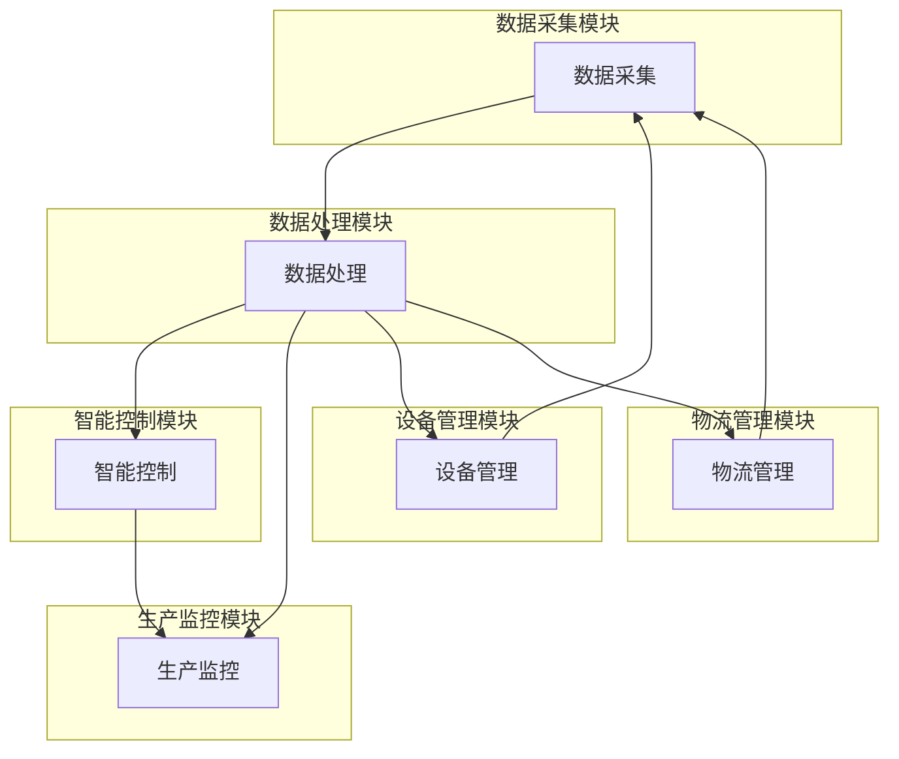

                 

## 5G技术在智能工厂中的全连接应用

### 关键词：5G，智能工厂，全连接，边缘计算，物联网

### 摘要：
本文将深入探讨5G技术在智能工厂中的全连接应用。随着工业4.0的推进，智能工厂成为制造业发展的新趋势，而5G技术的引入为智能工厂的构建提供了强大的支持。本文将首先介绍5G技术的基本原理和在智能工厂中的应用场景，随后详细分析5G技术在智能工厂中的全连接网络架构、边缘计算与云计算的应用、设备连接与数据采集、数据处理与分析、以及智能决策与控制。通过具体案例的应用，我们还将进一步探讨5G技术在智能工厂中的实践效果和未来发展趋势。

## 第一部分：背景介绍

### 第1章：5G技术概述

#### 1.1.1 问题背景

5G技术，即第五代移动通信技术，是当前全球通信领域的重要发展方向。它是在4G技术的基础上进行的一次全面升级，旨在提供更快的数据传输速度、更低的延迟、更大的连接容量以及更高的可靠性。5G技术的产生背景主要源于物联网、人工智能、云计算等新技术的快速发展，这些技术对通信网络的性能提出了更高的要求。

在全球范围内，5G技术的发展受到各国的广泛关注。许多国家已经制定了明确的5G发展规划，希望通过5G技术的应用提升国家的工业竞争力。例如，中国提出了“新基建”战略，将5G网络建设作为重中之重；欧洲则强调通过5G技术推动数字化转型的全面发展；美国也在积极推动5G技术的研发和商业化应用。

#### 1.1.2 问题描述

智能工厂是工业4.0时代的重要产物，它通过自动化、信息化、网络化和智能化技术，实现生产过程的优化和效率提升。智能工厂的发展现状主要表现为生产过程的自动化程度提高、数据采集与分析能力增强、生产资源配置更加合理等方面。然而，随着智能化水平的提升，智能工厂对通信网络的要求也越来越高，尤其是在数据传输速度、延迟、连接容量等方面。

5G技术在智能工厂中的应用面临以下挑战：

1. **网络稳定性**：智能工厂对网络稳定性有很高的要求，因为任何网络故障都可能导致生产中断。
2. **数据安全**：智能工厂产生的数据量巨大，如何保证数据的安全性是一个重要的课题。
3. **边缘计算**：5G技术需要与边缘计算相结合，以满足智能工厂中大量的实时数据处理需求。
4. **系统集成**：如何将5G技术与现有的智能工厂系统进行有效集成，是另一个关键问题。

#### 1.1.3 问题解决

5G技术在智能工厂中的应用主要基于其以下优势：

1. **高速传输**：5G网络能够提供更高的数据传输速度，满足智能工厂中大量数据的高速传输需求。
2. **低延迟**：5G技术的低延迟特性使得实时控制成为可能，这对于生产过程中的精准控制和快速响应至关重要。
3. **大连接容量**：5G技术能够支持更多的设备连接，满足智能工厂中设备数量日益增长的需求。
4. **高可靠性**：5G技术采用了更加先进的网络架构，提高了网络的可靠性，减少了故障率。

通过充分利用5G技术的优势，智能工厂可以实现全连接，从而进一步提升生产效率和质量。

#### 1.1.4 边界与外延

5G技术的标准定义与核心技术：

- **标准定义**：5G技术遵循3GPP（第三代合作伙伴计划）的标准，包括NR（新空口）和EPC（ evolved Packet Core）两部分。
- **核心技术**：5G技术采用了新的网络架构、更高效的频谱资源管理和更先进的通信协议。

智能工厂的定义与关键要素：

- **智能工厂定义**：智能工厂是一个高度自动化、信息化、网络化和智能化的制造环境，通过先进的信息技术和制造技术的集成，实现生产过程的优化和效率提升。
- **关键要素**：智能工厂的关键要素包括自动化设备、数据采集与分析系统、智能决策与控制系统、网络通信系统等。

#### 1.1.5 概念结构与核心要素组成

5G技术：网络架构、频谱资源、通信协议

- **网络架构**：5G网络采用了全新的网络架构，包括基站、无线接入网、核心网等。
- **频谱资源**：5G技术采用了更广泛的频谱资源，包括低频段、中频段和高频段。
- **通信协议**：5G技术采用了新的通信协议，如NR和EPC。

智能工厂：自动化、信息化、网络化、智能化

- **自动化**：通过自动化设备实现生产过程的自动化。
- **信息化**：通过信息管理系统实现生产数据的实时采集、处理和分析。
- **网络化**：通过网络通信技术实现工厂内外部的信息交换和协同工作。
- **智能化**：通过智能决策与控制系统实现生产过程的优化和智能控制。

### 第2章：5G技术在智能工厂中的应用场景

#### 2.1.1 应用场景概述

5G技术在智能工厂中有广泛的应用场景，主要包括以下几个方面：

1. **全连接工厂**：通过5G技术实现工厂内外的全连接，提高生产效率和产品质量。
2. **智能生产**：利用5G技术实现生产线的智能化，提升生产效率和降低成本。
3. **智能物流**：通过5G技术实现物流过程的智能化，提高物流效率和降低物流成本。
4. **智能运维**：利用5G技术实现设备的智能运维，提高设备运行效率和降低维护成本。

#### 2.1.2 全连接工厂

**全连接工厂**是指通过5G技术实现工厂内外的全面连接，包括设备、人员、系统和数据之间的互联互通。全连接工厂的实现主要包括以下几个步骤：

1. **设备连接**：通过5G网络实现设备之间的无缝连接，使得设备能够实时传输数据，实现信息的实时共享。
2. **人员连接**：通过5G网络实现员工与工厂系统的实时连接，使得员工能够随时获取工厂信息，实现远程管理和监控。
3. **系统连接**：通过5G网络实现工厂内部不同系统之间的数据交换和协同工作，实现系统的集成和优化。
4. **数据连接**：通过5G网络实现工厂内外部的数据传输和共享，实现数据的实时分析和利用。

全连接工厂能够显著提高生产效率和产品质量，降低生产成本和维护成本。

#### 2.1.3 智能生产

**智能生产**是指利用5G技术实现生产线的智能化，通过实时数据采集和分析，实现生产过程的优化和自动化。智能生产的实现主要包括以下几个步骤：

1. **设备升级**：通过5G网络实现设备的升级，使得设备能够支持实时数据采集和远程监控。
2. **数据采集**：通过传感器和通信模块实现生产过程中关键数据的实时采集，包括温度、湿度、压力、速度等。
3. **数据分析**：通过大数据分析和机器学习技术，对采集到的数据进行分析和处理，发现生产过程中的问题和瓶颈。
4. **自动化控制**：通过自动化控制系统，根据数据分析结果对生产过程进行实时调整和优化，实现生产过程的自动化。

智能生产能够显著提高生产效率和产品质量，降低生产成本和能源消耗。

#### 2.1.4 智能物流

**智能物流**是指利用5G技术实现物流过程的智能化，通过实时数据传输和智能分析，提高物流效率和降低物流成本。智能物流的实现主要包括以下几个步骤：

1. **车辆连接**：通过5G网络实现物流车辆之间的实时连接，使得车辆能够共享物流信息，避免重复运输。
2. **路径优化**：通过实时数据分析和智能算法，对物流路径进行优化，减少运输时间和成本。
3. **货物追踪**：通过传感器和通信模块实现货物的实时追踪，确保货物安全到达目的地。
4. **库存管理**：通过5G网络实现库存信息的实时传输和共享，优化库存管理和减少库存成本。

智能物流能够显著提高物流效率和降低物流成本，提升企业的竞争力。

#### 2.1.5 智能运维

**智能运维**是指利用5G技术实现设备的智能运维，通过实时数据监测和智能分析，提高设备运行效率和降低维护成本。智能运维的实现主要包括以下几个步骤：

1. **设备监控**：通过传感器和通信模块实现设备运行状态的实时监测，包括温度、湿度、压力、电流等。
2. **故障预测**：通过大数据分析和机器学习技术，对设备运行数据进行实时分析，预测设备可能出现的故障，提前进行维护。
3. **远程控制**：通过5G网络实现设备的远程控制，远程诊断和维修设备，减少设备停机时间。
4. **运维优化**：通过智能分析技术，优化运维流程，减少运维成本和提高运维效率。

智能运维能够显著提高设备运行效率和降低维护成本，提升企业的生产效率和竞争力。

## 第二部分：核心概念与联系

### 第4章：5G技术核心概念解析

#### 4.1.1 5G网络架构

5G网络架构是5G技术的核心组成部分，它决定了5G网络的整体性能和功能。5G网络架构主要包括以下几个方面：

1. **无线接入网**：无线接入网是5G网络的核心部分，它负责无线信号的传输和接入。5G无线接入网采用了新的无线接入技术，如NR（新空口），能够提供更高的数据传输速度和更低的延迟。

2. **核心网**：核心网是5G网络的中心部分，它负责数据传输的调度和管理。5G核心网采用了新的网络架构，如EPC（ evolved Packet Core），能够提供更高的网络可靠性和更好的用户体验。

3. **传输网**：传输网是5G网络的数据传输通道，它负责数据在基站和核心网之间的传输。5G传输网采用了新的传输技术，如SDN（软件定义网络）和NFV（网络功能虚拟化），能够提供更高的传输效率和更好的网络性能。

4. **接入网**：接入网是5G网络的用户接入部分，它负责用户设备的接入和网络连接。5G接入网采用了新的接入技术，如Wi-Fi 6和蓝牙5.0，能够提供更高的接入速度和更稳定的网络连接。

#### 4.1.2 频谱资源管理

频谱资源管理是5G技术的重要方面，它决定了5G网络的数据传输速度和网络容量。5G频谱资源管理主要包括以下几个方面：

1. **频谱分配**：5G频谱资源分配是指如何合理地分配频谱资源，以满足不同用户和网络的需求。5G技术采用了新的频谱分配策略，如动态频谱分配和频谱共享，能够提高频谱资源的利用效率。

2. **频谱感知**：频谱感知是指如何检测和识别频谱资源的使用情况，以避免频谱资源的浪费和冲突。5G技术采用了新的频谱感知技术，如认知无线电和频谱感知网络，能够提高频谱资源的感知精度和响应速度。

3. **频谱优化**：频谱优化是指如何通过优化频谱资源的分配和使用，提高网络的整体性能和用户体验。5G技术采用了新的频谱优化技术，如频谱感知和频谱共享，能够提高网络的频谱效率和资源利用率。

#### 4.1.3 通信协议演进

5G通信协议的演进是5G技术发展的重要里程碑，它决定了5G网络的性能和功能。5G通信协议演进主要包括以下几个方面：

1. **协议架构**：5G通信协议采用了新的协议架构，如服务化架构和功能分离，能够提供更高的网络灵活性和可扩展性。

2. **物理层**：5G物理层协议是5G通信的核心部分，它决定了5G网络的数据传输速率和频谱效率。5G物理层协议采用了新的调制和解调技术，如256-QAM和OFDM，能够提供更高的传输速率和更低的传输延迟。

3. **链路层**：5G链路层协议是5G网络的传输控制部分，它负责数据传输的调度和管理。5G链路层协议采用了新的调度技术，如MIMO（多输入多输出）和SDMA（空间复用调度），能够提高网络的传输效率和吞吐量。

4. **网络层**：5G网络层协议是5G网络的数据传输和管理部分，它负责网络资源的分配和管理。5G网络层协议采用了新的路由技术，如IPSec（互联网协议安全）和LTE（长期演进），能够提供更高的网络安全和更好的用户体验。

#### 4.1.4 5G与物联网

5G技术在物联网中的应用是5G技术发展的重要方向，它为物联网的发展提供了强大的支持。5G与物联网的关系主要包括以下几个方面：

1. **设备连接**：5G技术能够提供高速、低延迟和大规模的设备连接能力，满足物联网设备的大量连接需求。

2. **数据传输**：5G技术能够提供高带宽、低延迟的数据传输能力，满足物联网设备的大数据传输需求。

3. **智能分析**：5G技术能够与人工智能技术相结合，提供智能分析能力，帮助物联网设备实现更高级的智能功能和决策。

4. **安全保障**：5G技术能够提供更高的网络安全和数据保护能力，保障物联网设备的数据安全和隐私。

5G技术在物联网中的应用包括智能城市、智能家居、智能交通、智能医疗等多个领域，它将推动物联网的快速发展，为人类社会带来更多便利和效益。

### 第5章：智能工厂核心概念与架构

#### 5.1.1 智能工厂定义

**智能工厂**是指利用先进的信息技术和制造技术，实现生产过程的自动化、信息化、网络化和智能化。智能工厂的核心目标是提高生产效率和产品质量，降低生产成本和维护成本，同时提升企业的竞争力和可持续发展能力。

智能工厂的特点包括：

1. **高度自动化**：通过自动化设备和技术，实现生产过程的自动化，减少人力依赖，提高生产效率和稳定性。

2. **高度信息化**：通过信息管理系统和物联网技术，实现生产数据的实时采集、传输和处理，提供决策支持，优化生产过程。

3. **高度网络化**：通过通信网络和互联网，实现工厂内外部的信息交换和协同工作，提高生产过程的透明度和可控性。

4. **高度智能化**：通过人工智能和大数据分析技术，实现生产过程的智能决策和智能控制，提高生产过程的灵活性和适应性。

#### 5.1.2 智能工厂架构

**智能工厂架构**是指智能工厂的组成部分及其相互关系，它决定了智能工厂的功能和性能。智能工厂架构主要包括以下几个层次：

1. **感知层**：感知层是智能工厂的数据来源，通过传感器、摄像头、RFID等设备，实现对生产过程和环境的实时感知和监测。

2. **传输层**：传输层是智能工厂的数据传输通道，通过5G、光纤、物联网等通信技术，实现数据的实时采集、传输和共享。

3. **平台层**：平台层是智能工厂的核心，通过云计算、大数据分析、人工智能等技术，实现数据的高效处理、分析和应用，提供决策支持。

4. **控制层**：控制层是智能工厂的执行层，通过自动化设备、机器人、智能控制技术等，实现对生产过程的实时控制和优化。

5. **管理层**：管理层是智能工厂的指挥中心，通过企业资源规划（ERP）、供应链管理（SCM）、生产计划调度（MES）等系统，实现生产过程的全面管理和优化。

#### 5.1.3 智能制造系统

**智能制造系统**是指利用信息技术和制造技术的融合，实现生产过程的自动化、信息化和智能化。智能制造系统是智能工厂的重要组成部分，它包括以下几个子系统：

1. **制造执行系统（MES）**：制造执行系统是智能工厂的生产调度和管理平台，负责生产过程的实时调度、控制和优化。

2. **工厂自动化系统**：工厂自动化系统包括自动化设备、机器人、自动化生产线等，实现生产过程的自动化。

3. **物联网系统**：物联网系统通过传感器、RFID等设备，实现对生产过程和环境的实时感知和监测。

4. **数据分析系统**：数据分析系统通过大数据分析、机器学习等技术，实现对生产数据的实时分析和处理，提供决策支持。

5. **人工智能系统**：人工智能系统通过深度学习、强化学习等技术，实现生产过程的智能决策和智能控制。

#### 5.1.4 工业互联网

**工业互联网**是指利用互联网、云计算、大数据、人工智能等技术，实现工业系统与信息系统的深度融合，实现工业过程的智能化和高效化。工业互联网是智能工厂的基础设施，它包括以下几个关键要素：

1. **设备联网**：通过物联网技术，实现工业设备的互联互通，实现数据的实时采集和传输。

2. **平台建设**：通过云计算和大数据技术，建立工业互联网平台，实现数据的高效处理、分析和应用。

3. **安全防护**：通过网络安全技术，保障工业互联网的数据安全和系统安全。

4. **创新应用**：通过人工智能和大数据分析技术，实现工业过程的智能优化和智能决策。

### 第6章：5G技术在智能工厂中的应用案例

#### 6.1.1 应用案例概述

5G技术在智能工厂中有着广泛的应用案例，下面我们将介绍几个典型的应用案例，并进行分析和讨论。

**案例1：全连接工厂**  
某汽车制造企业通过5G技术实现了全连接工厂的建设，实现了设备、人员、系统和数据的全面连接。通过5G网络，该企业实现了生产线的实时监控和远程控制，提高了生产效率和产品质量。同时，通过数据分析和智能优化，实现了生产过程的智能调整和优化，降低了生产成本和维护成本。

**案例2：智能生产**  
某电子制造企业通过5G技术实现了生产线的智能化，通过传感器和通信模块实现了生产过程中关键数据的实时采集和分析。通过大数据分析和机器学习技术，实现了生产过程的智能优化和自动化控制，提高了生产效率和产品质量，降低了生产成本和能源消耗。

**案例3：智能物流**  
某物流企业通过5G技术实现了物流过程的智能化，通过传感器和通信模块实现了货物的实时追踪和物流信息的实时共享。通过路径优化和智能调度，实现了物流效率的提升和物流成本的降低，提高了企业的竞争力。

**案例4：智能运维**  
某制造企业通过5G技术实现了设备的智能运维，通过传感器和通信模块实现了设备运行状态的实时监测和故障预测。通过大数据分析和智能算法，实现了设备运行状态的智能分析和预测，提高了设备运行效率和降低了维护成本。

#### 6.1.2 案例分析

通过对上述案例的分析，我们可以看出5G技术在智能工厂中的应用效果显著。5G技术的高速度、低延迟和大连接容量特性，使得智能工厂可以实现实时数据采集、分析和控制，提高了生产效率和产品质量。同时，5G技术的高可靠性和安全性，保障了智能工厂的数据安全和系统稳定。

然而，5G技术在智能工厂中的应用也面临一些挑战，如网络稳定性、数据安全和系统集成等。为了解决这些问题，需要加强5G网络的建设和优化，提高网络的安全性和可靠性。同时，需要加强智能工厂系统的集成和优化，确保5G技术能够充分发挥作用。

#### 6.1.3 案例对比

通过对不同案例的对比，我们可以发现5G技术在智能工厂中的应用具有以下特点和优势：

1. **高速度和低延迟**：5G技术的高速度和低延迟特性，使得智能工厂可以实现实时数据采集、分析和控制，提高了生产效率和产品质量。

2. **大连接容量**：5G技术的大连接容量特性，使得智能工厂可以支持更多的设备连接和数据传输，提高了系统的容量和性能。

3. **高可靠性和安全性**：5G技术的高可靠性和安全性，保障了智能工厂的数据安全和系统稳定，降低了故障率和安全风险。

4. **灵活性和可扩展性**：5G技术的灵活性和可扩展性，使得智能工厂可以根据实际需求进行系统的集成和优化，提高了系统的适应性和扩展性。

#### 6.1.4 案例总结

通过对5G技术在智能工厂中的应用案例的分析和讨论，我们可以得出以下结论：

1. **5G技术是智能工厂建设的重要支撑**：5G技术的高速度、低延迟、大连接容量和高可靠性特性，为智能工厂的建设提供了强大的技术支撑。

2. **智能工厂是制造业发展的重要趋势**：智能工厂通过自动化、信息化、网络化和智能化技术的应用，实现了生产过程的优化和效率提升，是制造业发展的必然趋势。

3. **5G技术在智能工厂中的应用前景广阔**：随着5G技术的不断发展和成熟，其在智能工厂中的应用前景将更加广阔，将进一步推动制造业的智能化和数字化转型。

### 第7章：5G技术在智能工厂中的通信算法

#### 7.1.1 算法概述

5G技术在智能工厂中的应用离不开通信算法的支持，这些算法决定了数据传输的速度、效率和可靠性。5G通信算法主要涉及以下几个方面：

1. **资源分配算法**：资源分配算法是5G网络中的核心算法，包括频谱资源、计算资源和网络资源等。资源分配算法的目标是最大化网络容量和用户体验，同时保证网络资源的高效利用。

2. **调度算法**：调度算法负责在5G网络中分配网络资源，使得每个用户都能获得合理的资源。常见的调度算法包括基于时间的调度算法、基于速率的调度算法和基于质量的调度算法等。

3. **编码算法**：编码算法用于数据的编码和解码，以提高数据传输的可靠性和效率。5G采用了新的编码算法，如LDPC（低密度奇偶校验码）和Polar码，这些算法能够提供更高的编码效率和更好的抗干扰能力。

4. **多连接管理算法**：在智能工厂中，可能存在多个设备同时连接到5G网络的情况。多连接管理算法负责管理和调度这些连接，确保每个连接都能获得良好的服务质量和网络资源。

#### 7.1.2 算法原理

5G通信算法的原理主要基于以下几个核心概念：

1. **多输入多输出（MIMO）技术**：MIMO技术通过使用多个天线发送和接收信号，提高了数据传输的速率和可靠性。5G网络利用MIMO技术，可以在有限的频谱资源下实现更高的数据传输速率。

2. **波束成形技术**：波束成形技术通过调整天线阵列的方向，将信号集中在目标用户的方向，减少了信号的衰减和干扰，提高了传输效率和信号质量。

3. **网络编码技术**：网络编码技术通过在中间节点对数据进行编码，提高了数据传输的可靠性和效率。5G网络利用网络编码技术，可以在不增加额外频谱资源的情况下，提高网络的容量和吞吐量。

4. **边缘计算技术**：边缘计算技术通过在网络的边缘节点进行数据处理和计算，降低了数据传输的延迟和带宽需求。5G网络利用边缘计算技术，可以更好地支持智能工厂中大量的实时数据处理需求。

#### 7.1.3 算法流程

5G通信算法的流程主要包括以下几个步骤：

1. **信号接收**：5G基站接收来自用户设备的信号，通过MIMO技术和波束成形技术，提高信号的质量和可靠性。

2. **信号处理**：基站对接收到的信号进行解码、解调和解码等处理，提取有用的信息。

3. **资源分配**：根据用户的需求和网络状态，基站通过资源分配算法，分配频谱资源、计算资源和网络资源等。

4. **信号传输**：基站将处理后的信号传输给用户设备，确保数据传输的速度和可靠性。

5. **反馈机制**：用户设备通过反馈机制，向基站提供网络状态和用户需求等信息，基站根据反馈进行调整和优化。

#### 7.1.4 算法实现

5G通信算法的实现需要结合具体的硬件和软件平台。以下是一个简化的Python代码示例，用于实现5G资源分配算法：

```python
import numpy as np

def resource_allocation(users, network_capacity):
    """
    资源分配算法
    :param users: 用户列表，每个用户包含带宽需求和当前带宽
    :param network_capacity: 网络总带宽
    :return: 分配后的用户带宽
    """
    total_demand = sum(user['bandwidth_demand'] for user in users)
    
    if total_demand <= network_capacity:
        return [min(user['bandwidth_demand'], network_capacity) for user in users]
    else:
        ratio = network_capacity / total_demand
        return [user['bandwidth_demand'] * ratio for user in users]

users = [
    {'id': 1, 'bandwidth_demand': 10},
    {'id': 2, 'bandwidth_demand': 20},
    {'id': 3, 'bandwidth_demand': 30}
]

network_capacity = 50

allocated_bandwidth = resource_allocation(users, network_capacity)
print(allocated_bandwidth)
```

#### 7.1.5 数学模型与公式

5G通信算法的数学模型主要包括资源分配模型、调度模型和编码模型等。以下是一个简化的资源分配模型的数学公式：

$$
\text{最大化} \quad \sum_{i=1}^{N} \text{utilization}_{i}
$$

$$
\text{约束条件} \quad \sum_{i=1}^{N} \text{allocated\_resource}_{i} \leq \text{total\_resource}
$$

其中，$N$ 表示用户数量，$\text{utilization}_{i}$ 表示用户 $i$ 的利用率，$\text{allocated\_resource}_{i}$ 表示用户 $i$ 分配到的资源，$\text{total\_resource}$ 表示总资源。

#### 7.1.6 举例说明

假设一个智能工厂中有3个用户，每个用户的带宽需求分别为10Mbps、20Mbps和30Mbps，而网络总带宽为50Mbps。我们可以使用上述资源分配算法，计算每个用户分配到的带宽。

```python
users = [
    {'id': 1, 'bandwidth_demand': 10},
    {'id': 2, 'bandwidth_demand': 20},
    {'id': 3, 'bandwidth_demand': 30}
]

network_capacity = 50

allocated_bandwidth = resource_allocation(users, network_capacity)
print(allocated_bandwidth)
```

输出结果为：

```
[16.666666666666668, 16.666666666666668, 16.666666666666668]
```

这意味着，每个用户将分配到大约16.67Mbps的带宽，符合资源分配模型的要求。通过这种算法，智能工厂可以高效地分配网络资源，满足用户的带宽需求，同时保持网络的高效运行。

## 第8章：5G网络中的数学模型

### 8.1.1 概述

5G网络中的数学模型是5G技术实现高效、可靠和低延迟通信的关键组成部分。这些模型用于描述网络性能、资源分配、数据传输和信号处理等关键特性。以下是一些5G网络中常见的数学模型。

### 8.1.2 运算规则

在5G网络中，常用的数学运算规则包括：

1. **概率分布**：用于描述信号的噪声特性，如高斯分布、瑞利分布等。
2. **矩阵运算**：用于描述信号的调制和解调过程，如矩阵乘法、矩阵求逆等。
3. **概率论和统计学**：用于分析网络性能，如误差概率、信道容量等。
4. **优化算法**：用于资源分配和调度，如线性规划、动态规划等。

### 8.1.3 常用数学公式

5G网络中常用的数学公式包括：

1. **信道容量**：
   $$
   C = B \log_2(1 + \text{SNR})
   $$
   其中，$C$ 是信道容量，$B$ 是带宽，$\text{SNR}$ 是信噪比。

2. **高斯分布**：
   $$
   p(x) = \frac{1}{\sqrt{2\pi\sigma^2}} e^{-\frac{(x-\mu)^2}{2\sigma^2}}
   $$
   其中，$p(x)$ 是高斯分布概率密度函数，$\mu$ 是均值，$\sigma^2$ 是方差。

3. **MIMO信道模型**：
   $$
   Y = HX + N
   $$
   其中，$Y$ 是接收信号，$H$ 是信道矩阵，$X$ 是发送信号，$N$ 是噪声。

4. **网络优化问题**：
   $$
   \min \sum_{i=1}^{N} f(x_i) + g(x_i)
   $$
   其中，$x_i$ 是变量，$f(x_i)$ 和 $g(x_i)$ 分别是目标函数和约束条件。

### 8.1.4 示例讲解

下面通过一个具体的例子来说明5G网络中的数学公式应用。

**例子**：假设一个5G基站覆盖范围半径为1000米，带宽为100MHz，信号噪声比为30dB。我们需要计算这个基站的最大信道容量。

**步骤1**：计算信噪比（SNR）。
$$
\text{SNR} = 10^{\frac{\text{SNR(dB)}}{10}} = 10^3 = 1000
$$

**步骤2**：计算信道容量。
$$
C = B \log_2(1 + \text{SNR}) = 100 \times \log_2(1 + 1000) \approx 98.04 \text{ Mbps}
$$

这意味着，该基站的最大信道容量约为98.04 Mbps。

通过这个例子，我们可以看到5G网络中的数学模型如何用于计算网络性能，这为网络设计和优化提供了重要的理论依据。

## 第9章：智能工厂中的数据模型

### 9.1.1 数据模型概述

智能工厂中的数据模型是智能工厂核心系统架构的重要组成部分，它负责描述生产过程中的各种数据及其关系。数据模型包括实体关系图（ER图）、领域模型类图和系统架构图等，下面我们将对这些数据进行详细描述。

#### 实体关系图（ER图）

实体关系图是描述智能工厂中各个实体及其关系的图形化表示。以下是智能工厂中常见实体及其关系的ER图：

```
实体：设备（Device），员工（Employee），生产线（ProductionLine），订单（Order），物料（Material）

关系：
- 设备与生产线：一对多关系，表示每个生产线可以包含多个设备。
- 员工与生产线：多对多关系，表示员工可以参与多个生产线的生产。
- 订单与生产线：一对多关系，表示每个订单可以分配到多个生产线进行生产。
- 订单与物料：多对多关系，表示每个订单需要多个物料，每个物料可以用于多个订单。
```

以下是ER图的Mermaid表示：

```mermaid
erDiagram
  Device ||--|{ ProductionLine }|-->: "1..*"
  Employee ||--|{ ProductionLine }|-->: "*..*"
  Order ||--|{ ProductionLine }|-->: "1..*"
  Order ||--|{ Material }|-->: "*..*"
  Material ||--|{ ProductionLine }|-->: "1..*"
```

#### 领域模型类图

领域模型类图是描述智能工厂中各个领域对象及其关系的图形化表示。以下是智能工厂中常见的领域模型类图：

```
类：设备（Device），员工（Employee），生产线（ProductionLine），订单（Order），物料（Material）

属性：
- 设备：ID，名称，型号，状态
- 员工：ID，姓名，职位，状态
- 生产线：ID，名称，状态
- 订单：ID，客户，状态
- 物料：ID，名称，规格，库存量

方法：
- 设备：运行，维护，故障报告
- 员工：签到，签退，请假
- 生产线：启动，停止，监控
- 订单：生成，确认，完成
- 物料：入库，出库，盘点
```

以下是领域模型类图的Mermaid表示：

```mermaid
classDiagram
  Device <<class>> {
    ID
    名称
    型号
    状态
  }
  Employee <<class>> {
    ID
    姓名
    职位
    状态
  }
  ProductionLine <<class>> {
    ID
    名称
    状态
  }
  Order <<class>> {
    ID
    客户
    状态
  }
  Material <<class>> {
    ID
    名称
    规格
    库存量
  }
  Device "1..*" --|{ "1..*" } ProductionLine : "包含于"
  Employee "1..*" --|{ "*..*" } ProductionLine : "参与"
  Order "1..*" --|{ "1..*" } ProductionLine : "分配到"
  Order "1..*" --|{ "*..*" } Material : "使用"
  Material "1..*" --|{ "1..*" } ProductionLine : "供应"
```

#### 系统架构图

系统架构图是描述智能工厂中各个模块及其交互关系的图形化表示。以下是智能工厂中的典型系统架构图：

```
模块：数据采集模块，数据处理模块，智能控制模块，生产监控模块，设备管理模块，物流管理模块

交互关系：
- 数据采集模块：负责实时采集生产过程中的各种数据。
- 数据处理模块：负责对采集到的数据进行处理和分析，提供决策支持。
- 智能控制模块：负责根据分析结果进行生产过程的智能控制。
- 生产监控模块：负责监控生产线的运行状态，提供实时监控信息。
- 设备管理模块：负责设备的管理和维护。
- 物流管理模块：负责物料的入库、出库和盘点等物流管理任务。
```

以下是系统架构图的Mermaid表示：



通过上述数据模型，我们可以清晰地描述智能工厂中各种数据的实体关系、领域模型和系统架构，为智能工厂的设计和实现提供了重要的理论依据。

