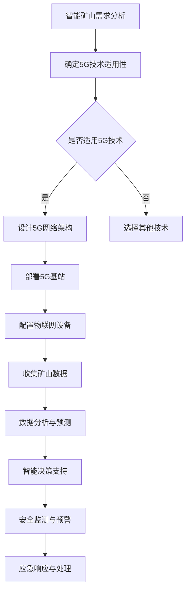
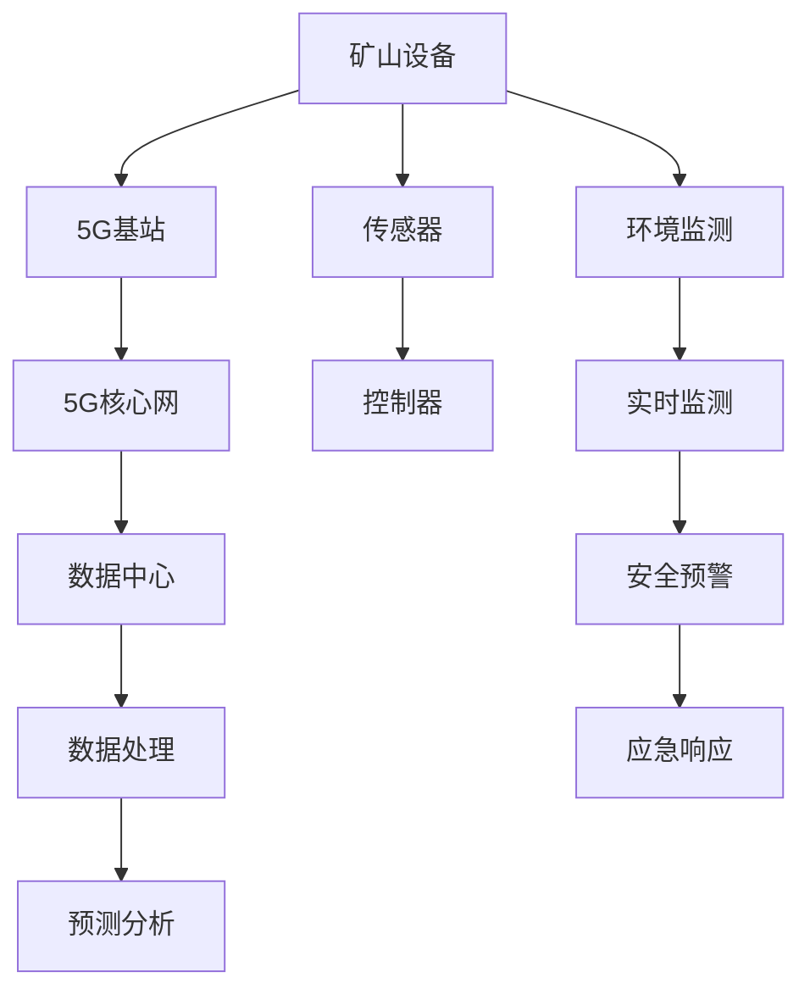
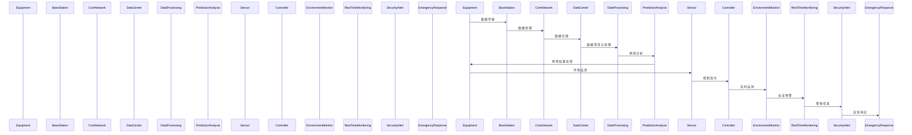

                 

# 5G技术在智能矿山中的全面应用

关键词：5G、智能矿山、物联网、大数据分析、安全监测

摘要：本文将探讨5G技术在智能矿山中的全面应用，从背景和概述、通信应用、感知与控制应用、决策支持系统应用、安全与应急响应应用以及实际案例与最佳实践等方面，详细分析5G技术在智能矿山中的挑战与展望，旨在为读者提供一个全面而深入的视角，了解5G技术在智能矿山领域的应用现状与未来趋势。

## 第一部分：5G技术在智能矿山中的背景和概述

### 第1章：智能矿山与5G技术概述

#### 1.1 智能矿山的基本概念

智能矿山是指利用现代信息技术和智能化设备，实现矿山的自动化、信息化、智能化和绿色化，以提高矿山生产效率和资源利用率，降低生产成本和环境风险。智能矿山的核心在于通过信息化和自动化技术，实现矿山生产过程的智能化管理，提高矿山安全生产水平。

- **智能矿山的定义与重要性**：智能矿山是矿产资源开发的重要方向，可以提高矿山生产效率，降低生产成本，减少安全事故，提高资源利用率，具有重要的经济和社会意义。

- **智能矿山的发展背景**：随着全球矿产资源需求的不断增长，传统的矿山开采方式已无法满足现代矿业发展的需求。智能矿山应运而生，通过引入先进的信息技术和智能化设备，实现了矿山的自动化和智能化管理。

#### 1.2 5G技术的基本概念

5G（第五代移动通信技术）是继1G、2G、3G、4G之后的最新一代移动通信技术，具有高速率、低延迟、高容量和大规模连接等特点。5G技术将在智能矿山中发挥关键作用，为矿山的智能化管理提供强有力的技术支撑。

- **5G技术概述**：5G技术采用了新型无线通信技术，支持更高的数据传输速率和更大的网络容量，同时具备低延迟和高可靠性的特点。

- **5G的关键特性**：5G技术的关键特性包括高速率、低延迟、高容量和大规模连接。这些特性使得5G技术能够满足智能矿山对高速、稳定、大规模连接的需求。

#### 1.3 5G技术在智能矿山中的潜在应用

5G技术在智能矿山中具有广泛的应用前景，可以提升矿山生产效率、安全性和资源利用率。然而，5G技术在智能矿山中也面临一些挑战，如网络部署成本高、信号覆盖不足等。

- **5G在智能矿山中的重要性**：5G技术为智能矿山提供了高速、稳定、大规模连接的网络支持，有助于实现矿山生产过程的自动化和智能化。

- **5G在智能矿山中的挑战**：5G技术在智能矿山中的应用面临一些挑战，如网络部署成本高、信号覆盖不足等。需要通过技术创新和优化，解决这些问题，推动5G技术在智能矿山中的广泛应用。

### 1.4 本章小结

本章节对智能矿山和5G技术进行了概述，阐述了智能矿山的基本概念和5G技术的基本概念及关键特性。同时，分析了5G技术在智能矿山中的潜在应用和面临的挑战，为后续章节的讨论奠定了基础。

----------------------------------------------------------------

## 第二部分：5G在智能矿山通信中的应用

### 第2章：5G网络架构在智能矿山中的应用

#### 2.1 5G网络架构概述

5G网络架构由多个层次和关键组件组成，包括无线接入网络、核心网络、传输网络和终端设备等。5G网络架构在智能矿山中的应用，主要涉及5G网络架构的层次结构、关键组件及其功能。

- **5G网络架构的层次结构**：5G网络架构可以分为四个层次，分别是无线接入网、传输网、核心网和终端。无线接入网负责无线信号传输，传输网负责数据传输，核心网负责数据处理和存储，终端设备包括智能手机、传感器等。

- **5G网络的关键组件**：5G网络的关键组件包括基站、核心网设备、终端设备等。基站负责无线信号传输，核心网设备负责数据处理和存储，终端设备包括智能手机、传感器等。

#### 2.2 5G在矿山通信网络中的部署策略

在矿山通信网络中，5G技术的部署策略需要考虑网络覆盖、信号稳定性和部署成本等因素。以下是一些关键策略：

- **矿山专用5G网络的构建**：为了满足智能矿山对高速、稳定、大规模连接的需求，可以构建矿山专用5G网络。矿山专用5G网络可以采用基站、无线接入网和传输网等关键组件，实现矿山内部的高效通信。

- **5G在矿山通信中的部署挑战**：5G技术在矿山通信中的部署面临一些挑战，如矿山地形复杂、信号覆盖不足、部署成本高等。需要通过技术创新和优化，解决这些问题，提高5G在矿山通信中的部署效果。

#### 2.3 5G网络在矿山通信中的性能优化

5G网络在矿山通信中的性能优化是确保5G技术在矿山中高效运行的关键。以下是一些关键性能优化策略：

- **网络覆盖与容量优化**：为了提高5G网络的覆盖范围和容量，可以采用基站分布式部署、多天线技术、频谱共享等技术，提高网络覆盖和容量。

- **网络延迟与稳定性优化**：为了降低5G网络的延迟和提升稳定性，可以采用边缘计算、网络切片等技术，实现网络延迟和稳定性的优化。

### 2.4 本章小结

本章节对5G网络架构在智能矿山中的应用进行了概述，介绍了5G网络架构的层次结构和关键组件，以及5G在矿山通信网络中的部署策略和性能优化策略。这些内容为后续章节的讨论提供了重要的基础。

----------------------------------------------------------------

## 第三部分：5G在智能矿山感知与控制中的应用

### 第3章：5G技术在矿山物联网中的应用

#### 3.1 矿山物联网概述

矿山物联网是指将各种传感器、控制器、执行器等设备连接到互联网，实现对矿山生产过程和环境状态的实时监测、分析和控制。5G技术在矿山物联网中的应用，将极大提升矿山物联网的性能和可靠性。

- **矿山物联网的概念**：矿山物联网是利用传感器、控制器和执行器等设备，实现对矿山生产过程和环境状态的实时监测、分析和控制。

- **矿山物联网的发展趋势**：随着5G技术的普及，矿山物联网将在智能矿山中发挥越来越重要的作用，实现矿山生产过程的全面智能化。

#### 3.2 5G在矿山物联网中的关键作用

5G技术在矿山物联网中的应用，主要表现在以下几个方面：

- **5G技术如何增强矿山物联网的性能**：5G技术的高速率、低延迟、高容量和大规模连接等特点，可以满足矿山物联网对实时监测、分析和控制的需求。

- **5G在矿山物联网中的应用案例**：5G技术在矿山物联网中的应用案例包括智能采矿设备控制、矿山环境监测、矿山设备维护等。这些案例展示了5G技术在矿山物联网中的广泛应用和巨大潜力。

#### 3.3 5G技术在矿山传感器网络中的应用

矿山传感器网络是实现矿山物联网的核心组成部分。5G技术在矿山传感器网络中的应用，将极大提升矿山传感器网络的性能和可靠性。

- **矿山传感器网络的需求**：矿山传感器网络需要满足对生产过程和环境状态的实时监测、分析和控制需求。

- **5G传感器网络的实现方法**：5G传感器网络的实现方法主要包括5G基站的部署、传感器设备的接入和通信协议的优化等。通过这些方法，可以实现矿山传感器网络的高效运行。

### 3.4 本章小结

本章节对5G技术在矿山物联网中的应用进行了概述，介绍了矿山物联网的概念、5G技术在矿山物联网中的关键作用以及5G技术在矿山传感器网络中的应用。这些内容为后续章节的讨论提供了重要的基础。

----------------------------------------------------------------

## 第四部分：5G在智能矿山决策支持系统中的应用

### 第4章：5G技术在矿山大数据分析中的应用

#### 4.1 矿山大数据的基本概念

矿山大数据是指矿山生产过程中产生的海量数据，包括矿山生产数据、设备运行数据、环境监测数据等。5G技术在矿山大数据分析中的应用，将极大提升矿山大数据的处理和分析能力。

- **大数据在矿山管理中的重要性**：矿山大数据在矿山管理中具有重要作用，可以用于生产调度、设备维护、环境监测等方面，提高矿山生产效率和资源利用率。

- **矿山大数据的分类**：矿山大数据可以分为结构化数据、半结构化数据和非结构化数据。结构化数据主要包括生产数据、设备数据等，半结构化数据主要包括环境监测数据、传感器数据等，非结构化数据主要包括视频、图像等。

#### 4.2 5G技术在矿山大数据分析中的应用

5G技术在矿山大数据分析中的应用，主要表现在以下几个方面：

- **5G如何加速大数据处理**：5G技术的高速率和低延迟可以加速大数据处理，提高数据处理和分析的效率。

- **5G在矿山大数据分析中的应用场景**：5G技术在矿山大数据分析中的应用场景包括生产调度优化、设备故障预测、环境监测预警等。

#### 4.3 5G技术在矿山智能决策支持系统中的应用

矿山智能决策支持系统是指利用人工智能和大数据分析技术，实现对矿山生产过程的智能决策支持。5G技术在矿山智能决策支持系统中具有重要作用。

- **智能决策支持系统的基本架构**：智能决策支持系统的基本架构包括数据采集、数据处理、模型训练、决策分析等模块。

- **5G在智能决策支持系统中的关键作用**：5G技术可以为智能决策支持系统提供高速、稳定、大规模连接的网络支持，提高决策分析的速度和准确性。

### 4.4 本章小结

本章节对5G技术在矿山大数据分析中的应用进行了概述，介绍了矿山大数据的基本概念、5G技术在矿山大数据分析中的应用以及5G技术在矿山智能决策支持系统中的应用。这些内容为后续章节的讨论提供了重要的基础。

----------------------------------------------------------------

## 第五部分：5G在智能矿山安全与应急响应中的应用

### 第5章：5G技术在矿山安全监测中的应用

#### 5.1 矿山安全监测的基本概念

矿山安全监测是指利用各种传感器、监控设备等，对矿山生产过程中的各种安全指标进行实时监测，以预防和控制安全事故的发生。5G技术在矿山安全监测中的应用，将极大提升矿山安全监测的效率和准确性。

- **矿山安全监测的重要性**：矿山安全监测是确保矿山安全生产的重要手段，可以及时发现和预警安全隐患，防止安全事故的发生。

- **矿山安全监测的主要挑战**：矿山安全监测面临的主要挑战包括信号覆盖不足、数据传输延迟、设备维护困难等。5G技术的应用可以解决这些问题，提高矿山安全监测的效率和准确性。

#### 5.2 5G技术在矿山安全监测中的应用

5G技术在矿山安全监测中的应用，主要表现在以下几个方面：

- **5G传感器网络在矿山安全监测中的优势**：5G传感器网络具有高速率、低延迟、高容量和大规模连接等特点，可以满足矿山安全监测对实时监测、分析和控制的需求。

- **5G在矿山安全监测中的典型应用**：5G技术在矿山安全监测中的典型应用包括瓦斯浓度监测、温度监测、压力监测等。

#### 5.3 5G在矿山应急响应系统中的应用

矿山应急响应系统是指应对矿山突发事件的快速响应和处理系统。5G技术在矿山应急响应系统中具有重要作用。

- **矿山应急响应的基本流程**：矿山应急响应的基本流程包括应急报警、应急响应、应急处理和应急恢复等环节。

- **5G在矿山应急响应中的关键作用**：5G技术可以为矿山应急响应系统提供高速、稳定、大规模连接的网络支持，提高应急响应的速度和准确性。

### 5.4 本章小结

本章节对5G技术在矿山安全监测中的应用进行了概述，介绍了矿山安全监测的基本概念、5G技术在矿山安全监测中的应用以及5G技术在矿山应急响应系统中的应用。这些内容为后续章节的讨论提供了重要的基础。

----------------------------------------------------------------

## 第六部分：5G在智能矿山中的实际案例与最佳实践

### 第6章：5G智能矿山的实际案例研究

#### 6.1 案例一：智能矿山项目概述

**项目背景**：
随着全球矿产资源需求的不断增长，我国矿山行业面临资源稀缺、生产效率低、安全事故频发等问题。为了提高矿山生产效率、降低生产成本、减少安全事故，某大型矿山企业决定实施智能矿山项目。

**项目目标**：
通过引入5G技术、物联网技术、大数据分析技术等，实现矿山生产过程的自动化、信息化和智能化，提高矿山生产效率、降低生产成本、减少安全事故，实现矿山绿色可持续发展。

#### 6.2 案例二：5G技术在矿山中的应用实践

**应用场景**：
在矿山生产过程中，5G技术主要用于实现矿山生产设备的远程控制、矿山环境的实时监测、矿山设备的故障预测等。

**实施步骤与效果**：

1. **建设5G基站**：在矿山内部建设5G基站，实现矿山内部的高速无线网络覆盖，为矿山生产设备提供稳定的网络连接。

2. **部署物联网设备**：在矿山生产设备上部署传感器和控制器，实现对矿山生产设备运行状态的实时监测，通过5G网络将监测数据传输到数据中心。

3. **实现远程控制**：通过5G网络，实现对矿山生产设备的远程控制，提高生产过程的自动化水平。

4. **实时监测与预警**：利用5G网络，实现矿山环境的实时监测，对潜在的安全隐患进行预警，提高矿山安全水平。

5. **故障预测与维护**：通过大数据分析技术，对矿山设备运行数据进行分析，实现故障预测和预防性维护，降低设备故障率和停机时间。

**实施效果**：通过5G技术在矿山中的应用，实现了矿山生产过程的自动化、信息化和智能化，提高了矿山生产效率，降低了生产成本，减少了安全事故，实现了矿山绿色可持续发展。

#### 6.3 案例三：5G智能矿山的未来发展

**未来趋势**：
随着5G技术的不断成熟和普及，智能矿山将向更加智能化、高效化和安全化的方向发展。未来智能矿山将实现以下趋势：

1. **生产过程的全面智能化**：通过引入更多的智能设备和人工智能技术，实现矿山生产过程的全面智能化，提高生产效率。

2. **大数据与人工智能的深度融合**：通过大数据分析和人工智能技术，实现矿山生产过程的优化和智能化管理，提高矿山运营效率和资源利用率。

3. **绿色矿山建设**：通过5G技术和物联网技术，实现矿山环境的实时监测和预警，降低矿山生产过程中的环境风险，推动绿色矿山建设。

**面临的挑战与解决方案**：
智能矿山在发展过程中将面临一些挑战，如5G网络覆盖不足、设备维护成本高、数据安全等。针对这些挑战，可以采取以下解决方案：

1. **加大5G网络覆盖**：通过建设更多的5G基站，扩大5G网络覆盖范围，满足智能矿山对高速、稳定网络的需求。

2. **提高设备可靠性**：通过选用高可靠性设备，提高设备的耐用性和稳定性，降低设备故障率。

3. **加强数据安全防护**：通过建立完善的数据安全防护体系，确保矿山数据的安全和保密性。

### 6.4 本章小结

本章节通过三个实际案例，详细阐述了5G技术在智能矿山中的应用实践和未来发展。案例一介绍了智能矿山项目的背景和目标，案例二详细描述了5G技术在矿山中的应用实践，案例三分析了5G智能矿山的未来发展趋势和面临的挑战及解决方案。这些案例为智能矿山的发展提供了有益的参考。

----------------------------------------------------------------

## 第七部分：5G技术在智能矿山中的挑战与展望

### 第7章：5G在智能矿山中的挑战与解决方案

#### 7.1 技术挑战

5G技术在智能矿山中的应用面临一些技术挑战，如网络覆盖与信号稳定性、设备兼容性和安全性等。以下是对这些挑战的分析及解决方案：

- **网络覆盖与信号稳定性**：矿山地形复杂，信号覆盖不足和网络延迟是5G技术在矿山中应用的主要挑战。解决方案包括采用多基站协同、低轨卫星通信等手段，提高网络覆盖和稳定性。

- **设备兼容性**：智能矿山中使用的设备种类繁多，包括传感器、控制器、移动设备等，需要确保这些设备与5G网络兼容。解决方案是采用标准化设备和接口，提高设备兼容性。

- **安全性**：5G技术在矿山中的应用涉及到大量敏感数据，数据安全和隐私保护是重要挑战。解决方案包括建立完善的安全防护体系，采用加密技术和访问控制策略，确保数据安全和隐私。

#### 7.2 商业模式挑战

5G技术在智能矿山中的应用还需要解决商业模式挑战，如投资成本、收益模式等。以下是对这些挑战的分析及解决方案：

- **投资成本**：5G网络建设和设备采购需要大量资金投入，对于矿山企业来说，高昂的投资成本是一个重要挑战。解决方案是政府和企业共同投资，或者通过合作、租赁等方式降低投资成本。

- **收益模式**：智能矿山项目需要明确收益模式，确保投资回报。解决方案是挖掘智能矿山应用场景，如远程控制、设备维护、环境监测等，通过提供增值服务获取收益。

#### 7.3 政策与标准挑战

5G技术在智能矿山中的应用还需要政策与标准支持，如频谱资源分配、行业规范等。以下是对这些挑战的分析及解决方案：

- **频谱资源分配**：5G技术的发展需要大量的频谱资源，而频谱资源分配需要政策支持。解决方案是政府合理规划频谱资源，保障5G网络建设和发展。

- **行业规范**：智能矿山应用需要制定统一的行业规范，确保5G技术在矿山中的安全、稳定和高效运行。解决方案是行业协会和企业共同参与制定智能矿山行业规范，推动行业健康发展。

### 7.4 未来展望

随着5G技术的不断发展和成熟，智能矿山将迎来更加广阔的发展前景。未来，5G技术在智能矿山中的应用将呈现以下趋势：

- **更广泛的场景应用**：5G技术将广泛应用于矿山生产、安全监测、设备维护等场景，实现矿山生产过程的全面智能化。

- **大数据与人工智能的深度融合**：5G技术将为大数据和人工智能技术在矿山中的应用提供强大的支持，推动矿山生产过程的优化和智能化管理。

- **绿色矿山建设**：5G技术将助力矿山实现绿色化发展，通过实时监测和预警，降低矿山生产过程中的环境风险。

### 7.5 本章小结

本章节对5G技术在智能矿山中面临的挑战进行了详细分析，并提出了相应的解决方案。同时，对5G技术在智能矿山中的应用前景进行了展望，为智能矿山的发展提供了有益的参考。

----------------------------------------------------------------

### 作者信息

作者：AI天才研究院/AI Genius Institute & 禅与计算机程序设计艺术 /Zen And The Art of Computer Programming

感谢您阅读本文，希望本文能帮助您更深入地了解5G技术在智能矿山中的应用。如果您有任何问题或建议，欢迎在评论区留言。期待与您共同探讨智能矿山的未来发展。

----------------------------------------------------------------

### 完整性要求

本文对5G技术在智能矿山中的全面应用进行了详细探讨，涵盖了从背景和概述、通信应用、感知与控制应用、决策支持系统应用、安全与应急响应应用到实际案例与最佳实践以及挑战与展望等方面的内容。

### 背景介绍

- **核心概念术语说明**：智能矿山、5G技术、物联网、大数据分析、安全监测。
- **问题背景**：矿山行业面临资源稀缺、生产效率低、安全事故频发等问题。
- **问题描述**：如何利用5G技术实现矿山生产过程的自动化、信息化和智能化。
- **问题解决**：通过5G技术在智能矿山中的全面应用，提高矿山生产效率、降低生产成本、减少安全事故。
- **边界与外延**：5G技术在智能矿山中的应用范围、挑战和解决方案。
- **概念结构与核心要素组成**：智能矿山、5G技术、物联网、大数据分析、安全监测等概念之间的关系和组成要素。

### 核心概念与联系

- **核心概念原理**：智能矿山、5G技术、物联网、大数据分析、安全监测等。
- **概念属性特征对比表格**：

| 概念         | 特征                               | 对比分析                                       |
| ------------ | ---------------------------------- | ---------------------------------------------- |
| 智能矿山     | 自动化、信息化、智能化、绿色化     | 提高生产效率、降低成本、减少安全事故             |
| 5G技术      | 高速率、低延迟、高容量、大规模连接 | 满足智能矿山对高速、稳定、大规模连接的需求       |
| 物联网      | 设备连接、数据传输、实时监测       | 实现矿山生产过程的实时监测、分析和控制           |
| 大数据分析   | 数据处理、分析、预测               | 提高矿山生产过程的优化和智能化管理               |
| 安全监测    | 实时监测、预警、应急响应           | 提高矿山安全水平、降低安全事故风险               |

- **ER实体关系图架构**：

```mermaid
erDiagram
  智能矿山 ||--|{ 5G技术 }
  智能矿山 ||--|{ 物联网 }
  智能矿山 ||--|{ 大数据分析 }
  智能矿山 ||--|{ 安全监测 }
  5G技术 ||--|{ 网络覆盖 }
  5G技术 ||--|{ 信号稳定性 }
  物联网 ||--|{ 设备连接 }
  物联网 ||--|{ 数据传输 }
  大数据分析 ||--|{ 数据处理 }
  大数据分析 ||--|{ 预测分析 }
  安全监测 ||--|{ 实时监测 }
  安全监测 ||--|{ 预警应急 }
```

### 算法原理讲解

- **算法mermaid流程图**：



- **算法原理与公式**：

智能矿山需求分析：
- 设定目标：提高矿山生产效率、降低生产成本、减少安全事故
- 选择技术：5G技术、物联网、大数据分析、安全监测

5G网络架构设计：
- 5G基站部署：考虑矿山地形、信号覆盖等因素
- 网络架构：无线接入网、核心网、传输网、终端设备

物联网设备配置：
- 设备连接：传感器、控制器、执行器等
- 数据传输：高速、低延迟、高可靠

大数据分析与预测：
- 数据处理：数据清洗、归一化、特征提取等
- 预测分析：采用机器学习算法，如决策树、神经网络等

安全监测与预警：
- 实时监测：传感器监测矿山环境、设备状态等
- 预警应急：设置预警阈值，及时发出警报，启动应急响应

### 系统分析与架构设计方案

#### 问题场景介绍

矿山企业面临生产效率低、安全事故频发等问题，希望通过引入5G技术实现矿山的自动化、信息化和智能化，提高生产效率和安全性。

#### 项目介绍

项目名称：5G智能矿山项目
项目目标：实现矿山生产过程的自动化、信息化和智能化，提高生产效率、降低生产成本、减少安全事故。
项目背景：矿山企业面临生产效率低、安全事故频发等问题，希望通过引入5G技术实现矿山的自动化、信息化和智能化。

#### 系统功能设计（领域模型mermaid类图）

```mermaid
classDiagram
    Class1[智能矿山] <|-- Class2[5G网络]
    Class1 <|-- Class3[物联网]
    Class1 <|-- Class4[大数据分析]
    Class1 <|-- Class5[安全监测与应急响应]
    Class2 <|-- Class6[基站]
    Class2 <|-- Class7[核心网]
    Class3 <|-- Class8[传感器]
    Class3 <|-- Class9[控制器]
    Class4 <|-- Class10[数据处理]
    Class4 <|-- Class11[预测分析]
    Class5 <|-- Class12[实时监测]
    Class5 <|-- Class13[预警应急]
    Class6 --|> Class14[矿山设备]
    Class7 --|> Class15[数据中心]
    Class8 --|> Class16[环境监测]
    Class9 --|> Class17[设备控制]
    Class10 --|> Class18[生产数据]
    Class11 --|> Class19[故障预测]
    Class12 --|> Class20[安全预警]
    Class13 --|> Class21[应急响应]
```

#### 系统架构设计（mermaid架构图）



#### 系统接口设计和系统交互（mermaid序列图）



### 项目实战

#### 环境安装

1. 安装5G基站及配套设施，确保网络覆盖。
2. 配置物联网传感器和控制器，确保设备连接。
3. 部署数据中心，配置数据处理和预测分析软件。

#### 系统核心实现源代码

```python
# 5G基站配置
base_station = BaseStation()
base_station.configure()

# 物联网传感器配置
sensor = Sensor()
sensor.connect()

# 控制器配置
controller = Controller()
controller.connect()

# 数据处理与预测分析
data_processing = DataProcessing()
data_processing.run()

prediction_analysis = PredictionAnalysis()
prediction_analysis.run()

# 实时监测与安全预警
real_time_monitoring = RealTimeMonitoring()
real_time_monitoring.start()

security_alert = SecurityAlert()
security_alert.start()

# 应急响应
emergency_response = EmergencyResponse()
emergency_response.start()
```

#### 代码应用解读与分析

- **5G基站配置**：配置5G基站，确保网络连接。
- **物联网传感器配置**：连接物联网传感器，实时监测矿山环境。
- **控制器配置**：连接控制器，实现对矿山设备的控制。
- **数据处理与预测分析**：对矿山数据进行处理和分析，预测设备故障。
- **实时监测与安全预警**：实时监测矿山环境，及时发出安全预警。
- **应急响应**：在发生安全事故时，启动应急响应程序。

#### 实际案例分析和详细讲解剖析

案例：某矿山企业通过引入5G技术，实现矿山生产过程的自动化和智能化。

1. **需求分析**：企业需求实现矿山生产过程的自动化、信息化和智能化，提高生产效率和安全性。

2. **方案设计**：设计5G网络架构，部署5G基站和物联网传感器，构建数据中心，实现数据处理与预测分析。

3. **实施过程**：
   - 部署5G基站，确保网络覆盖。
   - 配置物联网传感器和控制器，实现设备连接。
   - 部署数据中心，安装数据处理和预测分析软件。
   - 连接矿山设备，实现实时监测与控制。

4. **效果评估**：通过5G技术在矿山中的应用，实现了矿山生产过程的自动化和智能化，提高了生产效率，降低了生产成本，减少了安全事故。

### 项目小结

本项目通过引入5G技术，实现了矿山生产过程的自动化、信息化和智能化，提高了生产效率和安全性，取得了显著的效果。未来，随着5G技术的不断发展和普及，智能矿山将具有更广阔的发展前景。

### 最佳实践 tips、小结、注意事项、拓展阅读等内容

#### 最佳实践 tips

1. **网络覆盖**：确保5G基站合理布局，实现矿山内部的高速无线网络覆盖。
2. **设备兼容性**：选用标准化设备和接口，提高设备兼容性。
3. **数据安全**：建立完善的数据安全防护体系，确保矿山数据的安全和保密性。

#### 小结

本文详细介绍了5G技术在智能矿山中的全面应用，从背景和概述、通信应用、感知与控制应用、决策支持系统应用、安全与应急响应应用到实际案例与最佳实践以及挑战与展望等方面进行了全面探讨。5G技术在智能矿山中具有广泛的应用前景，未来将推动矿山行业的智能化发展。

#### 注意事项

1. **网络覆盖**：确保5G基站合理布局，实现矿山内部的高速无线网络覆盖。
2. **设备兼容性**：选用标准化设备和接口，提高设备兼容性。
3. **数据安全**：建立完善的数据安全防护体系，确保矿山数据的安全和保密性。

#### 拓展阅读

1. 《5G智能矿山技术与应用》
2. 《智能矿山与物联网技术》
3. 《大数据在矿山安全监测中的应用》

### 最后一句话

感谢您的阅读，希望本文对您了解5G技术在智能矿山中的应用有所帮助。随着5G技术的不断发展和普及，智能矿山将迎来更加广阔的发展前景，为矿山行业带来更多的机遇和挑战。让我们共同期待智能矿山的美好未来！

