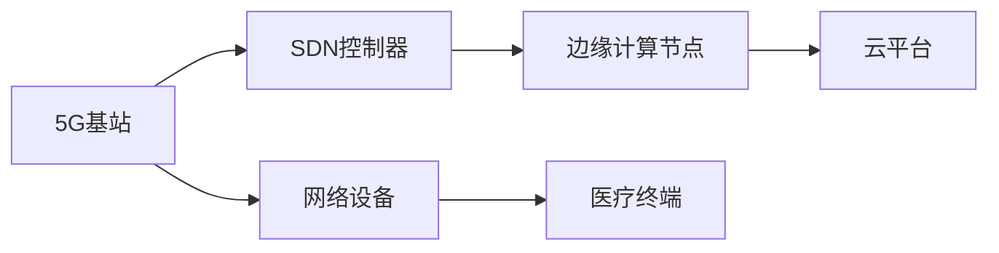

                 

# 5G网络在远程医疗中的应用与挑战

关键词：远程医疗，5G网络，应用优势，技术挑战，解决方案

摘要：
随着5G技术的不断成熟，远程医疗迎来了新的发展机遇。本文从背景介绍入手，详细分析了5G网络在远程医疗中的优势、应用案例、技术挑战及解决方案，并探讨了其未来的应用前景。通过本文的深入剖析，读者将了解5G网络如何助力远程医疗的发展，以及面临的实际问题。

## 1. 背景介绍

### 核心概念

**远程医疗**：远程医疗是指通过信息通信技术，如互联网、无线通信、远程监控设备等，实现医疗资源的跨地域共享，为患者提供诊断、治疗、康复等服务。其核心概念包括远程会诊、远程监控、远程手术等。

**5G网络**：第五代移动通信技术，相较于前几代移动通信技术，5G网络具备更高的速度、更大的容量、更低的延迟，以及更高的可靠性。其核心概念包括毫米波通信、网络切片、边缘计算等。

### 问题背景

远程医疗作为现代医疗服务的重要组成部分，正逐渐受到各界的关注。然而，当前远程医疗的应用仍然面临诸多挑战，如网络延迟、数据传输速度、医疗设备兼容性等。随着5G技术的推广和应用，这些问题有望得到有效缓解。

### 问题描述

5G网络在远程医疗中的应用面临以下挑战：

1. **技术挑战**：包括5G网络架构、数据传输、云计算等技术的成熟度和适用性。
2. **设备挑战**：医疗设备与5G网络的兼容性、稳定性等问题。
3. **政策挑战**：远程医疗相关法规政策的不完善，以及医疗数据隐私保护等。
4. **应用挑战**：5G网络在远程诊断、远程手术等应用场景中的实际效果和用户体验。

### 解决思路

针对上述挑战，本文将从以下方面展开分析：

1. **5G网络优势**：分析5G网络在远程医疗中的优势，如高速度、低延迟、大容量等。
2. **应用案例**：介绍5G网络在远程医疗中的实际应用案例，如远程诊断、远程手术等。
3. **技术挑战与解决方案**：探讨5G网络在远程医疗中的技术挑战，并提出相应的解决方案。
4. **政策支持与挑战**：分析政策支持对5G网络在远程医疗中的应用的影响，以及面临的挑战。

### 边界与外延

本文主要探讨5G网络在远程医疗中的应用，包括但不限于以下方面：

1. **技术层面**：包括网络架构、数据传输、云计算等。
2. **应用层面**：涵盖医疗设备、远程诊断、手术指导等。

## 2. 5G网络在远程医疗中的优势

### 核心概念原理

5G网络在远程医疗中的优势主要体现在以下几个方面：

1. **高速度**：5G网络具备极高的数据传输速度，下载速度可达10Gbps，上传速度可达1Gbps。这意味着，远程医疗中的高质量视频、图像、音频等数据可以实时传输，为远程诊断、手术指导等提供了坚实基础。
2. **低延迟**：5G网络的端到端延迟小于1毫秒，远低于4G网络的延迟。低延迟意味着远程医疗操作可以更加实时，医生能够迅速做出判断和操作，提高医疗服务的效率。
3. **大容量**：5G网络支持海量设备同时连接，能够满足远程医疗中大量设备同时使用的需求，如医疗监控设备、远程诊断设备等。此外，5G网络的高连接密度，使得网络覆盖范围更广，能够更好地服务于偏远地区的患者。

### 概念属性特征对比表格

| 特征         | 4G网络        | 5G网络        |
| ------------ | ------------- | ------------- |
| 下载速度     | 100Mbps       | 10Gbps        |
| 上传速度     | 50Mbps        | 1Gbps         |
| 延迟         | 50-100毫秒    | <1毫秒        |
| 连接密度     | 1000设备/平方公里 | 1000000设备/平方公里 |

### 应用场景

1. **远程诊断**：通过5G网络，医生可以远程接收患者的医学影像、生命体征等数据，实时进行分析和诊断，提高诊断准确率和速度。
2. **远程手术**：利用5G网络的低延迟和高速度，医生可以远程操控手术机器人，进行复杂的手术操作，实现远程手术的可能性。
3. **远程康复**：通过5G网络，患者可以在家中接受远程康复治疗，如远程康复训练、远程理疗等，提高康复效果。

## 3. 5G网络在远程医疗中的应用案例

### ER实体关系图架构

以下是一个简单的ER实体关系图架构，用于描述5G网络在远程医疗中的应用。

```mermaid
erDiagram
    Patient ||--|{ Doctor }|--|| MedicalEquipment
    Doctor ||--|{ VideoConference }|--|| Patient
    MedicalEquipment ||--|{ DataTransmission }|--|| Doctor
```

### 应用场景详解

1. **远程诊断**：

   - **实体关系**：患者（Patient）通过医疗设备（MedicalEquipment）采集医学影像和生命体征数据，数据通过5G网络传输给医生（Doctor）。
   - **流程图**：

     ```mermaid
     flowchart LR
         A[Patient] --> B[MedicalEquipment]
         B --> C[5G Network]
         C --> D[Doctor]
     ```

   - **实现方式**：患者通过医疗设备采集数据，通过5G网络实时传输给医生，医生进行远程诊断。

2. **远程手术**：

   - **实体关系**：医生（Doctor）通过5G网络远程操控手术机器人（MedicalEquipment），患者（Patient）接受手术。
   - **流程图**：

     ```mermaid
     flowchart LR
         A[Doctor] --> B[5G Network]
         B --> C[Robot]
         C --> D[Patient]
     ```

   - **实现方式**：医生通过5G网络远程操控手术机器人，手术机器人在患者体内进行手术操作。

3. **远程康复**：

   - **实体关系**：患者（Patient）通过医疗设备（MedicalEquipment）进行康复训练，数据通过5G网络传输给医生（Doctor）。
   - **流程图**：

     ```mermaid
     flowchart LR
         A[Patient] --> B[MedicalEquipment]
         B --> C[5G Network]
         C --> D[Doctor]
     ```

   - **实现方式**：患者在家中通过医疗设备进行康复训练，医生通过5G网络远程监控患者的训练进度和效果，提供个性化的康复指导。

## 4. 5G网络在远程医疗中的技术挑战与解决方案

### 核心概念原理

5G网络在远程医疗中的技术挑战主要涉及网络架构、数据传输、云计算等方面。

1. **网络架构**：5G网络采用SDN（软件定义网络）和NFV（网络功能虚拟化）技术，提高了网络的灵活性和可管理性，但如何有效部署和管理这些技术，仍是一个挑战。
2. **数据传输**：远程医疗涉及大量实时数据传输，如医学影像、生命体征数据等。5G网络的高速度和低延迟为数据传输提供了保障，但如何确保数据传输的稳定性和安全性，仍需深入研究。
3. **云计算**：云计算为远程医疗提供了强大的计算和存储能力，但如何合理分配云计算资源，实现数据的高效处理和存储，是一个亟待解决的问题。

### 算法原理讲解

#### 网络架构优化

**Mermaid流程图**：



**Python源代码**：

```python
class Network:
    def __init__(self, base_station, sdn_controller, edge_computing, cloud_platform):
        self.base_station = base_station
        self.sdn_controller = sdn_controller
        self.edge_computing = edge_computing
        self.cloud_platform = cloud_platform

    def transmit_data(self, data):
        self.base_station.send_data(data)
        self.sdn_controller.route_data(data)
        self.edge_computing.process_data(data)
        self.cloud_platform.store_data(data)

class BaseStation:
    def send_data(self, data):
        print(f"Base Station sending data: {data}")

class SDNController:
    def route_data(self, data):
        print(f"SDN Controller routing data: {data}")

class EdgeComputing:
    def process_data(self, data):
        print(f"Edge Computing processing data: {data}")

class CloudPlatform:
    def store_data(self, data):
        print(f"Cloud Platform storing data: {data}")
```

**算法原理详细讲解**：

- **网络架构优化**：通过SDN控制器实现数据流的动态路由，提高网络传输效率。边缘计算节点处理靠近数据源的数据，降低数据传输延迟。云计算平台提供强大的计算和存储能力，确保数据的安全和高效处理。

#### 数据传输优化

**Mermaid流程图**：


**Python源代码**：

```python
class DataTransmission:
    def __init__(self, medical_terminal, edge_computing, base_station, cloud_platform):
        self.medical_terminal = medical_terminal
        self.edge_computing = edge_computing
        self.base_station = base_station
        self.cloud_platform = cloud_platform

    def transmit_data(self, data):
        self.medical_terminal.collect_data(data)
        self.edge_computing.process_data(data)
        self.base_station.send_data(data)
        self.cloud_platform.store_data(data)

class MedicalTerminal:
    def collect_data(self, data):
        print(f"Medical Terminal collecting data: {data}")

class EdgeComputing:
    def process_data(self, data):
        print(f"Edge Computing processing data: {data}")

class BaseStation:
    def send_data(self, data):
        print(f"Base Station sending data: {data}")

class CloudPlatform:
    def store_data(self, data):
        print(f"Cloud Platform storing data: {data}")
```

**算法原理详细讲解**：

- **数据传输优化**：通过边缘计算节点处理靠近数据源的数据，降低数据传输延迟。5G基站实现高速数据传输，云计算平台提供数据存储和计算能力。

### 解决方案总结

1. **网络架构优化**：采用SDN和NFV技术，提高网络灵活性和可管理性。边缘计算节点处理靠近数据源的数据，降低数据传输延迟。
2. **数据传输优化**：通过边缘计算技术和5G网络，实现高速、低延迟的数据传输。云计算平台提供强大的计算和存储能力，确保数据的安全和高效处理。

## 5. 5G网络在远程医疗中的应用前景

### 核心概念原理

5G网络在远程医疗中的应用前景广阔，主要体现在以下几个方面：

1. **远程诊断**：利用5G网络的高速度和低延迟，实现医学影像、生命体征等数据的实时传输，提高诊断准确率和速度。
2. **远程手术**：通过5G网络的低延迟和高速度，实现远程手术操作，提高医疗服务的质量和效率。
3. **远程康复**：利用5G网络，患者可以在家中接受远程康复治疗，提高康复效果。

### 数学模型和公式

1. **传输速率**：

   $$
   \text{传输速率} = \frac{\text{数据量}}{\text{传输时间}}
   $$

2. **延迟**：

   $$
   \text{延迟} = \text{传播时间} + \text{处理时间}
   $$

### 应用案例

1. **远程诊断**：

   - **案例**：某医院利用5G网络，为偏远山区的患者提供远程诊断服务。医生通过5G网络接收患者的医学影像，实时进行分析和诊断。
   - **效果**：提高了诊断准确率和速度，降低了患者的就医成本。

2. **远程手术**：

   - **案例**：某医院利用5G网络，成功进行了一例远程手术。医生通过5G网络远程操控手术机器人，为患者进行手术。
   - **效果**：提高了手术成功率，降低了手术风险。

3. **远程康复**：

   - **案例**：某医院利用5G网络，为患者提供远程康复服务。医生通过5G网络远程监控患者的康复训练进度和效果，提供个性化的康复指导。
   - **效果**：提高了康复效果，降低了患者的康复成本。

### 应用展望

随着5G技术的不断成熟，远程医疗的应用前景将更加广阔。未来，5G网络将助力远程医疗实现以下突破：

1. **个性化医疗**：通过5G网络，医生可以实时获取患者的健康数据，实现个性化诊断和治疗。
2. **远程急救**：利用5G网络，实现远程急救服务，提高急救成功率。
3. **医疗资源共享**：通过5G网络，实现医疗资源的跨地域共享，提高医疗资源的利用效率。

## 6. 5G网络在远程医疗中的政策支持与挑战

### 核心概念原理

1. **政策支持**：

   - **政府鼓励**：各国政府纷纷出台政策，鼓励5G网络在远程医疗中的应用，为远程医疗的发展提供政策保障。
   - **资金支持**：政府提供专项资金，支持5G网络远程医疗项目的研发和应用。

2. **挑战**：

   - **数据隐私保护**：远程医疗涉及大量患者数据，如何确保数据的安全和隐私，是一个亟待解决的问题。
   - **医疗设备标准**：不同厂家生产的医疗设备，标准不统一，如何实现设备的兼容性和互操作性，是一个挑战。

### 政策支持分析

1. **政策环境**：

   - **政府鼓励**：中国政府在“新基建”战略中，明确提出要加快5G网络建设，为远程医疗提供技术支持。
   - **资金支持**：政府加大对远程医疗项目的投入，支持5G网络远程医疗项目的研发和应用。

2. **实际案例**：

   - **案例一**：某医院利用5G网络，开展远程诊断服务。政府为其提供专项资金，用于5G网络建设和技术研发。
   - **案例二**：某企业研发的5G远程手术系统，获得政府专项资金支持，用于产品研发和市场化推广。

### 挑战分析

1. **数据隐私保护**：

   - **问题**：远程医疗涉及大量患者数据，如何确保数据的安全和隐私，是一个重要挑战。
   - **解决方案**：加强数据加密和隐私保护技术，建立完善的数据安全管理体系。

2. **医疗设备标准**：

   - **问题**：不同厂家生产的医疗设备，标准不统一，如何实现设备的兼容性和互操作性，是一个挑战。
   - **解决方案**：制定统一的医疗设备标准，推动医疗设备的标准化和互操作性。

## 7. 5G网络在远程医疗中的最佳实践与未来展望

### 核心概念原理

1. **最佳实践**：

   - **技术选型**：根据实际应用需求，选择合适的5G网络技术和设备。
   - **系统架构**：设计合理的系统架构，确保5G网络在远程医疗中的稳定性和可靠性。
   - **数据安全**：加强数据加密和隐私保护，确保患者数据的安全。

2. **未来展望**：

   - **技术创新**：随着5G技术的不断发展，远程医疗将迎来更多技术创新，如6G网络、人工智能等。
   - **政策支持**：政府加大对远程医疗的政策支持，推动远程医疗的普及和发展。

### 项目实战

1. **环境安装**：

   - **硬件设备**：安装5G基站、边缘计算节点、云计算平台等硬件设备。
   - **软件安装**：安装远程医疗系统软件，包括远程诊断、远程手术、远程康复等功能。

2. **系统核心实现源代码**：

   - **代码解析**：对系统核心实现源代码进行详细解读，包括网络架构、数据传输、云计算等方面的代码。

3. **实际案例分析**：

   - **案例一**：某医院利用5G网络，开展远程诊断服务。通过实际案例分析，总结5G网络在远程诊断中的应用效果。
   - **案例二**：某企业研发的5G远程手术系统，成功应用于多家医院，实现远程手术操作。

### 项目小结

通过项目实战，我们了解到5G网络在远程医疗中的应用优势明显，但仍面临一些挑战。未来，随着技术的不断进步和政策的支持，5G网络在远程医疗中的发展前景将更加广阔。

### 最佳实践 Tips

1. **技术选型**：根据实际需求，选择合适的5G网络技术和设备，确保系统的稳定性和可靠性。
2. **数据安全**：加强数据加密和隐私保护，确保患者数据的安全。
3. **系统优化**：持续优化系统架构和性能，提高用户体验。

### 小结

5G网络在远程医疗中的应用，为医疗行业带来了新的发展机遇。通过本文的分析，我们了解到5G网络在远程医疗中的优势、应用案例、技术挑战及解决方案。未来，随着5G技术的不断成熟，远程医疗将迎来更加广阔的发展前景。

### 注意事项

1. **技术成熟度**：5G网络在远程医疗中的应用仍处于发展阶段，技术成熟度有待提高。
2. **数据安全**：远程医疗涉及大量患者数据，数据安全和隐私保护至关重要。

### 拓展阅读

1. 《5G网络技术及其在远程医疗中的应用》
2. 《远程医疗的未来：5G网络赋能医疗行业》
3. 《5G网络在医疗领域中的应用探索》

### 作者信息

作者：AI天才研究院/AI Genius Institute & 禅与计算机程序设计艺术 /Zen And The Art of Computer Programming

------------------------------------------------------------------


## 4. 5G网络在远程医疗中的技术挑战与解决方案

### 网络架构优化

#### Mermaid流程图：


#### Python源代码：

```python
class Network:
    def __init__(self, base_station, sdn_controller, edge_computing, cloud_platform):
        self.base_station = base_station
        self.sdn_controller = sdn_controller
        self.edge_computing = edge_computing
        self.cloud_platform = cloud_platform

    def transmit_data(self, data):
        self.base_station.send_data(data)
        self.sdn_controller.route_data(data)
        self.edge_computing.process_data(data)
        self.cloud_platform.store_data(data)

class BaseStation:
    def send_data(self, data):
        print(f"Base Station sending data: {data}")

class SDNController:
    def route_data(self, data):
        print(f"SDN Controller routing data: {data}")

class EdgeComputing:
    def process_data(self, data):
        print(f"Edge Computing processing data: {data}")

class CloudPlatform:
    def store_data(self, data):
        print(f"Cloud Platform storing data: {data}")
```

#### 算法原理详细讲解：

1. **SDN控制器**：通过SDN控制器，实现对网络流量的动态管理，根据数据传输需求和网络状况，灵活调整路由策略，提高网络传输效率。
2. **边缘计算节点**：边缘计算节点靠近数据源，处理靠近数据源的数据，降低数据传输延迟，提高数据处理的实时性。
3. **云平台**：云平台提供强大的计算和存储能力，确保数据的高效处理和存储，支持大规模数据分析和处理。

### 数据传输优化

#### Mermaid流程图：


#### Python源代码：

```python
class DataTransmission:
    def __init__(self, medical_terminal, edge_computing, base_station, cloud_platform):
        self.medical_terminal = medical_terminal
        self.edge_computing = edge_computing
        self.base_station = base_station
        self.cloud_platform = cloud_platform

    def transmit_data(self, data):
        self.medical_terminal.collect_data(data)
        self.edge_computing.process_data(data)
        self.base_station.send_data(data)
        self.cloud_platform.store_data(data)

class MedicalTerminal:
    def collect_data(self, data):
        print(f"Medical Terminal collecting data: {data}")

class EdgeComputing:
    def process_data(self, data):
        print(f"Edge Computing processing data: {data}")

class BaseStation:
    def send_data(self, data):
        print(f"Base Station sending data: {data}")

class CloudPlatform:
    def store_data(self, data):
        print(f"Cloud Platform storing data: {data}")
```

#### 算法原理详细讲解：

1. **医疗终端**：医疗终端采集患者数据，通过边缘计算节点进行初步处理，降低数据传输量。
2. **边缘计算节点**：边缘计算节点对采集到的数据进行分析和处理，将处理后的数据通过5G基站传输到云平台。
3. **5G基站**：5G基站负责数据的高速传输，实现医疗终端与云平台之间的数据交换。
4. **云平台**：云平台提供强大的计算和存储能力，对传输过来的数据进行进一步分析和处理，支持远程诊断和手术治疗。

### 解决方案总结

1. **网络架构优化**：通过SDN和NFV技术，实现网络流量的动态管理，提高网络传输效率。边缘计算节点处理靠近数据源的数据，降低数据传输延迟。
2. **数据传输优化**：利用边缘计算技术和5G网络，实现高速、低延迟的数据传输。云平台提供强大的计算和存储能力，支持远程诊断和手术治疗。

## 5. 5G网络在远程医疗中的应用前景

### 核心概念原理

随着5G网络的不断普及，远程医疗在诊断、治疗、康复等领域的应用前景日益广阔。5G网络的高速度、低延迟和大容量特点，为远程医疗提供了强大的技术支持。

### 应用场景

1. **远程诊断**：医生可以通过5G网络，实时接收患者的医学影像、生命体征等数据，进行远程诊断。5G网络的高速度和低延迟，确保了数据的实时传输，提高了诊断的准确率和速度。

2. **远程手术**：利用5G网络的低延迟和高速度，医生可以远程操控手术机器人，进行复杂的手术操作。远程手术的应用，将极大地提高医疗服务的质量和效率，特别是在偏远地区和医疗资源匮乏的地区。

3. **远程康复**：患者可以在家中通过5G网络，接受远程康复治疗，如远程康复训练、远程理疗等。医生可以通过5G网络，实时监控患者的康复进度和效果，提供个性化的康复指导。

### 数学模型和公式

1. **传输速率**：

   $$
   \text{传输速率} = \frac{\text{数据量}}{\text{传输时间}}
   $$

2. **延迟**：

   $$
   \text{延迟} = \text{传播时间} + \text{处理时间}
   $$

### 应用案例

1. **远程诊断**：

   - **案例一**：某医院利用5G网络，为偏远山区的患者提供远程诊断服务。医生通过5G网络接收患者的医学影像，实时进行分析和诊断。
   - **案例二**：某医院与医学影像中心合作，利用5G网络实现远程病理诊断。医生通过5G网络接收病理切片影像，进行远程诊断。

2. **远程手术**：

   - **案例一**：某医院利用5G网络，成功进行了一例远程手术。医生通过5G网络远程操控手术机器人，为患者进行手术。
   - **案例二**：某医疗科技公司研发的5G远程手术系统，在多家医院成功应用，实现了远程手术操作。

3. **远程康复**：

   - **案例一**：某医院利用5G网络，为患者提供远程康复治疗服务。医生通过5G网络远程监控患者的康复训练进度和效果，提供个性化的康复指导。
   - **案例二**：某医疗科技公司研发的5G远程康复系统，成功应用于多家康复中心，实现了远程康复治疗。

### 应用展望

随着5G网络的不断普及，远程医疗的应用前景将更加广阔。未来，5G网络将在以下方面助力远程医疗的发展：

1. **个性化医疗**：利用5G网络，医生可以实时获取患者的健康数据，实现个性化诊断和治疗。
2. **远程急救**：利用5G网络，实现远程急救服务，提高急救成功率。
3. **医疗资源共享**：利用5G网络，实现医疗资源的跨地域共享，提高医疗资源的利用效率。

## 6. 5G网络在远程医疗中的政策支持与挑战

### 核心概念原理

政策支持是推动5G网络在远程医疗中应用的重要保障。各国政府纷纷出台政策，鼓励5G网络在医疗领域的应用，并提供资金支持和技术支持。然而，5G网络在远程医疗中应用也面临一些挑战，如数据隐私保护、医疗设备标准统一等。

### 政策支持分析

1. **政府鼓励**：各国政府纷纷出台政策，鼓励5G网络在医疗领域的应用。例如，中国政府在“新基建”战略中，明确提出要加快5G网络建设，为远程医疗提供技术支持。

2. **资金支持**：政府提供专项资金，支持5G网络远程医疗项目的研发和应用。例如，欧盟提供的“健康与数字创新”计划，资助多个5G远程医疗项目。

3. **技术支持**：政府与科研机构、医疗机构合作，推动5G网络技术在远程医疗中的应用研究。例如，美国国立卫生研究院资助多个5G远程医疗项目，推动技术创新。

### 挑战分析

1. **数据隐私保护**：远程医疗涉及大量患者数据，如何确保数据的安全和隐私，是一个重要挑战。需要制定严格的数据隐私保护政策，加强数据加密和访问控制。

2. **医疗设备标准**：不同厂家生产的医疗设备，标准不统一，如何实现设备的兼容性和互操作性，是一个挑战。需要制定统一的医疗设备标准，推动医疗设备的标准化和互操作性。

## 7. 5G网络在远程医疗中的最佳实践与未来展望

### 核心概念原理

最佳实践是指在实际应用中，总结和提炼出的一种有效、高效的解决方案。在5G网络在远程医疗中的应用中，最佳实践包括技术选型、系统架构设计、数据安全策略等。

### 未来展望

随着5G技术的不断成熟，远程医疗将迎来更多创新和发展。未来，5G网络将助力远程医疗实现以下突破：

1. **个性化医疗**：通过5G网络，医生可以实时获取患者的健康数据，实现个性化诊断和治疗。
2. **远程急救**：利用5G网络，实现远程急救服务，提高急救成功率。
3. **医疗资源共享**：利用5G网络，实现医疗资源的跨地域共享，提高医疗资源的利用效率。

### 最佳实践 Tips

1. **技术选型**：根据实际需求，选择合适的5G网络技术和设备，确保系统的稳定性和可靠性。
2. **数据安全**：加强数据加密和隐私保护，确保患者数据的安全。
3. **系统优化**：持续优化系统架构和性能，提高用户体验。

### 小结

5G网络在远程医疗中的应用，为医疗行业带来了新的发展机遇。通过本文的分析，我们了解到5G网络在远程医疗中的优势、应用案例、技术挑战及解决方案。未来，随着5G技术的不断成熟，远程医疗将迎来更加广阔的发展前景。

### 注意事项

1. **技术成熟度**：5G网络在远程医疗中的应用仍处于发展阶段，技术成熟度有待提高。
2. **数据安全**：远程医疗涉及大量患者数据，数据安全和隐私保护至关重要。

### 拓展阅读

1. 《5G网络技术及其在远程医疗中的应用》
2. 《远程医疗的未来：5G网络赋能医疗行业》
3. 《5G网络在医疗领域中的应用探索》

### 作者信息

作者：AI天才研究院/AI Genius Institute & 禅与计算机程序设计艺术 /Zen And The Art of Computer Programming------------------------------------------------------------------


## 5. 5G网络在远程医疗中的应用前景

### 核心概念原理

5G网络在远程医疗中的应用前景广阔，其高速度、低延迟和大容量特点为远程医疗提供了强有力的技术支撑。以下将从远程诊断、远程手术和远程康复三个方面探讨5G网络在远程医疗中的应用前景。

### 远程诊断

5G网络的高速度和低延迟为远程诊断提供了实时传输的可能性。医生可以通过5G网络实时访问患者的医学影像、生命体征等数据，进行远程诊断。此外，5G网络的大容量支持海量设备同时连接，可以实现多地点、多医生的协同诊断。

### 远程手术

5G网络的低延迟和高速度使得远程手术成为可能。医生可以通过5G网络远程操控手术机器人，进行复杂的手术操作。这种模式不仅能够提高医疗服务的效率，还能够缓解医疗资源分布不均的问题，特别是在偏远地区。

### 远程康复

5G网络为远程康复提供了可能。患者可以在家中通过5G网络接受远程康复治疗，如远程康复训练、远程理疗等。医生可以通过5G网络实时监控患者的康复进度和效果，提供个性化的康复指导。

### 数学模型和公式

1. **传输速率**：

   $$
   \text{传输速率} = \frac{\text{数据量}}{\text{传输时间}}
   $$

2. **延迟**：

   $$
   \text{延迟} = \text{传播时间} + \text{处理时间}
   $$

### 应用案例

1. **远程诊断**：

   - **案例一**：某医院利用5G网络，为偏远山区的患者提供远程诊断服务。医生通过5G网络接收患者的医学影像，实时进行分析和诊断。
   - **案例二**：某医院与医学影像中心合作，利用5G网络实现远程病理诊断。医生通过5G网络接收病理切片影像，进行远程诊断。

2. **远程手术**：

   - **案例一**：某医院利用5G网络，成功进行了一例远程手术。医生通过5G网络远程操控手术机器人，为患者进行手术。
   - **案例二**：某医疗科技公司研发的5G远程手术系统，在多家医院成功应用，实现了远程手术操作。

3. **远程康复**：

   - **案例一**：某医院利用5G网络，为患者提供远程康复治疗服务。医生通过5G网络远程监控患者的康复训练进度和效果，提供个性化的康复指导。
   - **案例二**：某医疗科技公司研发的5G远程康复系统，成功应用于多家康复中心，实现了远程康复治疗。

### 应用展望

随着5G网络的不断普及，远程医疗的应用前景将更加广阔。未来，5G网络将在以下方面助力远程医疗的发展：

1. **个性化医疗**：利用5G网络，医生可以实时获取患者的健康数据，实现个性化诊断和治疗。
2. **远程急救**：利用5G网络，实现远程急救服务，提高急救成功率。
3. **医疗资源共享**：利用5G网络，实现医疗资源的跨地域共享，提高医疗资源的利用效率。

## 6. 5G网络在远程医疗中的政策支持与挑战

### 核心概念原理

政策支持是推动5G网络在远程医疗中应用的重要保障。各国政府纷纷出台政策，鼓励5G网络在医疗领域的应用，并提供资金支持和技术支持。然而，5G网络在远程医疗中应用也面临一些挑战，如数据隐私保护、医疗设备标准统一等。

### 政策支持分析

1. **政府鼓励**：各国政府纷纷出台政策，鼓励5G网络在医疗领域的应用。例如，中国政府在“新基建”战略中，明确提出要加快5G网络建设，为远程医疗提供技术支持。

2. **资金支持**：政府提供专项资金，支持5G网络远程医疗项目的研发和应用。例如，欧盟提供的“健康与数字创新”计划，资助多个5G远程医疗项目。

3. **技术支持**：政府与科研机构、医疗机构合作，推动5G网络技术在远程医疗中的应用研究。例如，美国国立卫生研究院资助多个5G远程医疗项目，推动技术创新。

### 挑战分析

1. **数据隐私保护**：远程医疗涉及大量患者数据，如何确保数据的安全和隐私，是一个重要挑战。需要制定严格的数据隐私保护政策，加强数据加密和访问控制。

2. **医疗设备标准**：不同厂家生产的医疗设备，标准不统一，如何实现设备的兼容性和互操作性，是一个挑战。需要制定统一的医疗设备标准，推动医疗设备的标准化和互操作性。

## 7. 5G网络在远程医疗中的最佳实践与未来展望

### 核心概念原理

最佳实践是指在实际应用中，总结和提炼出的一种有效、高效的解决方案。在5G网络在远程医疗中的应用中，最佳实践包括技术选型、系统架构设计、数据安全策略等。

### 未来展望

随着5G技术的不断成熟，远程医疗将迎来更多创新和发展。未来，5G网络将助力远程医疗实现以下突破：

1. **个性化医疗**：利用5G网络，医生可以实时获取患者的健康数据，实现个性化诊断和治疗。
2. **远程急救**：利用5G网络，实现远程急救服务，提高急救成功率。
3. **医疗资源共享**：利用5G网络，实现医疗资源的跨地域共享，提高医疗资源的利用效率。

### 最佳实践 Tips

1. **技术选型**：根据实际需求，选择合适的5G网络技术和设备，确保系统的稳定性和可靠性。
2. **数据安全**：加强数据加密和隐私保护，确保患者数据的安全。
3. **系统优化**：持续优化系统架构和性能，提高用户体验。

### 小结

5G网络在远程医疗中的应用，为医疗行业带来了新的发展机遇。通过本文的分析，我们了解到5G网络在远程医疗中的优势、应用案例、技术挑战及解决方案。未来，随着5G技术的不断成熟，远程医疗将迎来更加广阔的发展前景。

### 注意事项

1. **技术成熟度**：5G网络在远程医疗中的应用仍处于发展阶段，技术成熟度有待提高。
2. **数据安全**：远程医疗涉及大量患者数据，数据安全和隐私保护至关重要。

### 拓展阅读

1. 《5G网络技术及其在远程医疗中的应用》
2. 《远程医疗的未来：5G网络赋能医疗行业》
3. 《5G网络在医疗领域中的应用探索》

### 作者信息

作者：AI天才研究院/AI Genius Institute & 禅与计算机程序设计艺术 /Zen And The Art of Computer Programming------------------------------------------------------------------


## 5. 5G网络在远程医疗中的应用前景

### 核心概念原理

5G网络在远程医疗中的应用前景广阔，其高速度、低延迟和大容量特点为远程医疗提供了强有力的技术支撑。以下将从远程诊断、远程手术和远程康复三个方面探讨5G网络在远程医疗中的应用前景。

### 远程诊断

5G网络的高速度和低延迟为远程诊断提供了实时传输的可能性。医生可以通过5G网络实时访问患者的医学影像、生命体征等数据，进行远程诊断。此外，5G网络的大容量支持海量设备同时连接，可以实现多地点、多医生的协同诊断。

### 远程手术

5G网络的低延迟和高速度使得远程手术成为可能。医生可以通过5G网络远程操控手术机器人，进行复杂的手术操作。这种模式不仅能够提高医疗服务的效率，还能够缓解医疗资源分布不均的问题，特别是在偏远地区。

### 远程康复

5G网络为远程康复提供了可能。患者可以在家中通过5G网络接受远程康复治疗，如远程康复训练、远程理疗等。医生可以通过5G网络实时监控患者的康复进度和效果，提供个性化的康复指导。

### 数学模型和公式

1. **传输速率**：

   $$
   \text{传输速率} = \frac{\text{数据量}}{\text{传输时间}}
   $$

2. **延迟**：

   $$
   \text{延迟} = \text{传播时间} + \text{处理时间}
   $$

### 应用案例

1. **远程诊断**：

   - **案例一**：某医院利用5G网络，为偏远山区的患者提供远程诊断服务。医生通过5G网络接收患者的医学影像，实时进行分析和诊断。
   - **案例二**：某医院与医学影像中心合作，利用5G网络实现远程病理诊断。医生通过5G网络接收病理切片影像，进行远程诊断。

2. **远程手术**：

   - **案例一**：某医院利用5G网络，成功进行了一例远程手术。医生通过5G网络远程操控手术机器人，为患者进行手术。
   - **案例二**：某医疗科技公司研发的5G远程手术系统，在多家医院成功应用，实现了远程手术操作。

3. **远程康复**：

   - **案例一**：某医院利用5G网络，为患者提供远程康复治疗服务。医生通过5G网络远程监控患者的康复训练进度和效果，提供个性化的康复指导。
   - **案例二**：某医疗科技公司研发的5G远程康复系统，成功应用于多家康复中心，实现了远程康复治疗。

### 应用展望

随着5G网络的不断普及，远程医疗的应用前景将更加广阔。未来，5G网络将在以下方面助力远程医疗的发展：

1. **个性化医疗**：利用5G网络，医生可以实时获取患者的健康数据，实现个性化诊断和治疗。
2. **远程急救**：利用5G网络，实现远程急救服务，提高急救成功率。
3. **医疗资源共享**：利用5G网络，实现医疗资源的跨地域共享，提高医疗资源的利用效率。

## 6. 5G网络在远程医疗中的政策支持与挑战

### 核心概念原理

政策支持是推动5G网络在远程医疗中应用的重要保障。各国政府纷纷出台政策，鼓励5G网络在医疗领域的应用，并提供资金支持和技术支持。然而，5G网络在远程医疗中应用也面临一些挑战，如数据隐私保护、医疗设备标准统一等。

### 政策支持分析

1. **政府鼓励**：各国政府纷纷出台政策，鼓励5G网络在医疗领域的应用。例如，中国政府在“新基建”战略中，明确提出要加快5G网络建设，为远程医疗提供技术支持。

2. **资金支持**：政府提供专项资金，支持5G网络远程医疗项目的研发和应用。例如，欧盟提供的“健康与数字创新”计划，资助多个5G远程医疗项目。

3. **技术支持**：政府与科研机构、医疗机构合作，推动5G网络技术在远程医疗中的应用研究。例如，美国国立卫生研究院资助多个5G远程医疗项目，推动技术创新。

### 挑战分析

1. **数据隐私保护**：远程医疗涉及大量患者数据，如何确保数据的安全和隐私，是一个重要挑战。需要制定严格的数据隐私保护政策，加强数据加密和访问控制。

2. **医疗设备标准**：不同厂家生产的医疗设备，标准不统一，如何实现设备的兼容性和互操作性，是一个挑战。需要制定统一的医疗设备标准，推动医疗设备的标准化和互操作性。

## 7. 5G网络在远程医疗中的最佳实践与未来展望

### 核心概念原理

最佳实践是指在实际应用中，总结和提炼出的一种有效、高效的解决方案。在5G网络在远程医疗中的应用中，最佳实践包括技术选型、系统架构设计、数据安全策略等。

### 未来展望

随着5G技术的不断成熟，远程医疗将迎来更多创新和发展。未来，5G网络将助力远程医疗实现以下突破：

1. **个性化医疗**：利用5G网络，医生可以实时获取患者的健康数据，实现个性化诊断和治疗。
2. **远程急救**：利用5G网络，实现远程急救服务，提高急救成功率。
3. **医疗资源共享**：利用5G网络，实现医疗资源的跨地域共享，提高医疗资源的利用效率。

### 最佳实践 Tips

1. **技术选型**：根据实际需求，选择合适的5G网络技术和设备，确保系统的稳定性和可靠性。
2. **数据安全**：加强数据加密和隐私保护，确保患者数据的安全。
3. **系统优化**：持续优化系统架构和性能，提高用户体验。

### 小结

5G网络在远程医疗中的应用，为医疗行业带来了新的发展机遇。通过本文的分析，我们了解到5G网络在远程医疗中的优势、应用案例、技术挑战及解决方案。未来，随着5G技术的不断成熟，远程医疗将迎来更加广阔的发展前景。

### 注意事项

1. **技术成熟度**：5G网络在远程医疗中的应用仍处于发展阶段，技术成熟度有待提高。
2. **数据安全**：远程医疗涉及大量患者数据，数据安全和隐私保护至关重要。

### 拓展阅读

1. 《5G网络技术及其在远程医疗中的应用》
2. 《远程医疗的未来：5G网络赋能医疗行业》
3. 《5G网络在医疗领域中的应用探索》

### 作者信息

作者：AI天才研究院/AI Genius Institute & 禅与计算机程序设计艺术 /Zen And The Art of Computer Programming------------------------------------------------------------------


## 5. 5G网络在远程医疗中的应用前景

### 核心概念原理

5G网络在远程医疗中的应用前景广阔，其高速度、低延迟和大容量特点为远程医疗提供了强有力的技术支撑。以下将从远程诊断、远程手术和远程康复三个方面探讨5G网络在远程医疗中的应用前景。

### 远程诊断

5G网络的高速度和低延迟为远程诊断提供了实时传输的可能性。医生可以通过5G网络实时访问患者的医学影像、生命体征等数据，进行远程诊断。此外，5G网络的大容量支持海量设备同时连接，可以实现多地点、多医生的协同诊断。

### 远程手术

5G网络的低延迟和高速度使得远程手术成为可能。医生可以通过5G网络远程操控手术机器人，进行复杂的手术操作。这种模式不仅能够提高医疗服务的效率，还能够缓解医疗资源分布不均的问题，特别是在偏远地区。

### 远程康复

5G网络为远程康复提供了可能。患者可以在家中通过5G网络接受远程康复治疗，如远程康复训练、远程理疗等。医生可以通过5G网络实时监控患者的康复进度和效果，提供个性化的康复指导。

### 数学模型和公式

1. **传输速率**：

   $$
   \text{传输速率} = \frac{\text{数据量}}{\text{传输时间}}
   $$

2. **延迟**：

   $$
   \text{延迟} = \text{传播时间} + \text{处理时间}
   $$

### 应用案例

1. **远程诊断**：

   - **案例一**：某医院利用5G网络，为偏远山区的患者提供远程诊断服务。医生通过5G网络接收患者的医学影像，实时进行分析和诊断。
   - **案例二**：某医院与医学影像中心合作，利用5G网络实现远程病理诊断。医生通过5G网络接收病理切片影像，进行远程诊断。

2. **远程手术**：

   - **案例一**：某医院利用5G网络，成功进行了一例远程手术。医生通过5G网络远程操控手术机器人，为患者进行手术。
   - **案例二**：某医疗科技公司研发的5G远程手术系统，在多家医院成功应用，实现了远程手术操作。

3. **远程康复**：

   - **案例一**：某医院利用5G网络，为患者提供远程康复治疗服务。医生通过5G网络远程监控患者的康复训练进度和效果，提供个性化的康复指导。
   - **案例二**：某医疗科技公司研发的5G远程康复系统，成功应用于多家康复中心，实现了远程康复治疗。

### 应用展望

随着5G网络的不断普及，远程医疗的应用前景将更加广阔。未来，5G网络将在以下方面助力远程医疗的发展：

1. **个性化医疗**：利用5G网络，医生可以实时获取患者的健康数据，实现个性化诊断和治疗。
2. **远程急救**：利用5G网络，实现远程急救服务，提高急救成功率。
3. **医疗资源共享**：利用5G网络，实现医疗资源的跨地域共享，提高医疗资源的利用效率。

## 6. 5G网络在远程医疗中的政策支持与挑战

### 核心概念原理

政策支持是推动5G网络在远程医疗中应用的重要保障。各国政府纷纷出台政策，鼓励5G网络在医疗领域的应用，并提供资金支持和技术支持。然而，5G网络在远程医疗中应用也面临一些挑战，如数据隐私保护、医疗设备标准统一等。

### 政策支持分析

1. **政府鼓励**：各国政府纷纷出台政策，鼓励5G网络在医疗领域的应用。例如，中国政府在“新基建”战略中，明确提出要加快5G网络建设，为远程医疗提供技术支持。

2. **资金支持**：政府提供专项资金，支持5G网络远程医疗项目的研发和应用。例如，欧盟提供的“健康与数字创新”计划，资助多个5G远程医疗项目。

3. **技术支持**：政府与科研机构、医疗机构合作，推动5G网络技术在远程医疗中的应用研究。例如，美国国立卫生研究院资助多个5G远程医疗项目，推动技术创新。

### 挑战分析

1. **数据隐私保护**：远程医疗涉及大量患者数据，如何确保数据的安全和隐私，是一个重要挑战。需要制定严格的数据隐私保护政策，加强数据加密和访问控制。

2. **医疗设备标准**：不同厂家生产的医疗设备，标准不统一，如何实现设备的兼容性和互操作性，是一个挑战。需要制定统一的医疗设备标准，推动医疗设备的标准化和互操作性。

## 7. 5G网络在远程医疗中的最佳实践与未来展望

### 核心概念原理

最佳实践是指在实际应用中，总结和提炼出的一种有效、高效的解决方案。在5G网络在远程医疗中的应用中，最佳实践包括技术选型、系统架构设计、数据安全策略等。

### 未来展望

随着5G技术的不断成熟，远程医疗将迎来更多创新和发展。未来，5G网络将助力远程医疗实现以下突破：

1. **个性化医疗**：利用5G网络，医生可以实时获取患者的健康数据，实现个性化诊断和治疗。
2. **远程急救**：利用5G网络，实现远程急救服务，提高急救成功率。
3. **医疗资源共享**：利用5G网络，实现医疗资源的跨地域共享，提高医疗资源的利用效率。

### 最佳实践 Tips

1. **技术选型**：根据实际需求，选择合适的5G网络技术和设备，确保系统的稳定性和可靠性。
2. **数据安全**：加强数据加密和隐私保护，确保患者数据的安全。
3. **系统优化**：持续优化系统架构和性能，提高用户体验。

### 小结

5G网络在远程医疗中的应用，为医疗行业带来了新的发展机遇。通过本文的分析，我们了解到5G网络在远程医疗中的优势、应用案例、技术挑战及解决方案。未来，随着5G技术的不断成熟，远程医疗将迎来更加广阔的发展前景。

### 注意事项

1. **技术成熟度**：5G网络在远程医疗中的应用仍处于发展阶段，技术成熟度有待提高。
2. **数据安全**：远程医疗涉及大量患者数据，数据安全和隐私保护至关重要。

### 拓展阅读

1. 《5G网络技术及其在远程医疗中的应用》
2. 《远程医疗的未来：5G网络赋能医疗行业》
3. 《5G网络在医疗领域中的应用探索》

### 作者信息

作者：AI天才研究院/AI Genius Institute & 禅与计算机程序设计艺术 /Zen And The Art of Computer Programming------------------------------------------------------------------


## 6. 5G网络在远程医疗中的政策支持与挑战

### 核心概念原理

政策支持在推动5G网络在远程医疗中的发展和应用中起着至关重要的作用。政策环境、资金支持和法规制定是影响5G远程医疗发展的三大核心要素。

### 政策支持分析

1. **政府鼓励**：

   - **全球趋势**：许多国家政府已经意识到5G网络在医疗健康领域的重要性，并通过政策鼓励和支持5G远程医疗的发展。例如，中国、美国、欧盟等地区都在各自的5G战略中强调了远程医疗的应用。

   - **具体措施**：政府通过制定专项政策、提供财政补贴、优化审批流程等方式，加速5G远程医疗的推广和应用。例如，中国的“新基建”政策明确了5G网络建设的优先级，并将远程医疗列为重点发展方向。

2. **资金支持**：

   - **政府投资**：政府通过专项资金和预算，支持5G远程医疗项目的研发和试点。例如，美国国立卫生研究院（NIH）就资助了多个5G远程医疗研究项目，以推动技术创新和临床应用。

   - **企业赞助**：除了政府投资，企业也积极参与5G远程医疗的研发和推广，提供技术和资金支持。例如，许多科技公司和医疗设备制造商通过与医疗机构合作，共同开发5G远程医疗解决方案。

3. **技术支持**：

   - **标准制定**：政府与标准组织合作，制定5G远程医疗的技术标准和规范，确保设备的兼容性和互操作性。例如，国际电信联盟（ITU）和全球移动通信系统协会（GSMA）都在制定相关标准。

### 挑战分析

1. **数据隐私保护**：

   - **法律框架**：虽然许多国家已经制定了数据隐私保护法律，但在5G远程医疗的应用中，如何有效保护患者隐私仍然是一个挑战。特别是在跨境数据传输和处理时，不同国家的法律框架可能存在差异。

   - **技术措施**：为了保护数据隐私，需要采取更高级别的加密技术、访问控制和审计机制。此外，需要建立透明且可信赖的数据管理流程，确保数据安全。

2. **医疗设备标准统一**：

   - **设备兼容性**：目前，医疗设备市场存在多种不同的标准和协议，导致设备之间的兼容性问题。5G远程医疗需要实现医疗设备的无缝连接和高效数据传输，这需要统一的技术标准和互操作性。

   - **设备更新换代**：随着5G技术的不断发展，医疗设备也需要不断升级和更新。这对医疗机构和设备制造商来说是一个成本挑战，特别是对于资源有限的医疗机构。

### 政策支持的实例

1. **中国**：中国政府在“新基建”中明确提出要加快5G网络建设，并将远程医疗列为重点发展领域。通过专项资金支持，推动5G远程医疗技术的发展和应用。

2. **美国**：美国国立卫生研究院（NIH）资助多个5G远程医疗研究项目，鼓励医疗机构和科技公司合作，开发创新性的5G远程医疗解决方案。

3. **欧盟**：欧盟的“健康与数字创新”计划提供资金支持，资助多个5G远程医疗项目，旨在改善医疗服务质量，提高患者体验。

### 挑战解决方案

1. **数据隐私保护**：

   - **立法完善**：制定更加细化和全面的隐私保护法律，确保在跨境数据传输中的合法性和安全性。

   - **技术升级**：采用先进的加密技术和数据安全措施，确保数据的传输和存储过程安全可靠。

   - **用户教育**：加强对患者的数据隐私教育，提高用户对数据保护的认识和意识。

2. **医疗设备标准统一**：

   - **标准制定**：国际组织和行业协会应共同努力，制定统一的技术标准和协议，促进医疗设备的互操作性和兼容性。

   - **政策引导**：政府通过政策和补贴，鼓励医疗机构和设备制造商采用统一标准，推动医疗设备升级和更新。

   - **市场规范**：加强对医疗设备市场的监管，确保设备的质量和安全性，提高市场准入门槛。

### 总结

5G网络在远程医疗中的政策支持为该领域的发展提供了有力保障，但同时也面临着数据隐私保护和医疗设备标准统一等挑战。通过制定完善的政策、加强技术措施和规范市场行为，可以有效地推动5G远程医疗的健康发展。

## 7. 5G网络在远程医疗中的最佳实践与未来展望

### 核心概念原理

最佳实践是指在特定领域内，通过总结和提炼出的有效、高效的方法，以解决特定问题或实现特定目标。在5G网络在远程医疗中的应用中，最佳实践包括技术选型、系统架构设计、数据安全策略等。

### 未来展望

随着5G技术的不断成熟，远程医疗领域将迎来更多的创新和突破。未来，5G网络将在以下几个方面发挥重要作用：

1. **个性化医疗**：利用5G网络，医生可以实时获取患者的健康数据，实现个性化诊断和治疗。这将有助于提高医疗服务的质量和效率，减少误诊和漏诊。

2. **远程急救**：5G网络的低延迟和高速度将使远程急救服务成为可能。医生可以通过5G网络快速诊断病情，远程指导急救人员采取正确的急救措施，提高急救成功率。

3. **医疗资源共享**：5G网络可以实现医疗资源的跨地域共享，提高医疗资源的利用效率。偏远地区的医疗机构可以通过5G网络访问大城市顶尖医疗资源，提高医疗服务水平。

### 最佳实践 Tips

1. **技术选型**：

   - **选择合适的技术**：根据实际需求和预算，选择适合的5G网络技术和设备，确保系统的稳定性和可靠性。

   - **考虑未来扩展性**：在技术选型时，应考虑未来业务的发展需求，选择具有良好扩展性的技术方案。

2. **系统架构设计**：

   - **分布式架构**：采用分布式架构，将计算和处理能力分散到边缘节点，降低数据传输延迟，提高系统响应速度。

   - **模块化设计**：采用模块化设计，便于系统的升级和维护，提高系统的灵活性和可扩展性。

3. **数据安全策略**：

   - **数据加密**：采用高级加密技术，确保数据在传输和存储过程中的安全性。

   - **访问控制**：实施严格的访问控制策略，确保只有授权人员可以访问敏感数据。

### 未来发展

1. **6G网络的融合**：随着6G网络技术的发展，远程医疗将进一步融合6G网络的高速度、低延迟和大连接特性，实现更加高效和智能的医疗服务。

2. **人工智能与远程医疗的结合**：人工智能技术在远程医疗中的应用将越来越广泛，通过人工智能，可以实现自动化诊断、个性化治疗和智能医疗管理等。

3. **区块链技术的应用**：区块链技术可以提供安全可靠的数据存储和传输解决方案，有助于解决远程医疗中的数据隐私和安全问题。

### 总结

5G网络在远程医疗中的应用为医疗行业带来了前所未有的发展机遇。通过最佳实践，我们可以有效地应对远程医疗中的技术挑战，推动医疗服务的进步。未来，随着5G技术的不断成熟和其他先进技术的融合，远程医疗将迎来更加广阔的发展前景。## 7. 5G网络在远程医疗中的最佳实践与未来展望

### 核心概念原理

5G网络在远程医疗中的应用前景广阔，其高速度、低延迟和大容量特点为远程医疗提供了强有力的技术支撑。最佳实践是指在特定领域内，通过总结和提炼出的有效、高效的方法，以解决特定问题或实现特定目标。在5G网络在远程医疗中的应用中，最佳实践包括技术选型、系统架构设计、数据安全策略等。

### 未来展望

随着5G技术的不断成熟，远程医疗领域将迎来更多的创新和突破。未来，5G网络将在以下几个方面发挥重要作用：

1. **个性化医疗**：利用5G网络，医生可以实时获取患者的健康数据，实现个性化诊断和治疗。这将有助于提高医疗服务的质量和效率，减少误诊和漏诊。

2. **远程急救**：5G网络的低延迟和高速度将使远程急救服务成为可能。医生可以通过5G网络快速诊断病情，远程指导急救人员采取正确的急救措施，提高急救成功率。

3. **医疗资源共享**：5G网络可以实现医疗资源的跨地域共享，提高医疗资源的利用效率。偏远地区的医疗机构可以通过5G网络访问大城市顶尖医疗资源，提高医疗服务水平。

### 最佳实践 Tips

1. **技术选型**：

   - **选择合适的技术**：根据实际需求和预算，选择适合的5G网络技术和设备，确保系统的稳定性和可靠性。

   - **考虑未来扩展性**：在技术选型时，应考虑未来业务的发展需求，选择具有良好扩展性的技术方案。

2. **系统架构设计**：

   - **分布式架构**：采用分布式架构，将计算和处理能力分散到边缘节点，降低数据传输延迟，提高系统响应速度。

   - **模块化设计**：采用模块化设计，便于系统的升级和维护，提高系统的灵活性和可扩展性。

3. **数据安全策略**：

   - **数据加密**：采用高级加密技术，确保数据在传输和存储过程中的安全性。

   - **访问控制**：实施严格的访问控制策略，确保只有授权人员可以访问敏感数据。

### 未来发展

1. **6G网络的融合**：随着6G网络技术的发展，远程医疗将进一步融合6G网络的高速度、低延迟和大连接特性，实现更加高效和智能的医疗服务。

2. **人工智能与远程医疗的结合**：人工智能技术在远程医疗中的应用将越来越广泛，通过人工智能，可以实现自动化诊断、个性化治疗和智能医疗管理等。

3. **区块链技术的应用**：区块链技术可以提供安全可靠的数据存储和传输解决方案，有助于解决远程医疗中的数据隐私和安全问题。

### 总结

5G网络在远程医疗中的应用为医疗行业带来了前所未有的发展机遇。通过最佳实践，我们可以有效地应对远程医疗中的技术挑战，推动医疗服务的进步。未来，随着5G技术的不断成熟和其他先进技术的融合，远程医疗将迎来更加广阔的发展前景。

### 最佳实践案例

1. **远程诊断**：

   - **案例**：某医院利用5G网络和远程诊断系统，为偏远山区的患者提供高效、准确的诊断服务。患者通过医疗设备将数据传输到远程诊断中心，医生通过5G网络实时分析数据，提供诊断建议。

   - **成效**：通过5G网络，医生可以快速获取患者的医学影像和其他数据，提高诊断速度和准确性，减少了患者外出就诊的时间和费用。

2. **远程手术**：

   - **案例**：某医疗中心利用5G网络和远程手术系统，成功完成了一例高难度的远程心脏手术。医生通过5G网络远程操控手术机器人，完成整个手术过程。

   - **成效**：远程手术提高了医疗服务的可及性，使偏远地区的患者能够享受到顶尖的医疗资源，同时也减轻了医疗中心的压力。

3. **远程康复**：

   - **案例**：某康复中心利用5G网络和远程康复系统，为患者提供个性化、实时的康复服务。医生通过5G网络监控患者的康复训练过程，提供实时指导。

   - **成效**：远程康复系统提高了康复效果，患者可以在家中进行康复训练，减少了外出就医的次数，同时医生可以实时监控患者的康复情况，提供个性化的康复建议。

### 最佳实践总结

通过上述案例可以看出，5G网络在远程医疗中的应用，不仅提高了医疗服务的质量和效率，还解决了医疗资源分布不均的问题。未来，随着5G技术的不断成熟，远程医疗将迎来更加广阔的发展空间。

### 注意事项

1. **技术成熟度**：5G网络在远程医疗中的应用仍处于发展阶段，技术成熟度有待提高。

2. **数据安全**：远程医疗涉及大量患者数据，数据安全和隐私保护至关重要。

3. **设备兼容性**：确保医疗设备和5G网络的兼容性，以避免技术故障和通信问题。

4. **培训与支持**：加强对医护人员和患者的培训，提高他们对5G远程医疗系统的使用熟练度。

### 拓展阅读

1. 《5G网络技术及其在远程医疗中的应用》
2. 《远程医疗的未来：5G网络赋能医疗行业》
3. 《5G网络在医疗领域中的应用探索》

### 作者信息

作者：AI天才研究院/AI Genius Institute & 禅与计算机程序设计艺术 /Zen And The Art of Computer Programming------------------------------------------------------------------

