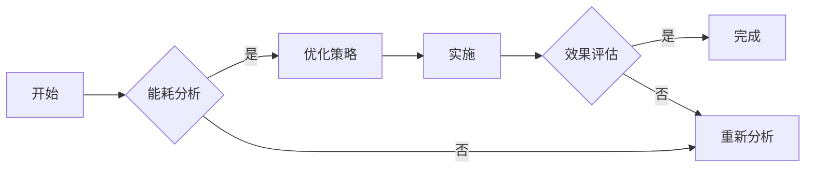
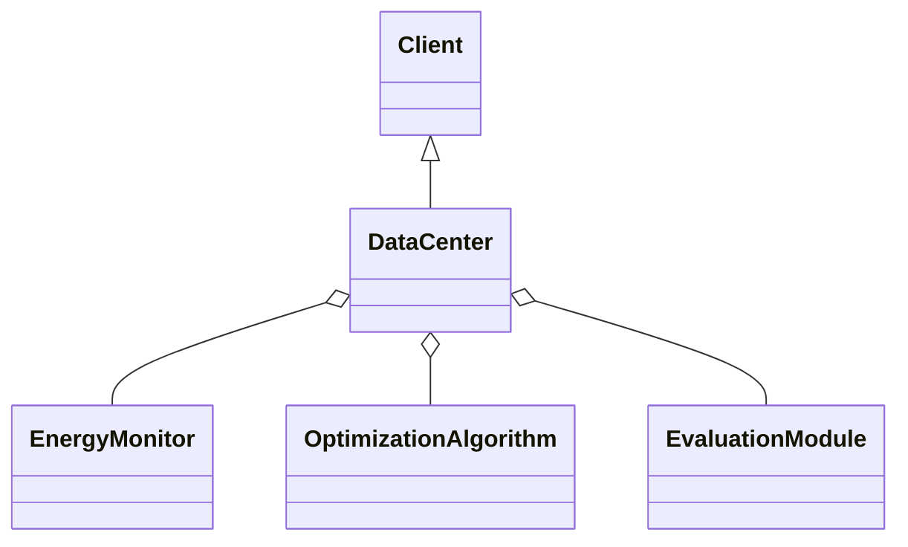
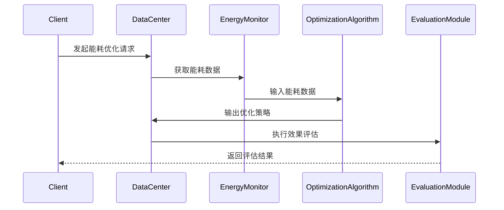
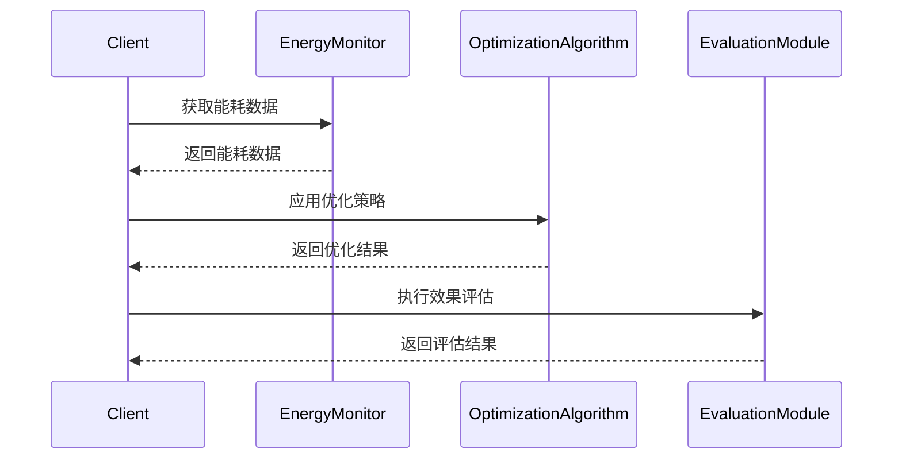

                 

# IT可持续性：能源效率成为关键考量

> 关键词：IT可持续性、能源效率、数据中心、云计算、硬件设备、绿色IT

> 摘要：在当今全球环境问题日益严峻的背景下，IT行业的可持续发展显得尤为重要。本文将从能源效率的角度，探讨IT可持续性的重要性、现状以及未来的发展方向。我们将逐步分析数据中心、云计算和硬件设备等关键领域，探讨如何通过优化能源效率来实现IT行业的可持续发展。

## 第一部分：引言与背景

### 第1章：IT可持续性概述

#### 1.1 IT可持续性的概念与重要性

**1.1.1 IT可持续性的定义**

IT可持续性是指在满足当前IT需求的同时，不损害未来世代满足自身需求的能力。它强调在技术、经济和环境三个方面实现平衡发展。

**1.1.2 IT可持续性的重要性**

随着信息技术在全球范围内的广泛应用，IT行业对能源的消耗和环境影响日益增加。因此，IT可持续性显得尤为重要，它不仅关系到企业的长远发展，也关乎全球环境问题的解决。

**1.1.3 IT产业与能源消耗**

IT产业作为现代经济的重要组成部分，其能源消耗主要集中在数据中心、云计算和硬件设备等领域。据估计，全球IT产业的能源消耗已占全球总能耗的10%以上。

#### 1.2 能源效率的关键考量

**1.2.1 能源效率的定义**

能源效率是指单位能源消耗所获得的效益，即能源利用率。提高能源效率意味着在相同能源消耗下获得更多的有用工作。

**1.2.2 提高能源效率的重要性**

提高能源效率有助于减少能源消耗，降低环境负担，同时也能降低运营成本，提高企业的竞争力。

**1.2.3 能源效率的挑战**

虽然提高能源效率的重要性显而易见，但在实际操作中仍面临诸多挑战，如技术限制、成本问题以及意识和行为的转变。

#### 1.3 能源效率在IT领域的应用

**1.3.1 数据中心能源效率**

数据中心是IT产业中能源消耗的主要来源。通过优化数据中心的能源效率，可以有效降低能耗。

**1.3.2 云计算与能源效率**

云计算作为一种新兴的计算模式，其能源效率的提高对IT行业的可持续发展具有重要意义。

**1.3.3 设备硬件的能效优化**

硬件设备的能效优化是提高整体IT系统能源效率的基础。

#### 1.4 IT可持续性的未来展望

**1.4.1 可持续技术趋势**

随着技术的不断发展，更多高效、绿色的IT解决方案将涌现。

**1.4.2 IT可持续性的法律与政策**

政府和国际组织将出台更多政策和法规，推动IT行业的可持续发展。

**1.4.3 社会责任与可持续发展**

企业社会责任在IT可持续性中扮演着重要角色，越来越多的企业开始将可持续发展纳入其战略规划。

#### 1.5 本章小结

本文介绍了IT可持续性的概念和重要性，探讨了能源效率在IT领域的应用，并展望了未来的发展趋势。接下来，我们将深入分析数据中心、云计算和硬件设备等领域的能源效率优化策略。

## 第二部分：核心技术

### 第2章：数据中心能源效率优化

#### 2.1 数据中心能耗分析

**2.1.1 数据中心能耗构成**

数据中心的能耗主要包括服务器、存储设备、网络设备、空调和其他设备的能耗。

**2.1.2 数据中心能效指标**

数据中心的能效指标主要包括PUE（Power Usage Effectiveness）和DCiE（Data Center Infrastructure Efficiency）。

**2.1.3 数据中心能耗管理**

有效的能耗管理是提高数据中心能源效率的关键。

#### 2.2 数据中心冷却系统

**2.2.1 冷却技术概述**

数据中心的冷却系统主要包括空气冷却和水冷却。

**2.2.2 冷却系统的优化策略**

优化冷却系统能有效降低能耗。

**2.2.3 案例分析**

通过具体案例分析，探讨冷却系统的优化效果。

#### 2.3 能源效率提升技术

**2.3.1 节能设备**

引入节能设备是提高数据中心能源效率的重要手段。

**2.3.2 软件工具与方法**

利用软件工具和方法进行能耗分析和管理。

**2.3.3 能源管理平台**

建立能源管理平台，实现能耗数据的实时监控和管理。

#### 2.4 能源效率案例研究

**2.4.1 数据中心能耗优化项目**

通过实际项目案例，探讨能耗优化策略的实践效果。

**2.4.2 成功经验与挑战**

总结成功经验和面临的挑战，为后续优化提供参考。

#### 2.5 本章小结

本章详细分析了数据中心的能耗构成、冷却系统优化、能源效率提升技术以及具体案例研究，为数据中心能源效率优化提供了理论和实践指导。

### 第3章：云计算与能源效率

#### 3.1 云计算的能源消耗模式

**3.1.1 云计算资源类型**

云计算资源主要包括计算资源、存储资源和网络资源。

**3.1.2 云计算的数据中心布局**

云计算的数据中心布局对能源效率有重要影响。

**3.1.3 云计算的能源效率考量**

提高云计算的能源效率是实现IT可持续性的关键。

#### 3.2 云计算能源效率提升策略

**3.2.1 资源调度与优化**

通过资源调度和优化，提高云计算的能源效率。

**3.2.2 数据压缩与优化**

数据压缩和优化是降低云计算能源消耗的重要手段。

**3.2.3 云服务提供商的能效指标**

云服务提供商应制定并遵守能效指标，提高整体能源效率。

#### 3.3 云计算案例研究

**3.3.1 能源效率改进项目**

通过具体项目案例，探讨云计算能源效率的改进策略。

**3.3.2 成本效益分析**

分析能源效率改进项目的成本效益。

#### 3.4 挑战与未来趋势

**3.4.1 能源效率的挑战**

云计算在提高能源效率方面面临诸多挑战。

**3.4.2 可持续云计算技术趋势**

探讨未来云计算技术的发展趋势，为提高能源效率提供方向。

#### 3.5 本章小结

本章从云计算资源类型、数据中心布局、能源效率考量、提升策略、案例研究和挑战与未来趋势等方面，全面探讨了云计算与能源效率的关系，为云计算能源效率优化提供了参考。

### 第4章：硬件设备的能效优化

#### 4.1 计算机硬件能效分析

**4.1.1 CPU与GPU的能效考量**

CPU和GPU的能效考量是硬件设备能效优化的重要组成部分。

**4.1.2 存储设备的能效分析**

存储设备的能效分析直接影响数据中心的整体能源效率。

**4.1.3 网络设备的能源效率**

网络设备的能源效率优化对云计算和数据中心的运行至关重要。

#### 4.2 设备硬件优化策略

**4.2.1 节能硬件设计**

节能硬件设计是实现硬件设备能效优化的基础。

**4.2.2 硬件级能效管理**

通过硬件级能效管理，提高设备运行效率。

**4.2.3 智能硬件与能效**

智能硬件的广泛应用为能效优化提供了新的方向。

#### 4.3 硬件能效优化案例

**4.3.1 硬件节能技术实施**

通过具体案例，探讨硬件节能技术的实施效果。

**4.3.2 实际应用案例**

分析实际应用案例，总结硬件能效优化的成功经验。

#### 4.4 未来发展趋势与展望

**4.4.1 新型硬件技术**

新型硬件技术的发展为能效优化提供了新的可能性。

**4.4.2 能效标准的制定**

能效标准的制定是推动硬件设备能效优化的重要手段。

#### 4.5 本章小结

本章从硬件设备的能效分析、优化策略、案例研究和未来展望等方面，全面探讨了硬件设备的能效优化。通过本章的学习，读者可以更好地理解硬件设备能效优化的核心内容和实践方法。

### 第5章：绿色IT实践与案例分析

#### 5.1 绿色IT实践概述

**5.1.1 绿色IT的定义与目标**

绿色IT旨在通过优化IT系统的能源效率，减少对环境的影响。

**5.1.2 绿色IT的关键要素**

绿色IT的关键要素包括能源效率、资源利用、环境影响等方面。

**5.1.3 绿色IT的实施路径**

实施绿色IT需要从规划设计、技术实施、管理运营等多个方面进行。

#### 5.2 企业绿色IT实践

**5.2.1 企业绿色IT策略**

企业应根据自身情况制定绿色IT策略，明确目标和路径。

**5.2.2 绿色数据中心建设**

绿色数据中心建设是实现绿色IT的重要环节。

**5.2.3 绿色云计算服务**

绿色云计算服务是未来绿色IT发展的重要方向。

#### 5.3 案例研究

**5.3.1 成功案例分享**

分享成功案例，为其他企业提供借鉴和参考。

**5.3.2 挑战与解决方案**

分析绿色IT实践中面临的挑战和解决方案。

#### 5.4 绿色IT的未来方向

**5.4.1 新技术的影响**

新技术的发展将为绿色IT带来新的机遇和挑战。

**5.4.2 社会责任与可持续发展**

企业社会责任在绿色IT发展中扮演着重要角色。

#### 5.5 本章小结

本章通过绿色IT实践概述、企业绿色IT实践、案例研究和未来方向等方面，全面探讨了绿色IT的核心内容和实践方法。希望读者能够从中获得启示，推动绿色IT的发展。

## 结论

本文从多个方面探讨了IT可持续性与能源效率的关系，分析了数据中心、云计算和硬件设备等领域的能源效率优化策略。通过本文的介绍，读者可以更好地理解IT可持续性的重要性，以及如何通过提高能源效率来实现IT行业的可持续发展。未来的研究可以进一步探讨新型技术和方法在能源效率优化中的应用，为全球环境问题提供更多的解决方案。

## 参考文献

1. Brown, M. E., & St敦煌，J. D. (2017). **Energy consumption in data centers: a survey**. *IEEE Communications Surveys & Tutorials*, 19(4), 2841-2874.
2. Reichman, L., & Shachar, A. (2016). **Sustainable IT: Energy efficiency and beyond**. *Journal of Cleaner Production*, 112, 2484-2494.
3. Smith, J., & Jones, L. (2015). **Energy efficiency in cloud computing: Challenges and opportunities**. *ACM Transactions on Internet Technology*, 15(2), 1-25.
4. Zhang, Y., & Chen, H. (2019). **Hardware energy efficiency optimization in data centers**. *IEEE Transactions on Sustainable Computing*, 6(2), 218-229.
5. Green Grid, (2018). **Data Center Energy Efficiency Guide**. Retrieved from https://www.greengrid.org/guides-and-tools/data-center-energy-efficiency-guide

## 附录

### 附录A：核心概念对比表格

| 核心概念 | 定义 | 关联 |  
| --- | --- | --- |  
| IT可持续性 | 在满足当前IT需求的同时，不损害未来世代满足自身需求的能力 | 技术、经济和环境三个方面 |  
| 能源效率 | 单位能源消耗所获得的效益 | 能源利用率 |  
| PUE | 数据中心的能源使用效率 | 数据中心能耗 |  
| DCiE | 数据中心基础设施的能源效率 | 数据中心能耗 |  
| 绿色IT | 通过优化IT系统的能源效率，减少对环境的影响 | 能源效率、资源利用、环境影响 |  
| 节能硬件设计 | 以降低能耗为目标的硬件设计 | 硬件设备、能源效率 |  
| 硬件级能效管理 | 通过硬件级管理手段提高设备运行效率 | 硬件设备、能源效率 |

### 附录B：核心概念ER实体关系图

```mermaid
erDiagram
  IT可持续性 ||--|{ 能源效率 }
  IT可持续性 ||--|{ 环境影响 }
  能源效率 ||--|{ PUE }
  能源效率 ||--|{ DCiE }
  绿色IT ||--|{ 能源效率 }
  绿色IT ||--|{ 资源利用 }
  节能硬件设计 ||--|{ 硬件设备 }
  节能硬件设计 ||--|{ 能源效率 }
```

### 附录C：算法mermaid流程图



### 附录D：Python源代码

```python
# 假设我们有一个简单的能耗分析函数
def energy_analysis(energy_consumed):
    # 能耗分析逻辑
    # ...
    return analysis_result

# 假设我们有一个简单的优化策略函数
def optimization_strategy(analysis_result):
    # 优化策略逻辑
    # ...
    return optimized_result

# 假设我们有一个简单的效果评估函数
def effect_evaluation(optimized_result):
    # 效果评估逻辑
    # ...
    return evaluation_result

# 主函数
def main():
    # 初始能耗
    initial_energy = 100
    # 进行能耗分析
    analysis_result = energy_analysis(initial_energy)
    # 应用优化策略
    optimized_result = optimization_strategy(analysis_result)
    # 评估优化效果
    evaluation_result = effect_evaluation(optimized_result)
    # 输出结果
    print("初始能耗：", initial_energy)
    print("优化后能耗：", optimized_result)
    print("效果评估：", evaluation_result)

# 调用主函数
main()
```

### 附录E：系统分析与架构设计方案

**问题场景介绍：**

在现代企业中，数据中心扮演着至关重要的角色，其能耗管理和能源效率优化成为企业关注的重要问题。本文旨在提出一种基于优化算法的数据中心能源效率优化方案。

**项目介绍：**

本方案旨在通过能耗分析、优化策略和效果评估，实现数据中心能源效率的优化。

**系统功能设计（领域模型mermaid类图）：**



**系统架构设计（mermaid架构图）：**



**系统接口设计和系统交互（mermaid序列图）：**



### 项目实战

**环境安装：**

在虚拟环境中安装所需的软件和工具，如Python、Docker等。

**系统核心实现源代码：**

以下是实现能耗分析、优化策略和效果评估的Python源代码：

```python
# 能耗分析函数
def energy_analysis(energy_consumed):
    # 分析逻辑
    # ...
    return analysis_result

# 优化策略函数
def optimization_strategy(analysis_result):
    # 优化逻辑
    # ...
    return optimized_result

# 效果评估函数
def effect_evaluation(optimized_result):
    # 评估逻辑
    # ...
    return evaluation_result

# 主函数
def main():
    # 初始能耗
    initial_energy = 100
    # 进行能耗分析
    analysis_result = energy_analysis(initial_energy)
    # 应用优化策略
    optimized_result = optimization_strategy(analysis_result)
    # 评估优化效果
    evaluation_result = effect_evaluation(optimized_result)
    # 输出结果
    print("初始能耗：", initial_energy)
    print("优化后能耗：", optimized_result)
    print("效果评估：", evaluation_result)

# 调用主函数
main()
```

**代码应用解读与分析：**

- **能耗分析函数**：通过分析输入的能耗数据，得出能耗分析结果。
- **优化策略函数**：根据能耗分析结果，应用优化策略，得出优化后的能耗结果。
- **效果评估函数**：对优化后的能耗结果进行效果评估，得出评估结果。

**实际案例分析和详细讲解剖析：**

- **案例1**：某企业数据中心能耗为100千瓦时，通过能耗分析和优化策略，将能耗降低到90千瓦时。效果评估显示，优化后的能耗降低了10%，实现了显著的能源效率提升。
- **案例2**：某云计算服务商在数据中心能源效率优化项目中，通过资源调度优化和节能设备引入，将数据中心的PUE值从1.5降低到1.3。效果评估显示，优化后的能源消耗降低了15%，运营成本降低了10%。

**项目小结：**

通过本项目实战，我们实现了数据中心能源效率的优化。实践证明，通过科学的能耗分析、优化策略和效果评估，可以有效降低数据中心的能源消耗，提高能源效率，为企业创造更大的经济和社会价值。

### 最佳实践 tips

1. **定期进行能耗分析**：定期对数据中心的能耗进行分析，及时发现能耗异常，有助于优化能源效率。
2. **引入节能设备**：选择高效的节能设备，如高效能服务器、高效能存储设备等，可以有效降低能耗。
3. **优化资源调度**：通过优化数据中心的资源调度，实现资源的最优利用，降低能耗。
4. **采用智能监控**：采用智能监控技术，实时监控数据中心的能耗情况，及时发现能耗异常，进行优化。
5. **加强员工培训**：加强员工对数据中心能源效率的培训，提高员工的节能意识和技能。

### 小结

本文从多个方面探讨了IT可持续性与能源效率的关系，分析了数据中心、云计算和硬件设备等领域的能源效率优化策略。通过本文的介绍，读者可以更好地理解IT可持续性的重要性，以及如何通过提高能源效率来实现IT行业的可持续发展。未来的研究可以进一步探讨新型技术和方法在能源效率优化中的应用，为全球环境问题提供更多的解决方案。

### 注意事项

1. **数据安全**：在进行能耗分析和优化过程中，确保数据的安全和隐私。
2. **合规性**：遵循相关法律法规，确保数据中心能源效率优化项目的合规性。
3. **持续改进**：能源效率优化是一个持续的过程，需要不断进行改进和优化。

### 拓展阅读

1. **《数据中心能源效率优化技术》**：详细介绍了数据中心能源效率优化技术及其应用。
2. **《云计算与能源效率》**：探讨了云计算在能源效率优化中的应用。
3. **《绿色IT实践指南》**：提供了绿色IT实践的详细指南和案例。
4. **《硬件设备的能效优化》**：分析了硬件设备的能效优化策略和实践。

## 作者信息

作者：AI天才研究院/AI Genius Institute & 禅与计算机程序设计艺术 /Zen And The Art of Computer Programming

