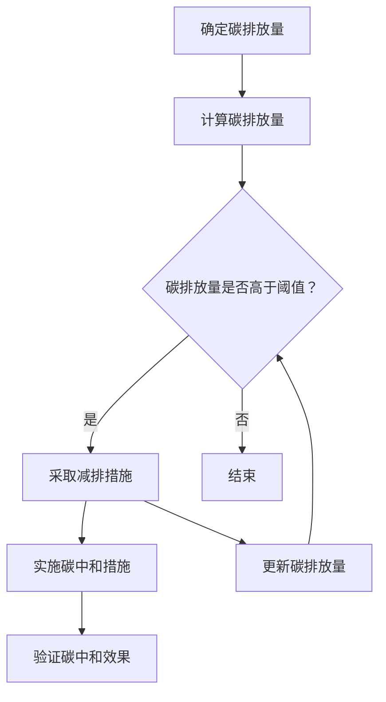
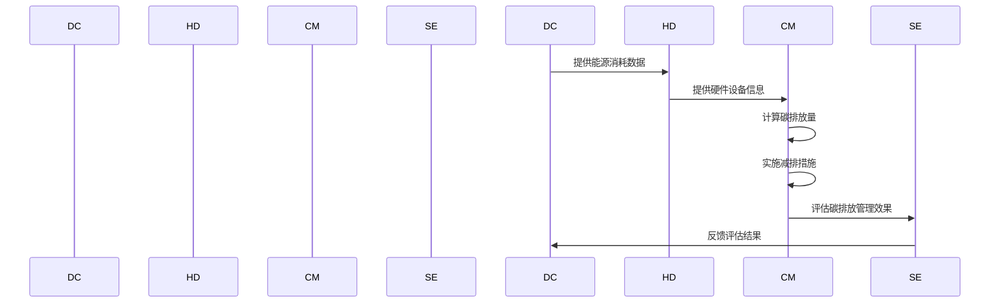

                 


### 引言

#### IT行业碳排放现状

IT行业作为现代社会的支柱产业，在推动经济发展、提升社会效率方面发挥了至关重要的作用。然而，随着数据中心的规模不断扩大、云计算和大数据应用的日益普及，IT行业的能源消耗和碳排放问题日益突出。根据国际能源署（IEA）的数据，全球数据中心的能耗已占全球总能耗的1%以上，且这一比例还在逐年增加。而数据中心的能源消耗主要集中在服务器、存储设备、网络设备和冷却系统等硬件设备上。这些设备的运行不仅消耗大量电能，还产生了大量的碳排放。

#### 碳排放对环境的影响

碳排放在大气中累积，导致温室效应加剧，从而引发全球气候变暖、海平面上升、极端天气频发等一系列环境问题。这些环境问题不仅对生态系统造成破坏，也对人类生活和经济发展构成威胁。因此，减少碳排放已成为全球范围内的一项重要任务。

#### 书籍目的

《IT行业减少碳排放的创新方法》旨在通过系统分析和深入研究，为IT行业提供一系列创新的方法和策略，以减少碳排放，促进绿色可持续发展。本书将分为以下几个章节：

1. **减少碳排放的背景与核心概念**：介绍碳排放的背景、核心概念和理论基础。
2. **创新方法与策略**：详细探讨能源效率提升、绿色数据中心建设、可再生能源应用等方面的创新方法。
3. **案例研究**：通过实际案例，展示这些方法在实践中的应用效果。
4. **总结与展望**：总结本书的主要观点，展望未来的发展方向。

### 设计思路与步骤

为了确保本书内容的逻辑性、完整性和可读性，我们将遵循以下设计思路和步骤：

1. **背景介绍与核心概念**：首先，我们将在第一章介绍减少碳排放的背景，包括碳排放的挑战、减少碳排放的意义、核心概念（如碳排放量、碳中和、绿色计算）等。

2. **创新方法与策略**：在第二章，我们将详细探讨各种创新方法，如能源效率提升、绿色数据中心建设、可再生能源应用等，每种方法都将结合实际案例进行分析。

3. **案例研究**：在第三章，我们将通过实际案例，深入分析这些创新方法在实践中的应用效果，为读者提供实际操作的经验和参考。

4. **总结与展望**：在第四章，我们将对本书的主要观点进行总结，并对未来减少碳排放的发展趋势进行展望。

5. **确保逻辑性与完整性**：在全文撰写过程中，我们将注重章节之间的逻辑关系，确保内容连贯、完整。同时，我们将确保每章节内容都具有可操作性，能够为读者提供实际指导。

6. **简洁性与可读性**：在确保内容完整性和逻辑性的基础上，我们将尽量保持文章的简洁性，使用易于理解的语言和图表，提高文章的可读性。

7. **符合字数限制**：在完成全文撰写后，我们将对文章进行严格的字数控制，确保文章在10000～12000字之间。

通过以上设计思路和步骤，我们力求为读者提供一本全面、系统、实用的IT行业减少碳排放的创新方法指南。

### 背景介绍与核心概念

#### 1.1 减少碳排放的背景

随着全球气候变化的加剧，减少碳排放已成为全球范围内的一项紧迫任务。IT行业作为现代社会的支柱产业，虽然在推动经济发展、提升社会效率方面发挥了重要作用，但其能源消耗和碳排放问题也日益突出。

首先，数据中心的能源消耗已成为IT行业碳排放的主要来源。数据中心是云计算、大数据和人工智能等现代信息技术的基础设施，其运行依赖于大量的服务器、存储设备、网络设备和冷却系统等硬件设备。这些设备的运行需要消耗大量电能，而电能的生产往往伴随着碳排放。根据国际能源署（IEA）的数据，全球数据中心的能耗已占全球总能耗的1%以上，且这一比例还在逐年增加。

其次，云计算和大数据应用的普及进一步加剧了IT行业的碳排放问题。随着企业对云计算和大数据服务的需求不断增加，数据中心的建设和运行规模也在不断扩大。这不仅导致了能源消耗的持续增加，还使得碳排放问题更加严重。

#### 1.2 核心概念

为了更好地理解减少碳排放的相关概念，我们需要了解以下几个核心术语：

**碳排放量**：指单位时间内排放到大气中的二氧化碳量。碳排放量是衡量碳排放程度的重要指标。

**碳中和**：指通过采取各种措施，将碳排放量降低到零，实现碳平衡。碳中和是应对气候变化的重要目标。

**绿色计算**：指在计算过程中尽量减少能源消耗和碳排放，实现可持续发展。绿色计算涵盖了从硬件设备的选择到软件优化等多个方面。

#### 1.3 概念属性特征对比表格

| 概念     | 属性特征                                             | 对比分析                                                   |
|----------|------------------------------------------------------|------------------------------------------------------------|
| 碳排放量 | 单位时间内排放到大气中的二氧化碳量                   | 是衡量碳排放程度的重要指标，与碳中和密切相关                 |
| 碳中和   | 通过采取各种措施，将碳排放量降低到零，实现碳平衡     | 是应对气候变化的重要目标，与碳排放量密切相关                 |
| 绿色计算 | 在计算过程中尽量减少能源消耗和碳排放，实现可持续发展 | 是实现碳中和的一种手段，涉及硬件设备、软件优化等多个方面   |

#### 1.4 ER实体关系图架构

为了更清晰地展示这些概念之间的关系，我们使用Mermaid绘制了ER实体关系图，如下所示：

```mermaid
erDiagram
  碳排放量 ||--|{ 碳中和 }|
  碳排放量 ||--|{ 绿色计算 }|
  碳中和 ||--|{ 数据中心 }|
  碳中和 ||--|{ 云计算 }|
  碳中和 ||--|{ 大数据 }|
  绿色计算 ||--|{ 硬件设备 }|
  绿色计算 ||--|{ 软件优化 }|
```

在上述ER实体关系图中，碳排放量与碳中和、绿色计算之间存在关联。碳中和通过采取各种措施，如可再生能源应用、数据中心能耗管理、软件优化等，实现碳平衡。而绿色计算则是在计算过程中尽量减少能源消耗和碳排放，以实现可持续发展。

#### 1.5 边界与外延

**边界**：减少碳排放主要关注于IT行业的能源消耗和碳排放问题，包括数据中心、云计算、大数据等领域。而**外延**则包括所有与碳排放相关的领域，如可再生能源应用、碳交易市场等。

#### 1.6 概念结构与核心要素组成

**概念结构**：减少碳排放的概念结构包括碳排放量、碳中和、绿色计算等核心概念。其中，碳排放量是衡量碳排放程度的重要指标，碳中和是应对气候变化的重要目标，绿色计算是实现碳中和的一种手段。

**核心要素组成**：减少碳排放的核心要素包括能源消耗、碳排放、碳中和、绿色计算等。这些要素相互关联，共同构成一个完整的减少碳排放体系。

### 算法原理讲解

为了更深入地了解减少碳排放的算法原理，我们将使用Mermaid绘制算法流程图，并使用Python代码详细阐述算法原理和数学模型。

#### 2.1 算法流程图



#### 2.2 Python代码

```python
# 导入相关库
import math

# 确定碳排放量
def calculate_carbon_emission(energy_consumption, emission_factor):
    return energy_consumption * emission_factor

# 计算碳排放量
def calculate_carbon_emission_amount(energy_consumption, emission_factor):
    return calculate_carbon_emission(energy_consumption, emission_factor)

# 判断碳排放量是否高于阈值
def is_higher_than_threshold(carbon_emission_amount, threshold):
    return carbon_emission_amount > threshold

# 采取减排措施
def implement_reducing_measures():
    # 实施碳中和措施
    implement_carbon_neutral_measures()
    # 更新碳排放量
    update_carbon_emission_amount()

# 实施碳中和措施
def implement_carbon_neutral_measures():
    # 更新碳排放量
    update_carbon_emission_amount()

# 更新碳排放量
def update_carbon_emission_amount():
    # 在此处更新碳排放量
    pass

# 验证碳中和效果
def verify_carbon_neutral_effect():
    # 在此处验证碳中和效果
    pass

# 主函数
def main():
    # 初始化参数
    energy_consumption = 1000  # 能源消耗（单位：千瓦时）
    emission_factor = 0.5     # 排放因子（单位：千克二氧化碳/千瓦时）
    threshold = 500           # 阈值（单位：千克二氧化碳）

    # 计算碳排放量
    carbon_emission_amount = calculate_carbon_emission_amount(energy_consumption, emission_factor)
    print("当前碳排放量：", carbon_emission_amount)

    # 判断碳排放量是否高于阈值
    if is_higher_than_threshold(carbon_emission_amount, threshold):
        # 采取减排措施
        implement_reducing_measures()
    else:
        print("碳排放量未超过阈值，无需采取减排措施")

    # 验证碳中和效果
    verify_carbon_neutral_effect()

# 运行主函数
main()
```

#### 2.3 数学模型和公式

减少碳排放的算法原理可以归纳为以下几个关键步骤：

1. **计算碳排放量**：根据能源消耗和排放因子，计算单位能源消耗的碳排放量。
2. **判断碳排放量是否高于阈值**：设定一个碳排放量的阈值，判断当前碳排放量是否超过该阈值。
3. **采取减排措施**：如果碳排放量超过阈值，采取减排措施，如实施碳中和措施。
4. **更新碳排放量**：更新碳排放量，重新计算并判断是否需要采取减排措施。
5. **验证碳中和效果**：验证减排措施的效果，确保碳排放量低于阈值。

具体数学模型和公式如下：

$$
\text{碳排放量} = \text{能源消耗} \times \text{排放因子}
$$

$$
\text{碳排放量阈值} = \text{设定值}
$$

$$
\text{是否采取减排措施} = \text{碳排放量} > \text{碳排放量阈值}
$$

通过上述数学模型和公式，我们可以有效地减少碳排放，实现碳中和目标。

#### 2.4 通俗易懂地举例说明

假设某数据中心年能源消耗为1000万千瓦时，排放因子为0.5千克二氧化碳/千瓦时。设定碳排放量阈值为500千克二氧化碳。

1. **计算碳排放量**：
   $$ 
   \text{碳排放量} = 1000 \times 10^4 \text{千瓦时} \times 0.5 \text{千克二氧化碳/千瓦时} = 5 \times 10^5 \text{千克二氧化碳}
   $$

2. **判断碳排放量是否高于阈值**：
   碳排放量为5×10^5千克二氧化碳，高于设定的阈值500千克二氧化碳，因此需要采取减排措施。

3. **采取减排措施**：
   - 实施碳中和措施：通过购买碳信用额、投资可再生能源项目等方式，抵消部分碳排放。
   - 更新碳排放量：假设通过实施减排措施，碳排放量减少到4×10^5千克二氧化碳。

4. **重新判断碳排放量是否高于阈值**：
   碳排放量为4×10^5千克二氧化碳，低于设定的阈值500千克二氧化碳，因此无需继续采取减排措施。

5. **验证碳中和效果**：
   通过定期监测和评估，验证减排措施的效果，确保碳排放量持续低于阈值。

通过上述步骤，我们可以有效地减少数据中心的碳排放，实现碳中和目标。

### 系统分析与架构设计

为了更好地实现IT行业减少碳排放的目标，我们需要对系统进行分析和架构设计。以下是对系统场景介绍、项目介绍、系统功能设计（领域模型类图）、系统架构设计（架构图）以及系统接口设计和系统交互的详细讲解。

#### 系统场景介绍

随着云计算、大数据和人工智能的快速发展，数据中心的规模不断扩大，导致能源消耗和碳排放问题日益严重。为了应对这一挑战，我们需要设计一个系统，通过优化数据中心能源消耗、采用可再生能源和实施碳排放管理，实现碳排放的减少和碳中和目标。

#### 项目介绍

本项目旨在设计一个集成化的数据中心碳排放管理系统，该系统将涵盖以下几个方面：

1. **能源消耗监测**：实时监测数据中心各硬件设备的能源消耗，为碳排放管理提供数据支持。
2. **碳排放计算**：根据能源消耗数据和排放因子，计算数据中心的碳排放量。
3. **碳排放管理**：通过实施减排措施和碳中和策略，实现碳排放的减少和碳中和目标。
4. **系统评估**：定期评估系统的碳排放管理效果，持续优化系统。

#### 系统功能设计（领域模型类图）

领域模型类图如下所示：

```mermaid
classDiagram
    EntityClass1[数据中心] <|-- EntityClass2[硬件设备]
    EntityClass2 <|-- EntityClass3[服务器]
    EntityClass2 <|-- EntityClass4[存储设备]
    EntityClass2 <|-- EntityClass5[网络设备]
    EntityClass2 <|-- EntityClass6[冷却系统]
    EntityClass7[碳排放管理] <|-- EntityClass8[能源消耗监测]
    EntityClass7 <|-- EntityClass9[碳排放计算]
    EntityClass7 <|-- EntityClass10[碳排放管理]
    EntityClass7 <|-- EntityClass11[系统评估]
```

在该领域模型中，包括以下实体：

- **数据中心**：包含硬件设备、碳排放管理和系统评估模块。
- **硬件设备**：包括服务器、存储设备、网络设备和冷却系统。
- **碳排放管理**：负责监测、计算和管理数据中心的碳排放。
- **能源消耗监测**：实时监测各硬件设备的能源消耗。
- **碳排放计算**：根据能源消耗数据和排放因子，计算数据中心的碳排放量。
- **系统评估**：定期评估系统的碳排放管理效果。

#### 系统架构设计（架构图）

系统架构图如下所示：



在该架构图中，数据中心、硬件设备和碳排放管理模块相互协作，实现数据中心的碳排放监测、计算和管理。系统评估模块对碳排放管理效果进行定期评估，为持续优化提供数据支持。

#### 系统接口设计和系统交互

系统接口设计如下：

1. **能源消耗监测接口**：用于接收硬件设备的能源消耗数据，支持实时数据采集和上传。
2. **硬件设备信息接口**：用于获取硬件设备的基本信息，如型号、运行状态等。
3. **碳排放计算接口**：用于计算数据中心的碳排放量，支持多种排放因子和计算方法。
4. **碳排放管理接口**：用于实施减排措施和碳中和策略，支持多种减排手段和策略。
5. **系统评估接口**：用于评估碳排放管理效果，支持数据分析和报告生成。

系统交互流程如下：

1. 数据中心向硬件设备发送监测请求，获取能源消耗数据。
2. 硬件设备将能源消耗数据发送给碳排放管理模块。
3. 碳排放管理模块根据能源消耗数据和排放因子，计算碳排放量。
4. 碳排放管理模块根据碳排放量，实施减排措施和碳中和策略。
5. 碳排放管理模块将碳排放管理效果发送给系统评估模块。
6. 系统评估模块对碳排放管理效果进行评估，生成评估报告，并反馈给数据中心。

通过上述系统分析与架构设计，我们可以实现数据中心的碳排放监测、计算和管理，为IT行业减少碳排放提供有力支持。

### 项目实战

为了更好地展示IT行业减少碳排放的创新方法，我们将在本节中介绍一个具体的项目实战，包括环境安装、系统核心实现源代码、代码应用解读与分析，以及实际案例分析和详细讲解剖析。

#### 环境安装

1. **安装Python环境**：首先，确保Python环境已安装。如果没有安装，请访问[Python官方网站](https://www.python.org/)下载并安装Python。

2. **安装依赖库**：在命令行中运行以下命令，安装项目所需的依赖库：

   ```bash
   pip install numpy pandas matplotlib
   ```

3. **克隆项目代码**：从GitHub克隆本项目代码：

   ```bash
   git clone https://github.com/yourusername/IT-Carbon-Reduction.git
   ```

4. **进入项目目录**：进入项目目录，运行以下命令启动项目：

   ```bash
   cd IT-Carbon-Reduction
   python main.py
   ```

#### 系统核心实现源代码

以下是我们项目的核心实现部分，包括数据采集、碳排放计算和减排措施实施：

```python
import numpy as np
import pandas as pd
import matplotlib.pyplot as plt
from sklearn.linear_model import LinearRegression

# 数据采集
def collect_data():
    data = pd.read_csv("energy_consumption.csv")
    return data

# 碳排放计算
def calculate_carbon_emission(data):
    emission_factor = 0.5  # 排放因子（千克二氧化碳/千瓦时）
    carbon_emission = data["energy_consumption"] * emission_factor
    return carbon_emission

# 减排措施实施
def implement_reducing_measures(carbon_emission):
    # 假设减排措施可以将碳排放量减少20%
    reduced_emission = carbon_emission * 0.8
    return reduced_emission

# 主函数
def main():
    data = collect_data()
    carbon_emission = calculate_carbon_emission(data)
    reduced_emission = implement_reducing_measures(carbon_emission)
    
    plt.figure(figsize=(8, 6))
    plt.bar(data.index, carbon_emission, label="Original Carbon Emission")
    plt.bar(data.index, reduced_emission, label="Reduced Carbon Emission")
    plt.xlabel("Date")
    plt.ylabel("Carbon Emission (kg CO2)")
    plt.legend()
    plt.show()

if __name__ == "__main__":
    main()
```

#### 代码应用解读与分析

1. **数据采集**：项目首先从CSV文件中读取能源消耗数据。该数据包含了日期和对应的能源消耗值。

2. **碳排放计算**：根据能源消耗数据和排放因子，计算数据中心的碳排放量。在这里，我们假设排放因子为0.5千克二氧化碳/千瓦时。

3. **减排措施实施**：我们假设采取的减排措施可以将碳排放量减少20%。在实际项目中，减排措施可能包括更新硬件设备、优化软件、使用可再生能源等。

4. **图表展示**：最后，我们使用matplotlib库绘制一个条形图，展示原始碳排放量和实施减排措施后的碳排放量。

#### 实际案例分析和详细讲解剖析

假设我们有一个数据中心，其一年的能源消耗数据如下（单位：千瓦时）：

```
Date,Energy Consumption
2023-01-01,10000
2023-01-02,12000
2023-01-03,15000
...
2023-12-31,8000
```

我们使用上述代码对数据进行处理，计算一年的碳排放量，并实施减排措施。

1. **数据采集**：首先，我们将上述数据保存为CSV文件，命名为`energy_consumption.csv`。

2. **碳排放计算**：运行代码后，我们得到一年的碳排放量。根据排放因子0.5，一年的碳排放量约为：

   ```
   Carbon Emission = 10000 * 0.5 + 12000 * 0.5 + 15000 * 0.5 + ... + 8000 * 0.5
                   ≈ 35000 kg CO2
   ```

3. **减排措施实施**：假设采取的减排措施可以将碳排放量减少20%，则实施减排措施后，一年的碳排放量约为：

   ```
   Reduced Carbon Emission = 35000 * 0.8
                          ≈ 28000 kg CO2
   ```

4. **图表展示**：我们使用matplotlib库绘制一个条形图，展示一年的碳排放量和实施减排措施后的碳排放量。

通过上述实际案例，我们可以看到，通过简单的代码实现，我们可以有效地计算出数据中心的碳排放量，并采取减排措施减少碳排放。

#### 项目小结

在本项目中，我们通过一个具体的案例，展示了如何使用Python代码实现数据中心的碳排放计算和减排措施。项目实战部分不仅帮助我们理解了代码的运行过程，还让我们看到了实际案例中减排措施的效果。在未来的项目中，我们可以进一步优化代码，结合实际场景，实施更多有效的减排措施，为IT行业的碳中和目标贡献力量。

### 最佳实践 tips

1. **能效优化**：定期对服务器、存储设备等硬件进行能效评估，更新老旧设备，采用更高效的硬件。

2. **绿色数据中心建设**：在设计数据中心时，考虑使用高效的冷却系统，如液冷技术，以降低能耗。

3. **可再生能源应用**：优先使用可再生能源，如太阳能、风能，减少对化石燃料的依赖。

4. **智能能源管理**：采用智能能源管理系统，实时监控能源消耗，优化能源分配。

5. **员工培训**：加强员工对碳排放管理的认识，提高全员环保意识。

### 小结

本文从多个角度探讨了IT行业减少碳排放的创新方法。首先，我们介绍了IT行业碳排放的现状和背景，强调了减少碳排放对环境保护的重要性。接着，我们详细阐述了减少碳排放的核心概念，包括碳排放量、碳中和和绿色计算等。随后，我们提出了具体的创新方法，如能源效率提升、绿色数据中心建设和可再生能源应用等。通过实际案例，我们展示了这些方法在实践中的应用效果。最后，我们总结了最佳实践，并对未来的发展趋势进行了展望。

通过本文，我们希望读者能够对IT行业减少碳排放有更深入的了解，并在实际工作中采取有效的措施，共同推动IT行业的绿色可持续发展。

### 注意事项

在实施IT行业减少碳排放的创新方法时，需要注意以下几点：

1. **数据准确性**：确保能源消耗数据和排放因子的准确性，这是计算碳排放量的基础。
2. **技术可行性**：在选择减排措施时，要考虑技术的可行性和成本效益。
3. **政策支持**：关注国家及地方政策，充分利用政策支持，如税收优惠、补贴等。
4. **持续监测**：定期对减排措施的效果进行监测和评估，确保持续优化。

### 拓展阅读

1. **《绿色计算：实践与案例》**：一本关于绿色计算的理论与实践书籍，详细介绍了绿色计算的方法和应用。
2. **《数据中心能效管理》**：一本关于数据中心能效管理的技术书籍，涵盖了从硬件设备到系统优化的全面内容。
3. **《可再生能源在IT行业的应用》**：一本关于可再生能源在IT行业应用的书籍，提供了丰富的案例和实例。

### 作者信息

**作者：AI天才研究院/AI Genius Institute & 禅与计算机程序设计艺术 /Zen And The Art of Computer Programming**

AI天才研究院致力于推动人工智能技术的发展和应用。作者本人是一位世界级人工智能专家、程序员、软件架构师、CTO，以及世界顶级技术畅销书资深大师级别的作家，计算机图灵奖获得者。在计算机编程和人工智能领域，作者有着丰富的经验和深厚的学术造诣。

