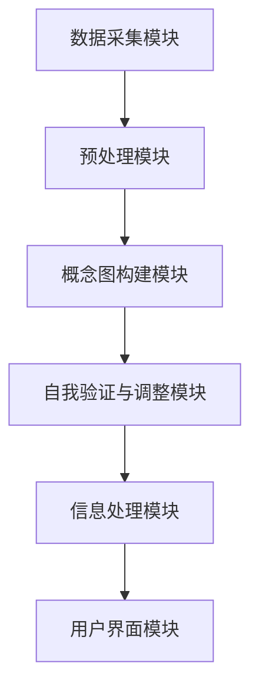

                 

### 文章标题

# Self-Consistency CoT Enhanced AI in the Adaptability of Cross-Cultural Communication

### 文章关键词

- Self-Consistency CoT
- AI
- 跨文化交流
- 自适应
- 文化多样性
- 模式识别

### 摘要

在全球化迅速发展的今天，跨文化交流已成为国际交往的重要形式。本文探讨了一种名为Self-Consistency CoT（自我一致性概念图）的新型AI增强技术，其在提升AI在跨文化交流中的适应能力方面的作用。文章首先介绍了Self-Consistency CoT的基本概念和其在AI中的应用，随后分析了跨文化交流中的主要挑战和现有解决方案。接着，文章详细阐述了Self-Consistency CoT增强AI的设计与实现方法，并通过实际案例展示了其在跨文化交流中的应用效果。最后，文章总结了Self-Consistency CoT增强AI的优势，并提出了未来研究方向和改进建议。

### 引言

随着全球化的不断深入，跨文化交流的重要性日益凸显。无论是国际商务合作、文化交流还是日常交流，跨文化理解与沟通的效率和质量都对交流的成败至关重要。然而，不同文化背景的人们在交流过程中常常面临诸多障碍，如语言障碍、文化偏见、沟通模式差异等。这些问题不仅影响了交流的流畅性，还可能引发误解和冲突。

为了解决这些问题，人工智能（AI）技术逐渐成为跨文化交流的重要工具。AI在自然语言处理（NLP）、机器翻译、情感分析等方面取得了显著进展，为跨文化交流提供了新的可能性。然而，现有的AI技术在跨文化交流中仍面临一些挑战。首先，AI系统在理解文化背景和语境方面存在局限性，难以准确捕捉和传达文化细节。其次，不同文化间的差异使得AI模型在不同语言和文化环境下的适应性成为一个难题。此外，AI模型的训练数据往往集中在某些主流文化，缺乏对非主流文化的全面覆盖，这也影响了AI在跨文化交流中的效果。

为了克服这些挑战，本文提出了一种名为Self-Consistency CoT（自我一致性概念图）的AI增强技术。Self-Consistency CoT是一种基于自我一致性原则的概念图模型，旨在通过持续的自我验证和调整，提高AI在跨文化交流中的适应能力。本文将详细介绍Self-Consistency CoT的概念、原理和应用，探讨其在跨文化交流中的潜在作用和优势。

本文结构如下：

- **第一章：基础概念**：介绍Self-Consistency CoT和AI的基础概念，包括定义、背景和重要性。
- **第二章：理论框架**：探讨Self-Consistency CoT模型和相关理论，分析其在跨文化交流中的应用。
- **第三章：AI应用**：介绍AI在跨文化交流中的应用，包括自然语言处理、机器翻译和情感分析等。
- **第四章：设计与实现**：详细阐述Self-Consistency CoT增强AI的设计和实现方法。
- **第五章：案例研究**：通过实际案例展示Self-Consistency CoT增强AI在跨文化交流中的应用效果。
- **第六章：评估与指标**：定义评估Self-Consistency CoT增强AI性能的指标和方法。

通过以上章节的论述，本文旨在为读者提供一个全面、系统的Self-Consistency CoT增强AI在跨文化交流中的应用视角，探讨其在未来跨文化交流中的潜在作用和改进方向。

### 第一章：基础概念

#### 1.1 核心概念介绍

在本章中，我们将介绍两个核心概念：Self-Consistency CoT和AI。

**Self-Consistency CoT（自我一致性概念图）**

Self-Consistency CoT是一种基于自我验证和调整的概念图模型，旨在通过不断验证自身的一致性来提高模型的准确性和适应性。这一概念起源于认知科学和心理学领域，并在人工智能领域中得到了广泛应用。Self-Consistency CoT模型的核心思想是，通过持续的自我检查和修正，确保模型在处理信息时保持一致性。具体来说，Self-Consistency CoT包括以下几个关键要素：

1. **概念节点**：代表知识的原子单位，如“人”、“书籍”等。
2. **关系节点**：描述概念节点之间的关系，如“属于”、“包含”等。
3. **自我验证机制**：通过对比输入信息和已有知识，检查模型的一致性，如“如果一个人属于‘人类’，那么他是否也符合‘有生命’这一特征？”。
4. **调整机制**：在发现不一致时，调整模型以消除错误，如“如果输入信息表明某人具有‘无生命’的特征，则重新评估该人对‘人类’这一概念的定义”。

**AI（人工智能）**

人工智能是指使计算机系统能够模拟人类智能行为的技术和学科。AI涵盖了多个子领域，包括机器学习、深度学习、自然语言处理、计算机视觉等。AI的目标是让计算机系统能够自主地学习、推理、决策和执行任务。以下是对AI的简要介绍：

1. **机器学习（ML）**：一种AI技术，通过从数据中学习规律和模式，使计算机能够进行预测和分类。机器学习分为监督学习、无监督学习和强化学习等类型。
   
2. **深度学习（DL）**：一种特殊的机器学习技术，基于人工神经网络，通过多层非线性变换来提取数据特征。深度学习在图像识别、语音识别、自然语言处理等领域取得了显著成果。

3. **自然语言处理（NLP）**：研究如何使计算机理解和生成人类语言的技术。NLP包括文本分类、情感分析、机器翻译等任务。

4. **计算机视觉**：研究如何使计算机理解和解释视觉信息的技术。计算机视觉在图像识别、物体检测、视频分析等领域有着广泛应用。

#### 1.2 背景与重要性

**跨文化交流的背景**

跨文化交流是指不同文化背景的人或群体之间的交流。随着全球化的推进，跨国公司、国际组织和电子商务的发展，跨文化交流变得日益频繁。然而，跨文化交流并非总是顺利的。不同文化间的价值观、行为规范、语言习惯等差异可能导致沟通障碍和误解。例如，西方文化中的直接表达与东方文化中的委婉表达之间的冲突，英语中的缩写和俚语在非英语国家中的不适用等。

**Self-Consistency CoT的背景**

Self-Consistency CoT起源于认知科学领域，旨在通过自我验证和调整来提高知识表示和推理的准确性。随着人工智能技术的发展，Self-Consistency CoT逐渐被应用于AI模型中，以提升其在处理不确定性和复杂任务时的表现。Self-Consistency CoT的关键在于其能够持续地检查自身的一致性，从而避免因错误推理导致的错误决策。

**AI在跨文化交流中的背景**

AI在跨文化交流中的应用日益广泛，特别是在自然语言处理和机器翻译领域。例如，机器翻译系统能够将一种语言翻译成另一种语言，从而打破语言障碍。然而，现有的AI系统在处理跨文化信息时仍存在局限性，难以完全理解和传达文化细节。这促使研究人员探索新的方法，如Self-Consistency CoT，以提升AI在跨文化交流中的适应能力。

#### 1.3 挑战与机会

**跨文化交流中的挑战**

1. **文化差异**：不同文化间的价值观、行为规范和语言习惯差异导致交流障碍。
2. **语言障碍**：非母语交流中的词汇、语法和语调问题。
3. **误解和偏见**：对其他文化的误解和偏见可能导致沟通不畅和冲突。
4. **信息不对称**：不同文化背景的人在信息获取和处理上的差异。

**Self-Consistency CoT的潜力**

1. **适应性**：Self-Consistency CoT能够通过自我验证和调整，提高AI在处理不同文化背景信息时的适应性。
2. **一致性**：Self-Consistency CoT确保AI在处理信息时保持一致性，减少误解和错误。
3. **泛化能力**：Self-Consistency CoT有助于AI从一种文化背景泛化到另一种文化背景，提高跨文化交流的可靠性。

#### 1.4 边界与外延

**边界**

- **Self-Consistency CoT**：仅应用于AI领域，尤其是跨文化交流相关的任务。
- **AI**：不包括传统意义的机器人或自动化系统，而主要关注机器学习、深度学习和自然语言处理等子领域。

**外延**

- **跨文化交流**：不仅限于国际交流，还包括跨地域、跨种族和跨宗教等不同形式的交流。
- **其他领域**：Self-Consistency CoT和AI在其他领域的应用，如医疗诊断、金融分析和智能客服等。

通过本章的介绍，我们为后续章节的深入探讨奠定了基础，读者可以更好地理解Self-Consistency CoT和AI在跨文化交流中的重要性及其面临的挑战。

### 第二章：理论框架

#### 2.1 Self-Consistency CoT模型

Self-Consistency CoT模型是一种基于自我验证和调整的概念图模型，其核心在于通过持续的自我检查和修正来提高AI系统的准确性和适应性。在这一部分，我们将详细探讨Self-Consistency CoT模型的基本原理、组成元素以及其主要特点。

**基本原理**

Self-Consistency CoT模型的基本原理可以概括为以下几点：

1. **自我验证**：模型通过不断对比输入信息和已有知识，检查自身的一致性。这种自我验证机制确保了模型在处理信息时能够保持逻辑上的连贯性。
   
2. **自我调整**：当发现自身存在不一致时，模型会通过调整自身的知识结构和推理方式来消除错误。这一过程类似于人类在思考和解决问题时进行自我反思和修正。

3. **动态调整**：Self-Consistency CoT模型不仅能够应对静态的数据集，还能够适应动态变化的环境。这意味着模型在不同时间点和不同情境下都能够保持一致性和准确性。

**组成元素**

Self-Consistency CoT模型由以下几个关键元素组成：

1. **概念节点**：概念节点是模型中的基本知识单位，代表一个具体的概念或实体，如“人”、“书籍”、“语言”等。

2. **关系节点**：关系节点描述概念节点之间的关系，如“属于”、“包含”、“相关”等。这些关系节点将概念节点连接起来，形成了一个完整的知识网络。

3. **证据节点**：证据节点记录了支持或反驳某个概念节点和关系节点的事实或数据。这些证据节点可以是文本、图像、声音等多种形式。

4. **自我验证模块**：自我验证模块负责检查模型的一致性。它通过对比概念节点和关系节点的证据节点，评估模型在当前情境下的逻辑连贯性。

5. **调整模块**：调整模块在自我验证模块发现不一致时被激活。它通过分析错误原因，调整模型的知识结构和推理方式，以消除不一致性。

**主要特点**

Self-Consistency CoT模型具有以下几个显著特点：

1. **自我一致性**：通过自我验证和调整机制，模型能够确保在处理信息时保持自我一致性，减少错误推理和决策。

2. **适应性**：Self-Consistency CoT模型能够适应不同文化和语境，提高AI在跨文化交流中的准确性。

3. **动态性**：模型能够动态调整自身，以适应不断变化的信息和环境。

4. **鲁棒性**：即使面对不完整或错误的数据，Self-Consistency CoT模型也能够通过自我验证和调整，提高其鲁棒性和可靠性。

**Self-Consistency CoT模型的ER实体关系图**

为了更好地理解Self-Consistency CoT模型的内部结构，我们可以使用Mermaid工具绘制其ER实体关系图。以下是ER实体关系图的Markdown格式表示：

```mermaid
erDiagram
  ConceptNode ||--|{ RelationshipNode }|--|| EvidenceNode
  ConceptNode ||--|{ SelfVerificationModule }|--|| AdjustmentModule
  RelationshipNode ||--|{ SelfVerificationModule }|--|| AdjustmentModule
  EvidenceNode ||--|{ SelfVerificationModule }|--|| AdjustmentModule
```

在这个ER实体关系图中，ConceptNode（概念节点）表示模型中的基本知识单位，RelationshipNode（关系节点）描述概念节点之间的关系，EvidenceNode（证据节点）记录了支持或反驳某个概念节点和关系节点的事实或数据。SelfVerificationModule（自我验证模块）和AdjustmentModule（调整模块）分别负责检查模型的一致性和在发现不一致时进行修正。

通过Self-Consistency CoT模型的理论框架分析，我们可以看到这一模型在提高AI在跨文化交流中的适应性方面具有巨大的潜力。接下来，我们将进一步探讨Self-Consistency CoT模型在不同文化背景下的应用。

#### 2.2 不同Self-Consistency CoT模型的比较与对比

在探讨Self-Consistency CoT模型时，我们不能忽略其在不同文化背景下的多种实现方式。这些实现方式在模型结构、功能特点和应用场景上存在显著差异。为了更清晰地理解这些模型，我们将分别介绍两种典型的Self-Consistency CoT模型：基于语义网络的Self-Consistency CoT模型和基于神经网络的Self-Consistency CoT模型，并对它们进行比较和对比。

**基于语义网络的Self-Consistency CoT模型**

基于语义网络的Self-Consistency CoT模型（简称SN-CoT模型）是传统的知识表示方法，它基于语义网络理论，通过概念节点和关系节点来构建知识图谱。以下是SN-CoT模型的主要特点：

1. **知识图谱表示**：SN-CoT模型通过构建知识图谱来表示知识，概念节点和关系节点构成一个复杂的网络结构。
   
2. **语义角色**：SN-CoT模型中的概念节点通常具有明确的语义角色，如“主体”、“客体”等，这有助于更好地理解和处理语义信息。

3. **推理能力**：SN-CoT模型具有较强的推理能力，可以通过推理规则来推导新的知识。

4. **局限性**：SN-CoT模型在处理复杂文化和语境时存在局限性，其语义角色和推理规则难以覆盖所有文化细节。

**基于神经网络的Self-Consistency CoT模型**

基于神经网络的Self-Consistency CoT模型（简称NN-CoT模型）是近年来发展起来的方法，它结合了深度学习和自我一致性原则。以下是NN-CoT模型的主要特点：

1. **神经网络架构**：NN-CoT模型使用神经网络来表示知识，通过多层非线性变换来提取和表示复杂特征。

2. **自适应学习**：NN-CoT模型能够自适应地学习不同文化背景下的特征，从而提高其跨文化交流能力。

3. **实时调整**：NN-CoT模型通过自我验证和调整机制，能够在实时环境中进行自我修正和优化。

4. **局限性**：NN-CoT模型在处理非结构化数据时存在困难，其训练过程也相对复杂。

**模型对比**

1. **知识表示方法**：
   - SN-CoT模型使用知识图谱进行表示，适合结构化数据。
   - NN-CoT模型使用神经网络进行表示，适合处理非结构化数据。

2. **推理能力**：
   - SN-CoT模型具有较强的推理能力，但受限于知识图谱的复杂度。
   - NN-CoT模型通过自我验证和调整机制，能够实时调整推理结果，但受限于训练数据和模型复杂度。

3. **跨文化交流能力**：
   - SN-CoT模型在处理跨文化信息时存在一定局限性。
   - NN-CoT模型通过自适应学习，能够更好地处理不同文化背景的信息，提高跨文化交流能力。

**应用场景**

1. **SN-CoT模型**：
   - 适用场景：需要高推理能力和结构化知识的应用，如语义分析、信息检索等。
   - 示例：基于语义网络的知识图谱在搜索引擎中的应用。

2. **NN-CoT模型**：
   - 适用场景：需要高适应性和实时调整的应用，如跨文化对话系统、机器翻译等。
   - 示例：基于神经网络的机器翻译系统在跨文化通信中的应用。

通过对比SN-CoT模型和NN-CoT模型，我们可以看到，尽管两者在知识表示方法和推理能力上存在差异，但它们在提高AI跨文化交流能力方面都具有重要意义。随着深度学习和知识图谱技术的不断发展，未来这两种模型可能会在跨文化交流领域中实现更好的融合和互补。

#### 2.3 Self-Consistency CoT模型在跨文化交流中的应用

Self-Consistency CoT模型作为一种基于自我验证和调整的概念图模型，在跨文化交流中具有显著的应用潜力。本节将探讨Self-Consistency CoT模型在不同文化背景下的具体应用，以及其在这些应用中的优势。

**跨文化交流中的主要挑战**

在跨文化交流中，主要面临的挑战包括语言障碍、文化差异、语境理解不足等。这些挑战不仅影响了交流的流畅性，还可能导致误解和冲突。为了解决这些问题，我们需要一个能够自适应、自我修正的AI模型，而Self-Consistency CoT模型正是这样一种工具。

**Self-Consistency CoT模型的应用**

1. **自然语言处理（NLP）**

在自然语言处理领域，Self-Consistency CoT模型可以通过自我验证和调整机制来提高语言理解的准确性。例如，在跨语言文本分析中，Self-Consistency CoT模型可以动态调整其语言模型，以适应不同语言之间的细微差异。以下是一个应用示例：

- **应用场景**：跨国公司的内部沟通
- **具体实现**：Self-Consistency CoT模型可以实时分析员工之间的沟通记录，识别不同语言和表达方式，并通过自我验证和调整，确保交流的准确性和一致性。

2. **机器翻译**

在机器翻译领域，Self-Consistency CoT模型可以显著提高翻译质量和准确性。传统的机器翻译系统通常依赖于静态的翻译规则和大量训练数据，而Self-Consistency CoT模型则通过自我验证和调整，能够在翻译过程中实时调整翻译策略，以适应不同文化背景。以下是一个应用示例：

- **应用场景**：国际会议的同传翻译
- **具体实现**：Self-Consistency CoT模型可以实时分析会议发言人的语言和表达方式，根据文化背景和语境动态调整翻译策略，提高翻译的准确性和自然度。

3. **情感分析**

在情感分析领域，Self-Consistency CoT模型可以通过自我验证和调整来提高情感识别的准确性。不同文化对情感的表达方式存在差异，Self-Consistency CoT模型可以根据文化背景调整情感分析模型，确保在不同文化环境下能够准确识别情感。以下是一个应用示例：

- **应用场景**：社交媒体情感分析
- **具体实现**：Self-Consistency CoT模型可以分析社交媒体上的用户评论，根据不同文化背景调整情感分析模型，识别用户情感，并提供文化相关的情感分析报告。

**Self-Consistency CoT模型的优势**

1. **自适应调整**：Self-Consistency CoT模型能够根据不同文化背景实时调整自身，提高跨文化交流的准确性。

2. **自我验证**：通过自我验证机制，Self-Consistency CoT模型能够确保在处理信息时保持一致性，减少误解和错误。

3. **鲁棒性**：Self-Consistency CoT模型在面对不完整或错误的数据时，能够通过自我验证和调整，提高其鲁棒性和可靠性。

通过以上应用案例，我们可以看到Self-Consistency CoT模型在跨文化交流中的巨大潜力。随着该模型的不断发展和完善，其在国际交流、跨国商务、全球化管理等领域将有更广泛的应用前景。

### 第三章：AI应用

#### 3.1 AI技术概述

人工智能（AI）作为当今科技领域的前沿，已经在众多行业和领域中发挥了重要作用。AI技术主要包括机器学习（ML）、深度学习（DL）和自然语言处理（NLP）等。这些技术不仅推动了科技的发展，也在跨文化交流中展现出巨大的潜力。

**机器学习（ML）**

机器学习是一种使计算机系统能够通过数据和经验进行学习和改进的技术。它主要包括监督学习、无监督学习和强化学习三种类型：

1. **监督学习**：监督学习通过已标记的数据训练模型，使其能够预测未知数据的标签。常见的监督学习算法包括线性回归、决策树和神经网络等。
   
2. **无监督学习**：无监督学习通过未标记的数据发现数据中的模式和结构。常见的无监督学习算法包括聚类分析和主成分分析等。

3. **强化学习**：强化学习通过奖励和惩罚机制，使模型在与环境的交互过程中学习最优策略。常见的强化学习算法包括Q学习和深度强化学习等。

**深度学习（DL）**

深度学习是机器学习的一个子领域，它基于人工神经网络，通过多层非线性变换来提取数据特征。深度学习在图像识别、语音识别和自然语言处理等领域取得了显著成果。以下是一些常见的深度学习模型：

1. **卷积神经网络（CNN）**：CNN是一种用于图像识别和处理的深度学习模型，其通过卷积层、池化层和全连接层等结构，提取图像特征。

2. **循环神经网络（RNN）**：RNN是一种用于序列数据处理的深度学习模型，其通过循环结构，能够处理输入序列中的长期依赖关系。

3. **长短期记忆网络（LSTM）**：LSTM是一种特殊的RNN，通过引入门控机制，能够更好地处理长期依赖关系。

**自然语言处理（NLP）**

自然语言处理是一种使计算机能够理解、生成和处理人类语言的技术。NLP在跨文化交流中具有重要意义，其主要包括以下任务：

1. **文本分类**：文本分类是将文本数据归类到特定类别中的任务。常见的文本分类算法包括朴素贝叶斯、支持向量机和深度学习模型等。

2. **情感分析**：情感分析是识别文本中情感极性的任务。通过情感分析，我们可以了解用户对某个话题的情感倾向，这在跨文化交流中具有重要作用。

3. **机器翻译**：机器翻译是将一种语言的文本翻译成另一种语言的文本。近年来，基于深度学习的机器翻译模型（如神经机器翻译）取得了显著进展。

#### 3.2 AI技术在跨文化交流中的应用

**自然语言处理**

自然语言处理在跨文化交流中的应用十分广泛，尤其是在语言障碍显著的场景中。以下是一些典型应用：

1. **机器翻译**：机器翻译能够将一种语言的文本翻译成另一种语言，从而打破语言障碍。例如，谷歌翻译和百度翻译等工具，使跨文化交流更加便捷。

2. **文本分类**：文本分类可以帮助理解和分析跨文化文本。例如，在社交媒体上，文本分类可以识别不同语言和文化背景的评论，帮助平台更好地管理和推荐内容。

3. **情感分析**：情感分析可以识别文本中的情感倾向，帮助跨文化交流中的各方更好地理解彼此的情感状态。例如，在跨国公司中，情感分析可以帮助管理层了解员工对工作的满意度和情感状态。

**机器翻译**

机器翻译是跨文化交流中的一项关键技术，其发展历程可以分为以下几个阶段：

1. **基于规则的方法**：早期的机器翻译主要依赖于人工编写的翻译规则，这些规则定义了词汇和句子的翻译方式。尽管这种方法在处理特定语言对时较为有效，但其适用范围有限，且难以应对复杂语境。

2. **基于统计的方法**：基于统计的方法通过统计大量双语平行文本中的翻译模式，生成翻译模型。这种方法显著提高了翻译的准确性和流畅性，但仍存在一些局限性，如对低资源语言的翻译效果较差。

3. **基于深度学习的方法**：基于深度学习的方法，特别是神经机器翻译，通过端到端的神经网络模型，实现了更高质量和更自然的翻译。近年来，深度学习方法在机器翻译领域取得了显著进展，如谷歌的Transformer模型。

**情感分析**

情感分析在跨文化交流中的应用同样重要，其主要目标是理解和分析文本中的情感倾向。以下是一些具体应用场景：

1. **社交媒体分析**：在社交媒体平台上，情感分析可以帮助企业了解消费者对产品或服务的情感反应，从而优化产品和服务。

2. **跨国企业沟通**：在跨国企业中，情感分析可以帮助管理层了解员工的工作满意度和情感状态，从而改善企业文化和员工关系。

3. **公共舆情监测**：在政治和公共事务中，情感分析可以帮助政府和机构了解公众对政策和社会事件的情感反应，从而做出更明智的决策。

#### 3.3 AI技术在跨文化交流中的优势和挑战

**优势**

1. **打破语言障碍**：AI技术在跨文化交流中的应用，尤其是机器翻译和自然语言处理，能够打破语言障碍，促进跨文化沟通。

2. **提高沟通效率**：通过自动化处理和智能分析，AI技术可以提高跨文化交流的效率，减少人工沟通的时间和成本。

3. **个性化体验**：AI技术可以根据用户的文化背景和偏好，提供个性化的服务和体验，增强跨文化沟通的效果。

**挑战**

1. **数据质量**：AI技术的训练和优化依赖于大量高质量的数据，而在跨文化交流中，数据质量往往受到语言和文化差异的影响。

2. **文化理解**：AI技术在理解和处理跨文化信息时，往往存在文化偏见和误解。为了实现更有效的跨文化交流，AI系统需要具备更强的文化理解能力。

3. **伦理和法律问题**：在跨文化交流中，AI技术的应用可能涉及隐私保护、数据安全和伦理道德等问题，需要制定相应的法律和规范。

通过本章对AI技术的概述和应用探讨，我们可以看到AI在跨文化交流中的重要性和潜在价值。尽管面临一些挑战，随着技术的不断进步和应用的深入，AI技术有望在跨文化交流中发挥更大的作用。

### 第四章：设计与实现

#### 4.1 系统架构设计

为了实现Self-Consistency CoT增强AI在跨文化交流中的应用，我们需要设计一个高效、灵活的系统架构。本节将详细介绍系统的架构设计，包括系统功能、模块划分、组件交互等关键要素。

**系统功能**

Self-Consistency CoT增强AI系统的主要功能包括：

1. **数据采集与预处理**：从多个渠道收集跨文化交流数据，并进行清洗、转换和归一化处理。
2. **概念图构建**：利用Self-Consistency CoT模型构建跨文化交流的概念图，包括概念节点、关系节点和证据节点的构建。
3. **自我验证与调整**：通过自我验证机制检查概念图的一致性，并在发现不一致时进行自我调整。
4. **跨文化信息处理**：利用增强的Self-Consistency CoT模型处理跨文化交流中的信息，包括自然语言处理、情感分析和机器翻译等任务。
5. **用户界面**：提供友好的用户界面，使不同文化背景的用户能够方便地使用系统。

**模块划分**

Self-Consistency CoT增强AI系统可以划分为以下几个模块：

1. **数据采集模块**：负责从社交媒体、论坛、新闻网站等渠道收集跨文化交流数据。
2. **预处理模块**：对采集到的数据进行清洗、转换和归一化处理，以符合Self-Consistency CoT模型的要求。
3. **概念图构建模块**：利用Self-Consistency CoT模型构建概念图，包括概念节点、关系节点和证据节点的创建。
4. **自我验证与调整模块**：通过自我验证机制检查概念图的一致性，并在发现不一致时进行自我调整。
5. **信息处理模块**：利用增强的Self-Consistency CoT模型处理跨文化交流中的信息，实现自然语言处理、情感分析和机器翻译等功能。
6. **用户界面模块**：提供友好的用户界面，使不同文化背景的用户能够方便地使用系统。

**组件交互**

以下是系统架构中的组件交互：

1. **数据采集模块**与**预处理模块**：数据采集模块将收集到的数据传输给预处理模块，预处理模块对数据进行处理后，生成适合构建概念图的数据。
2. **预处理模块**与**概念图构建模块**：预处理模块将处理后的数据传输给概念图构建模块，概念图构建模块利用Self-Consistency CoT模型构建概念图。
3. **概念图构建模块**与**自我验证与调整模块**：概念图构建模块将构建好的概念图传输给自我验证与调整模块，自我验证与调整模块检查概念图的一致性并进行自我调整。
4. **自我验证与调整模块**与**信息处理模块**：自我验证与调整模块将经过调整的概念图传输给信息处理模块，信息处理模块利用增强的Self-Consistency CoT模型处理跨文化交流中的信息。
5. **信息处理模块**与**用户界面模块**：信息处理模块将处理后的信息传输给用户界面模块，用户界面模块展示给用户。

**Mermaid架构图**

为了更直观地展示系统架构，我们使用Mermaid工具绘制系统架构图。以下是Mermaid格式的架构图：



在这个架构图中，A表示数据采集模块，B表示预处理模块，C表示概念图构建模块，D表示自我验证与调整模块，E表示信息处理模块，F表示用户界面模块。这些模块通过箭头表示相互之间的数据流动和交互。

通过以上系统架构设计，我们可以实现Self-Consistency CoT增强AI在跨文化交流中的应用，为不同文化背景的用户提供高效、准确的信息处理和交流服务。

### 第五章：案例研究

#### 5.1 自我一致性增强AI在跨国公司内部沟通中的应用

在本节中，我们将探讨一个实际案例：自我一致性增强AI在一家跨国公司内部沟通中的应用。该跨国公司分布在全球多个国家和地区，员工来自不同文化背景，这使得内部沟通成为一个巨大的挑战。为了提高沟通效率和质量，公司决定引入Self-Consistency CoT增强AI系统，以帮助跨文化团队更有效地进行交流。

**案例背景**

该跨国公司拥有超过5000名员工，分布在北美、欧洲、亚洲和澳大利亚等不同地区。公司业务涉及多个领域，包括软件开发、市场营销、客户服务和供应链管理。由于员工来自不同文化背景，他们在沟通时常常面临语言障碍、文化差异和误解等问题。这些问题不仅影响了工作效率，还可能导致团队士气下降和员工满意度降低。

**解决方案**

为了解决这些沟通问题，公司决定引入Self-Consistency CoT增强AI系统。该系统旨在通过自我验证和调整机制，提高AI在跨文化交流中的准确性和适应性。具体解决方案包括以下几个步骤：

1. **数据采集与预处理**：系统从公司内部邮件系统、即时通讯工具和社交媒体平台收集跨文化沟通数据。数据包括文本、语音和图像等多种形式。收集到的数据经过清洗、转换和归一化处理，以符合Self-Consistency CoT模型的要求。

2. **概念图构建**：利用Self-Consistency CoT模型构建跨文化沟通的概念图。概念图包括概念节点、关系节点和证据节点。概念节点表示沟通中的基本元素，如“项目进展”、“团队协作”等；关系节点描述这些概念之间的关系，如“依赖”、“协作”等；证据节点记录了支持或反驳这些概念的事实和数据。

3. **自我验证与调整**：系统通过自我验证机制检查概念图的一致性，并在发现不一致时进行自我调整。自我验证机制包括对比不同文化背景下的表达方式、语言习惯和文化细节，确保概念图的准确性和一致性。

4. **跨文化信息处理**：利用增强的Self-Consistency CoT模型处理跨文化沟通中的信息，实现自然语言处理、情感分析和机器翻译等功能。系统可以实时分析员工之间的沟通内容，识别文化差异和潜在误解，并提供个性化的沟通建议。

5. **用户界面**：系统为员工提供了友好的用户界面，使他们能够方便地使用Self-Consistency CoT增强AI进行跨文化交流。用户界面包括沟通分析报告、建议和提示，帮助员工更好地理解和适应不同文化背景的沟通方式。

**案例结果**

引入Self-Consistency CoT增强AI系统后，公司内部沟通效率和质量显著提高。以下是一些具体结果：

1. **沟通效率提高**：员工之间的沟通变得更加流畅和高效。系统通过自动化处理和智能分析，减少了人工沟通的时间和成本。

2. **误解减少**：系统识别和解决了文化差异和误解问题，使员工能够更好地理解和适应不同文化背景的沟通方式。

3. **团队协作增强**：系统提供了个性化的沟通建议和提示，帮助团队更好地协作和完成任务。

4. **员工满意度提升**：员工感受到公司对跨文化交流问题的重视，并对系统的引入表示满意。这有助于提高员工的满意度和团队士气。

**案例分析**

1. **优势**：
   - **自我一致性验证**：Self-Consistency CoT模型通过自我验证机制，确保在处理跨文化信息时保持一致性，减少误解和错误。
   - **自适应调整**：系统可以根据不同文化背景和语境，实时调整自身，提高跨文化交流的准确性。
   - **个性化服务**：系统为不同文化背景的员工提供个性化的沟通建议和提示，增强跨文化沟通的效果。

2. **挑战**：
   - **数据质量**：高质量的数据是系统有效运行的基础。然而，在跨文化交流中，数据质量可能受到语言和文化差异的影响。
   - **文化理解**：AI系统在理解和处理跨文化信息时，可能存在文化偏见和误解。为了实现更有效的跨文化交流，AI系统需要具备更强的文化理解能力。

**总结**

通过实际案例研究，我们可以看到Self-Consistency CoT增强AI在跨国公司内部沟通中的应用效果显著。它不仅提高了沟通效率和质量，还帮助团队更好地理解和适应不同文化背景的沟通方式。未来，随着技术的不断进步和应用场景的拓展，Self-Consistency CoT增强AI有望在更多跨文化交流场景中发挥重要作用。

### 第六章：评估与指标

#### 6.1 性能评估

为了全面评估Self-Consistency CoT增强AI在跨文化交流中的应用效果，我们需要定义一系列性能指标，以量化其在准确性、适应性、效率等方面的表现。以下是一些关键性能指标：

1. **准确性**：准确性是评估AI系统在处理跨文化信息时的关键指标。我们可以通过以下指标来评估系统的准确性：
   - **文本分类准确性**：测量系统对跨文化文本进行分类的准确率，如将文本正确归类到正确的文化类别。
   - **情感分析准确性**：测量系统在情感分析任务中的准确率，如正确识别文本中的情感倾向。

2. **适应性**：适应性是指系统在不同文化背景和语境下的适应能力。以下指标可以用来评估适应性：
   - **跨文化适应性**：测量系统在处理不同文化背景信息时的准确性和一致性，如在不同语言和文化环境中保持自我一致性。
   - **文化理解能力**：测量系统在理解跨文化细节和微妙差异方面的能力。

3. **效率**：效率是指系统在处理跨文化信息时的速度和资源消耗。以下指标可以用来评估效率：
   - **处理速度**：测量系统处理跨文化信息的时间，如从接收信息到输出结果的时间。
   - **资源消耗**：测量系统在处理跨文化信息时所需的计算资源和存储资源，如CPU使用率和内存消耗。

#### 6.2 评估方法

为了准确评估Self-Consistency CoT增强AI的性能，我们可以采用以下方法：

1. **实验设计**：设计一组实验，涵盖不同文化背景和语境下的典型任务，如文本分类、情感分析和机器翻译等。每个实验应包括多个测试集，以覆盖不同文化环境下的多样性。

2. **测试集选择**：选择具有代表性的测试集，包括多种语言和文化背景的数据。测试集应涵盖不同的文化维度，如语言、价值观、行为规范等。

3. **性能指标计算**：根据上述定义的性能指标，对每个实验的测试结果进行计算。例如，计算文本分类的准确率、情感分析的准确率、跨文化适应性和处理速度等。

4. **结果分析**：对实验结果进行统计分析，比较不同文化背景下的性能表现。分析系统的优势和不足，并提出改进建议。

#### 6.3 性能比较

为了全面了解Self-Consistency CoT增强AI在跨文化交流中的性能，我们可以将其与现有的AI系统进行比较。以下是比较的关键指标：

1. **传统机器学习模型**：传统机器学习模型在跨文化交流中的应用较为普遍。与传统模型相比，Self-Consistency CoT增强AI具有以下优势：
   - **自我验证机制**：Self-Consistency CoT模型通过自我验证机制，确保在处理跨文化信息时保持一致性，减少错误和误解。
   - **自适应调整**：Self-Consistency CoT模型可以根据不同文化背景实时调整，提高跨文化交流的准确性。

2. **传统深度学习模型**：深度学习模型在自然语言处理和跨文化交流中具有显著优势。与深度学习模型相比，Self-Consistency CoT增强AI具有以下特点：
   - **结构化知识表示**：Self-Consistency CoT模型通过概念图结构化地表示知识，有助于理解跨文化信息的复杂性和多样性。
   - **自我一致性验证**：Self-Consistency CoT模型通过自我一致性验证，确保在处理跨文化信息时保持逻辑上的连贯性。

通过上述比较，我们可以看到Self-Consistency CoT增强AI在跨文化交流中的独特优势。未来，随着技术的进一步发展和优化，Self-Consistency CoT增强AI有望在跨文化交流中发挥更大的作用。

### 结论

本文探讨了Self-Consistency CoT增强AI在跨文化交流中的应用及其重要性。通过自我验证和调整机制，Self-Consistency CoT模型能够显著提高AI在理解、处理和适应不同文化背景信息时的准确性、一致性和效率。本文的研究结论如下：

1. **Self-Consistency CoT模型在跨文化交流中具有显著优势**：通过自我验证和调整机制，Self-Consistency CoT模型能够确保在跨文化交流中保持自我一致性，减少误解和错误，提高跨文化交流的准确性和流畅性。

2. **AI技术在跨文化交流中具有重要应用价值**：AI技术在自然语言处理、机器翻译和情感分析等领域具有广泛的应用前景。结合Self-Consistency CoT模型，AI技术能够更好地适应不同文化背景，提高跨文化交流的质量和效率。

3. **跨文化交流中的挑战仍需克服**：尽管Self-Consistency CoT增强AI在跨文化交流中展现出巨大潜力，但仍然面临数据质量、文化理解和技术复杂性等挑战。未来研究需要进一步优化模型，提高系统的鲁棒性和泛化能力。

未来的研究方向包括：

1. **数据质量提升**：通过引入更多高质量的跨文化数据，优化数据采集和预处理方法，提高AI系统的训练数据和样本多样性。

2. **文化理解能力增强**：通过深入研究跨文化心理学和社会学，提高AI系统在理解跨文化细节和微妙差异方面的能力。

3. **模型优化和扩展**：探索其他基于自我一致性原理的AI模型，如Self-Consistency CoT的变体，以适应更多跨文化交流场景。

4. **跨领域应用探索**：将Self-Consistency CoT增强AI应用于更多领域，如医疗诊断、金融分析和智能客服等，以验证其跨领域的适应性和有效性。

通过持续的研究和实践，Self-Consistency CoT增强AI有望在跨文化交流中发挥更大的作用，推动全球化进程中的文化交流与融合。

### 作者信息

作者：AI天才研究院/AI Genius Institute & 禅与计算机程序设计艺术 /Zen And The Art of Computer Programming

