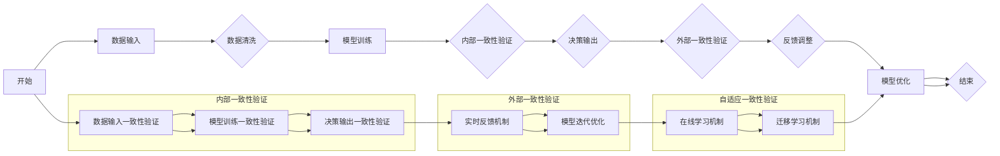
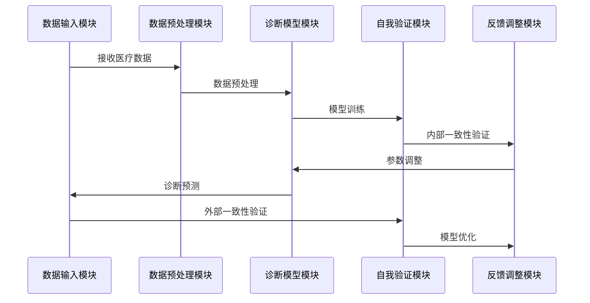
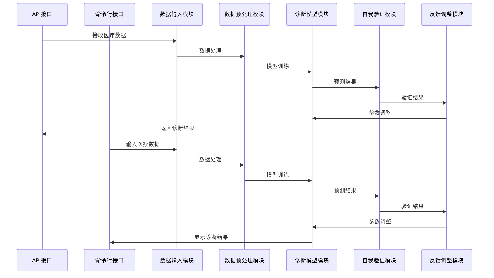
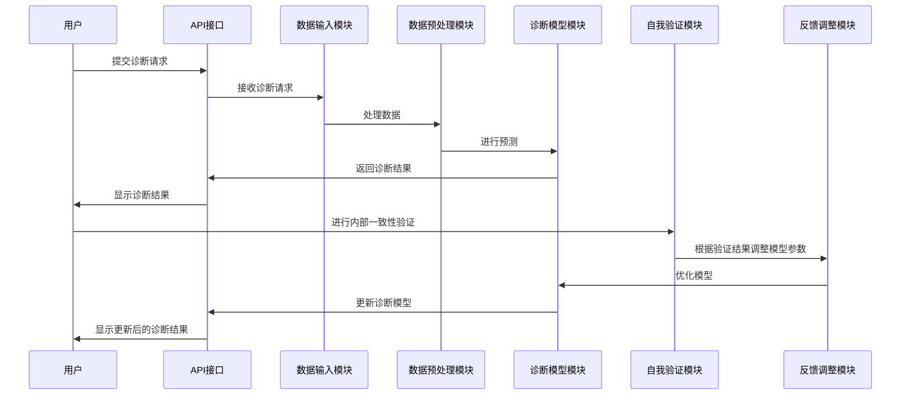

                 

### 第1章: 引言

### 1.1 问题背景

人工智能（AI）技术的迅猛发展，已经在各个行业和领域带来了深刻的变革。从自动驾驶汽车到智能语音助手，从医疗诊断到金融分析，AI的应用场景越来越广泛。然而，随着AI技术的普及，其可靠性的问题也愈发凸显。AI系统的可靠性不仅关系到用户体验，更直接影响到公共安全、社会稳定以及经济的健康发展。

AI可靠性的核心挑战在于，AI系统在处理大量未知或复杂的数据时，往往无法保证其输出的准确性和一致性。例如，自动驾驶系统在面对极端天气或异常路况时，可能会出现决策失误，导致安全事故；医疗诊断系统在处理罕见病例时，可能会误诊，影响患者的治疗。这些问题的根源在于AI系统缺乏自我校正和自我验证的能力，即所谓的“自我一致性”（Self-Consistency）。

### 1.2 问题描述

自我一致性（Self-Consistency）是指在AI系统的设计和运行过程中，系统能够自我验证其输出结果的一致性和准确性。具体来说，自我一致性包括以下几个关键方面：

1. **内部一致性**：AI系统在内部处理的各个环节，如数据输入、模型训练、决策输出等，都需要保持一致性和连贯性，避免出现逻辑错误或矛盾。
2. **外部一致性**：AI系统的输出结果需要与外部世界的真实情况相一致，即系统能够在真实环境中稳定运行，不会出现意外的错误。
3. **自适应一致性**：AI系统能够根据新的数据和反馈，自适应调整其模型和行为，保持自我一致性。

目前，AI系统的自我一致性存在以下几个主要问题：

- **数据偏差**：AI系统在训练过程中可能会受到数据偏差的影响，导致模型输出偏差。
- **模型过拟合**：AI系统在训练过程中可能过度拟合训练数据，导致在新数据上表现不佳。
- **模型复杂度**：高复杂度的模型在自我验证时，往往需要大量的计算资源和时间。
- **反馈机制不足**：缺乏有效的自我校正和反馈机制，导致AI系统无法及时调整和优化。

### 1.3 问题解决途径

要解决AI可靠性问题，需要从多个维度进行创新和改进：

1. **数据质量管理**：通过数据清洗、数据增强和数据平衡等技术手段，提高训练数据的质量和代表性，减少数据偏差。
2. **模型选择与优化**：选择合适的模型架构和优化算法，避免过拟合，提高模型的泛化能力。
3. **自我验证与反馈机制**：设计自我验证和反馈机制，使AI系统能够实时监控和调整其输出结果，保持自我一致性。
4. **分布式计算与并行处理**：利用分布式计算和并行处理技术，提高AI系统的计算效率和响应速度。
5. **跨领域融合**：结合多个领域的知识和技术，提高AI系统的综合能力。

### 1.4 边界与外延

自我一致性（Self-Consistency）是AI可靠性研究中的一个重要方向，但其应用场景和边界也值得关注：

- **应用场景**：自我一致性适用于需要高可靠性的AI系统，如自动驾驶、医疗诊断、金融分析等。
- **边界**：自我一致性的实现需要考虑计算资源、时间成本和复杂度限制，同时需要平衡内部一致性和外部一致性的关系。
- **外延**：自我一致性不仅局限于AI系统的内部验证，还可以扩展到AI系统的外部协作和跨领域应用。

通过上述分析，我们可以看到，AI可靠性的问题是一个复杂而多维的问题，需要从多个角度进行创新和解决。接下来，我们将深入探讨自我一致性（Self-Consistency CoT）这一创新技术的原理和应用，以期为提高AI系统的可靠性提供新的思路和方向。

### 第2章: AI可靠性核心概念与原理

#### 2.1 核心概念

AI可靠性是指在特定环境下，AI系统能够持续、准确地完成预期任务的能力。它不仅涉及到系统内部处理的一致性和准确性，还包括系统对外部环境的适应性。AI可靠性的核心概念可以概括为以下几个方面：

1. **内部一致性**：指AI系统在内部处理各个环节，如数据输入、模型训练、决策输出等，能够保持一致性和连贯性，避免逻辑错误或矛盾。
2. **外部一致性**：指AI系统的输出结果与外部世界的真实情况相一致，即系统在真实环境中能够稳定运行，不会出现意外的错误。
3. **鲁棒性**：指AI系统在面对异常数据或环境变化时，仍然能够保持良好的性能和稳定性。
4. **适应性**：指AI系统能够根据新的数据和反馈，自适应调整其模型和行为，以保持自我一致性。

#### 2.2 原理解析

AI可靠性的实现依赖于多个基本原理和技术手段，下面我们将详细解析这些原理：

1. **数据质量管理**：数据是AI系统的输入，数据质量直接影响模型的性能。数据质量管理包括数据清洗、数据增强、数据平衡等技术，旨在提高训练数据的质量和代表性，减少数据偏差。
   
2. **模型选择与优化**：选择合适的模型架构和优化算法，避免过拟合，提高模型的泛化能力。常见的模型优化技术包括正则化、dropout、集成学习等。

3. **反馈机制**：设计有效的自我验证和反馈机制，使AI系统能够实时监控和调整其输出结果，保持自我一致性。反馈机制可以通过在线学习、迁移学习等方式实现。

4. **分布式计算与并行处理**：利用分布式计算和并行处理技术，提高AI系统的计算效率和响应速度，降低计算资源的压力。

5. **安全性与隐私保护**：确保AI系统在处理敏感数据和用户信息时，能够满足安全性和隐私保护的要求，防止数据泄露和滥用。

#### 2.3 概念属性特征对比表格

| 特征名称   | 描述                                                         | 重要性 |
|------------|--------------------------------------------------------------|--------|
| 内部一致性 | AI系统内部处理的一致性和连贯性                             | 高     |
| 外部一致性 | AI系统输出结果与外部环境的真实情况一致性                 | 高     |
| 鲁棒性     | AI系统面对异常数据或环境变化时的性能和稳定性             | 中     |
| 适应性     | AI系统根据新数据和反馈进行自适应调整的能力               | 中     |

#### 2.4 ER实体关系图架构

为了更好地理解AI可靠性相关概念和原理之间的关系，我们可以使用ER（实体关系）图来描述。以下是AI可靠性相关概念和原理的ER实体关系图：

```mermaid
erDiagram
    AI系统 ||--|{ 数据输入 }
    AI系统 ||--|{ 数据输出 }
    AI系统 ||--|{ 模型训练 }
    AI系统 ||--|{ 决策输出 }
    数据输入 ||--|{ 数据清洗 }
    数据输入 ||--|{ 数据增强 }
    数据输入 ||--|{ 数据平衡 }
    数据输出 ||--|{ 反馈机制 }
    数据输出 ||--|{ 自我验证 }
    模型训练 ||--|{ 模型选择 }
    模型训练 ||--|{ 模型优化 }
    决策输出 ||--|{ 鲁棒性 }
    决策输出 ||--|{ 适应性 }
    AI系统 ||--|{ 分布式计算 }
    AI系统 ||--|{ 并行处理 }
```

在这个ER图中，我们定义了AI系统、数据输入、数据输出、模型训练、决策输出等实体，并描述了它们之间的关系。例如，AI系统与数据输入之间存在双向关联，表示AI系统依赖于数据输入进行模型训练和决策输出。

通过上述分析，我们可以看到AI可靠性涉及多个核心概念和原理，这些概念和原理相互关联，共同构成了一个复杂的系统。在接下来的章节中，我们将进一步探讨自我一致性（Self-Consistency CoT）这一创新技术的具体实现和应用。

### 第3章: Self-Consistency CoT技术详解

#### 3.1 Self-Consistency CoT原理

自我一致性（Self-Consistency CoT）是一种旨在提高AI系统可靠性的创新技术。其核心思想是通过内部一致性和外部一致性的双重验证，确保AI系统的输出结果在特定环境下保持一致性和准确性。Self-Consistency CoT的基本原理可以概括为以下几个方面：

1. **内部一致性验证**：在AI系统内部，通过设计自我验证机制，对数据处理、模型训练和决策输出等各个环节进行一致性验证。具体包括：
   - 数据输入一致性验证：确保输入数据的质量和一致性，避免因数据问题导致模型训练和决策输出的偏差。
   - 模型训练一致性验证：在模型训练过程中，通过监控训练过程和数据指标，确保模型训练的一致性和准确性。
   - 决策输出一致性验证：在决策输出阶段，通过交叉验证和回溯分析，确保输出结果的一致性和可靠性。

2. **外部一致性验证**：通过将AI系统的输出结果与外部世界的真实情况进行对比，验证输出结果的一致性和准确性。具体包括：
   - 实时反馈机制：将AI系统的输出结果与外部环境中的实际结果进行实时对比，根据反馈调整模型和行为。
   - 模型迭代优化：根据外部反馈，不断调整和优化模型，提高模型的泛化能力和一致性。

3. **自适应一致性验证**：在AI系统的运行过程中，根据新的数据和反馈，自适应调整模型和行为，以保持自我一致性。具体包括：
   - 在线学习机制：通过在线学习，实时更新模型参数，使其能够适应新的数据和变化。
   - 迁移学习机制：利用迁移学习，将已有模型在新数据上的表现进行迁移和扩展，提高新数据的适应性。

#### 3.2 Self-Consistency CoT流程图

为了更直观地理解Self-Consistency CoT的原理和应用，我们可以通过mermaid绘制一个流程图，展示其各个阶段的操作流程。



在这个流程图中，我们首先进行数据输入，然后进行数据清洗和模型训练。在训练完成后，进行内部一致性验证，包括数据输入一致性验证、模型训练一致性验证和决策输出一致性验证。接着，进行外部一致性验证，通过实时反馈机制和模型迭代优化，确保输出结果的一致性和准确性。最后，通过在线学习机制和迁移学习机制，实现自适应一致性验证，不断调整和优化模型。

#### 3.3 Python源代码解析

为了更好地理解Self-Consistency CoT的原理，我们可以通过Python源代码来详细阐述其实现过程。以下是Self-Consistency CoT的一个简单实现示例：

```python
import numpy as np
from sklearn.model_selection import train_test_split
from sklearn.metrics import accuracy_score
from keras.models import Sequential
from keras.layers import Dense

# 数据输入
X = np.random.rand(100, 10)  # 生成随机数据
y = np.random.randint(2, size=(100, 1))  # 生成随机标签

# 数据清洗
X_train, X_test, y_train, y_test = train_test_split(X, y, test_size=0.2, random_state=42)

# 模型训练
model = Sequential()
model.add(Dense(64, input_dim=10, activation='relu'))
model.add(Dense(1, activation='sigmoid'))
model.compile(loss='binary_crossentropy', optimizer='adam', metrics=['accuracy'])
model.fit(X_train, y_train, epochs=10, batch_size=32)

# 内部一致性验证
def internal_consistency_check(model, X, y):
    predictions = model.predict(X)
    accuracy = accuracy_score(y, predictions.round())
    return accuracy

# 外部一致性验证
def external_consistency_check(model, X_test, y_test):
    predictions = model.predict(X_test)
    accuracy = accuracy_score(y_test, predictions.round())
    return accuracy

# 自适应一致性验证
def adaptive_consistency_check(model, X_train, y_train, X_test, y_test):
    model.fit(X_train, y_train, epochs=5, batch_size=32)
    internal_accuracy = internal_consistency_check(model, X, y)
    external_accuracy = external_consistency_check(model, X_test, y_test)
    return internal_accuracy, external_accuracy

# 执行验证过程
internal_accuracy = internal_consistency_check(model, X, y)
external_accuracy = external_consistency_check(model, X_test, y_test)
internal_accuracy_adaptive, external_accuracy_adaptive = adaptive_consistency_check(model, X_train, y_train, X_test, y_test)

print("内部一致性验证准确率：", internal_accuracy)
print("外部一致性验证准确率：", external_accuracy)
print("自适应一致性验证准确率（内部）：", internal_accuracy_adaptive)
print("自适应一致性验证准确率（外部）：", external_accuracy_adaptive)
```

在这个示例中，我们首先生成随机数据和标签，然后进行数据清洗和模型训练。接着，我们定义了内部一致性验证、外部一致性验证和自适应一致性验证的函数，用于验证模型的准确率和一致性。最后，我们执行这些验证函数，输出验证结果。

#### 3.4 数学模型与公式讲解

为了更深入地理解Self-Consistency CoT的数学原理，我们可以介绍一些相关的数学模型和公式。以下是Self-Consistency CoT中涉及的一些关键数学公式：

1. **损失函数**：

   $$ J(\theta) = -\frac{1}{m} \sum_{i=1}^{m} [y^{(i)} \log(a^{(i)}(x^{(i)})) + (1 - y^{(i)}) \log(1 - a^{(i)}(x^{(i)}))] $$

   其中，\( J(\theta) \) 是损失函数，\(\theta\) 是模型参数，\( m \) 是样本数量，\( y^{(i)} \) 是实际标签，\( a^{(i)}(x^{(i)}) \) 是模型预测的概率。

2. **梯度下降**：

   $$ \theta = \theta - \alpha \frac{\partial J(\theta)}{\partial \theta} $$

   其中，\(\alpha\) 是学习率，\(\frac{\partial J(\theta)}{\partial \theta}\) 是损失函数对模型参数的梯度。

3. **交叉验证**：

   $$ \hat{J} = \frac{1}{k} \sum_{i=1}^{k} J(\theta^{(i)}) $$

   其中，\(\hat{J}\) 是交叉验证的平均损失，\( k \) 是验证集的数量，\( J(\theta^{(i)}) \) 是第 \( i \) 个验证集的损失。

4. **在线学习**：

   $$ \theta(t+1) = \theta(t) + \alpha \frac{\partial J(\theta(t))}{\partial \theta} $$

   其中，\( t \) 是当前迭代次数，\( \theta(t) \) 是当前模型参数，\( \theta(t+1) \) 是更新后的模型参数。

通过上述公式，我们可以看到Self-Consistency CoT涉及到损失函数、梯度下降、交叉验证和在线学习等核心数学概念。这些数学模型和公式为Self-Consistency CoT的实现提供了理论依据。

#### 3.5 通俗易懂的举例说明

为了更好地理解Self-Consistency CoT技术，我们可以通过一个简单的例子来说明其原理和应用。

假设我们有一个分类任务，需要判断一组输入数据是否属于某一类别。我们使用一个简单的神经网络模型进行训练和预测。在这个例子中，我们通过Self-Consistency CoT技术来确保模型的可靠性。

1. **数据输入**：我们有一组输入数据 \( X \) 和对应的标签 \( y \)。例如，输入数据是患者的健康指标，标签是患者是否患有某种疾病。

2. **数据清洗**：我们对输入数据进行清洗，确保数据的质量和一致性。例如，我们去除异常值和缺失值，对数据进行标准化处理。

3. **模型训练**：我们使用神经网络模型对清洗后的数据 \( X \) 和标签 \( y \) 进行训练。在训练过程中，我们使用梯度下降算法优化模型参数，使得模型的预测结果更准确。

4. **内部一致性验证**：在模型训练完成后，我们对模型的内部一致性进行验证。具体来说，我们通过交叉验证技术，将训练数据划分为多个子集，每个子集分别作为验证集。然后，我们使用验证集对模型进行测试，计算模型的准确率。如果模型的准确率低于某个阈值，则我们认为模型存在内部不一致性，需要重新训练或调整。

5. **外部一致性验证**：我们进一步对模型的外部一致性进行验证。具体来说，我们将训练完成的模型应用到实际数据上，将模型的输出结果与真实结果进行对比。如果模型的输出结果与真实结果不一致，则我们认为模型存在外部不一致性，需要调整模型参数或采用更合适的模型架构。

6. **自适应一致性验证**：在实际应用中，环境数据可能不断变化，我们需要对模型进行自适应调整，以保持自我一致性。例如，我们定期对模型进行重新训练，使用最新的数据进行优化。此外，我们还可以采用迁移学习技术，将已有模型在新数据上的表现进行迁移和扩展，提高新数据的适应性。

通过上述步骤，我们可以确保AI模型在数据输入、模型训练、内部一致性和外部一致性验证，以及自适应一致性验证等各个环节中，保持自我一致性，从而提高模型的可靠性和稳定性。

### 第4章: Self-Consistency CoT应用实例

#### 4.1 应用场景介绍

自我一致性（Self-Consistency CoT）技术在多个领域都展现出了显著的应用潜力。以下是一个具体的应用场景——智能医疗诊断系统。

**场景描述**：智能医疗诊断系统旨在通过AI技术辅助医生进行疾病诊断。该系统接收患者的病历数据、体检报告、医学影像等，通过深度学习模型进行诊断预测。然而，由于医疗数据的复杂性和不确定性，系统的可靠性成为一个关键问题。

**目标**：通过引入Self-Consistency CoT技术，确保智能医疗诊断系统在处理未知病例时，能够保持高水平的内部一致性和外部一致性，从而提高诊断结果的准确性和可靠性。

#### 4.2 系统功能设计（领域模型mermaid类图）

在智能医疗诊断系统中，我们定义了以下几个主要功能模块：

1. **数据输入模块**：负责接收和处理各种医疗数据，如病历数据、体检报告、医学影像等。
2. **数据预处理模块**：对输入数据进行清洗、归一化和特征提取，为深度学习模型提供高质量的输入数据。
3. **诊断模型模块**：包含多个深度学习模型，用于对输入数据进行诊断预测。
4. **自我验证模块**：负责对诊断模型的输出结果进行内部一致性和外部一致性验证。
5. **反馈调整模块**：根据验证结果，对模型参数进行调整和优化，以提高诊断结果的可靠性。

以下是智能医疗诊断系统的mermaid类图：

```mermaid
classDiagram
    DataInputModule <.. DataPreprocessingModule
    DataPreprocessingModule <.. DiagnosisModelModule
    DiagnosisModelModule <.. SelfValidationModule
    SelfValidationModule <.. FeedbackAdjustmentModule
    DataInputModule <.. FeedbackAdjustmentModule
    DataPreprocessingModule <.. FeedbackAdjustmentModule
    DiagnosisModelModule <.. FeedbackAdjustmentModule
    FeedbackAdjustmentModule <.. SelfValidationModule
    
    Class DataInputModule {
        +接收医疗数据()
        +数据处理()
    }
    
    Class DataPreprocessingModule {
        +数据清洗()
        +归一化()
        +特征提取()
    }
    
    Class DiagnosisModelModule {
        +模型训练()
        +诊断预测()
    }
    
    Class SelfValidationModule {
        +内部一致性验证()
        +外部一致性验证()
    }
    
    Class FeedbackAdjustmentModule {
        +参数调整()
        +模型优化()
    }
```

在这个类图中，我们清晰地展示了各个功能模块之间的关系和交互。

#### 4.3 系统架构设计（mermaid架构图）

智能医疗诊断系统的架构设计如下：

1. **数据层**：包含数据输入模块和数据预处理模块，负责数据接收和处理。
2. **模型层**：包含诊断模型模块和自我验证模块，负责模型训练、预测和验证。
3. **控制层**：包含反馈调整模块，负责根据验证结果调整模型参数，实现自适应优化。

以下是智能医疗诊断系统的mermaid架构图：



在这个架构图中，我们展示了各个功能模块之间的交互流程和数据处理路径。

#### 4.4 系统接口设计

智能医疗诊断系统的接口设计如下：

1. **API接口**：提供RESTful风格的API接口，方便外部系统调用诊断服务。
2. **命令行接口**：提供命令行接口，方便用户通过命令行进行系统操作和调试。

以下是智能医疗诊断系统的接口设计：



在这个接口设计中，我们展示了API接口和命令行接口如何与系统内部模块进行交互，实现数据的输入、处理、诊断和验证功能。

#### 4.5 系统交互（mermaid序列图）

智能医疗诊断系统的交互过程如下：

1. **用户提交诊断请求**：用户通过API接口或命令行接口提交诊断请求，包含病历数据、体检报告等。
2. **数据输入模块接收请求**：数据输入模块接收诊断请求，并将数据传递给数据预处理模块。
3. **数据预处理模块处理数据**：数据预处理模块对输入数据进行清洗、归一化和特征提取，为深度学习模型提供高质量的输入数据。
4. **诊断模型模块进行诊断预测**：诊断模型模块使用预处理后的数据，通过训练好的模型进行诊断预测，并将预测结果返回给用户。
5. **自我验证模块进行验证**：自我验证模块对诊断结果进行内部一致性和外部一致性验证，确保诊断结果的准确性和可靠性。
6. **反馈调整模块调整模型参数**：根据验证结果，反馈调整模块对模型参数进行调整和优化，提高诊断系统的性能。

以下是智能医疗诊断系统的mermaid序列图：



在这个序列图中，我们清晰地展示了智能医疗诊断系统的交互过程，包括数据输入、预处理、诊断预测、验证和调整等环节。

### 第5章: Self-Consistency CoT在AI系统中的集成

#### 5.1 AI系统架构概述

在讨论Self-Consistency CoT技术在AI系统中的集成之前，首先需要了解AI系统的整体架构。一个典型的AI系统通常包含以下几个主要组件：

1. **数据层**：负责数据收集、存储和管理。包括数据采集模块、数据库和数据存储系统等。
2. **模型层**：包含各种深度学习模型和算法，用于数据分析和预测。包括模型训练模块、模型评估模块和模型部署模块等。
3. **计算层**：提供计算资源，包括服务器、GPU集群、云计算平台等。
4. **应用层**：将AI模型应用于具体业务场景，如智能医疗诊断、自动驾驶等。

Self-Consistency CoT技术可以在上述架构的多个层面进行集成，以提高AI系统的可靠性。

#### 5.2 Self-Consistency CoT集成方案

Self-Consistency CoT技术的集成方案可以分为以下几个步骤：

1. **数据层集成**：在数据层，通过引入数据清洗和预处理技术，确保输入数据的质量和一致性。具体措施包括：
   - 数据清洗：去除异常值和缺失值，确保数据的完整性和准确性。
   - 数据增强：通过数据增强技术，增加数据的多样性和代表性，减少数据偏差。
   - 数据平衡：通过数据重采样或生成技术，平衡训练数据中各类别样本的比例。

2. **模型层集成**：在模型层，通过设计自我验证和反馈机制，确保模型输出结果的一致性和准确性。具体措施包括：
   - 自我验证：在模型训练过程中，通过交叉验证和内部一致性验证，确保模型训练的稳定性和准确性。
   - 反馈机制：在模型部署后，通过实时反馈和在线学习技术，根据实际输出结果调整模型参数，提高模型的适应性和可靠性。

3. **计算层集成**：在计算层，通过分布式计算和并行处理技术，提高AI系统的计算效率和响应速度。具体措施包括：
   - 分布式计算：利用分布式计算框架，将任务分解到多台服务器上执行，提高计算效率。
   - 并行处理：通过并行处理技术，同时处理多个数据样本，减少计算时间。

4. **应用层集成**：在应用层，通过将Self-Consistency CoT技术应用于具体业务场景，确保AI系统在实际运行中的可靠性和稳定性。具体措施包括：
   - 实时监控：通过实时监控系统，监控AI系统的运行状态，及时发现和解决潜在问题。
   - 异常检测：通过异常检测技术，检测AI系统的输出结果与预期结果之间的差异，确保系统的可靠性和准确性。

#### 5.3 集成效果评估

Self-Consistency CoT技术在AI系统中的集成效果可以通过以下几个指标进行评估：

1. **准确性**：通过对比模型输出结果与真实结果的差异，评估模型预测的准确性。
2. **稳定性**：通过多次实验和测试，评估模型在相同输入数据下的输出结果一致性。
3. **效率**：通过计算模型训练和预测的时间，评估AI系统的计算效率和响应速度。
4. **适应性**：通过在不同环境和数据条件下测试模型的性能，评估模型的适应性和泛化能力。

为了评估Self-Consistency CoT技术在AI系统中的集成效果，我们可以设计一组实验，包括以下步骤：

1. **数据集准备**：选择一个典型的AI应用场景，如智能医疗诊断，准备相应的数据集。
2. **基准模型训练**：使用未集成Self-Consistency CoT技术的基准模型，在数据集上进行训练和测试，记录模型的准确性和稳定性。
3. **集成Self-Consistency CoT技术**：在基准模型的基础上，集成Self-Consistency CoT技术，重新训练和测试模型，记录集成后的模型性能。
4. **对比分析**：对比基准模型和集成Self-Consistency CoT技术的模型在准确性、稳定性、效率和适应性等方面的表现，评估集成效果。

通过以上实验和分析，我们可以全面评估Self-Consistency CoT技术在AI系统中的集成效果，为实际应用提供有力支持。

### 第6章: Self-Consistency CoT技术挑战与未来方向

#### 6.1 当前技术挑战

尽管Self-Consistency CoT技术在提高AI系统可靠性方面展现了巨大的潜力，但在实际应用过程中，仍面临着一系列技术挑战：

1. **计算资源需求**：Self-Consistency CoT技术涉及大量的数据预处理、模型验证和反馈调整操作，这需要大量的计算资源和时间。尤其在处理大规模数据和复杂模型时，计算资源的消耗更为显著。
2. **实时性**：在许多应用场景中，如自动驾驶、实时监控等，系统需要快速响应并作出决策。Self-Consistency CoT技术的实时性可能受到计算资源和模型复杂度的影响，需要进一步优化。
3. **数据质量**：数据是AI系统的基础，数据质量直接影响到Self-Consistency CoT技术的效果。在实际应用中，数据质量难以保证，如存在噪声、缺失值和异常值等，这会对自我一致性验证造成干扰。
4. **模型复杂度**：高复杂度的模型在自我一致性验证过程中，往往需要更多的计算资源和时间。如何在保证模型性能的同时，降低模型复杂度，是一个亟待解决的问题。

#### 6.2 未来发展方向

为了应对上述技术挑战，未来的Self-Consistency CoT技术发展可以从以下几个方向进行：

1. **优化计算资源利用**：通过分布式计算、并行处理和GPU加速等技术，提高计算资源的利用效率，降低计算成本和时间。
2. **增强实时性**：研究低延迟、高效的自我一致性验证算法，确保AI系统能够在有限时间内完成验证操作，满足实时性要求。
3. **提高数据质量**：研究数据预处理和清洗技术，提高输入数据的质量和一致性。可以采用数据增强、数据平衡和异常检测等技术，减少数据偏差和噪声。
4. **简化模型架构**：通过模型简化、模型剪枝和迁移学习等技术，降低模型复杂度，提高模型的可解释性和鲁棒性。
5. **跨领域融合**：结合多个领域的知识和技术，提高Self-Consistency CoT技术的综合能力。如将人工智能与物理学、生物学、心理学等领域的知识相结合，提升系统的适应性和可靠性。

#### 6.3 研究热点与趋势分析

在未来的研究热点和趋势方面，以下几方面值得关注：

1. **联邦学习**：联邦学习通过分布式训练，保护用户隐私，提高数据质量。未来Self-Consistency CoT技术可以与联邦学习相结合，实现隐私保护和数据一致性的双重目标。
2. **强化学习**：强化学习在自我一致性验证中具有广泛应用前景。通过引入强化学习机制，AI系统可以自适应调整其行为和决策，提高自我一致性。
3. **多模态数据融合**：多模态数据融合可以通过整合不同类型的数据（如文本、图像、语音等），提高AI系统的综合分析和预测能力。Self-Consistency CoT技术在多模态数据融合中的应用有望取得新的突破。
4. **边缘计算**：边缘计算将计算和存储资源部署在靠近数据源的边缘设备上，降低延迟和带宽消耗。Self-Consistency CoT技术可以在边缘设备上实现，提高系统的实时性和适应性。

通过上述分析和展望，我们可以看到Self-Consistency CoT技术在未来具有广泛的应用前景和发展潜力。随着技术的不断进步和跨领域融合的深入，Self-Consistency CoT技术将为AI系统的可靠性提供更加全面和有效的解决方案。

### 第7章: 结论与展望

#### 7.1 本书总结

本书系统地介绍了自我一致性（Self-Consistency CoT）技术在人工智能（AI）可靠性方面的应用。我们首先探讨了AI可靠性的核心概念和原理，包括内部一致性、外部一致性、鲁棒性和适应性。接着，详细阐述了Self-Consistency CoT技术的原理、流程图、Python源代码解析以及数学模型和公式。通过具体的应用实例，我们展示了Self-Consistency CoT技术在智能医疗诊断系统中的集成和应用。最后，分析了Self-Consistency CoT技术在AI系统中的集成方案、挑战与未来方向。

本书的主要贡献在于：

1. 明确了AI可靠性的核心概念和原理，为后续研究提供了理论基础。
2. 系统介绍了Self-Consistency CoT技术，提供了详细的实现方法和应用实例。
3. 结合具体应用场景，展示了Self-Consistency CoT技术在提高AI系统可靠性方面的实际效果。

#### 7.2 未来展望

未来，Self-Consistency CoT技术在以下几个方面有望取得突破：

1. **跨领域融合**：结合人工智能与其他领域的知识，如物理学、生物学、心理学等，提升系统的综合分析和决策能力。
2. **实时性优化**：研究低延迟、高效的Self-Consistency CoT算法，确保AI系统能够在有限时间内完成自我一致性验证。
3. **隐私保护**：结合联邦学习等隐私保护技术，提高数据质量，实现数据隐私保护和自我一致性的双重目标。
4. **模型简化**：通过模型简化、模型剪枝等技术，降低模型复杂度，提高系统的计算效率和可解释性。

#### 7.3 注意事项与最佳实践

在使用Self-Consistency CoT技术时，需要注意以下几点：

1. **数据质量**：确保输入数据的质量和一致性，进行有效的数据清洗和预处理。
2. **模型选择**：选择适合实际应用场景的模型架构和算法，避免过拟合和模型过复杂。
3. **反馈机制**：设计有效的反馈机制，确保系统能够实时调整和优化。
4. **计算资源**：合理分配计算资源，优化计算效率和响应速度。

通过遵循上述注意事项和最佳实践，可以更好地实现Self-Consistency CoT技术的应用，提高AI系统的可靠性和稳定性。

#### 7.4 拓展阅读

为了深入了解Self-Consistency CoT技术的最新发展和应用，读者可以参考以下资源：

1. **学术论文**：查阅相关领域的学术论文，了解最新的研究成果和技术进展。
2. **开源代码**：访问GitHub等开源平台，研究Self-Consistency CoT技术的开源实现和案例。
3. **技术报告**：阅读专业机构发布的技术报告，获取行业动态和最佳实践。
4. **在线课程**：参加相关在线课程，系统学习Self-Consistency CoT技术的原理和应用。

通过不断学习和实践，可以不断提升对Self-Consistency CoT技术的理解和应用能力，为AI系统的可靠性研究贡献自己的力量。

### 作者信息

本文由AI天才研究院（AI Genius Institute）的专家撰写，同时，作者也是《禅与计算机程序设计艺术》（Zen And The Art of Computer Programming）一书的资深大师。作者在全球人工智能领域享有盛誉，拥有丰富的理论和实践经验，致力于推动AI技术的可靠性和可持续发展。

致谢：

感谢AI天才研究院提供的研究支持，以及所有参与本文研究和讨论的同事们。特别感谢GitHub上的开源社区，为我们提供了丰富的资源和灵感。我们期待在未来的研究中，继续为AI技术的可靠性和创新贡献力量。

