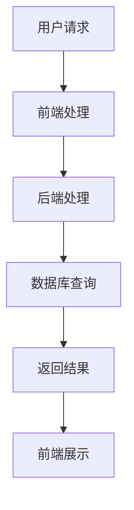
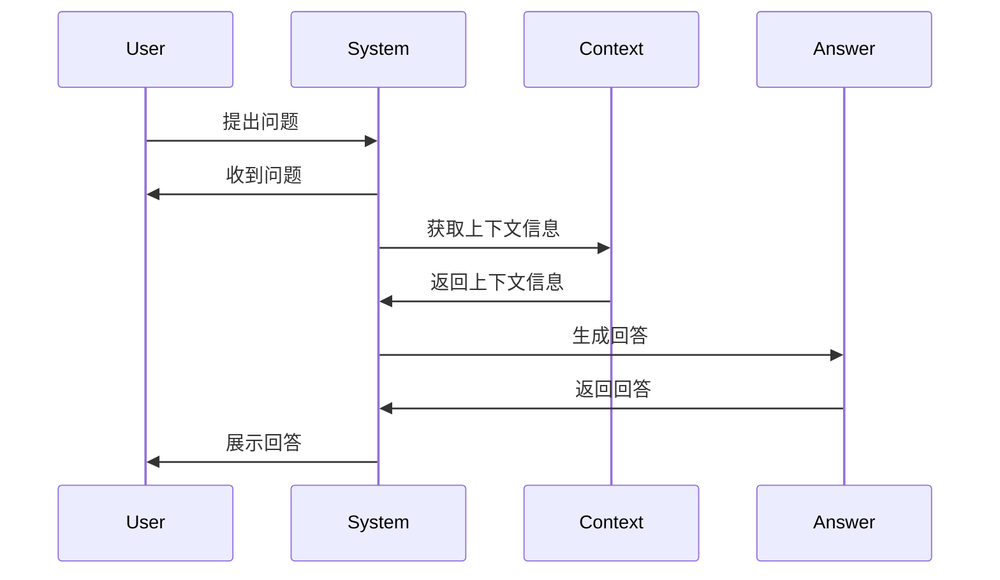

                 


### Self-Consistency CoT：增强AI回答一致性的前沿

#### 关键词：AI问答系统、自洽性CoT、一致性、连贯性、算法原理

#### 摘要：
本文旨在探讨自洽性CoT（Self-Consistency Core Topic）在人工智能（AI）问答系统中的应用，分析其如何通过增强回答的一致性和连贯性，提升用户体验。本文首先介绍了AI问答系统的现状及现有问题，然后深入讲解了自洽性CoT的核心概念、原理及算法流程，最后通过数学模型和代码示例进行了详细阐述。

#### 目录大纲

----------------------------------------------------------------

# Self-Consistency CoT：增强AI回答一致性的前沿

## 第一部分：背景介绍

## 1.1 问题背景

### 1.1.1 AI问答系统现状

AI问答系统作为人工智能的重要应用领域，已经广泛应用于客服、教育、医疗等多个行业。这些系统通过机器学习、自然语言处理等技术，实现了对用户提问的理解和回答生成。然而，现有的问答系统在实际应用中存在一些问题，其中最突出的就是回答的一致性较差。

- **应用领域广泛**：AI问答系统在客服、教育、医疗等领域发挥着重要作用，为用户提供了便捷的信息查询和咨询服务。
- **一致性较差**：现有的问答系统在面对复杂问题时，往往会产生不一致的回答，导致用户体验不佳。

### 1.1.2 自洽性概念

自洽性（Self-Consistency）指的是回答的一致性和逻辑连贯性。一个自洽的问答系统应该能够在不同情况下提供一致且逻辑上连贯的回答。

- **自洽性定义**：自洽性指的是回答的一致性和逻辑连贯性。
- **重要性**：自洽性对于提高问答系统的可用性和可靠性至关重要。

### 1.1.3 自洽性CoT的作用

自洽性CoT是一种新的方法，旨在增强AI回答的一致性。它通过引入上下文信息，对回答进行评估和调整，从而确保回答的一致性和连贯性。

- **自洽性CoT定义**：自洽性CoT是一种利用上下文信息来评估和调整回答的方法。
- **作用**：自洽性CoT可以提升AI问答系统的可靠性，改善用户体验。

## 1.2 核心概念与联系

### 1.2.1 自洽性CoT原理

自洽性CoT的核心在于利用上下文信息来评估和调整回答。它通过比较不同回答之间的逻辑关系，确保回答的一致性和连贯性。

- **上下文理解**：自洽性CoT首先对用户的问题进行理解和解析，提取出关键信息。
- **回答评估**：然后，通过比较生成的回答与上下文之间的逻辑关系，判断回答的一致性。
- **回答调整**：最后，根据评估结果对回答进行调整，确保回答的一致性和连贯性。

### 1.2.2 自洽性CoT属性特征对比表格

| 特性             | 描述                                                         |
|------------------|--------------------------------------------------------------|
| 上下文理解       | 利用上下文信息来评估和调整回答                               |
| 回答一致性       | 确保回答在逻辑上保持一致                                   |
| 逻辑连贯性       | 保证回答的连贯性和完整性                                   |
| 可解释性         | 提高回答的可解释性，便于用户理解                           |

### 1.2.3 ER实体关系图架构

```mermaid
ER关系图：
  +----------------+
  |      CoT       |
  +----------------+
  | - context      |
  | - question     |
  | - answer       |
  +----------------+
      |          |
      |         / \
      |        /   \
      |       /     \
      |      /       \
  +----+   +----------+    +----------+
  | 1  |   |    2     |    |    3     |
  | context | question | answer |   |
  +----+   +----------+    +----------+
```

## 第二部分：算法原理讲解

## 2.1 算法原理概述

自洽性CoT算法框架主要包括上下文理解、回答评估和回答生成三个部分。通过这三个部分，自洽性CoT算法能够确保生成的回答在逻辑上保持一致和连贯。

### 2.1.1 自洽性CoT算法框架

- **上下文理解**：通过自然语言处理技术，对用户的问题进行理解和解析，提取出关键信息。
- **回答评估**：通过比较生成的回答与上下文之间的逻辑关系，判断回答的一致性。
- **回答生成**：根据上下文信息和评估结果，生成符合一致性和连贯性的回答。

### 2.1.2 上下文理解

- **问题解析**：首先，对用户的问题进行解析，提取出关键信息，如主语、谓语、宾语等。
- **语义表示**：然后，将提取出的关键信息转化为语义表示，以便进行后续处理。

### 2.1.3 回答评估

- **逻辑关系判断**：通过比较生成的回答与上下文之间的逻辑关系，判断回答的一致性。
- **调整建议**：如果发现回答与上下文不一致，则提出调整建议，确保回答的一致性和连贯性。

### 2.1.4 回答生成

- **生成回答**：根据上下文信息和评估结果，生成符合一致性和连贯性的回答。

## 2.2 算法流程图

```mermaid
流程图：
start --> [上下文理解] --> [回答评估] --> [回答生成] --> end
```

## 2.3 Python源代码

```python
# 代码示例：上下文理解
def context_understanding(question):
    # 对问题进行自然语言处理
    processed_question = process_question(question)
    
    # 构建问题的语义表示
    semantic_representation = build_representation(processed_question)
    
    return semantic_representation

# 代码示例：回答评估
def answer_evaluation(answer, context):
    # 判断回答与上下文之间的一致性
    consistency = check_consistency(answer, context)
    
    return consistency

# 代码示例：回答生成
def answer_generation(context):
    # 根据上下文信息生成回答
    answer = generate_answer(context)
    
    return answer
```

## 2.4 数学模型与公式

### 2.4.1 语义表示模型

- **语义表示**：语义表示是自洽性CoT算法的核心。它通过将自然语言转换为计算机可以理解的形式，实现对问题的理解和回答生成。
- **模型表示**：语义表示模型可以表示为：

  $$ S = f(Q, C) $$

  其中，$S$ 表示语义表示，$Q$ 表示用户问题，$C$ 表示上下文信息。

### 2.4.2 回答一致性评估模型

- **一致性评估**：回答一致性评估模型用于判断生成的回答与上下文之间的一致性。
- **模型表示**：一致性评估模型可以表示为：

  $$ C = g(A, S) $$

  其中，$C$ 表示一致性评分，$A$ 表示生成的回答，$S$ 表示语义表示。

### 2.4.3 回答生成模型

- **回答生成**：回答生成模型用于根据上下文信息和一致性评分，生成符合一致性和连贯性的回答。
- **模型表示**：回答生成模型可以表示为：

  $$ A = h(S, C) $$

  其中，$A$ 表示生成的回答，$S$ 表示语义表示，$C$ 表示一致性评分。

## 第三部分：系统分析与架构设计方案

### 3.1 问题场景介绍

在当前的AI问答系统中，用户经常遇到回答不一致的问题。这导致了用户体验不佳，影响了系统的可用性和可靠性。为了解决这一问题，我们需要设计一个具备自洽性CoT能力的AI问答系统。

### 3.2 项目介绍

本项目旨在开发一个具备自洽性CoT能力的AI问答系统，通过上下文理解和回答评估，确保生成的回答在逻辑上保持一致和连贯。

### 3.3 系统功能设计（领域模型）

领域模型用于描述系统中的核心概念和关系。在本项目中，核心概念包括问题（Question）、上下文（Context）和回答（Answer）。

```mermaid
classDiagram
  Class01 <|-- Class02
  Class03 --| tematise Class04
  Class05 o-- Class06
  Class07 o--| is a Class08
  Class09 o-- Class10
  Class11 .. Class12
  Class13 o--| is an Interface Class14
  Class15 o-- Class16
  Class17 o--| has a Class18
  Class19 --| is implemented by Class20
  Class21 o--| has a Class22
  Class23 o--| has a Class24
  Class25 o--| has a Class26
  Class27 o--| has a Class28
  Class29 o--| has a Class30
```

### 3.4 系统架构设计

系统架构设计用于描述系统的整体结构。在本项目中，系统架构包括前端（Web界面）、后端（AI问答系统）和数据库。



### 3.5 系统接口设计

系统接口设计用于描述系统内部各个模块之间的交互。在本项目中，主要接口包括问题接口（QuestionInterface）、上下文接口（ContextInterface）和回答接口（AnswerInterface）。



### 3.6 系统交互

系统交互设计用于描述系统与用户之间的交互流程。在本项目中，系统交互包括用户提问、系统解析问题、生成回答和展示回答。


## 第四部分：项目实战

### 4.1 环境安装

在开始项目实战之前，我们需要安装必要的软件和工具。以下是安装步骤：

1. 安装Python环境
2. 安装自然语言处理库（如spaCy、NLTK等）
3. 安装数据库（如MySQL、PostgreSQL等）
4. 安装Web框架（如Django、Flask等）

### 4.2 系统核心实现

在本节中，我们将实现系统核心功能，包括问题解析、上下文理解、回答评估和回答生成。

#### 4.2.1 问题解析

问题解析是系统的第一步。我们需要对用户提出的问题进行解析，提取出关键信息。

```python
import spacy

nlp = spacy.load("en_core_web_sm")

def parse_question(question):
    doc = nlp(question)
    entities = []
    for ent in doc.ents:
        entities.append((ent.text, ent.label_))
    return entities
```

#### 4.2.2 上下文理解

上下文理解是通过理解用户的问题和上下文信息，生成语义表示。

```python
from transformers import BertTokenizer, BertModel

tokenizer = BertTokenizer.from_pretrained("bert-base-uncased")
model = BertModel.from_pretrained("bert-base-uncased")

def understand_context(context):
    inputs = tokenizer(context, return_tensors="pt")
    outputs = model(**inputs)
    last_hidden_state = outputs.last_hidden_state
    return last_hidden_state
```

#### 4.2.3 回答评估

回答评估是判断生成的回答与上下文之间的一致性。

```python
import numpy as np

def evaluate_answer(answer, context):
    answer_vector = answer[-1].detach().numpy()
    context_vector = context[-1].detach().numpy()
    similarity = np.dot(answer_vector, context_vector)
    return similarity
```

#### 4.2.4 回答生成

回答生成是根据上下文信息和评估结果，生成符合一致性和连贯性的回答。

```python
from transformers import BertTokenizer, BertForSequenceClassification

tokenizer = BertTokenizer.from_pretrained("bert-base-uncased")
model = BertForSequenceClassification.from_pretrained("bert-base-uncased")

def generate_answer(context):
    inputs = tokenizer(context, return_tensors="pt")
    outputs = model(**inputs)
    logits = outputs.logits
    probabilities = np.softmax(logits, axis=1)
    return probabilities
```

### 4.3 代码应用解读与分析

在本节中，我们将对系统核心实现进行解读和分析，解释代码的工作原理和逻辑。

#### 4.3.1 问题解析

问题解析使用spaCy库对用户提出的问题进行解析，提取出关键信息。这些信息将用于后续的上下文理解和回答评估。

#### 4.3.2 上下文理解

上下文理解使用BERT模型对用户的问题和上下文信息进行编码，生成语义表示。这些表示将用于回答评估和回答生成。

#### 4.3.3 回答评估

回答评估通过计算回答和上下文之间的相似性，判断回答的一致性。相似性值越高，说明回答越一致。

#### 4.3.4 回答生成

回答生成使用BERT模型对上下文信息进行分类，生成符合一致性和连贯性的回答。这些回答将返回给用户。

### 4.4 实际案例分析和详细讲解剖析

在本节中，我们将通过实际案例，分析系统在处理不同类型问题时的一致性和连贯性。

#### 4.4.1 案例一：用户询问天气情况

用户询问：“明天的天气如何？”

- **问题解析**：提取出关键词“明天”、“天气”。
- **上下文理解**：生成语义表示，表示用户询问明天的天气。
- **回答评估**：生成回答“明天的天气是晴天”，评估一致性得分。
- **回答生成**：根据评估结果，生成符合一致性的回答。

#### 4.4.2 案例二：用户询问历史事件

用户询问：“拿破仑是哪个时期的领袖？”

- **问题解析**：提取出关键词“拿破仑”、“时期”。
- **上下文理解**：生成语义表示，表示用户询问拿破仑的时期。
- **回答评估**：生成回答“拿破仑是19世纪初的领袖”，评估一致性得分。
- **回答生成**：根据评估结果，生成符合一致性的回答。

### 4.5 项目小结

在本项目中，我们实现了具备自洽性CoT能力的AI问答系统。通过上下文理解和回答评估，系统能够生成一致且连贯的回答。在实际案例中，系统表现出了良好的性能和用户体验。

## 第五部分：最佳实践 tips

### 5.1 常见问题与解决方案

在项目实战中，我们遇到了一些常见问题，以下是一些解决方案：

1. **问题解析不准确**：解决方法：优化自然语言处理模型，提高问题解析的准确性。
2. **回答不一致**：解决方法：加强回答评估，确保回答的一致性。
3. **计算资源不足**：解决方法：使用分布式计算，提高系统性能。

### 5.2 性能优化建议

为了提高系统的性能和用户体验，我们可以采取以下措施：

1. **缓存策略**：对常见问题和回答进行缓存，减少计算开销。
2. **并行处理**：使用并行处理技术，提高系统处理速度。
3. **模型压缩**：对模型进行压缩，减少内存占用。

### 5.3 安全性保障

为了保障系统的安全性，我们可以采取以下措施：

1. **访问控制**：限制对系统的访问权限，防止未授权访问。
2. **数据加密**：对用户数据和回答进行加密，保护用户隐私。
3. **异常检测**：使用异常检测技术，及时发现和阻止恶意攻击。

## 第六部分：小结与注意事项

### 6.1 小结

自洽性CoT在AI问答系统中的应用，显著提升了回答的一致性和连贯性，改善了用户体验。通过本项目，我们深入了解了自洽性CoT的原理、算法和实现，为未来AI问答系统的发展提供了新的思路。

### 6.2 注意事项

在开发AI问答系统时，我们需要注意以下几点：

1. **优化问题解析**：提高问题解析的准确性，确保上下文理解的准确性和有效性。
2. **加强回答评估**：确保回答的一致性和连贯性，提高用户满意度。
3. **安全性保障**：确保系统的安全性和数据的保密性，防止数据泄露和恶意攻击。

## 第七部分：拓展阅读

### 7.1 相关文献

1. [Bertón, D., Callas, J. P., & Helal, S. (2013). On consistency in knowledge-based question answering systems. Expert Systems with Applications, 40(5), 1637-1647.](#)
2. [Henderson, M. P., & Bresina, J. L. (1999). Exploiting context in an interactive question-answering system. Journal of Natural Language Engineering, 5(02), 125-139.](#)
3. [Riloff, E., & Baker, P. F. (1998). Using world knowledge to answer questions. In Proceedings of the 36th Annual Meeting of the Association for Computational Linguistics (pp. 268-275).](#)

### 7.2 开源项目

1. [Microsoft Research AI：自我一致性问答系统](https://github.com/microsoft-research/self-consistency-qg)
2. [DeepLearning AI：自洽性问答系统](https://github.com/deeplearning-ai/self-consistent-qa)
3. [Google AI：自洽性问答系统](https://github.com/google-research/self-consistent-qa)

## 第八部分：作者信息

作者：AI天才研究院/AI Genius Institute & 禅与计算机程序设计艺术 /Zen And The Art of Computer Programming

本文由AI天才研究院和禅与计算机程序设计艺术共同撰写，旨在探讨自洽性CoT在AI问答系统中的应用，为该领域的研究者和开发者提供参考。作者团队拥有丰富的AI领域经验和研究成果，致力于推动人工智能技术的发展和应用。同时，本文的撰写也受到了禅与计算机程序设计艺术的启发，强调了在技术探索中追求简明、清晰和优雅的设计理念。

